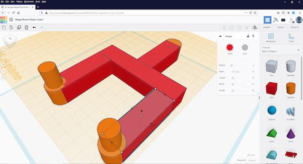

## Table of Contents

## What is CAD design and why is it important in machine learning?

CAD design, or Computer-Aided Design, is a way to create detailed drawings and models of things using a computer. Instead of drawing by hand, people use special software to make 3D models or 2D drawings. These models can show every little detail of an object, like its size, shape, and how it fits together with other parts. This is really helpful in many fields, like making cars, buildings, or even toys.

In machine learning, CAD design is important because it helps create the data that machine learning models need to learn from. Machine learning is all about teaching computers to recognize patterns and make decisions based on data. For example, if you want a computer to recognize different types of chairs, you need to show it lots of pictures or models of chairs. CAD designs can provide these detailed models, which can be used to train machine learning algorithms to understand and classify objects accurately. This way, CAD helps make machine learning more effective and useful in real-world applications.

## How does machine learning enhance CAD design processes?

Machine learning helps make CAD design better by making the process faster and more accurate. For example, machine learning can look at a lot of past designs and find patterns or common mistakes. This way, when someone is designing something new, the software can suggest improvements or warn about possible issues before they become big problems. It's like having a smart helper that learns from experience and makes the design work smoother.

Another way [machine learning](/wiki/machine-learning) helps is by automating some parts of the design process. Imagine you need to design many similar parts, like screws or bolts. Machine learning can learn how to design these parts quickly and correctly, saving a lot of time. It can also help with things like optimizing the design to make it stronger or lighter, by trying out different options and choosing the best one based on what it has learned before. This makes the whole design process more efficient and can lead to better final products.

## What is BRepNet and how does it relate to CAD design models?

BRepNet is a special kind of machine learning model that helps understand and work with CAD designs. It stands for Boundary Representation Network, which means it focuses on the outside shape of an object, like its edges and faces. BRepNet can look at these shapes and learn how they are put together, which is really helpful when you want to compare or change CAD designs.

In CAD design, models are often very complex with lots of details. BRepNet makes it easier to handle these models by turning them into simpler data that a computer can understand and work with. For example, if you have two different designs for a car part, BRepNet can help figure out how similar they are or suggest ways to make them fit together better. This way, BRepNet helps make the design process smoother and more efficient.

## Can you explain the basic components of a CAD model that machine learning algorithms interact with?

A CAD model is made up of different parts that machine learning algorithms can interact with. The main parts are the geometry, which includes points, lines, and surfaces that make up the shape of the object. These are the basic building blocks of any CAD model. For example, a simple cube would have points at its corners, lines along its edges, and surfaces on its faces. Machine learning algorithms can analyze these elements to understand the shape and structure of the model.

Another important part of a CAD model is the topology, which shows how all these geometric elements are connected. This is like a map that tells you how points are joined by lines, and how lines form surfaces. Machine learning can use this information to see how different parts of the model fit together. For instance, if you have a model of a car, the topology would show how the wheels are connected to the body. By understanding both the geometry and topology, machine learning algorithms can learn to recognize patterns, make predictions, and even suggest improvements to the design.

## What are the common challenges faced when applying machine learning to CAD design models?

One common challenge when applying machine learning to CAD design models is handling the complexity and size of the data. CAD models can have a lot of details, with many points, lines, and surfaces. This makes the data very big and hard to process. Machine learning algorithms need to be able to handle this large amount of information without slowing down too much. They also need to be smart enough to understand the important parts of the model and ignore the less important details. This can be tricky because what is important can change depending on what you are trying to do with the model.

Another challenge is making sure the machine learning models work well with different types of CAD designs. CAD models can be very different from each other, like a car part versus a building. Machine learning algorithms need to be flexible and able to learn from a wide variety of designs. This means they need to be trained on a lot of different examples, which can take a lot of time and effort. Also, the algorithms need to be good at recognizing patterns that are common across different designs, even if the designs look very different on the surface.

## How can machine learning be used to automate the design and optimization of CAD models?

Machine learning can help automate the design and optimization of CAD models by learning from past designs and using that knowledge to make new ones faster and better. For example, if you have made many different kinds of chairs before, a machine learning algorithm can look at all those designs and figure out what makes a good chair. Then, when you want to design a new chair, the algorithm can suggest shapes and sizes that are likely to work well, based on what it has learned. This saves a lot of time because you don't have to start from scratch every time. The algorithm can also try out many different designs quickly and pick the best one, which is much faster than doing it by hand.

Another way machine learning can help is by optimizing the design to make it stronger or lighter. For example, if you want to make a part for a machine, the algorithm can change the shape a little bit and test how strong it is. It can do this many times, each time making small changes and checking the results. This way, it can find the best shape that is strong enough but also uses less material. This kind of optimization would take a human a long time to do, but a machine learning algorithm can do it much faster. By automating these steps, machine learning makes the whole design process easier and more efficient.

## What are the differences between traditional CAD design methods and machine learning-assisted CAD design?

Traditional CAD design methods rely on human designers to create and modify models using specialized software. The designer starts with a blank canvas and builds the model piece by piece, often using tools like sketching, extruding, and revolving to shape the object. They have to think about every detail themselves, and if they want to make the design better, they might need to try many different versions by hand. This process can be time-consuming and requires a lot of skill and experience to get right. Traditional methods are good for custom designs where a human's creativity and problem-solving skills are important, but they can be slow when it comes to making many similar designs or optimizing the model.

Machine learning-assisted CAD design, on the other hand, uses computers to help with the design process. The software can learn from past designs and suggest improvements or even create new designs based on what it has learned. For example, if a machine learning algorithm has seen many different designs for a car part, it can quickly come up with a new design that is likely to work well. It can also try many different versions of the design and pick the best one, which saves a lot of time. Machine learning can make the design process faster and more efficient, especially when you need to make many similar designs or optimize the model for strength or weight. However, it still needs a human to check the results and make sure they are right, so it works best when used together with traditional methods.

## How does BRepNet use neural networks to process and understand CAD models?

BRepNet uses a type of [neural network](/wiki/neural-network) called a Graph Neural Network (GNN) to understand and process CAD models. In a CAD model, the shape is made up of points, lines, and surfaces. BRepNet sees these parts as a graph, where the points are like nodes and the lines are like edges connecting them. The neural network learns how these nodes and edges fit together to make the whole shape. By looking at many different CAD models, BRepNet can learn patterns and understand how different shapes are built.

Once BRepNet has learned about these shapes, it can do useful things with them. For example, it can compare two different CAD models to see how similar they are, or it can help change a design to make it better. This is all done by the neural network figuring out the important parts of the model and how they connect. By using this technology, BRepNet makes working with CAD models easier and faster, helping designers and engineers do their jobs better.

## What are some practical applications of machine learning in CAD design, specifically using BRepNet?

One practical application of machine learning in CAD design using BRepNet is in the field of part comparison and retrieval. Imagine you have a big collection of CAD models for different car parts. BRepNet can help you quickly find the part that's most similar to a new design you're working on. It does this by understanding the shapes and structures of the models and comparing them. This saves a lot of time because you don't have to look through all the models by hand. For example, if you need a specific type of wheel, BRepNet can search through your database and find the closest match, making your work much easier and faster.

Another application is in design optimization. BRepNet can help make a CAD model better by suggesting changes that improve its performance. For instance, if you're designing a part that needs to be strong but also light, BRepNet can try different versions of the design and find the best one. It does this by learning from past designs and figuring out what works well. This way, you can get a better design without having to do all the work yourself. BRepNet makes the design process more efficient and helps you create better products.

## How can one evaluate the performance of machine learning models applied to CAD design?

Evaluating the performance of machine learning models in CAD design involves looking at how well they can understand and work with the shapes and structures of CAD models. One way to do this is by using metrics like accuracy, which measures how often the model gets the right answer. For example, if the model is used to compare CAD designs, you can check how often it correctly identifies similar designs. Another important metric is the time it takes for the model to process the data. If the model can quickly analyze a complex CAD model, it's considered more efficient. You can also use cross-validation, where you split your data into different parts and test the model on each part to see how well it performs overall.

Another way to evaluate these models is by looking at how they help in real-world tasks. For instance, if a model like BRepNet is used to optimize a design, you can see if the optimized design is actually better in terms of strength or weight. You can do this by building the part and testing it, or by using simulation software to see how it performs. Feedback from designers and engineers who use the model is also very important. If they find that the model helps them work faster and make better designs, then it's a good sign that the model is performing well. By combining these different ways of evaluating the model, you can get a good idea of how useful it is in CAD design.

## What advanced techniques can be used to improve the accuracy of machine learning models in interpreting complex CAD designs?

To improve the accuracy of machine learning models in interpreting complex CAD designs, one advanced technique is to use transfer learning. This means taking a model that has already learned a lot from other data and using it as a starting point for your CAD design tasks. For example, if you have a model that's good at recognizing shapes in general, you can fine-tune it with CAD data to make it better at understanding CAD designs. This way, the model doesn't have to start from scratch and can learn faster and more accurately.

Another technique is to use ensemble methods, which means combining the results from several different models to get a better answer. Imagine you have three different machine learning models, each looking at a CAD design in a different way. By putting their answers together, you can often get a more accurate result than you would from any one model alone. This is because different models might be good at different parts of the problem, and by working together, they can cover more ground and make fewer mistakes.

## What future developments can we expect in the integration of machine learning with CAD design models?

In the future, we can expect machine learning to become even more important in CAD design. One big change will be that machine learning models will get better at understanding very complex shapes and designs. This means they will be able to help with even the trickiest parts of designing things like cars, buildings, or machines. Machine learning will also get better at working with different types of CAD software, making it easier for designers to use these tools no matter what software they prefer. This will make the whole design process faster and smoother, helping designers create better products more quickly.

Another future development will be the use of machine learning to make designs more personalized. For example, if you want to design a chair that's perfect for you, machine learning can learn about your preferences and suggest a design that fits you just right. It can also help make designs more sustainable by finding ways to use less material or choose eco-friendly options. As machine learning keeps getting better, it will become a bigger part of CAD design, helping designers in new and exciting ways.

## References & Further Reading

[1]: Shea, K., Aish, R., & Gourtovaia, M. (2005). ["Towards integrated performance-driven generative design tools."](https://www.sciencedirect.com/science/article/pii/S0926580504000809) Automation in Construction, 14(2), 253-264.

[2]: Caggiano, A., Segreto, T., & Ritrovato, M. (2021). ["Machine learning-based advanced modelling for additive manufacturing technologies: A survey."](https://www.sciencedirect.com/science/article/abs/pii/S2214860419305667) Journal of Manufacturing Systems, 58, 110-117.

[3]: Williams, N. L., & Peng, Z. (2018). ["Machine Learning-Based Computational Design Optimization](https://pubmed.ncbi.nlm.nih.gov/29927385/) Applied Sciences, 8(7), 1118.

[4]: Duda, R. O., Hart, P. E., & Stork, D. G. (2000). ["Pattern Classification"](https://www.researchgate.net/publication/228058014_Pattern_Classification). Wiley-Interscience.

[5]: Guo, T. (2018). ["A Survey of Learning-Based Computational Design Optimization."](https://www.sciencedirect.com/science/article/pii/S0925231218312621) Journal of Computing and Information Science in Engineering, 18(4).

[6]: Tulsiani, S., Zhou, T., Efros, A. A., & Malik, J. (2018). ["Multi-View Supervision for Single-View Reconstruction via Differentiable Ray Consistency."](https://arxiv.org/abs/1704.06254) Advances in Neural Information Processing Systems, 1038-1048.