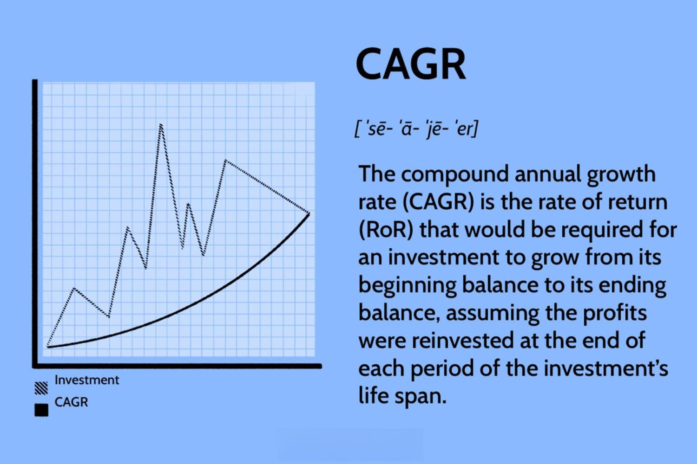

In algorithmic trading, the Compound Annual Growth Rate (CAGR) is often cited as a key performance measure. CAGR provides a useful means of evaluating the annualized return of an investment by accounting for the compounding effect of gains over time. The significance of CAGR lies in its ability to offer a smoothed annual growth figure, eliminating the influence of short-term market volatility and allowing traders to compare the performance of different strategies over the same period.

Determining what qualifies as a 'good' CAGR can be complex and is heavily influenced by several factors, including the risk profile of the investment strategy and prevailing market conditions. Different trading strategies carry varying levels of risk, and the expected CAGR should align with the risk tolerance of the trader or the investment mandate of the trading firm. Generally, investors seek a CAGR that surpasses common market benchmarks, such as the S&P 500's historical average of approximately 9%.



This article will explore the significance of CAGR within the context of algo trading, highlighting essential considerations for traders when evaluating their strategies. By understanding the nuance of CAGR and its application, traders can better assess strategy effectiveness and align their investment goals with potential returns.

## Table of Contents

## Understanding CAGR in Algo Trading

CAGR, or Compound Annual Growth Rate, is a pivotal metric in algorithmic trading, as it encapsulates the annualized return of an investment over a specified period, assuming that profits are reinvested at the end of each year. This measure is instrumental in providing a normalized comparison of returns across different investments, reflecting the time value of money—an essential [factor](/wiki/factor-investing) in investment decision-making. By presenting a smoothed annual growth rate, CAGR allows traders and investors to assess and compare the performance of trading strategies over time, effectively stripping away the noise generated by short-term volatility.

In the context of algorithmic trading, CAGR serves as a benchmark for gauging the long-term effectiveness of various trading algorithms. This is particularly important because algorithmic trading strategies can exhibit diverse performance profiles, contingent on market conditions, asset classes, and strategy parameters. By utilizing CAGR, traders can discern the growth rate of their capital across different periods, offering insight into the strategy's capability to generate consistent profits.

The calculation of CAGR adheres to a mathematical formula:

$$
\text{CAGR} = \left( \frac{\text{Ending Value}}{\text{Beginning Value}} \right)^{\frac{1}{\text{Number of Years}}} - 1
$$

This formula ensures that the complexity of compounding is aptly accounted for, providing a coherent figure that abstracts the annual growth rate of the investment. In [algorithmic trading](/wiki/algorithmic-trading) systems, employing CAGR enables traders not only to evaluate a strategy's past performance but also to optimize future strategies by setting realistic performance benchmarks based on historical data. As such, it underscores the potential of an algorithm to grow invested capital efficiently over a given timeframe, offering a pivotal tool for performance assessment in the algorithmic trading landscape.

## How to Calculate CAGR

To calculate the Compound Annual Growth Rate (CAGR), you require three key inputs: the initial investment value, the final investment value, and the duration of the investment in years. The formula used to determine CAGR is as follows:

$$
\text{CAGR} = \left( \frac{\text{Ending Value}}{\text{Beginning Value}} \right)^{\frac{1}{\text{Number of Years}}} - 1
$$

This formula provides a smooth annual growth rate over the investment period, representing the rate at which the investment would have grown if it had appreciated at the same rate every year. For example, consider an investment that grows from $1,000 to $1,250 over four years. The calculation of CAGR in this context would be:

$$
\text{CAGR} = \left( \frac{1250}{1000} \right)^{\frac{1}{4}} - 1
$$

After solving, this results in a CAGR of approximately 5.7%.

In practice, this formula can be easily implemented in programming languages such as Python for automation and analysis of multiple scenarios or investment timelines. Here's a simple Python function to calculate CAGR:

```python
def calculate_cagr(beginning_value, ending_value, number_of_years):
    return (ending_value / beginning_value) ** (1 / number_of_years) - 1

# Example usage
beginning_value = 1000
ending_value = 1250
number_of_years = 4

cagr = calculate_cagr(beginning_value, ending_value, number_of_years)
print(f"The CAGR is approximately {cagr:.2%}")
```

This function takes the beginning and ending values of an investment, along with the time span, and computes the CAGR, outputting it as a percentage to make it more interpretable. Such computational tools facilitate precise analyses when comparing various investment strategies in algorithmic trading.

## What is Considered a Good CAGR in Algo Trading?

A good Compound Annual Growth Rate (CAGR) in algorithmic trading is subjective and varies depending on the strategy's context and specific objectives. Evaluating a "good" CAGR involves considering multiple factors, including the comparative performance to market benchmarks and the risk profile of the trading strategy.

Typically, a CAGR that outperforms major market indices, such as the S&P 500, is deemed favorable. Historically, the S&P 500 has achieved an average annual growth rate of about 9%. Therefore, a trading strategy that surpasses this benchmark may be considered effective. However, the desirability of a particular CAGR also hinges on the associated [volatility](/wiki/volatility-trading-strategies) and the risk appetite of the investor.

Higher-risk trading strategies often aim for greater CAGRs to justify the increased exposure to market fluctuations and potential drawdowns. For example, strategies employing leverage may achieve higher CAGRs, but the accompanying risk is substantially elevated. In such cases, traders should weigh the potential returns against the possible financial setbacks.

Moreover, it's essential to contextualize CAGR in the framework of the wider investment strategy. Traders should assess how the growth rate aligns with their long-term financial goals and risk tolerance. A more conservative strategy may target a CAGR in line with broader market averages, focusing on stability rather than aggressive growth. Conversely, speculative strategies might pursue well above-average CAGRs, albeit with higher inherent risks.

Ultimately, assessing a good CAGR in algo trading should incorporate broader evaluation metrics, including Sharpe ratio or Sortino ratio, to provide a balanced view that considers both return and risk.

## Pros and Cons of Relying on CAGR

CAGR, or Compound Annual Growth Rate, provides a convenient method to summarize an investment's growth over time, smoothing out fluctuations by assuming the gains are compounded yearly. This feature makes it appealing as it offers a clear, digestible figure representing an average annual growth rate. By factoring in compound interest, CAGR facilitates straightforward comparisons between different investments or trading strategies, accounting for the time value of money.

However, despite its advantages, CAGR has notable limitations. One of the major drawbacks is its inability to capture the volatility or drawdowns that an investment might experience throughout its term. For instance, a strategy may show a high CAGR, suggesting robust growth, but this number might mask periods of significant losses. Knowing these drawdowns is essential for understanding the potential risks of a trading strategy, especially for traders who need to manage risk actively.

Moreover, CAGR does not reflect the impact of cash flow timings. In practice, investments often have varying cash flows due to additional investments, withdrawals, or reinvested gains. CAGR assumes a smooth growth path, ignoring these timing variations, which can lead to an inaccurate portrayal of actual performance in situations where cash flow patterns play a critical role.

For these reasons, while CAGR is a valuable tool, it should not be used in isolation. To form a comprehensive picture of an investment's performance, hedging against its limitations is vital by analyzing different metrics that account for volatility and the timing of cash flows.

## Adjusting CAGR for Real-World Conditions

CAGR, or Compound Annual Growth Rate, is a valuable metric for understanding the performance of an investment over time. However, its calculation assumes constant growth without accounting for real-world conditions that can impact trading outcomes, particularly in algorithmic trading. When evaluating trading strategies, adjustments may be necessary to better reflect actual market conditions.

For shorter investment periods or when dealing with fractional years, simply applying the traditional CAGR formula may not accurately represent performance. In such cases, traders can prorate the investment period to align more closely with the actual timeframe. This involves a modified calculation where the fractional year is considered in the exponent. For example, if the investment period is 2.5 years, the formula would adjust as follows:

$$
\text{CAGR} = \left(\frac{\text{Ending Value}}{\text{Beginning Value}}\right)^{\frac{1}{2.5}} - 1
$$

In algo trading, additional factors such as transaction costs, slippage, and market inefficiencies can significantly affect returns. Transaction costs include brokerage fees and taxes, which can erode profits. Slippage refers to the difference between the expected price of a trade and the actual price, influenced by volatility and [liquidity](/wiki/liquidity-risk-premium). These elements should be integrated into the performance assessment to ensure accurate CAGR calculations. By accounting for these variables, traders can better predict net returns rather than gross returns.

Additionally, employing risk-adjusted metrics alongside CAGR offers a more nuanced evaluation of strategy performance. Metrics such as the Sharpe Ratio or Sortino Ratio help adjust returns concerning their associated risk levels:

- **Sharpe Ratio**: $\frac{\text{CAGR} - \text{Risk-free rate}}{\text{Standard deviation of returns}}$
- **Sortino Ratio**: $\frac{\text{CAGR} - \text{Risk-free rate}}{\text{Downside deviation}}$

These ratios provide insight into the risk-adjusted returns, offering a clearer picture of strategy viability compared to CAGR alone. Consequently, while CAGR remains a fundamental tool, integrating it with these adjustments and additional metrics results in a more realistic and actionable analysis in algorithmic trading.

## Final Considerations for Algo Traders

When evaluating the effectiveness of algorithmic trading strategies, relying solely on the Compound Annual Growth Rate (CAGR) may provide an incomplete picture. While CAGR is valuable in assessing the long-term growth of an investment, it is crucial to incorporate other performance indicators to gain a comprehensive understanding of strategy effectiveness. These metrics could include Sharpe ratio, maximum drawdown, and volatility, among others. Each of these additional metrics offers unique insights that can highlight strengths or reveal hidden risks in a trading strategy.

It's essential for traders to align their expectations of CAGR with their individual risk tolerance and investment objectives. A higher CAGR may indicate successful growth, but it could also entail greater risk exposure. Risk-tolerant investors might prioritize higher CAGRs, aiming for potentially higher returns, whereas risk-averse investors might prefer steadier, more predictable growth with lower CAGRs.

Continuous monitoring and adjustment of trading strategies are crucial for maintaining or improving CAGR over time. Markets are dynamic, constantly influenced by numerous factors such as economic data releases, geopolitical events, and shifts in market sentiment. Algorithmic traders must remain vigilant, regularly reviewing their strategies to ensure they are adapting to current market conditions. This might involve tweaking algorithmic parameters, altering risk management settings, or even replacing outdated models with more sophisticated ones.

In practical terms, traders can engage in [backtesting](/wiki/backtesting) to simulate a strategy's performance using historical data, allowing them to fine-tune their approaches without financial risk. Additionally, real-time performance monitoring can help traders identify deviations from expected outcomes promptly, providing opportunities to make necessary modifications. By adopting a proactive approach, traders can better position themselves to achieve their desired CAGRs, in alignment with their broader investment goals.

## Conclusion

CAGR, or Compound Annual Growth Rate, is a foundational metric in algorithmic trading that serves as a critical measure for assessing the long-term performance of investment strategies. By quantifying the annual growth rate of an investment as if it had grown at a steady rate, CAGR provides traders with a straightforward and comparable view of how their investments are performing over time. This consistency makes it particularly valuable in evaluating the effectiveness of algo trading strategies, where understanding the potential for growth under various market conditions is essential.

However, defining what constitutes a 'good' CAGR is inherently subjective and varies based on several factors. The acceptable rate of return depends significantly on the risk profile of the trading strategy, prevailing market conditions, and the individual goals of the trader. For instance, while a CAGR exceeding the historical average of major indices like the S&P 500 might be deemed favorable, higher-risk strategies might aim for even greater CAGRs to compensate for increased levels of volatility and potential drawdowns. 

For traders, relying solely on CAGR might not provide a complete picture of a strategy’s performance. It is important to complement CAGR with additional performance measures, such as volatility metrics, Sharpe ratio, and maximum drawdown, among others. These metrics can offer insights into aspects like risk-adjusted returns and the stability of the investment over time, leading to more informed decision-making.

In conclusion, while CAGR is an indispensable tool in the performance evaluation toolkit of algorithmic traders, it should not be used in isolation. By integrating CAGR with other performance metrics, traders can attain a holistic understanding of their strategy's effectiveness, enabling them to align their trading outcomes with their risk tolerance and investment objectives. Regularly reviewing and adjusting strategies based on a comprehensive set of performance indicators is crucial for maintaining or enhancing CAGR in the long term.

## FAQs

What does CAGR stand for in the trading world?

CAGR stands for Compound Annual Growth Rate. It is a crucial metric used to measure the mean annual growth rate of an investment over a specified time period longer than one year, assuming the profits are reinvested at the end of each period. Unlike annualized returns, which may simply compute the equivalent annual percentage return of the total growth without considering compounding, CAGR provides a smoothed rate of growth that accounts for the effects of compounding. This makes it a particularly useful metric for comparing the performance of different investments or trading strategies over time.

How is CAGR different from other performance metrics?

CAGR is distinctive from several other performance metrics due to its focus on compounded growth over multiple periods. While metrics like Total Return provide the overall gain or loss from an investment over a period, they do not consider the annualized aspect of growth. Similarly, Annual Return measures performance over single periods without necessarily accounting for compounding effects. CAGR’s ability to present a constant annual growth rate makes it beneficial for comparing strategies, particularly in algorithmic trading, where time-weighted results matter.

Why is CAGR significant in evaluating trading strategies?

CAGR is significant in evaluating trading strategies as it encapsulates the performance direction and magnitude over the years, providing a clear picture of how well a strategy grows wealth on an annual basis with compounding. It helps traders compare different strategies against market benchmarks or risk-free rates to ascertain relative performance. This metric assumes reinvestment of profits, often aligning more closely with actual trading conditions. Using CAGR, traders can identify persistent trends in strategy performance, which is critical for making informed decisions about portfolio adjustments or strategy optimization.

## References & Further Reading

[1]: Bergstra, J., Bardenet, R., Bengio, Y., & Kégl, B. (2011). ["Algorithms for Hyper-Parameter Optimization."](https://dl.acm.org/doi/10.5555/2986459.2986743) Advances in Neural Information Processing Systems 24.

[2]: ["Advances in Financial Machine Learning"](https://www.amazon.com/Advances-Financial-Machine-Learning-Marcos/dp/1119482089) by Marcos Lopez de Prado

[3]: ["Evidence-Based Technical Analysis: Applying the Scientific Method and Statistical Inference to Trading Signals"](https://www.amazon.com/Evidence-Based-Technical-Analysis-Scientific-Statistical/dp/0470008741) by David Aronson

[4]: ["Machine Learning for Algorithmic Trading"](https://github.com/stefan-jansen/machine-learning-for-trading) by Stefan Jansen

[5]: ["Quantitative Trading: How to Build Your Own Algorithmic Trading Business"](https://books.google.com/books/about/Quantitative_Trading.html?id=j70yEAAAQBAJ) by Ernest P. Chan