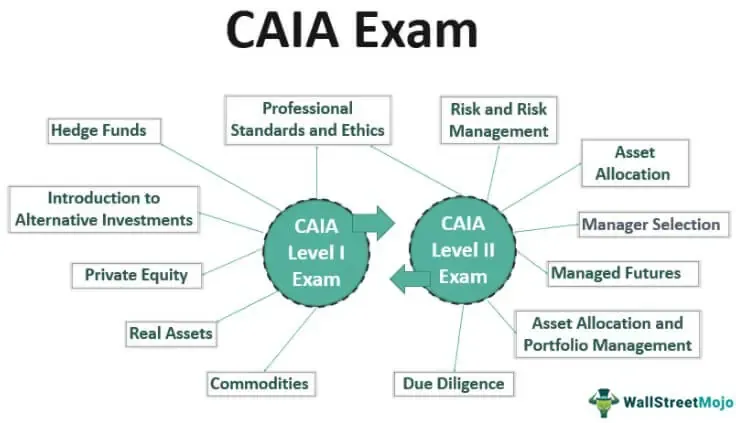

Alternative investments are becoming increasingly important for finance professionals aiming to achieve diversification and maximize returns beyond traditional asset classes. In this context, the Chartered Alternative Investment Analyst (CAIA) designation has emerged as a vital credential, offering finance professionals a structured pathway to mastering the intricacies of this dynamic field. The CAIA certification is not just a mark of expertise in alternative investments, but also a strategic tool for positioning oneself as a leader in this niche domain.

The relevance of CAIA certification lies in its comprehensive curriculum, which covers a wide array of non-traditional assets, including hedge funds, private equity, structured products, and commodities. By obtaining this designation, professionals demonstrate their commitment to maintaining high standards in alternative investment strategies, asset allocation, and risk management. This commitment is increasingly critical as the financial landscape evolves, introducing more complexity and competition into financial markets.



Moreover, the rise of algorithmic trading is reshaping the field of alternative investments. Modern algorithmic techniques allow for more efficient execution and management of alternative assets, enhancing decision-making capabilities and improving portfolio performance. Understanding and integrating these algorithms within the framework of alternative investments can provide a competitive edge. As finance professionals seek to navigate this new terrain, the intersection of CAIA training with algorithmic trading strategies presents exciting opportunities for innovation and leadership.

With the demand for CAIA charter holders surging, professionals equipped with this certification and an understanding of algorithmic trading are well-positioned to excel in roles that emphasize unconventional asset classes. This article will examine the benefits and requirements of the CAIA certification, explore its curriculum, and highlight the transformative impact of algorithmic trading on alternative investments.

## Table of Contents

## What is CAIA?

The Chartered Alternative Investment Analyst (CAIA) Association, founded in 2002, is the leading authority for professionals specializing in alternative investments. This globally recognized credential is particularly focused on non-traditional asset classes, including hedge funds, private equity, structured products, and commodities. By providing a robust framework of education, the CAIA designation plays a crucial role in enhancing the knowledge base and professional standards within the alternative investment sector.

The CAIA program emerged in response to the growing complexity and expansion of alternative asset markets. As these markets evolved, the need for specialized knowledge and expertise among finance professionals became apparent. The introduction of the CAIA designation aimed to fill this gap, equipping professionals with the analytical tools and insights necessary to navigate and succeed in these diverse financial landscapes.

Achieving the CAIA designation involves a rigorous educational process that encompasses a broad spectrum of topics beyond traditional finance education. It emphasizes critical areas such as portfolio management, risk management, and an understanding of the legal and regulatory environment governing alternative investments. This comprehensive approach not only raises the professional standards in the industry but also ensures that CAIA charterholders are well-equipped to make informed investment decisions and adapt to market changes.

Understanding the CAIA's role extends beyond individual professional growth. It aligns with the industry's broader goals of enhancing transparency, accountability, and performance in alternative investment management. This alignment is crucial as finance professionals seek to integrate alternative assets into diversified portfolios, aiming to optimize returns while managing risks.

By engaging with the CAIA curriculum, finance professionals are better prepared to align their career trajectories with the evolving needs of the financial sector. The designation not only boosts the credibility of professionals within the industry but also signals a commitment to excellence and ethical standards in managing alternative investments. As the financial landscape continues to expand and diversify, the demand for knowledgeable and skilled practitioners in alternative investments remains increasingly significant.

## The CAIA Certification: Structure and Curriculum

The Chartered Alternative Investment Analyst (CAIA) program is designed to equip professionals with an in-depth understanding of alternative investments through a structured curriculum split into two exam levels. The program's rigorous focus offers candidates the necessary skills and knowledge to meet the challenges of a dynamic financial landscape.

Level 1 of the CAIA program establishes a strong foundational understanding essential for building a career in alternative investments. This level encompasses fundamental topics that include an Introduction to Alternative Investments, Real Assets, Private Equity, and Hedge Funds. These subjects provide a broad overview of the different asset classes, fostering a comprehensive understanding of their characteristics, markets, and valuation methods. Real Assets, for example, typically cover investments in tangible assets such as real estate and infrastructure, which can offer diversification and inflation protection.

Level 2 of the CAIA program advances the knowledge acquired in Level 1 by focusing on more complex and nuanced subjects related to risk management and asset allocation. Here, candidates delve into sophisticated techniques such as portfolio construction and performance measurement, alongside understanding the broader implications of fiduciary responsibilities and business ethics. This level emphasizes critical thinking and detailed analysis, which are crucial for navigating the intricate dynamics of alternative investment markets.

The CAIA curriculum is designed to be self-directed, encouraging candidates to adopt a disciplined study regimen. This approach allows individuals to customize their learning pace and focus, accommodating professional commitments while exploring a diverse range of topics. 

Exam schedules and study requirements align with the structure, providing clear timelines and guidelines for candidates to prepare effectively. The CAIA Association suggests a study time of approximately 200 hours for each level, reflecting the depth and breadth of material covered. Candidates are encouraged to make use of a wide array of study resources, including textbooks, practice questions, and webinars offered by the CAIA Association, to support their preparation.

By integrating a thorough understanding of alternative investments with a structured approach to self-directed learning, the CAIA certification's curriculum is tailored to equip finance professionals with the strategic insight required to excel in this ever-evolving industry.

## The Growing Importance of Algorithmic Trading in Alternative Investments

Algorithmic trading has rapidly evolved as a critical component in the domain of alternative investments, fundamentally altering the landscape of asset analysis and execution. This integration of algorithms facilitates a more efficient, accurate, and strategic approach to trading non-traditional assets such as hedge funds, private equity, and commodities.

At its core, [algorithmic trading](/wiki/algorithmic-trading) employs complex mathematical models and formulas to make swift trading decisions, often based on criteria like price, timing, or [volume](/wiki/volume-trading-strategy). The primary advantage is the ability to process large datasets and execute trades at speeds and accuracies far beyond human capability. This proficiency greatly enhances market efficiency, reducing execution time and minimizing human error.

Specific to alternative assets, algorithmic trading supports [hedge fund](/wiki/hedge-fund-trading-strategies) management through sophisticated strategies such as statistical [arbitrage](/wiki/arbitrage), which involves the simultaneous purchase and sale of correlated securities to exploit price discrepancies. For example, a hedge fund might employ a Python-based algorithm to monitor real-time stock prices and execute trades when a predetermined condition is met, such as:

```python
import numpy as np

def trade_signal(prices, threshold):
    # Calculate moving average
    moving_avg = np.mean(prices)
    current_price = prices[-1]
    # Generate buy/sell signal
    if current_price < moving_avg - threshold:
        return "Buy"
    elif current_price > moving_avg + threshold:
        return "Sell"
    else:
        return "Hold"

# Example usage
prices = [100, 101, 105, 107, 110, 108]
threshold = 2
signal = trade_signal(prices, threshold)
print(signal)
```

In private equity, algorithmic techniques optimize deal evaluation and portfolio management by analyzing historical data patterns and future market predictions. These automated processes enable firms to assess investment opportunities rapidly and deploy capital more strategically.

Moreover, the synergy between CAIA training and algorithmic trading bolsters professionals' ability to devise advanced portfolio management strategies. CAIA's comprehensive curriculum equips finance professionals with a robust understanding of alternative investment vehicles, while algorithmic trading skills enhance their ability to apply this knowledge in real-time market conditions.

As financial markets continue to embrace digital transformation, the role of algorithmic trading in alternative investments is expected to grow, offering sophisticated tools for analysis and execution. This evolution underscores the value of aligning CAIA certification with algorithmic trading expertise, enabling professionals to navigate and thrive in increasingly complex financial environments.

## CAIA vs. CFA: Which Certification Should You Pursue?

The Chartered Alternative Investment Analyst (CAIA) and Chartered Financial Analyst (CFA) designations are esteemed credentials within the finance industry, each catering to distinct facets and career paths. Both designations offer robust educational frameworks, but their focus varies significantly, providing professionals with the opportunity to tailor their learning to their specific career goals.

The CFA designation is renowned for its comprehensive coverage of a broad range of financial topics, encompassing equity analysis, fixed income, portfolio management, and ethical standards. It is designed for professionals looking to develop a deep understanding of investment management and financial analysis. The CFA curriculum, known for its rigor, spans three levels, each with its own focus, ensuring a rounded expertise in traditional investment disciplines. This makes CFA a suitable choice for individuals aiming to pursue careers in investment banking, portfolio management, and financial analysis within traditional asset classes.

On the other hand, the CAIA designation specializes in alternative investments, a rapidly growing sector of finance. The CAIA program focuses on non-traditional assets such as hedge funds, private equity, real estate, and commodities, addressing the growing demand for expertise in these complex asset classes. Comprising two levels, the CAIA exams are designed to cultivate an in-depth understanding of alternative investment strategies and risk management. This specialization makes CAIA particularly valuable for professionals pursuing careers in areas like fund management, risk analysis, and consulting within the alternative investments space.

Choosing between CAIA and CFA ultimately depends on the candidate’s career aspirations. For those interested in a career centered on traditional investment vehicles and financial analysis, the CFA designation may be more appropriate. Conversely, professionals aiming to specialize in alternative investments may find CAIA more aligned with their goals.

Moreover, holding both CAIA and CFA credentials can offer complementary benefits by providing a holistic understanding of both traditional and alternative finance sectors. This dual expertise can enhance career opportunities and flexibility, enabling professionals to navigate and integrate diverse investment strategies across multiple asset classes. Such a combination can lead to a competitive advantage in roles that require extensive knowledge in both traditional and alternative investments, such as portfolio management and financial consulting.

In summary, while both CAIA and CFA certifications offer distinct advantages, the choice between them should be guided by one's career objectives and areas of interest. Additionally, pursuing both certifications can offer a comprehensive skill set that distinguishes professionals in the competitive finance industry.

## Benefits of Obtaining the CAIA Certification

Achieving the Chartered Alternative Investment Analyst (CAIA) certification offers several notable advantages for finance professionals seeking to advance in the field of alternative investments. One of the primary benefits is the enhancement of credibility and expertise in an industry that increasingly values specialized knowledge. Being recognized as a CAIA charter holder signals a comprehensive understanding of non-traditional asset classes, including hedge funds, private equity, commodities, and structured products. This recognition can differentiate professionals in a competitive job market where specialized skills are in demand.

In addition to the personal credibility and expertise that the CAIA designation confers, members gain access to a global network of finance professionals. This network, facilitated by the CAIA Association, provides numerous opportunities for continuous learning and collaboration. The CAIA community organizes various conferences, webinars, and networking events that enable members to stay updated on the latest trends and developments in alternative investments. Such interactions also foster relationships that can lead to collaborative projects, professional support, and shared learning experiences.

Another significant advantage of obtaining the CAIA certification is the potential for career advancement and higher [earning](/wiki/earning-announcement) potential. As alternative investment markets expand, the need for professionals with proven expertise grows. The CAIA designation—being a recognized standard of excellence in alternative investments—can open doors to higher-level positions and more challenging roles, including portfolio management, risk analysis, and investment strategy within the alternative sector. Employers often perceive charter holders as valuable assets who can contribute effectively to strategic decision-making processes.

Moreover, the certification can create new opportunities in specific finance sectors focusing on alternative assets. Professionals equipped with a CAIA designation often find themselves presented with opportunities not only in traditional financial hubs but also in emerging markets where alternative investments are gaining traction. This broadens the geographical and sector-specific scope of potential career paths, making the CAIA certification a versatile credential in the finance industry.

The strategic advantages of obtaining the CAIA are further validated by statistical data indicating that certified professionals tend to report higher levels of job satisfaction and career fulfillment. The alignment of the CAIA curriculum with current industry practices ensures that members are prepared to tackle real-world challenges, thereby increasing their efficacy and job performance. Therefore, for finance professionals focused on alternative investments, achieving the CAIA certification represents a strategic move towards career progression and success in a rapidly evolving financial landscape.

## Conclusion

The CAIA certification serves as a significant asset for finance professionals aiming to specialize in alternative investments. By obtaining this credential, individuals demonstrate a comprehensive understanding of non-traditional asset classes, a critical competency in today's dynamic financial environment. The curriculum's breadth, encompassing hedge funds, private equity, structured products, and commodities, equips charter holders with diverse expertise that is increasingly in demand.

The growing importance of algorithmic trading further underscores the value of the CAIA designation. In a landscape where speed and accuracy are paramount, professionals who combine the CAIA's foundational alternative investment knowledge with algorithmic trading skills are well-positioned to excel in modern finance roles. This synergy enhances decision-making and strategic management of alternative investment portfolios, offering a competitive edge in the job market.

Committing to the CAIA program is more than just acquiring a certification—it's about joining a forward-thinking community that champions the future of finance. This initiative not only aids in personal career advancement but also contributes to innovation and professionalism in alternative investment management. By aligning with the CAIA's standards and embracing technological advancements such as algorithmic trading, finance professionals are prepared to lead and shape the future of the industry.

## References & Further Reading

[1]: Bergstra, J., Bardenet, R., Bengio, Y., & Kégl, B. (2011). ["Algorithms for Hyper-Parameter Optimization."](https://dl.acm.org/doi/10.5555/2986459.2986743) Advances in Neural Information Processing Systems 24.

[2]: ["Advances in Financial Machine Learning"](https://www.amazon.com/Advances-Financial-Machine-Learning-Marcos/dp/1119482089) by Marcos Lopez de Prado

[3]: ["Evidence-Based Technical Analysis: Applying the Scientific Method and Statistical Inference to Trading Signals"](https://www.amazon.com/Evidence-Based-Technical-Analysis-Scientific-Statistical/dp/0470008741) by David Aronson

[4]: ["Machine Learning for Algorithmic Trading"](https://github.com/stefan-jansen/machine-learning-for-trading) by Stefan Jansen

[5]: ["Quantitative Trading: How to Build Your Own Algorithmic Trading Business"](https://www.amazon.com/Quantitative-Trading-Build-Algorithmic-Business/dp/1119800064) by Ernest P. Chan

[6]: Lhabitant, François-Serge. ["Hedge Funds: Quantitative Insights."](https://www.amazon.com/Hedge-Funds-Quantitative-Fran%C3%A7ois-Serge-Lhabitant/dp/047085667X) Wiley. 

[7]: Liang, Bing. (2004). ["Alternative Investments: Risk and Performance Analysis."](https://www.semanticscholar.org/paper/ALTERNATIVE-INVESTMENTS%3A-CTAs%2C-HEDGE-FUNDS%2C-AND-Liang/6295ed4b7af02a58293cea1e4e9840a8fd05e942) Journal of Financial and Quantitative Analysis.

[8]: ["CAIA Level I: An Introduction to Core Topics in Alternative Investments"](https://www.amazon.com/CAIA-Level-Introduction-Alternative-Investments/dp/1118250966) by Chartered Alternative Investment Analyst Association

[9]: ["CAIA Level II: Advanced Core Topics in Alternative Investments"](https://caia.org/news/caia-level-ii-must-have-most-comprehensive-educational-guide-advanced-core-topics-alternative) by Chartered Alternative Investment Analyst Association