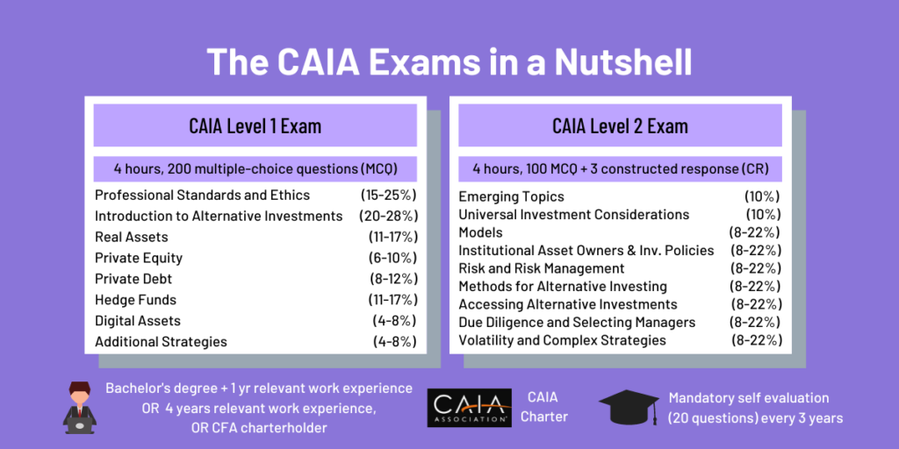

## Table of Contents

## What is the CAIA designation and why is it important for alternative investments?

The CAIA designation stands for Chartered Alternative Investment Analyst. It is a professional certification that focuses on alternative investments like hedge funds, private equity, real estate, and commodities. The CAIA Association, which is a global non-profit, offers this designation to people who want to show they know a lot about these types of investments.

Getting a CAIA designation is important because it helps professionals stand out in the field of alternative investments. It shows that someone has the knowledge and skills needed to work with these complex investment options. This can lead to better job opportunities and higher trust from clients and employers. Plus, the CAIA program keeps professionals updated on the latest trends and regulations in the alternative investment world.

## What are the key differences between traditional and alternative investments?

Traditional investments are things like stocks, bonds, and cash. They are common and easy to buy and sell. People often invest in them because they are well-known and there's a lot of information about them. They are usually seen as less risky than other types of investments. Traditional investments are often part of a standard investment portfolio and are regulated by big financial rules.

Alternative investments are different. They include things like hedge funds, private equity, real estate, and commodities. These investments are often harder to buy and sell and can be riskier. They are not as common, and there might not be as much information about them. People might choose alternative investments to try to get higher returns or to diversify their portfolio. These investments can have different rules and might not be as tightly regulated as traditional investments.

In summary, the main differences between traditional and alternative investments are the types of assets, how easy they are to buy and sell, their risk levels, and the amount of regulation they have. Traditional investments are more common and seen as safer, while alternative investments can offer higher potential returns but come with more risk and less regulation.

## How does the CAIA curriculum structure its approach to learning about alternative investments?

The CAIA curriculum is set up to teach people about alternative investments in a clear and organized way. It is split into two levels. Level I gives a broad look at the world of alternative investments. It covers the basics of different types of investments like hedge funds, private equity, real estate, and commodities. It also talks about how to measure risk and performance, and the rules that govern these investments. This level helps students understand the big picture and the key ideas they need to know.

Level II of the CAIA curriculum goes deeper into the details. It focuses on how to actually use alternative investments in a portfolio. Students learn about advanced ways to measure risk and performance, and how to build a portfolio that includes alternative investments. They also learn about ethical issues and how to make good decisions. This level helps students apply what they learned in Level I to real-world situations, making them ready to work with alternative investments.

Overall, the CAIA curriculum is designed to take students from beginners to experts in alternative investments. It starts with the basics and builds up to more complex topics, always keeping the focus on practical skills and real-world applications.

## What are the main categories of alternative investments covered in the CAIA Fundamentals?

The CAIA Fundamentals covers several main categories of alternative investments. These include hedge funds, private equity, real estate, and commodities. Hedge funds are pools of money that invest in various assets to try to make high returns. Private equity involves investing in companies that are not publicly traded. Real estate investments can be in properties like buildings or land. Commodities are things like gold, oil, or agricultural products that you can trade.

Each of these categories has its own risks and ways to make money. Hedge funds might use complex strategies to try to beat the market. Private equity can offer big returns if the companies they invest in do well. Real estate can provide income from rent and might go up in value over time. Commodities can be a way to protect against inflation or to diversify a portfolio. The CAIA Fundamentals helps people understand these different types of investments and how they can fit into a broader investment strategy.

## How do hedge funds operate and what role do they play in alternative investments?

Hedge funds are a type of alternative investment that pool money from investors to buy different kinds of assets. They often use complex strategies to try to make high returns. These strategies can include betting on stocks going up or down, using borrowed money to increase potential returns, and investing in things like currencies or commodities. Hedge funds are usually managed by professional investors who make all the decisions about what to buy and sell. They are different from traditional investments because they can be riskier and are not as tightly regulated.

Hedge funds play a big role in alternative investments because they offer ways to make money that are different from traditional investments like stocks and bonds. They can help investors diversify their portfolios, which means spreading out their money to reduce risk. Hedge funds can also provide high returns if the strategies work well, but they can also lose a lot of money if things go wrong. Because of this, hedge funds are often seen as a way for investors to try to get more out of their money, but they need to understand the risks involved.

## What are private equity and venture capital, and how are they distinguished within the CAIA framework?

Private equity and venture capital are both types of alternative investments that involve putting money into companies that are not publicly traded. Private equity usually means buying a whole company or a big part of it, often with borrowed money. The goal is to make the company better, maybe by changing how it runs or by growing it, and then sell it for more money later. Venture capital is a bit different. It's about investing in new, small companies that are just starting out, often in technology or other fast-growing industries. The hope is that these companies will become very successful and valuable, making the investors a lot of money.

In the CAIA framework, private equity and venture capital are treated as separate categories because they have different ways of working and different risks. Private equity deals with more established companies and can use a lot of debt, which adds risk but also the chance for big returns. Venture capital, on the other hand, is riskier because many new companies fail, but if one becomes a big success, the rewards can be huge. The CAIA curriculum teaches about how to measure the risks and possible returns of both, and how they fit into a bigger investment strategy.

## How does real estate investment fit into the alternative investment landscape according to CAIA?

Real estate investment is a big part of alternative investments in the CAIA framework. It means putting money into things like buildings, land, or houses. People can make money from real estate by renting it out or selling it for more than they paid. Real estate can be a good way to diversify an investment portfolio because it doesn't always go up and down with the stock market. This means it can help balance out other investments that might be riskier.

The CAIA curriculum teaches about the different ways to invest in real estate, like buying properties directly or investing in real estate investment trusts (REITs). It also talks about how to figure out if a real estate investment is a good idea, looking at things like how much money it might make and how risky it is. Real estate can be a steady source of income and can grow in value over time, but it also has its own risks, like changes in the economy or problems with the property itself. The CAIA helps people understand these things so they can make smart choices about real estate investments.

## What are commodities and managed futures, and how are they analyzed in the CAIA Fundamentals?

Commodities are things you can touch, like gold, oil, or wheat. They are traded on markets where people buy and sell them. Commodities can be a good way to protect against inflation, which means when prices go up. If you invest in commodities, you might make money if their prices go up. The CAIA Fundamentals teaches about how commodities work, how to measure their risk, and how they can fit into an investment plan. It explains that commodities can be risky because their prices can change a lot, but they can also help balance out other investments.

Managed futures are a bit different. They are investments where professional managers trade things like futures contracts, which are agreements to buy or sell something at a future date. These managers use special strategies to try to make money, sometimes betting that prices will go up and sometimes betting they will go down. The CAIA Fundamentals talks about how managed futures work and how to analyze them. It helps people understand the risks and possible rewards of managed futures, and how they can be part of a bigger investment strategy.

## How does CAIA address the importance of risk management in alternative investments?

The CAIA program puts a big focus on risk management when it comes to alternative investments. It teaches that understanding and managing risk is super important because alternative investments can be more complicated and riskier than traditional ones. The curriculum explains different ways to measure risk, like looking at how much an investment might go up or down in value. It also talks about how to use tools like diversification to spread out risk, so if one investment does badly, others might do well and balance it out.

In the CAIA Fundamentals, students learn about specific risks that come with different types of alternative investments. For example, they learn about the risks of hedge funds, which might use a lot of borrowed money, or the risks of commodities, which can have big price swings. The program helps people understand how to think about these risks and make plans to handle them. By the end, students should know how to look at the risks of any alternative investment and make smart choices to keep their money safe.

## What ethical and professional standards does CAIA emphasize for professionals in alternative investments?

CAIA emphasizes the importance of ethical and professional standards for people working in alternative investments. They believe that acting ethically is key to building trust with clients and keeping the industry strong. CAIA teaches professionals about things like being honest, putting clients first, and following the rules. They learn how important it is to avoid conflicts of interest, which means not letting personal gain affect their decisions. By following these standards, professionals can make sure they are doing what's best for their clients and the industry as a whole.

The CAIA curriculum also focuses on how to handle ethical situations that might come up in the world of alternative investments. It covers topics like how to deal with insider information, which is secret information that could affect investment decisions. Professionals learn how to spot and avoid situations where they might be tempted to do something wrong. CAIA helps them understand the importance of keeping up with the latest laws and regulations, so they can always act in a way that is legal and fair. By sticking to these ethical and professional standards, CAIA-certified professionals can build a strong reputation and contribute to a healthier investment environment.

## How can the CAIA Fundamentals help in constructing and managing a diversified investment portfolio?

The CAIA Fundamentals can help a lot in building and managing a diversified investment portfolio. It teaches people about different types of alternative investments like hedge funds, private equity, real estate, and commodities. By learning about these, people can spread their money across many different kinds of investments. This is called diversification, and it means that if one investment does badly, others might do well and balance it out. The CAIA Fundamentals also explains how to measure the risks of these investments and how they can work together in a portfolio. This helps people make smart choices about where to put their money to reduce risk and possibly make more money.

The CAIA program also focuses on how to actually use alternative investments in a portfolio. It teaches about things like how much to invest in each type of asset and how to keep track of how well the portfolio is doing. This is important because it helps people make sure their investments are working the way they want them to. The CAIA Fundamentals also talks about ethical and professional standards, which means doing things the right way and being fair to clients. By following these standards, people can build trust and make better decisions about their investments. Overall, the CAIA Fundamentals gives people the tools and knowledge they need to build a strong and diversified investment portfolio.

## What advanced topics in alternative investments does the CAIA curriculum cover for expert-level understanding?

The CAIA curriculum covers advanced topics in alternative investments to help people reach an expert-level understanding. It dives deep into things like how to measure risk and performance in a more detailed way. For example, it teaches about advanced statistical methods that can help predict how investments might do in the future. The curriculum also goes into the details of how to use alternative investments in real-world situations, like building a portfolio that includes hedge funds, private equity, real estate, and commodities. This helps people understand how to mix different types of investments to get the best results.

Another important part of the advanced CAIA curriculum is learning about the rules and regulations that affect alternative investments. It explains how to stay up-to-date with the latest laws and how to make sure investments follow them. The curriculum also talks about ethical issues and how to make good decisions when things get complicated. By learning these advanced topics, people can become experts in alternative investments and be ready to handle the challenges that come with them.

## References & Further Reading

[1]: Bergstra, J., Bardenet, R., Bengio, Y., & Kégl, B. (2011). ["Algorithms for Hyper-Parameter Optimization."](https://dl.acm.org/doi/10.5555/2986459.2986743) Advances in Neural Information Processing Systems 24.

[2]: ["Advances in Financial Machine Learning"](https://www.amazon.com/Advances-Financial-Machine-Learning-Marcos/dp/1119482089) by Marcos Lopez de Prado

[3]: ["Evidence-Based Technical Analysis: Applying the Scientific Method and Statistical Inference to Trading Signals"](https://www.amazon.com/Evidence-Based-Technical-Analysis-Scientific-Statistical/dp/0470008741) by David Aronson

[4]: ["Machine Learning for Algorithmic Trading"](https://github.com/stefan-jansen/machine-learning-for-trading) by Stefan Jansen

[5]: ["Quantitative Trading: How to Build Your Own Algorithmic Trading Business"](https://www.amazon.com/Quantitative-Trading-Build-Algorithmic-Business/dp/1119800064) by Ernest P. Chan

[6]: Lhabitant, François-Serge. ["Hedge Funds: Quantitative Insights."](https://www.amazon.com/Hedge-Funds-Quantitative-Fran%C3%A7ois-Serge-Lhabitant/dp/047085667X) Wiley. 

[7]: Liang, Bing. (2004). ["Alternative Investments: Risk and Performance Analysis."](https://www.semanticscholar.org/paper/ALTERNATIVE-INVESTMENTS%3A-CTAs%2C-HEDGE-FUNDS%2C-AND-Liang/6295ed4b7af02a58293cea1e4e9840a8fd05e942) Journal of Financial and Quantitative Analysis.

[8]: ["CAIA Level I: An Introduction to Core Topics in Alternative Investments"](https://www.amazon.com/CAIA-Level-Introduction-Alternative-Investments/dp/1118250966) by Chartered Alternative Investment Analyst Association

[9]: ["CAIA Level II: Advanced Core Topics in Alternative Investments"](https://caia.org/news/caia-level-ii-must-have-most-comprehensive-educational-guide-advanced-core-topics-alternative) by Chartered Alternative Investment Analyst Association