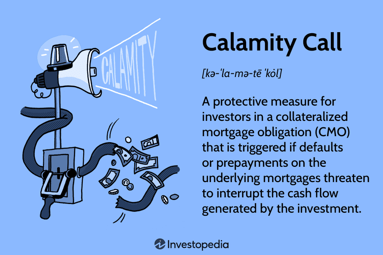

## Table of Contents

## What is a Calamity Call?

A Calamity Call is a special type of phone call used during emergencies or disasters. It helps people quickly get important information or help when something bad happens, like a big storm, earthquake, or fire. When someone makes a Calamity Call, they usually reach emergency services or a special hotline set up to handle the situation.

These calls are important because they can save lives and help people stay safe. During a disaster, it's crucial to have a way to communicate with emergency responders or get updates on what's happening. Calamity Calls make sure that people can get the help they need fast, and they help emergency services know where to go and what to do to assist those in danger.

## Why is a Calamity Call important in emergency situations?

A Calamity Call is really important in emergency situations because it helps people get help quickly. When something bad happens, like a big storm or a fire, people need to talk to emergency services fast. A Calamity Call lets them do that. It connects them to people who can send help, like firefighters or police, right away.

These calls also help emergency services know where the problem is and what is happening. This information is very important because it helps them decide what to do and where to go to help people. Without Calamity Calls, it would be harder for emergency services to know where to go and who needs help the most during a disaster.

## How does a Calamity Call system work?

A Calamity Call system works by letting people call a special number during an emergency. When someone dials this number, they reach a call center where trained people answer the phone. These people ask the caller what is happening and where they are. This information helps them know what kind of help to send, like firefighters, police, or medical teams. The call center then sends this information to the right emergency services, who go to the place where help is needed.

The system also uses technology to make things faster and more accurate. For example, some Calamity Call systems can use the caller's phone to find out where they are, even if the caller can't say where they are. This is very helpful in big emergencies where many people need help at the same time. The system keeps working to make sure that help gets to people as quickly as possible, which can save lives and keep people safe.

## What are the basic components of a Calamity Call system?

A Calamity Call system has a few main parts that help it work well during emergencies. The first part is the special phone number that people call when they need help. This number connects them to a call center where trained people answer the phone. These call center workers are important because they talk to the person calling and find out what is happening and where they are.

The second part is the technology that helps the call center know where the caller is. This can be done using the phone's location, which is very helpful if the caller can't say where they are. The call center then sends the information they get to the right emergency services, like the fire department, police, or ambulances. These services use the information to go to the right place and help the people who need it.

## Can you provide examples of situations where a Calamity Call would be used?

A Calamity Call would be used if there's a big fire in a building. Imagine you're at home and you see smoke coming from a neighbor's apartment. You would call the Calamity Call number to tell the emergency services about the fire. They would ask you where the fire is and then send firefighters to put out the fire and help anyone who might be trapped inside.

Another situation is during a big storm, like a hurricane. If the storm causes a lot of damage, like trees falling on houses or roads flooding, people would use the Calamity Call to get help. They might need to tell the emergency services that someone is hurt or that they need to be rescued from their home. The call center would then send the right help, like ambulances or rescue teams, to the people who need it.

## What technologies are commonly used to facilitate Calamity Calls?

One common technology used in Calamity Calls is the automatic location tracking system. This system uses the caller's phone to find out where they are, even if they can't tell the call center themselves. This is very helpful during big emergencies when many people need help at the same time. It makes sure that emergency services can find people quickly and send help to the right place.

Another important technology is the call routing system. This system helps make sure that Calamity Calls go to the right call center based on where the caller is. This way, the call center that knows the area well can answer the call and send help faster. It's like making sure your call goes to the nearest emergency team so they can get to you quicker.

## How do you initiate a Calamity Call on different devices?

To start a Calamity Call on a smartphone, you need to open the phone app and dial the emergency number, like 911 in the United States. Once you dial the number, press the call button. Your phone will then connect you to the emergency call center. If your phone has location services turned on, it will also send your location to the call center, which helps them find you faster.

On a landline phone, it's even easier. Just pick up the phone and dial the emergency number. The call will go through to the nearest call center, and they will ask you what's happening and where you are. Landlines usually have a fixed address, so the call center can find you quickly based on that address.

If you're using a smartwatch or another device with calling features, the process is similar. Find the phone app on your device, dial the emergency number, and press the call button. These devices often use the same location technology as smartphones, so they can also send your location to the call center to help get you the help you need fast.

## What are the steps to respond to a Calamity Call effectively?

When you answer a Calamity Call, the first thing you should do is stay calm and listen carefully to the caller. Ask them where they are and what is happening. It's important to get as much information as you can, like if anyone is hurt or if there's a fire. Use the technology to find their location if they can't tell you where they are. This helps you send the right help to the right place fast.

Once you have the information, you need to send it to the right emergency services. This could be the fire department, police, or an ambulance. Make sure to tell them everything you know so they can get ready to help. Keep talking to the caller to make sure they are safe and to get any new information. It's important to stay on the line until help arrives, so you can keep the caller calm and give any updates to the emergency teams.

## What are the legal and ethical considerations when using Calamity Call systems?

When using Calamity Call systems, there are important legal and ethical things to think about. Legally, it's important to follow the rules about how emergency calls are handled. This means keeping the caller's information private and only using it to help them. It's also important to make sure that everyone can use the Calamity Call system, no matter where they are or what language they speak. If the system doesn't work right, it could be against the law, and people could get hurt because they don't get help fast enough.

Ethically, it's important to treat everyone who calls for help with respect and care. When someone is in an emergency, they might be scared or hurt, so it's important to be kind and listen to them carefully. It's also important to make sure that the help you send is fair and based on who needs it most, not on other things like where they live or how much money they have. By following these legal and ethical rules, Calamity Call systems can work better and help save more lives.

## How can Calamity Call systems be integrated with other emergency response systems?

Calamity Call systems can be integrated with other emergency response systems to make help come faster and work better. For example, when someone makes a Calamity Call, the information they give can be shared with other systems like police, fire, and ambulance services. This sharing of information helps all these groups know what is happening and where they need to go. It also helps them work together better because they all have the same information.

Another way to integrate Calamity Call systems is by using technology that helps different systems talk to each other. This can include things like computer systems that share data quickly or apps that let different emergency teams see the same map and information. By connecting these systems, emergency responders can see where help is needed and what other teams are doing, which helps them plan and act faster to save lives and keep people safe.

## What are the current advancements in Calamity Call technology?

One big advancement in Calamity Call technology is the use of smart devices and apps. Now, many smartphones and smartwatches can automatically send your location when you make an emergency call. This helps emergency services find you faster, even if you can't talk or tell them where you are. There are also apps that let you send your medical information or other important details to the call center, which can help them know what kind of help you need right away.

Another advancement is the use of [artificial intelligence](/wiki/ai-artificial-intelligence) (AI) and [machine learning](/wiki/machine-learning). These technologies can help make Calamity Call systems smarter. For example, AI can understand different languages and accents better, so more people can get help no matter what language they speak. Machine learning can also help the system learn from past calls to handle new calls more efficiently. This means that the system can get better over time at figuring out what kind of help is needed and how to send it quickly.

## How can organizations optimize their Calamity Call systems for better performance and reliability?

Organizations can optimize their Calamity Call systems by making sure they have enough people working at the call center. This means having enough trained staff to answer calls quickly, especially during big emergencies when many people need help at the same time. It's also important to keep the technology up to date. This includes using the latest software and hardware that can handle a lot of calls without crashing. Regular training for the staff can help them use the new technology better and handle calls more efficiently.

Another way to improve the system is by testing it often. Organizations should do practice runs to see if the system works well during different kinds of emergencies. This can help them find any problems and fix them before a real emergency happens. Working with other emergency services, like the fire department and ambulances, can also make the system better. By sharing information and planning together, everyone can respond faster and help more people stay safe.

## References & Further Reading

[1]: Palen, L., Vieweg, S., Liu, S. B., & Hughes, A. L. (2009). ["Crisis in a Networked World: Features of Computer-Mediated Communication in the April 16, 2007, Virginia Tech Event."](https://www.semanticscholar.org/paper/Crisis-in-a-Networked-World-Palen-Vieweg/dee1e5c9f8ea4dfc3180c98d608b0d4b662a2f28) Social Science Computer Review, 27(4), 467-480.

[2]: Quarantelli, E. L. (1997). ["Problematical Aspects of the Information/Communication Revolution for Disaster Planning and Research: Ten Non-Technical Issues and Questions."](https://www.emerald.com/insight/content/doi/10.1108/09653569710164053/full/html) Disaster Research Center, University of Delaware.

[3]: Sutton, J., Palen, L., & Shklovski, I. (2008). ["Backchannels on the Front Lines: Emergency Uses of Social Media in the 2007 Southern California Wildfires."](https://cmci.colorado.edu/~palen/Papers/iscram08/BackchannelsISCRAM08.pdf) Proceedings of the 5th International ISCRAM Conference.

[4]: Plotnick, L., & Hiltz, S. R. (2016). ["Software Innovations to Support the Use of Social Media by Emergency Managers."](https://www.tandfonline.com/doi/full/10.1080/10447318.2018.1427825) BMC Public Health, 16(1), 1-9.

[5]: Yang, S., Jin, Y., & Liu, B. F. (2019). ["Understanding Public Emergency Response Strategies on Social Media: {A Cross-Cultural, Comparative Study of China and the United States.}"](https://journals.sagepub.com/doi/10.1177/0093650219883198) Communication Research, 47(7), 1010-1036.

[6]: Meier, P. (2015). ["Digital Humanitarians: How Big Data is Changing the Face of Humanitarian Response."](https://www.taylorfrancis.com/books/mono/10.1201/b18023/digital-humanitarians-patrick-meier) CRC Press.

[7]: Comerio, M. C. (1998). ["Disaster Hits Home: New Policy for Urban Housing Recovery."](https://archive.org/details/disasterhitshome0000come) University of California Press.