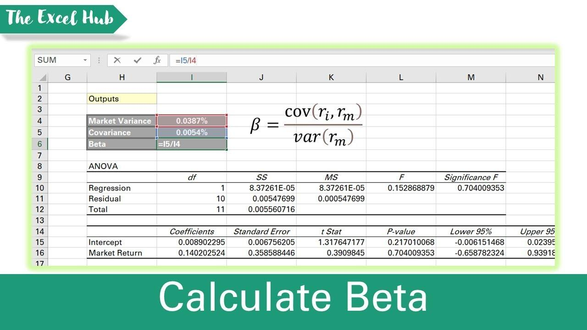

## Table of Contents

## What is beta and why is it important for investors?

Beta is a measure of how much a stock's price moves compared to the overall market. If a stock has a beta of 1, it moves exactly the same as the market. If the beta is higher than 1, the stock is more volatile than the market, meaning it goes up and down more. If the beta is less than 1, the stock is less volatile, meaning it moves less than the market.

Beta is important for investors because it helps them understand the risk of a stock. If an investor wants to take more risk for potentially higher returns, they might choose stocks with a high beta. On the other hand, if an investor wants a safer investment, they might choose stocks with a low beta. By knowing the beta, investors can make better decisions about which stocks to buy based on their comfort with risk.

## How can you calculate the beta of a stock using Excel?

To calculate the beta of a stock using Excel, you first need to gather the historical price data for the stock and a market index, like the S&P 500. You can get this data from financial websites or databases. Once you have the data, put the stock prices in one column and the market index prices in another column. Make sure both sets of data cover the same time period. Next, calculate the returns for both the stock and the market index. To do this, for each day, subtract the previous day's price from the current day's price, and then divide by the previous day's price. Do this for both the stock and the market index.

After calculating the returns, you need to find the covariance and variance. The covariance measures how the stock and market move together, while the variance measures how much the market moves on its own. In Excel, use the COVAR function to find the covariance between the stock returns and the market returns. Then, use the VAR function to find the variance of the market returns. Finally, to get the beta, divide the covariance by the variance. The formula in Excel would look like this: `=COVAR(stock_returns, market_returns) / VAR(market_returns)`. This will give you the beta of the stock, which shows how much the stock moves compared to the market.

## What data do you need to calculate beta in Excel?

To calculate beta in Excel, you need two main types of data: the historical prices of the stock you are interested in and the historical prices of a market index, like the S&P 500. You can find these prices on financial websites or databases. Make sure the data covers the same time period for both the stock and the market index. For example, if you have stock prices from January 1 to December 31, you should also have market index prices for the same dates.

Once you have the prices, you need to calculate the returns for both the stock and the market index. To do this, for each day, subtract the previous day's price from the current day's price and then divide by the previous day's price. This gives you the daily return. Do this for both the stock and the market index. With these returns, you can then use Excel functions to find the beta. The beta tells you how much the stock moves compared to the market.

## Can you explain the formula used to calculate beta?

Beta is a number that shows how much a stock moves compared to the market. To find the beta, you need two things: the returns of the stock and the returns of the market. Returns are how much the price goes up or down each day. You figure out the returns by taking today's price, subtracting yesterday's price, and then dividing by yesterday's price. Do this for both the stock and the market.

Once you have the returns, you use a special math formula to find the beta. This formula has two parts: covariance and variance. Covariance tells you how the stock and the market move together. Variance tells you how much the market moves on its own. To get the beta, you divide the covariance of the stock returns and market returns by the variance of the market returns. This gives you the beta, which tells you if the stock is more or less risky than the market.

## How do you use the SLOPE function in Excel to calculate beta?

To calculate beta using the SLOPE function in Excel, you need the daily returns of both the stock and the market. First, gather the historical prices for the stock and a market index like the S&P 500. Calculate the returns by taking the difference between today's price and yesterday's price, then dividing by yesterday's price. Do this for both the stock and the market. Once you have the returns, you can use the SLOPE function. The SLOPE function calculates how much the stock's returns change when the market's returns change. In Excel, you write the formula as `=SLOPE(stock_returns, market_returns)`. This will give you the beta of the stock.

Using the SLOPE function is a quick way to find beta because it does the math for you. The SLOPE function is the same as dividing the covariance of the stock and market returns by the variance of the market returns. This means you don't need to calculate the covariance and variance separately. Just put in the stock returns and market returns, and Excel will give you the beta. This helps investors understand how much risk the stock has compared to the market.

## What are the steps to set up your Excel sheet for beta calculation?

To set up your Excel sheet for beta calculation, start by gathering the historical prices for the stock you want to analyze and a market index like the S&P 500. Make sure you have prices for the same time period for both the stock and the market. Put the stock prices in one column and the market prices in another column. Label these columns clearly, like "Stock Price" and "Market Price". Next, you need to calculate the daily returns for both the stock and the market. To do this, subtract the previous day's price from the current day's price, then divide by the previous day's price. Put these returns in new columns next to the price columns, and label them "Stock Return" and "Market Return".

Once you have the returns calculated, you can use the SLOPE function to find the beta. The SLOPE function needs two ranges of data: the stock returns and the market returns. In an empty cell, type `=SLOPE(stock_returns, market_returns)`, replacing "stock_returns" and "market_returns" with the actual cell ranges where your return data is. For example, if your stock returns are in cells B2 through B101 and your market returns are in cells C2 through C101, you would type `=SLOPE(B2:B101, C2:C101)`. After you press Enter, Excel will calculate the beta and display it in the cell. This number tells you how much the stock moves compared to the market, helping you understand the stock's risk.

## How do you interpret the beta value of a stock?

The beta value of a stock tells you how much the stock's price moves compared to the market. If a stock has a beta of 1, it moves the same as the market. If the beta is more than 1, the stock is more risky because it goes up and down more than the market. If the beta is less than 1, the stock is less risky because it doesn't move as much as the market. A negative beta means the stock moves in the opposite direction of the market, which is rare but can happen.

Understanding the beta helps investors decide if a stock fits their risk level. If you like taking risks and want the chance for big returns, you might pick stocks with a high beta. But if you want a safer investment, you would choose stocks with a low beta. Beta doesn't tell you everything about a stock, but it's a useful tool for understanding how much risk you're taking on.

## What are common mistakes to avoid when calculating beta in Excel?

When calculating beta in Excel, one common mistake is using the wrong time period for the stock and market data. Make sure the dates for the stock prices and the market prices match exactly. If the periods are different, your beta calculation will be wrong. Another mistake is not calculating the returns correctly. Remember to find the returns by subtracting the previous day's price from the current day's price and then dividing by the previous day's price. If you mess up this step, your beta will be off.

Another mistake to watch out for is using the wrong function in Excel. Some people might try to calculate beta manually by finding the covariance and variance separately, but this can lead to errors. It's easier and less likely to go wrong if you use the SLOPE function, which does all the math for you. Just make sure you put the stock returns and market returns in the right order in the SLOPE function. Also, make sure you don't mix up the stock and market data. If you put the wrong data in the wrong place, your beta will be incorrect.

## How can you calculate the beta of a portfolio in Excel?

To calculate the beta of a portfolio in Excel, you need to know the beta of each stock in the portfolio and how much of your money is in each stock. Start by finding the beta of each stock using the SLOPE function, like we talked about before. Once you have the betas, put them in a column in Excel. Next to that, put the percentage of your portfolio that each stock makes up. This percentage is called the weight of the stock. For example, if you have 20% of your money in one stock, its weight is 0.20.

After you have the betas and weights, you can find the portfolio's beta by multiplying each stock's beta by its weight, then adding all those numbers together. In Excel, you can do this by using a formula. If your betas are in column A and your weights are in column B, you can write a formula like `=SUMPRODUCT(A2:A10, B2:B10)` to get the portfolio beta. This tells you how much your whole portfolio moves compared to the market, helping you understand the risk of your entire investment.

## How does the frequency of data (daily, weekly, monthly) affect beta calculation?

The frequency of the data you use to calculate beta can change the number you get. If you use daily prices, you'll see how the stock moves every day compared to the market. This can make the beta seem more up and down because daily prices can change a lot. If you use weekly or monthly prices, the beta might be smoother because you're looking at bigger changes over time. This can make the stock look less risky than it really is if you only look at the monthly numbers.

Using different frequencies can also affect how useful the beta is for making decisions. Daily data gives you a quick look at how the stock moves, which is good if you want to know what's happening right now. But weekly or monthly data might be better if you're planning to keep the stock for a long time. It's important to pick the right frequency based on how long you plan to hold the stock and how much risk you're okay with.

## What advanced techniques can be used to refine beta calculations in Excel?

To make your beta calculations in Excel more accurate, you can use something called regression analysis. This is a fancy way of finding out how much one thing (like a stock's price) changes when another thing (like the market's price) changes. In Excel, you can use the LINEST function to do this. The LINEST function gives you more details than just the beta, like how sure you can be about your beta number. This helps you understand if your beta is a good guess or if it might be off. You can also use the RSQ function to see how well the market's movements explain the stock's movements. A higher number from RSQ means the market is a good way to predict how the stock will move.

Another way to make your beta better is by using adjusted beta. Sometimes, the beta you calculate can be too high or too low because of short-term changes in the market. Adjusted beta tries to fix this by blending your calculated beta with the number 1. In Excel, you can do this by using a formula like `=0.67 * calculated_beta + 0.33 * 1`. This formula pulls your beta a bit closer to 1, which is what you'd expect in the long run. This can give you a more reliable idea of how risky the stock really is over time.

## How can you use beta to adjust your investment strategy?

Beta can help you decide what stocks to buy based on how much risk you want to take. If you like taking risks and want to make big gains, you might pick stocks with a high beta. These stocks move a lot more than the market, so they can go up a lot but also go down a lot. On the other hand, if you want to be safer with your money, you'd choose stocks with a low beta. These stocks don't move as much as the market, so they're less likely to lose a lot of value quickly. By knowing the beta of a stock, you can make choices that match how much risk you're okay with.

You can also use beta to balance your whole investment portfolio. If you have a bunch of stocks, you can look at the beta of the whole group to see how risky it is. If your portfolio's beta is too high and you want to be less risky, you can add stocks with a low beta to bring the overall risk down. Or, if you want to take more risk for the chance of bigger gains, you can add stocks with a high beta. By adjusting the betas in your portfolio, you can make sure your investments fit your risk level and goals.

## What is Understanding Beta: A Key Financial Metric?

Beta is a statistical measure that quantifies the sensitivity of a stock's returns relative to the overall market. Specifically, it assesses how much a particular stock fluctuates in response to market movements. This metric is critical for investors as it provides insights into the risk associated with a stock compared to the market. 

Beta is calculated using the covariance between the stock's returns and the market's returns, divided by the variance of the market returns. The formula is:

$$
\beta = \frac{\text{Cov}(R_i, R_m)}{\text{Var}(R_m)}
$$

where:
- $R_i$ represents the return of the investment,
- $R_m$ represents the return of the market, often proxied by indices like the S&P 500.

A beta of 1 implies that the stock's price is expected to move with the market. If the market increases by 1%, a stock with a beta of 1 is also expected to increase by 1%. A beta greater than 1 denotes that the stock is more volatile than the market. For example, a beta of 1.5 suggests that the stock is 50% more volatile than the market, meaning if the market goes up by 1%, the stock could go up by 1.5%. Conversely, a beta of less than 1 indicates less [volatility](/wiki/volatility-trading-strategies). A beta of 0.7 suggests that the stock is 30% less volatile than the market.

The relationship between beta and investment returns is straightforward: high-beta stocks typically offer higher returns due to their increased risk, making them attractive to risk-tolerant investors seeking potentially higher rewards. On the other hand, low-beta stocks tend to provide more stability with lower returns, appealing to risk-averse investors looking for safer investments.

Understanding beta is essential for evaluating investment risk. It enables investors to align their portfolio with their risk tolerance by selecting appropriate stocks based on expected volatility and return objectives. A comprehensive grasp of beta allows for more strategic decision-making in portfolio management.

## How do you calculate Beta in Excel using a step-by-step guide?

To calculate Beta in Excel, begin by structuring the historical price data for both the asset and the market index in columns. Typically, you would have one column each for the dates, asset prices, and market index prices.

**Calculating Daily Returns:**

1. **Identify the Price Data:** Ensure each column has consistent data entries for the asset and market index, covering the same date range.
2. **Compute Daily Returns:** In a new column, calculate the daily returns for both the asset and the market index. The formula for daily return (R) is:
$$
   R_t = \frac{P_t - P_{t-1}}{P_{t-1}}

$$

   where $P_t$ is the price on day $t$ and $P_{t-1}$ is the price on the previous day.

   For example, if the closing price is in column B (starting from B2), the formula for daily return in C2 would be:

   ```
   =(B2-B1)/B1
   ```

   Drag this formula down to calculate the returns for all periods.

**Using SLOPE Function to Calculate Beta:**

3. **Apply the SLOPE Function:** Once the returns are calculated, use Excel’s SLOPE function to determine Beta. The SLOPE function calculates the slope of the linear regression line between the asset's returns and the market's returns, which is essentially the Beta:

   ```
   =SLOPE(asset_returns, market_returns)
   ```

   For instance, if the asset returns are in column C and the market returns are in column D, the formula would be:

   ```
   =SLOPE(C2:Cn, D2:Dn)
   ```

   Here, C2:Cn and D2:Dn represent the range of daily return data for the asset and the market index, respectively.

**Cross-verification with CORREL Function:**

4. **Calculate Correlation:** To further ensure accuracy, use the CORREL function to check the correlation between the asset’s returns and the market’s returns:

   ```
   =CORREL(C2:Cn, D2:Dn)
   ```

   This correlation is a key component in verifying the relationship captured by Beta. While it does not directly calculate Beta, it should be aligned, showing a meaningful relationship between asset and market fluctuations.

**Conclusion:**

By using these Excel functions, investors can efficiently calculate and analyze Beta, offering insights into the stock's volatility relative to market movements, thereby enhancing strategic decision-making processes.

## References & Further Reading

- "Damodaran on Valuation: Security Analysis for Investment and Corporate Finance" by Aswath Damodaran. This book is a comprehensive resource that provides valuable insights into security analysis and valuation methods essential for understanding financial markets. Damodaran covers topics such as risk assessment and strategic investment decisions, which are crucial for those employing Beta as a tool in financial evaluations.

- "Financial Modeling" by Simon Benninga. This book offers a practical approach to financial modeling, with detailed examples using Excel. It is an essential resource for anyone seeking to apply Beta calculations within financial models and simulations, providing step-by-step guidance on constructing robust financial tools and analyses.

- "Investment Valuation: Tools and Techniques for Determining the Value of Any Asset" by Aswath Damodaran. In this work, Damodaran dives deep into the techniques for valuing all types of investments. This reference is vital for investors and analysts who use Beta calculations in conjunction with valuation models to estimate the potential financial performance of various assets.

- "Quantitative Finance For Dummies" by Steve Bell. This book breaks down complex quantitative finance concepts and processes, including the calculation and application of risk measures like Beta. It is particularly useful for beginners who seek to understand quantitative techniques in finance and wish to employ these tactics in making informed investment strategies.

