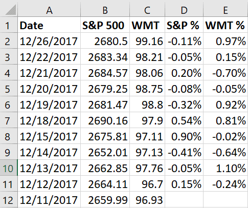

In investing, understanding and managing risk is fundamental to achieving financial success. Investors must navigate a complex landscape of volatile markets and unpredictable economic conditions, making risk assessment and management critical components of investment strategy. One of the critical metrics used to assess risk is Beta, a statistical measure that evaluates a stock's volatility relative to the overall market. Beta plays a crucial role in determining how sensitive a stock is to market movements, providing investors with insights into potential price fluctuations.

Beta is an essential tool for investors seeking to understand how their investment compares to market movements. A Beta value of 1 suggests that the stock's price tends to move with the market. If the Beta is greater than 1, the stock is typically more volatile than the market, implying greater risks and the potential for higher returns. Conversely, a Beta less than 1 signifies that the stock is less volatile, potentially offering more stable returns with lower risk.



In this article, we will explore the concept of Beta, its calculation, and its application in portfolio management. Understanding how Beta is calculated and interpreted can empower investors to make more informed decisions that align with their risk tolerance and investment objectives. Furthermore, we will examine the application of Beta in algorithmic trading using Excel, illustrating how this metric can be integrated into trading strategies to optimize portfolio performance. Through a step-by-step guide, investors will learn the process of calculating Beta and how this information can be leveraged to enhance financial analyses and decision-making.

## Table of Contents

## Understanding Beta: A Key Financial Metric

Beta is a statistical measure that quantifies the sensitivity of a stock's returns relative to the overall market. Specifically, it assesses how much a particular stock fluctuates in response to market movements. This metric is critical for investors as it provides insights into the risk associated with a stock compared to the market. 

Beta is calculated using the covariance between the stock's returns and the market's returns, divided by the variance of the market returns. The formula is:

$$
\beta = \frac{\text{Cov}(R_i, R_m)}{\text{Var}(R_m)}
$$

where:
- $R_i$ represents the return of the investment,
- $R_m$ represents the return of the market, often proxied by indices like the S&P 500.

A beta of 1 implies that the stock's price is expected to move with the market. If the market increases by 1%, a stock with a beta of 1 is also expected to increase by 1%. A beta greater than 1 denotes that the stock is more volatile than the market. For example, a beta of 1.5 suggests that the stock is 50% more volatile than the market, meaning if the market goes up by 1%, the stock could go up by 1.5%. Conversely, a beta of less than 1 indicates less [volatility](/wiki/volatility-trading-strategies). A beta of 0.7 suggests that the stock is 30% less volatile than the market.

The relationship between beta and investment returns is straightforward: high-beta stocks typically offer higher returns due to their increased risk, making them attractive to risk-tolerant investors seeking potentially higher rewards. On the other hand, low-beta stocks tend to provide more stability with lower returns, appealing to risk-averse investors looking for safer investments.

Understanding beta is essential for evaluating investment risk. It enables investors to align their portfolio with their risk tolerance by selecting appropriate stocks based on expected volatility and return objectives. A comprehensive grasp of beta allows for more strategic decision-making in portfolio management.

## Setting Up Excel for Beta Calculation

To prepare for calculating Beta in Excel, begin by acquiring historical price data for both the specific asset you wish to analyze and a suitable benchmark market index, such as the S&P 500. It is essential that this data spans a consistent time frame to ensure the accuracy of your calculations.

Once you have collected the data, load it into Excel. Organize the spreadsheet by setting up distinct columns: one for dates, followed by separate columns for the asset's price and for the market index's price. This structure allows for clear and effective data manipulation.

Familiarize yourself with several key Excel functions that are indispensable for Beta calculation:

1. **SLOPE Function**: This function calculates the slope of the linear regression line through a dataset, which represents the Beta. The syntax is:  
   `=SLOPE(known_y's, known_x's)`  
   Here, `known_y's` would typically be the returns of the asset, while `known_x's` would be the returns of the market index.

2. **INTERCEPT Function**: Although not directly used for Beta, understanding the intercept of the regression line can help in deeper analysis of the relationship between the asset and the market. The syntax is:  
   `=INTERCEPT(known_y's, known_x's)`

3. **CORREL Function**: This function calculates the correlation coefficient between the two sets of returns, providing insight into the strength and direction of the linear relationship between the asset's and market's returns. The syntax is:  
   `=CORREL(array1, array2)`  
   Where `array1` and `array2` represent the two datasets you are comparing.

After organizing your data and understanding the necessary functions, you are ready to progress to the calculation of Beta, ensuring that your setup allows for seamless calculation and analysis of market and asset behavior.

## Step-by-Step Guide: Calculating Beta in Excel

To calculate Beta in Excel, begin by structuring the historical price data for both the asset and the market index in columns. Typically, you would have one column each for the dates, asset prices, and market index prices.

**Calculating Daily Returns:**

1. **Identify the Price Data:** Ensure each column has consistent data entries for the asset and market index, covering the same date range.
2. **Compute Daily Returns:** In a new column, calculate the daily returns for both the asset and the market index. The formula for daily return (R) is:
$$
   R_t = \frac{P_t - P_{t-1}}{P_{t-1}}

$$

   where $P_t$ is the price on day $t$ and $P_{t-1}$ is the price on the previous day.

   For example, if the closing price is in column B (starting from B2), the formula for daily return in C2 would be:

   ```
   =(B2-B1)/B1
   ```

   Drag this formula down to calculate the returns for all periods.

**Using SLOPE Function to Calculate Beta:**

3. **Apply the SLOPE Function:** Once the returns are calculated, use Excel’s SLOPE function to determine Beta. The SLOPE function calculates the slope of the linear regression line between the asset's returns and the market's returns, which is essentially the Beta:

   ```
   =SLOPE(asset_returns, market_returns)
   ```

   For instance, if the asset returns are in column C and the market returns are in column D, the formula would be:

   ```
   =SLOPE(C2:Cn, D2:Dn)
   ```

   Here, C2:Cn and D2:Dn represent the range of daily return data for the asset and the market index, respectively.

**Cross-verification with CORREL Function:**

4. **Calculate Correlation:** To further ensure accuracy, use the CORREL function to check the correlation between the asset’s returns and the market’s returns:

   ```
   =CORREL(C2:Cn, D2:Dn)
   ```

   This correlation is a key component in verifying the relationship captured by Beta. While it does not directly calculate Beta, it should be aligned, showing a meaningful relationship between asset and market fluctuations.

**Conclusion:**

By using these Excel functions, investors can efficiently calculate and analyze Beta, offering insights into the stock's volatility relative to market movements, thereby enhancing strategic decision-making processes.

## Incorporating Beta in Algorithmic Trading

Algorithmic trading employs quantitative metrics extensively, with Beta being pivotal for managing portfolio risk and constructing trading strategies. The calculation of Beta, which measures a security's volatility relative to the market, allows traders to dynamically adjust asset weights to either minimize risk or enhance returns within automated systems. By assessing an asset’s Beta, traders can estimate how much the asset will move in response to market changes, thus tailoring trading algorithms to align with market conditions.

For instance, in a strategy aimed at risk mitigation, assets with lower Beta values may be weighted more heavily to dampen the overall volatility of the portfolio. Conversely, in a strategy targeting higher returns through market movements, high-Beta assets might be favored, accepting the increased risk for potentially greater rewards.

Incorporating Beta into algorithmic workflows involves using its value in real-time assessments to adjust portfolio compositions. This dynamic evaluation requires continuous data processing and the ability to update Beta calculations as new price data comes in. Python, a prevalent language in [algorithmic trading](/wiki/algorithmic-trading), provides libraries such as `pandas` and `numpy` for efficient data manipulation and linear regression analysis, necessary for calculating Beta. Below is a Python snippet illustrating this process:

```python
import pandas as pd
import numpy as np

# Load historical price data into a pandas DataFrame
# `asset_prices` and `market_prices` should contain historical daily closing prices.
asset_prices = pd.Series([...]) # Replace with actual data
market_prices = pd.Series([...]) # Replace with actual market data

# Calculate daily returns
asset_returns = asset_prices.pct_change().dropna()
market_returns = market_prices.pct_change().dropna()

# Perform linear regression to calculate Beta
covariance_matrix = np.cov(asset_returns, market_returns)
beta = covariance_matrix[0, 1] / covariance_matrix[1, 1]

print(f"The calculated Beta of the asset is: {beta}")
```

This code demonstrates calculating Beta by evaluating the covariance between asset and market returns, divided by the variance of market returns. Integrating such scripts into a trading system allows for ongoing Beta calculations, enabling real-time strategy adjustments and maintaining alignment with specified investment goals.

Algorithmic traders leverage Beta not only for constructing and optimizing portfolios but also for anticipating potential opportunities or risks posed by current market conditions. The agility to monitor and adjust portfolios based on real-time Beta calculations empowers traders to manage risk efficiently, optimize returns, and maintain a competitive edge in the financial markets.

## Common Pitfalls and How to Avoid Them

Mistakes in data input can cause significant inaccuracies in Beta calculations, which can mislead investors about the volatility and risk of a stock relative to the market. Ensuring data accuracy is paramount; this begins with obtaining reliable historical price data. Consistency across the data timeframe, such as using daily, weekly, or monthly returns, is essential for meaningful comparisons between the asset and the market index.

Relying exclusively on historical Beta presents another pitfall. Beta measures historical volatility in relation to the market, assuming that the same conditions will persist. However, market conditions can change due to macroeconomic factors, changes in interest rates, or geopolitical events, rendering past Beta values less predictive of future movements. Investors should use Beta as a dynamic tool rather than a static measure, updating it frequently to reflect current data and potential shifts in market behavior.

Additionally, a common mistake is equating correlation with causation when interpreting Beta values. While Beta is derived from the covariance between stock and market returns, suggesting a level of correlation, it does not imply causation. High correlation can occur due to underlying factors affecting both the stock and the market index similarly, without one causing the other. This distinction is crucial for avoiding erroneous investment strategies based on misunderstood data relationships.

In practical scenarios, meticulous data handling and a comprehensive understanding of Beta’s limitations can help investors use it effectively for risk assessment and portfolio management. Employing software tools such as Excel for calculations requires proficiency in functions like SLOPE and CORREL, and diligence in data verification processes.

For those implementing Beta calculations through programming, this Python snippet illustrates how to calculate Beta using historical data:

```python
import pandas as pd
import numpy as np

# Example data
data = {'Asset': [100, 102, 104, 103, 108], 'Market': [100, 101, 103, 105, 110]}
df = pd.DataFrame(data)

# Calculate daily returns
df['Asset Return'] = df['Asset'].pct_change()
df['Market Return'] = df['Market'].pct_change()

# Drop NaN values that result from pct_change()
df.dropna(inplace=True)

# Calculate Beta
covariance = np.cov(df['Asset Return'], df['Market Return'])[0][1]
market_variance = np.var(df['Market Return'])
beta = covariance / market_variance

print(f"Calculated Beta: {beta}")
```

In conclusion, understanding these pitfalls and implementing robust data handling practices ensures more reliable use of Beta, enhancing investment decision-making capabilities amidst evolving market landscapes.

## Conclusion

Calculating Beta provides investors with valuable insights into both the behavior of the market and the volatility of individual stocks. This measure is fundamental for making informed financial decisions, as it reflects how sensitive an asset's returns are to those of the overall market. Understanding the Beta of a stock allows investors to gauge the level of systemic risk involved and align their portfolios with their risk tolerance and investment goals.

Integrating Beta into investment strategies is essential for effective risk management and return optimization. By incorporating Beta, investors can balance their portfolios more strategically, whether by seeking higher returns with high-Beta stocks or aiming for stability through low-Beta investments. Additionally, Beta forms the backbone of various portfolio management theories, such as the Capital Asset Pricing Model (CAPM), which assists in calculating expected returns based on the risk-free rate, Beta, and the equity market risk premium.

Excel emerges as a robust tool for calculating Beta, enabling in-depth financial analysis in rapidly changing market environments. Its ability to process and analyze large datasets with functions like SLOPE and CORREL allows investors to conduct precise Beta calculations efficiently. This empowers investors to dynamically assess portfolio risks and adapt investment strategies in real-time, enhancing their ability to respond to market fluctuations systematically.

In conclusion, accurately calculating and applying Beta is critical for investors seeking to optimize portfolio performance while managing risk. As a sophisticated metric, it not only guides better decision-making but also supports the development of resilient investment strategies in diverse economic conditions.

## References & Further Reading

- "Damodaran on Valuation: Security Analysis for Investment and Corporate Finance" by Aswath Damodaran. This book is a comprehensive resource that provides valuable insights into security analysis and valuation methods essential for understanding financial markets. Damodaran covers topics such as risk assessment and strategic investment decisions, which are crucial for those employing Beta as a tool in financial evaluations.

- "Financial Modeling" by Simon Benninga. This book offers a practical approach to financial modeling, with detailed examples using Excel. It is an essential resource for anyone seeking to apply Beta calculations within financial models and simulations, providing step-by-step guidance on constructing robust financial tools and analyses.

- "Investment Valuation: Tools and Techniques for Determining the Value of Any Asset" by Aswath Damodaran. In this work, Damodaran dives deep into the techniques for valuing all types of investments. This reference is vital for investors and analysts who use Beta calculations in conjunction with valuation models to estimate the potential financial performance of various assets.

- "Quantitative Finance For Dummies" by Steve Bell. This book breaks down complex quantitative finance concepts and processes, including the calculation and application of risk measures like Beta. It is particularly useful for beginners who seek to understand quantitative techniques in finance and wish to employ these tactics in making informed investment strategies.