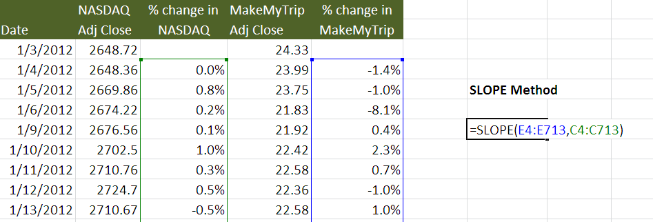

Understanding how to calculate beta is crucial in finance, especially when it comes to risk assessment and portfolio management. Beta, a measure of a stock’s volatility in relation to the overall market, offers insights that are essential for making informed financial decisions. This comprehensive guide focuses on using Excel for beta calculation, a skill that proves invaluable whether you are a seasoned finance professional or a newcomer to trading.

The tutorial will explain how to leverage Excel's built-in functions to efficiently calculate beta, offering a step-by-step approach to ensure accuracy and reliability in your financial assessments. Additionally, this article will explore the integration of beta calculations in algorithmic trading, highlighting how these metrics can aid in developing strategies for optimizing risk and return parameters.



By mastering these techniques, you'll gain a competitive edge, enabling you to navigate the intricacies of financial markets with confidence. As markets are ever-changing, refining these analytical capabilities in Excel will not only enhance your current strategies but also prepare you for future developments in financial analysis and algorithmic trading.

## Table of Contents

## Understanding Beta: A Key Financial Metric

Beta is a quantitative measure that represents a stock's volatility in comparison to the market as a whole. It is commonly utilized in financial analysis to evaluate the risk associated with a specific security. Beta is a crucial element of the Capital Asset Pricing Model (CAPM), which is used to determine a theoretically appropriate required rate of return of an asset, adjusting for its risk relative to the market.

The formula for beta is defined as follows:

$$
\beta = \frac{\text{Covariance}(\text{Asset Returns}, \text{Market Returns})}{\text{Variance}(\text{Market Returns})}
$$

In this formula, the covariance between the asset returns and the market returns is divided by the variance of the market returns. This ratio explains how much of the asset's movements are explained by market movements.

A beta value greater than one indicates that the asset exhibits higher [volatility](/wiki/volatility-trading-strategies) compared to the market, suggesting that the asset's price may increase more than the market in bullish periods and decrease more in bearish periods. Conversely, a beta less than one suggests that the asset is less volatile than the market, providing a degree of insulation against market fluctuations.

Understanding beta is essential for assessing the risk-reward profile of investments. For example, a stock with a beta of 1.5 is expected to move 1.5 times more than the market. If the market goes up by 10%, the stock is expected to rise by 15%, and vice versa for a market downturn. Therefore, high-beta stocks are considered riskier but can offer potentially higher returns, whereas low-beta stocks are considered safer but with lower potential returns.

In practical applications, beta assists investors in making informed decisions regarding portfolio diversification and risk management. By combining assets with varying beta values, investors can tailor their portfolios to align with their risk tolerance and investment goals. Furthermore, in [algorithmic trading](/wiki/algorithmic-trading), beta is a key metric for developing strategies that aim to optimize risk-adjusted returns.

Overall, beta provides investors with a valuable gauge of how a particular security is expected to perform in relation to market movements, influencing both strategic asset allocation and performance evaluation.

## Setting Up Excel for Beta Calculation

To prepare for calculating beta in Excel, begin by gathering the historical price data for the specific asset and a benchmark index, such as the S&P 500, which will serve as the market reference. Reliable sources for obtaining this data include financial platforms like Bloomberg, Yahoo Finance, or Google Finance. Ensure that the data covers a consistent time frame and frequency, typically daily or monthly, to maintain accuracy in your calculations.

Ensure that your Excel software is up-to-date to take advantage of the latest functionalities and formulas. Familiarity with key Excel functions is essential, particularly the SLOPE, INTERCEPT, and CORREL functions. These will be integral in computing beta and analyzing the relationship between the asset and the market index.

To start, create a new spreadsheet and organize it with clear, descriptive column labels to facilitate easy data entry and analysis. For instance, label three initial columns as "Date," "Asset Price," and "Market Index Price." This organization provides a structured layout for inputting and evaluating the historical price data.

Here’s a step-by-step guide to preparing your Excel sheet for beta calculation:

1. **Input Historic Data**: Enter the historical price data into the spreadsheet. Align the asset prices with the corresponding benchmark index prices for each date.

2. **Calculate Daily Returns**: Use Excel to compute daily (or the chosen frequency) returns. In a new column labeled "Asset Returns," use the formula:
   ```
   =(B2-B1)/B1
   ```
   Drag this formula down to fill the column for all dates. Repeat a similar step for "Market Returns."

3. **Gather Excel Functions**: Familiarize yourself with the necessary Excel functions that will be used for beta calculation:
   - **SLOPE**: Determines the beta as the slope of the regression line between asset and market returns.
   - **INTERCEPT**: Useful for understanding the returns when market returns are zero but not necessary for beta alone.
   - **CORREL**: Measures the correlation coefficient between asset returns and market returns for cross-verification.

4. **Label Additional Columns**: Clearly label new columns where you’ll calculate these metrics, such as "Beta," "Intercept," and "Correlation."

5. **Prepare for Beta Calculation**: Ensure your dataset is complete and accurate. Before proceeding with calculations, double-check for any discrepancies or missing data points that could skew results.

Organizing your data efficiently and understanding these Excel functions will form the backbone of a successful beta calculation process. This setup is crucial for accurately assessing volatility figures and implementing them in financial analyses or trading strategies.

## Step-by-Step Guide: Calculating Beta in Excel

Input historical price data for both the asset and the market index into an Excel spreadsheet. Begin by listing the dates in one column, followed by the corresponding asset prices in the next column, and the market index prices in a third column. Having organized data is essential for the accuracy of subsequent calculations.

Calculate daily returns by determining the percentage change in prices from one day to the next. In Excel, this is done by using the formula:

$$
\text{Daily Return} = \frac{\text{Price at Day}_{t} - \text{Price at Day}_{t-1}}{\text{Price at Day}_{t-1}}
$$

For example, if your asset prices are listed in column B starting from row 2, you would place the following formula in cell C3 to compute the return:

```
=(B3-B2)/B2
```

Drag this formula down along the column to fill in the daily returns for all trading days in your dataset. Repeat this process for the market index returns using a similar formula.

Use the SLOPE function to compute beta. The SLOPE function in Excel calculates the slope of the linear regression line, which represents the beta in this context. The formula is structured as follows:

$$
\text{Beta} = \text{SLOPE}(\text{Asset Returns}, \text{Market Returns})
$$

Assuming the asset returns are in column C and market returns in column D, use this formula to calculate beta:

```
=SLOPE(C2:Cn, D2:Dn)
```

where $n$ is the last row of your data.

Cross-verify the beta value by determining the correlation coefficient using the CORREL function, which quantifies the strength and direction of the linear relationship between two sets of data. To use this function, apply:

```
=CORREL(C2:Cn, D2:Dn)
```

A correlation value close to 1 indicates a strong positive relationship, while a value close to -1 indicates a strong negative relationship. This verification helps validate your beta calculation.

Present a visual representation of the data with a scatter plot to facilitate better interpretation of the relationship between the asset returns and market returns. To create a scatter plot in Excel:

1. Highlight the data in columns C and D.
2. Navigate to the "Insert" tab, then select "Scatter" from the Charts group.
3. Choose the "Scatter with only Markers" option.

This scatter plot will help visualize the correlation between the asset and market returns, providing a graphical representation of beta. Adjust the chart as needed for clarity, using trend lines to highlight the relationship.

By following these steps, financial analysts can accurately compute beta using Excel, facilitating more informed investment and risk management decisions.

## Incorporating Beta in Algorithmic Trading

Algorithmic trading strategies rely heavily on quantitative metrics, with beta playing a pivotal role in assessing and managing portfolio risk. Beta's capacity to measure an asset's volatility relative to the market makes it invaluable for constructing portfolios with specific volatility targets. By calculating beta, traders can integrate it into automated algorithms to dynamically adjust asset weights, aiming to minimize risk or maximize returns.

**Constructing Volatility-Targeted Portfolios**

Beta, as a measure of systemic risk, allows traders to tailor portfolios according to desired risk levels. A high beta indicates that an asset is more volatile than the market, while a low beta suggests less volatility. Traders can leverage this insight by incorporating assets with specific beta values to align with targeted portfolio volatility.

**Integrating Beta into Automated Systems**

In automated trading systems, beta calculations form the basis for decision-making logic. For instance, using Python, beta can be calculated for an asset relative to the market using historical returns data. Here's a simple Python code example using libraries like Pandas and NumPy:

```python
import pandas as pd
import numpy as np

# Sample data for asset and market returns
asset_returns = np.array([...]) # Replace with actual returns data
market_returns = np.array([...]) # Replace with actual returns data

# Calculate beta
covariance_matrix = np.cov(asset_returns, market_returns)
beta = covariance_matrix[0, 1] / covariance_matrix[1, 1]

print(f"Calculated Beta: {beta}")
```

This script calculates the covariance between the asset and the market and divides it by the variance of the market, which gives the asset's beta. Such computations are critical in automated systems where real-time data is continually processed to refine portfolio compositions.

**Adjusting Asset Weights in Algorithms**

In algorithmic strategies, beta is used to adjust asset weights within a portfolio automatically. For example, in a risk-minimization strategy, assets with high beta might be weighted less to reduce overall portfolio volatility. Conversely, in a strategy targeting higher returns, a higher allocation to high-beta assets might be implemented.

Consider a simple Python example for adjusting asset weights based on beta:

```python
def adjust_weights(asset_list, desired_beta):
    """Adjust weights based on calculated betas"""
    current_betas = {...}  # Replace with current asset betas
    total_beta = sum(current_betas.values())
    target_weights = {}

    for asset, beta in current_betas.items():
        # Adjust weight inversely to beta
        weight = (total_beta / beta) * desired_beta
        target_weights[asset] = weight

    return target_weights

# Example usage
assets = ['Asset1', 'Asset2', 'Asset3']
desired_portfolio_beta = 1.0
new_weights = adjust_weights(assets, desired_portfolio_beta)
print(new_weights)
```

In this code, asset weights are inversely adjusted based on their beta to fit a desired portfolio beta, balancing risk and achieving target portfolio characteristics.

**Embedding Beta Metrics into Algorithmic Workflows**

Embedding beta metrics requires an iterative process where calculated betas are continuously fed into the trading models. By constantly re-evaluating beta values, traders can adapt to changing market conditions. This dynamic approach ensures that the trading algorithm remains robust and aligns with strategic objectives, whether to mitigate risks or enhance returns.

Overall, beta is more than just a risk metric; it's a foundational tool that, when integrated judiciously, can significantly influence the effectiveness of algorithmic trading strategies.

## Common Pitfalls and How to Avoid Them

Mistakes in data input can significantly impact beta calculations, leading to incorrect assessments of an investment's risk profile. Always double-check data entries for errors or inconsistencies. It's crucial to ensure that the historical price data for both the asset and benchmark index are accurately recorded and time-aligned. This prevents skewed results that can mislead financial analysis and trading strategies.

Relying solely on historical beta to predict future performance is another common error. The assumption that historical relationships will persist is flawed due to potential market evolution and changing economic conditions. Beta reflects past market behavior, and solely depending on it without considering predictive indicators can be misleading. 

It is important to remember the limitations of correlation versus causation when analyzing beta. While beta measures the correlation between stock and market movements, it does not infer causation. High correlation does not mean market movements cause stock price fluctuations and vice versa. Misinterpreting this can lead to inaccurate risk assessments and investment decisions. 

Overlooking macroeconomic factors can also distort beta analysis. Market sentiment shifts, policy changes, and economic indicators can all affect a stock's risk profile independently of past performance metrics. These factors can cause significant deviations in expected volatility and should be considered in a well-rounded analysis.

Strategies for avoiding these common pitfalls include:

1. **Verification Processes**: Implementing double-check mechanisms for data entry in spreadsheets or automated systems can help avoid input errors.

2. **Diversifying Analytical Tools**: Supplementing beta with other forecasting models and financial metrics can provide a more comprehensive understanding of market conditions. 

3. **Qualitative Analysis**: In addition to quantitative metrics, incorporating macroeconomic analysis and sentiment studies can offer insights into potential future market dynamics that beta alone may not capture.

4. **Regular Updates**: Keeping financial models updated with the latest data and considering recent market developments ensures a more accurate reflection of current market conditions in beta calculations.

By acknowledging and addressing these pitfalls, financial analysts and traders can improve the reliability and accuracy of beta as a tool for risk assessment and decision-making in portfolio management and algorithmic trading.

## Conclusion

Beta calculation is an indispensable tool in financial analysis and algorithmic trading. It provides crucial insights into a stock's market behavior, aiding in informed decision-making. By mastering Excel, you can enhance your ability to conduct complex financial assessments, efficiently calculating beta to appraise asset volatility against market benchmarks.

Integrating beta into trading strategies offers a competitive edge by allowing for precise risk management and return optimization. By adjusting asset weights according to beta, traders can construct portfolios that align with specific financial goals, whether it's minimizing risk or maximizing returns.

As markets continually evolve, it is essential to refine beta calculation techniques to maintain their predictive accuracy and relevance. Adapting to new market conditions ensures that beta remains a vital tool in portfolio management and algorithmic trading strategies.

With the knowledge gained from this tutorial, you are well-equipped to tackle the complexities of beta calculation. Employing Excel for this purpose not only streamlines the process but also enhances your overall financial analysis capabilities, allowing you to navigate and adapt to dynamic market environments effectively.

## References & Further Reading

[1]: ["Damodaran on Valuation: Security Analysis for Investment and Corporate Finance"](https://archive.org/details/damodaranonvalua0000damo_t6v9) by Aswath Damodaran

[2]: ["Financial Modeling"](https://www.investopedia.com/terms/f/financialmodeling.asp) by Simon Benninga

[3]: ["Investment Valuation: Tools and Techniques for Determining the Value of Any Asset"](https://archive.org/details/investmentvaluat0000damo_n6k9) by Aswath Damodaran

[4]: Cao, M., & Pettit, R. (2020). ["Beta using simple linear regression: Theory and practice"](https://www.polyu.edu.hk/ama/stat/pdf/lectnote/c6_line.pdf). Journal of Investment Strategies.

[5]: ["Quantitative Finance For Dummies"](https://www.wiley.com/en-us/Quantitative+Finance+For+Dummies-p-9781118769461) by Steve Bell