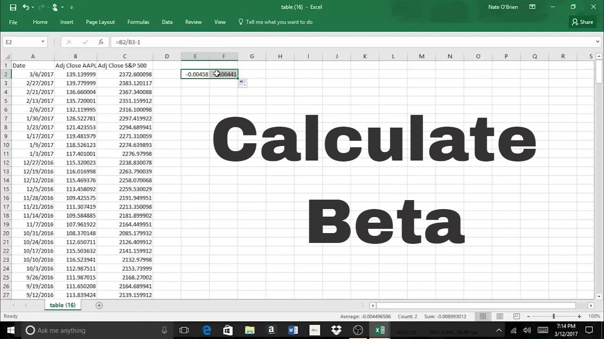

## Table of Contents

## What is beta and why is it important in finance?

Beta is a measure used in finance to show how much a stock's price moves compared to the overall market. If a stock has a beta of 1, it means the stock's price moves with the market. A beta higher than 1 means the stock is more volatile than the market, and a beta less than 1 means it's less volatile. For example, if a stock has a beta of 1.5, it's expected to move 50% more than the market.

Beta is important because it helps investors understand the risk of a stock. If you want a safer investment, you might choose a stock with a low beta. But if you're willing to take more risk for potentially higher returns, you might pick a stock with a high beta. By knowing a stock's beta, investors can make better decisions about which stocks to buy, based on their own comfort with risk and their investment goals.

## How can I start using Excel to calculate beta?

To start using Excel to calculate beta, you first need to gather data on the stock's returns and the market's returns over the same period. You can find this data from financial websites or stock market databases. Once you have the data, enter the stock's returns in one column and the market's returns in another column in Excel. Make sure both sets of data cover the same time frame and have the same number of data points.

Next, you'll use the Excel function called SLOPE to calculate the beta. The SLOPE function calculates the slope of the line that best fits your data points, which in this case represents the beta. To use it, type "=SLOPE(known_y's, known_x's)" into a cell. For "known_y's", you'll use the column with the stock's returns, and for "known_x's", you'll use the column with the market's returns. After you press Enter, Excel will show you the beta value. This number tells you how the stock moves compared to the market, helping you understand its risk.

## What data do I need to calculate beta in Excel?

To calculate beta in Excel, you need data on the stock's returns and the market's returns. You can get this data from financial websites or stock market databases. The stock's returns are the changes in the stock's price over time. The market's returns are the changes in a market index, like the S&P 500, over the same time. Make sure you have the same number of data points for both the stock and the market, and that they cover the same time period.

Once you have this data, enter the stock's returns in one column and the market's returns in another column in Excel. For example, if you have daily returns, you might enter the stock's daily returns in column A and the market's daily returns in column B. After entering the data, you can use Excel's SLOPE function to calculate the beta. This function will give you a number that shows how the stock moves compared to the market, which is what beta tells you.

## How do I import stock price data into Excel?

To import stock price data into Excel, you can use a feature called "Get & Transform Data." First, open Excel and go to the "Data" tab on the top. Click on "Get Data," then choose "From Online Services," and select "From Microsoft Azure SQL Database" or "From Web." If you choose "From Web," you'll need to find a website that provides stock price data, like Yahoo Finance or Google Finance. Enter the URL of the webpage that has the stock data you want, and Excel will pull the data into a new window. From there, you can select the data you want and click "Load" to bring it into your Excel sheet.

Once the data is in your Excel sheet, you might need to clean it up. Sometimes, the data comes with extra information that you don't need. You can delete the rows or columns you don't want. Make sure you have the stock prices and the dates they were recorded. You might need to calculate the returns from the prices. To do this, you can use a simple formula: (Today's Price - Yesterday's Price) / Yesterday's Price. After you have the returns, you can use them to calculate the beta, as we talked about before.

## What is the formula for calculating beta in Excel?

To calculate beta in Excel, you need the returns of the stock and the returns of the market. First, get the stock price data and the market index data, like the S&P 500, for the same time period. Then, calculate the returns for both the stock and the market. You do this by finding the percentage change in price from one day to the next. For example, if the stock price goes from $100 to $105, the return is (105 - 100) / 100, which is 5%. Do this for every day you have data for, and put the stock returns in one column and the market returns in another column.

Once you have the returns, you can use Excel's SLOPE function to calculate the beta. In an empty cell, type "=SLOPE(known_y's, known_x's)". For "known_y's", use the column with the stock returns, and for "known_x's", use the column with the market returns. For example, if your stock returns are in column A from A2 to A100, and your market returns are in column B from B2 to B100, you would type "=SLOPE(A2:A100, B2:B100)". After you press Enter, Excel will show you the beta value. This number tells you how the stock moves compared to the market, helping you understand its risk.

## How do I calculate the returns of a stock and the market in Excel?

To calculate the returns of a stock in Excel, you need the stock's prices over time. Let's say you have the stock prices in column A, starting from A2. In column B, you can calculate the daily returns. In cell B2, you would type `=(A3-A2)/A2` to find the return from day 1 to day 2. This formula takes the price on day 2 (A3), subtracts the price on day 1 (A2), and then divides by the price on day 1 (A2). Copy this formula down the column to calculate the returns for each day. The result is a percentage that shows how much the stock's price changed from one day to the next.

To calculate the returns of the market, you do the same thing but with the market index prices. If you have the market index prices in column C, starting from C2, you can calculate the daily returns in column D. In cell D2, type `=(C3-C2)/C2` to find the return from day 1 to day 2. This formula takes the market index price on day 2 (C3), subtracts the price on day 1 (C2), and then divides by the price on day 1 (C2). Copy this formula down the column to calculate the returns for each day. Now you have the stock returns in column B and the market returns in column D, which you can use to calculate the beta.

## How can I use the covariance and variance functions in Excel to find beta?

To find beta using the covariance and variance functions in Excel, you need the returns of the stock and the market. First, calculate the returns for both the stock and the market, like we talked about before. Put the stock returns in one column and the market returns in another column. Then, you can use Excel's COVAR and VAR.S functions to find beta. The formula for beta is the covariance of the stock returns and market returns divided by the variance of the market returns. In Excel, you type `=COVAR(stock_returns, market_returns) / VAR.S(market_returns)` into a cell. For example, if your stock returns are in column A from A2 to A100, and your market returns are in column B from B2 to B100, you would type `=COVAR(A2:A100, B2:B100) / VAR.S(B2:B100)`. Press Enter, and Excel will show you the beta value.

Using the COVAR and VAR.S functions gives you the same result as using the SLOPE function, but it shows you how the math works behind the scenes. The covariance measures how the stock and the market move together, and the variance measures how much the market moves by itself. By dividing the covariance by the variance, you get beta, which tells you how much the stock moves compared to the market. This is useful because it helps you understand the risk of the stock. If the beta is higher than 1, the stock is more volatile than the market. If it's less than 1, the stock is less volatile. Knowing this can help you make better investment decisions.

## What are common errors to avoid when calculating beta in Excel?

When calculating beta in Excel, one common mistake is using the wrong data. Make sure you have the stock's returns and the market's returns for the same time period. If the dates don't match, your beta calculation will be wrong. Another error is not calculating the returns correctly. You need to find the percentage change in price from one day to the next. If you use the prices directly instead of the returns, your beta will not make sense.

Another common mistake is using the wrong Excel functions. Beta is the slope of the line that best fits the stock returns and market returns. You can use the SLOPE function directly, or you can use COVAR and VAR.S functions. If you mix up these functions or use them incorrectly, you'll get the wrong beta. Also, be careful with the cell ranges you use in your formulas. If you include extra data or miss some data points, your beta calculation will be off. Always double-check your data and formulas to make sure you're calculating beta correctly.

## How can I interpret the beta value I calculate in Excel?

When you calculate beta in Excel, the number you get tells you how a stock moves compared to the market. If the beta is 1, it means the stock moves the same as the market. If it's more than 1, like 1.5, the stock moves 50% more than the market. That means it's riskier because it goes up and down more. If the beta is less than 1, like 0.5, the stock moves half as much as the market. That makes it less risky because it doesn't change as much.

Understanding beta helps you make better choices about which stocks to buy. If you want a safer investment, you might pick a stock with a low beta. But if you're okay with more risk and want the chance for bigger gains, you might choose a stock with a high beta. Beta is just one piece of the puzzle, but it's a useful tool to understand how much risk you're taking on with a stock.

## How can I adjust my beta calculation for different time periods in Excel?

To adjust your beta calculation for different time periods in Excel, you first need to gather the stock and market data for the specific time frame you want to analyze. If you want to look at a shorter period, like one month, you'll need the daily stock prices and market index prices for that month. If you're looking at a longer period, like a year, you'll need the data for the whole year. Make sure the dates for the stock and market data match up. Then, calculate the returns for both the stock and the market using the formula (Today's Price - Yesterday's Price) / Yesterday's Price. Enter these returns into your Excel sheet, with the stock returns in one column and the market returns in another.

Once you have the returns for the new time period, you can use the SLOPE function or the COVAR and VAR.S functions to calculate the beta. For the SLOPE function, type "=SLOPE(stock_returns, market_returns)" into a cell, using the cell ranges that match your new data. For the COVAR and VAR.S method, type "=COVAR(stock_returns, market_returns) / VAR.S(market_returns)". By changing the time period, you can see how the stock's risk, measured by beta, changes over time. This can help you understand if the stock is more or less risky in different market conditions.

## How can I use Excel to compare the beta of multiple stocks?

To compare the beta of multiple stocks in Excel, first gather the stock prices and market index prices for the same time period for each stock you want to compare. Calculate the returns for each stock and the market using the formula (Today's Price - Yesterday's Price) / Yesterday's Price. Put the returns for each stock in separate columns, and the market returns in another column. Then, use the SLOPE function to calculate the beta for each stock. For example, if Stock A's returns are in column A from A2 to A100, and the market returns are in column B from B2 to B100, type "=SLOPE(A2:A100, B2:B100)" into a cell to get Stock A's beta. Do the same for each stock, changing the cell ranges to match the columns where you put their returns.

Once you have the beta values for all the stocks, you can compare them easily. If a stock has a beta higher than 1, it means it's more volatile than the market. A beta less than 1 means it's less volatile. By looking at the beta values side by side, you can see which stocks are riskier and which are safer compared to the market. This helps you make better decisions about which stocks to invest in, based on how much risk you're willing to take.

## What advanced techniques can I use in Excel to refine my beta calculations?

To refine your beta calculations in Excel, you can use more advanced techniques like regression analysis. Instead of just using the SLOPE function, you can create a scatter plot of the stock returns against the market returns and add a trendline. This trendline shows the relationship between the stock and the market more clearly. You can also use the LINEST function, which gives you more detailed information about the regression line, like the R-squared value. This tells you how well the line fits the data. If the R-squared value is close to 1, it means the beta is a good measure of the stock's risk.

Another way to refine your beta calculations is to adjust for different time frames and use moving averages. You can calculate beta over different periods, like a month, a quarter, or a year, to see how the stock's risk changes over time. This helps you understand if the stock is more or less risky in different market conditions. You can also use a moving average of the returns to smooth out short-term fluctuations and get a more stable beta value. By using these advanced techniques, you can get a better understanding of a stock's risk and make more informed investment decisions.

## What is Understanding Beta: A Key Financial Metric?

Beta is a quantitative measure that represents a stock's volatility in comparison to the market as a whole. It is commonly utilized in financial analysis to evaluate the risk associated with a specific security. Beta is a crucial element of the Capital Asset Pricing Model (CAPM), which is used to determine a theoretically appropriate required rate of return of an asset, adjusting for its risk relative to the market.

The formula for beta is defined as follows:

$$
\beta = \frac{\text{Covariance}(\text{Asset Returns}, \text{Market Returns})}{\text{Variance}(\text{Market Returns})}
$$

In this formula, the covariance between the asset returns and the market returns is divided by the variance of the market returns. This ratio explains how much of the asset's movements are explained by market movements.

A beta value greater than one indicates that the asset exhibits higher [volatility](/wiki/volatility-trading-strategies) compared to the market, suggesting that the asset's price may increase more than the market in bullish periods and decrease more in bearish periods. Conversely, a beta less than one suggests that the asset is less volatile than the market, providing a degree of insulation against market fluctuations.

Understanding beta is essential for assessing the risk-reward profile of investments. For example, a stock with a beta of 1.5 is expected to move 1.5 times more than the market. If the market goes up by 10%, the stock is expected to rise by 15%, and vice versa for a market downturn. Therefore, high-beta stocks are considered riskier but can offer potentially higher returns, whereas low-beta stocks are considered safer but with lower potential returns.

In practical applications, beta assists investors in making informed decisions regarding portfolio diversification and risk management. By combining assets with varying beta values, investors can tailor their portfolios to align with their risk tolerance and investment goals. Furthermore, in [algorithmic trading](/wiki/algorithmic-trading), beta is a key metric for developing strategies that aim to optimize risk-adjusted returns.

Overall, beta provides investors with a valuable gauge of how a particular security is expected to perform in relation to market movements, influencing both strategic asset allocation and performance evaluation.

## How do you calculate Beta in Excel using a step-by-step guide?

Input historical price data for both the asset and the market index into an Excel spreadsheet. Begin by listing the dates in one column, followed by the corresponding asset prices in the next column, and the market index prices in a third column. Having organized data is essential for the accuracy of subsequent calculations.

Calculate daily returns by determining the percentage change in prices from one day to the next. In Excel, this is done by using the formula:

$$
\text{Daily Return} = \frac{\text{Price at Day}_{t} - \text{Price at Day}_{t-1}}{\text{Price at Day}_{t-1}}
$$

For example, if your asset prices are listed in column B starting from row 2, you would place the following formula in cell C3 to compute the return:

```
=(B3-B2)/B2
```

Drag this formula down along the column to fill in the daily returns for all trading days in your dataset. Repeat this process for the market index returns using a similar formula.

Use the SLOPE function to compute beta. The SLOPE function in Excel calculates the slope of the linear regression line, which represents the beta in this context. The formula is structured as follows:

$$
\text{Beta} = \text{SLOPE}(\text{Asset Returns}, \text{Market Returns})
$$

Assuming the asset returns are in column C and market returns in column D, use this formula to calculate beta:

```
=SLOPE(C2:Cn, D2:Dn)
```

where $n$ is the last row of your data.

Cross-verify the beta value by determining the correlation coefficient using the CORREL function, which quantifies the strength and direction of the linear relationship between two sets of data. To use this function, apply:

```
=CORREL(C2:Cn, D2:Dn)
```

A correlation value close to 1 indicates a strong positive relationship, while a value close to -1 indicates a strong negative relationship. This verification helps validate your beta calculation.

Present a visual representation of the data with a scatter plot to facilitate better interpretation of the relationship between the asset returns and market returns. To create a scatter plot in Excel:

1. Highlight the data in columns C and D.
2. Navigate to the "Insert" tab, then select "Scatter" from the Charts group.
3. Choose the "Scatter with only Markers" option.

This scatter plot will help visualize the correlation between the asset and market returns, providing a graphical representation of beta. Adjust the chart as needed for clarity, using trend lines to highlight the relationship.

By following these steps, financial analysts can accurately compute beta using Excel, facilitating more informed investment and risk management decisions.

## References & Further Reading

[1]: ["Damodaran on Valuation: Security Analysis for Investment and Corporate Finance"](https://archive.org/details/damodaranonvalua0000damo_t6v9) by Aswath Damodaran

[2]: ["Financial Modeling"](https://www.investopedia.com/terms/f/financialmodeling.asp) by Simon Benninga

[3]: ["Investment Valuation: Tools and Techniques for Determining the Value of Any Asset"](https://archive.org/details/investmentvaluat0000damo_n6k9) by Aswath Damodaran

[4]: Cao, M., & Pettit, R. (2020). ["Beta using simple linear regression: Theory and practice"](https://www.polyu.edu.hk/ama/stat/pdf/lectnote/c6_line.pdf). Journal of Investment Strategies.

[5]: ["Quantitative Finance For Dummies"](https://www.wiley.com/en-us/Quantitative+Finance+For+Dummies-p-9781118769461) by Steve Bell