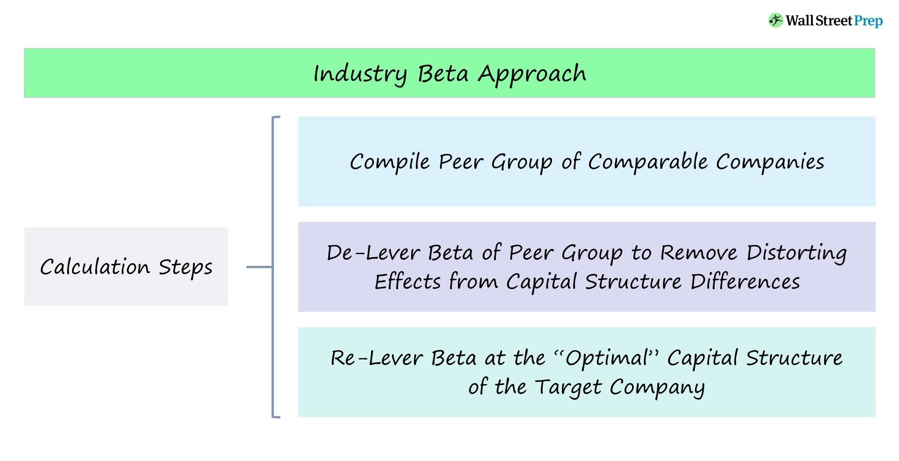

## Table of Contents

## What is beta in the context of finance?

In finance, beta is a measure of how much a stock's price moves compared to the overall market. If a stock has a beta of 1, it moves with the market. A beta higher than 1 means the stock is more volatile than the market, and a beta lower than 1 means it's less volatile. For example, if a stock has a beta of 1.5, it's expected to go up 1.5% when the market goes up 1%, and down 1.5% when the market goes down 1%.

Beta is important for investors because it helps them understand the risk of a stock. If you want a safer investment, you might choose stocks with a low beta. If you're willing to take more risk for potentially higher returns, you might choose stocks with a high beta. Beta is often used in the Capital Asset Pricing Model (CAPM) to calculate the expected return of an investment, taking into account its risk compared to the market.

## Why is calculating beta important for private companies?

Calculating beta is important for private companies because it helps them understand how risky their business is compared to the overall market. Even though private companies don't have stock prices that change every day like public companies, they can still estimate their beta by looking at similar public companies in the same industry. This gives them an idea of how their business might react to market changes if it were public.

Knowing their beta helps private companies make better decisions about financing and growth. For example, if a private company has a high beta, it might be seen as riskier by investors or lenders. This could affect how much money they can borrow or the interest rates they have to pay. On the other hand, a low beta might make it easier for them to get funding because they are seen as less risky. By understanding their beta, private companies can plan better and manage their risks more effectively.

## How does beta differ between public and private companies?

Beta is a measure of how a company's value changes compared to the overall market. For public companies, calculating beta is straightforward because their stock prices change every day. You can see how the stock moves up and down compared to the market and calculate the beta easily. But for private companies, it's not so simple. They don't have daily stock prices, so they have to estimate their beta by looking at similar public companies in the same industry.

Even though the way you calculate beta is different for private companies, the idea is the same. Beta still tells you how risky the company is compared to the market. If a private company's estimated beta is high, it means their business might be more affected by market changes. A low beta means they might be less affected. So, while the method to find beta is different, it's still a useful tool for both public and private companies to understand their risk and make better decisions.

## What are the challenges in calculating beta for private companies?

Calculating beta for private companies is harder because they don't have stock prices that change every day like public companies do. Instead, private companies have to guess their beta by looking at similar public companies in the same industry. This means they need to find a good match, which can be tricky. The public company they choose might not be exactly the same, so the beta they get might not be very accurate.

Another challenge is that private companies often have less information available to the public. This makes it harder to understand how their business is doing compared to public companies. Without clear data, it's tough to know if the beta they calculate is right. So, even though beta can be helpful for private companies to understand their risk, getting an accurate number is a big challenge.

## What are some common methods used to estimate beta for private companies?

One common method to estimate beta for private companies is to use the betas of similar public companies. This is called the "comparable company" method. You find public companies that are in the same industry and have similar business models to the private company. Then, you take an average of their betas to get an estimate for the private company. This method works because companies in the same industry often react to market changes in similar ways.

Another way to estimate beta is through the "bottom-up" approach. This involves looking at the private company's financials and using them to calculate a beta. You might look at things like the company's debt, how much money it makes, and how it grows. Then, you adjust these numbers based on what you know about the industry and the economy. This method can be more detailed but also more complicated because it needs a lot of information about the private company.

Sometimes, private companies use a mix of both methods to get a better estimate. They might start with the betas of similar public companies and then adjust them based on their own financials. This "hybrid" approach tries to balance the simplicity of the comparable company method with the detail of the bottom-up method. By using both, private companies can get a more accurate idea of their beta and understand their risk better.

## How can you use comparable public companies to estimate beta for a private company?

To estimate beta for a private company using comparable public companies, you first need to find public companies that are similar to the private one. Look for companies in the same industry with similar business models and sizes. Once you have a list of these comparable companies, you can find their betas. Betas are usually available on financial websites or in stock market reports. After you have the betas of these public companies, you take an average of them. This average beta is your estimate for the private company's beta.

The reason this method works is that companies in the same industry often react to market changes in similar ways. If the market goes up or down, these companies are likely to move in the same direction. By using the betas of similar public companies, you get a good idea of how the private company might react to market changes if it were public. This helps the private company understand its risk compared to the market, even though it doesn't have its own stock price to calculate beta directly.

## What role does industry analysis play in calculating beta for private companies?

Industry analysis is really important when you're trying to figure out the beta for a private company. You need to look at other companies in the same industry to guess how risky your private company might be. By finding public companies that do similar things and are about the same size, you can use their betas to help you. If these companies are in the same industry, they usually react to market changes in similar ways. So, by looking at their betas, you get a good idea of what your private company's beta might be.

This helps because private companies don't have stock prices that change every day like public companies do. Without that, it's hard to know exactly how risky they are. But by using industry analysis, you can see how other companies in the same field are doing. This gives you a way to estimate your private company's beta and understand its risk better. It's not perfect, but it's a useful tool to help private companies make smarter decisions about their business and how they might grow.

## How can historical financial data be used to calculate beta for a private company?

To calculate beta for a private company using historical financial data, you can use the "bottom-up" approach. This means looking at the private company's past financial information like how much money it made, how much it owes, and how it has grown over time. You then compare this data to the overall market's performance during the same time. By seeing how the company's financials moved with the market, you can estimate a beta. This method is detailed but needs a lot of information about the company, which can be hard to get for private companies.

Sometimes, you might use a mix of the bottom-up approach and looking at similar public companies. You start with the betas of public companies in the same industry and then adjust them based on your private company's financials. This "hybrid" method tries to use the best of both worlds. It helps you get a more accurate beta by considering both how other companies in the industry are doing and how your own company's numbers compare to the market. This way, you can better understand the risk of your private company and make smarter decisions about its future.

## What adjustments need to be made when using a bottom-up beta approach for private companies?

When using the bottom-up approach to calculate beta for a private company, you need to make some adjustments because private companies don't have daily stock prices like public companies do. Instead, you look at the private company's financial data like its income, debts, and growth over time. You then compare this data to how the overall market has done during the same period. This helps you see how the company's financials move with the market, which gives you an idea of its beta. But since private companies often have less public information, you might need to guess some numbers or use industry averages to fill in the gaps.

Another important adjustment is to consider how different the private company is from public companies in the same industry. If the private company is smaller or has a different business model, its beta might not be the same as the public companies you're comparing it to. So, you might need to adjust the beta you calculate based on these differences. For example, if the private company is riskier because it's smaller, you might increase the beta. By making these adjustments, you can get a more accurate estimate of the private company's beta and better understand its risk compared to the market.

## How do macroeconomic factors influence the beta calculation for private companies?

Macroeconomic factors like interest rates, inflation, and economic growth can change how risky a private company is compared to the market. These factors affect all companies, but private ones might feel them differently because they don't have stock prices to show how they're doing every day. For example, if interest rates go up, it might be harder for a private company to borrow money, which could make it riskier. This would mean its beta might be higher than usual because it's more sensitive to these big economic changes.

To figure out how these macroeconomic factors affect a private company's beta, you need to look at how similar public companies in the same industry react to these changes. If public companies in the industry see their betas go up when interest rates rise, you might guess that the private company's beta would do the same. By keeping an eye on these big economic trends and adjusting the beta based on what you see happening to other companies, you can get a better idea of how macroeconomic factors might change the risk of your private company.

## What are the limitations of using beta as a risk measure for private companies?

Using beta to measure risk for private companies has some big challenges. The main problem is that private companies don't have stock prices that change every day like public companies do. This means you have to guess their beta by looking at similar public companies. But finding the right public companies to compare can be hard, and the beta you get might not be very accurate. Plus, private companies often have less information available to the public, which makes it even trickier to figure out their beta correctly.

Another issue is that beta only looks at how a company moves with the market and doesn't tell you about other risks. For private companies, there are lots of other things that can affect their risk, like how easy it is for them to get money, how they're managed, or if they depend a lot on one customer. Beta doesn't take these things into account, so it might not give you the full picture of how risky the company really is. So while beta can be a helpful tool, it's important to remember its limits and use other ways to understand risk too.

## How can advanced statistical models improve the accuracy of beta calculations for private companies?

Advanced statistical models can make beta calculations for private companies more accurate by using more data and smarter math. These models can look at a lot of different things at once, like how the company has done in the past, how other companies in the same industry are doing, and even big economic changes. By using all this information, the models can guess a private company's beta better than just looking at a few similar public companies. They can also adjust for things that might make the private company different from public ones, like its size or how it makes money.

Even though these models are really helpful, they still have some limits. They need a lot of good data to work well, and private companies often don't have as much information available as public ones. Plus, these models can be complicated to use and understand, so you might need someone who knows a lot about math and stats to help. But if you can get the right data and use the models correctly, they can give you a much better idea of how risky your private company might be compared to the market.

## How do you calculate beta for private companies?

Calculating beta for private companies presents unique challenges primarily due to the absence of publicly traded shares and the accompanying lack of market price data. This absence makes it difficult to employ standard beta calculation methods that rely on comparing a company's stock returns against a market benchmark. However, several alternative approaches exist to address this issue: using industry average levered beta and the earnings beta approach.

**Industry Average Levered Beta Method**

One common method is to substitute the private company's beta with the industry average levered beta. This involves several steps:

1. **Identify Comparable Companies**: Select a set of public companies operating within the same industry as the private firm.

2. **Calculate or Obtain Public Betas**: Obtain the levered betas of these comparable public companies. These betas can typically be sourced from financial databases such as Bloomberg or derived using stock return data.

3. **Unlever Betas**: Adjust the betas to remove the effects of the companies' specific financial leverage. This provides an "asset beta" which strictly reflects business risk:
$$
   \beta_{\text{unlevered}} = \frac{\beta_{\text{levered}}}{1 + (1 - \text{Tax Rate}) \times \frac{\text{Debt}}{\text{Equity}}}

$$

4. **Calculate Industry Average Unlevered Beta**: Average the unlevered betas of the comparable companies to find an industry average.

5. **Re-Lever for Private Firm**: Adjust the industry average unlevered beta to reflect the private company's financial structure:
$$
   \beta_{\text{private}} = \beta_{\text{unlevered}} \times \left(1 + (1 - \text{Tax Rate}) \times \frac{\text{Private Company's Debt}}{\text{Private Company's Equity}}\right)

$$

**Earnings Beta Approach**

Another technique to estimate a private company's beta involves the earnings beta approach:

1. **Earnings-Based Data**: Obtain historical earnings data (such as EBIT) for the private firm and for a benchmark index or a sample of comparable firms.

2. **Regression Analysis**: Conduct a regression analysis of the private company's earnings changes against those of the benchmark. This analysis results in an earnings beta, reflecting the sensitivity of the company's earnings to market or industry changes:
$$
   \text{Earnings Beta} = \frac{\text{Cov}(\Delta \text{Earnings}_{\text{company}}, \Delta \text{Earnings}_{\text{market}})}{\text{Var}(\Delta \text{Earnings}_{\text{market}})}

$$

**Practical Applications and Case Studies**

Consider a tech startup looking to determine its risk profile for investors. Without stock price history, it turns to the industry average levered beta approach. After identifying five established public tech companies, the startup estimates a beta of 1.25. This aids in establishing expected returns and guides strategic financial planning.

Alternatively, a firm in a volatile sector may opt for the earnings beta approach, analyzing its earnings against industry trends. By discovering a low earnings beta of 0.8, it reassures potential creditors of its resilience against market fluctuations.

In both methods, the ultimate objective remains consistent: providing a robust estimate of risk that informs capital cost calculations, investment decisions, and risk management frameworks. These approaches are vital for private companies lacking direct access to market beta, ensuring they can still partake in informed financial strategy planning.

## How do you calculate Beta in Excel using a step-by-step guide?

Calculating beta in Excel is an essential skill for financial analysts, allowing for the assessment of a security's volatility relative to the market. This process starts with setting up Excel to gather and organize historical price data effectively.

### Step 1: Gathering and Organizing Historical Price Data

To begin, collect historical price data for both the individual security and the benchmark index. Data can typically be found on financial websites or databases such as Yahoo Finance or Bloomberg. Ensure that the data spans a sufficient time frame, usually ranging from three to five years, depending on availability and relevance.

Once gathered, organize this data in an Excel worksheet. In the first column (Column A), list the dates of the data. The second column (Column B) should contain the prices or returns of the security, while the third column (Column C) should feature the prices or returns of the benchmark index, such as the S&P 500.

### Step 2: Calculating Returns

For beta calculation, it's often more insightful to use returns instead of prices. To calculate returns, use the formula:

$$
\text{Return} = \frac{\text{Price at Day } n - \text{Price at Day } (n-1)}{\text{Price at Day } (n-1)}
$$

Apply this formula from the second row down in columns adjacent to the price data. These could be Column D for the security and Column E for the index.

### Step 3: Utilizing Excel Functions to Compute Beta

With returns calculated, proceed to compute beta using Excel functions:

1. **SLOPE Function:**
   Use the SLOPE function to calculate beta directly, using the returns of the security and the index.
   ```excel
   =SLOPE(D2:DX, E2:EX)
   ```
   Here, replace DX and EX with the last row of your data.

2. **INTERCEPT and CORREL Functions:**
   Alternatively, beta can be calculated manually using the formula:
   \[ \beta = \frac{\text{CORREL(security returns, index returns) } \times \text{ STDEV(security returns)}}{\text{STDEV(index returns)}}
$$

   In Excel, first calculate correlation and standard deviations:
   ```excel
   correlation =CORREL(D2:DX, E2:EX)
   stdev_security =STDEV.P(D2:DX)
   stdev_index =STDEV.P(E2:EX)
   ```

   Then, calculate beta using these statistical measures:
   ```excel
   beta = correlation * (stdev_security / stdev_index)
   ```

### Tips for Avoiding Common Pitfalls

- **Data Input Errors**: Double-check that your data is accurate and correctly aligned by date. Improperly aligned data can yield incorrect calculations.

- **Over-reliance on Historical Beta**: While beta is a useful measure of volatility, it's critical to recognize that it is based on historical data and may not fully predict future risks or performance. It is essential to complement beta analysis with other financial evaluations and qualitative insights about the company or market conditions.

By following these steps and being mindful of common pitfalls, one can effectively calculate beta in Excel, a pivotal component of financial and risk analysis.

## References & Further Reading

A comprehensive understanding of beta calculation and its applications is essential for those interested in financial modeling, algorithmic trading, and risk management. Below is a list of resources and suggested readings that provide further insights into these topics:

1. **Books:**
   - "Investments" by Zvi Bodie, Alex Kane, and Alan Marcus. This book provides a thorough introduction to the Capital Asset Pricing Model (CAPM) and the concept of beta in financial markets.
   - "Quantitative Momentum" by Wesley R. Gray and Jack R. Vogel. This work investigates the role of quantitative techniques in momentum investing, including the integration of beta in developing strategies.
   - "Algorithmic Trading: Winning Strategies and Their Rationale" by Ernie Chan. The book explains how beta is used in creating algorithmic trading strategies and offers practical insights for traders and financial analysts.

2. **Research Papers:**
   - Fama, Eugene F., and Kenneth R. French. "The Cross-Section of Expected Stock Returns." Journal of Finance. This paper examines factors influencing stock returns, including beta, offering foundational knowledge for modern financial theory.
   - Roll, Richard, and Stephen Ross. "An Empirical Investigation of the Arbitrage Pricing Theory." Journal of Finance. This research investigates alternative models to CAPM, which extend the understanding of risk factors beyond beta.

3. **Online Courses and Platforms:**
   - Coursera's "Financial Markets" by Yale University. The course, led by economist Robert Shiller, provides a broad overview of financial markets, including risk assessment methods like beta.
   - Khan Academy's Finance and Capital Markets. This free resource offers instructional videos and exercises on financial concepts, including beta and CAPM.

4. **Software and Tools:**
   - Python libraries such as `pandas`, `numpy`, and `scipy` are valuable for financial analysis. Users can calculate beta using regression functions provided within these libraries.
   - Financial tools like Bloomberg Terminal and Reuters Eikon provide real-time data analysis capabilities, including beta calculation features.

5. **Websites and Blogs:**
   - Investopedia offers detailed articles and educational content on beta, CAPM, and other financial metrics, helpful for both beginners and experienced practitioners.
   - Financial and trading blogs often feature case studies and real-world applications of beta in portfolio management, providing practical insights beyond academic theory.

These resources collectively enhance one's ability to understand and apply beta in various financial contexts, equipping both novices and experts with the tools necessary for effective financial decision-making.

