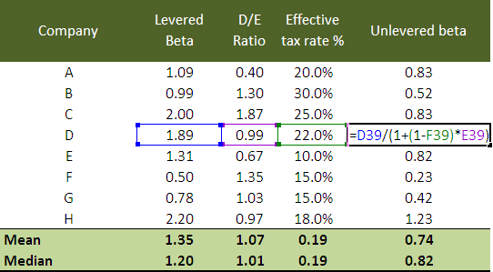

Beta is a critical metric in finance, serving as a cornerstone in assessing the risk and volatility of financial portfolios. It measures the sensitivity of a security's returns to those of the broader market, playing an integral role in the Capital Asset Pricing Model (CAPM). Through beta, investors and analysts address how market movements can affect individual asset returns, and thus, make informed decisions regarding portfolio risk management.

For public companies, calculating beta involves straightforward statistical analysis of historical price data, readily available from financial markets. This data facilitates the computation of systematic risk, reflecting how a stock's price deviates in relation to broad market movements, typically represented by a market index such as the S&P 500. The formula for calculating beta is given by:



$$
\beta = \frac{\text{Covariance}(\text{Return of the Stock}, \text{Return of the Market})}{\text{Variance}(\text{Return of the Market})}
$$

However, the scenario differs substantially for private companies, as they lack publicly traded stock prices. As a result, calculating beta for these entities becomes a complex task, often requiring alternative methods such as using industry average levered beta or the earnings beta approach. These methods involve leveraging publicly available data from similar public companies and making modifications to tailor the results to the private entity’s financial structure.

Beta’s relevance extends beyond traditional financial analysis into the sphere of algorithmic trading, where it is pivotal in formulating strategies to maximize returns and minimize risks. In algorithmic contexts, beta is applied to optimize portfolios and adjust trade positions dynamically, providing a quantitative foundation for automated decision-making processes. By analyzing beta, trading algorithms can assess the expected volatility of asset returns and adjust their strategies to respond swiftly to changing market conditions.

In summary, beta is indispensable in financial analysis and trading, helping investors and traders to understand and manage the risk and volatility inherent in market investments. Whether dealing with public or private companies, or integrating into algorithmic systems, beta remains a fundamental metric for informed financial decision-making.

## Table of Contents

## Understanding Beta: A Key Financial Metric

Beta is a fundamental financial metric used to assess the risk and [volatility](/wiki/volatility-trading-strategies) of an individual security or a portfolio in relation to the overall market. It plays a critical role in the Capital Asset Pricing Model (CAPM), which is a model used to determine the expected return on an investment while accounting for its risk relative to the market.

In the CAPM, beta ($\beta$) serves as a coefficient that describes the extent to which the return of a security is expected to respond to movements in the market. The formula for CAPM is expressed as:
$$

E(R_i) = R_f + \beta_i [E(R_m) - R_f] 
$$
where:
- $E(R_i)$ is the expected return of the investment.
- $R_f$ is the risk-free rate of return.
- $\beta_i$ is the beta of the investment.
- $E(R_m)$ is the expected return of the market.

The beta value reflects the volatility of a security relative to the market. A beta of 1 indicates that the security's price is expected to move with the market. A beta greater than 1 suggests that the security is more volatile than the market, while a beta less than 1 implies less volatility.

Interpretation of beta values is crucial for investment strategies:
- **Beta = 1**: The security's volatility is aligned with the market index.
- **Beta > 1**: The security is more volatile than the market, indicating a higher risk. Investors expecting favorable market conditions might seek high-beta stocks for potentially greater returns.
- **Beta < 1**: The security is less volatile, denoting a lower risk. This is typically attractive during market downturns or for risk-averse investors.
- **Beta = 0**: The security’s return is uncorrelated with the market. Assets like cash or CD might have near-zero beta.
- **Negative Beta**: The security moves inversely to market movements, offering diversification benefits in a portfolio by reducing overall risk.

Beta, as a measure of systematic risk, allows investors to understand how a security might react to general market trends and tailor their portfolios accordingly. In practice, evaluating beta helps in constructing diversified portfolios that align with an investor’s risk tolerance and return expectations.

## Calculating Beta for Private Companies

Calculating beta for private companies presents unique challenges primarily due to the absence of publicly traded shares and the accompanying lack of market price data. This absence makes it difficult to employ standard beta calculation methods that rely on comparing a company's stock returns against a market benchmark. However, several alternative approaches exist to address this issue: using industry average levered beta and the earnings beta approach.

**Industry Average Levered Beta Method**

One common method is to substitute the private company's beta with the industry average levered beta. This involves several steps:

1. **Identify Comparable Companies**: Select a set of public companies operating within the same industry as the private firm.

2. **Calculate or Obtain Public Betas**: Obtain the levered betas of these comparable public companies. These betas can typically be sourced from financial databases such as Bloomberg or derived using stock return data.

3. **Unlever Betas**: Adjust the betas to remove the effects of the companies' specific financial leverage. This provides an "asset beta" which strictly reflects business risk:
$$
   \beta_{\text{unlevered}} = \frac{\beta_{\text{levered}}}{1 + (1 - \text{Tax Rate}) \times \frac{\text{Debt}}{\text{Equity}}}

$$

4. **Calculate Industry Average Unlevered Beta**: Average the unlevered betas of the comparable companies to find an industry average.

5. **Re-Lever for Private Firm**: Adjust the industry average unlevered beta to reflect the private company's financial structure:
$$
   \beta_{\text{private}} = \beta_{\text{unlevered}} \times \left(1 + (1 - \text{Tax Rate}) \times \frac{\text{Private Company's Debt}}{\text{Private Company's Equity}}\right)

$$

**Earnings Beta Approach**

Another technique to estimate a private company's beta involves the earnings beta approach:

1. **Earnings-Based Data**: Obtain historical earnings data (such as EBIT) for the private firm and for a benchmark index or a sample of comparable firms.

2. **Regression Analysis**: Conduct a regression analysis of the private company's earnings changes against those of the benchmark. This analysis results in an earnings beta, reflecting the sensitivity of the company's earnings to market or industry changes:
$$
   \text{Earnings Beta} = \frac{\text{Cov}(\Delta \text{Earnings}_{\text{company}}, \Delta \text{Earnings}_{\text{market}})}{\text{Var}(\Delta \text{Earnings}_{\text{market}})}

$$

**Practical Applications and Case Studies**

Consider a tech startup looking to determine its risk profile for investors. Without stock price history, it turns to the industry average levered beta approach. After identifying five established public tech companies, the startup estimates a beta of 1.25. This aids in establishing expected returns and guides strategic financial planning.

Alternatively, a firm in a volatile sector may opt for the earnings beta approach, analyzing its earnings against industry trends. By discovering a low earnings beta of 0.8, it reassures potential creditors of its resilience against market fluctuations.

In both methods, the ultimate objective remains consistent: providing a robust estimate of risk that informs capital cost calculations, investment decisions, and risk management frameworks. These approaches are vital for private companies lacking direct access to market beta, ensuring they can still partake in informed financial strategy planning.

## Algorithmic Trading and Beta Analysis

Algorithmic trading, a method where computers execute buy and sell orders based on pre-programmed criteria, often integrates beta analysis to enhance strategy formulation and execution efficiency. Beta, a measure of an asset's volatility relative to the market (usually quantified in relation to an index such as the S&P 500), is crucial in understanding and managing risk in such sophisticated trading systems.

### Integration of Beta Analysis in Algorithmic Trading Strategies

In [algorithmic trading](/wiki/algorithmic-trading), strategies that account for volatility are paramount. Beta is used to gauge an asset's systematic risk—essentially identifying how responsive it is to market swings. Algorithms can adjust the position size of trades based on beta values, modifying exposure levels according to market conditions. For instance, a high beta (>1) indicates that a security is more volatile than the market, suggesting that traders might choose to reduce exposure during turbulent periods, while a low beta (<1) offers a hedge against broad market movements.

### Methods for Incorporating Beta Calculations

Algorithmic trading systems often require real-time beta computation to automate decisions rapidly. This process typically involves statistical models that process historical price data, correlating asset performance with market indices. Here's a simple Python snippet to calculate beta:

```python
import pandas as pd
import numpy as np

# Assuming 'df' is a DataFrame with market index returns and asset returns
def calculate_beta(df, asset_column='asset_returns', market_column='market_returns'):
    covariance = np.cov(df[asset_column], df[market_column])[0][1]
    market_variance = np.var(df[market_column])
    beta = covariance / market_variance
    return beta

# Example usage
# df = pd.DataFrame({'asset_returns': [...], 'market_returns': [...]})
# beta = calculate_beta(df)
```

This beta calculation can be dynamically integrated into trading algorithms to automatically rebalance portfolios or switch strategies based on computed risk ratios.

### Beta's Role in Portfolio Optimization and Risk Management

In the context of portfolio optimization, beta helps in constructing a diversified set of investments that align with an investor's risk tolerance. Through methods such as the Capital Asset Pricing Model (CAPM), which utilizes beta to establish expected returns, traders can optimize portfolios to achieve the highest return for a given level of risk. Algorithmic systems can employ such models to simulate various portfolio configurations, continually adjusting holdings to maintain a desired risk profile.

Moreover, beta is an integral component of risk management within algorithmic trading. By understanding the beta of each asset, algorithms can compute the portfolio beta, aiding in assessing the overall volatility and aligning it with market conditions. This approach ensures that risk is systematically managed, preventing excessive volatility exposure during periods of market distress.

In conclusion, beta analysis forms a critical component of algorithmic trading strategies. By providing insights into market-related risks, it allows algorithms to make informed decisions, leveraging volatility for optimized trading outcomes and enhanced risk management.

## Step-by-Step Guide: Calculating Beta in Excel

Calculating beta in Excel is an essential skill for financial analysts, allowing for the assessment of a security's volatility relative to the market. This process starts with setting up Excel to gather and organize historical price data effectively.

### Step 1: Gathering and Organizing Historical Price Data

To begin, collect historical price data for both the individual security and the benchmark index. Data can typically be found on financial websites or databases such as Yahoo Finance or Bloomberg. Ensure that the data spans a sufficient time frame, usually ranging from three to five years, depending on availability and relevance.

Once gathered, organize this data in an Excel worksheet. In the first column (Column A), list the dates of the data. The second column (Column B) should contain the prices or returns of the security, while the third column (Column C) should feature the prices or returns of the benchmark index, such as the S&P 500.

### Step 2: Calculating Returns

For beta calculation, it's often more insightful to use returns instead of prices. To calculate returns, use the formula:

$$
\text{Return} = \frac{\text{Price at Day } n - \text{Price at Day } (n-1)}{\text{Price at Day } (n-1)}
$$

Apply this formula from the second row down in columns adjacent to the price data. These could be Column D for the security and Column E for the index.

### Step 3: Utilizing Excel Functions to Compute Beta

With returns calculated, proceed to compute beta using Excel functions:

1. **SLOPE Function:**
   Use the SLOPE function to calculate beta directly, using the returns of the security and the index.
   ```excel
   =SLOPE(D2:DX, E2:EX)
   ```
   Here, replace DX and EX with the last row of your data.

2. **INTERCEPT and CORREL Functions:**
   Alternatively, beta can be calculated manually using the formula:
   \[ \beta = \frac{\text{CORREL(security returns, index returns) } \times \text{ STDEV(security returns)}}{\text{STDEV(index returns)}}
$$

   In Excel, first calculate correlation and standard deviations:
   ```excel
   correlation =CORREL(D2:DX, E2:EX)
   stdev_security =STDEV.P(D2:DX)
   stdev_index =STDEV.P(E2:EX)
   ```

   Then, calculate beta using these statistical measures:
   ```excel
   beta = correlation * (stdev_security / stdev_index)
   ```

### Tips for Avoiding Common Pitfalls

- **Data Input Errors**: Double-check that your data is accurate and correctly aligned by date. Improperly aligned data can yield incorrect calculations.

- **Over-reliance on Historical Beta**: While beta is a useful measure of volatility, it's critical to recognize that it is based on historical data and may not fully predict future risks or performance. It is essential to complement beta analysis with other financial evaluations and qualitative insights about the company or market conditions.

By following these steps and being mindful of common pitfalls, one can effectively calculate beta in Excel, a pivotal component of financial and risk analysis.

## Conclusion: Leveraging Beta for Financial Success

Beta serves as a pivotal component in financial analysis and trading strategy development due to its ability to quantify risk and volatility relative to market movements. By measuring a security's sensitivity to fluctuations in the market, beta provides investors with a metric for forecasting potential returns based on their risk appetite.

The application of beta extends beyond merely calculating risk. It is integral in the Capital Asset Pricing Model (CAPM), where it aids in determining the expected return on an asset, helping investors make informed decisions on asset allocation. For instance, a beta greater than one suggests that the security is more volatile than the market, while a beta less than one indicates less volatility. This understanding allows investors to tailor their portfolios in accordance with desired risk levels, promoting strategic investment decisions.

Combining quantitative metrics like beta with qualitative analysis enhances investment strategies. While beta offers insights into historical volatility and risk, qualitative factors—such as macroeconomic indicators, industry trends, and the company's operational strengths—provide a more comprehensive view of potential investment outcomes. This synthesis of quantitative and qualitative assessments aids in forming a holistic perspective, thereby increasing the likelihood of achieving financial success.

In an environment of dynamic market conditions, it is essential to continually refine beta calculation techniques. Technological advancements and increased access to data empower analysts and traders to develop sophisticated models that account for multiple market variables. Innovations in data science and [machine learning](/wiki/machine-learning) enable the derivation of more accurate beta values, improving predictive capabilities and optimizing trading algorithms.

To stay competitive, investors and analysts must adapt to evolving market conditions by updating their methodologies and incorporating advanced data analytics. They should remain agile, reassessing models regularly and integrating emerging trends and technologies in beta computation. This continuous improvement process ensures that their analysis remains relevant and robust, ultimately enhancing portfolio management and trading strategies.

In summary, leveraging beta effectively requires a balanced approach that incorporates robust quantitative measures alongside insightful qualitative analysis. By adapting beta measurement techniques in response to market changes and technological advancements, individuals can optimize their financial strategies, achieving long-term success in a complex and ever-changing financial landscape.

## References & Further Reading

A comprehensive understanding of beta calculation and its applications is essential for those interested in financial modeling, algorithmic trading, and risk management. Below is a list of resources and suggested readings that provide further insights into these topics:

1. **Books:**
   - "Investments" by Zvi Bodie, Alex Kane, and Alan Marcus. This book provides a thorough introduction to the Capital Asset Pricing Model (CAPM) and the concept of beta in financial markets.
   - "Quantitative Momentum" by Wesley R. Gray and Jack R. Vogel. This work investigates the role of quantitative techniques in momentum investing, including the integration of beta in developing strategies.
   - "Algorithmic Trading: Winning Strategies and Their Rationale" by Ernie Chan. The book explains how beta is used in creating algorithmic trading strategies and offers practical insights for traders and financial analysts.

2. **Research Papers:**
   - Fama, Eugene F., and Kenneth R. French. "The Cross-Section of Expected Stock Returns." Journal of Finance. This paper examines factors influencing stock returns, including beta, offering foundational knowledge for modern financial theory.
   - Roll, Richard, and Stephen Ross. "An Empirical Investigation of the Arbitrage Pricing Theory." Journal of Finance. This research investigates alternative models to CAPM, which extend the understanding of risk factors beyond beta.

3. **Online Courses and Platforms:**
   - Coursera's "Financial Markets" by Yale University. The course, led by economist Robert Shiller, provides a broad overview of financial markets, including risk assessment methods like beta.
   - Khan Academy's Finance and Capital Markets. This free resource offers instructional videos and exercises on financial concepts, including beta and CAPM.

4. **Software and Tools:**
   - Python libraries such as `pandas`, `numpy`, and `scipy` are valuable for financial analysis. Users can calculate beta using regression functions provided within these libraries.
   - Financial tools like Bloomberg Terminal and Reuters Eikon provide real-time data analysis capabilities, including beta calculation features.

5. **Websites and Blogs:**
   - Investopedia offers detailed articles and educational content on beta, CAPM, and other financial metrics, helpful for both beginners and experienced practitioners.
   - Financial and trading blogs often feature case studies and real-world applications of beta in portfolio management, providing practical insights beyond academic theory.

These resources collectively enhance one's ability to understand and apply beta in various financial contexts, equipping both novices and experts with the tools necessary for effective financial decision-making.

