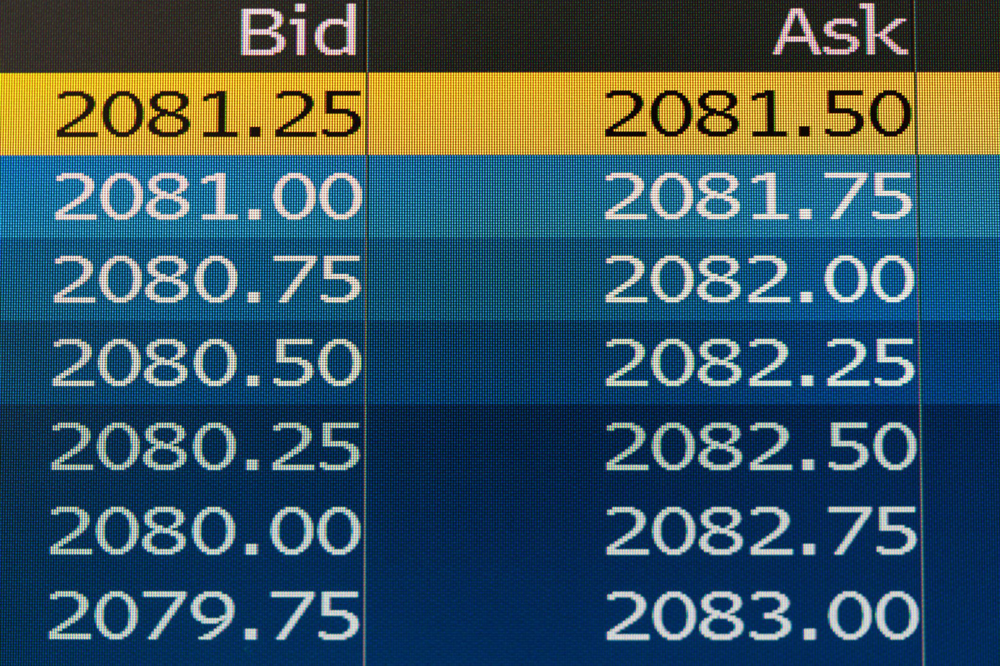

## Table of Contents

## What is the bid-ask spread?

The bid-ask spread is the difference between the highest price a buyer is willing to pay for a stock (the bid) and the lowest price a seller is willing to accept (the ask). It's like the gap between what someone wants to buy something for and what someone else is willing to sell it for. This spread is important because it affects the cost of trading. A smaller spread means trading is cheaper, while a larger spread means it's more expensive.

The bid-ask spread can change based on how many people want to buy or sell the stock, how easy it is to trade, and how much the stock's price moves around. If a stock is popular and lots of people are trading it, the spread is usually smaller. But if a stock is not traded often, the spread can be bigger. Understanding the bid-ask spread helps investors know how much they might pay to buy or sell a stock.

## Why is the bid-ask spread important for investors?

The bid-ask spread is important for investors because it tells them how much it might cost to buy or sell a stock. When you want to buy a stock, you have to pay the ask price, which is the lowest price the seller will accept. When you want to sell, you get the bid price, which is the highest price a buyer is willing to pay. The difference between these two prices is the bid-ask spread. A smaller spread means it's cheaper to trade, while a larger spread means it's more expensive. So, knowing the spread helps investors figure out the real cost of their trades.

Also, the bid-ask spread can show how easy or hard it is to trade a stock. If the spread is small, it usually means the stock is popular and lots of people are trading it. This makes it easier to buy or sell quickly. But if the spread is big, it might mean the stock is not traded often, and it could be harder to find someone to buy from or sell to. By looking at the bid-ask spread, investors can get a sense of how liquid a stock is, which can help them make better decisions about when and what to trade.

## How is the bid-ask spread calculated?

The bid-ask spread is calculated by finding the difference between the highest price someone is willing to pay for a stock, which is called the bid price, and the lowest price someone is willing to sell the stock for, which is called the ask price. For example, if the bid price for a stock is $50 and the ask price is $51, the bid-ask spread is $1.

This spread can change all the time because it depends on what buyers and sellers are willing to do at any moment. If lots of people want to buy and sell the stock, the spread might be smaller because there's more competition. But if not many people are trading the stock, the spread could be bigger because it's harder to find someone to trade with. Understanding how the spread is calculated helps investors know how much it might cost them to buy or sell a stock.

## What factors influence the bid-ask spread?

The bid-ask spread can change because of many things. One big thing is how easy it is to buy or sell the stock. If a stock is popular and lots of people are trading it, the spread is usually smaller. This is because there are more people wanting to buy and sell, so the prices don't have to be that different to make a trade happen. But if a stock is not traded often, the spread can be bigger. This is because it's harder to find someone to trade with, so the seller might ask for a higher price and the buyer might offer a lower price.

Another thing that can change the bid-ask spread is how much the stock's price moves around. If the price of a stock goes up and down a lot, the spread might be bigger. This is because people might want more money to take the risk of buying or selling when the price could change a lot. Also, the size of the trade can matter. If someone wants to buy or sell a lot of shares at once, the spread might be bigger because it's harder to find someone to trade that many shares.

The type of market and the rules of the exchange can also affect the bid-ask spread. For example, in a very busy market where lots of trading happens, the spread is often smaller. But in a market where trading is slow, the spread might be bigger. Also, some markets have rules that can make the spread smaller or bigger. Understanding these things can help investors know why the spread might be different for different stocks and at different times.

## How does liquidity affect the bid-ask spread?

Liquidity is how easy it is to buy or sell a stock. If a stock is very liquid, it means lots of people want to trade it, and it's easy to find someone to buy from or sell to. When a stock is liquid, the bid-ask spread is usually smaller. This is because there are lots of buyers and sellers, so they don't have to offer very different prices to make a trade happen. Think of it like a busy market where everyone is happy to buy and sell at prices that are close to each other.

On the other hand, if a stock is not very liquid, it means fewer people are trading it, and it can be harder to find someone to trade with. When a stock is not liquid, the bid-ask spread is usually bigger. This is because the seller might want a higher price and the buyer might offer a lower price, since there are fewer people to trade with. It's like a quiet market where you might have to wait longer to find someone to buy or sell to, and the prices might be further apart.

## Can the bid-ask spread be used to measure market volatility?

The bid-ask spread can give us a clue about how much a stock's price might be moving around, which is called market [volatility](/wiki/volatility-trading-strategies). When the bid-ask spread is bigger, it often means the stock's price is going up and down a lot. This is because sellers want more money to take the risk of selling when the price could drop, and buyers want to pay less because the price could go up. So, a bigger spread can be a sign that the market is more volatile.

But, the bid-ask spread is not the only thing that tells us about market volatility. Other things like how often the stock's price changes and how big those changes are also matter. Still, the bid-ask spread is a quick way to get an idea of how much the price might be moving. If you see the spread getting bigger, it might mean the market is getting more unpredictable.

## What is the difference between a narrow and a wide bid-ask spread?

A narrow bid-ask spread means there's not much difference between the highest price a buyer wants to pay and the lowest price a seller will accept. This usually happens when a lot of people are trading the stock, making it easy to buy or sell. A narrow spread is good for investors because it means they can trade without spending too much extra money. It's like going to a busy store where lots of people are buying and selling at prices that are close to each other.

On the other hand, a wide bid-ask spread means there's a big difference between what buyers are willing to pay and what sellers want to get. This often happens when fewer people are trading the stock, making it harder to find someone to trade with. A wide spread can make trading more expensive because investors have to pay more to buy or get less when they sell. It's like going to a quiet store where you might have to wait longer to find someone to buy from or sell to, and the prices might be further apart.

## How does the bid-ask spread impact trading costs?

The bid-ask spread affects how much it costs to trade a stock. When you want to buy a stock, you have to pay the ask price, which is what the seller wants. When you want to sell, you get the bid price, which is what the buyer is willing to pay. The difference between these two prices is the bid-ask spread. If the spread is small, it's cheaper to trade because you don't have to pay much more than what you'll get back when you sell. But if the spread is big, it's more expensive because you have to pay a lot more to buy the stock than what you'll get when you sell it.

For example, if the bid price is $50 and the ask price is $51, the spread is $1. If you buy the stock at $51 and then sell it right away at $50, you lose $1 just because of the spread. This cost can add up, especially if you trade a lot. So, a smaller spread means lower trading costs, making it easier and cheaper for investors to buy and sell stocks. A bigger spread, on the other hand, means higher trading costs, which can make trading less attractive and more expensive.

## What strategies can traders use to minimize the impact of the bid-ask spread?

Traders can use a few smart moves to cut down the costs from the bid-ask spread. One good idea is to pick stocks that are traded a lot. When lots of people are buying and selling, the spread is usually smaller. This means it's cheaper to trade. Another trick is to use "limit orders" instead of "market orders." With a limit order, you say the highest price you'll pay to buy or the lowest price you'll take to sell. This way, you don't have to pay the ask price right away or sell at the bid price, which can save you money.

Another strategy is to watch the market and trade when the spread is smaller. Sometimes, the spread can change during the day. If you see it getting smaller, that's a good time to trade. Also, some traders use "price improvement" strategies. This means they try to get a better price than what's shown on the market. They might do this by talking to their broker or using special trading tools. By being smart about when and how they trade, traders can make the bid-ask spread less of a problem.

## How do electronic trading platforms affect the bid-ask spread?

Electronic trading platforms have made the bid-ask spread smaller for many stocks. These platforms let lots of people trade at the same time from all over the world. When more people are trading, it's easier to find someone who wants to buy or sell at a price close to what you want. This competition makes the spread smaller. Also, these platforms use computers to match buyers and sellers really fast, so the spread stays small even when the market is moving quickly.

But electronic trading platforms can also make the spread bigger sometimes. If a stock is not traded often, there might not be many people using the platform to trade it. When fewer people are trading, it's harder to find someone to buy from or sell to, so the spread can get bigger. Also, if the market is moving a lot and prices are changing quickly, the spread might get bigger because people want more money to take the risk of trading in a fast-moving market.

## What role does market maker play in determining the bid-ask spread?

A market maker is like a middleman in the stock market. They help make sure there are always people ready to buy and sell stocks. Market makers do this by always having a price they're willing to buy at (the bid) and a price they're willing to sell at (the ask). The difference between these two prices is the bid-ask spread. Market makers want to make money, so they set the spread to cover their costs and make a profit. If they think a stock is risky or hard to trade, they might make the spread bigger to protect themselves.

Market makers can make the bid-ask spread smaller or bigger depending on how many people want to trade the stock and how easy it is to trade. If lots of people are trading a stock, market makers might make the spread smaller to attract more trades and make more money from the [volume](/wiki/volume-trading-strategy). But if not many people are trading a stock, market makers might make the spread bigger because it's harder for them to find someone to trade with. So, market makers play a big role in deciding how big or small the bid-ask spread will be.

## How can advanced statistical models be used to predict changes in the bid-ask spread?

Advanced statistical models can help traders guess how the bid-ask spread might change. These models look at lots of data from the past, like how often people traded the stock, how much the price moved, and how many people were buying and selling. By studying this data, the models can find patterns that show when the spread might get bigger or smaller. For example, if the model sees that the spread usually gets bigger when fewer people are trading, it can warn traders to be careful during those times.

Traders can use these predictions to make smarter choices about when to buy or sell. If the model says the spread is going to get smaller, it might be a good time to trade because it will be cheaper. But if the model says the spread is going to get bigger, traders might wait or use different strategies to save money. These models don't always get it right, but they can give traders a better idea of what might happen, helping them make better trading decisions.

## References & Further Reading

[1]: Amihud, Y., & Mendelson, H. (1986). ["Asset Pricing and the Bid-Ask Spread."](https://www.sciencedirect.com/science/article/pii/0304405X86900656) Journal of Financial Economics, 17(2), 223-249.

[2]: Hasbrouck, J. (2007). ["Empirical Market Microstructure: The Institutions, Economics, and Econometrics of Securities Trading."](https://academic.oup.com/book/52241) Oxford University Press.

[3]: Harris, L. (2003). ["Trading and Exchanges: Market Microstructure for Practitioners."](https://academic.oup.com/book/52292) Oxford University Press.

[4]: O'Hara, M. (1995). ["Market Microstructure Theory."](https://www.semanticscholar.org/paper/Market-Microstructure-Theory-O'Hara/2bd0833b023f3270a2a6bf301e86b8e02e2f28ed) Blackwell Publishers.

[5]: Kissell, R. (2014). ["The Science of Algorithmic Trading and Portfolio Management."](https://www.sciencedirect.com/book/9780124016897/the-science-of-algorithmic-trading-and-portfolio-management) Academic Press.