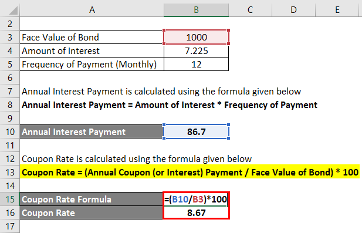

## Table of Contents

## What is a bond's coupon rate?

A bond's coupon rate is the annual interest rate paid on the bond's face value. It is expressed as a percentage and tells you how much interest you will earn each year if you hold the bond until it matures. For example, if a bond has a face value of $1,000 and a coupon rate of 5%, you will receive $50 in interest each year.

The coupon rate is set when the bond is issued and usually stays the same for the life of the bond. This makes it different from other interest rates that might change over time. The coupon rate helps investors know what return they can expect from the bond, which is important for deciding whether to buy it or not.

## Why is it important to calculate a bond's coupon rate?

Calculating a bond's coupon rate is important because it tells you how much money you will earn from the bond each year. When you know the coupon rate, you can figure out if the bond is a good investment for you. For example, if you need a certain amount of income every year, you can see if the bond's coupon payments will meet your needs. This helps you make smart choices about where to put your money.

The coupon rate also helps you compare different bonds. If you are looking at two bonds with the same face value but different coupon rates, the one with the higher coupon rate will give you more money each year. This makes it easier to decide which bond is a better deal. By understanding the coupon rate, you can pick the bond that fits your financial goals best.

## What are the basic components needed to calculate a bond's coupon rate?

To calculate a bond's coupon rate, you need to know two main things: the annual coupon payment and the bond's face value. The annual coupon payment is the amount of money you get each year from the bond. The face value is the amount of money you will get back when the bond matures. You find the coupon rate by dividing the annual coupon payment by the face value and then turning that number into a percentage.

For example, if a bond has an annual coupon payment of $50 and a face value of $1,000, you would divide $50 by $1,000 to get 0.05. When you turn 0.05 into a percentage, you get a coupon rate of 5%. Knowing these two pieces of information helps you figure out how much money you will earn from the bond each year, which is important for deciding if it's a good investment for you.

## How do you set up an Excel spreadsheet to calculate a bond's coupon rate?

To set up an Excel spreadsheet to calculate a bond's coupon rate, start by opening a new Excel workbook. In cell A1, type "Annual Coupon Payment" and in cell B1, enter the dollar amount of the annual coupon payment, like $50. In cell A2, type "Face Value" and in cell B2, enter the bond's face value, like $1,000. In cell A3, type "Coupon Rate". To calculate the coupon rate, in cell B3, type the formula "=B1/B2". This formula divides the annual coupon payment by the face value. To turn this into a percentage, you can format cell B3 to display as a percentage by right-clicking on the cell, selecting "Format Cells", and then choosing "Percentage" with the number of decimal places you want.

After setting up the spreadsheet, you can see the coupon rate displayed as a percentage in cell B3. If you enter $50 for the annual coupon payment and $1,000 for the face value, the formula will calculate 0.05, which, when formatted as a percentage, will show as 5%. This simple setup allows you to quickly change the values in cells B1 and B2 to calculate the coupon rate for different bonds. By using Excel this way, you can easily compare the coupon rates of various bonds to help you make better investment decisions.

## What Excel functions are useful for calculating a bond's coupon rate?

To calculate a bond's coupon rate in Excel, you mainly need to use simple division and formatting functions. You can use the division operator "/" to divide the annual coupon payment by the bond's face value. For example, if the annual coupon payment is in cell B1 and the face value is in cell B2, you can type "=B1/B2" in another cell to get the coupon rate as a decimal. This simple calculation is the core of finding the coupon rate.

After you have the decimal result, you need to change it into a percentage. You can do this by formatting the cell that shows the coupon rate. Right-click on the cell, choose "Format Cells", and then pick "Percentage" to make the number show as a percentage. For example, if the result of the division is 0.05, formatting it as a percentage will show it as 5%. By using these basic Excel functions, you can easily find and compare the coupon rates of different bonds.

## How do you input bond face value, annual coupon payment, and bond price into Excel?

To input the bond face value, annual coupon payment, and bond price into Excel, start by opening a new Excel workbook. In cell A1, type "Bond Face Value" and in cell B1, enter the bond's face value, like $1,000. In cell A2, type "Annual Coupon Payment" and in cell B2, enter the annual coupon payment, like $50. In cell A3, type "Bond Price" and in cell B3, enter the bond's current market price, like $950. This simple setup helps you keep track of the important details about the bond.

Once you have entered these values, you can use them to calculate the bond's coupon rate and other useful information. For example, to find the coupon rate, you can type "=B2/B1" in cell B4 and format it as a percentage to see the result. This way, you can quickly see how much money the bond will pay you each year compared to its face value. By organizing the data this way, you can easily change the numbers and see how it affects the bond's performance.

## What is the formula for calculating a bond's coupon rate in Excel?

To calculate a bond's coupon rate in Excel, you need to know the annual coupon payment and the bond's face value. In Excel, you can find the coupon rate by dividing the annual coupon payment by the bond's face value. For example, if the annual coupon payment is in cell B2 and the face value is in cell B1, you can type "=B2/B1" in another cell to get the coupon rate as a decimal.

After you have the decimal result, you need to change it into a percentage. To do this, right-click on the cell where you typed the formula, choose "Format Cells", and then pick "Percentage". This will make the number show as a percentage. For example, if the result of the division is 0.05, formatting it as a percentage will show it as 5%. This simple calculation helps you understand how much money the bond will pay you each year compared to its face value.

## How can you verify the accuracy of your coupon rate calculation in Excel?

To check if your coupon rate calculation in Excel is correct, you can use a simple trick. First, make sure you entered the right numbers for the annual coupon payment and the bond's face value. Then, do the calculation by hand or with a calculator. If the number you get matches the number in Excel, your calculation is probably right. You can also try changing the numbers a little bit to see if the coupon rate changes the way you expect it to. If it does, that's another sign that your calculation is accurate.

Another way to verify the coupon rate is to compare it with the bond's details from a trusted source, like a financial website or the bond's prospectus. If the coupon rate you calculated in Excel matches the one listed on these sources, you can be sure your calculation is correct. It's always a good idea to double-check important numbers to make sure you're making smart decisions with your money.

## What are common mistakes to avoid when calculating a bond's coupon rate in Excel?

When calculating a bond's coupon rate in Excel, one common mistake is mixing up the annual coupon payment and the bond's face value. Make sure you enter the annual coupon payment, which is how much money you get each year, in one cell, and the bond's face value, which is how much you get back when the bond matures, in another cell. If you switch these numbers, your coupon rate will be wrong. Another mistake is not formatting the result as a percentage. After you divide the annual coupon payment by the face value, you need to right-click the cell, choose "Format Cells," and then pick "Percentage" to see the coupon rate correctly.

Also, be careful with the numbers you enter. If you accidentally put in the wrong numbers for the annual coupon payment or the face value, your coupon rate will be off. Always double-check the numbers before you start calculating. It's a good idea to compare your calculated coupon rate with the bond's details from a reliable source, like a financial website or the bond's prospectus, to make sure your calculation is right. By avoiding these mistakes, you can make sure your coupon rate calculation in Excel is accurate and helpful for your investment decisions.

## How does the frequency of coupon payments affect the calculation of the coupon rate?

The frequency of coupon payments doesn't change the coupon rate itself. The coupon rate is always the annual [interest rate](/wiki/interest-rate-trading-strategies) paid on the bond's face value. If a bond has a coupon rate of 5%, it means you get 5% of the face value every year, no matter how often you get the payments. So, if the face value is $1,000, you get $50 every year, whether it comes in one payment, two payments, or four payments.

However, the way you calculate the annual coupon payment can change depending on how often you get the payments. If the bond pays interest twice a year, each payment is half of the annual amount. So, for a 5% coupon rate on a $1,000 bond, you would get $25 every six months. If it pays four times a year, each payment would be $12.50 every three months. But no matter how often you get the payments, the total for the year stays the same, and so does the coupon rate.

## Can Excel be used to compare the coupon rates of different bonds, and if so, how?

Yes, you can use Excel to compare the coupon rates of different bonds. First, set up a spreadsheet where each row represents a different bond. In the first column, you can label each bond, like "Bond A" and "Bond B". In the second column, enter the face value of each bond, like $1,000. In the third column, enter the annual coupon payment for each bond, like $50 for Bond A and $60 for Bond B. Then, in the fourth column, calculate the coupon rate by dividing the annual coupon payment by the face value and formatting the result as a percentage. For example, for Bond A, you would type "=C2/B2" in cell D2, and for Bond B, "=C3/B3" in cell D3.

After you have the coupon rates for each bond in the fourth column, you can easily see which bond offers a higher rate. If Bond A has a coupon rate of 5% and Bond B has a coupon rate of 6%, you can quickly tell that Bond B will give you more money each year for the same face value. This makes it easy to compare and decide which bond is a better investment based on the coupon rate. By using Excel this way, you can handle many bonds at once and make smart choices about where to put your money.

## How can advanced Excel users automate the calculation of coupon rates for multiple bonds?

Advanced Excel users can automate the calculation of coupon rates for multiple bonds by using a combination of functions and formulas. Start by setting up a table where each row represents a different bond. In the first column, label the bonds, like "Bond A" and "Bond B". In the second column, enter the face value of each bond, and in the third column, enter the annual coupon payment. Then, in the fourth column, use a formula like "=C2/B2" to calculate the coupon rate for each bond automatically. Format this column as a percentage to see the coupon rates clearly. As you add more bonds to the table, the formula will automatically calculate the coupon rate for each new entry, making it easy to compare multiple bonds at once.

To make this process even more efficient, you can use Excel's data validation and named ranges. Set up data validation rules to ensure that only valid numbers are entered for the face value and annual coupon payment. This helps prevent errors in your calculations. You can also use named ranges for the face value and annual coupon payment columns, which makes your formulas easier to read and maintain. For example, if you name the face value column "FaceValue" and the annual coupon payment column "CouponPayment", your formula could be "=CouponPayment/FaceValue". This way, as you add more bonds, Excel will automatically calculate and update the coupon rates, saving you time and reducing the chance of mistakes.

## What are the formulas for calculating coupon rate?

The coupon rate of a bond represents the annual interest payment that the bondholder receives from the issuer, expressed as a percentage of the bond's face value. Calculating this rate is straightforward with the basic formula given by:

$$
\text{Coupon Rate} = \left( \frac{\text{Annual Coupon Payment}}{\text{Face Value of Bond}} \right) \times 100\%
$$

For instance, if a bondholder receives an annual coupon payment of $50 on a bond with a face value of $1,000, the coupon rate would be calculated as follows:

$$
\text{Coupon Rate} = \left( \frac{\$50}{\$1000} \right) \times 100\% = 5\%
$$

For bonds that pay interest more frequently than annually, such as those that make semi-annual or quarterly payments, it is necessary to adjust the calculation of the annual coupon payment by considering the total amount received over the [course](/wiki/best-algorithmic-trading-courses) of a year. 

For semi-annual payments, the formula can be adjusted to:

$$
\text{Coupon Rate} = \left( \frac{\text{(Semi-annual Coupon Payment} \times 2)}{\text{Face Value of Bond}} \right) \times 100\%
$$

Similarly, for quarterly payments:

$$
\text{Coupon Rate} = \left( \frac{\text{(Quarterly Coupon Payment} \times 4)}{\text{Face Value of Bond}} \right) \times 100\%
$$

By summing the payment frequencies within a year (i.e., multiplying the periodic coupon payment by the number of periods per year), the annualized coupon payment is obtained, enabling accurate calculation of the coupon rate. These adjustments ensure that the coupon rate reflects the true annual return a bondholder can expect from their investment.

## What is the conclusion?

Calculating the coupon rate of bonds is fundamental for investment analysis, serving as a critical metric in understanding potential returns from bond investments. Excel emerges as a robust platform for performing and automating these calculations, enhancing both accuracy and efficiency in financial analysis. By setting up spreadsheets to process data like coupon payments and the face value of bonds, investors and analysts can swiftly compute the coupon rate using simple formulas, such as:

$$
\text{Coupon Rate} = \left(\frac{\text{Annual Coupon Payment}}{\text{Face Value of Bond}}\right) \times 100\%
$$

This process becomes even more powerful when combined with Excel's built-in functions like `RATE()` and `YIELD()`, which aid in yielding comprehensive insights into bond performance metrics and present value assessments. 

Moreover, understanding and applying these concepts effectively can significantly enhance trading algorithms and investment strategies. In [algorithmic trading](/wiki/algorithmic-trading), precise real-time calculations are essential, and automating bond-related calculations—including the coupon rate—can provide a competitive edge in optimizing portfolios and making informed, data-driven decisions. As financial markets continue to evolve in complexity and scale, leveraging tools like Excel not only supports thorough investment analysis but also facilitates the integration of these analyses into broader trading systems.

## References & Further Reading

[1]: Bodie, Z., Kane, A., & Marcus, A. J. (2014). ["Investments"](https://books.google.com/books/about/EBOOK_Investments_Global_edition.html?id=BMsvEAAAQBAJ). McGraw-Hill Education.

[2]: Fabozzi, F. J. (2012). ["Bond Markets, Analysis, and Strategies"](https://www.amazon.com/Bond-Markets-Analysis-Strategies-tenth/dp/026204627X). Pearson Prentice Hall.

[3]: ["Financial Modeling Using Excel and VBA"](https://www.wiley.com/en-us/Financial+Modeling+Using+Excel+and+VBA-p-9780471651093) by Chandan Sengupta

[4]: Hull, J. C. (2017). ["Options, Futures, and Other Derivatives"](https://www.semanticscholar.org/paper/Options%2C-Futures%2C-and-Other-Derivatives-Hull/89bdee500c8623864fc9eb7a471546aa713acc44). Pearson Education.

[5]: Tuckman, B., & Serrat, A. (2011). ["Fixed Income Securities: Tools for Today's Markets"](https://www.amazon.com/Fixed-Income-Securities-Todays-Markets/dp/0470891696). Wiley.