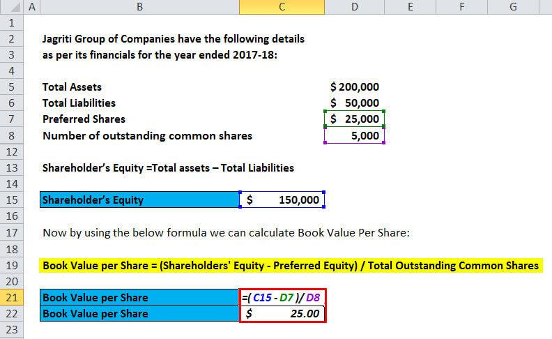

## Table of Contents

## What is book value per share and why is it important?

Book value per share is a way to figure out how much a company is worth based on its financial records. It's calculated by taking the total value of the company's assets and subtracting its liabilities, then dividing that number by the number of shares that are out there. This gives you an idea of what each share would be worth if the company were to sell off all its assets and pay off all its debts.

This number is important because it helps investors understand if a stock is a good deal. If the book value per share is higher than the price of the stock, it might mean the stock is undervalued and could be a good investment. On the other hand, if the stock price is much higher than the book value per share, it might be overpriced. However, it's just one piece of the puzzle and investors should look at other things too before deciding to buy or sell a stock.

## What are the basic components needed to calculate book value per share?

To calculate book value per share, you need to know the total assets and total liabilities of a company. The total assets include everything the company owns, like cash, buildings, and equipment. The total liabilities are all the debts and obligations the company has, like loans and bills it needs to pay.

Once you have these numbers, you subtract the total liabilities from the total assets to get the company's net worth, also known as the book value. After that, you divide this book value by the number of shares the company has issued. This gives you the book value per share, which tells you how much each share would be worth if the company sold all its assets and paid off all its debts.

This calculation helps investors see if a stock might be a good buy. If the book value per share is higher than the stock's market price, the stock might be undervalued. But remember, this is just one way to look at a company's value, and there are other things to consider too.

## How do you locate the necessary financial data in a company's balance sheet?

To find the financial data you need for calculating book value per share, you'll look at a company's balance sheet. This is a report that shows what the company owns and what it owes at a specific time. The balance sheet is usually divided into two main parts: assets on one side and liabilities and shareholders' equity on the other. You'll find the total assets at the bottom of the asset section. This number includes everything the company owns, like cash, buildings, and equipment. 

Next, you need to find the total liabilities, which are listed in the liabilities section of the balance sheet. This number shows all the debts and obligations the company has, like loans and bills it needs to pay. Subtract the total liabilities from the total assets to get the company's book value, which is also called shareholders' equity. This number should match the total shareholders' equity at the bottom of the balance sheet. To finish calculating the book value per share, you'll need the number of shares outstanding, which you can find in the company's financial statements or investor relations section on their website. Divide the book value by the number of shares outstanding to get the book value per share.

## What are the steps to input data into Excel for calculating book value per share?

To calculate book value per share in Excel, start by opening a new spreadsheet. In the first row, label the columns as "Total Assets," "Total Liabilities," "Book Value," "Number of Shares," and "Book Value per Share." In the second row, under the "Total Assets" column, enter the total assets number you found on the company's balance sheet. Next to it, under the "Total Liabilities" column, enter the total liabilities number from the balance sheet. To calculate the book value, in the cell under the "Book Value" column, enter a formula that subtracts the total liabilities from the total assets. For example, if your total assets are in cell B2 and total liabilities are in cell C2, your formula would be "=B2-C2".

Once you have the book value, you need to find the number of shares outstanding. Enter this number in the cell under the "Number of Shares" column. To calculate the book value per share, in the cell under the "Book Value per Share" column, enter a formula that divides the book value by the number of shares. For example, if your book value is in cell D2 and the number of shares is in cell E2, your formula would be "=D2/E2". After entering these formulas, Excel will automatically calculate the book value per share for you. This gives you a quick way to see if a stock might be undervalued based on its book value per share.

## How do you use Excel formulas to calculate the total shareholders' equity?

To calculate the total shareholders' equity in Excel, you need to know the company's total assets and total liabilities. These numbers are found on the company's balance sheet. In your Excel spreadsheet, label the first column as "Total Assets" and the second column as "Total Liabilities." In the row below the labels, enter the total assets number in the first column and the total liabilities number in the second column. To find the total shareholders' equity, you subtract the total liabilities from the total assets. In the cell next to the total liabilities, label it "Total Shareholders' Equity" and enter the formula that subtracts the total liabilities from the total assets. For example, if your total assets are in cell A2 and total liabilities are in cell B2, your formula would be "=A2-B2".

After you enter this formula, Excel will automatically calculate the total shareholders' equity for you. This number is important because it shows the net worth of the company, which is what would be left for the shareholders if the company sold all its assets and paid off all its debts. This is also known as the book value of the company. By using Excel, you can quickly see how changes in the company's assets or liabilities affect its shareholders' equity, helping you understand the financial health of the company.

## What Excel functions can be used to find the number of outstanding shares?

To find the number of outstanding shares in Excel, you usually don't use a specific function because this number comes from the company's financial statements. You can simply type the number of outstanding shares into a cell in your spreadsheet. For example, if you find that a company has 10 million shares outstanding, you would enter "10,000,000" into the cell labeled "Number of Shares."

Once you have entered the number of outstanding shares, you can use it in formulas to calculate other financial metrics, like book value per share. For example, if the total shareholders' equity is in cell A2 and the number of outstanding shares is in cell B2, you can calculate the book value per share by entering the formula "=A2/B2" in another cell. This way, Excel will automatically calculate the book value per share for you, helping you analyze the company's value.

## How do you set up the formula in Excel to compute book value per share?

To compute book value per share in Excel, start by labeling your columns. In the first row, label the first column as "Total Assets," the second column as "Total Liabilities," the third column as "Book Value," the fourth column as "Number of Shares," and the fifth column as "Book Value per Share." In the row below the labels, enter the total assets number in the "Total Assets" column and the total liabilities number in the "Total Liabilities" column. These numbers come from the company's balance sheet. To calculate the book value, in the cell under the "Book Value" column, enter a formula that subtracts the total liabilities from the total assets. For example, if your total assets are in cell A2 and total liabilities are in cell B2, your formula would be "=A2-B2". This gives you the book value, which is the same as the total shareholders' equity.

Next, enter the number of outstanding shares in the cell under the "Number of Shares" column. You can find this number in the company's financial statements. To calculate the book value per share, in the cell under the "Book Value per Share" column, enter a formula that divides the book value by the number of shares. For example, if your book value is in cell C2 and the number of shares is in cell D2, your formula would be "=C2/D2". After entering these formulas, Excel will automatically calculate the book value per share for you. This helps you see if a stock might be undervalued based on its book value per share.

## What are common mistakes to avoid when calculating book value per share in Excel?

When calculating book value per share in Excel, one common mistake is entering the wrong numbers for total assets and total liabilities. These numbers come from the company's balance sheet, and if you mix them up or use outdated figures, your book value per share will be wrong. Another mistake is not updating the number of outstanding shares. Companies can issue new shares or buy back old ones, so it's important to use the most recent number of shares to get an accurate book value per share.

Another error to watch out for is using the wrong cells in your formulas. If you type "=A2-B2" to find the book value but the total assets are actually in cell A3 and total liabilities are in cell B3, your calculation will be off. Also, make sure you're dividing the book value by the number of shares correctly. If you accidentally divide by the wrong number or use the wrong cell reference, like "=C2/D3" instead of "=C2/D2", your book value per share won't be right. Always double-check your numbers and formulas to avoid these mistakes.

## How can you use Excel to compare the book value per share of different companies?

To compare the book value per share of different companies using Excel, you can set up a spreadsheet where each row represents a different company. In the first row, label the columns as "Company Name," "Total Assets," "Total Liabilities," "Book Value," "Number of Shares," and "Book Value per Share." For each company, enter their total assets and total liabilities in the appropriate columns, using the numbers from their balance sheets. Then, calculate the book value for each company by subtracting the total liabilities from the total assets in the "Book Value" column. For example, if Company A's total assets are in cell B2 and total liabilities are in cell C2, the formula in the "Book Value" column would be "=B2-C2". Next, enter the number of outstanding shares for each company in the "Number of Shares" column. Finally, calculate the book value per share by dividing the book value by the number of shares. For Company A, if the book value is in cell D2 and the number of shares is in cell E2, the formula in the "Book Value per Share" column would be "=D2/E2". Repeat this process for each company.

Once you have the book value per share for all the companies listed in your spreadsheet, you can easily compare them. Look at the numbers in the "Book Value per Share" column to see which companies have higher or lower book values per share. This can help you understand which stocks might be undervalued or overvalued compared to their book value. Remember, though, that book value per share is just one way to look at a company's value, and you should consider other financial metrics and factors before making investment decisions. By using Excel, you can quickly update the numbers and see how changes in a company's financials affect its book value per share, making it easier to keep track of multiple companies at once.

## What advanced Excel features can enhance the analysis of book value per share over time?

To analyze book value per share over time using advanced Excel features, you can use the charting tools to create line graphs or bar charts. This makes it easy to see how a company's book value per share changes from one period to another. You can also use Excel's pivot tables to organize and summarize data from different time periods. By setting up a pivot table, you can quickly compare book values per share across multiple quarters or years, helping you spot trends and patterns. Another useful feature is conditional formatting, which can highlight cells based on their values. For example, you can set it up so that cells with a book value per share above a certain threshold turn green, making it easy to see when a company's value is increasing.

Additionally, Excel's data validation feature can help ensure that the numbers you enter are accurate. You can set rules to make sure that the total assets, total liabilities, and number of shares are within reasonable ranges, reducing the chance of errors. Excel's "What-If Analysis" tools, like the Scenario Manager, allow you to see how changes in a company's financials might affect its book value per share. By creating different scenarios, you can predict how future changes might impact the company's value. Using these advanced features together can give you a deeper understanding of a company's book value per share over time, helping you make better-informed investment decisions.

## How do you interpret the results of book value per share calculations in Excel?

When you calculate book value per share in Excel, the number you get tells you how much each share of the company would be worth if it sold all its stuff and paid off all its debts. If the book value per share is higher than the stock's current price, it might mean the stock is a good deal because it's worth more than people are paying for it. But if the stock price is a lot higher than the book value per share, it might be too expensive. Remember, this is just one way to look at a company's value, and you should check other things too before deciding to buy or sell a stock.

Using Excel to compare book value per share over time can help you see if a company is getting more or less valuable. If the book value per share goes up, it could mean the company is doing well and growing its net worth. If it goes down, it might mean the company is losing value. By looking at these changes, you can get a better idea of how the company is doing and whether it might be a good investment. Just make sure to look at the bigger picture and consider other financial information as well.

## What are the limitations of using book value per share as an investment metric, and how can Excel help address these?

Book value per share is just one way to look at how much a company is worth, but it has some problems. It doesn't tell you about things like the company's future growth or how well it's doing right now. It also doesn't include things that can't be easily turned into money, like a company's brand or its team of workers. If a company has a lot of old machines or buildings that aren't worth much anymore, the book value per share might make the company look less valuable than it really is. So, while book value per share can be a helpful number, it's not the whole story and should be used with other ways to measure a company's value.

Excel can help you deal with these problems by letting you look at more than just the book value per share. You can use Excel to keep track of other important numbers like earnings per share or price-to-earnings ratio, which can give you a better idea of how a company is doing. You can also use Excel's tools to create charts and graphs that show how a company's value is changing over time. This way, you can see if the book value per share is going up or down and compare it with other numbers to get a fuller picture of the company's worth. By using Excel to look at lots of different information, you can make smarter choices about whether a stock is a good buy or not.

## What is Book Value Per Share (BVPS) and how can it be understood?

Book Value Per Share (BVPS) is a vital metric used by investors to evaluate a company's financial health and valuation. BVPS is calculated by dividing the company's common equity, also known as shareholders' equity, by the number of outstanding shares. The formula for BVPS is given as:

$$
\text{BVPS} = \frac{\text{Total Shareholders' Equity} - \text{Preferred Equity}}{\text{Total Outstanding Shares}}
$$

This ratio provides insight into the intrinsic value of a company’s stock, effectively indicating the per-share equity value of a company’s assets after all liabilities have been accounted for.

As a fundamental financial metric, BVPS aids investors in making more informed decisions regarding stock valuation. By comparing a company's BVPS with its current market price, investors can assess whether a stock is potentially undervalued or overvalued. If a stock is trading below its BVPS, it may suggest that the stock is undervalued, assuming other financial aspects are constant. Conversely, a stock trading at a price considerably higher than its BVPS could signify an overvaluation, possibly inflated by market speculation or non-tangible assets that BVPS does not account for. 

This metric is significant for investors who prioritize intrinsic value and long-term stability over short-term market fluctuations. While BVPS provides a baseline for valuation, it is crucial to consider it alongside other financial indicators to achieve a comprehensive evaluation of a company's financial standing.

## What are the factors affecting BVPS?

Book Value Per Share (BVPS) is a dynamic metric that reflects a company's financial standing and changes in its capital structure. Several factors can influence BVPS, among which share buybacks and dilution, as well as variations in a company's total assets or liabilities, play significant roles. Understanding these factors is crucial for investors aiming to make informed decisions based on BVPS data.

**Share Buybacks and Dilution**

Share buybacks occur when a company purchases its outstanding shares from the market, reducing the total number of shares available. This action typically results in an increase in BVPS, as the same amount of equity is distributed over fewer shares. Mathematically, this can be represented as:

$$
\text{New BVPS} = \frac{\text{Total Equity}}{\text{Outstanding Shares} - \text{Repurchased Shares}}
$$

Conversely, share dilution happens when a company issues additional shares, often to raise capital. This increases the number of outstanding shares, thereby reducing BVPS if total equity remains constant. Such dilution can occur due to new stock issuances, conversion of convertible securities, or employee stock options.

**Changes in a Company’s Total Assets or Liabilities**

BVPS is directly influenced by changes in a company’s balance sheet, particularly its assets and liabilities. An increase in total assets, such as through the acquisition of valuable properties or revenue growth, could enhance total equity, boosting BVPS if liabilities remain fixed. Conversely, an increase in liabilities without a proportional increase in assets can reduce total equity, thereby decreasing BVPS.

These changes are encapsulated in the formula:

$$
\text{BVPS} = \frac{\text{Total Assets} - \text{Total Liabilities}}{\text{Outstanding Shares}}
$$

Thus, any substantial variation in a company's balance sheet components can significantly shift BVPS, impacting investor perception and valuation analysis.

**Investor Considerations**

Investors assessing BVPS must account for these dynamic factors to accurately interpret a company’s financial health. Share buybacks might suggest management confidence in the company's future prospects, while dilution could indicate attempts to gather capital for expansion. Furthermore, analyzing the causes behind changes in assets or liabilities can provide deeper insights into a company’s operational efficiency and strategic direction.

In summary, while BVPS is a useful metric for evaluating a company's value, understanding the influences of share adjustments and balance sheet changes is crucial for making well-rounded investment decisions.

## What are some real-world examples and applications?

Analyzing the Book Value Per Share (BVPS) of prominent companies like Apple and Reliance Industries and its relationship with their market value yields significant insights for investors. These case studies illustrate how BVPS can be an integral part of sophisticated investment strategies and how it can be calculated using Excel for practical application.

### Apple Inc. (AAPL)

Apple Inc., a leader in technology, presents an interesting case when examining the correlation between BVPS and market value. As of the fiscal year-end 2022, Apple reported total equity of approximately $63 billion with outstanding shares numbering over 16 billion. The BVPS calculation involves dividing the total equity by the outstanding shares:

$$
\text{BVPS} = \frac{\text{Total Equity}}{\text{Outstanding Shares}} = \frac{63 \, \text{billion}}{16 \, \text{billion}} = 3.94 \, \text{USD}
$$

In comparison to Apple's market price per share, which often trades significantly above its book value, it appears that the market assigns a premium to Apple's shares, reflecting the company's growth potential and intangible assets, such as strong brand value and intellectual property. For investors using BVPS, Apple's stock might appear overvalued; however, understanding that tech companies often exhibit such characteristics can guide more nuanced investment decisions.

### Reliance Industries Limited (RIL)

Reliance Industries Limited (RIL), one of India's largest conglomerates, demonstrates a BVPS calculation that investors can relate to the company's market valuation. Suppose in a specified year, Reliance had a total equity of $130 billion and 6.5 billion shares outstanding:

$$
\text{BVPS} = \frac{130 \, \text{billion}}{6.5 \, \text{billion}} = 20 \, \text{USD}
$$

Reliance's market share price can sometimes hover around or exceed its BVPS, suggesting that the market recognizes both its asset base and its ability to generate cash flows from diversified operations. Comparatively, if the market price were significantly below the BVPS, it might hint at undervaluation, providing an opportunity for value investment strategies.

### Successful Investment Strategies Leveraging BVPS

Investors often utilize BVPS alongside other metrics to forge successful investment strategies. For example, value investing commonly integrates BVPS with price-to-earnings ratios and growth projections. A strategy might involve screening for stocks trading below their BVPS, indicating potential undervaluation.

A practical Excel model could support this strategy. By importing financial data, one can formulate BVPS and automate the screening process through conditional formatting or creating scripts using VBA or integrating Python with Excel through pandas and openpyxl libraries.

#### Excel Scenario Example:

Consider an Excel sheet automating this evaluation:

1. **Data Entry**: Input company equity in cell `A2` and outstanding shares in cell `B2`.
2. **BVPS Formula**: In cell `C2`, use `= A2 / B2` to compute the BVPS.
3. **Market Price Entry**: Input current market price in `D2`.
4. **Comparison**: In `E2`, a formula like `= IF(D2 < C2, "Undervalued", "Overvalued")` provides a simple decision support mechanism.

### Outcomes

Implementing these methodologies, investors achieve a clear, data-driven perspective, enhancing their portfolio management. Numerous cases validate strategies that incorporate BVPS effectively predict investment outcomes and contribute to profitability, especially for long-term-value investors. These real-world examples reinforce BVPS's utility in assessing relative stock valuations, providing an invaluable tool for investors.

## What are Frequently Asked Questions (FAQs)?

Book Value Per Share (BVPS) is a crucial financial metric that continues to raise questions among investors and traders. Below are some frequently asked questions to clarify common doubts about BVPS calculations, its implications, and its role in trading.

### What is the formula for calculating BVPS, and why is it important?

The formula for calculating BVPS is:

$$
\text{BVPS} = \frac{\text{Total Equity} - \text{Preferred Equity}}{\text{Number of Common Shares Outstanding}}
$$

BVPS is essential because it provides insights into a company's per-share intrinsic value based on its book value. This helps investors determine if a stock is overvalued or undervalued, enabling more informed investment decisions.

### How does BVPS differ from other valuation metrics such as EPS or P/E ratio?

BVPS focuses solely on a company's book value, which is its assets minus liabilities, and calculates this value on a per share basis. In contrast, Earnings Per Share (EPS) measures a company's profitability, while the Price-to-Earnings (P/E) ratio evaluates market value relative to earnings. Unlike BVPS, which is rooted in accounting values, both EPS and P/E incorporate market dynamics and profitability measures.

### How is BVPS used in algorithmic trading strategies?

In [algorithmic trading](/wiki/algorithmic-trading), BVPS serves as a benchmark for identifying potentially undervalued stocks by comparing the market price to the book value. Algorithms use BVPS to filter stocks that are trading below their book value, thus highlighting opportunities for value investing. This is often mechanized through trading bots that execute trades when certain BVPS thresholds are met.

### Is BVPS relevant for tax and accounting purposes?

Yes, BVPS is relevant in the context of assessing a company's net asset value per share for financial reporting and taxation. Although BVPS itself is not directly used for tax calculations, understanding a company's equity position aids in comprehending its overall financial health, which can have indirect implications on tax assessments and accounting practices.

### What are the limitations of using BVPS as a standalone metric?

BVPS does not account for intangible assets such as patents or trademarks, which can be significant, especially in technology or brands-focused industries. It also fails to capture a company’s future [earning](/wiki/earning-announcement) potential, unlike other ratios such as EPS. Therefore, relying solely on BVPS can lead to misleading conclusions if not considered with other financial metrics.

### How can investors practically implement BVPS in their analysis?

Investors can start by calculating BVPS in Excel using company data from financial statements. By comparing the BVPS with current market prices, investors can gauge whether a stock might be undervalued or overvalued. This should be part of a broader analysis that includes qualitative assessment and other financial ratios to form a holistic investment view.

### Are there adjustments required when calculating BVPS for different industries?

Yes, considerations for industry-specific factors are necessary. For instance, sectors with high intangible assets might require adjustments or complementary metrics to better reflect value. Comparing companies within the same industry using BVPS provides a more accurate assessment of equity value differences.

These FAQs aim to provide comprehensive insights into BVPS and dispel common myths or misunderstandings about its application and significance in investment analysis.

## References & Further Reading

[1]: ["Financial Modeling in Excel For Dummies"](https://www.dummies.com/book/technology/software/microsoft-products/excel/financial-modeling-in-excel-for-dummies-281721/) by Danielle Stein Fairhurst

[2]: ["Excel Modeling in Corporate Finance"](https://www.pearson.com/en-us/subject-catalog/p/excel-modeling-in-corporate-finance/P200000005922/9780205987252) by Craig W. Holden

[3]: ["Valuation: Measuring and Managing the Value of Companies"](https://www.amazon.com/Valuation-Measuring-Managing-Companies-Finance/dp/1119610885) by McKinsey & Company Inc., Tim Koller, Marc Goedhart, and David Wessels

[4]: ["The Intelligent Investor: The Definitive Book on Value Investing"](https://www.amazon.com/Intelligent-Investor-3rd-Ed/dp/0063356724) by Benjamin Graham

[5]: ["Algorithmic Trading: Winning Strategies and Their Rationale"](https://www.amazon.com/Algorithmic-Trading-Winning-Strategies-Rationale-ebook/dp/B00CY5HC0U) by Ernest P. Chan