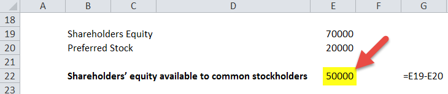

In today's financial markets, understanding the intrinsic value of a stock is crucial for making informed investing decisions. One important metric that aids in this understanding is the Book Value Per Share (BVPS). BVPS provides an insight into a company's financial health by measuring the per-share equity available to common shareholders. It is calculated by dividing the company's total common equity by the number of outstanding shares. This metric is essential for investors seeking to assess whether a stock is undervalued or overvalued, especially when compared to its market price.

Determining BVPS is not only vital for individual investors but also holds significant importance in algorithmic trading. As markets grow increasingly complex and data-driven, integrating BVPS into trading algorithms can enhance the robustness of investment strategies. By calculating BVPS using tools like Excel, investors can efficiently assess a company's valuation, thus providing a foundation for developing quantitative strategies. This article will provide a comprehensive guide on calculating BVPS in Excel, explore its significance in algorithmic trading, and demonstrate how it can be effectively integrated into a trading strategy.



## Table of Contents

## Understanding Book Value Per Share (BVPS)

Book Value Per Share (BVPS) is a vital metric used by investors to evaluate a company's financial health and valuation. BVPS is calculated by dividing the company's common equity, also known as shareholders' equity, by the number of outstanding shares. The formula for BVPS is given as:

$$
\text{BVPS} = \frac{\text{Total Shareholders' Equity} - \text{Preferred Equity}}{\text{Total Outstanding Shares}}
$$

This ratio provides insight into the intrinsic value of a company’s stock, effectively indicating the per-share equity value of a company’s assets after all liabilities have been accounted for.

As a fundamental financial metric, BVPS aids investors in making more informed decisions regarding stock valuation. By comparing a company's BVPS with its current market price, investors can assess whether a stock is potentially undervalued or overvalued. If a stock is trading below its BVPS, it may suggest that the stock is undervalued, assuming other financial aspects are constant. Conversely, a stock trading at a price considerably higher than its BVPS could signify an overvaluation, possibly inflated by market speculation or non-tangible assets that BVPS does not account for. 

This metric is significant for investors who prioritize intrinsic value and long-term stability over short-term market fluctuations. While BVPS provides a baseline for valuation, it is crucial to consider it alongside other financial indicators to achieve a comprehensive evaluation of a company's financial standing.

## Why BVPS Matters for Investors

Book Value Per Share (BVPS) is a crucial metric for investors seeking a more stable and reliable valuation compared to fluctuating market prices. Market prices can be heavily influenced by speculative trading, investor sentiment, and economic news, often leading to [volatility](/wiki/volatility-trading-strategies). In contrast, BVPS provides investors with a foundational or "floor" value, representing the amount they might receive per share if the company were to liquidate its assets and pay off all its liabilities. This characteristic of BVPS as a stable valuation metric makes it highly valuable to investors who prioritize long-term investment strategies based on solid financial fundamentals.

A key reason BVPS matters to investors is its ability to signal potential undervaluation. When a stock is trading below its BVPS, it might indicate that the market is undervaluing the company's tangible assets. This situation can arise from market overreactions or mispricing, providing potential opportunities for value investors who seek to purchase stocks at a discount relative to their intrinsic value. These investors aim to capitalize on future market corrections that recognize the true value of the company's assets, leading to potential gains.

In essence, BVPS acts as a benchmark against which current market valuation is compared. While it is not a standalone indicator devoid of limitations, as it does not account for intangible assets and potential future growth, it nonetheless provides a critical piece of the valuation puzzle. By contrasting a company's market price with its BVPS, investors can better discern whether a stock is priced appropriately, overvalued, or undervalued, guiding them in making more informed investment decisions.

## Calculating BVPS in Excel

To calculate Book Value Per Share (BVPS) in Excel, you'll need to gather two key pieces of information from the company's financial statements: the total equity and the number of outstanding shares. Once you have these figures, follow the steps below to compute BVPS:

1. **Enter the Data:**
   - Open a new Excel spreadsheet.
   - In cell A1, label it "Total Equity."
   - In cell A2, input the company's total equity figure. This value can usually be found on the company's balance sheet under the shareholders' equity section.
   - In cell B1, label it "Outstanding Shares."
   - In cell B2, enter the number of outstanding shares. This information is typically found in the financial notes or the company's annual report.

2. **Calculate BVPS:**
   - Click on cell C1 and label it "BVPS."
   - In cell C2, enter the formula:
     ```excel
     =A2/B2
     ```
   - This formula divides the total equity by the outstanding shares to yield the BVPS.

3. **Example Calculation:**
   - Suppose a company has a total equity of $2,000,000 and 500,000 outstanding shares.
   - Enter "2000000" in cell A2 for total equity.
   - Enter "500000" in cell B2 for outstanding shares.
   - Use the BVPS formula in cell C2: 
     ```excel
     =2000000/500000
     ```
   - The BVPS calculated will be $4.00 per share.

4. **Verification and Adjustment:**
   - Check your values to ensure accuracy in the inputs.
   - Adjust the figures as necessary if there are changes in equity or the number of outstanding shares.

This method allows for easy recalculation if any of the input data changes, facilitating real-time updates to the BVPS without the need for extensive recalculations. Excel's automation capabilities make it an efficient tool for performing and adjusting this calculation, ensuring that investors can quickly evaluate a company's financial health with up-to-date information.

## Incorporating BVPS into Algorithmic Trading Strategies

Algorithmic trading involves the use of computer programs to execute trades based on predetermined criteria, and integrating Book Value Per Share (BVPS) into such strategies can provide a [fundamental analysis](/wiki/fundamental-analysis) perspective that enhances the selection process of undervalued stocks.

BVPS serves as a solid foundation for valuation-based trading algorithms, offering traders a mechanism to automate the identification of stocks potentially trading below their intrinsic value. For instance, a basic algorithm could be designed to scan for companies whose current market price is below their calculated BVPS, signaling possible undervaluation and marking them for further analysis or automatic trade execution.

To incorporate BVPS in [algorithmic trading](/wiki/algorithmic-trading), a trader could calculate the BVPS using historical data and compare it with current market prices. Below is a simple illustration using Python pseudocode to develop such a model:

```python
import pandas as pd

def calculate_bvps(total_equity, outstanding_shares):
    return total_equity / outstanding_shares

# Sample dataset of companies with their total equity and outstanding shares
data = {'Company': ['A', 'B', 'C'],
        'Total Equity': [1000000, 2000000, 1500000],
        'Outstanding Shares': [50000, 100000, 75000],
        'Current Market Price': [18, 20, 19]}

df = pd.DataFrame(data)

# Calculate BVPS for each company
df['BVPS'] = df.apply(lambda row: calculate_bvps(row['Total Equity'], row['Outstanding Shares']), axis=1)

# Identify potentially undervalued stocks
df['Undervalued'] = df['Current Market Price'] < df['BVPS']

print(df[['Company', 'Current Market Price', 'BVPS', 'Undervalued']])
```

In this example, the program calculates the BVPS for each company and flags those with a current market price below the BVPS. Stocks identified as 'Undervalued' may warrant further review or serve as candidates for automated trading strategies.

Such integration enables traders to systematically approach the market based on quantitative fundamentals, moving beyond purely technical analysis or [momentum](/wiki/momentum)-based trades. Additionally, by refining these models to incorporate more variables, such as historical BVPS changes or industry-specific adjustments, traders can create sophisticated strategies that better capture market opportunities. This approach grounds trading decisions in solid financial analysis, enhancing the robustness of algorithmic strategies and contributing to potentially more successful trading outcomes.

## Factors Affecting BVPS

Book Value Per Share (BVPS) is a dynamic metric that reflects a company's financial standing and changes in its capital structure. Several factors can influence BVPS, among which share buybacks and dilution, as well as variations in a company's total assets or liabilities, play significant roles. Understanding these factors is crucial for investors aiming to make informed decisions based on BVPS data.

**Share Buybacks and Dilution**

Share buybacks occur when a company purchases its outstanding shares from the market, reducing the total number of shares available. This action typically results in an increase in BVPS, as the same amount of equity is distributed over fewer shares. Mathematically, this can be represented as:

$$
\text{New BVPS} = \frac{\text{Total Equity}}{\text{Outstanding Shares} - \text{Repurchased Shares}}
$$

Conversely, share dilution happens when a company issues additional shares, often to raise capital. This increases the number of outstanding shares, thereby reducing BVPS if total equity remains constant. Such dilution can occur due to new stock issuances, conversion of convertible securities, or employee stock options.

**Changes in a Company’s Total Assets or Liabilities**

BVPS is directly influenced by changes in a company’s balance sheet, particularly its assets and liabilities. An increase in total assets, such as through the acquisition of valuable properties or revenue growth, could enhance total equity, boosting BVPS if liabilities remain fixed. Conversely, an increase in liabilities without a proportional increase in assets can reduce total equity, thereby decreasing BVPS.

These changes are encapsulated in the formula:

$$
\text{BVPS} = \frac{\text{Total Assets} - \text{Total Liabilities}}{\text{Outstanding Shares}}
$$

Thus, any substantial variation in a company's balance sheet components can significantly shift BVPS, impacting investor perception and valuation analysis.

**Investor Considerations**

Investors assessing BVPS must account for these dynamic factors to accurately interpret a company’s financial health. Share buybacks might suggest management confidence in the company's future prospects, while dilution could indicate attempts to gather capital for expansion. Furthermore, analyzing the causes behind changes in assets or liabilities can provide deeper insights into a company’s operational efficiency and strategic direction.

In summary, while BVPS is a useful metric for evaluating a company's value, understanding the influences of share adjustments and balance sheet changes is crucial for making well-rounded investment decisions.

## Common Mistakes to Avoid

Overreliance on Book Value Per Share (BVPS) without considering other financial metrics can lead to misleading conclusions. BVPS provides a snapshot of a company's financial health by quantifying the book value attributed to each outstanding share. However, it should not be used in isolation as a comprehensive measure of a company's worth. Investors frequently make the mistake of focusing solely on BVPS, neglecting other important indicators like earnings, cash flow, and market conditions. This oversight can obscure a nuanced understanding of a stock's value and potential.

Ignoring intangible assets presents another common pitfall when evaluating BVPS, particularly in industries where intangible assets play a critical role, like technology. BVPS is derived from tangible book value, which excludes intangible assets such as patents, trademarks, and goodwill. In the tech sector, for instance, companies often possess significant intellectual property that contributes to their market value but is not captured by BVPS. As a result, firms heavily reliant on intangible assets may appear undervalued when assessed solely through BVPS, misleading investors who miss crucial non-physical assets.

Comparing BVPS across different industries without context can lead to incorrect valuations. BVPS is influenced by industry-specific factors and the nature of the business's assets. For example, asset-heavy industries like manufacturing often have higher tangible assets, resulting in a higher BVPS than service-oriented companies with fewer tangible holdings. Consequently, comparing BVPS of a manufacturing company with that of a tech company might not yield meaningful insights. Investors must account for industry norms and assess BVPS in conjunction with sector-specific benchmarks to derive accurate valuations.

To avoid such pitfalls, investors should adopt a holistic approach, combining BVPS with other financial metrics and considering industry-specific circumstances to make informed investment decisions.

## Real-World Examples and Applications

Analyzing the Book Value Per Share (BVPS) of prominent companies like Apple and Reliance Industries and its relationship with their market value yields significant insights for investors. These case studies illustrate how BVPS can be an integral part of sophisticated investment strategies and how it can be calculated using Excel for practical application.

### Apple Inc. (AAPL)

Apple Inc., a leader in technology, presents an interesting case when examining the correlation between BVPS and market value. As of the fiscal year-end 2022, Apple reported total equity of approximately $63 billion with outstanding shares numbering over 16 billion. The BVPS calculation involves dividing the total equity by the outstanding shares:

$$
\text{BVPS} = \frac{\text{Total Equity}}{\text{Outstanding Shares}} = \frac{63 \, \text{billion}}{16 \, \text{billion}} = 3.94 \, \text{USD}
$$

In comparison to Apple's market price per share, which often trades significantly above its book value, it appears that the market assigns a premium to Apple's shares, reflecting the company's growth potential and intangible assets, such as strong brand value and intellectual property. For investors using BVPS, Apple's stock might appear overvalued; however, understanding that tech companies often exhibit such characteristics can guide more nuanced investment decisions.

### Reliance Industries Limited (RIL)

Reliance Industries Limited (RIL), one of India's largest conglomerates, demonstrates a BVPS calculation that investors can relate to the company's market valuation. Suppose in a specified year, Reliance had a total equity of $130 billion and 6.5 billion shares outstanding:

$$
\text{BVPS} = \frac{130 \, \text{billion}}{6.5 \, \text{billion}} = 20 \, \text{USD}
$$

Reliance's market share price can sometimes hover around or exceed its BVPS, suggesting that the market recognizes both its asset base and its ability to generate cash flows from diversified operations. Comparatively, if the market price were significantly below the BVPS, it might hint at undervaluation, providing an opportunity for value investment strategies.

### Successful Investment Strategies Leveraging BVPS

Investors often utilize BVPS alongside other metrics to forge successful investment strategies. For example, value investing commonly integrates BVPS with price-to-earnings ratios and growth projections. A strategy might involve screening for stocks trading below their BVPS, indicating potential undervaluation.

A practical Excel model could support this strategy. By importing financial data, one can formulate BVPS and automate the screening process through conditional formatting or creating scripts using VBA or integrating Python with Excel through pandas and openpyxl libraries.

#### Excel Scenario Example:

Consider an Excel sheet automating this evaluation:

1. **Data Entry**: Input company equity in cell `A2` and outstanding shares in cell `B2`.
2. **BVPS Formula**: In cell `C2`, use `= A2 / B2` to compute the BVPS.
3. **Market Price Entry**: Input current market price in `D2`.
4. **Comparison**: In `E2`, a formula like `= IF(D2 < C2, "Undervalued", "Overvalued")` provides a simple decision support mechanism.

### Outcomes

Implementing these methodologies, investors achieve a clear, data-driven perspective, enhancing their portfolio management. Numerous cases validate strategies that incorporate BVPS effectively predict investment outcomes and contribute to profitability, especially for long-term-value investors. These real-world examples reinforce BVPS's utility in assessing relative stock valuations, providing an invaluable tool for investors.

## Frequently Asked Questions (FAQs)

Book Value Per Share (BVPS) is a crucial financial metric that continues to raise questions among investors and traders. Below are some frequently asked questions to clarify common doubts about BVPS calculations, its implications, and its role in trading.

### What is the formula for calculating BVPS, and why is it important?

The formula for calculating BVPS is:

$$
\text{BVPS} = \frac{\text{Total Equity} - \text{Preferred Equity}}{\text{Number of Common Shares Outstanding}}
$$

BVPS is essential because it provides insights into a company's per-share intrinsic value based on its book value. This helps investors determine if a stock is overvalued or undervalued, enabling more informed investment decisions.

### How does BVPS differ from other valuation metrics such as EPS or P/E ratio?

BVPS focuses solely on a company's book value, which is its assets minus liabilities, and calculates this value on a per share basis. In contrast, Earnings Per Share (EPS) measures a company's profitability, while the Price-to-Earnings (P/E) ratio evaluates market value relative to earnings. Unlike BVPS, which is rooted in accounting values, both EPS and P/E incorporate market dynamics and profitability measures.

### How is BVPS used in algorithmic trading strategies?

In algorithmic trading, BVPS serves as a benchmark for identifying potentially undervalued stocks by comparing the market price to the book value. Algorithms use BVPS to filter stocks that are trading below their book value, thus highlighting opportunities for value investing. This is often mechanized through trading bots that execute trades when certain BVPS thresholds are met.

### Is BVPS relevant for tax and accounting purposes?

Yes, BVPS is relevant in the context of assessing a company's net asset value per share for financial reporting and taxation. Although BVPS itself is not directly used for tax calculations, understanding a company's equity position aids in comprehending its overall financial health, which can have indirect implications on tax assessments and accounting practices.

### What are the limitations of using BVPS as a standalone metric?

BVPS does not account for intangible assets such as patents or trademarks, which can be significant, especially in technology or brands-focused industries. It also fails to capture a company’s future [earning](/wiki/earning-announcement) potential, unlike other ratios such as EPS. Therefore, relying solely on BVPS can lead to misleading conclusions if not considered with other financial metrics.

### How can investors practically implement BVPS in their analysis?

Investors can start by calculating BVPS in Excel using company data from financial statements. By comparing the BVPS with current market prices, investors can gauge whether a stock might be undervalued or overvalued. This should be part of a broader analysis that includes qualitative assessment and other financial ratios to form a holistic investment view.

### Are there adjustments required when calculating BVPS for different industries?

Yes, considerations for industry-specific factors are necessary. For instance, sectors with high intangible assets might require adjustments or complementary metrics to better reflect value. Comparing companies within the same industry using BVPS provides a more accurate assessment of equity value differences.

These FAQs aim to provide comprehensive insights into BVPS and dispel common myths or misunderstandings about its application and significance in investment analysis.

## Conclusion

Book Value Per Share (BVPS) serves as a crucial metric for investors striving to gauge a stock's intrinsic value. By focusing on the per-share value of a company's equity, BVPS provides an objective measure that reflects a company's financial stability and growth potential. Unlike market prices, which can be subject to volatility driven by market sentiment and external factors, BVPS offers a more grounded assessment based on the company's tangible assets and equity.

Incorporating BVPS into investment strategies can significantly enhance decision-making processes. When combined with other financial indicators such as earnings per share (EPS), price-to-earnings (P/E) ratio, and debt-to-equity ratio, BVPS can contribute to a comprehensive understanding of a company’s financial health. This multi-faceted approach enables investors to develop robust investment portfolios that are less susceptible to speculative bubbles and exhibit long-term growth potential.

For algorithmic traders, BVPS provides a valuable input for designing automated strategies that identify stocks whose market prices deviate significantly from their intrinsic values. By programming algorithms to spot such discrepancies, traders can capitalize on opportunities where stocks are undervalued or over the estimated book value, thereby executing trades that align with solid fundamental analysis.

This article has aimed to equip investors and traders with the essential knowledge to utilize BVPS effectively in their financial assessments. By understanding and applying this metric judiciously, market participants can refine their strategies, achieve better diversification, and potentially enhance returns while managing risk. In doing so, BVPS stands not merely as a numerical figure, but as a vital tool in the investor's toolkit, fostering informed investment choices and sustained financial success.

## References & Further Reading

[1]: ["Financial Modeling in Excel For Dummies"](https://www.dummies.com/book/technology/software/microsoft-products/excel/financial-modeling-in-excel-for-dummies-281721/) by Danielle Stein Fairhurst

[2]: ["Excel Modeling in Corporate Finance"](https://www.pearson.com/en-us/subject-catalog/p/excel-modeling-in-corporate-finance/P200000005922/9780205987252) by Craig W. Holden

[3]: ["Valuation: Measuring and Managing the Value of Companies"](https://www.amazon.com/Valuation-Measuring-Managing-Companies-Finance/dp/1119610885) by McKinsey & Company Inc., Tim Koller, Marc Goedhart, and David Wessels

[4]: ["The Intelligent Investor: The Definitive Book on Value Investing"](https://www.amazon.com/Intelligent-Investor-3rd-Ed/dp/0063356724) by Benjamin Graham

[5]: ["Algorithmic Trading: Winning Strategies and Their Rationale"](https://www.amazon.com/Algorithmic-Trading-Winning-Strategies-Rationale-ebook/dp/B00CY5HC0U) by Ernest P. Chan