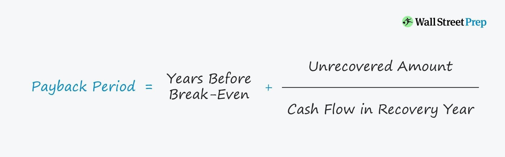

The world of finance relies heavily on various metrics to aid in informed decision-making processes. Among these, the payback period stands out as a significant tool utilized by investors and financial analysts. This metric is crucial for evaluating the time needed for an investment to recover its initial costs. Accompanying the payback period are other vital financial metrics such as break-even points, which determine when a venture's total revenues equal its total costs, resulting in neither profit nor loss. These metrics are fundamental in developing effective trading and investment strategies.

Algorithmic trading has become a cornerstone of modern financial markets, employing sophisticated computational algorithms to execute trades at speeds and frequencies beyond human capability. Within this technologically advanced environment, metrics such as the payback period and break-even points can significantly enhance trading strategies. By understanding how quickly an investment is recouped or when an initiative breaks even, traders can optimize algorithms to improve efficiency and profitability.



This article will examine the basic tenets of the payback period, its essential role in financial analysis, and its application in algorithmic trading. It will also address the various limitations of such metrics, including their inability to factor in the time value of money or to assess long-term profitability accurately. Additionally, we will explore how these financial metrics can be integrated with other tools to construct comprehensive and robust financial strategies. Understanding these concepts can provide investors and traders with a clearer picture of their potential returns and risk exposures, empowering them to make more strategic decisions in the ever-evolving financial landscape.

## Table of Contents

## Understanding the Payback Period

The payback period is a straightforward financial metric that measures how long it takes for an investment to repay its initial cost, offering a clear timeline for capital recovery. This simplicity makes it a valuable tool for quickly assessing the liquidity and risk profile of a project or investment.

To calculate the payback period, divide the initial investment by the average annual cash inflow. If an investment requires $10,000 and generates $2,000 annually, the payback period is:

$$
\text{Payback Period} = \frac{\text{Initial Investment}}{\text{Annual Cash Inflow}} = \frac{10,000}{2,000} = 5 \text{ years}
$$

This metric is particularly useful for determining an investment's viability from a [liquidity](/wiki/liquidity-risk-premium) standpoint, as it helps investors understand how quickly they can expect to recoup their invested capital. Its straightforward nature allows for quick, preliminary assessments that are essential when comparing several potential investments.

However, while the payback period is effective for short-term assessments, it has limitations. Notably, it fails to consider the time value of money (TVM), which is a crucial [factor](/wiki/factor-investing) in strategic decision-making. The TVM implies that a dollar today is worth more than a dollar in the future due to its potential [earning](/wiki/earning-announcement) capacity. Thus, investments with longer payback periods may appear less attractive when the time value of money is taken into account.

Moreover, the payback period does not account for cash flows that occur after the payback period, thereby neglecting the total profitability of an investment. As such, it should not be used in isolation but rather in conjunction with more comprehensive metrics like Net Present Value (NPV) or Internal Rate of Return (IRR) for a more complete financial analysis.

## Break-even Point: An Essential Financial Metric

The break-even point is when a company generates enough revenue to cover its total expenses, resulting in no net income or loss. This moment is crucial for businesses as it signifies the minimum performance required to sustain operations without incurring losses. The break-even point is essential for financial stability, particularly for new ventures and projects, as it provides a tangible goal or target that businesses need to achieve to ensure viability.

To determine the break-even point, a comprehensive analysis of fixed and variable costs is necessary. Fixed costs, such as rent and salaries, remain unchanged regardless of production levels, whereas variable costs fluctuate with production [volume](/wiki/volume-trading-strategy). The break-even formula is typically expressed as:

$$
\text{Break-even Point (in units)} = \frac{\text{Fixed Costs}}{\text{Selling Price per Unit} - \text{Variable Cost per Unit}}
$$

By calculating this metric, companies can estimate how many units they need to sell (or how much revenue they need to generate) to cover all their expenses.

Unlike the payback period, which focuses on the timeline for recovering an initial investment, the break-even point is strictly related to the accounting period during which costs are covered. The break-even point implies an understanding of the specific period analysis, such as monthly or annually, rather than over the life of an investment or project.

In essence, while both the payback period and the break-even point are vital financial metrics, they assess different aspects of financial performance. The break-even point prioritizes revenue targets necessary for operational sustainability, whereas the payback period centers on investment recovery, thus appealing to different strategic angles within financial analysis.

## Algorithmic Trading and Financial Metrics

Algorithmic trading, also known as algo trading, uses sophisticated computational algorithms to automate the trading process. These algorithms are designed to execute trades at rapid speeds, taking advantage of even the slightest market inefficiencies. Due to this capability, incorporating financial metrics like payback periods and break-even points becomes integral within these strategies to boost overall trading efficiency and effectiveness.

The payback period is particularly significant for algo traders, as it provides a metric to assess how swiftly an algorithmic strategy can recover its initial capital outlay. By understanding the input-output dynamics of the algorithms, traders can determine how soon they can expect their initial investment back, thereby evaluating the liquidity and feasibility of the trading strategy.

Furthermore, the payback period can be analyzed using Python to estimate how quickly capital recovery might occur from a given algorithmic setup. For instance, traders can simulate trading scenarios by [backtesting](/wiki/backtesting) historical market data. Using libraries like pandas and numpy, they can easily calculate and visualize the payback period for different strategies, adjusting parameters to find the optimal settings for speedier capital recovery.

```python
import numpy as np
import pandas as pd

# Example: Simulating trading returns
np.random.seed(42)
simulated_returns = np.random.normal(0.001, 0.01, 1000)  # assuming daily returns

# Calculate cumulative returns
cumulative_returns = np.cumsum(simulated_returns)

# Calculate payback period
initial_investment = 1.0  # assume $1 investment
payback_days = np.where(cumulative_returns >= initial_investment)[0][0]
print(f"Payback period: {payback_days} days")
```

On another front, the break-even point in [algorithmic trading](/wiki/algorithmic-trading) pinpoints the moment when revenue equals costs, indicating that the trading strategy has started to generate profits. Determining the break-even point integrates well within the algorithmic environment. Trading algorithms can include modules that analyze cost structures and expected returns, enabling the prediction and monitoring of break-even targets.

Algorithmic trading platforms offer robust backtesting capabilities, allowing traders to refine their strategies for faster payback periods or quicker attainment of break-even points. This feature is crucial, as it facilitates enhanced decision-making and fosters the development of more efficient and effective trading strategies. By continually optimizing based on historical data and current market conditions, traders can ensure that their algorithms are primed for profitability.

Ultimately, financial metrics like payback periods and break-even points, when integrated into algorithmic trading, deliver vital insights that contribute to better strategy formation and efficient capital use. These metrics not only offer a measure of the immediate financial health of the trading strategies but also guide traders in making informed decisions that align with their investment goals and risk appetites.

## Limitations and Considerations

The payback period, while a straightforward metric for determining the time required to recoup an initial investment, comes with several limitations. Primarily, it fails to account for the time value of money—a fundamental concept in finance which asserts that a specific amount of money today has a different value than the same amount in the future due to its potential earning capacity. When using the payback period, one must recognize that future cash inflows are treated as equal to current cash inflows, without discounting their future value. Consequently, this can lead to an incomplete picture of an investment's overall profitability, since the payback period does not capture benefits beyond the payback timeline, missing longer-term contributions to cash flow.

Additionally, the break-even analysis shares similar concerns. It relies heavily on the accuracy of historical data and the assumption that both costs and revenues will remain constant over time. Such assumptions can often be unrealistic, especially in volatile markets or industries subject to rapidly changing conditions. Fluctuations in market dynamics could significantly alter the anticipated break-even point, potentially leading to erroneous financial planning.

In the context of algorithmic trading, the rapid execution and data processing provide a significant edge, yet they may overlook important qualitative factors affecting financial decision-making. Algorithmic systems primarily focus on quantitative data, but qualitative aspects such as market sentiment or regulatory changes can significantly impact trading outcomes. Therefore, traders should be cautious about over-relying on these metrics without considering the broader market ecosystem.

For a more comprehensive assessment of investments, it is advisable to complement the payback period and break-even analysis with metrics that consider the time value of money, such as Net Present Value (NPV) and Internal Rate of Return (IRR). These methods provide a deeper understanding of an investment's potential profitability by factoring in all cash flows and their timing. For instance, NPV evaluates the difference between the present value of cash inflows and outflows over time, while IRR calculates the [interest rate](/wiki/interest-rate-trading-strategies) at which the net present value of an investment is zero, helping determine its potential return. By integrating these metrics, investors and analysts can achieve a more balanced view of financial strategies, leading to well-informed decision-making in complex financial environments.

## Case Studies and Real-world Applications

Case Studies and Real-world Applications

The use of payback period and break-even analysis is crucial in practical financial decision-making, including algorithmic trading. When a trading firm invests in developing a new algorithmic trading system, it essentially allocates capital with the expectation of future returns. The payback period becomes essential here as it measures how quickly the firm can recover its initial investment in the new system. This is particularly important in a high-frequency trading environment, where returns are often measured in milliseconds, and rapid recovery of investment is a key performance metric.

For instance, suppose a trading firm invests $1 million in a new trading algorithm expected to generate an average annual cash inflow of $400,000. The payback period can be calculated as follows:

$$
\text{Payback Period} = \frac{\text{Initial Investment}}{\text{Average Annual Cash Inflow}} = \frac{\$1,000,000}{\$400,000} = 2.5 \text{ years}
$$

This calculation suggests that the firm will recover its initial capital outlay in 2.5 years, providing a timeline for assessing the algorithm's financial viability.

Parallelly, the break-even point helps in establishing when the trading system will start generating profits, beyond just covering costs. This includes fixed costs of development and variable costs per transaction. Achieving a break-even point confirms that the algorithm not only recovers the initial investment but also sustains profitability over time. Identifying this point empowers firms to set revenue targets and design strategies to meet those benchmarks more effectively.

In another scenario, a company launching a new product can employ both payback period and break-even analysis to strategically map out their financial milestones. By evaluating the timeline for the product to cover its initial investment (payback period) and when sales revenue surpass total costs (break-even point), the company can craft strategies to quicken these milestones, optimizing profitability. For example, if the company invests $500,000 in product development and expects a cash inflow of $150,000 annually, with fixed costs at $200,000 and variable costs per unit, say $10, they can chart precise sales targets to reach these benchmarks.

These case studies confirm the practical application of payback period and break-even analysis in real-world financial decision-making. By using these tools, trading firms and corporations alike can establish clear objectives, effectively manage risk, and make informed strategic choices that align with their economic goals.

## Conclusion

The integration of payback period and break-even analysis in financial evaluations generates a comprehensive understanding of potential investments, particularly when applied alongside algorithmic trading strategies. Each of these metrics brings inherent strengths that, despite certain limitations, serve to enhance the evaluation process. The payback period excels in offering a clear and straightforward calculation of how quickly an investment can recover its initial outlay, albeit ignoring the time value of money and potential returns beyond the payback timeline. Meanwhile, the break-even analysis provides a crucial understanding of when an enterprise might start to realize profitability, assuming constant cost and revenue parameters.

When these traditional metrics are complemented with more sophisticated financial analysis methods such as Net Present Value (NPV) and Internal Rate of Return (IRR), they contribute to a holistic appraisal that captures both the immediate and extended implications of investment decisions. NPV and IRR, for instance, deliver insights into the future value of cash flows, helping to address some of the payback period's limitations by factoring in the time value of money.

Algorithmic trading platforms gain significant advantages from the employment of these metrics, as they furnish traders and investors with mechanisms for swift strategy evaluation and refined investment decisions. These platforms can optimize algorithms by backtesting based on desired payback periods or break-even points, achieving a balance between rapid financial recovery and long-term profitability.

Investors and traders can greatly benefit from marrying the agility and precision of algorithmic solutions with the predictive power of these metrics. This synthesis allows participants in the financial markets to navigate the complexities of investments with informed, data-driven strategies, while remaining cognizant of the broader financial environment. By embracing both traditional and innovative analytic tools, market participants position themselves for success in an evolving landscape characterized by rapid technological advancements and dynamic market conditions.

## References & Further Reading

Books such as "Principles of Corporate Finance" by Richard A. Brealey, Stewart C. Myers, and Franklin Allen provide a fundamental framework for understanding financial metrics, including the payback period and break-even analysis. The text investigates into the various dimensions of corporate finance, offering methodologies for evaluating investment decisions and highlighting the limitations of basic financial metrics.

"Algorithmic and High-Frequency Trading" by Álvaro Cartea, Sebastian Jaimungal, and José Penalva provides insights into the intricacies of algorithmic trading. This resource is essential for comprehending how financial metrics are integrated into trading algorithms, especially concerning optimizing strategies for faster payback periods or achieving immediate break-even points.

Industry reports and publications from organizations such as the CFA Institute or S&P Global frequently offer case studies and comprehensive analyses that aid in contextualizing the application of financial metrics. These resources can illustrate how companies leverage metrics like the payback period in real-world scenarios, enhancing strategic decision-making.

Online platforms and resources, including Bloomberg and Investopedia, regularly update their content, providing detailed insights into the latest developments in financial analysis and algorithmic trading. These platforms often publish articles, webinars, and guides that explore new tools and methodologies, enabling practitioners to stay updated with current trends.

Furthermore, fostering continued education and engagement with up-to-date industry research is crucial for maintaining a competitive edge in today's fast-evolving financial markets. Leveraging platforms like Coursera, edX, and Khan Academy can be instrumental in obtaining certifications or learning about advanced financial topics and technologies that impact trading strategies and investment evaluations.

