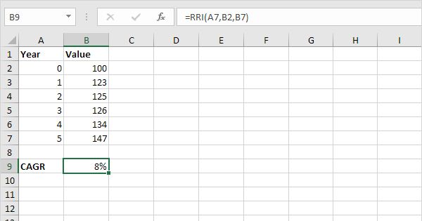

Understanding the importance of measuring investment growth accurately is crucial for investors looking to optimize their portfolios. The Compound Annual Growth Rate (CAGR) serves as a fundamental metric to evaluate the growth of investments over time. CAGR offers a clear picture of the investment's performance by providing an annualized rate of return that smooths out volatility, making it particularly useful for comparison among various investment opportunities.

This article aims to explain how to calculate CAGR using Excel, showcasing its significance in the field of algorithmic trading. Excel, with its diverse range of functions and formulas, provides an efficient and accurate means to quantify CAGR, enabling users to perform detailed financial analyses without complex software. Furthermore, algorithmic trading can significantly benefit from CAGR calculations as this metric assists traders in analyzing and comparing the historical performance of different trading strategies.



By the end of this article, readers will have a comprehensive understanding of using Excel to compute CAGR and appreciate its role and applications in financial modeling and investment analysis. This will not only serve as a practical guide for Excel users but also offer valuable insights into its utility in refining algorithmic trading strategies.

## Table of Contents

## Understanding CAGR

Compound Annual Growth Rate (CAGR) is a crucial financial metric that quantifies the average annual growth rate of an investment over a multi-year period. Unlike simple annual growth rates, CAGR provides a smoothed growth rate that minimizes the influence of volatility commonly experienced in financial markets. This makes it an exceptionally valuable tool for investors seeking a more accurate assessment of their investments' performance over time.

CAGR is expressed as an annualized percentage, enabling investors to understand the consistent annual return required for an investment to grow from its initial value to its final value over a specified period. The formula used to calculate CAGR is:

$$
\text{CAGR} = \left( \frac{\text{Ending Value}}{\text{Beginning Value}} \right)^{\frac{1}{\text{Number of Years}}} - 1
$$

This formula allows investors to gauge how well their investments have performed on an annual basis despite fluctuations in the market. The computation of CAGR involves three key elements: the beginning value of the investment, the ending value, and the period over which the growth is measured.

CAGR's capacity to deliver a consistent rate of growth makes it particularly effective for comparing different investment options, especially those that experience varying degrees of [volatility](/wiki/volatility-trading-strategies). By using CAGR, investors can better ascertain which investments have delivered the highest returns relative to their volatility. Additionally, CAGR provides a straightforward means to compare the historical performance of different investments, offering insights into their long-term growth potential.

Despite its simplicity and utility, it is important to acknowledge that CAGR presents certain limitations. Specifically, it does not capture the risks or the variability of returns within the evaluated period. As such, while CAGR is a potent tool for measuring investment growth, it is most effective when utilized alongside other metrics to ensure a comprehensive investment analysis.

## Calculating CAGR in Excel

Excel offers several methods to calculate the Compound Annual Growth Rate (CAGR), integrating both manual formula entry and convenient built-in functions. Understanding these methods is essential for precise financial analysis.

The primary formula to determine CAGR is straightforward and involves basic arithmetic operations. The formula is:

$$
\text{CAGR} = \left(\frac{\text{Ending Balance}}{\text{Beginning Balance}}\right)^{\left(\frac{1}{\text{Number of Years}}\right)} - 1
$$

This formula captures the essence of CAGR by calculating the geometric progression needed for the investment to grow from its initial value to its final value over the specified period.

To implement this in Excel, you can express it using the POWER function, which enhances readability and usability:

$$
\text{CAGR} = \text{POWER}\left(\frac{\text{Ending Balance}}{\text{Beginning Balance}}, \frac{1}{\text{Number of Years}}\right) - 1
$$

This approach provides a clear and straightforward method to calculate CAGR, utilizing Excel’s capacity to handle complex mathematical functions seamlessly. By using the POWER function, users can avoid manually inputting exponents and ensure more accurately calculated results.

An alternative method to calculate CAGR in Excel is by employing the RRI (Rate of Return on Investment) function. The RRI function is designed to compute the annualized yield based on a constant rate of growth:

$$
\text{CAGR} = \text{RRI}(\text{Number of Years}, \text{Beginning Balance}, \text{Ending Balance})
$$

The RRI function simplifies the process further by directly returning the annual growth rate, requiring only the input of key values: the number of years, initial investment amount, and final investment amount. This function is particularly useful for users who prefer Excel’s built-in capabilities over custom calculations.

Both methods ensure that calculations adhere to the principles of compound interest, accounting for exponential growth rather than simple interest. Understanding how to use either the manual formula or Excel's POWER and RRI functions allows users to accurately gauge investment performance with ease.

## Step-by-Step Guide to CAGR Calculation in Excel

To calculate the Compound Annual Growth Rate (CAGR) in Excel, you begin by organizing your data efficiently. Start with inputting your beginning value, ending value, and the number of years into separate cells. 

For a manual calculation using a basic formula, you can use the following steps:
1. Open your Excel worksheet.
2. Input the beginning value in cell A1, the ending value in cell B1, and the time period in cell C1.
3. In cell D1, enter the formula:
$$
   =(B1/A1)^{(1/C1)}-1

$$
   This formula divides the ending value by the beginning value, takes the result to the power of $1/\text{Years}$, and subtracts 1 to provide the CAGR.

Excel also offers functions that can assist in calculating CAGR more intuitively:

**Using the POWER function:**
- In cell D1, you can alternatively use the POWER function:
$$
  =\text{POWER}(B1/A1, 1/C1)-1

$$
  This approach leverages the POWER function to raise the base fraction to the specified exponent, achieving the same outcome as the previous formula.

**Using the RRI function:**
- Excel's RRI function can compute the CAGR directly. In cell D1, use:
$$
  =\text{RRI}(C1, A1, B1)

$$
  The function takes three arguments: the number of periods (C1), the present value (A1), and the future value (B1), directly outputting the CAGR.

These methods ensure that whether you prefer using standard arithmetic or built-in functions, Excel facilitates a seamless calculation of CAGR, crucial for evaluating the growth of investments over time. Each method provides the flexibility to select the most comfortable approach based on individual user comfort and requirement within Excel.

## Application of CAGR in Algorithmic Trading

CAGR plays a vital role in [algorithmic trading](/wiki/algorithmic-trading) by providing traders with a reliable measure to assess the historical performance of different trading strategies. In essence, it represents the geometric progression ratio that describes the growth rate over a specific time horizon, thus allowing investors to focus on the strategy's efficiency and sustainability rather than short-term fluctuations.

Algorithmic traders often deploy multiple strategies simultaneously, each with varying risk profiles and expected returns. By calculating the CAGR of these strategies, traders obtain a clear picture of how each strategy performs over extended periods. This comparison is crucial when deciding where to allocate capital, as it highlights those strategies that provide consistent growth while mitigating risks associated with market volatility.

Moreover, CAGR aids in refining algorithms. A strategy with a high CAGR indicates robust potential and can be further optimized to enhance profitability or reduce risk—whether by adjusting parameters or incorporating additional market signals. By continuously analyzing the CAGR, traders can iteratively improve their algorithms, ensuring long-term sustainable growth rather than focusing solely on short-term gains.

For example, a trader might implement the following Python code to calculate CAGR and evaluate various strategies:

```python
def calculate_cagr(start_value, end_value, years):
    return (end_value / start_value) ** (1 / years) - 1

# Example strategy results
strategy_results = [
    {'name': 'Strategy A', 'start': 10000, 'end': 15000, 'years': 3},
    {'name': 'Strategy B', 'start': 10000, 'end': 20000, 'years': 5},
]

for strategy in strategy_results:
    cagr = calculate_cagr(strategy['start'], strategy['end'], strategy['years'])
    print(f"{strategy['name']} has a CAGR of {cagr:.2%} over {strategy['years']} years.")
```

In this code snippet, the CAGR function calculates the growth rate for each strategy by measuring the change from the initial capital outlay to its final value over the respective time horizon. This systematic approach equips algorithmic traders with the analytical edge necessary to make informed decisions in an often unpredictable market environment.

Consequently, the comprehensive understanding and application of CAGR are essential for long-term strategy development in algorithmic trading, enabling traders to achieve sustained growth and adapt to shifting market dynamics with confidence.

## Advantages and Disadvantages of Using CAGR

The primary advantage of the compound annual growth rate (CAGR) is its ability to provide a clear, comparative picture of growth over time. By representing growth as a smooth annual rate, it accounts for the compounding effect, which is a critical component in investment returns. The compounding effect refers to the reinvestment of earnings, leading to exponential growth over time. CAGR simplifies growth calculation by focusing on start and end values, compression of multiple years' performance into a single number, making it easier to compare different investment opportunities or strategies. 

For instance, if an investment grows from a value of $10,000 to $15,000 over three years, the CAGR can be calculated as follows:

$$
\text{CAGR} = \left(\frac{\text{Ending Value}}{\text{Beginning Value}}\right)^{\frac{1}{\text{Number of Years}}} - 1 = \left(\frac{15000}{10000}\right)^{\frac{1}{3}} - 1 \approx 0.1447 \text{ or } 14.47\%
$$

This calculation condenses the growth process into a compact number, 14.47%, offering an annual growth rate that would result in the same final value if applied consistently over the period.

However, CAGR has limitations. It can oversimplify the reality of volatility during the investment period. Real-world investments usually experience fluctuating returns, and CAGR does not detail these variabilities. It essentially assumes a steady growth which seldom reflects actual investment conditions. Thus, while CAGR indicates average performance, it doesn't capture the risks or the journey taken by the investment, such as significant drawdowns or periods of underperformance.

Given these limitations, investors and analysts should not rely solely on CAGR when evaluating investments. It is vital to use it alongside other metrics, such as standard deviation, maximum drawdown, or Sharpe ratio, to gain a more comprehensive understanding of the investment's performance and risk profile. These complementary metrics help assess volatility and risk, enabling more informed decision-making. Using this dual approach provides a more accurate and holistic picture of an investment's viability and past performance.

## Conclusion

CAGR, or Compound Annual Growth Rate, serves as an invaluable tool for measuring investment growth over time. It presents a smoothed annual rate that eliminates the effects of volatility, offering a clear picture for comparing various financial products. In the context of Excel, the use of such software enhances accuracy and efficiency in financial analysis. Excel's formulas and functions, such as the POWER and RRI functions, facilitate straightforward computations of CAGR, providing investors and analysts with precise metrics without extensive manual calculations.

For algorithmic traders, understanding and applying CAGR is fundamental to developing informed trading strategies. By utilizing CAGR, traders can assess the historical performance of trading algorithms, comparing their efficiency over long periods. This insight allows them to refine their algorithms, optimizing for sustainable growth and adapting to different market conditions.

While CAGR is an effective metric, it should be noted that it comes with limitations. It tends to oversimplify volatility and does not account for investment risks or variability between periods. As such, integrating CAGR thoughtfully into investment assessments is crucial. It should be used alongside other metrics to ensure a comprehensive understanding of investment performance. Employing CAGR with a balanced approach can lead to more informed decision-making and better investment outcomes.

## References & Further Reading

[1]: ["Principles of Financial Modelling: Model Design and Best Practices Using Excel and VBA"](https://onlinelibrary.wiley.com/doi/book/10.1002/9781118903933) by Michael Rees.

[2]: ["Excel 2019 Power Programming with VBA"](https://onlinelibrary.wiley.com/doi/book/10.1002/9781119583790) by Michael Alexander and Dick Kusleika.

[3]: ["Algorithmic Trading: Winning Strategies and Their Rationale"](https://www.wiley.com/en-us/Algorithmic+Trading%3A+Winning+Strategies+and+Their+Rationale-p-9781118460146) by Ernest P. Chan.

[4]: ["Compounding Returns: Calculating CAGR, XIRR and Other Returns"](https://www.gigacalculator.com/calculators/xirr-calculator.php) in "Midstream and Downstream Investment Solutions" edited by Donald R. Geesaman.