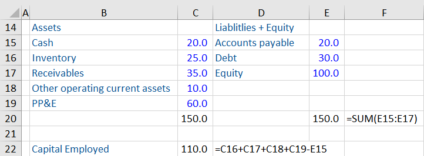

## Table of Contents

## What is capital employed and why is it important?

Capital employed is the total amount of money that a business uses to run its operations and make profits. It includes the money invested by the owners, any loans the business has taken, and the profits that the business has kept to use in the future. Think of it as all the resources that a company has at its disposal to do its work.

It's important because it helps us understand how well a business is using its money to make more money. By looking at capital employed, we can see if the business is good at turning the money it uses into profits. This is useful for owners and investors because it shows them if their money is being used wisely. It also helps managers make better decisions about where to spend the company's money.

## How do you define capital employed in financial terms?

In financial terms, capital employed is the total amount of money that a business uses to carry out its activities and generate profits. It is calculated by adding the money invested by the owners, which is called equity, to the money borrowed by the company, known as debt. Sometimes, it also includes the profits that the business has not paid out as dividends but kept to use in the future, which is called retained earnings.

This measure is important because it shows how much capital is tied up in the business and how effectively that capital is being used to generate returns. Financial analysts often use capital employed to calculate ratios like Return on Capital Employed (ROCE), which helps them assess the efficiency and profitability of a company. A higher ROCE indicates that the company is using its capital more effectively to generate profits.

## What are the components of a balance sheet that are used to calculate capital employed?

To calculate capital employed, you look at the balance sheet of a company. The balance sheet shows what a company owns and what it owes. The main parts you need are the total assets and the current liabilities. Total assets include everything the company owns, like buildings, machines, and money in the bank. Current liabilities are the debts the company needs to pay soon, like bills or short-term loans.

Capital employed can be figured out in two ways using the balance sheet. The first way is by taking the total assets and subtracting the current liabilities. This gives you the net amount of money that is working in the business. The second way is by adding up the equity, which is the money owners put into the business, and the non-current liabilities, which are long-term debts like loans that don't need to be paid back right away. Both methods should give you the same number for capital employed, showing how much money is being used to run the company.

## Can you explain the basic formula for calculating capital employed?

Capital employed is a way to figure out how much money a business is using to do its work and make profits. The basic formula for calculating capital employed is simple: you take the total assets of the company and subtract the current liabilities. Total assets are all the things the company owns, like buildings, machines, and cash. Current liabilities are the debts the company has to pay soon, like bills or short-term loans. So, when you subtract the current liabilities from the total assets, you get the net amount of money that is actively working in the business.

There's another way to calculate capital employed that gives you the same answer. This method involves adding up the equity and the non-current liabilities. Equity is the money that the owners have put into the business. Non-current liabilities are long-term debts, like loans that don't need to be paid back right away. When you add these two together, you get the total amount of money that the business is using to run its operations. Both methods should give you the same number for capital employed, showing how much money is being used to keep the business going and making profits.

## How do you differentiate between total assets and current liabilities when calculating capital employed?

Total assets are everything a business owns that has value. This includes things like buildings, machines, and cash in the bank. When you look at the balance sheet, total assets are all the stuff the company has that can help it make money. On the other hand, current liabilities are the debts the company needs to pay soon, usually within a year. These can be things like bills, wages, or short-term loans that the company has to settle quickly.

When you calculate capital employed, you take the total assets and subtract the current liabilities. This gives you the net amount of money that is actually working in the business. By doing this, you see how much of the company's resources are being used to run the business and make profits, without counting the money needed to pay off short-term debts. This way, you get a clearer picture of the money that's really being used to keep the business going.

## What adjustments might be necessary when using the balance sheet to calculate capital employed?

When using the balance sheet to calculate capital employed, you might need to make some adjustments to get a more accurate picture. One common adjustment is to exclude any non-operating assets. These are things like investments in other companies or excess cash that the business isn't using to run its operations. By taking these out, you focus only on the assets that are actively helping the business make money.

Another adjustment could be to look at the way the company handles its working capital. Sometimes, businesses might have a lot of money tied up in inventory or accounts receivable that isn't being used efficiently. You might need to adjust these figures to see how much capital is really being employed in the business's day-to-day operations. This helps give a clearer view of how well the company is using its resources to generate profits.

## How does the inclusion of intangible assets affect the calculation of capital employed?

When you calculate capital employed, including intangible assets like patents, trademarks, or goodwill can change the total amount. Intangible assets are things you can't touch but still have value for the business. If you include them in the total assets, the capital employed will be higher because these assets add to what the business owns. But, it's important to think about whether these intangible assets are really helping the business make money right now. If they're not, then including them might make the capital employed look bigger than it really is for running the day-to-day operations.

Deciding whether to include intangible assets in the calculation of capital employed depends on what you want to know. If you're looking at how well the business is using its money to make profits right now, you might want to leave out intangible assets that aren't directly helping with that. But if you're thinking about the overall value of the company, including these assets can give a fuller picture. So, it's all about what question you're trying to answer with the capital employed figure.

## Can you provide an example of calculating capital employed using a sample balance sheet?

Let's use a simple example to show how to calculate capital employed using a sample balance sheet. Imagine a small business called "GreenGrocers" that has the following on its balance sheet: total assets of $500,000, which includes $300,000 in buildings and equipment, $100,000 in inventory, and $100,000 in cash. The current liabilities are $100,000, which includes $50,000 in short-term loans and $50,000 in accounts payable. The equity is $300,000, and the non-current liabilities, like long-term loans, are $100,000.

To calculate capital employed using the first method, you take the total assets and subtract the current liabilities. For GreenGrocers, that would be $500,000 (total assets) minus $100,000 (current liabilities), which equals $400,000. This $400,000 is the capital employed, showing how much money is actively working in the business. Using the second method, you add the equity and the non-current liabilities. For GreenGrocers, that would be $300,000 (equity) plus $100,000 (non-current liabilities), which also equals $400,000. Both methods give the same result, confirming that the capital employed for GreenGrocers is $400,000.

## How does the method of calculating capital employed vary between industries?

The way capital employed is calculated can change a bit depending on the industry because different businesses use their money in different ways. For example, a manufacturing company might have a lot of money tied up in big machines and factories, which are part of their total assets. They might also have a lot of inventory that they need to keep on hand to make their products. So, when they calculate capital employed, they need to think about how much of their money is being used for these things. On the other hand, a tech company might have more of its money in things like software development and patents, which are intangible assets. They might not need as much money for physical stuff, so their calculation of capital employed might focus more on these intangible assets.

Even though the basic formula for capital employed stays the same—total assets minus current liabilities or equity plus non-current liabilities—the details can be different. In industries like retail, where companies have a lot of inventory and need to manage their cash flow carefully, they might need to adjust their calculations to account for how quickly they can turn their inventory into cash. In contrast, a service industry like consulting might have fewer physical assets and more focus on human capital, so their capital employed might be more about the money they invest in their employees and the services they provide. Understanding these differences helps businesses and investors see how well a company is using its money to make profits in its specific industry.

## What are the common pitfalls or errors to avoid when calculating capital employed from a balance sheet?

When you're figuring out capital employed from a balance sheet, one big mistake to watch out for is including assets that aren't really helping the business make money right now. For example, if a company has a lot of cash just sitting in the bank and not being used, or if they own investments in other companies that don't affect their day-to-day operations, you shouldn't count these in the total assets. These non-operating assets can make the capital employed number look bigger than it really is, which can give a false idea of how well the business is using its money to make profits.

Another common error is not paying attention to how the company handles its working capital. If a business has a lot of money tied up in inventory that isn't selling fast, or if they're waiting a long time to get paid by their customers, this can mess up the calculation. You need to look at these details carefully and maybe adjust the numbers to show the real amount of money that's working in the business. Ignoring these things can lead to a wrong picture of how efficiently the company is using its capital.

## How can capital employed be used in financial ratios such as Return on Capital Employed (ROCE)?

Capital employed is super important when you want to figure out how well a business is using its money to make more money. One way to do this is by using the Return on Capital Employed, or ROCE for short. ROCE is a financial ratio that shows how much profit a company is making for every dollar of capital it uses. To calculate ROCE, you take the company's earnings before interest and taxes (EBIT) and divide it by the capital employed. This tells you the percentage return the company is getting on the money it's using.

For example, if a business has an EBIT of $100,000 and its capital employed is $500,000, the ROCE would be 20%. This means for every dollar of capital the business uses, it's making 20 cents in profit. ROCE is really helpful because it lets you compare how well different companies are using their money, even if they're in different industries. A higher ROCE means the company is doing a good job turning its capital into profits, which is great news for owners and investors because it shows their money is being used wisely.

## How do changes in accounting policies impact the calculation and interpretation of capital employed?

Changes in accounting policies can really shake things up when you're trying to figure out and understand capital employed. For example, if a company decides to change how it values its inventory or how it accounts for depreciation, this can change the numbers on the balance sheet. If they start using a different method to value their inventory, like switching from FIFO (First In, First Out) to LIFO (Last In, First Out), it can make the total assets look different. This means the capital employed number will change too, because it's based on the total assets minus current liabilities. So, if you're comparing capital employed over time or between different companies, you need to know about these changes to make sure you're looking at the numbers in the right way.

These changes can also mess with how you interpret the capital employed. If a company changes its accounting policy and it makes the capital employed look bigger or smaller, it can change how you see the company's performance. For example, if they start using a method that makes their assets look bigger, the capital employed will be higher, and this might make the Return on Capital Employed (ROCE) look lower. This could make it seem like the company isn't using its money as well as it really is. So, it's important to keep an eye on these accounting changes and understand them when you're looking at financial ratios and trying to figure out how well a business is doing.

## What is Understanding Capital Employed?

Capital employed is a key financial metric that signifies the total amount of capital invested in a company for the purpose of generating profits. It represents the funds that are used to sustain and grow a business, facilitating comprehensive operational analysis and strategic financial planning. The metric is instrumental in understanding a company’s operational efficiency, financial health, and potential for returning investment to stakeholders.

The calculation of capital employed can be encapsulated by the formula:

$$
\text{Capital Employed} = \text{Total Assets} - \text{Current Liabilities}
$$

This formula provides a snapshot of how much capital is actively employed in generating revenue, excluding short-term financial obligations. Total assets comprise both fixed and current assets, reflecting the resources owned by the company. Current liabilities, on the other hand, represent obligations that are due within a short period, typically within a year.

By examining capital employed, analysts can gain insights into a company's operational efficiency. For instance, a higher capital employed relative to the size and growth prospects of a business might signify substantial investment in assets necessary for production. However, it could also indicate inefficiencies if the return on these investments does not commensurate with expectations.

One of the primary financial ratios used to evaluate a company's performance concerning capital employed is the Return on Capital Employed (ROCE). ROCE measures a firm’s profitability and the efficiency with which its capital is employed, calculated as:

$$
\text{ROCE} = \frac{\text{Operating Profit}}{\text{Capital Employed}} \times 100\%
$$

A higher ROCE indicates a more efficient use of capital in generating profits, offering meaningful insights into the company’s return on investment and aiding in comparisons across industry peers.

To illustrate the concept of capital employed, consider a hypothetical balance sheet:

- Total Assets: $500,000
- Current Liabilities: $150,000

Here, the capital employed would be:

$$
\text{Capital Employed} = \$500,000 - \$150,000 = \$350,000
$$

This calculation shows that $350,000 is the net amount invested in the business operations, providing a basis for evaluating the company’s return on the invested capital.

Capital employed plays a crucial role in assessing a company’s cost of capital as well. It helps in determining the weighted average cost of capital (WACC), which significantly influences investment decisions and strategic planning.

Overall, capital employed provides a nuanced understanding of a company's financial stance and its capability to effectively utilize its capital in revenue generation, making it an essential component in financial analysis and decision-making.

## What are the financial calculations related to capital employed?

In the context of financial analysis, particularly within [algorithmic trading](/wiki/algorithmic-trading), understanding key financial ratios involving capital employed is crucial for making informed investment decisions. One such metric is the Return on Capital Employed (ROCE), which provides insights into a company's profitability and capital efficiency.

ROCE is calculated using the formula:

$$
\text{ROCE} = \frac{\text{Earnings Before Interest and Tax (EBIT)}}{\text{Capital Employed}}
$$

Where Capital Employed is typically defined as Total Assets minus Current Liabilities. ROCE measures how effectively a company can generate profits from its capital employed. A higher ROCE indicates greater efficiency in the utilization of capital, making it a valuable metric for investors and algorithmic traders seeking comparative analysis across companies. In algorithmic trading models, ROCE can aid in stratifying stocks or assets, identifying those with superior capital efficiency, hence optimizing portfolio returns.

The significance of ROCE extends to comparative financial analysis. By evaluating ROCE across different industries and sectors, traders can identify which companies have a competitive edge regarding efficient capital usage. This comparative analysis allows algorithmic traders to design strategies that prioritize firms with consistently high ROCE, potentially leading to better financial performance relative to the market.

Another essential calculation related to capital employed is the Weighted Average Cost of Capital (WACC). WACC represents the average rate of return a company is expected to pay its security holders to finance its assets. The formula for WACC is:

$$
\text{WACC} = \left(\frac{E}{V} \times \text{Re}\right) + \left(\frac{D}{V} \times \text{Rd} \times (1 - \text{Tc})\right)
$$

Where:
- $E$ is the market value of equity,
- $D$ is the market value of debt,
- $V$ is the total market value of the company’s financing (equity + debt),
- $\text{Re}$ is the cost of equity,
- $\text{Rd}$ is the cost of debt, and
- $\text{Tc}$ is the corporate tax rate.

For algorithmic traders, understanding WACC is fundamental as it provides insights into the minimum return required to make an investment worthwhile. It serves as a hurdle rate for investment evaluation, ensuring that any trading strategy or investment decision exceeds the company’s cost of capital.

### Example Calculation:

Consider a hypothetical company with the following details:
- EBIT: $100,000
- Total Assets: $500,000
- Current Liabilities: $200,000
- Market Value of Equity (E): $300,000
- Market Value of Debt (D): $200,000
- Cost of Equity ($\text{Re}$): 10%
- Cost of Debt ($\text{Rd}$): 5%
- Corporate Tax Rate ($\text{Tc}$): 30%

First, we calculate Capital Employed:
$$
\text{Capital Employed} = \text{Total Assets} - \text{Current Liabilities} = 500,000 - 200,000 = 300,000
$$

Next, we calculate ROCE:
$$
\text{ROCE} = \frac{100,000}{300,000} = 33.33\%
$$

Then, calculate WACC:
$$
V = E + D = 300,000 + 200,000 = 500,000
$$

$$
\text{WACC} = \left(\frac{300,000}{500,000} \times 10\%\right) + \left(\frac{200,000}{500,000} \times 5\% \times (1 - 0.30)\right)
$$

$$
\text{WACC} = 0.06 + 0.014 = 7.4\%
$$

This means the company must earn at least 7.4% on its investments to satisfy its capital costs. An algorithmic trading strategy could integrate these metrics to benchmark companies, ensuring investments are directed towards those exceeding their WACC and demonstrating capital efficiency through high ROCE, ultimately driving more robust returns.

## How do you interpret the balance sheet?

A balance sheet is a fundamental financial statement that provides a snapshot of a company's financial position at a specific point in time. It is divided into three primary sections: assets, liabilities, and shareholders' equity. Understanding these components is crucial for interpreting a balance sheet, especially when assessing capital employed and making informed decisions in algorithmic trading.

Assets are divided into current and non-current assets. Current assets are short-term resources expected to be converted into cash within a year, such as cash equivalents, accounts receivable, and inventory. Non-current assets, also known as fixed assets, include long-term investments like property, plant, and equipment (PP&E), which are not intended for quick conversion into cash.

Liabilities, like assets, are categorized into current and non-current liabilities. Current liabilities are obligations the company expects to settle within a year, including accounts payable and short-term debt. Non-current liabilities, or long-term liabilities, involve obligations like bonds payable or long-term loans due in more than one year.

Shareholders' equity represents the residual interest in the assets of the company after deducting liabilities. It consists of common stock, preferred stock, retained earnings, and additional paid-in capital.

Capital employed is derived from these balance sheet components. It can be calculated using the formula:

$$
\text{Capital Employed} = \text{Total Assets} - \text{Current Liabilities}
$$

This calculation provides insights into the resources a company uses for its operations and growth, helping traders evaluate how efficiently a company is utilizing its capital to generate profits. 

In algorithmic trading, understanding balance sheet metrics such as current ratio, quick ratio, debt-to-equity ratio, and return on equity (ROE) is vital. These metrics are used to assess [liquidity](/wiki/liquidity-risk-premium), financial stability, and profitability, which directly impact stock performance and trading decisions. Here is a brief rationale behind some of these metrics:

- **Current Ratio:** Measures a company's ability to cover its short-term obligations with its short-term assets. A higher ratio indicates greater liquidity and financial health.

- **Quick Ratio:** Similar to the current ratio but excludes inventory, giving a more stringent indication of a company's short-term liquidity. 

- **Debt-to-Equity Ratio:** Compares total liabilities to shareholders' equity, indicating the capital structure and financial leverage.

- **Return on Equity (ROE):** Measures profitability by showing how much profit a company generates with the money shareholders have invested.

Evaluating these metrics through balance sheet analysis can help traders identify undervalued or overvalued stocks, forecast corporate performance, and make strategic trade decisions. By detecting changes or trends in these balance sheet elements, algorithmic traders can anticipate shifts in market conditions and adjust trading strategies accordingly. 

Critical components of the balance sheet for traders to monitor include the company's liquidity through current and quick ratios, the level of financial leverage through the debt-to-equity ratio, and overall profitability represented by ROE. Each component offers actionable insights that, when integrated with algorithmic models, can enhance the precision and profitability of trading strategies. 

In summary, balance sheet analysis through key metrics not only enables traders to evaluate a company's financial health but also equips them to exploit trading opportunities, optimize their portfolios, and potentially achieve better risk-adjusted returns.

## References & Further Reading

[1]: Bergstra, J., Bardenet, R., Bengio, Y., & Kégl, B. (2011). ["Algorithms for Hyper-Parameter Optimization."](https://dl.acm.org/doi/10.5555/2986459.2986743) Advances in Neural Information Processing Systems 24.

[2]: ["Advances in Financial Machine Learning"](https://www.amazon.com/Advances-Financial-Machine-Learning-Marcos/dp/1119482089) by Marcos Lopez de Prado

[3]: ["Evidence-Based Technical Analysis: Applying the Scientific Method and Statistical Inference to Trading Signals"](https://books.google.com/books/about/Evidence_Based_Technical_Analysis.html?id=MeoJAQAAMAAJ) by David Aronson

[4]: ["Machine Learning for Algorithmic Trading"](https://github.com/stefan-jansen/machine-learning-for-trading) by Stefan Jansen

[5]: ["Quantitative Trading: How to Build Your Own Algorithmic Trading Business"](https://www.amazon.com/Quantitative-Trading-Build-Algorithmic-Business/dp/1119800064) by Ernest P. Chan