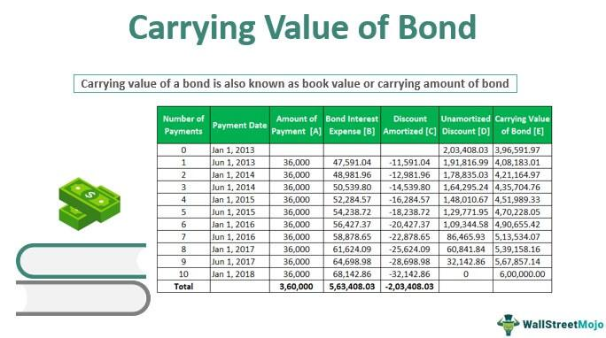

## Table of Contents

## What is the carrying value of a bond?

The carrying value of a bond is the value of the bond that is shown on a company's balance sheet. It is also known as the book value of the bond. This value can change over time because it includes the bond's face value plus or minus any unamortized premiums or discounts, and it also includes any unamortized issuance costs.

When a bond is issued at a price different from its face value, the difference is recorded as a premium or discount. This premium or discount is then amortized over the life of the bond. The carrying value of the bond will gradually move closer to its face value as these amounts are amortized. For example, if a bond is issued at a discount, the carrying value will increase over time until it equals the face value at maturity.

## How is the carrying value of a bond different from its face value?

The carrying value of a bond is different from its face value because the carrying value takes into account more than just the amount that will be paid back at the end of the bond's life. The face value, or par value, of a bond is the amount the issuer agrees to repay to the bondholder when the bond matures. It's a fixed number that doesn't change over time.

On the other hand, the carrying value includes the face value but also adjusts for any premiums or discounts that occurred when the bond was issued, as well as any costs associated with issuing the bond. If a bond is sold for more than its face value, it's issued at a premium, and if it's sold for less, it's issued at a discount. These amounts are gradually accounted for over the life of the bond, causing the carrying value to change until it matches the face value at maturity.

## What are the components that make up the carrying value of a bond?

The carrying value of a bond is made up of a few key parts. The first part is the bond's face value, which is the amount the bond issuer will pay back when the bond matures. This is the main part of the carrying value and stays the same throughout the bond's life.

The other parts of the carrying value are any premiums or discounts and the costs of issuing the bond. If the bond was sold for more than its face value, there's a premium. If it was sold for less, there's a discount. These amounts are slowly added or subtracted from the carrying value over time until the bond matures. Also, the costs of issuing the bond, like fees paid to underwriters, are subtracted from the carrying value and spread out over the life of the bond.

## How do you calculate the carrying value of a bond at issuance?

When a bond is first issued, its carrying value is easy to figure out. It starts with the face value of the bond, which is the amount the bond issuer promises to pay back when the bond matures. If the bond is sold for more than its face value, this extra amount is called a premium. If it's sold for less, it's called a discount. At the time of issuance, you add the premium or subtract the discount from the face value to get the carrying value.

Also, there are costs that come with issuing a bond, like fees paid to underwriters. These costs are subtracted from the carrying value right from the start. So, to find the carrying value of a bond at issuance, you take the face value, add or subtract any premium or discount, and then subtract the issuance costs. This gives you the starting carrying value of the bond on the company's balance sheet.

## What role does amortization play in calculating the carrying value of a bond?

Amortization is important when figuring out the carrying value of a bond because it helps spread out the costs or gains over the life of the bond. When a bond is issued at a price different from its face value, this difference is called a premium or a discount. If the bond was sold for more than its face value, there's a premium, and if it was sold for less, there's a discount. Amortization means that these premiums or discounts are slowly added or subtracted from the carrying value over time, until the bond matures and the carrying value equals the face value.

The costs of issuing the bond, like fees paid to underwriters, are also spread out over the life of the bond through amortization. These costs are subtracted from the carrying value little by little each period. So, as time goes on, the carrying value changes because of this amortization process. This makes sure that the bond's value on the balance sheet reflects its true worth as it gets closer to the date when it will be paid back.

## How do changes in market interest rates affect the carrying value of a bond?

Changes in market interest rates don't directly change the carrying value of a bond on the company's balance sheet. The carrying value is based on the bond's face value, any premiums or discounts, and issuance costs, which are all set when the bond is issued. These amounts are then slowly adjusted over time through amortization, but this process happens regardless of what's happening with market interest rates.

However, market interest rates can affect the market value of a bond, which is different from the carrying value. If interest rates go up, new bonds will offer higher interest payments, making existing bonds with lower interest rates less attractive. This can cause the market price of the existing bond to drop. On the other hand, if interest rates go down, the existing bond's higher interest rate becomes more appealing, which can push its market price up. Even though the market value changes, the carrying value on the balance sheet stays the same unless the bond is sold or there's an impairment that needs to be accounted for.

## Can you explain the effective interest method used in calculating the carrying value of a bond?

The effective interest method is a way to figure out how the carrying value of a bond changes over time. It's used when a bond is sold for more or less than its face value, which creates a premium or discount. This method spreads out the premium or discount over the life of the bond, so the carrying value gets closer to the face value each period. It works by figuring out the interest expense for each period using the bond's carrying value at the start of the period and the bond's effective interest rate. The interest expense is then compared to the actual interest paid to find out how much of the premium or discount should be added or subtracted from the carrying value that period.

For example, let's say a bond with a face value of $1,000 is sold for $950, so there's a $50 discount. If the bond's effective interest rate is 5%, the interest expense for the first period would be 5% of $950, which is $47.50. If the bond pays $50 in interest each period, the difference between the interest paid and the interest expense, which is $2.50, would be added to the carrying value. So, the new carrying value at the end of the first period would be $952.50. This process continues each period until the bond matures and the carrying value equals the face value.

## How do you account for bond premiums and discounts when calculating the carrying value?

When a bond is sold for more than its face value, it's called a premium. When it's sold for less, it's called a discount. These premiums and discounts affect the carrying value of the bond right from the start. If there's a premium, you add it to the face value to get the carrying value at issuance. If there's a discount, you subtract it from the face value. Also, any costs of issuing the bond, like fees, are subtracted from the carrying value at the beginning.

Over time, these premiums and discounts are slowly added or subtracted from the carrying value through a process called amortization. This means that each period, a little bit of the premium or discount is accounted for, so the carrying value gets closer and closer to the face value of the bond. By the time the bond matures, the carrying value should be the same as the face value. This way, the bond's value on the balance sheet reflects its true worth as it gets closer to the date it will be paid back.

## What is the impact of bond issuance costs on the carrying value of a bond?

When a company issues a bond, they have to pay for things like fees to underwriters or lawyers. These costs are called bond issuance costs. These costs are taken away from the bond's carrying value right from the start. So, if a bond has a face value of $1,000 and the company paid $50 in issuance costs, the starting carrying value would be $950 if there's no premium or discount.

Over time, these issuance costs are slowly spread out over the life of the bond through a process called amortization. This means that each period, a little bit of the issuance costs is added back to the carrying value. This way, the carrying value gets closer and closer to the bond's face value as the bond gets closer to the date it will be paid back. By the time the bond matures, the carrying value should be the same as the face value, making sure the bond's value on the company's balance sheet reflects its true worth.

## How does the carrying value of a bond change over its life, and why?

The carrying value of a bond changes over its life because of something called amortization. When a bond is first sold, its carrying value is based on its face value, but it can be more or less than that if the bond was sold for a premium or a discount. Also, any costs to issue the bond, like fees, are taken away from the carrying value right away. Over time, the premium or discount and the issuance costs are slowly added or subtracted from the carrying value each period. This process is called amortization, and it makes sure the carrying value moves closer to the bond's face value as time goes on.

By the time the bond matures, the carrying value should be the same as the face value. This happens because the premium or discount is spread out over the life of the bond. If the bond was sold for more than its face value, the premium is slowly taken away from the carrying value each period. If it was sold for less, the discount is added back little by little. The same goes for the issuance costs, which are added back to the carrying value over time. This way, the bond's value on the company's balance sheet reflects its true worth as it gets closer to the date it will be paid back.

## What are the journal entries involved in adjusting the carrying value of a bond over time?

When a bond is first sold, the company records the money it gets from selling the bond as cash. If the bond was sold for more than its face value, the extra amount is called a premium and is added to the bond's carrying value. If it was sold for less, the difference is called a discount and is subtracted from the carrying value. Any costs to issue the bond, like fees, are also taken away from the carrying value right away. The journal entry at issuance would be to debit cash for the amount received, debit bond issuance costs for any fees paid, credit bonds payable for the face value, and credit or debit the premium or discount on bonds payable for the difference between the cash received and the face value.

Over time, the carrying value of the bond changes because of amortization. Each period, the company records the interest expense based on the bond's carrying value at the start of the period and its effective interest rate. The actual interest paid is usually different from the interest expense, and this difference is used to adjust the carrying value. If there's a premium, the interest paid is more than the interest expense, so the premium is slowly taken away from the carrying value. If there's a discount, the interest paid is less than the interest expense, so the discount is added back to the carrying value. The journal entry each period would be to debit interest expense, credit cash for the interest paid, and either debit or credit the premium or discount on bonds payable for the difference. This process continues until the bond matures and the carrying value equals the face value.

## How do you calculate the carrying value of a bond at any point in time after issuance?

To figure out the carrying value of a bond at any point after it's been sold, you start with the bond's face value. This is the amount the company will pay back when the bond matures. If the bond was sold for more than its face value, you add the premium to the face value. If it was sold for less, you subtract the discount. You also need to take away any costs to issue the bond, like fees, right from the start. This gives you the starting carrying value.

Over time, the carrying value changes because of something called amortization. Each period, you figure out the interest expense using the bond's carrying value at the start of the period and its effective interest rate. The actual interest paid is usually different from the interest expense. If there's a premium, the interest paid is more than the interest expense, so you slowly take away the premium from the carrying value. If there's a discount, the interest paid is less than the interest expense, so you add the discount back to the carrying value. You also slowly add back the issuance costs over time. This way, the carrying value gets closer and closer to the face value until the bond matures.

## What is the Understanding of Carrying Value in Financial Analysis?

Carrying value, frequently referred to as book value, represents the recorded amount of a bond as featured in financial statements. It is derived by adjusting the bond's face value for any unamortized premium or discount that may exist. This figure is crucial for financial reporting and plays a significant role in the analysis of a company's financial health. In accounting terms, the carrying value is essential for the accurate depiction of a company's liabilities on its balance sheet, providing stakeholders with insights into the amount owed to bondholders.

The calculation of carrying value involves several steps. Initially, a bond may be issued at a face value different from its market value due to prevailing interest rates. If the bond is issued at a price higher than its face value, it carries an unamortized premium. Conversely, if it is issued below face value, it reflects an unamortized discount. Over time, the premium or discount is systematically amortized until it reaches zero at maturity, aligning the carrying value with the face value of the bond.

Mathematically, the carrying value can be expressed as:

$$
\text{Carrying Value} = \text{Face Value} + \text{(Unamortized Premium)} - \text{(Unamortized Discount)}
$$

This equation underscores the bond's financial representation as it incorporates the adjustments for premiums and discounts, accounting for the gradual alignment of the bond's offered yield with the market [interest rate](/wiki/interest-rate-trading-strategies) over its maturity period.

Differentiating carrying value from face value and market value is vital for a comprehensive understanding of a bond's financial standing. The face value denotes the principal amount to be repaid to bondholders at maturity, while the market value is the current trading price of the bond, which fluctuates based on market interest rates and other economic factors. Unlike market value, which can vary significantly with economic changes, the carrying value provides a more stable measure based on historical purchase costs adjusted for amortization effects.

Accurate recognition of carrying value is indispensable for financial analysts and investors as it affects the computation of key financial ratios and influences investment decisions. By understanding carrying value, stakeholders can assess the actual financial obligations of an entity, distinguishing between what is reflected on the balance sheets and the ever-changing market perceptions.

## What is the process of bond valuation?

Bond valuation is a critical financial tool used to determine the fair price of a bond in the market. It involves calculating the present value of the bond's expected future cash flows, which include periodic coupon payments and the redemption of the bond's face value at maturity. This valuation process is essential for making informed investment decisions and managing portfolios effectively, as it helps investors ascertain whether a bond is priced appropriately in the market.

To accurately value a bond, it is crucial to understand several key factors:

1. **Coupon Payments**: Bonds come with fixed or variable interest payments, known as coupons, which are typically paid semi-annually or annually. These payments are a primary component of a bond's cash flows and are determined by the bond's coupon rate.

2. **Face Value**: Also known as par value, the face value is the amount paid back to the bondholder at maturity. It is a critical element in calculating the bond's redemption value at the end of its term.

3. **Yield to Maturity (YTM)**: YTM is the total return anticipated on a bond if it is held until it matures. It considers the bond's current market price, face value, coupon interest rate, and time to maturity, providing a comprehensive measure of a bond's potential yield. 

The mathematical formula used to calculate the present value of a bond is as follows:

$$
\text{PV} = \sum_{t=1}^{n} \frac{C}{(1+r)^t} + \frac{F}{(1+r)^n}
$$

Where:
- $\text{PV}$ is the present value of the bond.
- $C$ is the coupon payment.
- $r$ is the discount rate (or yield to maturity).
- $t$ is the time period.
- $F$ is the face value of the bond.
- $n$ is the total number of periods (years) until maturity.

By discounting the bond's future cash flows to their present value, investors can assess whether the bond is undervalued, fairly valued, or overvalued in the market. 

Understanding these factors not only aids in ascertaining the bond’s fair market value but also facilitates strategic investment choices. Investors can utilize this knowledge to align their bond investments with their risk profiles and return objectives while optimizing their portfolio's overall performance.

## What are the key concepts in bond valuation?

In bond valuation, several key concepts play a crucial role in determining a bond's fair value. Among these are the bond's coupon rate, maturity date, current market price, and yield to maturity (YTM).

The coupon rate is the annual interest rate paid by the bond issuer on the bond's face value. It determines the periodic coupon payments received by bondholders. For instance, a bond with a face value of $1,000 and a coupon rate of 5% will pay $50 annually until maturity.

The maturity date is when the bond issuer repays the bond's face value to the bondholders. The duration until maturity significantly impacts the bond's valuation, as longer durations tend to increase exposure to interest rate risk. 

The current market price is the price at which the bond is currently trading in the market. It fluctuates due to changes in economic conditions and interest rates. When interest rates rise, bond prices tend to fall and vice versa. This inverse relationship arises because existing bonds with lower coupon rates become less attractive compared to new issues offering higher rates, leading investors to sell the former, thus depressing their market price.

Yield to maturity (YTM) is the total return anticipated on a bond if it is held until it matures. It reflects the bond's coupon payments, the face value redemption, and the price paid for the bond. YTM is a comprehensive measure of a bond's profitability, encompassing both current income and capital gain components. It can be approximated using the following formula when the bond price and other factors are known:

$$
P = \frac{C}{(1 + YTM)^1} + \frac{C}{(1 + YTM)^2} + \ldots + \frac{C + F}{(1 + YTM)^n}
$$

Where:
- $P$ is the current market price of the bond,
- $C$ is the annual coupon payment,
- $F$ is the face value of the bond,
- $n$ is the number of years until maturity.

These concepts are essential for assessing the intrinsic value of bonds. Investors use the fair value derived from bond valuation to make informed strategic investment decisions. By understanding how economic conditions and interest rate changes affect these parameters, investors can align their portfolio strategies with their financial objectives and manage risks more effectively.

## How is Bond Valuation Applied in Practice?

Bond valuation, as a practical tool, is fundamental for investment decision-making, facilitating investors in aligning bond investments with specific risk profiles and return objectives. By assessing the intrinsic worth of bonds, investors can ensure their portfolio selections reflect their financial goals and risk tolerance.

In the context of portfolio management, bond valuation is particularly valuable for optimizing asset allocation. Proper valuation allows for a strategic distribution of investment capital across various financial instruments, helping portfolio managers balance risk and return effectively. Accurate bond valuations serve as performance indicators, enabling investors to track and manage the financial health of their portfolios under different market conditions. For instance, a bond trading at a discount might offer higher yields, which could appeal to an investor seeking aggressive growth, while a bond at a premium might be suitable for those prioritizing stability and income.

In corporate finance, bond valuation plays a critical role in planning debt issuance strategies. Companies rely on precise bond valuations to determine the most favorable conditions for issuing new debt. By analyzing market trends and price fluctuations, they can decide on the timing and pricing of new bonds to minimize borrowing costs and maximize capital raised. Additionally, bond valuations assist in capital planning, helping companies manage their debt portfolios and plan future financing activities in alignment with strategic business objectives.

The formula for evaluating a bond's price $P$ incorporates the present value concept, given as:

$$

P = \sum_{t=1}^{n} \frac{C}{(1+r)^t} + \frac{F}{(1+r)^n} 
$$

Where:
- $C$ is the annual coupon payment,
- $F$ is the face value of the bond,
- $r$ is the discount rate or yield to maturity,
- $n$ is the total number of periods.

Python can be particularly useful in calculating bond valuations due to its capacity for handling complex mathematical computations quickly. A simple Python snippet to calculate the price of a bond could look like this:

```python
def bond_price(coupon, face_value, discount_rate, periods):
    present_value_coupons = sum([coupon / ((1 + discount_rate) ** t) for t in range(1, periods + 1)])
    present_value_face = face_value / ((1 + discount_rate) ** periods)
    return present_value_coupons + present_value_face

# Example: A bond with a $50 annual coupon, $1000 face value, 5% discount rate, over 10 periods
price = bond_price(50, 1000, 0.05, 10)
print(f"The bond's price is: ${price:.2f}")
```

This integration of computational tools ensures precise assessments and timely adjustments, allowing both individual investors and corporate entities to enhance their financial strategies and achieve their investment or financing goals in practice.

## What is the relationship between Algorithmic Trading and Bond Valuation?

Algorithmic trading has transformed the landscape of financial markets, allowing traders to execute complex strategies at speeds unattainable by manual trading. In the context of bond valuation, [algorithmic trading](/wiki/algorithmic-trading) employs sophisticated algorithms to calculate the present value of bonds and identify market inefficiencies. This approach leverages computational resources to enhance trading efficiency and optimize performance.

Automated trading systems assess the worth of bonds by implementing algorithms that compute the present value of future cash flows, which include periodic coupon payments and the bond's face value at maturity. The fundamental principle involves discounting these cash flows using an appropriate discount rate, usually the yield to maturity. The formula for calculating the present value $PV$ of a bond with $C$ as the annual coupon payment, $r$ as the discount rate, and $n$ as the number of periods to maturity can be expressed as:

$$

PV = \sum_{t=1}^{n} \frac{C}{(1 + r)^t} + \frac{\text{Face Value}}{(1 + r)^n} 
$$

Python, a widely used programming language in finance, plays a crucial role in implementing these valuation algorithms due to its ease of use and robust libraries such as NumPy and Pandas. For example, the present value calculation can be efficiently executed with Python's NumPy library:

```python
import numpy as np

def bond_valuation(coupons, face_value, discount_rate):
    n = len(coupons)
    present_value_coupons = np.sum([c / (1 + discount_rate)**t for t, c in enumerate(coupons, start=1)])
    present_value_face_value = face_value / (1 + discount_rate)**n
    return present_value_coupons + present_value_face_value

# Example values
coupons = [50, 50, 50, 50, 50]  # 5 annual coupon payments of $50
face_value = 1000  # Face value of the bond
discount_rate = 0.05  # Discount rate of 5%

bond_value = bond_valuation(coupons, face_value, discount_rate)
print(f"The present value of the bond is: ${bond_value:.2f}")
```

This program calculates the present value of a bond with specified coupon payments, face value, and discount rate. It exemplifies the efficiency and accuracy with which automated systems can process bond valuation tasks.

Moreover, these systems are designed to adapt dynamically to market conditions, continuously adjusting their models as they receive real-time data. This flexibility allows for the refinement of trading strategies and the exploitation of transient market inefficiencies. As market conditions change due to factors such as interest rate fluctuations or economic news, algorithmic trading systems can swiftly reassess bond valuations and adjust trading positions accordingly.

In summary, algorithmic trading enhances the bond valuation process by providing rapid, precise, and adaptable calculations. This integration not only improves trading efficiency but also increases the potential for profitable trades in the bond market.

## What are examples of bond valuation?

Calculating the bond value involves determining the present value of all future cash flows expected from the bond, such as periodic coupon payments and the redemption of principal upon maturity. This calculation varies for different types of bonds, notably coupon bonds and zero-coupon bonds.

### Valuing Coupon Bonds

A coupon bond pays interest annually or semi-annually at a specified rate until maturity, when it also returns the face value. The valuation of a coupon bond is computed by discounting the expected coupon payments and the face value to the present using the bond's yield to maturity (YTM) as the discount rate. The formula for a coupon bond’s present value is:

$$

P = \sum_{t=1}^{n} \frac{C}{(1 + r)^t} + \frac{F}{(1 + r)^n}
$$

Where:
- $P$ is the present value of the bond.
- $C$ is the annual coupon payment.
- $r$ is the yield to maturity.
- $F$ is the face value of the bond.
- $n$ is the number of periods until maturity.

#### Example Calculation for a Coupon Bond

Assume a bond with a face value of $1,000, a coupon rate of 5%, YTM of 4%, and 10 years to maturity. The annual coupon is $50 ($0.05 \times 1000$).

Using Python for this valuation:

```python
def coupon_bond_value(face_value, coupon_rate, ytm, periods):
    coupon = face_value * coupon_rate
    present_value_coupons = sum([coupon / (1 + ytm)**t for t in range(1, periods + 1)])
    present_value_face = face_value / (1 + ytm)**periods
    return present_value_coupons + present_value_face

bond_value = coupon_bond_value(1000, 0.05, 0.04, 10)
print(bond_value)
```

### Valuing Zero-Coupon Bonds

Zero-coupon bonds differ as they do not provide periodic interest payments. Instead, they are issued at a discount and redeemed at the face value upon maturity. The present value of a zero-coupon bond is calculated by discounting the face value back to the present:

$$

P = \frac{F}{(1 + r)^n}
$$

#### Example Calculation for a Zero-Coupon Bond

Consider a zero-coupon bond with a face value of $1,000, a YTM of 5%, and maturity of 10 years.

Using Python for this valuation:

```python
def zero_coupon_bond_value(face_value, ytm, periods):
    return face_value / (1 + ytm)**periods

bond_value = zero_coupon_bond_value(1000, 0.05, 10)
print(bond_value)
```

### Utilizing Computational Tools

Python, along with libraries like NumPy and pandas, allows for streamlined bond valuation, enabling the handling of complex calculations efficiently. This computational capability is crucial for portfolio managers and investors aiming to integrate precise financial analysis into their decision-making process. By practicing through real-world examples, investors sharpen their valuation techniques, leading to better-informed decisions in the dynamic bond market.

## References & Further Reading

[1]: Fabozzi, F. J. (2007). ["Fixed Income Analysis."](https://books.google.com/books/about/Fixed_Income_Analysis.html?id=lujLawVLS3YC) John Wiley & Sons.

[2]: Hull, J. C. (2018). ["Options, Futures, and Other Derivatives."](https://www.semanticscholar.org/paper/Options%2C-Futures%2C-and-Other-Derivatives-Hull/89bdee500c8623864fc9eb7a471546aa713acc44) Pearson.

[3]: ["Bond Valuation and Yield Curves"](https://fastercapital.com/content/Bond-Valuation--Applying-Models-to-Account-for-the-Humped-Yield-Curve.html) - Investopedia

[4]: ["Algorithmic and High-Frequency Trading"](https://www.amazon.com/Algorithmic-High-Frequency-Trading-Mathematics-Finance/dp/1107091144) by Álvaro Cartea, Sebastian Jaimungal, and José Penalva

[5]: ["Introduction to Statistical Learning"](https://www.statlearning.com/) by Gareth James, Daniela Witten, Trevor Hastie, and Robert Tibshirani