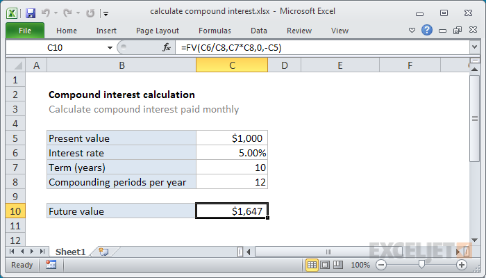

## Table of Contents

## What is compound interest and why is it important?

Compound interest is when you earn interest on both the money you save and the interest you've already earned. It's like a snowball that grows bigger as it rolls down a hill. The more often the interest is added to your savings, the faster your money grows. For example, if you put $100 in a bank account that gives you 5% interest each year, after one year you'll have $105. If you leave that money in the account, the next year you'll earn 5% on $105, not just the original $100.

Compound interest is important because it helps your money grow faster over time. It's a powerful tool for saving and investing. If you start saving early, even small amounts can turn into a lot of money thanks to compound interest. This is why it's often said that time is your best friend when it comes to saving money. Understanding and using compound interest can help you reach your financial goals, like buying a house or retiring comfortably.

## How do you set up a basic compound interest calculation in Excel?

To set up a basic compound interest calculation in Excel, start by opening a new spreadsheet. In cell A1, type "Principal" and in cell B1, enter the initial amount of money you're investing, like $1000. In cell A2, type "Annual Interest Rate" and in cell B2, enter the interest rate as a decimal, for example, 0.05 for 5%. In cell A3, type "Number of Times Interest is Compounded per Year" and in cell B3, enter the number of times the interest is compounded annually, like 12 for monthly compounding. In cell A4, type "Time in Years" and in cell B4, enter the number of years you want to calculate for, such as 5 years.

Next, in cell A6, type "Compound Interest" and in cell B6, use the formula to calculate compound interest. The formula is: `=B1 * (1 + B2/B3)^(B3*B4) - B1`. This formula takes the principal amount (B1), multiplies it by (1 + the annual interest rate divided by the number of times compounded per year) raised to the power of (the number of times compounded per year times the number of years), and then subtracts the principal to give you just the interest earned. After entering the formula, press Enter, and Excel will show you the compound interest earned over the specified period.

## What formula should you use to calculate compound interest in Excel?

To calculate compound interest in Excel, you use a specific formula. The formula is `=B1 * (1 + B2/B3)^(B3*B4) - B1`. Here, B1 is the principal amount, B2 is the annual interest rate as a decimal, B3 is the number of times the interest is compounded per year, and B4 is the number of years. When you put this formula into a cell, Excel will do the math and show you the compound interest you'll earn.

This formula works by figuring out how much your money grows with each compounding period. It starts with your initial amount and adds the interest for each period, then uses that new amount to calculate the next period's interest. Over time, this makes your money grow faster because you're earning interest on both the money you started with and the interest you've already earned.

## How can you use Excel to calculate compound interest over different time periods?

To calculate compound interest over different time periods in Excel, you can set up a table where each row represents a different time period. Start by entering your principal amount in one cell, say A1. In another cell, like A2, enter the annual interest rate as a decimal. In A3, put the number of times the interest is compounded per year. Then, in column B, list the different time periods you want to calculate for, like 1 year in B1, 2 years in B2, and so on. In cell C1, use the formula `=A1 * (1 + A2/A3)^(A3*B1) - A1` to calculate the compound interest for the first time period. Copy this formula down column C to calculate the interest for each time period listed in column B.

As you copy the formula down, Excel will automatically adjust the time period in the calculation, showing you the compound interest for each year or period you've listed. This way, you can easily see how your money grows over time with compound interest. If you want to change the principal, interest rate, or compounding frequency, just update the values in cells A1, A2, and A3, and all the calculations in column C will update automatically. This makes it simple to compare how different time periods affect your savings or investments.

## What are the key variables in a compound interest formula and how do you input them into Excel?

The key variables in a compound interest formula are the principal amount, the annual interest rate, the number of times the interest is compounded per year, and the time period in years. The principal amount is the initial sum of money you start with. The annual interest rate is how much interest you earn each year, usually shown as a percentage but entered as a decimal in Excel. The number of times the interest is compounded per year tells you how often the interest is added to your money. The time period is how many years you want to calculate the interest for.

To input these variables into Excel, start by putting the principal amount in one cell, like A1. Then, enter the annual interest rate as a decimal in another cell, say A2. For example, if the interest rate is 5%, you would enter 0.05. Next, put the number of times the interest is compounded per year in a cell like A3. If it's compounded monthly, you would enter 12. Finally, list the time periods you want to calculate for in a column, like B1 for 1 year, B2 for 2 years, and so on. Use the formula `=A1 * (1 + A2/A3)^(A3*B1) - A1` in cell C1 to calculate the compound interest for the first time period, and copy it down to see the interest for each time period.

## How do you adjust the compound interest formula for different compounding frequencies?

To adjust the compound interest formula for different compounding frequencies, you need to change the number of times the interest is compounded per year. This number is part of the formula and affects how fast your money grows. For example, if interest is compounded yearly, you use 1. If it's compounded monthly, you use 12. The formula in Excel stays the same, but you change the number in the cell where you put the compounding frequency.

When you change the compounding frequency, you're telling Excel how often to add the interest to your money. If you compound more often, like monthly instead of yearly, your money will grow faster because you're earning interest on the interest more often. Just update the number in the cell that represents the compounding frequency, and Excel will automatically recalculate the compound interest for you.

## Can you demonstrate how to create a dynamic compound interest calculator in Excel?

To create a dynamic compound interest calculator in Excel, start by setting up your spreadsheet. In cell A1, type "Principal" and enter the initial amount of money in cell B1. In cell A2, type "Annual Interest Rate" and enter the interest rate as a decimal in cell B2. For example, if the rate is 5%, you would enter 0.05. In cell A3, type "Compounding Frequency" and enter the number of times the interest is compounded per year in cell B3. If it's compounded monthly, enter 12. In cell A4, type "Time in Years" and enter the number of years in cell B4. Then, in cell A6, type "Compound Interest" and in cell B6, use the formula `=B1 * (1 + B2/B3)^(B3*B4) - B1` to calculate the compound interest.

Now, to make your calculator dynamic, you can change the values in cells B1, B2, B3, and B4 to see how the compound interest changes. For example, if you want to see how the interest changes with different principal amounts, just change the number in B1. If you want to see how different interest rates affect your savings, change the number in B2. You can also adjust the compounding frequency in B3 or the time period in B4. Excel will automatically update the compound interest calculation in cell B6 based on the new values you enter. This way, you can quickly see how different factors affect your savings or investments.

## How do you incorporate additional contributions into a compound interest calculation in Excel?

To incorporate additional contributions into a compound interest calculation in Excel, you need to add a new cell for the regular contributions you make. In cell A5, type "Annual Contribution" and enter the amount you plan to add each year in cell B5. Then, you need to adjust the formula in cell B6 to include these contributions. The new formula will be `=B1 * (1 + B2/B3)^(B3*B4) + B5 * (((1 + B2/B3)^(B3*B4) - 1) / (B2/B3)) - B1`. This formula takes into account the initial principal, the compound interest, and the additional contributions you make over time.

When you enter the new formula, Excel will calculate not just the interest on your initial amount but also the interest on the additional money you add each year. This makes your savings grow even faster because you're earning interest on both the original money and the new contributions. To see how different contributions affect your savings, you can change the number in cell B5, and Excel will update the calculation automatically. This way, you can easily plan how much to save each year to reach your financial goals.

## What are some common mistakes to avoid when calculating compound interest in Excel?

One common mistake when calculating compound interest in Excel is mixing up the interest rate format. The annual interest rate should be entered as a decimal, not a percentage. For example, if the interest rate is 5%, you should enter 0.05 in the cell, not 5. If you enter it as a percentage, your calculations will be way off because Excel will treat 5 as 500% instead of 5%.

Another mistake is forgetting to update the formula when you change the compounding frequency. The number of times the interest is compounded per year, like monthly or yearly, affects how fast your money grows. If you change this number but don't use the right formula, your calculations will be wrong. Always make sure your formula includes the correct compounding frequency to get accurate results.

## How can you use Excel's data validation and conditional formatting to enhance your compound interest calculations?

To enhance your compound interest calculations in Excel, you can use data validation to make sure the numbers you enter are correct. For example, you can set up data validation on the cell where you enter the annual interest rate to only allow numbers between 0 and 1. This stops you from accidentally entering a rate that's too high or too low. You can also use data validation on the cell for the number of times the interest is compounded per year, to make sure it's a whole number like 1, 12, or 365. This helps keep your calculations accurate and prevents mistakes.

Conditional formatting can also make your compound interest calculations easier to understand. You can set up rules to change the color of cells based on their values. For example, you could make the cell with the final compound interest amount turn green if it's above a certain goal, or red if it's below. This helps you see at a glance whether you're on track with your savings. You can also use conditional formatting to highlight cells that have errors or unusual values, making it easier to spot and fix any mistakes in your calculations.

## How do you use Excel to compare simple interest and compound interest over time?

To compare simple interest and compound interest over time in Excel, start by setting up your spreadsheet. In cell A1, type "Principal" and enter the initial amount of money in cell B1. In cell A2, type "Annual Interest Rate" and enter the interest rate as a decimal in cell B2. In cell A3, type "Time in Years" and enter the number of years in cell B3. In column D, list the years from 1 to the number of years you entered in B3. In cell E1, type "Simple Interest" and in cell F1, type "Compound Interest." For simple interest, use the formula `=B1 * B2 * D2` in cell E2 and copy it down to calculate the interest for each year. For compound interest, use the formula `=B1 * (1 + B2)^D2 - B1` in cell F2 and copy it down. This way, you can see how much money you would have with each type of interest for each year.

The difference between simple interest and compound interest becomes more obvious over time. Simple interest grows at a steady rate because you're only earning interest on the original amount of money. For example, if you start with $1000 and the interest rate is 5%, you'll earn $50 each year no matter how long you save. On the other hand, compound interest grows faster because you're earning interest on both the original money and the interest you've already earned. In the same example, the first year you'd earn $50, but the next year you'd earn 5% on $1050, which is $52.50. Over many years, this difference can add up to a lot more money with compound interest. By using Excel, you can easily see how these two types of interest compare and understand why compound interest is so powerful for long-term savings.

## What advanced Excel functions can be used to optimize and automate compound interest calculations?

To optimize and automate compound interest calculations in Excel, you can use the FV (Future Value) function. The FV function can calculate the future value of an investment based on a constant interest rate, regular payments, and a specific number of periods. For example, if you have a principal of $1000, an annual interest rate of 5%, you want to compound monthly, and you plan to add $100 every month for 5 years, you can use the formula `=FV(B2/12, B3*12, -B5, -B1)` in a cell. Here, B2 is the annual interest rate, B3 is the number of years, B5 is the monthly contribution, and B1 is the principal. This function automatically calculates the future value, making it easy to see how your money will grow over time.

Another useful function is the PMT (Payment) function, which can help you figure out how much you need to save each period to reach a certain goal. If you want to know how much you need to contribute each month to have $10,000 in 5 years with a 5% annual interest rate compounded monthly, you can use the formula `=PMT(B2/12, B3*12, 0, -B4)`. In this case, B2 is the annual interest rate, B3 is the number of years, and B4 is the future value you want to reach. Using these functions can save you time and make your calculations more accurate, helping you plan your savings and investments better.

## How can you perform compound interest calculations using Excel formulas?

Compound interest is a critical concept in finance that can significantly influence the growth of investments over time. Unlike simple interest, which is calculated only on the principal amount, compound interest is calculated on the principal amount and also on any accumulated interest from previous periods. This leads to exponential growth of investments, making it a more powerful method for wealth accumulation.

To calculate compound interest, the basic formula is:

$$
A = P \times (1 + r/n)^{nt}
$$

Where:
- $A$ is the future value of the investment/loan, including interest.
- $P$ is the principal investment amount.
- $r$ is the annual interest rate (in decimal form).
- $n$ is the number of times that interest is compounded per year.
- $t$ is the time the money is invested for in years.

### Implementing Compound Interest Formula in Excel

To compute compound interest in Excel, you can directly apply the formula using Excel's built-in mathematical functions. Here's how to implement the formula:

1. **Identify Your Variables:**
   - Input your principal amount ($P$) in cell A1.
   - Input your annual interest rate ($r$) in cell B1.
   - Input the number of times interest compounds per year ($n$) in cell C1.
   - Input the number of years ($t$) in cell D1.

2. **Apply the Formula:**
   In a new cell, apply the formula using Excel syntax. If you input the values in the specified cells, your formula in Excel might look like:
$$
   \text{=A1 * (1 + B1/C1)^(C1*D1)}

$$

### Real-world Example

Consider an investment of $10,000 at an annual [interest rate](/wiki/interest-rate-trading-strategies) of 5%, compounded quarterly, over 10 years. To find the future value:

- Place 10000 in cell A1.
- Place 0.05 in cell B1 (since 5% is the same as 0.05 as a decimal).
- Place 4 in cell C1.
- Place 10 in cell D1.

With the formula $\text{=A1 * (1 + B1/C1)^(C1*D1)}$ in a separate cell, Excel will compute the future value of the investment, demonstrating the compound interest effect over 10 years.

### Comparison: Simple vs. Compound Interest

It's essential to understand the distinction between simple and compound interest. Simple interest is calculated solely on the original principal for each period. Its formula is:

$$
\text{Simple Interest} = P \times r \times t
$$

In contrast, compound interest considers interest on previously accumulated interest, fostering increased growth as time progresses. Thus, compound interest typically yields more considerable financial growth than simple interest over the same period, particularly in long-term investments.

Understanding how to compute and manipulate compound interest calculations in Excel enables precise forecasting of investment outcomes, facilitating better decision-making in both personal finance and professional investment scenarios.

## How can Excel be integrated with algorithmic trading?

Excel can play a pivotal role for individuals entering the field of algorithmic trading, providing an accessible platform for developing and testing trading strategies. As a user-friendly tool, Excel offers various functionalities that are integral to the analysis and execution of trades, supplemented by its compatibility with complex trading software and platforms.

Excel allows traders to perform extensive data analysis, providing the means to import historical price data, clean it, and manipulate it for further analysis. Using Excel's Data Analysis Toolpak, traders can delve into statistical analysis, enabling them to identify trends and patterns that guide trading decisions. For instance, the use of formulas and features like PivotTables can facilitate the aggregation and examination of data, revealing insights that are essential for crafting effective trading algorithms.

Furthermore, Excel provides the capability to calculate technical indicators and financial metrics that are vital in algorithmic trading. Traders can implement complex calculations for indicators such as Moving Averages, Relative Strength Index (RSI), and Bollinger Bands using Excel functions. For example, the formula to calculate a simple moving average (SMA) over a given period can be easily applied within a spreadsheet:

$$
\text{SMA} = \frac{\sum_{i=1}^{n} \text{Price}_i}{n}
$$

Where $\text{Price}_i$ represents the price at a given time $i$, and $n$ is the number of periods over which the average is calculated.

Excel also serves as an effective tool for prototype algorithm development. By allowing users to write and test basic algorithms using Visual Basic for Applications (VBA), Excel enables the automation of trading rules. Traders can set up simple algorithmic strategies and simulate their performance based on historical data, thus gaining insights into how such strategies might behave in real market conditions.

Case studies demonstrate the efficacy of Excel in algorithmic trading. For instance, novice traders have used Excel to create automated trading models that integrate basic indicators, successfully testing these models against historical data to refine their strategies before moving to more advanced trading platforms. These preliminary evaluations offer a low-risk environment to trial strategies, reducing potential financial loss during the initial phases of trading.

Although Excel serves as a powerful starting point, its capabilities can be significantly enhanced when used alongside specialized algorithmic trading software. Many trading platforms offer APIs (Application Programming Interfaces) that can be integrated with Excel, allowing real-time data feeds and automated trade execution. This integration empowers traders to transition from manual processes to more sophisticated algorithmically-driven methods, optimizing trading performance with increased efficiency.

In conclusion, Excel's versatile functionalities make it a valuable asset for algorithmic traders who wish to explore, analyze, and optimize trading strategies. Coupled with advanced trading software, Excel can accelerate learning and success in algorithmic trading, providing both foundational tools and opportunities for more streamlined and automated trading experiences.

## References & Further Reading

[1]: ["Advances in Financial Machine Learning"](https://www.amazon.com/Advances-Financial-Machine-Learning-Marcos/dp/1119482089) by Marcos Lopez de Prado

[2]: ["Evidence-Based Technical Analysis: Applying the Scientific Method and Statistical Inference to Trading Signals"](https://www.amazon.com/Evidence-Based-Technical-Analysis-Scientific-Statistical/dp/0470008741) by David Aronson

[3]: ["Machine Learning for Algorithmic Trading"](https://github.com/stefan-jansen/machine-learning-for-trading) by Stefan Jansen

[4]: ["Quantitative Trading: How to Build Your Own Algorithmic Trading Business"](https://www.amazon.com/Quantitative-Trading-Build-Algorithmic-Business/dp/1119800064) by Ernest P. Chan

[5]: McDonald, D. (2020). ["Excel 2019 Power Programming with VBA"](https://onlinelibrary.wiley.com/doi/book/10.1002/9781119583790) 

[6]: Walkenbach, J. (2018). ["Excel 2019 Bible"](https://onlinelibrary.wiley.com/doi/book/10.1002/9781119549376)

[7]: Pardo, R. (2008). ["The Evaluation and Optimization of Trading Strategies"](https://onlinelibrary.wiley.com/doi/book/10.1002/9781119196969)