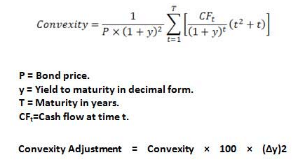

## Table of Contents

## What is convexity in finance?

Convexity in finance is a measure used to understand how the price of a bond or other fixed-income security changes when interest rates change. It helps investors see how sensitive a bond's price is to shifts in interest rates, beyond what the simpler measure of duration can show. Duration gives a good first estimate of how much a bond's price will move with a change in interest rates, but it assumes this change is linear. Convexity adds another layer by accounting for the fact that the relationship between bond prices and interest rates is actually curved, not straight.

Think of convexity like this: if you imagine a graph where the x-axis shows interest rates and the y-axis shows bond prices, the line connecting these points would not be a straight line but a curve. Convexity measures how much this curve bends. A bond with high convexity will have a price that changes more dramatically when interest rates move, which can be good or bad depending on whether rates are going up or down. For investors, understanding convexity helps them better predict how their bond investments will perform in different interest rate environments, allowing them to make more informed decisions.

## Why is convexity important in bond valuation?

Convexity is important in bond valuation because it helps investors understand how bond prices will change when interest rates move. Imagine you have a bond and the interest rates go up or down. The price of your bond will change, but not in a straight line. Convexity tells you how much the price will curve when interest rates change. This is useful because it gives a more accurate picture than just using duration, which assumes a straight line change.

Knowing the convexity of a bond helps investors make better decisions. If a bond has high convexity, its price will be more sensitive to changes in interest rates. This can be good if rates are falling because the bond's price will go up more than expected. But it can also be risky if rates are rising, as the price could drop more sharply. By understanding convexity, investors can pick bonds that fit their expectations about future interest rates and manage their risk more effectively.

## How can convexity be used to assess interest rate risk?

Convexity helps investors understand how much a bond's price will change when interest rates move. It's like a tool that shows how curvy the relationship between bond prices and interest rates is. If a bond has high convexity, its price will change a lot when interest rates go up or down. This means it's more sensitive to [interest rate](/wiki/interest-rate-trading-strategies) changes, which can be good or bad depending on whether rates are going up or down.

By knowing the convexity of a bond, investors can better assess the interest rate risk they are taking on. If someone thinks interest rates will fall, they might choose bonds with high convexity because those bonds' prices will go up more than others. But if they think rates will rise, they might avoid high convexity bonds because those prices could drop more sharply. So, convexity helps investors pick the right bonds based on their expectations about future interest rates and manage their risk better.

## What is the formula for calculating convexity of a bond?

The formula for calculating the convexity of a bond looks a bit complicated, but it helps us understand how the bond's price changes with interest rates. The formula is: Convexity = (1 / P) * (∑ [(t^2 + t) * CFt / (1 + y)^(t+2)]) where P is the current bond price, t is the time period, CFt is the cash flow at time t, and y is the yield to maturity. This formula sums up all the future cash flows of the bond, adjusting them for the time and the yield, and then divides the whole thing by the bond's current price.

Think of convexity like this: it tells you how much the bond's price will curve when interest rates change. If a bond has high convexity, its price will change a lot when interest rates move. This can be good if rates are going down because the bond's price will go up more than expected. But it can also be risky if rates are going up, as the price could drop more sharply. By calculating the convexity, investors can see how sensitive a bond is to interest rate changes and make better decisions about which bonds to buy or sell.

## How do you set up an Excel spreadsheet to calculate bond convexity?

To set up an Excel spreadsheet for calculating bond convexity, start by creating columns for the time periods (t), cash flows (CFt), and yield to maturity (y). In the first column, list the time periods from 1 up to the bond's maturity. In the next column, enter the cash flows for each period. These are the coupon payments and the final principal payment. In another column, input the yield to maturity. You'll also need a cell for the current bond price (P), which you can calculate separately or input directly.

Next, use Excel formulas to calculate the convexity. In a new column, calculate the term (t^2 + t) * CFt / (1 + y)^(t+2) for each period. Then, sum up all these values. To find the convexity, divide this sum by the current bond price (P) and then divide the result by (1 + y)^2. You can use the formula =SUM(range) / P / (1 + y)^2, where "range" is the column with your calculated values. This will give you the bond's convexity, helping you understand how the bond's price will change with interest rates.

## What data inputs are required to calculate convexity in Excel?

To calculate convexity in Excel, you need a few pieces of information about the bond. You need to know the time periods until the bond matures, which means how many periods there are until you get your money back. You also need to know the cash flows for each period, which are the coupon payments you receive and the final amount you get when the bond matures. Finally, you need the yield to maturity, which is the interest rate the bond is expected to earn until it matures, and the current price of the bond.

Once you have these inputs, you can set up your Excel sheet. In one column, list the time periods. In another column, put the cash flows for each period. In another cell, enter the yield to maturity and the current bond price. With these numbers, you can use Excel formulas to calculate the convexity, which tells you how the bond's price will change when interest rates move.

## How do you input bond cash flows into Excel for convexity calculation?

To input bond cash flows into Excel for calculating convexity, start by setting up your spreadsheet. In the first column, list the time periods from 1 up to the bond's maturity. For example, if the bond matures in 5 years with annual payments, you'd list numbers 1 through 5. In the next column, enter the cash flows for each period. These are the coupon payments you receive each year, and at the last period, include the final principal payment as well. If your bond has a face value of $1,000 and pays a 5% annual coupon, you'd enter $50 for years 1 through 4, and $1,050 for year 5, which includes the last coupon payment and the principal.

Once you have the time periods and cash flows entered, you're ready to use these numbers to calculate the bond's convexity. In another column, you'll use a formula to compute the term (t^2 + t) * CFt / (1 + y)^(t+2) for each period, where t is the time period, CFt is the cash flow at time t, and y is the yield to maturity. After calculating this for each period, you sum up all these values and then divide by the current bond price and (1 + y)^2. This gives you the convexity, which helps you understand how sensitive the bond's price is to changes in interest rates.

## Can you explain the step-by-step process of calculating convexity in Excel?

To calculate convexity in Excel, start by setting up your spreadsheet. In the first column, list the time periods from 1 up to the bond's maturity. If your bond matures in 5 years with annual payments, you'd list numbers 1 through 5. In the next column, enter the cash flows for each period. These are the coupon payments you receive each year, and at the last period, include the final principal payment as well. For example, if your bond has a face value of $1,000 and pays a 5% annual coupon, you'd enter $50 for years 1 through 4, and $1,050 for year 5, which includes the last coupon payment and the principal. In another cell, enter the yield to maturity (y) and the current bond price (P).

Next, you'll use Excel formulas to calculate the convexity. In a new column, compute the term (t^2 + t) * CFt / (1 + y)^(t+2) for each period, where t is the time period, CFt is the cash flow at time t, and y is the yield to maturity. To do this, you can use a formula like =(A2^2 + A2) * B2 / (1 + C$1)^(A2 + 2), assuming A2 is the time period, B2 is the cash flow, and C$1 is the yield to maturity. Copy this formula down the column for all periods. After calculating this for each period, sum up all these values using the SUM function. Finally, divide this sum by the current bond price (P) and then by (1 + y)^2. The formula for this would be =SUM(D2:D6) / E$1 / (1 + C$1)^2, where D2:D6 is the range of your calculated values, E$1 is the current bond price, and C$1 is the yield to maturity. This gives you the convexity, which helps you understand how sensitive the bond's price is to changes in interest rates.

## What common errors should be avoided when calculating convexity in Excel?

When calculating convexity in Excel, one common mistake is messing up the order of the cells. It's important to make sure that the time periods, cash flows, yield to maturity, and bond price are all in the right places. If you mix them up, your calculations won't be correct. Another error to watch out for is forgetting to update the formula when you copy it down the column. The formula needs to change for each row to match the right time period and cash flow, so you need to use relative and absolute references correctly.

Also, be careful with the math in the formula. A small mistake, like using the wrong power or forgetting a part of the equation, can lead to big errors in your convexity calculation. Double-check that you're dividing by the bond price and the correct power of (1 + yield to maturity) at the end. By avoiding these common errors, you can make sure your convexity calculation in Excel is accurate and helpful for understanding how your bond's price will change with interest rates.

## How does the duration of a bond relate to its convexity?

Duration and convexity are both measures that help you understand how a bond's price changes when interest rates move. Duration tells you how much the bond's price will change if interest rates go up or down a little bit. It's like a first guess at how sensitive the bond is to interest rate changes. But, duration assumes that the change in bond price is a straight line, which isn't exactly true.

Convexity comes in to fix this by showing how the bond's price actually curves when interest rates change. It's like adding more detail to the picture that duration gives you. If a bond has high convexity, its price will change a lot more than what duration alone would predict. So, while duration gives you a good starting point, convexity helps you see the full story of how the bond's price will really move with interest rates.

## How can convexity calculations in Excel be adjusted for different compounding frequencies?

When you're calculating convexity in Excel, you need to think about how often the bond pays interest, because this can change how you do the math. If your bond pays interest yearly, you can use the formula we talked about before without changing anything. But if the bond pays interest more often, like every six months or every month, you need to adjust your calculations. You do this by changing the time periods (t) and the yield to maturity (y) in the formula to match how often the bond pays interest. For example, if the bond pays semi-annually, you'd double the number of periods and halve the annual yield to get the right numbers.

So, let's say you have a bond that pays interest twice a year. Instead of using 5 years as 5 periods, you'd use 10 periods. And if the yield to maturity is 5% per year, you'd use 2.5% for each six-month period. This way, your convexity calculation in Excel will be correct for the bond's actual payment schedule. By making these adjustments, you can see how the bond's price will change with interest rates, no matter how often it pays interest.

## What advanced techniques can be used to optimize convexity calculations in Excel for large datasets?

When you have a lot of data and need to calculate convexity in Excel, you can use some smart tricks to make it faster and easier. One way is to use array formulas. Instead of writing out the formula for each row and then summing them up, you can use an array formula to do it all at once. This can be a lot quicker, especially with big datasets. Another trick is to use Excel's built-in functions like SUMPRODUCT, which can handle multiple arrays and do the calculations in one go. This means you don't have to write long formulas and it can make your spreadsheet run smoother.

Another advanced technique is to use VBA (Visual Basic for Applications) to automate your calculations. You can write a small program that does the convexity calculations for you, which is great if you need to do this a lot or if you're working with really big datasets. VBA can loop through your data, apply the convexity formula to each set of numbers, and give you the results quickly. Also, if you're working with data that changes a lot, you can use Excel's data tables to see how convexity changes with different inputs like yield to maturity or bond price. This can help you understand how sensitive your results are to different conditions.

## How can you calculate convexity using Excel?

Calculating convexity in Excel involves a structured approach to apply the mathematical formula for convexity, which measures the sensitivity of the duration of a bond to changes in interest rates. Convexity is crucial in understanding how bond prices fluctuate with interest rate movements, making its calculation essential for traders and analysts.

To compute convexity in Excel, follow these steps:

1. **Set Up the Data:**
   - Begin by entering key variables in Excel:
     - `Face Value`: The bond's nominal amount, typically set at 1000 or 100.
     - `Coupon Rate`: The annual coupon payment as a percentage of the face value.
     - `Market Yield`: The bond's yield to maturity, expressed as an annual rate.
     - `Number of Years to Maturity`: The remaining term of the bond until expiration.
     - `Frequency`: The number of coupon payments per year (e.g., 2 for semi-annual).

2. **Intermediate Calculations:**
   - Calculate the present value of each cash flow using the formula:
$$
     PV = \frac{\text{Coupon Payment}}{(1 + \frac{\text{Market Yield}}{\text{Frequency}})^{n}} + \frac{\text{Face Value}}{(1 + \frac{\text{Market Yield}}{\text{Frequency}})^{\text{Number of Years} \times \text{Frequency}}}

$$
   - List each period's cash flow present value in separate Excel cells.

3. **Duration Calculation:**
   - Calculate Macaulay Duration by finding the weighted average time of cash flows. Use the formula:
$$
     \text{Duration} = \frac{\sum_{t=1}^{T} \left(t \times \frac{CF_t}{(1+y)^t}\right)}{\sum_{t=1}^{T} \frac{CF_t}{(1+y)^t}}

$$
   - Here, $CF_t$ represents the cash flow at time $t$.

4. **Convexity Formula:**
   - The convexity formula is:
$$
     \text{Convexity} = \frac{1}{P} \sum_{t=1}^T \frac{CF_t \times t \times (t + 1)}{(1+y)^{t+2}}

$$
   - Where $P$ is the present value of the bond's cash flows, $CF_t$ is the cash flow at time $t$, and $y$ is the yield to maturity.

5. **Populating Excel:**
   - Use Excel formulas to automate calculation:
     - Use the `SUMPRODUCT` function to efficiently handle product sums.
     - Leveraging named ranges for clarity in complex formulas.
   - Example formula for Excel cell:
     ```excel
     =SUMPRODUCT(B2:B10*C2:C10*(C2:C10+1)/(1+D2)^(C2:C10+2))
     ```
   - Replace `B2:B10` with cash flows, `C2:C10` with periods, and `D2` with yield.

6. **Practical Application:**
   - This calculated convexity value helps traders assess interest rate risk, providing insights into bond sensitivity to yield changes.
   - By understanding convexity, analysts predict price shifts for strategic portfolio adjustments.

By setting up these components efficiently in Excel, financial professionals can derive critical insights into bond price [volatility](/wiki/volatility-trading-strategies) and interest rate risk management, enhancing their decision-making processes. Excel's computational capabilities, combined with detailed financial modeling, make it an invaluable tool for conducting such detailed analyses.

## What is the role of mathematics in enhancing trading algorithms?

Algorithmic trading leverages mathematical concepts to develop systematic trading decisions, optimizing through precise calculations and data analysis. Various mathematical foundations underpin this adaptive and predictive capability, including statistical analysis, regression models, and computational methods.

Statistical models are essential in [algorithmic trading](/wiki/algorithmic-trading), enabling traders to quantify and manage risk, assess probability distributions, and optimize trade execution. Statistical [arbitrage](/wiki/arbitrage) strategies, for example, rely heavily on statistical measures like mean, variance, and correlation. These strategies exploit pricing inefficiencies between related financial instruments, grounding decisions in the probability of price reversion to mean values.

Regression models extend these statistical foundations by facilitating predictive analysis and trend evaluation. In trading algorithms, linear regression can model and predict security prices based on historical data. The relationship between an asset's price and other variables, such as market indices or economic indicators, can be explored through multivariate regression. Consider the linear regression formula:

$$
y = \beta_0 + \beta_1x_1 + \beta_2x_2 + \cdots + \beta_nx_n + \varepsilon
$$

where $y$ represents the dependent variable (e.g., asset price), $\beta_0$ is the intercept, $\beta_1, \beta_2, \ldots, \beta_n$ are coefficients, $x_1, x_2, \ldots, x_n$ are independent variables (predictors), and $\varepsilon$ is the error term.

Python, a preferred language for algorithmic trading due to its extensive libraries for mathematical and statistical analysis, supports model implementation and real-time execution. The following Python snippet demonstrates the use of linear regression with the `scikit-learn` library:

```python
import numpy as np
from sklearn.linear_model import LinearRegression

# Example data
X = np.array([[1, 2], [2, 3], [3, 4], [4, 5]])  # Independent variables
y = np.array([1.5, 2.5, 3.5, 4.5])              # Dependent variable

# Create linear regression model
model = LinearRegression().fit(X, y)

# Predict new values
new_data = np.array([[5, 6], [6, 7]])
predictions = model.predict(new_data)

print(predictions)
```

This code initializes a linear regression model, fits it to sample data, and predicts outputs for new data points, showcasing its application in a trading context for forecasting price movements based on historical data inputs.

Incorporating mathematical rigor into trading algorithms augments their predictive strength and accuracy. By systematically applying statistical and regression models, algorithmic strategies capture intricate market dynamics and relationships, enabling traders to make informed, data-driven decisions.

## What are the practical applications and case studies?

Convexity analysis is a powerful tool in financial markets that has demonstrated substantial improvements in portfolio performance through informed risk management and pricing strategies. By focusing on the curvature of the price-interest rate relationship in bonds, convexity analysis offers traders and portfolio managers a more sophisticated understanding of interest rate sensitivities compared to duration alone. This section discusses real-world case studies, the use of geometric models in Excel, and the practical application of convexity and other mathematical models in trading decisions.

### Real-World Case Studies

1. **Bond Portfolio Management**: A case study involving a fixed-income fund manager illustrates the importance of convexity in managing a bond portfolio. The fund manager observed that by prioritizing bonds with higher convexity, the portfolio experienced less price volatility during periods of interest rate fluctuations. This strategy proved especially beneficial during economic downturns, where interest rate changes were unpredictable.

2. **Interest Rate Derivatives Trading**: A trading desk at a major international bank utilized convexity analysis to enhance trading strategies involving interest rate derivatives. By identifying bonds with desirable convexity characteristics, traders were able to construct synthetic instruments that maximized their risk-return profile, ultimately generating higher alpha compared to strategies solely reliant on duration matching.

### Use of Geometric Models in Excel

To visualize and predict market trends, traders and analysts often employ geometric models in Excel to analyze the convexity of fixed-income securities. One common approach involves plotting the price-yield curve and examining how convexity affects the curve's shape. Excel's charting capabilities allow users to plot these curves and superimpose different interest rate scenarios to assess potential impacts on bond pricing.

**Example: Constructing a Price-Yield Profile in Excel**

1. **Input Necessary Data**: Start with variables such as bond price, yield, duration, and convexity. 
2. **Formula Setup**: Utilize the convexity formula:
$$
   \text{Convexity} = \frac{1}{P} \sum_{t=1}^{n} \frac{C_t \times (t^2 + t)}{(1+y)^{t+2}}

$$

   where $C_t$ represents the cash flow at time $t$, $P$ is the price, $y$ is the yield, and $n$ is the number of periods.

3. **Excel Implementation**: Input this formula into Excel and use it to calculate convexity for various bonds. 

4. **Graphical Representation**: Plot the calculated data to create a price-yield curve and observe the impact of different yield changes on bond prices.

### Applying Mathematical Models to Real Market Data

Advanced mathematical models, beyond basic convexity, are often implemented in algorithmic trading to predict market movements and optimize portfolios. For instance, regression models and differential equations can be applied to historical market data, enabling traders to forecast interest rate impacts more accurately.

**Python Example: Implementing Mathematical Models**

```python
import numpy as np
import pandas as pd
from sklearn.linear_model import LinearRegression

# Assume data is loaded into a DataFrame df with 'Yield' and 'Price' columns
df = pd.DataFrame({'Yield': [0.01, 0.02, 0.03, 0.04], 'Price': [100, 98, 95, 92]})

# Calculate convexity using numerical differentiation
def calculate_convexity(prices, yields):
    second_derivative = np.gradient(np.gradient(prices, yields), yields)
    return second_derivative.mean()

convexity = calculate_convexity(df['Price'], df['Yield'])

# Add a regression to predict future bond prices
X = df[['Yield']]
y = df['Price']

model = LinearRegression()
model.fit(X, y)

# Predict future prices based on different yield scenarios
future_yields = np.array([[0.05], [0.06]])
predicted_prices = model.predict(future_yields)

print("Convexity: ", convexity)
print("Predicted Prices: ", predicted_prices)
```

This approach empowers traders to refine their strategies by integrating market dynamics more comprehensively, thus improving the decision-making process in real-time trading environments.

By leveraging the power of convexity calculations, Excel, and algorithmically-assisted mathematical models, financial professionals can enhance their trading strategies, mitigate risks, and ultimately achieve superior portfolio performance.

## References & Further Reading

[1]: ["Fixed Income Analysis"](https://en.wikipedia.org/wiki/Fixed_income_analysis) by Barbara S. Petitt, Jerald E. Pinto, and Wendy L. Pirie

[2]: ["Bond Markets, Analysis, and Strategies"](https://books.google.com/books/about/Bond_Markets_Analysis_and_Strategies_ten.html?id=bQpNEAAAQBAJ) by Frank J. Fabozzi

[3]: ["Financial Analysis with Microsoft Excel"](https://www.amazon.com/Financial-Analysis-Microsoft-Excel-Timothy/dp/0357442059) by Timothy R. Mayes and Todd M. Shank

[4]: ["Python for Finance: Analyze Big Financial Data"](https://books.google.com/books/about/Python_for_Finance.html?id=E93SBQAAQBAJ) by Yves Hilpisch

[5]: ["Excel Modeling in Investments"](https://www.pearson.com/en-us/subject-catalog/p/excel-modeling-in-investments/P200000005923/9780205987245) by Craig W. Holden

[6]: ["Interest Rate Risk Management and Derivatives"](https://www.fdic.gov/capital-markets/interest-rate-risk) by Beata Lubinska and Frank J. Fabozzi

[7]: ["Algorithmic Trading and DMA: An Introduction to Direct Access Trading Strategies"](https://www.semanticscholar.org/paper/Algorithmic-trading-%26-DMA-%3A-an-introduction-to-Johnson/aa5de1ab883d5e23b6651faa7c1807586d688e4b) by Barry Johnson