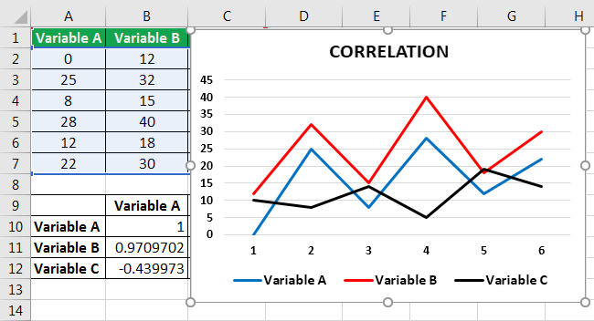

Correlation plays a pivotal role in data analysis by providing insights into how two variables move in relation to one another. This statistical measure, ranging from -1 to 1, enables analysts to determine whether variables have a direct, inverse, or no relationship. Understanding this relationship is essential for making informed decisions across various domains, including finance, biology, and social sciences. In data analysis, correlation can reveal hidden patterns and predict potential outcomes, thereby enhancing the decision-making process.

In financial markets, specifically, the accurate calculation of correlation is critical. It aids traders and investors in understanding the degree to which different assets move in tandem. For instance, a high positive correlation between two stocks suggests that they tend to move in the same direction, while a high negative correlation implies they move in opposite directions. This information is particularly valuable in portfolio management, where diversification is key: by investing in assets that are not closely correlated, an investor can potentially reduce risk and improve the stability of returns.



Algorithmic trading heavily leverages correlation by utilizing this statistical measure to develop complex trading strategies. Algorithms can quickly assess correlations between numerous financial instruments, identify potential arbitrage opportunities, and execute trades with minimal human intervention. The use of correlation in algorithmic trading not only enhances the efficiency of trade execution but also augments the ability to assess and manage risk dynamically.

Excel is a valuable tool in financial analysis for calculating correlation, providing a user-friendly interface for both novice and experienced analysts. With its inbuilt functions and tools such as the CORREL function and the Data Analysis ToolPak, Excel enables users to efficiently compute correlation coefficients. These features allow for seamless integration of correlation analysis into everyday data management tasks, making it accessible to those who might not be familiar with more sophisticated statistical software.

Overall, understanding and utilizing correlation in data analysis and financial markets equips individuals and organizations with the ability to make data-driven decisions, optimize their investment strategies, and maintain a competitive edge. Excel's role in simplifying correlation calculations further democratizes access to these insights, promoting wider usage and understanding of this critical analytical tool.

## Table of Contents

## What is Correlation?

Correlation is a statistical measure that describes the strength and direction of a linear relationship between two variables. It is a crucial concept in data analysis, as it helps quantify how changes in one variable are associated with changes in another. Understanding correlation can guide decision-making processes in various fields, including economics, finance, and the social sciences.

The mathematical representation of correlation is the correlation coefficient. The most commonly used measure is Pearson's correlation coefficient, denoted by $r$, which ranges from -1 to 1. A value of 1 indicates a perfect positive linear relationship, meaning that as one variable increases, the other also increases proportionally. Conversely, a value of -1 signifies a perfect negative linear relationship, where an increase in one variable corresponds to a proportional decrease in the other. A value of 0 indicates no linear relationship between the variables.

Mathematically, Pearson's correlation coefficient is calculated as:

$$
r = \frac{\sum (x_i - \bar{x})(y_i - \bar{y})}{\sqrt{\sum (x_i - \bar{x})^2 \sum (y_i - \bar{y})^2}}
$$

where $x_i$ and $y_i$ are the data points, and $\bar{x}$ and $\bar{y}$ are the mean values of the respective datasets.

Key takeaways from correlation in statistical analysis include:

1. **Direction and Strength**: The sign of the correlation coefficient indicates the direction of the relationship (positive or negative), while the magnitude indicates its strength.

2. **Linearity**: Correlation coefficients assume a linear relationship between variables. Non-linear relationships may not be adequately captured using Pearson's correlation.

3. **Dimensionality**: Correlation is dimensionless, allowing comparison between different datasets without the influence of the units of measurement.

It's important to highlight that correlation does not imply causation; it simply denotes the degree to which two variables tend to move together. Other statistical methods, such as regression analysis, are often required to explore causative relationships.

In practical applications, measuring correlation is vital for various analyses, such as predicting trends, assessing risks, and developing models in economics and scientific research. Leveraging correlation effectively can lead to improved decision-making and strategy formulation.

## Understanding Correlation in Trading

Correlation plays a pivotal role in financial trading, serving as a critical tool for risk management, diversification, and informed decision-making. In financial markets, correlation quantitatively measures how two securities move in relation to each other. This information can guide traders in constructing a portfolio that optimally balances risk and return.

### Importance of Correlation in Financial Trading

In the context of trading, understanding correlation is essential because it informs traders how different securities are likely to behave under similar market conditions. A correlation coefficient, which ranges from -1 to 1, helps traders gauge the degree of association between two assets. A correlation of +1 implies a perfect positive correlation, indicating that the securities move in tandem, while -1 indicates a perfect negative correlation, meaning they move in opposite directions. A correlation of 0 suggests no linear relationship.

### Using Correlation to Manage Risk and Diversify Portfolios

One of the primary uses of correlation in trading is risk management through portfolio diversification. By analyzing the correlation coefficients among various assets, traders can strategically select a mix of securities that minimize unsystematic risk. For example, if a portfolio consists predominantly of stocks with high positive correlations, it's susceptible to significant [volatility](/wiki/volatility-trading-strategies) during economic downturns. Diversifying the portfolio by including assets with low or negative correlations can buffer against these market fluctuations, thereby stabilizing returns. 

The mathematical aspect of diversification can be illustrated by the Portfolio Variance formula:

$$
\sigma^2_p = \sum_{i=1}^{N} w_i^2 \sigma_i^2 + \sum_{i=1}^{N}\sum_{j\neq i}^{N} w_i w_j \sigma_i \sigma_j \rho_{ij}
$$

where:
- $\sigma^2_p$ is the portfolio variance,
- $w_i$ and $w_j$ are asset weights in the portfolio,
- $\sigma_i$ and $\sigma_j$ are the standard deviations of assets $i$ and $j$, 
- $\rho_{ij}$ is the correlation coefficient between assets $i$ and $j$.

By managing correlation among securities, traders can achieve lower portfolio volatility and potentially enhance risk-adjusted returns.

### Correlation as a Tool for Making Informed Trading Decisions

Beyond risk management, correlation is an invaluable tool for making informed trading decisions. Traders often use correlation analysis to identify potential hedges and recognize [arbitrage](/wiki/arbitrage) opportunities. For instance, if two stocks show a strong positive correlation, a trader might infer that significant price divergence between the two is temporary and consider taking positions that profit from a return to the typical correlation pattern.

Moreover, correlation can inform predictive modeling and the development of [quantitative trading](/wiki/quantitative-trading) strategies. By analyzing historical correlations, traders can forecast future price movements, enhancing their ability to execute trades based on data-driven insights rather than intuition.

In conclusion, correlation is an indispensable component of financial trading. It guides traders in minimizing risks while maximizing returns through sophisticated portfolio construction and trading strategies. Understanding and leveraging correlation effectively is fundamental to navigating the complexities of financial markets.

## Calculating Correlation Using Excel

Calculating correlation in Excel is a straightforward process that can be accomplished using built-in functions and tools. This section will guide you through the steps of calculating correlation using the CORREL function, creating a correlation matrix for multiple variables, and utilizing Excel’s Data Analysis ToolPak for more advanced analysis.

### Calculating Correlation Using the CORREL Function

The CORREL function in Excel calculates the Pearson correlation coefficient between two data sets. This coefficient ranges from -1 to 1, indicating the strength and direction of a linear relationship between the variables. A value close to 1 implies a strong positive correlation, while a value near -1 indicates a strong negative correlation. A value around 0 suggests no linear correlation.

**Steps:**
1. **Enter Your Data**: Ensure that your data is organized in two columns. Each column should represent one of the variables for which you want to calculate the correlation.

2. **Select a Cell for the Result**: Click on a blank cell where you want the correlation coefficient to appear.

3. **Use the CORREL Function**: Type the formula `=CORREL(array1, array2)`, where `array1` and `array2` are the ranges of your data.

   Example: `=CORREL(A2:A100, B2:B100)`

4. **Press Enter**: The cell will display the correlation coefficient.

### Creating a Correlation Matrix for Multiple Variables

When analyzing more than two variables, a correlation matrix provides a complete view of how each pair of variables relates.

**Steps:**
1. **Organize Your Data**: Ensure your data is structured in a table format, where each column represents a different variable.

2. **Select a Block of Cells**: Choose a block where the matrix will be displayed. If you have n variables, the matrix will be n x n in size.

3. **Use the Array Formula**: Enter the formula `=MMULT(TRANSPOSE(data_range - AVERAGE(data_range)), (data_range - AVERAGE(data_range))) / (COUNT(data_range) - 1)` followed by `Ctrl + Shift + Enter` to calculate the entire matrix within the selected block.

### Using Excel’s Data Analysis ToolPak

The Data Analysis ToolPak is an Excel add-in that offers advanced data analysis capabilities, including correlation.

**To Install the ToolPak:**
1. Go to the "File" menu and click "Options."
2. Select "Add-Ins," then "Excel Add-ins," and click "Go."
3. In the Add-Ins dialog box, check "Analysis ToolPak" and click "OK."

**To Perform Correlation Analysis:**
1. **Navigate to the Data Tab**: Click on "Data" in the ribbon, then select "Data Analysis" in the Analysis group.

2. **Select Correlation**: In the Data Analysis dialog box, choose "Correlation" and click "OK."

3. **Specify Input Range**: Enter the data range for your variables. Ensure that you select the option for grouped data by columns if necessary.

4. **Choose Output Location**: Decide where you want the correlation matrix to appear (new worksheet, new workbook, or in the current worksheet) and click "OK."

The tool will then generate a correlation matrix, displaying the correlation coefficients for each pair of variables. This provides a comprehensive overview of the relationships at a glance, facilitating deeper data analysis and decision-making processes.

## Implementing Correlation in Algo Trading

Algorithmic trading strategies leverage correlation to make informed decisions about asset selection and trade timing. Correlation measures the relationship between the price movements of two or more assets, which can be critical for constructing diversified portfolios, managing risks, and identifying trading opportunities.

### Utilization of Correlation in Trading Strategies

In [algorithmic trading](/wiki/algorithmic-trading), correlation coefficients help in selecting pairs of stocks or other financial instruments that move in tandem or exhibit inverse relationships. Algorithms exploit these relationships to execute trades based on expected price patterns. For instance, a [pair trading](/wiki/pair-trading) strategy might involve going long on one stock and short on another highly correlated stock, anticipating convergence or divergence.

The Pearson correlation coefficient is often utilized to quantify the linear relationship between two variables. It is calculated as follows:

$$

r = \frac{{\sum_{i=1}^{n} (X_i - \bar{X})(Y_i - \bar{Y})}}{{\sqrt{\sum_{i=1}^{n} (X_i - \bar{X})^2 \sum_{i=1}^{n} (Y_i - \bar{Y})^2}}}
$$

Where $X$ and $Y$ are the data sets, and $\bar{X}$ and $\bar{Y}$ are their means.

### Benefits of Automated Correlation Analysis

Automated correlation analysis allows traders to process vast amounts of data efficiently, identify patterns or relationships, and adapt trading strategies promptly. Furthermore, automation reduces human error, enhances speed, and ensures consistency in trading executions. For example, high-frequency trading firms use algorithms that incorporate correlation analysis to execute thousands of trades within seconds, capitalizing on minuscule price differences.

Python libraries such as Pandas and NumPy offer functionalities that facilitate easy computation of correlation matrices, which are essential in multi-asset strategies. Here is a simple Python snippet to calculate a correlation matrix using Pandas:

```python
import pandas as pd

# Sample data frame
data = {
    'Asset1': [1.2, 2.3, 3.3, 4.4],
    'Asset2': [2.1, 3.2, 4.1, 5.2],
    'Asset3': [3.2, 4.1, 5.0, 6.3]
}

df = pd.DataFrame(data)

# Calculate correlation matrix
correlation_matrix = df.corr()
print(correlation_matrix)
```

### Case Studies of Correlation in Algorithm Development

Several case studies highlight the effective use of correlation in algorithmic trading. For instance, during periods of market volatility, algorithms have used inverse correlations between asset classes, such as stocks and bonds, to hedge portfolios and reduce risk. Another case involves commodities trading, where correlations between different energy sources, like [crude oil](/wiki/crude-oil) and natural gas, are analyzed to create arbitrage strategies.

Hedge funds often deploy [statistical arbitrage](/wiki/statistical-arbitrage) models that depend on correlation analysis to identify discrepancies in pricing and exploit mean reversion strategies. This approach assumes that correlated instruments will revert to their historical average connection, providing opportunities for profit.

Correlation analysis is a cornerstone of many algorithmic trading strategies, offering insights into asset relationships, enhancing risk management, and elucidating profitable trading opportunities. Traders can harness the power of correlation to develop robust algorithms that adapt to market changes, leveraging tools like Excel and programming languages to fine-tune their strategies.

## Common Mistakes in Correlation Analysis

Misinterpreting correlation as causation is a prevalent error in data analysis. Correlation merely indicates a statistical relationship between two variables, showing whether they move in concert but not why they do. A high correlation does not imply that changes in one variable cause changes in another. For instance, while ice cream sales and drowning incidents might both increase during summer months, purchasing ice cream does not cause drowning incidents; both variables are influenced by a third [factor](/wiki/factor-investing)—summer heat. Researchers must look for additional data and apply more rigorous statistical techniques, such as controlled experiments or regression models, to establish causation.

Neglecting to normalize data before computing correlation is another frequent mistake. Raw data can contain variations in scale or measurement units that may skew correlation results. Normalization adjusts data to a common scale without distorting differences in the ranges of values, thereby producing more accurate correlation coefficients. One common method of normalization is standardizing data to have a mean of zero and a standard deviation of one. The formula for standardizing a data point $x_i$ in a dataset is:

$$
z_i = \frac{x_i - \bar{x}}{\sigma}
$$

where $\bar{x}$ is the mean, and $\sigma$ is the standard deviation of the dataset. Failing to normalize data can lead to incorrect assumptions about the strength or direction of a relationship.

Ignoring non-linear relationships is another critical oversight. Correlation measures the strength of a linear relationship between two variables. A correlation coefficient close to zero might mislead one to conclude no relationship exists, even if there is a strong non-linear relationship. For instance, quadratic or exponential relationships may be present which correlation does not capture. Visualization techniques, such as scatter plots, should be used to detect non-linear patterns. More sophisticated statistical methods, such as polynomial regression or [machine learning](/wiki/machine-learning) algorithms, might be required to model these relationships accurately.

Understanding these common pitfalls in correlation analysis can prevent misleading interpretations and aid in making more informed decisions in any field requiring data analysis.

## Advanced Techniques in Excel for Correlation

Excel provides powerful tools to enhance correlation analysis, enabling users to visualize, calculate, and refine their understanding of relationships between data sets. This section explores advanced techniques in Excel for conducting and visualizing correlation analyses effectively.

**Using Excel Charts to Visualize Correlation**

Visualizing correlation using Excel charts helps in understanding the relationship between variables at a glance. The most common chart for this purpose is the scatter plot, which displays data points on a two-dimensional graph, representing the two variables. Excel allows users to add a trendline to the scatter plot, providing a visual approximation of the correlation. The trendline can be linear or non-linear, depending on the data trend. To insert a scatter plot:

1. Select the data ranges for the two variables you wish to compare.
2. Go to the 'Insert' tab and select 'Scatter' from the Chart options.
3. Add a trendline by right-clicking on any data point in the plot, selecting 'Add Trendline', and choosing the suitable type.

**Advanced Formulas for Dynamic Correlation Analysis**

Dynamic correlation analysis involves using formulas that adjust the correlation calculation as data updates. Excel’s CORREL function calculates the Pearson correlation coefficient between two data sets. To accommodate dynamic data ranges, you can use formulas in conjunction with Excel's Table feature or dynamic array functions like FILTER and SORT. For instance:

```excel
=CORREL(FILTER(A:A,ConditionRange="Condition"), FILTER(B:B,ConditionRange="Condition"))
```

This formula calculates the correlation between two columns, A and B, based on a specific condition applied through the `FILTER` function.

**Additional Excel Plugins and Tools to Enhance Correlation Calculation**

Excel's functionality can be extended with additional plugins and tools that offer more advanced correlation measures and insights. One such tool is the Data Analysis ToolPak, which includes functionalities for creating correlation matrices, conducting complex statistical tests, and more. To activate the ToolPak:

1. Go to 'File' > 'Options' > 'Add-Ins'.
2. In the Manage box, select 'Excel Add-ins' and click 'Go'.
3. Check the 'Analysis ToolPak' box and click 'OK'.

Once activated, you can access the ToolPak under the 'Data' tab, using 'Data Analysis' for a comprehensive set of statistical tools, including correlation.

Third-party add-ins are also available for enhanced analysis capabilities, offering advanced statistical functions, visualization options, and integration with other data analysis software like R or Python. These tools can be particularly useful when dealing with large data sets or requiring more sophisticated analytical techniques.

In conclusion, utilizing these advanced techniques in Excel not only facilitates a deeper understanding of data correlations but also empowers users to make more informed decisions based on their analyses. By leveraging Excel's built-in functionalities and external plugins, users can uncover detailed insights and enhance their data-driven strategies.

## Conclusion

Correlation serves as a fundamental concept in data analysis, offering invaluable insights into the relationships between variables. In financial trading, understanding these relationships can significantly impact portfolio management and risk assessment. By implementing correlation analysis, traders can identify diversification opportunities and mitigate risks by avoiding overly correlated assets.

Excel is a versatile tool that facilitates effective correlation calculations, making it accessible for both novice and experienced traders. With its built-in functions such as CORREL and the Data Analysis ToolPak, Excel offers robust capabilities for conducting thorough correlation studies. These tools empower traders to perform detailed analyses efficiently, leading to more informed decision-making.

For traders looking to enhance their strategies, integrating correlation analysis using Excel can be a transformative step. By mastering these methods, traders can unlock deeper insights into market dynamics, ultimately improving the robustness and performance of their trading strategies. Encouraging traders to leverage these techniques not only enhances their analytical skill set but also positions them to navigate financial markets with greater precision and confidence.

## Resources

For those interested in expanding their knowledge on Excel and correlation analysis, several comprehensive resources are available:

1. **Microsoft Excel Official Documentation**: The official documentation by Microsoft provides detailed instructions and tutorial videos on using Excel's built-in functions, including the CORREL function, pivot tables, and the Data Analysis ToolPak. You can access these resources directly on the [Microsoft Excel Support Page](https://support.microsoft.com/en-us/excel).

2. **Khan Academy**: Khan Academy offers free courses on statistics and probability, covering the fundamentals of correlation and its applications in data analysis. These courses are ideal for beginners looking to build a solid foundation in statistical concepts. Visit [Khan Academy's Statistics and Probability section](https://www.khanacademy.org/math/statistics-probability).

3. **Coursera and edX Courses**: Platforms like Coursera and edX host numerous courses on algorithmic trading and financial markets. Institutions such as the University of Michigan and the University of Washington offer specialized courses focusing on quantitative trading strategies, often including lessons on correlation. Search for relevant courses on [Coursera](https://www.coursera.org) or [edX](https://www.edx.org).

4. **Books on Financial Markets**: Some highly recommended books include "Algorithmic Trading: Winning Strategies and Their Rationale" by Ernie Chan, which covers the practical aspects of developing algorithmic trading systems, including correlation analysis as a strategy component.

5. **Expert Forums and Communities**: Websites like [Quantitative Finance Stack Exchange](https://quant.stackexchange.com) and [Reddit's Quant Finance Community](https://www.reddit.com/r/quantfinance/) provide platforms for discussing correlation analysis and data science techniques in trading. Engaging with these communities can help you gain insights and practical advice from experienced traders and data analysts.

6. **Webinars and Workshops**: Many financial institutions and software companies host webinars and workshops focusing on Excel analytics and algorithmic trading. Keeping an eye on announcements from relevant organizations can provide opportunities for hands-on learning.

7. **Contact for Expert Consultation**: For personalized guidance, consulting with financial data analysts or joining workshops conducted by market experts can be beneficial. Look for consultancy services specializing in quantitative analysis and financial modeling.

These resources offer various pathways to deepen understanding and competency in using Excel for correlation analysis and its application in trading strategies.

## References & Further Reading

[1]: ["Algorithmic Trading: Winning Strategies and Their Rationale"](https://www.wiley.com/en-us/Algorithmic+Trading%3A+Winning+Strategies+and+Their+Rationale-p-9781118460146) by Ernie Chan

[2]: ["Pearson's Correlation Coefficient"](https://www.scribbr.com/statistics/pearson-correlation-coefficient/) - Statistics How To

[3]: ["Microsoft Excel Official Documentation"](https://support.microsoft.com/en-us/excel) - Microsoft Support

[4]: ["An Introduction to Statistical Learning: with Applications in R"](https://link.springer.com/book/10.1007/978-1-0716-1418-1) by Gareth James, Daniela Witten, Trevor Hastie, and Robert Tibshirani

[5]: ["Using Excel for Statistical Analysis"](https://www.exceldemy.com/how-to-statistically-analyze-data-in-excel/) - Excel Tip

[6]: ["Quantitative Financial Analytics: The Path to Investment Profits"](https://www.amazon.com/Quantitative-Financial-Analytics-Investment-Profits/dp/9813224258) by Edward E. Qian, Ronald Hua, Eric H. Sorensen

[7]: ["How to Create a Correlation Matrix in Excel"](https://www.statology.org/correlation-matrix-excel/) - Got It AI

[8]: ["Structural Change and Correlation in Financial Markets"](https://arxiv.org/pdf/2202.10623.pdf) - Journal of Financial Econometrics

