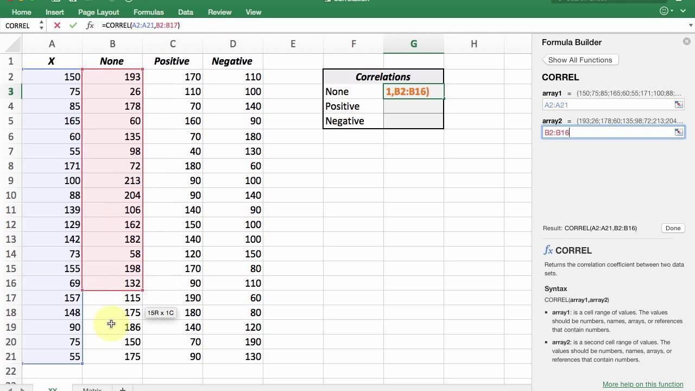

## Table of Contents

## What is correlation and why is it important?

Correlation is a way to understand how two things change together. It measures if one thing goes up or down when another thing does the same. For example, if you look at the temperature and the number of ice creams sold, you might find that when the temperature goes up, so do ice cream sales. This relationship between temperature and ice cream sales is a correlation.

Understanding correlation is important because it helps us make predictions and decisions. If we know that two things are correlated, we can guess what might happen to one thing if we know what's happening to the other. For instance, if a store knows that ice cream sales go up when it's hot, they can order more ice cream on hot days. But it's also important to remember that correlation doesn't mean one thing causes the other. Just because two things change together doesn't mean one makes the other happen.

## How do you access the correlation function in Excel?

To use the correlation function in Excel, you need to use the formula called "CORREL". This function helps you find out how two sets of numbers move together. To start, click on a cell where you want the answer to show up. Then, type "=CORREL(" into that cell. After that, you need to pick the first set of numbers by clicking and dragging over them, then type a comma, and then pick the second set of numbers the same way. Finish by closing the bracket and hitting enter. Excel will then show you a number between -1 and 1, which tells you how the two sets of numbers are related.

The number you get from the CORREL function tells you about the strength and direction of the relationship between the two sets of numbers. If the number is close to 1, it means the two sets of numbers go up and down together a lot. If it's close to -1, it means when one set goes up, the other goes down. A number close to 0 means there's not much of a relationship. This can be really helpful for understanding things like how sales of one product might be related to another, or how temperature might affect ice cream sales.

## What is the difference between positive and negative correlation?

Positive correlation means that when one thing goes up, the other thing goes up too. It's like when the temperature gets higher, more people might buy ice cream. The numbers move together in the same direction. If you draw a line through the points on a graph, it would go up from left to right. The closer the correlation number is to 1, the stronger the positive relationship is.

Negative correlation is the opposite. It means that when one thing goes up, the other thing goes down. For example, if it's colder outside, fewer people might buy ice cream. The numbers move in opposite directions. On a graph, the line through the points would go down from left to right. The closer the correlation number is to -1, the stronger the negative relationship is.

## How do you input data to calculate correlation in Excel?

To calculate correlation in Excel, first, you need to put your data into the spreadsheet. Choose two columns where you want your data to go. In one column, list all the numbers for the first thing you're looking at, like the temperature. In the next column, list all the numbers for the second thing, like the number of ice creams sold. Make sure each row matches up, so the temperature on the first row goes with the ice cream sales on the first row, and so on.

Once your data is in the spreadsheet, you can use the CORREL function to find out how these two sets of numbers are related. Click on an empty cell where you want the correlation number to show up. Type "=CORREL(" into that cell. Then, click and drag to select all the numbers in the first column, type a comma, and then click and drag to select all the numbers in the second column. Close the bracket and press enter. Excel will then give you a number that shows if there's a positive, negative, or no correlation between your two sets of data.

## What is the CORREL function and how do you use it?

The CORREL function in Excel is a tool that helps you find out how two sets of numbers are related to each other. It gives you a number between -1 and 1. If the number is close to 1, it means the two sets of numbers move together in the same way. If it's close to -1, it means when one set goes up, the other goes down. And if it's close to 0, it means there's not much of a relationship between them.

To use the CORREL function, you first need to put your numbers into two columns in Excel. For example, you might put temperature in one column and ice cream sales in another. Then, click on an empty cell where you want the answer to show up. Type "=CORREL(" into that cell. Next, click and drag to select all the numbers in the first column, then type a comma, and click and drag to select all the numbers in the second column. Close the bracket and press enter. Excel will then show you a number that tells you how the two sets of numbers are related.

## Can you explain the formula behind the correlation calculation in Excel?

The formula behind the correlation calculation in Excel is based on something called the Pearson correlation coefficient. This formula looks at how two sets of numbers change together. It takes the average of how much each number in one set is different from its own average, and how much each number in the other set is different from its own average. Then, it multiplies these differences together for each pair of numbers and adds them all up. After that, it divides this total by the product of the square roots of the sum of the squared differences from the average for each set of numbers. This gives you a number between -1 and 1 that tells you how the two sets of numbers are related.

In simpler terms, the formula tries to see if when one number goes up or down, the other number does the same or the opposite. If the numbers tend to go up and down together, the correlation will be close to 1. If they tend to go in opposite directions, the correlation will be close to -1. If there's no clear pattern, the correlation will be close to 0. This helps you understand if there's a strong, weak, or no relationship between the two sets of numbers.

## How do you interpret the correlation coefficient results in Excel?

The correlation coefficient in Excel is a number between -1 and 1 that tells you how two sets of numbers are related. If the number is close to 1, it means the two sets of numbers tend to go up and down together. For example, if you see a correlation of 0.8 between temperature and ice cream sales, it means that when the temperature goes up, ice cream sales usually go up too. If the number is close to -1, it means that when one set of numbers goes up, the other goes down. So, if you see a correlation of -0.7 between temperature and hot chocolate sales, it means that when the temperature goes up, hot chocolate sales usually go down.

If the correlation coefficient is close to 0, it means there's not much of a relationship between the two sets of numbers. For example, a correlation of 0.1 between the number of people wearing hats and the price of bananas would suggest that these two things don't really affect each other much. It's important to remember that correlation doesn't mean one thing causes the other. Just because two things change together doesn't mean one makes the other happen. So, while correlation can help you see patterns and make predictions, it's just one part of understanding how things are related.

## What are common mistakes to avoid when calculating correlation in Excel?

When using Excel to calculate correlation, one common mistake is selecting the wrong range of cells. If you accidentally include headers or extra rows in your selection, the correlation results will be incorrect. Always make sure you're only selecting the numbers you want to compare, without any extra data. Another mistake is mixing up the order of the data sets in the CORREL function. The order doesn't affect the correlation number, but it's important to keep track of which set of numbers is which so you can interpret the results correctly.

Another common error is misunderstanding what the correlation number means. Remember, a correlation close to 1 means the numbers move together, close to -1 means they move in opposite directions, and close to 0 means there's no clear relationship. It's also important not to confuse correlation with causation. Just because two things are correlated doesn't mean one causes the other. For example, ice cream sales might be correlated with the number of people wearing shorts, but wearing shorts doesn't cause people to buy ice cream. Always think carefully about what the correlation number tells you and what it doesn't.

## How can you visualize correlation using Excel charts?

To visualize correlation in Excel, you can use a scatter plot. First, put your two sets of numbers into two columns. Then, go to the 'Insert' tab and click on 'Scatter' to choose the type of scatter plot you want. Excel will make a chart where each pair of numbers is shown as a dot on the graph. If the dots seem to go from the bottom left to the top right, it means the two sets of numbers have a positive correlation. If the dots go from the top left to the bottom right, it shows a negative correlation. If the dots are all over the place, it means there's not much of a relationship between the two sets of numbers.

Adding a trendline to your scatter plot can make it easier to see the correlation. Right-click on any of the dots in your scatter plot, choose 'Add Trendline', and then pick 'Linear'. Excel will draw a straight line that goes through the middle of your dots. If the line goes up from left to right, it shows a positive correlation. If it goes down, it shows a negative correlation. The steeper the line, the stronger the correlation. You can also ask Excel to show you the R-squared value, which tells you how well the line fits the data. A number closer to 1 means the line fits the data well, showing a strong correlation.

## How do you calculate correlation for multiple variables in Excel?

To calculate correlation for multiple variables in Excel, you first need to put all your data into the spreadsheet. Each column should have numbers for one variable, like temperature, ice cream sales, and maybe even the number of people at the beach. Once your data is set up, you can use the CORREL function to find out how each pair of variables is related. For example, you can find the correlation between temperature and ice cream sales, and then between temperature and the number of people at the beach. To do this, click on an empty cell and type "=CORREL(" followed by the range of cells for the first variable, a comma, and then the range of cells for the second variable. Close the bracket and press enter. Do this for each pair of variables you want to compare.

If you want to see all these correlations at once, you can use the Data Analysis Toolpak in Excel. First, make sure the Toolpak is installed by going to 'File', then 'Options', then 'Add-Ins', and selecting 'Analysis ToolPak'. Once it's set up, go to the 'Data' tab and click on 'Data Analysis'. Choose 'Correlation' from the list, and then select the range of cells that includes all your variables. Click 'OK', and Excel will make a table showing the correlation between every pair of variables. This way, you can quickly see how all your variables are related to each other without having to use the CORREL function for each pair separately.

## What are the limitations of using Excel for correlation analysis?

Using Excel for correlation analysis has some limits. One big limit is that Excel can only handle a certain amount of data at once. If you have a lot of numbers, Excel might get slow or even crash. Also, Excel's correlation function only works for two sets of numbers at a time. If you want to see how more than two things are related, you need to use the Data Analysis Toolpak, which can be a bit tricky to set up and use.

Another problem is that Excel might not catch all the details you need for a deep look at correlation. For example, it doesn't tell you if the relationship between two sets of numbers is really important or just a coincidence. You might need other tools or more advanced stats to figure that out. Plus, Excel doesn't do well with missing data or numbers that are way different from the others, which can mess up your correlation results if you're not careful.

## How can you automate correlation calculations in Excel using macros?

To automate correlation calculations in Excel using macros, you first need to open the Visual Basic for Applications (VBA) editor. You can do this by pressing Alt + F11 on your keyboard. Once you're in the VBA editor, you can create a new module by clicking 'Insert' and then 'Module'. In this module, you'll write a macro that uses the CORREL function to calculate the correlation between two sets of numbers. For example, you can write a simple macro that takes the ranges of two columns as input and puts the correlation result in another cell. This way, you don't have to type the CORREL function every time you want to find out how two sets of numbers are related.

After you've written your macro, you can run it by going back to Excel and pressing Alt + F8, choosing your macro from the list, and clicking 'Run'. If you want to calculate correlations for multiple pairs of variables, you can make your macro loop through different columns and calculate the correlation for each pair, putting the results in a table. This can save you a lot of time if you're working with a lot of data. Just remember to save your workbook as a macro-enabled file (.xlsm) so your macros will work when you open the file later.

## What is Correlation?

Correlation is a statistical measure that describes the strength and direction of a linear relationship between two variables. It is a crucial concept in data analysis, as it helps quantify how changes in one variable are associated with changes in another. Understanding correlation can guide decision-making processes in various fields, including economics, finance, and the social sciences.

The mathematical representation of correlation is the correlation coefficient. The most commonly used measure is Pearson's correlation coefficient, denoted by $r$, which ranges from -1 to 1. A value of 1 indicates a perfect positive linear relationship, meaning that as one variable increases, the other also increases proportionally. Conversely, a value of -1 signifies a perfect negative linear relationship, where an increase in one variable corresponds to a proportional decrease in the other. A value of 0 indicates no linear relationship between the variables.

Mathematically, Pearson's correlation coefficient is calculated as:

$$
r = \frac{\sum (x_i - \bar{x})(y_i - \bar{y})}{\sqrt{\sum (x_i - \bar{x})^2 \sum (y_i - \bar{y})^2}}
$$

where $x_i$ and $y_i$ are the data points, and $\bar{x}$ and $\bar{y}$ are the mean values of the respective datasets.

Key takeaways from correlation in statistical analysis include:

1. **Direction and Strength**: The sign of the correlation coefficient indicates the direction of the relationship (positive or negative), while the magnitude indicates its strength.

2. **Linearity**: Correlation coefficients assume a linear relationship between variables. Non-linear relationships may not be adequately captured using Pearson's correlation.

3. **Dimensionality**: Correlation is dimensionless, allowing comparison between different datasets without the influence of the units of measurement.

It's important to highlight that correlation does not imply causation; it simply denotes the degree to which two variables tend to move together. Other statistical methods, such as regression analysis, are often required to explore causative relationships.

In practical applications, measuring correlation is vital for various analyses, such as predicting trends, assessing risks, and developing models in economics and scientific research. Leveraging correlation effectively can lead to improved decision-making and strategy formulation.

## What is the understanding of correlation in trading?

Correlation plays a pivotal role in financial trading, serving as a critical tool for risk management, diversification, and informed decision-making. In financial markets, correlation quantitatively measures how two securities move in relation to each other. This information can guide traders in constructing a portfolio that optimally balances risk and return.

### Importance of Correlation in Financial Trading

In the context of trading, understanding correlation is essential because it informs traders how different securities are likely to behave under similar market conditions. A correlation coefficient, which ranges from -1 to 1, helps traders gauge the degree of association between two assets. A correlation of +1 implies a perfect positive correlation, indicating that the securities move in tandem, while -1 indicates a perfect negative correlation, meaning they move in opposite directions. A correlation of 0 suggests no linear relationship.

### Using Correlation to Manage Risk and Diversify Portfolios

One of the primary uses of correlation in trading is risk management through portfolio diversification. By analyzing the correlation coefficients among various assets, traders can strategically select a mix of securities that minimize unsystematic risk. For example, if a portfolio consists predominantly of stocks with high positive correlations, it's susceptible to significant [volatility](/wiki/volatility-trading-strategies) during economic downturns. Diversifying the portfolio by including assets with low or negative correlations can buffer against these market fluctuations, thereby stabilizing returns. 

The mathematical aspect of diversification can be illustrated by the Portfolio Variance formula:

$$
\sigma^2_p = \sum_{i=1}^{N} w_i^2 \sigma_i^2 + \sum_{i=1}^{N}\sum_{j\neq i}^{N} w_i w_j \sigma_i \sigma_j \rho_{ij}
$$

where:
- $\sigma^2_p$ is the portfolio variance,
- $w_i$ and $w_j$ are asset weights in the portfolio,
- $\sigma_i$ and $\sigma_j$ are the standard deviations of assets $i$ and $j$, 
- $\rho_{ij}$ is the correlation coefficient between assets $i$ and $j$.

By managing correlation among securities, traders can achieve lower portfolio volatility and potentially enhance risk-adjusted returns.

### Correlation as a Tool for Making Informed Trading Decisions

Beyond risk management, correlation is an invaluable tool for making informed trading decisions. Traders often use correlation analysis to identify potential hedges and recognize [arbitrage](/wiki/arbitrage) opportunities. For instance, if two stocks show a strong positive correlation, a trader might infer that significant price divergence between the two is temporary and consider taking positions that profit from a return to the typical correlation pattern.

Moreover, correlation can inform predictive modeling and the development of [quantitative trading](/wiki/quantitative-trading) strategies. By analyzing historical correlations, traders can forecast future price movements, enhancing their ability to execute trades based on data-driven insights rather than intuition.

In conclusion, correlation is an indispensable component of financial trading. It guides traders in minimizing risks while maximizing returns through sophisticated portfolio construction and trading strategies. Understanding and leveraging correlation effectively is fundamental to navigating the complexities of financial markets.

## How can correlation be implemented in algorithmic trading?

Algorithmic trading strategies leverage correlation to make informed decisions about asset selection and trade timing. Correlation measures the relationship between the price movements of two or more assets, which can be critical for constructing diversified portfolios, managing risks, and identifying trading opportunities.

### Utilization of Correlation in Trading Strategies

In [algorithmic trading](/wiki/algorithmic-trading), correlation coefficients help in selecting pairs of stocks or other financial instruments that move in tandem or exhibit inverse relationships. Algorithms exploit these relationships to execute trades based on expected price patterns. For instance, a [pair trading](/wiki/pair-trading) strategy might involve going long on one stock and short on another highly correlated stock, anticipating convergence or divergence.

The Pearson correlation coefficient is often utilized to quantify the linear relationship between two variables. It is calculated as follows:

$$

r = \frac{{\sum_{i=1}^{n} (X_i - \bar{X})(Y_i - \bar{Y})}}{{\sqrt{\sum_{i=1}^{n} (X_i - \bar{X})^2 \sum_{i=1}^{n} (Y_i - \bar{Y})^2}}}
$$

Where $X$ and $Y$ are the data sets, and $\bar{X}$ and $\bar{Y}$ are their means.

### Benefits of Automated Correlation Analysis

Automated correlation analysis allows traders to process vast amounts of data efficiently, identify patterns or relationships, and adapt trading strategies promptly. Furthermore, automation reduces human error, enhances speed, and ensures consistency in trading executions. For example, high-frequency trading firms use algorithms that incorporate correlation analysis to execute thousands of trades within seconds, capitalizing on minuscule price differences.

Python libraries such as Pandas and NumPy offer functionalities that facilitate easy computation of correlation matrices, which are essential in multi-asset strategies. Here is a simple Python snippet to calculate a correlation matrix using Pandas:

```python
import pandas as pd

# Sample data frame
data = {
    'Asset1': [1.2, 2.3, 3.3, 4.4],
    'Asset2': [2.1, 3.2, 4.1, 5.2],
    'Asset3': [3.2, 4.1, 5.0, 6.3]
}

df = pd.DataFrame(data)

# Calculate correlation matrix
correlation_matrix = df.corr()
print(correlation_matrix)
```

### Case Studies of Correlation in Algorithm Development

Several case studies highlight the effective use of correlation in algorithmic trading. For instance, during periods of market volatility, algorithms have used inverse correlations between asset classes, such as stocks and bonds, to hedge portfolios and reduce risk. Another case involves commodities trading, where correlations between different energy sources, like [crude oil](/wiki/crude-oil) and natural gas, are analyzed to create arbitrage strategies.

Hedge funds often deploy [statistical arbitrage](/wiki/statistical-arbitrage) models that depend on correlation analysis to identify discrepancies in pricing and exploit mean reversion strategies. This approach assumes that correlated instruments will revert to their historical average connection, providing opportunities for profit.

Correlation analysis is a cornerstone of many algorithmic trading strategies, offering insights into asset relationships, enhancing risk management, and elucidating profitable trading opportunities. Traders can harness the power of correlation to develop robust algorithms that adapt to market changes, leveraging tools like Excel and programming languages to fine-tune their strategies.

## What are the common mistakes in correlation analysis?

Misinterpreting correlation as causation is a prevalent error in data analysis. Correlation merely indicates a statistical relationship between two variables, showing whether they move in concert but not why they do. A high correlation does not imply that changes in one variable cause changes in another. For instance, while ice cream sales and drowning incidents might both increase during summer months, purchasing ice cream does not cause drowning incidents; both variables are influenced by a third [factor](/wiki/factor-investing)—summer heat. Researchers must look for additional data and apply more rigorous statistical techniques, such as controlled experiments or regression models, to establish causation.

Neglecting to normalize data before computing correlation is another frequent mistake. Raw data can contain variations in scale or measurement units that may skew correlation results. Normalization adjusts data to a common scale without distorting differences in the ranges of values, thereby producing more accurate correlation coefficients. One common method of normalization is standardizing data to have a mean of zero and a standard deviation of one. The formula for standardizing a data point $x_i$ in a dataset is:

$$
z_i = \frac{x_i - \bar{x}}{\sigma}
$$

where $\bar{x}$ is the mean, and $\sigma$ is the standard deviation of the dataset. Failing to normalize data can lead to incorrect assumptions about the strength or direction of a relationship.

Ignoring non-linear relationships is another critical oversight. Correlation measures the strength of a linear relationship between two variables. A correlation coefficient close to zero might mislead one to conclude no relationship exists, even if there is a strong non-linear relationship. For instance, quadratic or exponential relationships may be present which correlation does not capture. Visualization techniques, such as scatter plots, should be used to detect non-linear patterns. More sophisticated statistical methods, such as polynomial regression or [machine learning](/wiki/machine-learning) algorithms, might be required to model these relationships accurately.

Understanding these common pitfalls in correlation analysis can prevent misleading interpretations and aid in making more informed decisions in any field requiring data analysis.

## References & Further Reading

[1]: ["Algorithmic Trading: Winning Strategies and Their Rationale"](https://www.wiley.com/en-us/Algorithmic+Trading%3A+Winning+Strategies+and+Their+Rationale-p-9781118460146) by Ernie Chan

[2]: ["Pearson's Correlation Coefficient"](https://www.scribbr.com/statistics/pearson-correlation-coefficient/) - Statistics How To

[3]: ["Microsoft Excel Official Documentation"](https://support.microsoft.com/en-us/excel) - Microsoft Support

[4]: ["An Introduction to Statistical Learning: with Applications in R"](https://link.springer.com/book/10.1007/978-1-0716-1418-1) by Gareth James, Daniela Witten, Trevor Hastie, and Robert Tibshirani

[5]: ["Using Excel for Statistical Analysis"](https://www.exceldemy.com/how-to-statistically-analyze-data-in-excel/) - Excel Tip

[6]: ["Quantitative Financial Analytics: The Path to Investment Profits"](https://www.amazon.com/Quantitative-Financial-Analytics-Investment-Profits/dp/9813224258) by Edward E. Qian, Ronald Hua, Eric H. Sorensen

[7]: ["How to Create a Correlation Matrix in Excel"](https://www.statology.org/correlation-matrix-excel/) - Got It AI

[8]: ["Structural Change and Correlation in Financial Markets"](https://arxiv.org/pdf/2202.10623.pdf) - Journal of Financial Econometrics

