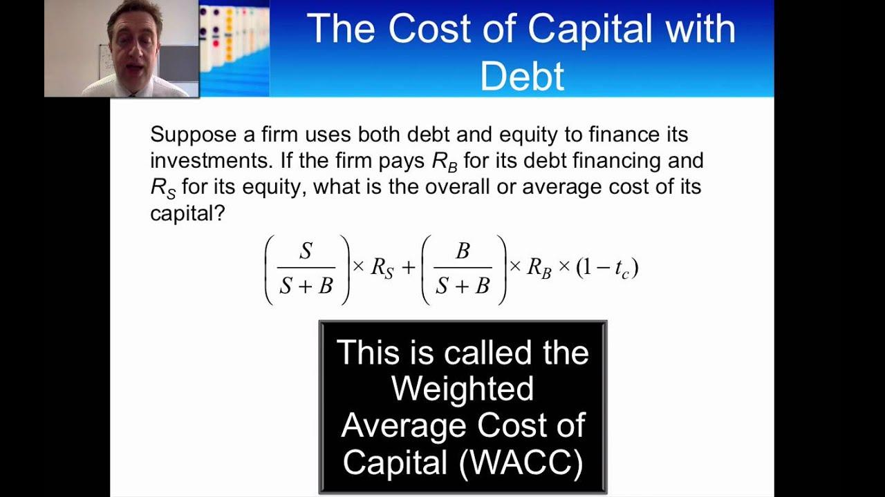

## Table of Contents

## What is the cost of capital and why is it important for project budgeting?

The cost of capital is the rate of return that a company must earn on its investments to maintain its market value and attract new funding. It is essentially the cost of obtaining money from different sources, such as loans, bonds, or equity. Companies calculate it by looking at the costs of all these different types of financing, then figuring out a weighted average based on how much they use each type.

Understanding the cost of capital is crucial for project budgeting because it helps companies decide which projects are worth pursuing. If a project's expected return is higher than the cost of capital, it means the project should add value to the company. This helps managers choose projects that will increase profits and shareholder value, rather than wasting resources on projects that won't cover their costs. By comparing the cost of capital to potential project returns, companies can make smarter investment decisions and better plan their budgets.

## How do you differentiate between the cost of debt and the cost of equity?

The cost of debt is the interest rate a company pays on its loans and bonds. It's easier to figure out because it's based on a set interest rate. If a company borrows money at a 5% interest rate, then the cost of debt is 5%. But, because interest payments can be deducted from taxes, the actual cost to the company is a bit less than the interest rate. This makes debt a cheaper way to get money compared to other options.

The cost of equity is trickier to calculate. It's the return that shareholders expect for investing in the company. Since shareholders don't get a fixed [interest rate](/wiki/interest-rate-trading-strategies) like with debt, companies use models like the Capital Asset Pricing Model (CAPM) to estimate this cost. The CAPM looks at the risk-free rate (like government bonds), the stock market's overall return, and how risky the company's stock is compared to the market. This gives a percentage that shows what return shareholders expect, which is usually higher than the cost of debt because it's riskier for investors.

Both costs are important for figuring out a company's total cost of capital. The cost of debt is more straightforward and usually lower, while the cost of equity is harder to pin down and generally higher due to the risk involved. By understanding both, a company can make better decisions about how to finance its projects and grow its business.

## What is the formula for calculating the weighted average cost of capital (WACC)?

The weighted average cost of capital (WACC) is a way to find out the average cost of all the money a company uses to run its business. To calculate it, you need to know how much of the company's money comes from debt and how much comes from equity. You also need to know the cost of that debt and the cost of that equity. The formula for WACC is: WACC = (E/V) * Re + (D/V) * Rd * (1 - Tc). Here, E is the market value of the equity, D is the market value of the debt, V is the total value of the company (E + D), Re is the cost of equity, Rd is the cost of debt, and Tc is the corporate tax rate.

Let's break down the formula in simple terms. The first part, (E/V) * Re, is the cost of equity weighted by how much of the company's total value comes from equity. The second part, (D/V) * Rd * (1 - Tc), is the cost of debt weighted by how much of the company's total value comes from debt, and then adjusted for the tax savings from interest payments. By adding these two parts together, you get the WACC, which tells you the average rate the company needs to earn on its investments to satisfy both its debt holders and its shareholders.

## How can you estimate the cost of debt for a project?

To estimate the cost of debt for a project, you need to look at the interest rate the company would pay if it borrowed money for that project. This could be from loans or bonds. If the company has existing debt, you can use the interest rate on that debt as a starting point. For example, if the company has a loan with a 5% interest rate, you might use 5% as the cost of debt. But remember, because interest payments can be deducted from taxes, the real cost to the company is a bit lower. You can figure out the after-tax cost of debt by multiplying the interest rate by one minus the tax rate. If the tax rate is 30%, then the after-tax cost of debt would be 5% times (1 - 0.30), which equals 3.5%.

If the company doesn't have existing debt, or if you want to estimate the cost of debt for a new project, you might need to look at similar companies or use market data. For example, you can check the interest rates that similar companies are paying on their loans or bonds. You could also look at what banks are charging for loans to companies in the same industry. Once you have a good idea of what the interest rate might be, you can again adjust it for taxes to get the after-tax cost of debt. This gives you a more accurate estimate of how much it really costs the company to borrow money for the project.

## What methods are used to estimate the cost of equity, and how do they differ?

One common method to estimate the cost of equity is the Capital Asset Pricing Model (CAPM). CAPM looks at three things: the risk-free rate, the expected market return, and how risky the company's stock is compared to the market. The risk-free rate could be the interest rate on government bonds. The expected market return is what investors expect to earn from the stock market as a whole. The company's stock risk, or beta, shows how much the stock's price moves with the market. By putting these together, CAPM gives you a number that shows what return shareholders expect, which is the cost of equity. This method is popular because it's simple and based on widely available data, but it assumes the market is efficient and that all investors have the same information, which isn't always true.

Another method is the Dividend Discount Model (DDM). This model works by figuring out what future dividends a company might pay and then figuring out what those dividends are worth today. If a company pays steady dividends, you can use the current dividend and the expected growth rate of those dividends to find the cost of equity. The formula is: Cost of Equity = (Next Year's Dividend / Current Stock Price) + Dividend Growth Rate. This method is good for companies that pay regular dividends, but it doesn't work well for companies that don't pay dividends or have unpredictable dividend policies.

A third method is the Arbitrage Pricing Theory (APT). APT is more complex and looks at several factors that might affect a stock's return, like inflation, interest rates, or even industry-specific risks. Unlike CAPM, which focuses on market risk, APT considers multiple risks and how they might impact the stock's return. This makes it more flexible but also more complicated to use. APT can give a more detailed picture of the cost of equity, but it requires more data and assumptions about how different factors affect stock prices.

## How does the capital asset pricing model (CAPM) help in determining the cost of equity?

The Capital Asset Pricing Model (CAPM) helps in determining the cost of equity by figuring out what return investors expect from a company's stock. It does this by looking at three main things: the risk-free rate, the expected return of the market, and how risky the company's stock is compared to the market. The risk-free rate is usually the interest rate on government bonds, which is seen as safe because the government is unlikely to default. The expected return of the market is what investors think they will earn from the whole stock market. The riskiness of the company's stock is measured by something called beta, which shows how much the stock's price moves with the market. If a stock's beta is 1, it moves exactly with the market. If it's more than 1, it's riskier than the market, and if it's less than 1, it's less risky.

Using these three pieces of information, the CAPM formula calculates the cost of equity. The formula is: Cost of Equity = Risk-Free Rate + Beta * (Market Return - Risk-Free Rate). This means you start with the risk-free rate and then add extra return based on how risky the stock is. The extra return is the difference between the market return and the risk-free rate, multiplied by the stock's beta. So, if the risk-free rate is 2%, the market return is 8%, and the stock's beta is 1.5, the cost of equity would be 2% + 1.5 * (8% - 2%) = 11%. This tells the company that to satisfy its shareholders, it needs to earn at least an 11% return on its investments. While CAPM is simple and widely used, it assumes that all investors have the same information and that markets are efficient, which might not always be true.

## What role does the company's tax rate play in calculating the cost of capital?

The company's tax rate plays an important role in calculating the cost of capital, especially when it comes to the cost of debt. When a company borrows money, it has to pay interest on that debt. But, the good thing is that the company can deduct these interest payments from its taxes. This means the real cost of the debt to the company is less than the interest rate it pays. To find the after-tax cost of debt, you take the interest rate and multiply it by one minus the tax rate. If a company's interest rate is 5% and its tax rate is 30%, the after-tax cost of debt would be 5% times (1 - 0.30), which is 3.5%. This lower cost makes debt a cheaper way to get money compared to other options.

The tax rate affects the overall cost of capital because it changes the cost of debt, which is one part of the weighted average cost of capital (WACC). The WACC is the average rate a company needs to earn on its investments to satisfy its investors. It's calculated by mixing the costs of debt and equity, based on how much of each the company uses. Since the tax rate lowers the cost of debt, it can bring down the WACC. A lower WACC means the company can take on projects with lower returns and still add value to the business. So, understanding the tax rate is key to figuring out the true cost of capital and making smart investment decisions.

## How do you adjust the cost of capital for risk specific to a particular project?

When figuring out the cost of capital for a specific project, you need to think about the risks that are special to that project. These risks might not affect the whole company but can make a big difference for the project itself. To adjust the cost of capital for these risks, you can add a risk premium to the company's overall cost of capital. This risk premium is an extra percentage that shows how much riskier the project is compared to the company's usual business. For example, if the company's cost of capital is 10% and the project is much riskier, you might add a 2% risk premium, making the project's cost of capital 12%.

To find out what the risk premium should be, you can look at similar projects or industries that have faced similar risks. You might also talk to experts or use financial models to estimate how much the specific risks could impact the project's returns. By adding this risk premium, you make sure the project's cost of capital reflects its unique risks. This helps the company decide if the project's expected returns are high enough to cover the higher cost of capital and still add value to the business.

## What are the common pitfalls in calculating the cost of capital and how can they be avoided?

One common pitfall in calculating the cost of capital is using outdated or incorrect data. For example, if you use an old interest rate for the cost of debt or an old stock price for calculating the cost of equity, your numbers won't be right. This can lead to wrong decisions about which projects to invest in. To avoid this, always use the most recent and accurate data available. Check the interest rates on current loans or bonds, and use the latest stock prices and market returns when calculating the cost of equity.

Another pitfall is not considering the company's specific situation or the risks of a particular project. Every company and project is different, and using a generic cost of capital might not reflect these differences. For example, if a project is riskier than the company's usual business, you need to add a risk premium to the cost of capital. Ignoring this can make the project seem more profitable than it really is. To avoid this, carefully assess the risks of each project and adjust the cost of capital accordingly. Talk to experts and use financial models to estimate how much extra risk a project might have, and then add that to the company's overall cost of capital.

## How does the choice of financing affect the cost of capital in project budgeting?

The choice of financing can really change the cost of capital for a project. If a company decides to use more debt, like loans or bonds, the cost of capital might go down. This is because debt is usually cheaper than equity. When a company borrows money, it pays interest on the debt, and that interest can be taken off the company's taxes. So, the real cost of the debt is less than the interest rate. But, if a company uses more equity, like selling stocks, the cost of capital might go up. This is because shareholders expect a higher return than lenders, so the cost of equity is higher. By choosing the right mix of debt and equity, a company can find the best cost of capital for its projects.

Using more debt can lower the cost of capital, but it also makes the company riskier. If the company can't pay back the debt, it might have big problems. So, it's important to balance the benefits of cheaper debt with the risks it brings. If a company uses too much debt, it might scare away investors and make it harder to get more money in the future. On the other hand, using more equity can make the company safer but also more expensive. By thinking carefully about how to finance a project, a company can make sure it's using the best mix of debt and equity to keep the cost of capital low and the project profitable.

## Can you explain how international factors might influence the cost of capital for multinational projects?

When a company works on projects in different countries, international factors can change the cost of capital. One big [factor](/wiki/factor-investing) is the exchange rate between different countries' money. If a company borrows money in one country but earns money in another, changes in the exchange rate can make the debt more or less expensive. For example, if the company borrows in dollars but earns in euros, and the euro gets weaker, it will need more euros to pay back the dollar debt. This makes the cost of capital higher. Also, different countries have different interest rates. If a company can borrow money cheaper in one country, it might choose to do that, which can lower the cost of capital for the project.

Another factor is the political and economic situation in the countries where the project is happening. If a country is unstable, investors might see it as riskier and want a higher return for their money. This means the cost of equity could go up for projects in that country. Also, some countries have different tax rules, which can affect the cost of debt. If a country has a higher tax rate, the tax savings from interest payments might be bigger, making the cost of debt lower. By thinking about these international factors, a company can better plan the cost of capital for its multinational projects and make smarter investment choices.

## How do you incorporate changes in market conditions into the cost of capital calculations for ongoing projects?

When market conditions change, it's important to update the cost of capital for ongoing projects. This means looking at new interest rates, stock market returns, and other financial data that might have changed. For example, if interest rates go up, the cost of debt will be higher because the company will have to pay more to borrow money. If the stock market is doing better, the expected return on the market might go up, which can increase the cost of equity. By keeping an eye on these changes and using the latest numbers, a company can make sure its cost of capital reflects what's happening in the market right now.

Also, changes in the economy or industry can affect how risky a project is seen to be. If the economy is doing well, investors might feel safer and not ask for as high a return, which can lower the cost of capital. But if there's a lot of uncertainty or if the industry is struggling, investors might want a higher return to take on the extra risk, making the cost of capital go up. By regularly checking these market conditions and adjusting the cost of capital, a company can make better decisions about whether to keep going with a project or maybe change how it's financed to keep costs down.

## What is the cost of capital and how can it be understood?

The cost of capital is a pivotal metric in corporate finance, serving as a benchmark to evaluate the returns required to satisfy investment requirements and finance projects. In essence, it represents the opportunity cost of deploying capital in a specific investment, compared to other available options. A thorough understanding of the cost of capital enables firms to make informed decisions about which projects to undertake, ensuring that they meet or exceed the minimum return threshold necessary for viability.

The cost of capital includes both the costs of equity and debt financing, which are integrated into the weighted average cost of capital (WACC). The WACC is calculated using the formula:

$$

WACC = \left( \frac{E}{V} \times Re \right) + \left( \frac{D}{V} \times Rd \times (1 - T) \right) 
$$

where:
- $E$ is the market value of the equity,
- $V$ is the total market value of equity and debt,
- $Re$ is the cost of equity,
- $D$ is the market value of the debt,
- $Rd$ is the cost of debt, and
- $T$ is the corporate tax rate.

Calculating the WACC involves careful consideration of several factors including prevailing market conditions, corporate tax obligations, and the firm's specific capital structure. The cost of equity, for instance, commonly reflects the expected rate of return demanded by shareholders and can be estimated using models like the Capital Asset Pricing Model (CAPM). This model describes the relationship between expected return and risk, expressed as:

$$

Re = Rf + \beta \times (Rm - Rf) 
$$

where:
- $Rf$ is the risk-free rate,
- $\beta$ is the beta coefficient representing the stock's volatility relative to the market,
- $Rm$ is the expected market return.

Understanding WACC is crucial for both corporate managers and investors. For managers, it serves as a hurdle rate—projects with potential returns above this rate are considered viable while those below are not. For investors, WACC is a yardstick to evaluate the inherent risk and likely returns of a firm's projects, affecting decisions about stock purchases or sales.

By integrating cost of capital insights, firms can optimize their financial strategies, ensuring sustainable growth and competitive positioning in the market. The alignment of WACC knowledge with strategic investment decisions not only helps in managing financial resources but also enhances value creation for both the company and its shareholders.

## What is Project Budgeting and Financial Analysis?

Effective project budgeting is fundamental for assessing the potential value and risks associated with investments. Two essential metrics used in this process are net present value (NPV) and internal rate of return (IRR). NPV is calculated by discounting the future cash flows of a project to their present value using a specific discount rate, often the project's cost of capital. The formula for NPV is:

$$
\text{NPV} = \sum_{t=0}^{N} \frac{C_t}{(1 + r)^t}
$$

where $C_t$ is the net cash flow at time $t$, $r$ is the discount rate, and $N$ is the total number of periods.

The IRR is the discount rate that makes the NPV of all cash flows from a particular project equal to zero. It represents the break-even cost of capital, where the project neither gains nor loses value. The decision rule for IRR is straightforward: if the IRR is higher than the cost of capital, the project is deemed profitable.

Accurate cost estimates are crucial as they directly influence financial outcomes. Underestimating costs can lead to budget overruns and erode profitability, while overestimating can result in missed opportunities. Thus, refining cost estimation techniques is imperative for realizing true project value.

Strategic financial analysis extends beyond calculating NPV and IRR; it requires aligning resources with projects that promise returns above the minimum cost-of-capital threshold. This proactive approach ensures capital is optimally utilized, prioritizing projects that enhance organizational value.

Managing financial risks is integral to project budgeting. Identifying and mitigating risks can prevent cost escalations and project delays. Employing risk assessment tools and sensitivity analysis helps pinpoint potential issues and reduce uncertainties.

In addition, identifying potential cost reductions is a key component. It involves scrutinizing all facets of the project to find efficiency gains, from supply chain optimizations to resource allocation adjustments. A focus on lean operations and continuous improvement can yield substantial savings, which bolster the project's financial viability.

In summary, project budgeting and financial analysis are interlinked practices that, when executed diligently, drive better financial performance. Accurate cost estimation, thorough strategic analysis, risk management, and cost optimization are vital, ensuring that investments align with an organization's profitability goals and risk appetite.

## What are the strategies for cost management and optimization?

Maintaining a balance between capital expenditures (CapEx), operational expenditures (OpEx), and resulting profitability is crucial to financial health. Effective cost management strategies begin with accurately forecasting expenses and ensuring alignment with corporate goals. This approach allows organizations to anticipate financial needs, constraints, and opportunities, ultimately aiding in optimizing financial performance.

Advancement in technology plays a significant role in cost management. Employing advanced cost analysis tools enables firms to identify efficient resource allocation and pinpoint potential cost savings. These tools facilitate the analysis of both historical and real-time data, providing insights that can inform strategic decisions. For instance, AI-driven analytics can automate expense tracking and highlight anomalies or inefficiencies, offering a proactive approach to cost management.

Understanding the difference between fixed, variable, and semi-variable costs is essential for sustainable budget planning. Fixed costs remain constant regardless of production [volume](/wiki/volume-trading-strategy), such as rent and salaries, while variable costs fluctuate with production levels, like raw materials. Semi-variable costs have both fixed and variable components, such as utilities. Identifying these cost categories allows firms to tailor their budgeting strategies and flexibility in adapting to market changes.

Regular evaluation of financial metrics like net present value (NPV) and internal rate of return (IRR) is critical. These metrics assess the profitability of investments by forecasting future cash flows and comparing them against the cost of capital. An investment's NPV is the sum of its discounted cash flows, calculated using the formula:

$$
\text{NPV} = \sum \frac{C_t}{(1 + r)^t} - C_0
$$

where $C_t$ represents cash inflow during the period $t$, $r$ is the discount rate, and $C_0$ is the initial investment. A positive NPV indicates that the projected earnings exceed the anticipated costs, suggesting a worthwhile investment.

IRR, on the other hand, is the discount rate that results in an NPV of zero:

$$
0 = \sum \frac{C_t}{(1 + \text{IRR})^t} - C_0
$$

Identifying investments with IRRs above the cost of capital ensures the alignment of projects with long-term strategic goals and profitability enhancement.

Overall, effective cost management and optimization strategies demand a comprehensive understanding of cost structures, the judicious use of technology for analysis, and the continuous assessment of investments through robust financial metrics. These practices ensure that companies maintain financial health and adapt to evolving market and economic conditions.

## References & Further Reading

1. **Brealey, R. A., Myers, S. C., & Allen, F. (2017). _Principles of Corporate Finance._**  
   This comprehensive resource provides an in-depth overview of corporate finance principles, focusing on the cost of capital and financial strategy. It thoroughly explains how financial managers use metrics like WACC, NPV, and IRR to make informed investment decisions.

2. **Damodaran, A. (2012). _Investment Valuation: Tools and Techniques for Determining the Value of Any Asset._**  
   Damodaran's work offers a detailed analysis of valuation methodologies, critical for assessing project worth and investment potential. It also examines cost of capital concepts and their application in financial analysis.

3. **Hull, J. C. (2018). _Options, Futures, and Other Derivatives._**  
   A key resource for understanding derivatives markets, Hull's book discusses [algorithmic trading](/wiki/algorithmic-trading) and financial derivatives strategies. It also covers capital cost considerations within trading algorithms.

4. **Sharpe, W. F., Alexander, G. J., & Bailey, J. V. (2010). _Investments._**  
   This classic text examines portfolio management and investment strategy, highlighting the importance of understanding cost of capital for financial analysis and project budgeting.

5. **Fabozzi, F. J., & Drake, P. P. (2009). _The Basics of Finance: An Introduction to Financial Markets, Business Finance, and Portfolio Management._**  
   This work provides foundational insights into financial markets and corporate finance, including critical concepts related to cost management, budgeting, and the application of financial analysis techniques.

6. **Luenberger, D. G. (1997). _Investment Science._**  
   This text offers a rigorous approach to financial analysis, focusing on quantitative methods necessary for project valuation and capex decision-making. It includes mathematical frameworks relevant for algorithmic trading.

7. **Pandey, I. M. (2005). _Financial Management._**  
   Pandey’s book dives into financial management practices, encompassing project budgeting and analysis, as well as strategies for optimizing operational and capital expenditures.

8. **Patterson, S. (2011). _The Quants: How a New Breed of Math Whizzes Conquered Wall Street and Nearly Destroyed It._**  
   This narrative provides perspectives on the rise of algorithmic trading and the quantitative approaches to financial strategy, emphasizing the importance of integrating advanced analytics with financial planning.

These resources collectively enhance understanding of the interconnected aspects of financial strategy explored in the article, supporting enhanced financial literacy and strategic decision-making.

