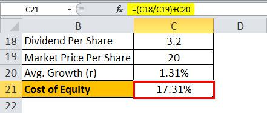

The cost of equity represents a critical component in both financial analysis and algorithmic trading, serving as a cornerstone for valuing a company and an essential metric for investors evaluating potential returns. Fundamentally, the cost of equity is the return a company requires to decide if an investment meets capital return requirements. From an investor's perspective, it is the compensation sought for the risks associated with investing in the company's equity.

In the domain of financial analysis, the cost of equity is pivotal for assessing firm performance and for comparative valuation. For companies, establishing a clear understanding of the cost of equity aids in determining appropriate project funding strategies. The cost of equity becomes crucial in deciding between financing methods; juxtaposed against debt financing, equity typically demands no repayment but entails a higher cost due to its risk reliance, which companies need to compensate investors adequately.



Methodologies for calculating the cost of equity can vary but often employ the Capital Asset Pricing Model (CAPM), which equates the cost of equity to the sum of the risk-free rate and a risk premium, represented as $E(R_i) = R_f + \beta_i (E(R_m) - R_f)$. Here, $E(R_i)$ denotes the expected return on equity, $R_f$ the risk-free rate, $\beta_i$ the stock's beta, and $E(R_m)$ the expected market return. Using Microsoft Excel, this calculation can be streamlined, enabling rapid adjustments and real-time data incorporation, beneficial for algorithmic trading strategies aiming to optimize asset allocation based on cost of equity insights.

Incorporating Excel into financial analysis enhances decision-making processes by allowing analysts and traders to conduct complex calculations with ease and efficiency. Its capabilities facilitate precise data management, enabling the integration of financial models directly into trading platforms, thus ensuring coherent and informed strategy development. This methodological integration provides traders a quantitative edge through metrics like the cost of equity, crucial for refining trading strategies and maximizing portfolio returns.

Understanding and accurately calculating the cost of equity is instrumental for companies and investors striving to optimize trading outcomes. By integrating financial analysis with technological tools such as Excel, decision-making processes become data-driven, and trading strategies are refined, aligning with risk and return expectations.

## Table of Contents

## Understanding the Cost of Equity

The cost of equity is a fundamental financial concept representing the return that investors expect to receive for their investment in a company's equity. This return compensates investors for the risk they assume by investing in the company's stock rather than choosing risk-free securities. 

For companies, the cost of equity is crucial as it influences their financial structure and capital allocation decisions. When making investment decisions, a company aims to generate returns that exceed its cost of equity to create shareholder value. Analyzing the cost of equity also offers a valuable perspective on a company's performance. If a company consistently achieves returns above its cost of equity, it indicates efficient use of capital and strong management performance, positively affecting its stock valuation.

Equity and debt are two primary ways companies raise capital. While equity financing involves raising money through issuing shares, debt involves borrowing funds to be paid back with interest. Equity financing has the advantage of not requiring periodic interest payments and offers more financial flexibility. However, issuing new equity can dilute existing shareholders' ownership and may be seen as a signal of overvaluation by the market. On the other hand, debt is considered less expensive due to the tax deductibility of interest, which can reduce a company's overall tax liability. However, high levels of debt increase financial risk, potentially leading to financial distress if the company faces cash flow issues.

Tax implications play a significant role in influencing the cost considerations of equity financing. While interest payments on debt are tax-deductible, dividends paid to equity shareholders are not, which means the after-tax cost of equity can be higher than the cost of debt. This difference highlights the importance for companies to carefully evaluate their financing structures to optimize their capital costs.

Understanding the cost of equity is also vital in making pricing decisions and conducting risk assessments. In pricing decisions, a company's cost of equity serves as a hurdle rate for evaluating potential projects or investments. Projects need to offer returns exceeding the cost of equity to be considered viable. In risk assessments, the cost of equity reflects the perceived risk associated with a company's equity, influencing how investors value the company and assess its investment opportunities.

Overall, the cost of equity is a crucial component in determining the attractiveness of investments and guiding companies in making informed financial and strategic decisions. Mastery of cost of equity calculations is essential for optimizing financial strategies and enhancing investment performance.

## Calculating Cost of Equity with Excel

The cost of equity is a critical financial metric used to determine the return that investors expect from investing in a company's equity. A widely-used model for calculating the cost of equity is the Capital Asset Pricing Model (CAPM). CAPM describes the relationship between systematic risk and expected return and serves as a cornerstone in financial analysis. The model is expressed by the equation:

$$
\text{Cost of Equity} = R_f + \beta \times (R_m - R_f)
$$

Where:
- $R_f$ is the risk-free rate, typically the yield on government treasury bonds.
- $\beta$ is the beta coefficient, representing the stock's volatility relative to the market.
- $R_m$ is the expected return of the market.

### Setting Up an Excel Spreadsheet for CAPM

To compute the cost of equity using Excel, follow these steps:

1. **Initialize the Spreadsheet**:
   - Open Excel and create a new worksheet.
   - Label columns for each component of the CAPM equation: Risk-Free Rate, Beta, Market Return, and Cost of Equity.

2. **Input Data**:
   - In the cells under the "Risk-Free Rate" column, enter the current yield of a risk-free government bond.
   - Input the stock's beta value in the "Beta" column. This can be obtained from financial data services.
   - Enter the expected market return under the "Market Return" column. Historical market index averages like the S&P 500 can be used as a reference.

3. **Apply the CAPM Formula**:
   - In the "Cost of Equity" column, input the formula to calculate the cost of equity using CAPM.
   - The Excel formula would be: `=Risk-Free Rate + Beta * (Market Return - Risk-Free Rate)`.
   - For example, if the Risk-Free Rate is in cell A2, Beta in B2, and Market Return in C2, the formula in D2 would be `=A2 + B2 * (C2 - A2)`.

### Example Calculation

Assume the following data:

- Risk-Free Rate ($R_f$): 3% (0.03 in decimal)
- Beta ($\beta$): 1.2
- Market Return ($R_m$): 8% (0.08 in decimal)

The cost of equity would be computed as:

$$
\text{Cost of Equity} = 0.03 + 1.2 \times (0.08 - 0.03) = 0.03 + 1.2 \times 0.05 = 0.09
$$

Thus, the cost of equity is 9%.

### Troubleshooting Common Issues

- **Data Entry Errors**: Ensure that all data inputs are correct and in decimal form. Misplaced decimal points can lead to significantly incorrect results.

- **Formula Mistakes**: Double-check cell references in the formula. Excel's autofill feature can sometimes misapply references when copying the formula to adjacent cells.

- **Handling Excel Errors**: Errors such as `#VALUE!`, `#DIV/0!`, or `#NAME?` may occur. Use Excel's error-checking tool to identify issues. Typically, these errors arise from incorrect formula structure or referencing empty cells.

By utilizing these steps and understanding the components of CAPM, one can effectively calculate the cost of equity in Excel. This enhances financial decision-making, particularly in [algorithmic trading](/wiki/algorithmic-trading) where precision and accuracy of financial metrics are paramount.

## Algorithmic Trading and the Cost of Equity

Algorithmic trading has transformed the landscape of financial markets by employing sophisticated algorithms to automate trading decisions. A crucial component in these algorithms is the cost of equity, which serves as a pivotal financial metric. The integration of cost of equity analysis within algorithmic trading strategies facilitates a more informed evaluation of potential investments. By considering the required rate of return anticipated by equity investors, trading systems can better assess investment viability.

Algorithmic models take advantage of financial metrics like the cost of equity to systematically evaluate companies. One common approach is the use of the Capital Asset Pricing Model (CAPM), which determines the expected return of an asset based on its risk relative to the market. The formula for CAPM is:

$$
\text{Expected Return} = R_f + \beta \times (R_m - R_f)
$$

Where $R_f$ is the risk-free rate, $\beta$ is the beta of the security, and $(R_m - R_f)$ is the market risk premium. By calculating the expected return, algorithms can filter investments that meet or exceed the anticipated cost of equity, effectively narrowing down options to those with optimal risk-return profiles.

In terms of decision-making and risk management, the cost of equity plays a significant role. Algorithms utilize this metric to compare against actual or projected returns of assets. If the expected return does not surpass the cost of equity, the asset may be deemed unsuitable, thereby aiding in risk mitigation. Conversely, assets with returns exceeding the cost of equity are flagged for potential inclusion in portfolio strategies.

Here is an example of a Python code snippet that evaluates investments based on cost of equity criteria:

```python
def filter_investments(investments, risk_free_rate, market_return):
    filtered_investments = []
    for investment in investments:
        expected_return = risk_free_rate + investment['beta'] * (market_return - risk_free_rate)
        if expected_return >= investment['cost_of_equity']:
            filtered_investments.append(investment)
    return filtered_investments

# Example usage:
investments = [
    {'name': 'Company A', 'beta': 1.2, 'cost_of_equity': 0.08},
    {'name': 'Company B', 'beta': 0.9, 'cost_of_equity': 0.07}
]

filtered = filter_investments(investments, risk_free_rate=0.03, market_return=0.10)
print(filtered)
```

Algorithmic trading systems enhance return potential by incorporating assessments of cost of equity, which allow for optimized portfolio construction. By dynamically analyzing the returns relative to the equity cost, these systems can adapt to changes in market conditions, thereby maintaining a competitive edge. Adjustments are made to portfolios in real time, ensuring that returns are maximized while risks are kept within desired thresholds. Consequently, understanding and integrating cost of equity assessments in algorithmic models not only optimizes trading strategies but also yields greater financial insights and performance.

## Advanced ROE Analysis Techniques

Return on Equity (ROE) is a significant metric in financial analysis, providing insights into a company's ability to generate profits from its shareholders' equity. Advanced ROE analysis techniques enhance understanding and allow for better strategic decisions in investment. 

One widely adopted model for dissecting ROE is the DuPont Analysis, which breaks ROE into three components: net profit margin, asset turnover, and financial leverage. By doing so, it helps to identify the factors driving the ROE and provides a more comprehensive view of a company's financial performance. The DuPont formula for ROE is:

$$

ROE = \text{Net Profit Margin} \times \text{Asset Turnover} \times \text{Equity Multiplier}
$$

where:
- Net Profit Margin = Net Income / Revenue
- Asset Turnover = Revenue / Total Assets
- Equity Multiplier = Total Assets / Shareholders' Equity

Financial leverage is a crucial [factor](/wiki/factor-investing) influencing ROE. It refers to the use of debt to acquire additional assets. Higher financial leverage can enhance ROE, provided the cost of debt is less than the return on assets. However, excessive leverage increases financial risk. Operational efficiency, reflected in the efficient use of assets to generate revenue, also significantly impacts ROE. Companies with high operational efficiency can convert their assets into revenue more effectively, boosting ROE.

Regression analysis and [machine learning](/wiki/machine-learning) offer powerful tools for predicting and enhancing ROE analysis. By employing statistical techniques, analysts can identify trends and correlations within financial data that might not be evident through traditional analysis. Machine learning models, such as decision trees and neural networks, can predict future ROE based on historical data and other financial indicators, providing a data-driven basis for investment decisions.

Excel is a versatile tool for conducting advanced ROE calculations. It can be used to implement complex formulas and functions, facilitating detailed financial analysis. For instance, analysts can use Excel's regression functions to analyze relationships between ROE and other variables. Advanced functions such as `XLOOKUP`, `FILTER`, and `ARRAYFORMULA` enable efficient data manipulation and analysis, enhancing the accuracy of financial forecasts and insights.

Incorporating these advanced techniques enables analysts to gain deeper insights into ROE, assisting in making informed investment decisions and optimizing financial strategies. Understanding the components and determinants of ROE not only aids in assessing company performance but also in forecasting future profitability.

## Conclusion

The cost of equity stands as a fundamental element in financial analysis and algorithmic trading, serving as a critical measure of the returns required by investors. This metric not only influences a company's funding decisions but also informs investors about the potential risks and returns associated with equity investments. In algorithmic trading, integrating the cost of equity into trading models can enhance decision-making by aligning potential investment opportunities with the strategic goals of maximizing returns while managing risks. 

Microsoft Excel emerges as a powerful tool in calculating and evaluating the cost of equity. Its capabilities, through features like the Capital Asset Pricing Model (CAPM) and detailed spreadsheet functionalities, provide a robust platform for executing financial calculations efficiently. Excel's accessibility and versatility make it an essential application for both seasoned analysts and newcomers in strategic financial decision-making.

In a world of volatile and complex financial markets, continuous learning and integration of financial metrics like the cost of equity are imperative. This ongoing process supports the development of refined trading strategies that respond adeptly to shifting market conditions. Understanding and accurately calculating the cost of equity empowers investors and companies to optimize their financial strategies, ensuring informed decisions that are fundamental to sustained growth and profitability.

Mastering the procedures for calculating the cost of equity provides a competitive advantage, allowing stakeholders to better evaluate investments and pricing decisions. As financial markets continue to evolve, the role of the cost of equity remains pivotal, reinforcing its status as a cornerstone concept in effective financial analysis and strategic planning.

## References & Further Reading

[1]: ["Corporate Finance"](https://www.investopedia.com/terms/c/corporatefinance.asp) by Stephen A. Ross, Randolph W. Westerfield, and Jeffrey Jaffe

[2]: Bodie, Z., Kane, A., & Marcus, A. J. (2014). [“Investments and Portfolio Management.”](https://books.google.com/books/about/EBOOK_Investments_Global_edition.html?id=BMsvEAAAQBAJ) McGraw-Hill Education.

[3]: ["Valuation: Measuring and Managing the Value of Companies"](https://www.amazon.com/Valuation-Measuring-Managing-Companies-Finance/dp/1119610885) by McKinsey & Company Inc., Tim Koller, Marc Goedhart, and David Wessels

[4]: ["The Intelligent Investor: The Definitive Book on Value Investing"](https://www.amazon.com/Intelligent-Investor-3rd-Ed/dp/0063356724) by Benjamin Graham

[5]: Damodaran, A. (2012). ["Investment Valuation: Tools and Techniques for Determining the Value of Any Asset."](https://books.google.com/books/about/Investment_Valuation.html?id=5SRHAAAAQBAJ) John Wiley & Sons.

[6]: ["Financial Modelling in Practice: A Concise Guide for Intermediate and Advanced Level"](https://onlinelibrary.wiley.com/doi/book/10.1002/9781118374658) by Michael Rees