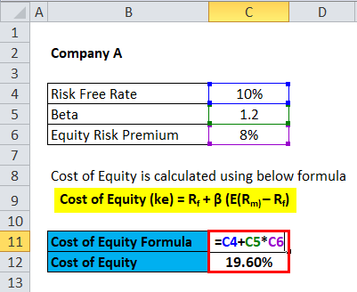

## Table of Contents

## What is the cost of equity and why is it important?

The cost of equity is the return that a company needs to give to its shareholders for them to keep investing in the company. It's like the interest rate you would expect if you were lending money to someone. Companies figure out their cost of equity by looking at things like how risky their business is, what returns investors could get elsewhere, and the overall health of the economy.

Understanding the cost of equity is important for a few reasons. First, it helps companies decide if they should go ahead with new projects or investments. If the expected return from a new project is less than the cost of equity, it might not be worth doing because it won't make shareholders happy. Second, it's a key part of figuring out a company's total cost of capital, which is used to make big financial decisions and set prices for things like new stocks or bonds. Knowing the cost of equity helps keep a company's financial strategy on track and makes sure they're using their money wisely.

## What are the different methods to calculate the cost of equity?

One common method to calculate the cost of equity is the Dividend Discount Model (DDM). This method looks at the dividends a company pays out to its shareholders. You figure out the cost of equity by dividing the dividend per share by the current market price of the stock and then adding the expected growth rate of the dividends. It's a bit like calculating how much return you'd get from your investment if you were only looking at the dividends. This method works well for companies that regularly pay dividends, but it's not so great for companies that don't pay dividends or have unpredictable dividend patterns.

Another popular method is the Capital Asset Pricing Model (CAPM). This model takes into account the risk of the company compared to the overall market. You start with the risk-free rate, which is usually the return on a super safe investment like government bonds. Then, you add a premium for the risk of the stock, which is calculated by multiplying the stock's beta (a measure of how much the stock's price moves with the market) by the market risk premium (the extra return investors expect for taking on more risk). This method is useful because it considers the riskiness of the investment, but it can be tricky because it relies on estimates of future market conditions and the stock's beta.

A third method is the Bond Yield Plus Risk Premium approach. This method is simpler and involves adding a risk premium to the company's long-term bond yield. The risk premium is an extra percentage that reflects the additional risk of investing in the company's stock compared to its bonds. This method is straightforward and doesn't need as many assumptions as the CAPM, but it can be less accurate if the company doesn't have bonds or if the bond market is not a good reflection of the company's risk.

## How do you use the Capital Asset Pricing Model (CAPM) to calculate the cost of equity?

The Capital Asset Pricing Model (CAPM) is a way to figure out the cost of equity by looking at how risky a company's stock is compared to the whole market. To use CAPM, you start with the risk-free rate, which is the return you'd get from a very safe investment like a government bond. Then, you add a bit extra for the risk of the stock. This extra bit is calculated by taking the stock's beta, which tells you how much the stock's price moves with the market, and multiplying it by the market risk premium. The market risk premium is the extra return investors expect for taking on more risk by investing in the stock market instead of a safe investment.

So, the formula for CAPM is pretty simple: Cost of Equity = Risk-Free Rate + (Beta × Market Risk Premium). Let's say the risk-free rate is 2%, the stock's beta is 1.2, and the market risk premium is 5%. You'd calculate the cost of equity like this: 2% + (1.2 × 5%) = 2% + 6% = 8%. This means investors would expect an 8% return to keep investing in the company's stock. CAPM is useful because it takes into account the risk of the investment, but it can be tricky because it relies on estimates of future market conditions and the stock's beta.

## What is the formula for CAPM and how do you apply it in Excel?

The formula for the Capital Asset Pricing Model (CAPM) is Cost of Equity = Risk-Free Rate + (Beta × Market Risk Premium). It's a way to figure out how much return investors expect from a stock based on how risky it is compared to the whole market. The risk-free rate is the return you'd get from a super safe investment like a government bond. Beta tells you how much the stock's price moves with the market, and the market risk premium is the extra return investors expect for taking on more risk by investing in the stock market instead of a safe investment.

To apply the CAPM formula in Excel, you first need to gather the three pieces of information: the risk-free rate, the stock's beta, and the market risk premium. Let's say you have these numbers: the risk-free rate is in cell A1 (for example, 2%), the stock's beta is in cell B1 (for example, 1.2), and the market risk premium is in cell C1 (for example, 5%). In a new cell, you can type the formula like this: =A1 + (B1 * C1). If you hit enter, Excel will calculate the cost of equity. In this example, it would show 8%, meaning investors expect an 8% return to keep investing in the company's stock.

## How do you find the risk-free rate for use in the CAPM formula?

The risk-free rate is the return you'd get from a super safe investment, like a government bond. It's called "risk-free" because the chance of the government not paying you back is very small. To find the risk-free rate, you usually look at the yield of long-term government bonds, like the 10-year U.S. Treasury bond. You can find this information on financial websites like Bloomberg or Yahoo Finance, or in financial news.

When using the risk-free rate in the CAPM formula, it's important to pick a rate that matches the time period you're looking at. If you're calculating the cost of equity for a long-term project, you'd use the yield of a long-term bond. But if you're looking at something short-term, you might use the yield of a short-term bond instead. The key is to make sure the risk-free rate you choose reflects the time frame of your investment.

## What is beta and how do you calculate it in Excel?

Beta is a number that shows how much a stock's price moves compared to the whole stock market. If a stock's beta is 1, it moves the same as the market. If it's more than 1, like 1.2, it moves more than the market, which means it's riskier. If it's less than 1, like 0.8, it moves less than the market, which means it's less risky. Beta helps you understand how risky a stock is compared to other stocks.

To calculate beta in Excel, you need the stock's returns and the market's returns over the same time period. Let's say you have the stock's returns in column A and the market's returns in column B. First, find the average return for both the stock and the market using the AVERAGE function. Then, in a new column, calculate the difference between each stock return and its average. Do the same for the market returns in another column. Next, multiply these differences together in a new column. The covariance is the average of these products, which you can find using the AVERAGE function again. Finally, divide the covariance by the variance of the market returns (which is the average of the squared differences between the market returns and their average). You can use the formula =COVAR(A2:A100, B2:B100) / VAR(B2:B100) to get beta, where A2:A100 and B2:B100 are the ranges of your stock and market returns.

## How do you determine the market risk premium for the CAPM calculation?

The market risk premium is the extra return investors expect to get from investing in the stock market instead of a super safe investment like a government bond. It's like the extra reward you want for taking on more risk. To figure out the market risk premium, you usually look at the difference between the expected return of the whole stock market and the risk-free rate. The expected return of the stock market can be tricky to predict, so people often use historical data to make a guess.

A common way to estimate the market risk premium is to look at how much the stock market has returned on average over a long time, like 50 or 100 years, and then subtract the average risk-free rate over that same time. For example, if the stock market has returned an average of 10% a year and the risk-free rate was 3%, the market risk premium would be 7%. But remember, this is just an estimate, and the actual market risk premium can change based on what's happening in the economy and how investors feel about taking risks.

## Can you explain the Dividend Discount Model (DDM) and its use in calculating the cost of equity?

The Dividend Discount Model (DDM) is a way to figure out how much a stock is worth by looking at the dividends it pays. Dividends are the money a company gives to its shareholders. The DDM says that the value of a stock is the total of all the future dividends it will pay, but you have to figure out what those future dividends are worth today. To do this, you use a discount rate, which is like the cost of equity. The cost of equity is the return that investors want to get for holding the stock. You can find the cost of equity by dividing the dividend per share by the current price of the stock and then adding the expected growth rate of the dividends.

Using the DDM to calculate the cost of equity is pretty straightforward if you know the dividend per share, the current stock price, and the expected growth rate of the dividends. For example, if a company pays a dividend of $2 per share, the stock is currently selling for $40, and the dividends are expected to grow by 5% each year, you'd calculate the cost of equity like this: ($2 / $40) + 5% = 5% + 5% = 10%. This means investors would expect a 10% return to keep investing in the company's stock. The DDM works well for companies that pay regular dividends, but it's not so great for companies that don't pay dividends or have unpredictable dividend patterns.

## How do you implement the DDM in Excel to find the cost of equity?

To implement the Dividend Discount Model (DDM) in Excel to find the cost of equity, you need three pieces of information: the dividend per share, the current stock price, and the expected growth rate of the dividends. Let's say you have these numbers in cells A1 (dividend per share, for example, $2), B1 (current stock price, for example, $40), and C1 (expected growth rate, for example, 5%). In a new cell, you can type the formula to calculate the cost of equity like this: =(A1/B1) + C1. When you hit enter, Excel will calculate the cost of equity. In this example, it would show 10%, meaning investors expect a 10% return to keep investing in the company's stock.

The DDM works well for companies that pay regular dividends, but it's not so great for companies that don't pay dividends or have unpredictable dividend patterns. When using the DDM, it's important to make sure your estimates for the dividend per share and the expected growth rate are as accurate as possible. If you get these numbers wrong, your calculation of the cost of equity might not be very reliable. So, always double-check your data and think carefully about the future growth of the dividends before you use the DDM in Excel.

## What are the limitations of using CAPM and DDM to calculate the cost of equity?

Using the Capital Asset Pricing Model (CAPM) to calculate the cost of equity has some limitations. One big problem is that CAPM relies on a lot of guesses. You have to guess what the risk-free rate will be, what the stock's beta will be, and what the market risk premium will be. These guesses can be wrong, and if they are, your calculation of the cost of equity won't be very accurate. Another issue is that CAPM assumes that all investors have the same information and behave the same way, which isn't true in real life. People have different information and different ideas about risk, so the model might not reflect what's really happening in the market.

The Dividend Discount Model (DDM) also has its own set of limitations. The biggest problem is that it only works well for companies that pay regular dividends. If a company doesn't pay dividends or if its dividends are unpredictable, the DDM won't give you a good answer. Another issue is that the DDM relies on knowing the future growth rate of dividends, which is hard to predict. If you guess wrong about how fast dividends will grow, your calculation of the cost of equity will be off. So, while the DDM can be useful, it's important to use it carefully and understand its limits.

## How can you adjust the cost of equity calculation for different market conditions using Excel?

To adjust the cost of equity calculation for different market conditions using Excel, you need to change the numbers you use in your formulas. If the economy is doing well, people might expect higher returns from the stock market, so you might need to increase the market risk premium in the CAPM model. You can do this by changing the number in the cell where you've put the market risk premium. If interest rates go up, the risk-free rate might change too, so you'd update the number in the cell for the risk-free rate. For the DDM, if you think dividends will grow faster because the economy is strong, you'd change the expected growth rate in the cell where you've put that number.

It's important to keep an eye on what's happening in the economy and the stock market, and update your Excel sheet with new information as things change. You can find updated numbers for the risk-free rate and market risk premium on financial websites. By regularly updating these numbers, you can make sure your cost of equity calculation stays accurate and reflects the current market conditions. This way, you'll have a better idea of what return investors expect from the company's stock, no matter what's going on in the market.

## What advanced Excel functions or tools can enhance the accuracy of cost of equity calculations?

To make your cost of equity calculations more accurate in Excel, you can use the Solver tool. Solver helps you find the best value for a cell by changing other cells. For example, if you're using the CAPM, you can use Solver to find the cost of equity that makes the present value of future cash flows equal to the current stock price. This can help you fine-tune your numbers and make sure they're as accurate as possible. To use Solver, you need to set up your spreadsheet so that it calculates the present value of future cash flows based on the cost of equity. Then, you tell Solver to change the cost of equity until the present value matches the current stock price.

Another useful tool is the Goal Seek function. This tool lets you find the right input value that gives you a specific result. For example, with the DDM, you can use Goal Seek to find the growth rate of dividends that makes the calculated cost of equity match what you think it should be. This can help you check if your assumptions about dividend growth are realistic. To use Goal Seek, you set the cell with the cost of equity as the "Set cell," the value you want the cost of equity to be as the "To value," and the cell with the growth rate as the "By changing cell." Both Solver and Goal Seek can help you make your cost of equity calculations more accurate by letting you play around with different numbers until you get the right answer.

## How can you calculate the cost of equity using Excel?

The cost of equity is a critical financial metric used to determine the return that investors expect from investing in a company's equity. A widely-used model for calculating the cost of equity is the Capital Asset Pricing Model (CAPM). CAPM describes the relationship between systematic risk and expected return and serves as a cornerstone in financial analysis. The model is expressed by the equation:

$$
\text{Cost of Equity} = R_f + \beta \times (R_m - R_f)
$$

Where:
- $R_f$ is the risk-free rate, typically the yield on government treasury bonds.
- $\beta$ is the beta coefficient, representing the stock's volatility relative to the market.
- $R_m$ is the expected return of the market.

### Setting Up an Excel Spreadsheet for CAPM

To compute the cost of equity using Excel, follow these steps:

1. **Initialize the Spreadsheet**:
   - Open Excel and create a new worksheet.
   - Label columns for each component of the CAPM equation: Risk-Free Rate, Beta, Market Return, and Cost of Equity.

2. **Input Data**:
   - In the cells under the "Risk-Free Rate" column, enter the current yield of a risk-free government bond.
   - Input the stock's beta value in the "Beta" column. This can be obtained from financial data services.
   - Enter the expected market return under the "Market Return" column. Historical market index averages like the S&P 500 can be used as a reference.

3. **Apply the CAPM Formula**:
   - In the "Cost of Equity" column, input the formula to calculate the cost of equity using CAPM.
   - The Excel formula would be: `=Risk-Free Rate + Beta * (Market Return - Risk-Free Rate)`.
   - For example, if the Risk-Free Rate is in cell A2, Beta in B2, and Market Return in C2, the formula in D2 would be `=A2 + B2 * (C2 - A2)`.

### Example Calculation

Assume the following data:

- Risk-Free Rate ($R_f$): 3% (0.03 in decimal)
- Beta ($\beta$): 1.2
- Market Return ($R_m$): 8% (0.08 in decimal)

The cost of equity would be computed as:

$$
\text{Cost of Equity} = 0.03 + 1.2 \times (0.08 - 0.03) = 0.03 + 1.2 \times 0.05 = 0.09
$$

Thus, the cost of equity is 9%.

### Troubleshooting Common Issues

- **Data Entry Errors**: Ensure that all data inputs are correct and in decimal form. Misplaced decimal points can lead to significantly incorrect results.

- **Formula Mistakes**: Double-check cell references in the formula. Excel's autofill feature can sometimes misapply references when copying the formula to adjacent cells.

- **Handling Excel Errors**: Errors such as `#VALUE!`, `#DIV/0!`, or `#NAME?` may occur. Use Excel's error-checking tool to identify issues. Typically, these errors arise from incorrect formula structure or referencing empty cells.

By utilizing these steps and understanding the components of CAPM, one can effectively calculate the cost of equity in Excel. This enhances financial decision-making, particularly in [algorithmic trading](/wiki/algorithmic-trading) where precision and accuracy of financial metrics are paramount.

## What is the relationship between Algorithmic Trading and the Cost of Equity?

Algorithmic trading has transformed the landscape of financial markets by employing sophisticated algorithms to automate trading decisions. A crucial component in these algorithms is the cost of equity, which serves as a pivotal financial metric. The integration of cost of equity analysis within algorithmic trading strategies facilitates a more informed evaluation of potential investments. By considering the required rate of return anticipated by equity investors, trading systems can better assess investment viability.

Algorithmic models take advantage of financial metrics like the cost of equity to systematically evaluate companies. One common approach is the use of the Capital Asset Pricing Model (CAPM), which determines the expected return of an asset based on its risk relative to the market. The formula for CAPM is:

$$
\text{Expected Return} = R_f + \beta \times (R_m - R_f)
$$

Where $R_f$ is the risk-free rate, $\beta$ is the beta of the security, and $(R_m - R_f)$ is the market risk premium. By calculating the expected return, algorithms can filter investments that meet or exceed the anticipated cost of equity, effectively narrowing down options to those with optimal risk-return profiles.

In terms of decision-making and risk management, the cost of equity plays a significant role. Algorithms utilize this metric to compare against actual or projected returns of assets. If the expected return does not surpass the cost of equity, the asset may be deemed unsuitable, thereby aiding in risk mitigation. Conversely, assets with returns exceeding the cost of equity are flagged for potential inclusion in portfolio strategies.

Here is an example of a Python code snippet that evaluates investments based on cost of equity criteria:

```python
def filter_investments(investments, risk_free_rate, market_return):
    filtered_investments = []
    for investment in investments:
        expected_return = risk_free_rate + investment['beta'] * (market_return - risk_free_rate)
        if expected_return >= investment['cost_of_equity']:
            filtered_investments.append(investment)
    return filtered_investments

# Example usage:
investments = [
    {'name': 'Company A', 'beta': 1.2, 'cost_of_equity': 0.08},
    {'name': 'Company B', 'beta': 0.9, 'cost_of_equity': 0.07}
]

filtered = filter_investments(investments, risk_free_rate=0.03, market_return=0.10)
print(filtered)
```

Algorithmic trading systems enhance return potential by incorporating assessments of cost of equity, which allow for optimized portfolio construction. By dynamically analyzing the returns relative to the equity cost, these systems can adapt to changes in market conditions, thereby maintaining a competitive edge. Adjustments are made to portfolios in real time, ensuring that returns are maximized while risks are kept within desired thresholds. Consequently, understanding and integrating cost of equity assessments in algorithmic models not only optimizes trading strategies but also yields greater financial insights and performance.

## What are Advanced ROE Analysis Techniques?

Return on Equity (ROE) is a significant metric in financial analysis, providing insights into a company's ability to generate profits from its shareholders' equity. Advanced ROE analysis techniques enhance understanding and allow for better strategic decisions in investment. 

One widely adopted model for dissecting ROE is the DuPont Analysis, which breaks ROE into three components: net profit margin, asset turnover, and financial leverage. By doing so, it helps to identify the factors driving the ROE and provides a more comprehensive view of a company's financial performance. The DuPont formula for ROE is:

$$

ROE = \text{Net Profit Margin} \times \text{Asset Turnover} \times \text{Equity Multiplier}
$$

where:
- Net Profit Margin = Net Income / Revenue
- Asset Turnover = Revenue / Total Assets
- Equity Multiplier = Total Assets / Shareholders' Equity

Financial leverage is a crucial [factor](/wiki/factor-investing) influencing ROE. It refers to the use of debt to acquire additional assets. Higher financial leverage can enhance ROE, provided the cost of debt is less than the return on assets. However, excessive leverage increases financial risk. Operational efficiency, reflected in the efficient use of assets to generate revenue, also significantly impacts ROE. Companies with high operational efficiency can convert their assets into revenue more effectively, boosting ROE.

Regression analysis and [machine learning](/wiki/machine-learning) offer powerful tools for predicting and enhancing ROE analysis. By employing statistical techniques, analysts can identify trends and correlations within financial data that might not be evident through traditional analysis. Machine learning models, such as decision trees and neural networks, can predict future ROE based on historical data and other financial indicators, providing a data-driven basis for investment decisions.

Excel is a versatile tool for conducting advanced ROE calculations. It can be used to implement complex formulas and functions, facilitating detailed financial analysis. For instance, analysts can use Excel's regression functions to analyze relationships between ROE and other variables. Advanced functions such as `XLOOKUP`, `FILTER`, and `ARRAYFORMULA` enable efficient data manipulation and analysis, enhancing the accuracy of financial forecasts and insights.

Incorporating these advanced techniques enables analysts to gain deeper insights into ROE, assisting in making informed investment decisions and optimizing financial strategies. Understanding the components and determinants of ROE not only aids in assessing company performance but also in forecasting future profitability.

## References & Further Reading

[1]: ["Corporate Finance"](https://www.investopedia.com/terms/c/corporatefinance.asp) by Stephen A. Ross, Randolph W. Westerfield, and Jeffrey Jaffe

[2]: Bodie, Z., Kane, A., & Marcus, A. J. (2014). [“Investments and Portfolio Management.”](https://books.google.com/books/about/EBOOK_Investments_Global_edition.html?id=BMsvEAAAQBAJ) McGraw-Hill Education.

[3]: ["Valuation: Measuring and Managing the Value of Companies"](https://www.amazon.com/Valuation-Measuring-Managing-Companies-Finance/dp/1119610885) by McKinsey & Company Inc., Tim Koller, Marc Goedhart, and David Wessels

[4]: ["The Intelligent Investor: The Definitive Book on Value Investing"](https://www.amazon.com/Intelligent-Investor-3rd-Ed/dp/0063356724) by Benjamin Graham

[5]: Damodaran, A. (2012). ["Investment Valuation: Tools and Techniques for Determining the Value of Any Asset."](https://books.google.com/books/about/Investment_Valuation.html?id=5SRHAAAAQBAJ) John Wiley & Sons.

[6]: ["Financial Modelling in Practice: A Concise Guide for Intermediate and Advanced Level"](https://onlinelibrary.wiley.com/doi/book/10.1002/9781118374658) by Michael Rees