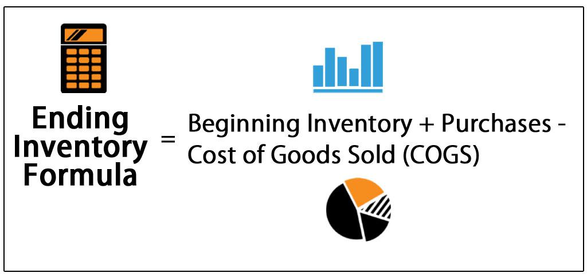

Inventory valuation is a critical component in managing business operations as it directly impacts financial statements, tax liabilities, and overall profitability. It involves determining the monetary value of unsold inventory at the end of an accounting period, influencing the cost of goods sold (COGS), and subsequently, the net income. Accurate inventory valuation ensures that a business's financial position is represented correctly, allowing for informed decision-making and strategic planning.

Among various inventory valuation techniques, the First In, First Out (FIFO) method stands out for its simplicity and logical approach. FIFO assumes that the oldest inventory items are sold first, and consequently, the inventory remaining at the end of the period consists of the most recently acquired or manufactured items. This method aligns well with actual inventory movement practices in many industries, facilitating ease in inventory management and financial reporting.



FIFO's relevance extends to calculating COGS, a crucial metric in financial analysis. By assuming that older inventory is used up first, FIFO typically results in lower COGS when prices are rising, thus leading to higher gross margins and net income. This can be particularly advantageous in portraying a company's financial health more favorably during inflationary periods. Understanding the interaction between FIFO and COGS is essential for stakeholders to gauge a company's profitability and operational efficiency.

In the context of algorithmic trading, FIFO's efficiency in tracking inventory aligns seamlessly with the need for accurate and real-time financial data. Algorithmic trading, which relies heavily on precise data inputs for executing automated trading strategies, benefits from FIFO's straightforward method of inventory turnover. This ensures that the trading algorithms function with up-to-date information, optimizing trading strategies and performance, especially in volatile market conditions.

This article will cover several critical aspects of the FIFO method. It will begin by explaining the foundational principles of FIFO and its application in inventory management. An analysis of FIFO's role in trading, particularly algorithmic trading, will follow. The article will compare FIFO with other inventory valuation methods, discuss the pros and cons associated with FIFO, and suggest best practices for its implementation in business operations.

## Table of Contents

## Understanding the FIFO Method

The FIFO (First In, First Out) method is an inventory valuation technique that mirrors the natural flow of inventory. Under FIFO, the oldest inventory items purchased are considered the first to be sold. This approach is intuitive because it aligns with the logic that the earliest goods are typically the first to leave, ensuring that inventory reflects a fresher stock in fast-moving environments. 

To understand how FIFO impacts financial statements, consider its role in calculating the Cost of Goods Sold (COGS). In FIFO, the COGS is determined by adding up the costs of the oldest inventory items available at the time of sale. For instance, if a company sells 100 units, FIFO would allocate the cost of the oldest 100 units. This allocation can influence a company’s profit margins: during times of rising prices, FIFO results in lower COGS because older, cheaper costs are matched against current revenues, thereby elevating net income. Conversely, in a period of falling prices, FIFO can result in higher COGS, reducing net income.

A practical example highlights this calculation. Suppose a business has the following inventory:

- Purchases:
  - 100 units at $10 each
  - 100 units at $12 each

If 150 units are sold, under FIFO, COGS is calculated as follows:

$$
\text{COGS} = (100 \times 10) + (50 \times 12) = 1000 + 600 = 1600
$$

Here, the earliest 100 units at $10 each are consumed first, followed by 50 units at $12.

The advantages of FIFO extend beyond accurate financial representation. The method is widely accepted under International Financial Reporting Standards (IFRS) and Generally Accepted Accounting Principles (GAAP). It is straightforward, providing clear and easy-to-understand financial statements. Furthermore, FIFO aligns with tax regulations, often resulting in deferral of tax liabilities in inflationary periods because of its lower COGS.

Overall, FIFO's ease of application, along with its effectiveness in reflecting real-world inventory movement and alignment with accounting standards, makes it a favorable choice for many businesses in managing inventory valuation.

## FIFO Method in Trading and Algo Trading

The FIFO (First In, First Out) method plays a crucial role in trading, particularly in managing stock portfolios. In essence, FIFO prescribes that the oldest stocks are sold or used first, aligning well with stock portfolio management strategies that prioritize the liquidation of assets acquired earlier. This approach helps in reflecting more accurately the costs associated with current trading activities, as the older stock prices are used for computing gains and losses on sales. Consequently, this assists traders and portfolio managers in assessing their financial performance over time and informs more strategic decision-making.

In the context of [algorithmic trading](/wiki/algorithmic-trading), FIFO is utilized to manage and optimize trading strategies by providing a systematic and consistent method to record and manage each trade's cost basis. Algorithms, which often execute numerous trades per second, require a reliable mechanism to maintain an accurate record of costs associated with these trades. By implementing FIFO, trading algorithms can ensure that the oldest inventories of securities are sold first, leading to a more predictable and standardized calculation of profits or losses. This has implications for compliance, performance analysis, and optimization of trading strategies.

Maintaining accurate and real-time financial data is paramount for trading algorithms, which thrive on the timely execution of transactions based on precise market data. An effective FIFO system ensures that each transaction is recorded in a manner that aligns with market dynamics and financial reporting requirements. Furthermore, FIFO aids in real-time adjustment of trading strategies, which is critical in highly volatile market conditions. During periods of high market [volatility](/wiki/volatility-trading-strategies), FIFO can assist in quickly liquidating older stock positions, thus protecting against potential losses associated with rapid price changes.

Specific scenarios where FIFO could benefit algorithmic trading include environments experiencing sharp fluctuations in asset prices, such as during earnings announcements or economic policy changes. In these instances, FIFO allows algorithms to swiftly act on older stock positions, potentially minimizing losses and capitalizing on short-term market movements. Additionally, in markets where holding older trading positions longer incurs additional costs or risks, FIFO facilitates a streamlined strategy to clear out these positions efficiently.

Overall, utilizing FIFO in trading and algorithmic strategies provides a robust framework for ensuring consistency in cost measurement and the effective execution of market operations. This lays a solid foundation for both growth and stability in complex trading environments where rapid decision-making is paramount.

## Differences Between FIFO and Other Inventory Methods

Inventory valuation is a crucial element in accounting, providing insights into the cost of goods sold (COGS) and informing financial statements. Various inventory valuation methods cater to different business needs and strategic considerations. Among these, the First In, First Out (FIFO) method, the Last In, First Out (LIFO) method, and the Average Cost Method are prominent. Each strategy impacts financial outcomes differently.

### FIFO vs. LIFO

The FIFO method assumes that the oldest inventory items are sold first. This method aligns with the natural flow of items, especially perishables, and typically records lower COGS and higher net income when prices are rising. For instance, if a business purchases 100 units at $10 each and later 100 units at $12 each, under FIFO, the first 100 units sold are priced at $10.

Conversely, the LIFO method assumes the newest inventory is sold first. LIFO is beneficial when prices are rising as it increases COGS and reduces taxable income. However, it may not reflect the actual flow of goods and can result in older inventory values reducing the accuracy of the balance sheet. Using the previous example, under LIFO, the initial sale would be recorded at $12 per unit.

### FIFO vs. Average Cost Method

The Average Cost Method averages the cost of all items available for sale during the period. This method smoothens price fluctuations over time, minimizing the impact of inflation or deflation on COGS. It's particularly useful for industries with large volumes of identical products, such as chemicals or fuels.

For example, using the same purchase data, the average cost would be calculated as follows:

$$
\text{Average Cost} = \frac{(100 \times 10) + (100 \times 12)}{200} = 11
$$

This would mean that the cost of goods sold for each item would be $11 under this method.

### Strategic Choices and Implications

Businesses may choose FIFO when:
- There is a need to match the actual physical flow of inventory.
- The market is experiencing inflation, as it presents higher net income.
- Better representation of current market prices on the balance sheet is desired.

LIFO might be chosen:
- To minimize tax liabilities during inflationary times.
- When the business’s products can be sold interchangeably without concern for actual cost sequence.

The Average Cost Method is advantageous when:
- There is a significant fluctuation in purchase costs.
- Simplification of inventory costing is needed due to the volume of transactions being high.

### Regulatory Considerations

In financial reporting, the choice of inventory method can have significant regulatory implications. International Financial Reporting Standards (IFRS) do not permit LIFO due to its potential to distort financial statements. The United States Generally Accepted Accounting Principles (GAAP), however, allow both FIFO and LIFO, giving companies the flexibility to choose based on their strategic and operational needs. This dichotomy can affect multinational corporations, which must often reconcile these differences in preparing financial statements that comply with both international and domestic standards. 

Adaptations to these standards require businesses to evaluate the impact on their financial health, tax liabilities, and regulatory compliance, ensuring the chosen inventory method aligns with strategic objectives and market conditions.

## Pros and Cons of FIFO in Inventory Valuation

The First In, First Out (FIFO) method of inventory valuation offers various advantages that make it a favorable choice for many businesses. One of its primary benefits is its simplicity. FIFO aligns closely with the natural physical flow of goods, ensuring that items purchased or produced first are sold first. This straightforward approach simplifies inventory tracking and accounting processes. Additionally, FIFO aligns well with most tax and accounting regulations, making it a widely accepted method across different jurisdictions.

Another advantage of FIFO is its ability to reflect real-world inventory costs more accurately. During periods of inflation, the costs recorded on financial statements under FIFO are based on older, potentially lower costs. This results in a higher reported net income, as the cost of goods sold (COGS) is lower when historical costs are used. As a result, FIFO can enhance a company's financial appearance to investors and stakeholders by showcasing healthier profit margins.

However, FIFO is not without its disadvantages. One potential drawback is its impact on tax liabilities. By reporting higher net income, FIFO can increase a company's tax burden, as taxes are typically calculated based on net income. In contrast, Last In, First Out (LIFO) can reduce taxable income during inflationary periods by using more recent and generally higher costs for COGS calculations. This difference in tax impact can be substantial, affecting cash flow and financial planning.

Moreover, FIFO may not accurately represent the current cost of inventory, especially in industries where prices fluctuate significantly. When older costs do not reflect current market prices, financial statements may not provide a true picture of the cost of replacing inventory. This can be a disadvantage for analysts and investors seeking to evaluate a company's current financial health and operational efficiency.

Despite these disadvantages, certain scenarios demonstrate the benefits of FIFO. In industries with stable pricing or where inventory turnover is rapid, FIFO can provide a reliable and straightforward method for inventory valuation. Additionally, businesses seeking to demonstrate strong financial performance to attract investment or secure loans might favor FIFO for its tendency to report higher profits during times of inflation.

Ultimately, the choice of inventory valuation method should align with a company's operational strategy and financial objectives, balancing the benefits of simplicity and real-world alignment with the potential drawbacks associated with tax liabilities and cost representation.

## Best Practices for Implementing FIFO

Implementing the First In, First Out (FIFO) inventory valuation method requires meticulous planning and adherence to certain best practices to ensure accurate records and operational efficiency. Below are key guidelines to maintain accuracy and effectiveness in adopting FIFO across various business environments:

### Maintaining Accurate Records and Documentation

**1. Periodic Reconciliation:** Regular reconciliation of inventory records with physical counts is essential. This helps in identifying discrepancies early and ensuring that the oldest inventory items are the first ones used or sold, maintaining consistency with the FIFO methodology.

**2. Detailed Record-Keeping:** Each inventory item should have comprehensive documentation, including date of purchase, cost, and date of sale or usage. This assists in calculating the Cost of Goods Sold (COGS) precisely and avoids any misreporting in financial statements.

**3. Use of Inventory Management Systems:** Deploy inventory management software capable of tracking entry and exit dates of products, automatically applying the FIFO logic to inventory movement. Features such as barcode scanning can further enhance accuracy in recording inventory transactions.

### Integration into Business Processes and Technology

**1. Software Automation:** Utilize Enterprise Resource Planning (ERP) systems or dedicated inventory management tools that support FIFO to automate the inventory tracking process. Such systems can seamlessly incorporate FIFO in their algorithms, reducing manual errors and increasing efficiency. 

**Example Python Code for Basic FIFO COGS Calculation:**

```python
from collections import deque

inventory = deque()

def purchase(item, quantity, price):
    inventory.append({'item': item, 'quantity': quantity, 'price': price})

def sale(item, quantity):
    cogs = 0
    while quantity > 0 and inventory:
        batch = inventory.popleft()
        if batch['quantity'] <= quantity:
            cogs += batch['quantity'] * batch['price']
            quantity -= batch['quantity']
        else:
            cogs += quantity * batch['price']
            batch['quantity'] -= quantity
            inventory.appendleft(batch)
            quantity = 0
    return cogs

purchase('ItemA', 100, 10)
purchase('ItemA', 50, 12)
print(sale('ItemA', 80))  # should calculate COGS using FIFO
```

**2. Consistent Workflow Adaptation:** Modify the workflow in warehouses and storage facilities to ensure adherence to FIFO. Arrange inventory physically in a manner where older stock is more accessible and picked first.

### Adapting FIFO Across Industries and Market Conditions

**1. Industry-Specific Strategies:** Different industries may require particular FIFO adaptations. For example, the food and beverage sector, where expiration dates are crucial, naturally aligns with FIFO. In contrast, technology companies might need additional protocols to account for obsolescence.

**2. Scalability Considerations:** For businesses experiencing rapid growth or seasonal fluctuations, scalability of FIFO processes is vital. Ensure that both physical and software systems can handle larger volumes of data without compromising FIFO integrity.

**3. Training and Compliance:** Continuous training programs for staff involved in inventory management help maintain adherence to FIFO practices. Additionally, ensuring compliance with industry-specific reporting standards and regulations enhances trust and accuracy in financial reporting.

By following these best practices, businesses can effectively implement FIFO within their operations, optimizing inventory management processes and ensuring precise financial analyses.

## Conclusion

FIFO, or First In, First Out, plays a crucial role in inventory valuation and management. Its methodology aligns closely with the natural flow of goods, assuming that the oldest inventory items are sold first. This alignment not only simplifies record-keeping but also provides a realistic approach to cost management, especially in times of stable prices. FIFO's impact extends into financial statements, primarily affecting the calculation of Cost of Goods Sold (COGS) and, consequently, net income and tax liabilities.

In trading, particularly algorithmic trading, FIFO enhances operational efficiency by maintaining accurate real-time financial data, thus aiding in developing and managing trading strategies. This method is particularly beneficial during volatile market conditions, ensuring that older, often less costly, items impact COGS before newer, potentially higher-cost purchases.

However, FIFO is not universally superior to other inventory methods such as LIFO (Last In, First Out) or the Average Cost Method. Its suitability depends on a business's specific circumstances, objectives, and the economic environment in which it operates. LIFO might be preferred during periods of inflation to reduce taxable income, while the Average Cost Method provides stability in fluctuating markets.

Choosing the right inventory method is fundamental to aligning with financial goals and ensuring regulatory compliance. With international standards like IFRS often precluding LIFO, FIFO frequently becomes a practical choice globally. Businesses should carefully evaluate their inventory strategies, considering economic conditions and regulatory environments, to optimize their financial performance and remain compliant.

Ultimately, while FIFO presents numerous advantages, such as alignment with actual business processes and regulatory standards, companies must weigh these against potential downsides, such as increased tax liabilities in inflationary times, to determine the most suitable inventory valuation method for their needs. This strategic alignment is crucial for maintaining financial health and achieving long-term objectives.

## FAQs

### FAQs

**1. How does the FIFO method affect inventory valuation and the financial statements of a business?**

The FIFO (First In, First Out) method assumes that the oldest inventory items are sold first, reflecting real-world practice for many businesses. This assumption influences the cost of goods sold (COGS) and the ending inventory value. In periods of rising prices, FIFO typically results in lower COGS and higher ending inventory values compared to other inventory methods like LIFO (Last In, First Out). Consequently, this leads to a higher gross profit and net income on financial statements.

**2. Are there any common misconceptions about FIFO in trading contexts?**

A common misconception is that FIFO only pertains to inventory in retail and manufacturing; however, it is equally applicable to trading contexts, particularly stock portfolio management. In trading, FIFO helps in accurately determining the cost basis of stocks sold, which is crucial for tax reporting and financial analysis. Traders often utilize FIFO to ensure gains and losses are calculated on the longest-held stock lots first, aligning with many tax regulations.

**3. How can a business start implementing FIFO in inventory management?**

To implement FIFO, a business should focus on accurate record-keeping and inventory tracking. Here are basic steps:

- **Inventory Management Systems:** Integrate a robust inventory management system capable of tracking the purchase and sale dates of inventory items.

- **Documentation and Policies:** Establish clear policies for inventory handling that support FIFO practices, such as shelving strategies where older inventory is always at the front.

- **Regular Audits:** Conduct regular audits to ensure compliance with FIFO procedures, which helps in maintaining accurate financial records.

**4. What challenges might a business face when transitioning to FIFO from another inventory valuation method like LIFO?**

Switching from LIFO to FIFO can result in significant changes in reported financial metrics due to the differing impacts on COGS and inventories. Businesses might face transitional issues such as:

- **Increased Tax Liability:** As FIFO often results in higher reported earnings during inflationary periods, a switch can lead to higher taxable income.

- **System Overhaul:** Businesses may need to revise their accounting systems and processes to adopt FIFO, which can incur costs and require training.

- **Comparative Analysis Adjustments:** Historical financial comparisons may become challenging unless prior period statements are recalculated under FIFO for consistency.

**5. Can FIFO be applied to intangible goods or services?**

FIFO is primarily used for tangible inventory; however, its principles can sometimes be adapted to environments dealing with intangible goods, like digital media libraries or service credits, by applying it to the chronological consumption of resources.

**6. What coding tools can help automate FIFO inventory tracking?**

To automate FIFO inventory tracking, businesses can employ customized coding solutions using tools like Python. For instance, a basic implementation to track inventory using Python could involve a list structure for inventory batches and a function to compute COGS using FIFO:

```python
class InventoryBatch:
    def __init__(self, quantity, cost_per_unit):
        self.quantity = quantity
        self.cost_per_unit = cost_per_unit

def calculate_cogs(sold_units, inventory_batches):
    cost = 0
    for batch in inventory_batches:
        if sold_units <= 0:
            break
        take_units = min(batch.quantity, sold_units)
        cost += take_units * batch.cost_per_unit
        sold_units -= take_units
        batch.quantity -= take_units
    return cost
```

This code helps track and calculate COGS in a FIFO manner, ensuring accurate financial data and analysis.

## References & Further Reading

[1]: ["International Financial Reporting Standards (IFRS)"](https://www.investopedia.com/terms/i/ifrs.asp)

[2]: ["Generally Accepted Accounting Principles (GAAP)"](https://en.wikipedia.org/wiki/Generally_Accepted_Accounting_Principles_(United_States))

[3]: ["IRS Publication 538: Accounting Periods and Methods"](https://www.irs.gov/publications/p538)

[4]: ["Inventory Valuation Methods: The Problem with LIFO"](https://accountinginsights.org/lifo-inventory-valuation-methods-calculations-and-financial-impact/)

[5]: ["Inventory Valuation: FIFO vs. LIFO"](https://www.investopedia.com/articles/02/060502.asp)

[6]: ["Algorithmic Trading and Finance Models with Python, R, and Stata"](https://masterscareers.brown.edu/classes/algorithmic-trading-and-finance-models-with-python-r-and-stata-essential-training/) by Abdullah Karasan

[7]: ["Python for Finance: Analyze Big Financial Data"](https://books.google.com/books/about/Python_for_Finance.html?id=E93SBQAAQBAJ) by Yves Hilpisch