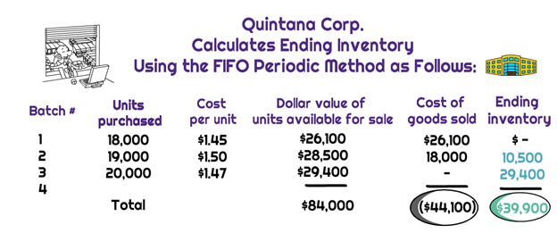

## Table of Contents

## What is the Cost of Goods Sold (COGS)?

The Cost of Goods Sold (COGS) is the total cost a business pays to produce or buy the products it sells during a specific period. This includes the cost of materials and labor used directly in creating the product, but it does not include indirect costs like distribution or sales force expenses. For a company that makes shoes, COGS would include the cost of leather, rubber, and the wages of the workers who make the shoes.

Calculating COGS is important for businesses because it helps them figure out their gross profit. Gross profit is what's left after subtracting COGS from total sales revenue. Knowing the COGS helps businesses understand how much it costs to make what they sell, which can help them set prices and plan for the future. For example, if a business sees that its COGS is going up, it might need to raise prices or find ways to cut costs.

## What is the FIFO method and why is it used?

The FIFO method stands for "First In, First Out." It's a way of keeping track of inventory where the first items bought or made are the first ones sold. Imagine you have a store that sells apples. You buy a batch of apples on Monday and another batch on Friday. When you sell apples, you sell the ones from Monday before you start selling the ones from Friday. This is FIFO.

FIFO is used because it can help businesses match their costs with their revenues more accurately. If prices are going up, the older, cheaper items are sold first, which means the cost of goods sold will be lower. This can make the business look more profitable in the short term. Also, FIFO is closer to how many businesses actually handle their inventory, so it makes sense to use it for accounting. It's especially useful for businesses that sell perishable goods, like food, because they need to sell the oldest items first to avoid spoilage.

## How do you calculate COGS using the FIFO method?

To calculate COGS using the FIFO method, you start by selling the oldest inventory first. Let's say you bought 100 apples at $1 each on January 1st and then bought another 100 apples at $1.20 each on January 15th. If you sold 150 apples by the end of January, you would first sell all 100 apples from January 1st at $1 each, and then sell 50 apples from the January 15th batch at $1.20 each. The COGS would be (100 x $1) + (50 x $1.20) = $100 + $60 = $160.

Using FIFO helps businesses keep track of their costs accurately because it matches the flow of goods in a way that makes sense. If prices are going up, FIFO will show a lower COGS because you're selling the cheaper, older inventory first. This can make your business look more profitable in the short term. It's a simple and logical method that many businesses use, especially those dealing with perishable goods where selling older stock first is important.

## What are the steps to implement FIFO for inventory management?

To use FIFO for managing inventory, you need to keep track of when you buy or make things. When you get new stuff, you add it to the back of your inventory list. When you sell something, you take it from the front of the list, which means you're selling the oldest items first. It's like a line at the grocery store where the people who got there first get to check out first. You need to keep good records of what you buy and when, so you know which items to sell next.

Using FIFO helps you match your costs with your sales in a way that makes sense. If you sell things that cost less first, your cost of goods sold will be lower, which can make your business look more profitable. This method is easy to understand and use, especially if you sell things that can go bad, like food. By selling the oldest items first, you make sure nothing goes to waste. Keeping everything organized and up-to-date is key to making FIFO work well for your business.

## Can you provide a simple example of calculating COGS with FIFO?

Let's say you own a store that sells apples. On January 1st, you buy 100 apples for $1 each. On January 15th, you buy another 100 apples, but this time they cost $1.20 each. By the end of January, you sell 150 apples. Using the FIFO method, you would sell the apples you bought first, which means you sell all 100 apples from January 1st at $1 each before you start selling the apples from January 15th.

So, you sell 100 apples at $1 each, which costs you $100. Then, you sell 50 apples from the second batch at $1.20 each, which costs you $60. Adding these together, your Cost of Goods Sold (COGS) for January is $100 + $60 = $160. Using FIFO helps you keep track of your costs accurately because you're selling the older, cheaper apples first.

## How does FIFO affect the financial statements of a company?

Using the FIFO method can change how a company's financial statements look. If the cost of things goes up over time, FIFO makes the cost of goods sold lower because you're selling the older, cheaper stuff first. This means your gross profit will be higher because you're subtracting a lower cost from your sales. On your income statement, you'll see a bigger gross profit and net income, which makes your business look more profitable.

FIFO also affects the balance sheet. Because you're using the older, lower costs for the stuff you sell, the value of the inventory left on your balance sheet will be higher. This is because the newer, more expensive items are still in stock. A higher inventory value can make your company's assets look bigger, which can be good for things like getting loans or attracting investors. So, FIFO can make both your income statement and balance sheet look better, especially when prices are going up.

## What are the advantages of using the FIFO method for COGS?

Using the FIFO method for calculating COGS has several benefits. One big advantage is that it matches the flow of goods in a way that makes sense. When you sell the oldest items first, it's like how many businesses actually handle their inventory. This makes it easier to keep track of things and helps avoid spoiling goods, especially if you sell things like food that can go bad. It also helps you know exactly which items you're selling, so your records stay accurate.

Another advantage is that FIFO can make your business look more profitable when prices are going up. Since you're selling the older, cheaper items first, your cost of goods sold will be lower. This means your gross profit will be higher because you're subtracting a smaller cost from your sales. On your financial statements, this can make your business look better, which can be helpful when you're trying to get loans or attract investors. Plus, it's a simple method that's easy to understand and use, which is great for keeping your accounting straightforward.

## What are the potential disadvantages of using the FIFO method?

Using the FIFO method can have some downsides. If prices are going up, FIFO can make your business look more profitable than it really is because you're selling the older, cheaper items first. This can be a problem if you need to show a true picture of your business's financial health. For example, if you're trying to get a loan, the bank might think your business is doing better than it actually is, which could lead to problems later on.

Another issue with FIFO is that it might not work well for all types of businesses. If you sell things that don't go bad, like metal or electronics, selling the oldest items first might not make sense. In those cases, using FIFO could make your inventory management more complicated than it needs to be. Also, if you're in a country where tax rules favor another method like LIFO, using FIFO could mean you pay more in taxes, which isn't good for your bottom line.

## How does FIFO compare to other inventory valuation methods like LIFO and Weighted Average?

FIFO, or First In, First Out, is one way to keep track of inventory where you sell the oldest items first. LIFO, or Last In, First Out, is the opposite – you sell the newest items first. When prices are going up, FIFO makes your cost of goods sold lower because you're selling the cheaper, older stuff first. This can make your business look more profitable on paper. LIFO, on the other hand, makes your cost of goods sold higher because you're selling the more expensive, newer stuff first, which can make your business look less profitable. The choice between FIFO and LIFO can affect your taxes too. In some places, using LIFO might help you pay less in taxes because it shows a higher cost of goods sold.

The Weighted Average method is different from both FIFO and LIFO. Instead of selling items based on when you bought them, you figure out the average cost of all the items you have in stock. You do this by adding up the total cost of all your items and dividing it by the total number of items. This average cost is then used for all the items you sell. This method can be simpler to use because you don't have to keep track of when each item was bought. But it might not give you as accurate a picture of your costs as FIFO or LIFO, especially if prices change a lot. Each method has its own pros and cons, and the best one for your business depends on what you sell and how prices are changing.

## What are the tax implications of using the FIFO method?

Using the FIFO method can affect how much tax you pay. If prices are going up, FIFO makes your cost of goods sold lower because you're selling the older, cheaper stuff first. This means your profit looks bigger, and you might have to pay more in taxes. In some countries, the tax rules might favor other methods like LIFO, which could let you pay less in taxes because it shows a higher cost of goods sold.

But, it's not just about paying less in taxes. You also need to think about what's best for your business in the long run. If you use FIFO and it makes your business look more profitable, that can be good for things like getting loans or attracting investors. But if you're trying to show a true picture of your business's financial health, using a method that matches your actual inventory flow might be better, even if it means paying more in taxes.

## How can businesses track inventory effectively to ensure accurate FIFO calculations?

To track inventory effectively for accurate FIFO calculations, businesses need to keep good records of when they buy or make things. Every time you get new stuff, you should write down how many items you got, what they cost, and the date you got them. When you sell something, you take it from the oldest batch first. This means you need a system, like a computer program or even just a notebook, where you can see all your inventory listed in the order you got it. Keeping everything up-to-date and organized is key to making sure your FIFO calculations are right.

Using technology can make this easier. Many businesses use inventory management software that automatically keeps track of everything for them. These programs can tell you exactly which items to sell next based on when you bought them, so you don't have to do it all by hand. Even if you're using a simple spreadsheet, make sure you update it every time you buy or sell something. By staying on top of your records, you can make sure your FIFO calculations are accurate and your business runs smoothly.

## What are some advanced considerations or adjustments needed when applying FIFO in complex scenarios?

In more complex situations, using FIFO might need some special tweaks. For example, if you have a business that sells a lot of different kinds of things, you need to keep track of each type separately. Imagine you sell both apples and oranges. You have to make sure you're using FIFO for each type, not mixing them up. Also, if you get stuff from different places at different prices, you need to keep track of that too. If you bought apples from two different farms at different prices, you need to know which apples you're selling first.

Another thing to think about is if you're selling things that can be broken down into smaller parts. Like if you sell big packs of apples but also sell them by the piece, you need to figure out how to use FIFO for both. You might need to keep track of the big packs and the single apples separately. And if you're dealing with returns or damaged goods, you need to take those out of your inventory in a way that still follows FIFO. It can get tricky, but keeping good records and maybe using a computer program can help you handle all these details and keep your FIFO calculations right.

## What is the FIFO Method and how does it work?

The FIFO (First In, First Out) method is an inventory valuation technique that mirrors the natural flow of inventory. Under FIFO, the oldest inventory items purchased are considered the first to be sold. This approach is intuitive because it aligns with the logic that the earliest goods are typically the first to leave, ensuring that inventory reflects a fresher stock in fast-moving environments. 

To understand how FIFO impacts financial statements, consider its role in calculating the Cost of Goods Sold (COGS). In FIFO, the COGS is determined by adding up the costs of the oldest inventory items available at the time of sale. For instance, if a company sells 100 units, FIFO would allocate the cost of the oldest 100 units. This allocation can influence a company’s profit margins: during times of rising prices, FIFO results in lower COGS because older, cheaper costs are matched against current revenues, thereby elevating net income. Conversely, in a period of falling prices, FIFO can result in higher COGS, reducing net income.

A practical example highlights this calculation. Suppose a business has the following inventory:

- Purchases:
  - 100 units at $10 each
  - 100 units at $12 each

If 150 units are sold, under FIFO, COGS is calculated as follows:

$$
\text{COGS} = (100 \times 10) + (50 \times 12) = 1000 + 600 = 1600
$$

Here, the earliest 100 units at $10 each are consumed first, followed by 50 units at $12.

The advantages of FIFO extend beyond accurate financial representation. The method is widely accepted under International Financial Reporting Standards (IFRS) and Generally Accepted Accounting Principles (GAAP). It is straightforward, providing clear and easy-to-understand financial statements. Furthermore, FIFO aligns with tax regulations, often resulting in deferral of tax liabilities in inflationary periods because of its lower COGS.

Overall, FIFO's ease of application, along with its effectiveness in reflecting real-world inventory movement and alignment with accounting standards, makes it a favorable choice for many businesses in managing inventory valuation.

## What are the differences between FIFO and other inventory methods?

Inventory valuation is a crucial element in accounting, providing insights into the cost of goods sold (COGS) and informing financial statements. Various inventory valuation methods cater to different business needs and strategic considerations. Among these, the First In, First Out (FIFO) method, the Last In, First Out (LIFO) method, and the Average Cost Method are prominent. Each strategy impacts financial outcomes differently.

### FIFO vs. LIFO

The FIFO method assumes that the oldest inventory items are sold first. This method aligns with the natural flow of items, especially perishables, and typically records lower COGS and higher net income when prices are rising. For instance, if a business purchases 100 units at $10 each and later 100 units at $12 each, under FIFO, the first 100 units sold are priced at $10.

Conversely, the LIFO method assumes the newest inventory is sold first. LIFO is beneficial when prices are rising as it increases COGS and reduces taxable income. However, it may not reflect the actual flow of goods and can result in older inventory values reducing the accuracy of the balance sheet. Using the previous example, under LIFO, the initial sale would be recorded at $12 per unit.

### FIFO vs. Average Cost Method

The Average Cost Method averages the cost of all items available for sale during the period. This method smoothens price fluctuations over time, minimizing the impact of inflation or deflation on COGS. It's particularly useful for industries with large volumes of identical products, such as chemicals or fuels.

For example, using the same purchase data, the average cost would be calculated as follows:

$$
\text{Average Cost} = \frac{(100 \times 10) + (100 \times 12)}{200} = 11
$$

This would mean that the cost of goods sold for each item would be $11 under this method.

### Strategic Choices and Implications

Businesses may choose FIFO when:
- There is a need to match the actual physical flow of inventory.
- The market is experiencing inflation, as it presents higher net income.
- Better representation of current market prices on the balance sheet is desired.

LIFO might be chosen:
- To minimize tax liabilities during inflationary times.
- When the business’s products can be sold interchangeably without concern for actual cost sequence.

The Average Cost Method is advantageous when:
- There is a significant fluctuation in purchase costs.
- Simplification of inventory costing is needed due to the volume of transactions being high.

### Regulatory Considerations

In financial reporting, the choice of inventory method can have significant regulatory implications. International Financial Reporting Standards (IFRS) do not permit LIFO due to its potential to distort financial statements. The United States Generally Accepted Accounting Principles (GAAP), however, allow both FIFO and LIFO, giving companies the flexibility to choose based on their strategic and operational needs. This dichotomy can affect multinational corporations, which must often reconcile these differences in preparing financial statements that comply with both international and domestic standards. 

Adaptations to these standards require businesses to evaluate the impact on their financial health, tax liabilities, and regulatory compliance, ensuring the chosen inventory method aligns with strategic objectives and market conditions.

## References & Further Reading

[1]: ["International Financial Reporting Standards (IFRS)"](https://www.investopedia.com/terms/i/ifrs.asp)

[2]: ["Generally Accepted Accounting Principles (GAAP)"](https://en.wikipedia.org/wiki/Generally_Accepted_Accounting_Principles_(United_States))

[3]: ["IRS Publication 538: Accounting Periods and Methods"](https://www.irs.gov/publications/p538)

[4]: ["Inventory Valuation Methods: The Problem with LIFO"](https://accountinginsights.org/lifo-inventory-valuation-methods-calculations-and-financial-impact/)

[5]: ["Inventory Valuation: FIFO vs. LIFO"](https://www.investopedia.com/articles/02/060502.asp)

[6]: ["Algorithmic Trading and Finance Models with Python, R, and Stata"](https://masterscareers.brown.edu/classes/algorithmic-trading-and-finance-models-with-python-r-and-stata-essential-training/) by Abdullah Karasan

[7]: ["Python for Finance: Analyze Big Financial Data"](https://books.google.com/books/about/Python_for_Finance.html?id=E93SBQAAQBAJ) by Yves Hilpisch