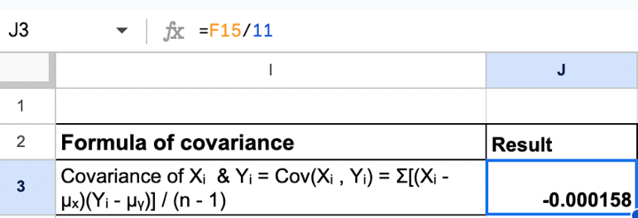

## Table of Contents

## What is a covariance matrix and why is it important in finance?

A covariance matrix is a table that shows how different things move together. Imagine you have two stocks, and you want to know if they tend to go up and down at the same time or in opposite directions. The covariance matrix helps you see this. Each number in the matrix tells you about the relationship between two things. If the number is big and positive, it means the two things tend to move together. If it's big and negative, they move in opposite directions. If it's close to zero, they don't really move together at all.

In finance, the covariance matrix is really important because it helps people understand how risky their investments are. When you're putting money into different stocks or other investments, you want to know how they might affect each other. If all your investments move up and down together, that's riskier than if they move in different ways. By using the covariance matrix, financial experts can figure out the best mix of investments to lower risk and possibly make more money. It's a key tool in something called portfolio management, where people decide how to spread their money across different investments.

## How do you calculate the covariance between two assets?

To calculate the covariance between two assets, you first need to gather the historical data for both assets over a certain period. Let's call these assets A and B. You'll need the returns for each asset, which you can find by calculating the percentage change in their prices from one period to the next. Once you have the returns, you can start the calculation. First, find the average return for asset A and the average return for asset B. Then, for each period, you multiply the difference between the return of asset A and its average return by the difference between the return of asset B and its average return. You do this for all periods and then add up these products.

After you've added up all these products, you divide the total by the number of periods minus one. This gives you the covariance between asset A and asset B. The formula looks like this: Cov(A,B) = Σ[(Return_A - Average_Return_A) * (Return_B - Average_Return_B)] / (n - 1), where Σ means "sum of," and n is the number of periods. If the covariance is positive, it means that when asset A's returns are above its average, asset B's returns tend to be above its average too, and vice versa for below-average returns. If the covariance is negative, it means that when asset A's returns are above average, asset B's returns tend to be below average, and vice versa.

## What is the formula for calculating the covariance matrix for multiple assets?

To calculate the covariance matrix for multiple assets, you first need to find the covariance between each pair of assets. Imagine you have three assets, A, B, and C. You would calculate the covariance between A and B, A and C, B and C, and also the covariance of each asset with itself, which is just the variance of that asset. You do this using the same method as for two assets: you take the returns for each asset, find their average returns, and then for each period, you multiply the difference between the return of one asset and its average return by the difference between the return of the other asset and its average return. You sum these products over all periods and divide by the number of periods minus one.

Once you have all these covariances, you arrange them into a square matrix. The size of the matrix depends on how many assets you have. For three assets, you'll have a 3x3 matrix. The entry in the row for asset A and the column for asset B is the covariance between A and B. The diagonal entries (where the row and column are for the same asset) are the variances of each asset. So, the matrix looks like this: the top left corner is the variance of A, the next entry to the right is the covariance of A and B, and so on. This matrix gives you a complete picture of how all the assets move together, which is very useful in finance for understanding and managing the risk of a portfolio.

## How does the covariance matrix help in understanding portfolio risk?

The covariance matrix is a big help in understanding how risky a group of investments, or a portfolio, might be. It shows how different investments move together. If all the investments in your portfolio go up and down at the same time, that's pretty risky. But if some go up when others go down, that can make the whole portfolio less risky. By looking at the covariance matrix, you can see which investments move together and which ones don't. This helps you figure out the best mix of investments to lower the overall risk.

For example, if two stocks have a high positive covariance, it means they tend to move in the same direction. If you put a lot of money in both, your portfolio could be very risky because if one stock goes down, the other probably will too. But if you find stocks with a low or negative covariance, adding them to your portfolio can help balance things out. By using the covariance matrix, you can choose investments that will help spread out the risk, making your portfolio safer and possibly more profitable in the long run.

## What is portfolio variance and how is it related to the covariance matrix?

Portfolio variance is a measure of how risky your whole group of investments, called a portfolio, is. It tells you how much the total value of your investments might go up and down. To find the portfolio variance, you need to know not just how each investment moves on its own, but also how they move together. That's where the covariance matrix comes in. The covariance matrix shows how different investments in your portfolio relate to each other. It helps you see if they tend to go up and down together or if they move in opposite ways.

The portfolio variance is calculated using the weights of each investment in your portfolio and the covariance matrix. The weights are how much of your money you put into each investment. You take the weights of each pair of investments, multiply them together, and then multiply that by the covariance between those two investments. You do this for every pair in your portfolio and add all these numbers up. The result is the portfolio variance. So, the covariance matrix is really important because it gives you the numbers you need to figure out how risky your whole portfolio is, helping you make smarter choices about where to put your money.

## How do you calculate portfolio variance using the covariance matrix?

To calculate the portfolio variance using the covariance matrix, you first need to know how much of your money is in each investment. These amounts are called weights, and they should add up to 100% or 1. Imagine you have three investments: A, B, and C. You put 30% of your money in A, 50% in B, and 20% in C. The covariance matrix shows how each pair of these investments moves together. You'll see numbers for the covariance between A and B, A and C, B and C, and also the variances of A, B, and C along the diagonal of the matrix.

To find the portfolio variance, you go through the covariance matrix and do some math. You take the weight of investment A and multiply it by the weight of investment B, then multiply that by the covariance between A and B. You do the same thing for A and C, B and C, and so on. Don't forget to include the variances too: the weight of A squared times the variance of A, the weight of B squared times the variance of B, and the weight of C squared times the variance of C. Add up all these numbers, and you get the portfolio variance. This tells you how much the total value of your investments might go up and down, helping you understand the risk of your whole portfolio.

## What are the steps to construct a covariance matrix from historical return data?

To construct a covariance matrix from historical return data, you first need to gather the return data for all the assets you're looking at. Imagine you have three assets: A, B, and C. You'll need the percentage change in their prices over time, which is the return. Once you have this data, you calculate the average return for each asset. For asset A, you add up all its returns and divide by the number of periods. You do the same for B and C. Now, you're ready to find the covariances.

Next, you calculate the covariance between each pair of assets. To find the covariance between A and B, you subtract the average return of A from each of A's returns, and do the same for B's returns. Then, for each period, you multiply these differences together. You add up all these products and divide by the number of periods minus one. You do this for every pair of assets: A and B, A and C, B and C, and so on. You also need to find the variance of each asset, which is just the covariance of an asset with itself. Once you have all these numbers, you put them into a square table. The diagonal of the table has the variances, and the other spots have the covariances between different assets. This table is your covariance matrix.

## How can you interpret the values in a covariance matrix?

The numbers in a covariance matrix tell you how different things move together. If you look at the number where the row for asset A meets the column for asset B, that number is the covariance between A and B. A big positive number means that when A goes up, B tends to go up too, and when A goes down, B goes down. A big negative number means the opposite: when A goes up, B tends to go down, and when A goes down, B goes up. If the number is close to zero, it means A and B don't really move together much at all.

The diagonal numbers in the matrix are special. They show the variance of each asset, which tells you how much that asset's returns go up and down on their own. A big variance means the asset's returns can swing a lot, making it riskier. A small variance means the returns are more stable. By looking at all these numbers together, you can understand how all the assets in your group move and how risky they might be when put together.

## What are the limitations of using historical data to estimate a covariance matrix?

Using past data to guess how things will move together in the future has some problems. One big issue is that what happened before might not happen again. The world changes, and things that moved together in the past might not do so in the future. For example, if two stocks went up and down together last year, that doesn't mean they will do the same next year. Big events like economic changes, new laws, or even natural disasters can shake things up and make past patterns useless.

Another problem is that the data we have might not be enough or might be wrong. If we only have a little bit of data, our guesses about how things move together might not be very good. Also, if the data has mistakes or is missing some parts, our guesses will be off. It's like trying to solve a puzzle with pieces that don't fit well or are missing. So, while looking at past data can help us understand how things have moved together, we need to be careful and remember that it's not perfect.

## How does the choice of time period affect the covariance matrix and portfolio variance?

The time period you pick to look at past data can really change how your covariance matrix and portfolio variance turn out. If you use a short time period, like a few months, the numbers in your covariance matrix might be all over the place because things can be pretty wild in a short time. This can make your portfolio look more risky than it really is. On the other hand, if you use a long time period, like several years, the numbers might smooth out and show a more steady pattern. But even this can be tricky because things that happened a long time ago might not matter anymore, making your guesses less useful for what's going to happen next.

The choice of time period also affects how you see the risk in your whole group of investments, or your portfolio variance. A short time period might make your portfolio seem very risky because it catches all the ups and downs that happen quickly. This could lead you to think you need to change your investments a lot to lower the risk. But if you look at a longer time period, the ups and downs might even out, and your portfolio might seem less risky. So, [picking](/wiki/asset-class-picking) the right time period is important to get a good idea of how risky your investments really are and to make smart choices about your money.

## What advanced techniques can be used to improve the estimation of the covariance matrix?

One way to make better guesses about how things move together is to use something called shrinkage estimators. This method mixes the numbers you get from past data with some other guesses that might be simpler or more steady. It's like taking a bit of what you know from the past and mixing it with what you think might happen in the future. By doing this, you can make your covariance matrix more reliable and less likely to be thrown off by wild changes or mistakes in your data. Shrinkage estimators help smooth out the bumps and make your guesses about how risky your investments are more accurate.

Another way to improve your guesses is by using something called [factor](/wiki/factor-investing) models. These models look at big things that can affect lots of investments at once, like the economy or interest rates. By understanding how these big things move and how they affect your investments, you can make better guesses about how your investments will move together. Factor models help you see the bigger picture and can make your covariance matrix more useful for figuring out how risky your portfolio really is. This way, you can make smarter choices about where to put your money.

## How can you use the covariance matrix to optimize a portfolio's risk-return profile?

The covariance matrix helps you understand how different investments in your portfolio move together, which is key to figuring out how to balance risk and return. By looking at the numbers in the matrix, you can see which investments go up and down together and which ones move in opposite ways. If you find investments that don't move together much, adding them to your portfolio can help lower the overall risk. This is because when one investment goes down, another might go up, balancing things out. By using the covariance matrix, you can choose a mix of investments that will help you get the best return for the amount of risk you're willing to take.

Once you have the covariance matrix, you can use it to find the best mix of investments. This is often done with something called mean-variance optimization. You take the expected returns of each investment, their weights in your portfolio, and the covariance matrix to figure out the portfolio that gives you the highest return for a certain level of risk. This way, you can see how changing the amounts you put into different investments affects the risk and return of your whole portfolio. By playing around with these numbers, you can find the perfect balance that suits your goals, making your portfolio as safe and profitable as possible.

## What is the understanding of Covariance and Variance?

Covariance and variance are foundational concepts in [statistics](/wiki/bayesian-statistics), particularly within the field of finance, where they are crucial for evaluating risk and relationships between different assets. Covariance measures how two variables move in relation to each other, providing insights into whether the variables tend to increase or decrease simultaneously. If the covariance is positive, it indicates that the variables tend to move in the same direction, whereas a negative covariance suggests they move inversely. The mathematical representation of covariance between two variables $X$ and $Y$ can be expressed as:

$$
\text{Cov}(X, Y) = \frac{\sum (X_i - \bar{X})(Y_i - \bar{Y})}{n - 1}
$$

where $X_i$ and $Y_i$ are the data points, $\bar{X}$ and $\bar{Y}$ are the means of the variables, and $n$ is the number of data points.

Variance, on the other hand, quantifies the [dispersion](/wiki/dispersion-trading) of a set of numbers, which is essential for assessing the [volatility](/wiki/volatility-trading-strategies) or risk associated with an individual asset. It is a measure of how much the values of a variable deviate from its mean, indicating the degree of variation. Variance can be calculated using the formula:

$$
\text{Var}(X) = \frac{\sum (X_i - \bar{X})^2}{n - 1}
$$

These two metrics form the basis for the covariance variance matrix, a square matrix that combines variances and covariances to describe the relationships and interactions among multiple assets. Each element of the matrix captures either the variance of an asset or the covariance between a pair of assets.

In practical [algorithmic trading](/wiki/algorithmic-trading) applications, the covariance variance matrix is often employed to understand asset correlations and to make decisions about portfolio diversification and risk management. By providing a comprehensive view of how assets interact, the matrix enables traders to create strategies that can mitigate risk and optimize potential returns.

## How do you calculate the Covariance Variance Matrix?

Calculating the covariance variance matrix entails a systematic approach that begins with collecting historical price data of the assets in question. This data forms the foundation upon which covariances and variances are computed, vital for understanding correlations and volatilities in a portfolio.

The first step is to obtain historical price data. This can typically be sourced from financial data providers or through APIs offered by exchanges. The data includes daily closing prices of the assets over a specific period, which serves as the basis for further calculations.

Once the data is gathered, the next step involves demeaning the stock prices. Demeaning is achieved by subtracting the average value from each data point. Mathematically, for an asset $i$ with $n$ historical prices $P_{i1}, P_{i2}, ..., P_{in}$, the demeaned prices are calculated as:

$$

D_i = P_{ij} - \bar{P_i} 
$$

where $\bar{P_i}$ is the mean of the prices $P_{i1}, P_{i2}, ..., P_{in}$.

Following the demeaning process, the covariance variance matrix is calculated. This matrix is a square matrix that displays the variance along the diagonal and the covariances off-diagonal. The variance of an asset $i$ is determined by:

$$

\text{Var}(i) = \frac{1}{n-1} \sum_{j=1}^{n} (D_{ij})^2 
$$

The covariance between two assets $i$ and $k$ is:

$$

\text{Cov}(i,k) = \frac{1}{n-1} \sum_{j=1}^{n} (D_{ij} \cdot D_{kj}) 
$$

Implementation of these calculations is often streamlined using programming languages and libraries that facilitate matrix operations. Python, equipped with the NumPy and Pandas libraries, is particularly well-suited for this task. The following Python code snippet demonstrates calculating the covariance variance matrix using these libraries:

```python
import numpy as np
import pandas as pd

# Assuming data is a DataFrame containing historical price data
# Columns are asset prices and rows are time points

# Demean the data by subtracting each column's mean
demeaned_data = data - data.mean()

# Calculate the covariance matrix
covariance_matrix = demeaned_data.cov()

# Calculate the variance matrix
variance_matrix = np.diag(covariance_matrix)

print("Covariance Matrix:")
print(covariance_matrix)
print("Variance Matrix:")
print(variance_matrix)
```

In this approach, the `cov()` function in Pandas efficiently calculates the covariance matrix, while NumPy's `diag()` function extracts the variances, i.e., the diagonal components of the covariance matrix. These calculations provide traders and financial analysts with crucial insights into risk and asset relationships within a portfolio.

## What are the methods and importance of Risk Assessment and Optimization?

The covariance variance matrix is a core tool in evaluating and optimizing risk within trading strategies. By examining how assets move in relation to one another—often referred to as co-movements—traders gain insights into potential risk dynamics and can modify their strategies to mitigate unfavorable outcomes.

One of the primary benefits of using the covariance variance matrix is its ability to decode the underlying correlations among various assets. Understanding these correlations is crucial because high positive correlation between assets can lead to amplified portfolio volatility, as the assets are likely to move in the same direction. Conversely, combining assets with low or negative correlations can stabilize the portfolio by reducing its overall volatility. This principle is instrumental in developing robust strategies that enhance long-term portfolio performance.

Optimizing risk-adjusted returns involves maximizing the return for each unit of risk taken. Traders can achieve this by strategically focusing on the covariance relationships revealed by the matrix. A typical quantitative approach involves minimizing the portfolio's variance while targeting a specific expected return, a concept known as the Efficient Frontier. Mathematically, this optimization challenge can be expressed as:

$$
\min_{w} \quad w^T \Sigma w
$$

$$
\text{subject to} \quad w^T \mu = \mu_p
$$
$$
\sum{w_i} = 1
$$
$$
w_i \geq 0
$$

In these equations:
- $w$ represents the weight vector for portfolio assets.
- $\Sigma$ is the covariance matrix of asset returns.
- $\mu$ is the vector of expected asset returns.
- $\mu_p$ is the desired portfolio return.

Python provides a robust platform for such calculations. The NumPy and SciPy libraries can be leveraged to compute the covariance matrix and perform optimization tasks. Here is an example of how these calculations might proceed:

```python
import numpy as np
from scipy.optimize import minimize

# Expected returns and covariance matrix
expected_returns = np.array([0.12, 0.10, 0.15])
cov_matrix = np.array([[0.005, 0.002, 0.001],
                       [0.002, 0.006, 0.002],
                       [0.001, 0.002, 0.004]])

# Minimize portfolio variance
def portfolio_variance(weights, cov_matrix):
    return np.dot(weights.T, np.dot(cov_matrix, weights))

# Constraints and bounds
constraints = ({'type': 'eq', 'fun': lambda weights: np.sum(weights) - 1})
bounds = tuple((0, 1) for asset in range(len(expected_returns)))

# Initial guess (equal distribution)
initial_weights = np.array([1/len(expected_returns)] * len(expected_returns))

result = minimize(portfolio_variance, initial_weights, args=(cov_matrix,),
                  method='SLSQP', bounds=bounds, constraints=constraints)

optimized_weights = result.x
```

This code illustrates how traders can determine the optimal allocation of assets to achieve their specific risk-return objectives. By strategically leveraging the covariance variance matrix, traders can enhance their decision-making process, leading to portfolios that are better positioned to withstand market uncertainties and achieve superior risk-adjusted returns.

## References & Further Reading

[1]: ["Risk Management and Financial Institutions"](https://books.google.com/books/about/Risk_Management_and_Financial_Institutio.html?id=1J1QDwAAQBAJ) by John C. Hull

[2]: ["Algorithmic Trading: Winning Strategies and Their Rationale"](https://books.google.com/books/about/Algorithmic_Trading.html?id=WAlFDwAAQBAJ) by Ernie Chan

[3]: ["Quantitative Finance for Dummies"](https://www.amazon.com/Quantitative-Finance-Dummies-Steve-DPhil/dp/1118769465) by Steve Bell

[4]: ["The Econometrics of Financial Markets"](https://web.mit.edu/~alo/www/Books/efm_desc.html) by John Y. Campbell, Andrew W. Lo, and A. Craig MacKinlay

[5]: Markowitz, H. (1952). ["Portfolio Selection."](https://onlinelibrary.wiley.com/doi/abs/10.1111/j.1540-6261.1952.tb01525.x) The Journal of Finance, 7(1), 77-91.

[6]: ["Python for Finance: Analyze Big Financial Data"](https://books.google.com/books/about/Python_for_Finance.html?id=E93SBQAAQBAJ) by Yves Hilpisch