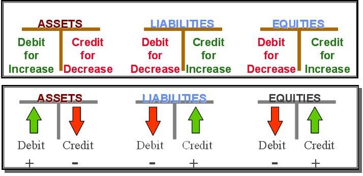

## Table of Contents

## What is a general ledger and why is it important in accounting?

A general ledger is like a big notebook where a business keeps track of all its money activities. It records all the money that comes in and goes out, organized into different accounts like sales, expenses, and assets. Each account in the general ledger shows the details of transactions, helping the business understand where its money is coming from and where it's going.

The general ledger is important in accounting because it gives a complete picture of a business's financial health. By looking at the general ledger, accountants can prepare financial statements, like the income statement and balance sheet, which show how well the business is doing. It helps in making sure all the money transactions are recorded correctly, which is crucial for making good business decisions and for tax purposes.

## What are credit and debit balances, and how do they differ?

Credit and debit balances are terms used in accounting to show how money moves in and out of different accounts. A debit balance means that an account has more money coming in than going out. For example, if you put money into your savings account, that's a debit to the savings account because it increases the balance. On the other hand, a credit balance means that an account has more money going out than coming in. If you take money out of your savings account, that's a credit to the savings account because it decreases the balance.

The main difference between credit and debit balances is the effect they have on different types of accounts. For asset accounts, like cash or inventory, a debit increases the balance and a credit decreases it. But for liability accounts, like loans, or equity accounts, like owner's equity, it's the opposite: a credit increases the balance and a debit decreases it. This can be confusing at first, but it's all about keeping the accounting equation balanced: Assets = Liabilities + Equity.

## How do you record transactions in a general ledger?

Recording transactions in a general ledger starts with understanding what each transaction means for your business. When something happens, like you buy supplies or sell a product, you need to figure out which accounts are affected. For example, if you buy supplies with cash, the supplies account goes up (debit) and the cash account goes down (credit). You write down these changes in the general ledger, making sure to put the date of the transaction, a short description, and the amounts that need to be added or subtracted.

After you've figured out which accounts to change, you actually record the transaction in the general ledger. Each account in the ledger has its own page or section where you list all the transactions that affect it. You write the date, a brief description of what happened, and then the amount you're adding or taking away. If you're adding to the account, you put the amount on the debit side; if you're taking away, you put it on the credit side. At the end of a period, like a month, you add up all the debits and credits to see the new balance for each account. This helps you keep track of everything and make sure your records are correct.

## What is the basic formula for calculating account balances in a general ledger?

The basic formula for calculating account balances in a general ledger is pretty simple. You take all the money that comes into an account, which we call debits, and subtract all the money that goes out, which we call credits. The difference between the two is the account balance. If debits are more than credits, the account has a debit balance. If credits are more than debits, the account has a credit balance.

For example, if you have a cash account and you start with $1,000, and then you add $500 more (a debit), your new balance is $1,500. If you then spend $300 (a credit), you subtract that from $1,500, and your new balance is $1,200. It's just like keeping track of money in your wallet: you add what you put in and take away what you spend, and that's how you know how much money you have left.

## How do you determine if an account has a credit or debit balance?

To figure out if an account has a credit or debit balance, you need to look at the total amounts of money added to and taken away from the account. When you add money to an account, it's called a debit. When you take money away, it's called a credit. If the total amount of debits is more than the total amount of credits, the account has a debit balance. If the total amount of credits is more than the total amount of debits, the account has a credit balance.

For example, let's say you have a bank account and you start with $100. If you put in another $50, that's a debit because you're adding money. Now your account has $150. If you then take out $30, that's a credit because you're taking money away. Your new balance is $120. Since the total debits ($150) are more than the total credits ($30), your account has a debit balance of $120. It's like keeping track of your piggy bank: you add up what you put in and subtract what you take out to see what's left.

## Can you explain the double-entry system in relation to general ledgers?

The double-entry system is a way of keeping track of money in a business that makes sure everything balances out. When you do something with money, like buying supplies or selling a product, you need to write it down in two different places in the general ledger. This is because every transaction affects two accounts: one goes up and the other goes down. For example, if you buy supplies with cash, the supplies account goes up because you have more supplies, and the cash account goes down because you spent money. This way, you make sure that the total amount of money in your business stays the same, even though it moves around between different accounts.

Using the double-entry system helps you keep your records accurate and makes it easier to spot mistakes. If you add up all the accounts that should go up (debits) and all the accounts that should go down (credits), they should be equal. This is called the accounting equation: Assets = Liabilities + Equity. If they're not equal, you know something is wrong and you need to fix it. By recording every transaction in two places, you can see a clear picture of where your money is coming from and where it's going, which helps you make good decisions about your business.

## What are common errors to watch out for when calculating credit and debit balances?

When calculating credit and debit balances, one common error is mixing up which accounts should be debited and which should be credited. For example, if you buy something with cash, you need to debit the supplies account and credit the cash account. If you get this backwards, your balances will be off. Another mistake is not recording all parts of a transaction. In the double-entry system, every transaction affects two accounts, so if you only record one side, your [books](/wiki/algo-trading-books) won't balance.

Another error to watch out for is simple math mistakes. Adding or subtracting the wrong amounts can lead to incorrect balances. It's important to double-check your calculations to make sure they're right. Also, be careful with timing errors, like recording a transaction on the wrong date. This can mess up your financial reports and make it hard to see what's really happening with your money. By being careful and checking your work, you can avoid these common errors and keep your general ledger accurate.

## How do adjustments and closing entries affect the balances in a general ledger?

Adjustments and closing entries are important steps at the end of an accounting period that help make sure the numbers in your general ledger are correct. Adjustments are made to update account balances for things that happened but weren't recorded yet, like when you use supplies or owe money for utilities. For example, if you used supplies during the month but didn't record it, you would make an adjusting entry to decrease the supplies account and increase the expense account. This makes sure your financial statements show the right amounts.

Closing entries are used to reset certain accounts to zero at the end of the period, like revenue, expense, and dividend accounts. This is done so you can start fresh in the new period. When you close these accounts, you move their balances to the retained earnings account, which is part of the equity section. For example, if your business made $5,000 in revenue and had $3,000 in expenses, you would close these accounts by moving the $2,000 difference (net income) to retained earnings. This helps keep your general ledger organized and makes it easier to see how your business is doing over time.

## What tools or software can assist in managing and calculating general ledger balances?

There are many tools and software options that can help you manage and calculate general ledger balances. One popular choice is QuickBooks, which is easy to use and helps small businesses keep track of their money. It lets you record transactions, make adjusting entries, and see your general ledger balances all in one place. Another option is Microsoft Excel, which is great if you like working with spreadsheets. You can set up your own general ledger in Excel and use formulas to calculate balances automatically.

Another tool that's really helpful is Xero, which is known for being user-friendly and working well with other apps. Xero helps you keep your general ledger up to date and makes it easy to see your financial reports. For bigger businesses, software like SAP or Oracle Financials can be used. These programs are more complex but can handle a lot of transactions and give you detailed reports. No matter which tool you choose, the important thing is that it helps you keep your general ledger accurate and up to date.

## How do you reconcile discrepancies in credit and debit balances?

When you find that your credit and debit balances don't match up, the first thing to do is to look over all your transactions carefully. Go through your general ledger and check each entry to make sure you wrote down the right amounts and put them in the right accounts. Sometimes, you might find a simple mistake like adding a number wrong or putting a debit where there should be a credit. If you find any errors, fix them right away. This might mean changing an entry or adding a new one to correct the mistake.

If you can't find any obvious errors, you might need to look at your bank statements or other records to see if there's something you missed. Sometimes, transactions can take a few days to show up in your bank account, so you might need to wait and check again later. Another thing to do is to use a trial balance, which is a list of all your account balances. If the total debits and credits on the trial balance don't match, you know you need to keep looking for the problem. Once you find and fix the issue, your general ledger should balance out, and your financial records will be correct again.

## What advanced techniques can be used to analyze trends in credit and debit balances over time?

One advanced technique to analyze trends in credit and debit balances over time is to use ratio analysis. This means looking at different numbers in your general ledger and comparing them to see how they change. For example, you can calculate the current ratio, which is your current assets divided by your current liabilities. If this number goes up over time, it means your business is getting better at paying its short-term bills. Another useful ratio is the debt-to-equity ratio, which shows how much of your business is funded by debt compared to what you own. By tracking these ratios month by month or year by year, you can see if your business is getting healthier or if there are problems you need to fix.

Another technique is to use trend analysis, where you look at the changes in your account balances over a period of time. You can make charts or graphs to see how your revenue, expenses, and other accounts are growing or shrinking. For example, if you see that your sales account is going up steadily, that's a good sign your business is doing well. On the other hand, if your expenses are going up faster than your revenue, you might need to find ways to cut costs. By using software tools to create these visualizations, you can easily spot patterns and make better decisions about where to focus your efforts in the future.

## How do international accounting standards impact the calculation of credit and debit balances in multinational corporations?

International accounting standards, like the ones set by the International Financial Reporting Standards (IFRS), can change how multinational corporations calculate their credit and debit balances. These standards make sure that businesses all over the world follow the same rules when they record their money transactions. For example, IFRS might have different rules for how to record things like revenue or expenses compared to what a company might be used to in its home country. This means that a multinational corporation has to learn and follow these new rules, which can affect how they put numbers into their general ledger and how they calculate the balances of their accounts.

When a multinational corporation follows international standards, it makes their financial reports easier to understand and compare with other companies around the world. This can help investors and other people see how well the company is doing, no matter where they are. But it can also make things more complicated for the company's accountants, because they need to keep track of different rules for different countries and make sure everything adds up correctly. In the end, using international standards helps keep the company's financial information clear and consistent, even if it takes a bit more work to get the numbers right.

## References & Further Reading

[1]: ["Financial Accounting and Reporting"](https://www.investopedia.com/terms/f/financialaccounting.asp) by Barry Elliott and Jamie Elliott

[2]: ["Advanced Financial Accounting"](https://www.mheducation.com/highered/product/advanced-financial-accounting-christensen-cottrell/M9781260772135.html) by Richard Lewis and David Pendrill

[3]: Lovric, L. (2011). ["Financial Accounting: An Introduction"](https://books.google.com/books/about/Financial_Accounting_An_Introduction_to.html?id=fYsWAAAAQBAJ). Nova Science Publishers, Inc.

[4]: Aldridge, I. (2013). ["High-Frequency Trading: A Practical Guide to Algorithmic Strategies and Trading Systems"](https://books.google.com/books/about/High_Frequency_Trading.html?id=8QpIsVUMhmEC). Wiley.

[5]: Narang, R. K. (2009). ["Inside the Black Box: The Simple Truth About Quantitative Trading"](https://onlinelibrary.wiley.com/doi/book/10.1002/9781118267738). Wiley.

[6]: Fabozzi, F. J., Focardi, S. M., & Kolm, P. N. (2010). ["Quantitative Equity Investing: Techniques and Strategies"](https://www.semanticscholar.org/paper/Quantitative-Equity-Investing%3A-Techniques-and-Fabozzi-Focardi/1c49a2a53919f7e65cb96f16691b8ff726fd3cd7). Wiley.