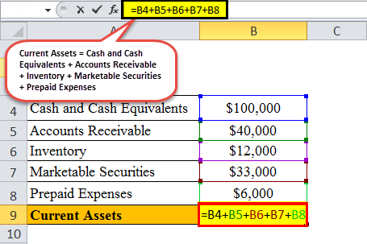

Financial analysis is a critical component of business strategy and decision-making, providing insights into a company's performance, stability, and profitability. It involves evaluating financial data to understand a business's strengths and weaknesses, forecast future performance, and make informed decisions. One key aspect of financial analysis is the examination of a company's liabilities, particularly current liabilities. 

Current liabilities are obligations a company expects to settle within a year, and they include items such as accounts payable, short-term debt, and other financial obligations due in the near term. Monitoring these liabilities is crucial for assessing a company's liquidity — its ability to meet short-term obligations without raising additional capital. In financial assessments, current liabilities are instrumental in determining a company's working capital, defined as current assets minus current liabilities. A robust understanding of working capital is vital for maintaining financial health, ensuring that a company can meet its short-term commitments, and planning for future growth.



Excel is a versatile tool widely used for financial calculations and analysis due to its powerful computation abilities, user-friendly interface, and extensive range of functions. Financial analysts rely on Excel to organize data, perform complex calculations, and visualize financial metrics through charts and graphs. Its capabilities enable analysts to efficiently track current liabilities, calculate ratios like the current ratio and quick ratio, and run various financial models that support business decision-making processes.

Algorithmic trading represents a significant evolution in the finance sector, leveraging computer algorithms to execute trades at speeds and frequencies that are unmanageable by human traders alone. This approach relies heavily on financial analysis, as algorithms are designed to execute trades based on quantitative data and predefined criteria. Effective algorithmic trading systems integrate robust financial analysis to inform trading strategies and manage risks. Mismanagement of elements such as current liabilities can adversely affect these strategies, highlighting the intersection of financial analysis with algorithmic trading.

This article explores these essential concepts, beginning with a detailed examination of current liabilities, their impact on liquidity, and their significance in assessing financial stability. It further elaborates on Excel's role as a powerful tool for financial calculations, offering guidance on tracking liabilities efficiently. Additionally, the article introduces algorithmic trading, its reliance on financial data, and the importance of integrating sound financial analysis into trading systems. By the end, readers will gain insights into practical strategies for employing financial analysis in Excel and algorithmic trading environments, encouraging the adoption of these practices for enhanced business outcomes.

## Table of Contents

## Understanding Current Liabilities

Current liabilities are financial obligations a company must settle within one year or one operating cycle, whichever is longer. These liabilities are crucial indicators of a company's short-term financial health and liquidity position. Common examples of current liabilities include accounts payable, short-term debt, the current portion of long-term debt, accrued liabilities, and taxes owed. These liabilities are presented on a company's balance sheet and are essential for assessing its ability to meet short-term obligations.

Current liabilities significantly impact a company's [liquidity](/wiki/liquidity-risk-premium) and working capital management. Liquidity refers to a firm's ability to convert its assets into cash to cover its short-term liabilities. Working capital, calculated as the difference between current assets and current liabilities, further assesses this liquidity. Formulaically, working capital is expressed as:

$$
\text{Working Capital} = \text{Current Assets} - \text{Current Liabilities}
$$

An efficient working capital management strategy ensures that a company has enough liquid resources to meet its short-term liabilities, indicating good financial health and operational efficiency. 

Monitoring current liabilities is vital for maintaining financial health. By regularly updating and reviewing their liability accounts, businesses can avoid cash flow problems that may arise from misaligned or unforeseen financial commitments. Accurate recording and calculation of current liabilities ensure transparency, allowing stakeholders to make informed decisions regarding a company's financial stability and investment potential. 

Errors or discrepancies in recording current liabilities can significantly impact financial stability. Overstated liabilities might deter potential investors, while understated liabilities could lead to liquidity crises. Therefore, it is essential for businesses to maintain meticulous financial records and perform precise calculations to present a true financial position. This rigorous accounting approach helps in strategic planning, resource allocation, and maintaining creditor confidence. 

Thus, management must prioritize sound accounting practices for current liabilities to ensure the company can cover its debts and continue operating smoothly.

## Excel for Financial Calculations

Excel is an essential tool for financial analysts due to its ability to handle complex financial calculations with great precision and flexibility. It serves as a powerful platform for tracking and analyzing current liabilities, enabling businesses to maintain a clear understanding of their financial health.

To effectively use Excel for tracking current liabilities, the following step-by-step guide can be followed:

1. **Setting Up a Spreadsheet**: Start by opening a new Excel workbook and label the columns to capture relevant data. Essential columns might include "Description," "Amount," "Due Date," and "Status." This setup helps in organizing the details of each liability distinctly.

2. **Data Entry**: Enter the details of current liabilities under the respective columns. Keep this information updated as it plays a crucial role in accurate financial analysis.

3. **Using Key Excel Functions**: Excel provides a variety of functions that are particularly useful for financial analysis:
   - **SUM Function**: This function adds up all the figures in a column or row, providing a total. For instance, `=SUM(B2:B10)` calculates the total liabilities listed in cells B2 through B10.
   - **VLOOKUP Function**: This function searches for specific data across your spreadsheet. For example, `=VLOOKUP("Account Payable", A2:B10, 2, FALSE)` finds the amount associated with "Account Payable."
   - **IF Formula**: Useful for conditionally analyzing data. For instance, `=IF(D2="Due", B2, 0)` can determine the amount due, simplifying prioritization of liabilities.

4. **Creating Charts and Graphs**: Visual representation of data can simplify interpretation and highlight key trends:
   - To create a chart, select the data range and navigate to the "Insert" tab. Choose a chart type, such as a bar chart or pie chart, that suits your data. For example, a pie chart could be used to illustrate the proportion of each liability in relation to the total liabilities.
   - Customize your chart with titles and labels to ensure clarity. Excel's built-in tools allow adjustments such as formatting and style changes to enhance readability.

Excel’s utility extends beyond mere calculations; it fosters an environment where financial data can be dynamically analyzed and presented in a clear, visual manner. By leveraging Excel's robust functionalities, analysts can equip themselves with valuable insights, ensuring proactive management of current liabilities and more informed financial decision-making processes.

 to Algorithmic Trading

Algorithmic trading refers to the use of computer algorithms to automate and execute trading strategies in financial markets. It has become a significant component of the financial industry due to its ability to process vast amounts of data and execute trades at speeds and frequencies that are humanly impossible. The growth of [algorithmic trading](/wiki/algorithmic-trading) is driven by advances in technology, increased market complexity, and the need for efficiency and precision in trade execution.

One of the fundamental aspects of algorithmic trading is its reliance on quantitative analysis and real-time data processing. Quantitative analysis involves using mathematical and statistical models to identify trading opportunities by assessing historical data and predicting future price movements. Real-time data processing ensures that trading algorithms can react instantaneously to market conditions, thereby exploiting short-term opportunities and minimizing risks.

Financial analysis plays a critical role in algorithmic trading by providing the necessary insights for developing and fine-tuning trading algorithms. Financial analysts collect and analyze data to assess market trends, assets' financial health, and economic indicators, which algorithms use to make informed trading decisions. For instance, changes in interest rates, earnings reports, and other financial metrics are inputs that can trigger a buy or sell action within an algorithmic model.

Mismanagement of current liabilities can have severe implications for trading strategies. Current liabilities, which include obligations a company must settle within a year like accounts payable and short-term debt, directly affect a company's liquidity position. If a trading firm or company fails to manage its current liabilities effectively, it could face liquidity crises which might force the firm to liquidate assets at unfavorable prices, impacting the firm's overall trading strategy and financial health.

Therefore, accurate financial analysis and careful management of current liabilities are crucial in algorithmic trading. This ensures that trading algorithms make decisions based on a company's or market's authentic financial state, thereby optimizing trading performance and reducing the risk of financial distress.

## Integrating Financial Analysis and Algo Trading

Integrating sound financial analysis into algorithm trading involves the strategic use of data and models to enhance trading performance. Real-time data analysis is crucial in this integration process. Financial markets are highly dynamic, and trading strategies must adapt quickly to changing conditions. The ability to analyze and react to real-time data allows traders to make informed decisions based on current market trends and fluctuations. This requires robust infrastructure that can handle large volumes of data efficiently.

Accurate financial calculations are the foundation of algorithmic trading strategies. They ensure that decisions are made based on solid quantitative analysis. For instance, evaluating financial metrics, such as liquidity ratios or credit risk, helps in assessing potential market opportunities and risks. Tools like Excel, combined with programming languages like Python, can facilitate these calculations by automating data processing, thereby reducing human error and improving the precision of the algorithms.

Automated systems play a pivotal role in monitoring financial health and executing trading strategies. These systems can track key financial indicators, such as current liabilities or asset turnovers, and use this data to adjust trading strategies in real time. For example, a system could be programmed to buy or sell assets based on liquidity ratios or other critical financial indicators. By automating these decisions, traders can respond swiftly to market changes without manual intervention.

Some notable examples of successful integrations of financial analysis in algorithmic trading systems can be found in the operations of leading financial institutions. For instance, BlackRock’s Aladdin system integrates comprehensive risk management analytics to inform trading decisions, leveraging both historical financial data and real-time market information. Similarly, the Adaptive Market Hypothesis, proposed by Andrew Lo, has been used to develop algorithms that adapt to changing market conditions, integrating financial analysis to modify strategies according to observed liquidity and risk levels.

In conclusion, the integration of financial analysis into algorithmic trading enhances the capability to respond to real-time data and execute trades based on robust calculations. Automated systems further streamline this process, ensuring trading strategies are effective and aligned with financial health monitoring. By leveraging technology and robust data analysis, traders can optimize their strategies for better performance in the financial markets.

## Practical Excel Tips for Financial Analysts in Algo Trading

For financial analysts engaged in algorithmic trading, Excel offers a robust platform for executing complex tasks with efficiency and precision. Excel's capabilities can be significantly enhanced through the use of advanced features such as macros, data linking, and model maintenance, enabling analysts to streamline their processes.

### Excel Macros for Automating Repetitive Calculations

Macros in Excel can automate repetitive tasks, thus saving time and reducing errors. For instance, financial analysts frequently need to update and calculate current liabilities which can be tedious if done manually. By recording a macro or writing VBA (Visual Basic for Applications) scripts, these processes can be automated.

Example VBA code to automate the calculation of total current liabilities might look like this:

```vba
Sub CalculateCurrentLiabilities()
    Dim lastRow As Long
    Dim totalLiabilities As Double
    lastRow = Cells(Rows.Count, "A").End(xlUp).Row
    totalLiabilities = Application.WorksheetFunction.Sum(Range("B2:B" & lastRow))
    Range("C1").Value = totalLiabilities
End Sub
```

This code identifies the last row of data and computes the sum of liabilities listed from B2 to the last populated cell in column B, outputting the total in cell C1.

### Linking Excel with Real-Time Financial Data

Analysts can link Excel with real-time financial data sources to keep analysis up to date. This can be accomplished using Excel's capabilities to integrate with data feeds through tools such as Power Query or third-party APIs. Many financial services provide APIs that allow for seamless integration of live data into Excel spreadsheets.

For example, using Python to fetch real-time data and update Excel, a script utilizing libraries like `pandas` and `openpyxl` might resemble the following:

```python
import pandas as pd
import openpyxl

# Fetch real-time data using a financial data API
data = pd.read_json('https://financialdataapi.com/api/marketdata')

# Load Excel workbook
workbook = openpyxl.load_workbook('financial_data.xlsx')
sheet = workbook.active

# Update Excel with data
for index, row in data.iterrows():
    sheet.append(row.tolist())

workbook.save('financial_data.xlsx')
```

This script imports live data from a hypothetical financial data API and appends it to an existing Excel workbook.

### Maintaining Updated and Accurate Financial Models

Keeping financial models accurate and up-to-date is critical. Use Excel's built-in features such as Data Validation to avoid incorrect data entries. Regularly updating assumptions and verifying data integrity within models is essential to ensure reliability.

Creating dynamic models with cell references, named ranges, and structured tables can provide better control and clarity. For instance, rather than hardcoding values, using cell references ensures that changes in input data automatically update calculations throughout the worksheet.

To stay on top of model accuracy, consider integrating consistent review processes and employing conditional formatting to flag any anomalies in the data visually. Regular audits of formulas and data links can preemptively identify potential discrepancies.

By leveraging these advanced Excel techniques, financial analysts in algorithmic trading can greatly enhance their workflow efficiency, accuracy, and the strategic value of their analyses.

## Conclusion

Financial analysis serves as the backbone of effective business strategy and decision-making. Understanding and managing current liabilities—such as accounts payable and short-term debt—is vital to maintaining a company's financial health. Accurately calculating these liabilities helps safeguard liquidity and promotes efficient working capital management. Excel stands out as an invaluable tool in this domain, offering versatile functionalities for financial calculations. By employing Excel's capabilities, financial analysts can meticulously track and visualize current liabilities, ensuring a precise reflection of a company's financial status.

The fusion of financial analysis with algorithmic trading marks a significant advancement in the financial industry. This integration leverages quantitative analysis and real-time data processing to craft sophisticated trading strategies. The meticulous management of current liabilities can significantly enhance these strategies, providing a solid foundation for profitable trading outcomes.

Financial professionals and traders are encouraged to harness these tools to enhance the accuracy and efficacy of their analyses and trading strategies. By integrating the powers of Excel and advanced algorithmic trading methods, practitioners can propel their financial assessments and trading operations to new heights. This approach not only augments the quality of financial evaluations but also opens the door to innovative trading strategies grounded in sound financial principles.

We encourage you to begin implementing these strategies and tools in your financial practices, leveraging their potential to drive better analysis and superior trading outcomes.

## References & Further Reading

[1]: Bergstra, J., Bardenet, R., Bengio, Y., & Kégl, B. (2011). ["Algorithms for Hyper-Parameter Optimization."](https://dl.acm.org/doi/10.5555/2986459.2986743) Advances in Neural Information Processing Systems 24.

[2]: ["Advances in Financial Machine Learning"](https://www.amazon.com/Advances-Financial-Machine-Learning-Marcos/dp/1119482089) by Marcos Lopez de Prado

[3]: ["Evidence-Based Technical Analysis: Applying the Scientific Method and Statistical Inference to Trading Signals"](https://www.amazon.com/Evidence-Based-Technical-Analysis-Scientific-Statistical/dp/0470008741) by David Aronson

[4]: ["Machine Learning for Algorithmic Trading"](https://github.com/stefan-jansen/machine-learning-for-trading) by Stefan Jansen

[5]: ["Quantitative Trading: How to Build Your Own Algorithmic Trading Business"](https://www.amazon.com/Quantitative-Trading-Build-Algorithmic-Business/dp/1119800064) by Ernest P. Chan