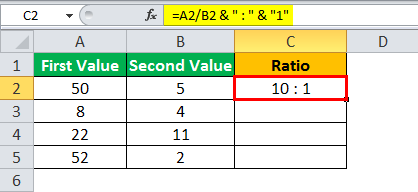

Financial analysis and algorithmic trading have increasingly converged to offer robust strategies for managing and trading assets. At the core of financial analysis lies the evaluation of a company's financial health, where liquidity metrics such as the current ratio play a crucial role. The current ratio, defined as the ratio of a company’s current assets to its current liabilities, assists investors and stakeholders in assessing a company's ability to meet its short-term obligations. This metric is pivotal in providing a snapshot of liquidity and operational efficiency, thereby impacting investment and trading decisions significantly.

Excel emerges as a powerful tool capable of tackling both financial analysis and algorithmic trading. It offers extensive capabilities to model, analyze, and visualize financial data, along with the ability for users to automate and streamline calculations through functions and macros. Excel's versatility allows users to import and manage large financial datasets, perform complex calculations such as the current ratio, and automate these processes to facilitate real-time analysis and decision-making.



The intersection of financial metrics with algorithmic trading is a critical advancement in modern finance. By integrating liquidity ratios like the current ratio into trading algorithms, traders can enhance their decision-making processes. These financial metrics enable traders to account for the underlying financial health of the entities involved, optimizing trading strategies based on robust, data-driven insights. The combination of Excel’s computational power and the integration of crucial financial metrics forms a comprehensive approach to developing sophisticated trading models. This integration facilitates the alignment of financial analysis with strategic trading executions, potentially improving the accuracy and profitability of trading activities. 

As the landscape of financial analysis and trading continually evolves, the ability to seamlessly integrate pertinent financial metrics into algorithmic trading strategies remains invaluable. Excel's diverse functionalities support this integration, fostering enhanced strategies that leverage financial insights and computational precision to better navigate the complexities of financial markets.

## Table of Contents

## Understanding the Current Ratio

The current ratio is a pivotal liquidity metric used in financial analysis to gauge a company's capacity to cover its short-term obligations with its short-term assets. It is calculated by dividing a company’s current assets by its current liabilities:

$$
\text{Current Ratio} = \frac{\text{Current Assets}}{\text{Current Liabilities}}
$$

The primary role of the current ratio is to provide insights into the financial stability of a company over a short period, usually within the next year. By evaluating this ratio, investors and analysts can ascertain whether a company has enough assets to meet its short-term liabilities, such as accounts payable, short-term debt, and other obligations due within a year. A ratio greater than one suggests that the company has more current assets than current liabilities, indicating a relatively stable financial position in terms of [liquidity](/wiki/liquidity-risk-premium).

The ideal value for the current ratio can be subjective and often varies by industry. Generally, a current ratio between 1.2 and 2 is considered healthy, indicating that a company is in a good position to meet its short-term obligations. However, these benchmark values can shift depending on industry standards and the nature of the business. For instance, industries like retail might have lower current ratios due to faster inventory turnover, while capital-intensive industries might maintain higher ratios.

Industry comparisons are crucial when evaluating the current ratio's significance. For example, comparing the current ratio to industry standards helps in identifying a company's financial position relative to its competitors. A current ratio significantly lower than the industry average might signal liquidity issues, whereas a higher ratio might suggest either excellent liquidity or potentially inefficient asset management.

Assessing the current ratio is an integral part of financial analysis, offering critical insights into risk evaluation. A low current ratio could signal potential liquidity problems and heightened financial risk, indicating that the company might struggle to pay its short-term liabilities. Conversely, an excessively high current ratio might also raise concerns, as it could imply that a company is not effectively using its assets to generate revenue.

In summary, the current ratio is a vital metric for determining a company's ability to utilize short-term assets to cover short-term liabilities, providing a quick snapshot of its financial health. This ratio aids analysts in comparing companies within the same industry and assessing potential financial risks associated with a particular investment, making it a fundamental tool in financial analysis.

## Using Excel to Calculate the Current Ratio

To calculate the current ratio using Excel, you can efficiently import financial data, apply calculations, and automate processes for large data sets. The current ratio, a liquidity metric used to evaluate a company's ability to cover short-term obligations, is calculated by dividing current assets by current liabilities. Here, we outline the steps and formula usage in Excel.

### Step-by-Step Instructions to Import Financial Data into Excel

1. **Obtain Financial Data**: Start by gathering financial data that includes the balance sheet, typically in a CSV or Excel format. Ensure that the data includes current assets and current liabilities.

2. **Open Excel**: Launch Microsoft Excel and open a new workbook.

3. **Import Data**:
   - Go to the “Data” tab in Excel's ribbon.
   - Click on “Get Data” if starting with a clean sheet.
   - Select the appropriate option such as “From Text/CSV” if your data is in a CSV file. This will open a dialog box to locate and select your data file.
   - Follow the import wizard to load your data into Excel. For Excel files, select “Existing Connections” or use “From Workbook”.

4. **Organize Data**: Arrange the imported data properly. You might need to label columns for clarity. Typically, have columns labeled as “Current Assets” and “Current Liabilities”.

### Formula for Calculating the Current Ratio

In Excel, the formula to calculate the current ratio is straightforward:

$$
\text{Current Ratio} = \frac{\text{Current Assets}}{\text{Current Liabilities}}
$$

### Structuring Data Cells and Applying Formulas

1. **Data Structuring**:
   - Place the current assets in column B and current liabilities in column C. Suppose your data starts from row 2 (row 1 being headers). You have `B2` for current assets and `C2` for current liabilities.

2. **Applying the Formula**:

   - In cell `D2`, enter the formula to calculate the current ratio for each row of data:

     ```
     =B2/C2
     ```

   - Drag the bottom-right corner of cell `D2` downwards to apply this formula to other rows, automatically calculating the current ratio for each entry.

### Automating Calculations for Large Data Sets

Excel’s powerful capabilities allow for automation, which is crucial when dealing with large data sets:

1. **Use of Excel Tables**:
   - Convert your data range into an Excel Table by highlighting your data and pressing `Ctrl + T`. This allows for the easy application of formulas across the entire column automatically.

2. **Conditional Formatting**:
   - For a quick visual analysis, apply conditional formatting to the column containing the current ratios. For instance, to highlight ratios below an ideal benchmark, navigate to "Home" > "Conditional Formatting" and set a rule.

### Additional Automation Features

1. **Macros for Repetitive Tasks**: 
   - Record a macro if you're performing repetitive tasks like updating data monthly. Excel's macro recorder captures your steps, letting you replay them with a click.

2. **Pivot Tables for Summary**: 
   - Create pivot tables to summarize and analyze data trends, focusing on changes in current ratios over different periods.

By following these steps, you can leverage Excel’s capabilities to efficiently calculate, analyze, and automate financial data processing, enhancing your ability to track and assess liquidity through the current ratio.

## Excel in Algorithmic Trading

Excel has been instrumental in democratizing access to [algorithmic trading](/wiki/algorithmic-trading) by providing a user-friendly interface that supports both [backtesting](/wiki/backtesting) and signal generation. With its powerful computational capabilities and extensive library of functions, Excel serves as a practical platform for developing, testing, and refining trading strategies.

### Backtesting and Signal Generation

Backtesting involves simulating a trading strategy using historical data to evaluate its performance before employing it in real-world scenarios. Excel enables traders to conduct backtesting by leveraging its data manipulation and formula application capabilities. Users can import historical market data, apply trading algorithms, and analyze the results—all within the framework of Excel spreadsheets.

### Key Excel Functions and Formulas for Algorithmic Strategies

Several Excel functions are particularly useful for crafting algorithmic trading strategies:

1. **LOOKUP and INDEX-MATCH**: These functions are essential for pulling data based on specific criteria, such as retrieving historical prices corresponding to given dates.

2. **IF and AND**: These conditional statements help create trading signals. For example, using `=IF(AND(current_ratio > 1, price_momentum > threshold), "Buy", "Hold")` can generate a buy signal when certain conditions are met.

3. **LINEST and TREND**: These functions perform linear regression, assisting in trend analysis to forecast future price movements.

4. **RSI and MOVING AVERAGE**: While not native Excel functions, these can be computed with custom formulas to help identify market conditions like overbought or oversold scenarios.

### Establishing Data Connections for Live Trading Signals

Excel provides the capability to connect with live data feeds through techniques such as:

- **Data Connection Wizards**: These tools facilitate importing live data from external databases or the web, allowing traders to update their datasets in real time.

- **VBA and Macros**: Visual Basic for Applications (VBA) can automate tasks such as fetching live data from APIs. A simple VBA script can be used to refresh data at specified intervals, ensuring that the trading model uses the most current information.

### Coding Simple Trading Strategies in Excel

Excel can be used to code simple trading strategies, such as moving averages crossovers. Here's a conceptual breakdown:

1. **Data Import**: Use Excel's data connection features to import historical price data.

2. **Calculate Moving Averages**: Create two columns to compute short-term and long-term moving averages using formulas, e.g., `=AVERAGE(B2:B6)` for a 5-day average.

3. **Generate Trading Signals**: Use an IF formula to identify crossover points where the short-term average exceeds the long-term average as a buy signal, and vice versa for a sell signal.

4. **Performance Analysis**: Utilize Excel's charting tools to visualize the strategy's performance over time, allowing for visual verification of strategy effectiveness.

In conclusion, Excel's robust functionality extends beyond simple data analysis, making it a valuable asset in algorithmic trading. By combining its powerful formulas, live data connections, and capacity to automate complex computations, Excel empowers users to experiment with algorithmic strategies and optimize them before deployment in the market.

## Combining Financial Analysis and Algo Trading

Integrating financial analysis into algorithmic trading involves the incorporation of financial metrics, such as the current ratio, into trading strategies to enhance decision-making processes. The current ratio is a liquidity metric: it measures a company’s ability to cover its short-term liabilities with its short-term assets. This information is pivotal in crafting trading strategies that are both robust and adaptive to market conditions.

### Liquidity Metrics Impact on Trading Decisions

Liquidity metrics like the current ratio provide insights into a company’s financial health, significantly influencing trading decisions. For instance, a company with a declining current ratio may signal impending liquidity issues, potentially affecting stock price negatively. Conversely, an improving current ratio may indicate strengthening financial health, possibly leading to stock appreciation. Traders can capitalize on these trends by timing their trades to either capitalize on potential gains or avoid losses.

Algorithmic trading strategies can explicitly incorporate these metrics by using them as filters or signals for trades. For example, an algorithm could be designed to only consider stocks for long positions if their current ratio is above a predetermined threshold, indicating strong liquidity support.

### Scenarios Where Financial Health Impacts Algorithmic Choices

Incorporating financial health metrics into trading models enables algorithms to make informed decisions under varying market conditions. For example, during economic downturns, companies with strong liquidity (high current ratios) may be preferable investment choices due to their higher likelihood of weathering financial storms. Conversely, in bullish markets, companies with weaker liquidity positions might offer higher potential returns due to the increased risk, thus suitable for risk-tolerant trading algorithms.

Moreover, deteriorating corporate liquidity could signal broader sectoral weaknesses, prompting a strategic shift in algorithmic portfolios away from sectors displaying adverse trends. Conversely, improving liquidity metrics across a sector could foreshadow upcoming growth opportunities, guiding algorithms to adjust their positions accordingly.

### Pathways for Developing Sophisticated Trading Models Using Excel

Excel can be an excellent platform for integrating financial ratios into algorithmic trading strategies. By leveraging Excel's computational and data management capabilities, traders can develop sophisticated models that incorporate liquidity metrics into their decision-making processes.

A basic example involves setting up a spreadsheet to track financial data and compute current ratios automatically. With Excel's built-in functionalities such as pivot tables and conditional formatting, traders can easily filter and sort companies based on their financial health metrics. These features can be used to identify stocks that meet specific liquidity criteria, which are then considered for further technical analysis.

Moreover, by combining Excel with Visual Basic for Applications (VBA), traders can automate the application of these criteria and the execution of trades. For example, a VBA script could be written to check each stock’s current ratio against the threshold and generate a buy or sell signal accordingly. The script could also be coded to pull in real-time data from external sources, ensuring that the calculations are based on the most current information.

```python
import pandas as pd

# Define a function to calculate current ratio
def calculate_current_ratio(current_assets, current_liabilities):
    return current_assets / current_liabilities

# Example DataFrame of stock data
data = pd.DataFrame({
    'Company': ['Company A', 'Company B', 'Company C'],
    'Current Assets': [150000, 120000, 100000],
    'Current Liabilities': [75000, 60000, 120000]
})

# Apply the function to calculate current ratio for each company
data['Current Ratio'] = calculate_current_ratio(data['Current Assets'], data['Current Liabilities'])

# Filter companies with a specific current ratio threshold
threshold = 1.5
filtered_data = data[data['Current Ratio'] > threshold]

print(filtered_data)
```

The use of Excel should be considered a stepping stone to more advanced tools as trading strategies grow in complexity. This progression can involve transitioning to more powerful platforms or languages, such as Python, for better performance and more sophisticated data manipulation and analysis capabilities. Nonetheless, Excel provides an accessible and cost-effective starting point for integrating financial analysis into algorithmic trading.

## Case Study: Building a Trading System in Excel

Creating a basic algorithmic trading model in Excel involves several steps, starting from data collection to analysis and signal generation. This process begins with gathering the necessary financial and market data, followed by analyzing this data to develop a trading strategy. Each stage of the process can be implemented and executed efficiently using Excel's functionalities.

### Data Collection

The first step in building a trading system is to collect the historic trading data of the stocks or financial instruments of interest. Excel allows for importing data from various sources, such as CSV files or through data import tools that connect to online financial databases like Yahoo Finance or Google Finance. Leveraging Excel's capability to import data ensures a streamlined, organized dataset that forms the basis for analysis.

### Data Analysis

Once the data is collected, the next step is analyzing it to develop a trading strategy. This involves calculating key indicators and metrics that can help in making trading decisions. For example, moving averages (e.g., 50-day or 200-day moving averages) are often used in technical analysis. These can be calculated using Excel formulas:

```excel
=AVERAGE(B2:B51)  // For a 50-day moving average
```

### Signal Generation

Based on the calculated indicators, trading signals can be generated. Signals often depend on the crossing of different moving averages. For instance, a buy signal may be generated when a short-term moving average crosses above a long-term moving average. Excel's IF function can be used to create such logic-driven signals:

```excel
=IF(AND(SHORT_TERM_MA>CURRENT_PRICE, LONG_TERM_MA<CURRENT_PRICE), "BUY", IF(AND(SHORT_TERM_MA<CURRENT_PRICE, LONG_TERM_MA>CURRENT_PRICE), "SELL", "HOLD"))
```

### Backtesting the Trading Model

Backtesting is essential to assess the robustness and potential profitability of the trading model. This involves applying the trading signals to historical data and calculating the resultant profits or losses. Excel can simulate trades based on the signals and calculate the return on investment (ROI). A basic Excel formula for ROI could be:

```excel
=(EndingValue - InitialInvestment) / InitialInvestment
```

The past performance of the strategy can be evaluated by comparing the ROI across different periods.

### Improvements and Optimizations

After backtesting, reviewing the model's performance can highlight areas for improvement. Strategies could be refined by adjusting the parameters of indicators, such as the window length for moving averages, or incorporating additional metrics, such as the current ratio, to enhance decision-making on liquidity aspects. Moreover, visualizing data through charts in Excel can help identify patterns and refine the strategy further. Excel's features, such as pivot tables and conditional formatting, also aid in deeper analysis and visualization.

### Conclusion

Implementing a basic algorithmic trading model in Excel requires systematic data handling, analytical rigor, and careful backtesting. While Excel provides an excellent platform for beginners to grasp the fundamentals of algorithmic trading, advanced strategies may demand external programming interfaces and real-time data processing tools. Nevertheless, the iterative process of testing and enhancing strategies in Excel is invaluable for honing analytical skills and understanding trading dynamics.

## Conclusion and Best Practices

The interplay between financial analysis and algorithmic trading forms a powerful synergy for investors and traders, enhancing both strategic decision-making and operational efficiency. The integration of comprehensive financial metrics, such as the current ratio, with algorithmic trading models enriches the depth of analysis and provides a robust foundation for evaluating investment opportunities.

Excel's dual capacity as a tool for financial analysis and algorithmic trading is particularly notable. Its versatility allows users to import, manipulate, and analyze large datasets effectively, supporting the automation of complex calculations and data-driven insights. When utilized optimally, Excel can consolidate and process diverse financial metrics to develop and refine trading models.

To maintain and enhance Excel-based trading systems, several best practices should be observed:

1. **Data Integrity and Consistency**: Regularly update and verify the accuracy of your financial data inputs. Inaccurate data can lead to erroneous trading signals and poor decision-making.

2. **Modular Design**: Organize Excel models using a modular approach, allowing for easier debugging and scalability. Separate data input, processing, and output layers to streamline workflow and ensure clarity.

3. **Automation with Macros**: Leverage Excel macros to automate repetitive tasks. This not only saves time but also minimizes the risk of human error in the manual updating of data and calculations.

4. **Backtesting and Validation**: Regularly backtest trading strategies to assess their efficacy under different market conditions. Use historical data to validate the performance of your models and make necessary adjustments.

5. **Risk Management**: Incorporate financial risk management techniques within your models. This might include setting stop-loss orders, diversifying portfolios, or adjusting positions based on calculated financial ratios like the current ratio.

6. **Continuous Learning and Adaptation**: The financial markets and technologies are constantly evolving. Stay informed about new trends, tools, and methodologies in financial analysis and algorithmic trading. Upgrading and adapting your models is crucial for staying competitive in dynamic market environments.

In conclusion, Excel serves as a multifaceted tool that bridges the gap between traditional financial analysis and modern algorithmic trading strategies. By adhering to best practices and fostering a culture of continuous development, traders and analysts can maximize the effectiveness of their strategies and adapt swiftly to the ever-changing financial landscape.

## FAQs

### What is a good current ratio benchmark for different industries?

The current ratio is a financial liquidity metric that compares a company’s current assets to its current liabilities. It is calculated as:

$$
\text{Current Ratio} = \frac{\text{Current Assets}}{\text{Current Liabilities}}
$$

A good benchmark for the current ratio can vary significantly across industries due to differing capital requirements and operational structures. For instance, industries with substantial inventory, such as retail or manufacturing, typically exhibit higher current ratios. A ratio between 1.5 and 3 is often considered healthy in these sectors. Conversely, industries like technology or utilities, where less capital is tied up in inventory, might have acceptable current ratios closer to 1. An industry-specific comparison remains vital for a nuanced financial analysis.

### How does the current ratio affect algorithmic trading decisions?

In algorithmic trading, the current ratio can be integrated as a parameter within trading strategies to assess a company's liquidity and potential risk. A lower current ratio might indicate potential liquidity issues, suggesting a higher risk profile, which could affect an algorithm’s decision to buy, hold, or sell a stock. Conversely, companies with a higher, industry-appropriate current ratio might be viewed as financially stable, influencing strategy parameters that favor long positions. Including such financial metrics can help algorithms in screening and filtering investments aligning with traders' risk appetites.

### Can Excel handle real-time trading data efficiently for algo strategies?

Excel can manage real-time trading data, but it is not the most ideal platform for high-frequency trading due to latency and efficiency limitations. Tools like Excel's Real-Time Data (RTD) function or Data Streamers from financial service providers can facilitate real-time data integration; however, performance usually lags compared to specialized trading platforms. Excel is more suited for lower-frequency trading strategies where real-time processing is less critical. Advanced users might augment Excel with VBA or Power Query to automate data handling, but these adaptations may still fall short of the requirements for ultra-fast trading environments.

### What are the limitations of using Excel for financial analysis and trading?

Excel's limitations for financial analysis and trading primarily stem from its scalability and performance issues when managing vast datasets and real-time processing needs. While it excels in calculation adaptability and data visualization, its capacity is stretched in scenarios with extensive data points or complex algorithmic models. Furthermore, Excel does not inherently support automatic trade execution or the rapid data refresh rates crucial for high-frequency trading. Reliance on external plugins or bespoke VBA code can introduce stability risks and complexities in implementation. For comprehensive trading systems, dedicated platforms offering robust data handling, security, and predefined trading infrastructures are recommended.

## References & Further Reading

[1]: ["Financial Modeling in Excel For Dummies"](https://www.dummies.com/book/technology/software/microsoft-products/excel/financial-modeling-in-excel-for-dummies-281721/) by Danielle Stein Fairhurst

[2]: ["Excel 2019 Bible"](https://onlinelibrary.wiley.com/doi/book/10.1002/9781119549376) by Michael Alexander, Richard Kusleika, and John Walkenbach

[3]: Benninga, S. (2014). ["Financial Modeling"](https://www.amazon.com/Financial-Modeling-Press-Simon-Benninga/dp/0262027283). MIT Press.

[4]: ["Algorithmic Trading: Winning Strategies and Their Rationale"](https://www.amazon.com/Algorithmic-Trading-Winning-Strategies-Rationale-ebook/dp/B00CY5HC0U) by Ernest P. Chan

[5]: Hill, J., Pruitt, G., & Hill, T. (2011). ["The Ultimate Algorithmic Trading System Toolbox + Website: Using Today's Technology To Help You Become A Better Trader."](https://www.amazon.com/Building-Winning-Trading-Systems-Tradestation/dp/1118168275) Wiley Trading.