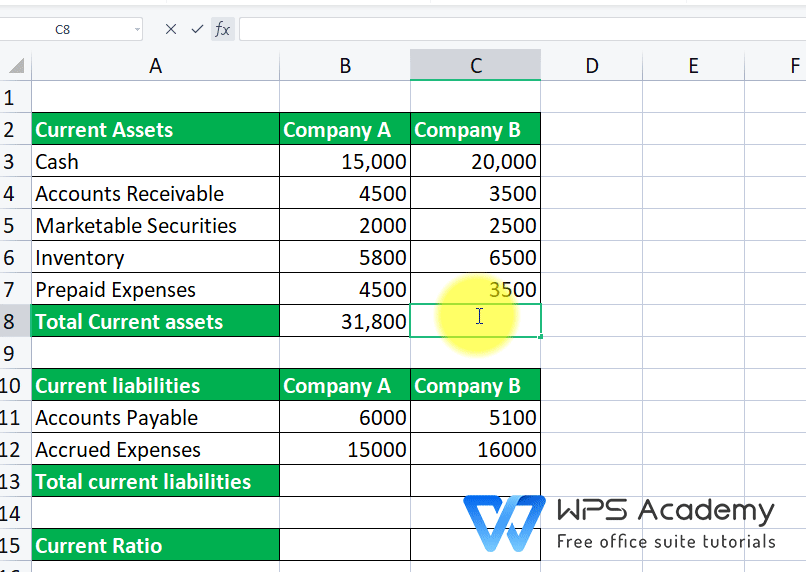

## Table of Contents

## What is the current ratio and why is it important?

The current ratio is a financial measure that shows how well a company can pay its short-term debts with its short-term assets. It is calculated by dividing a company's current assets by its current liabilities. Current assets are things like cash, inventory, and money owed to the company that can be turned into cash within a year. Current liabilities are debts and other obligations that need to be paid within a year.

This ratio is important because it helps to understand if a company has enough resources to cover its immediate financial obligations. A higher current ratio means the company is in a better position to pay off its short-term debts, which can make it seem more stable and less risky to investors and creditors. However, a very high current ratio might also mean the company is not using its assets efficiently. A lower current ratio might indicate potential financial trouble, but it depends on the industry and other factors.

## How do you find the formula for calculating the current ratio?

The formula for calculating the current ratio is simple. You just divide a company's current assets by its current liabilities. Current assets are things like cash, inventory, and money that people owe the company, which can be turned into cash within a year. Current liabilities are the debts and other bills that need to be paid within a year.

This formula helps to see if a company can pay its short-term bills. If the current ratio is high, it means the company has more than enough money and assets to cover its debts. If it's low, it might mean the company could have trouble paying its bills on time. But what's considered a good current ratio can be different depending on the type of business.

## What are the components needed to calculate the current ratio in Excel?

To calculate the current ratio in Excel, you need two main pieces of information: the total current assets and the total current liabilities of a company. Current assets include things like cash, inventory, and any money that is owed to the company which can be turned into cash within a year. Current liabilities are the debts and other bills that the company needs to pay within a year. You can find these numbers in the company's balance sheet, which is part of its financial statements.

Once you have these numbers, you can enter them into Excel. In one cell, you put the total current assets, and in another cell, you put the total current liabilities. Then, in a third cell, you can use a simple formula to calculate the current ratio. The formula is just the cell with the current assets divided by the cell with the current liabilities. For example, if the current assets are in cell A1 and the current liabilities are in cell B1, you would type "=A1/B1" into another cell to get the current ratio. This will show you if the company has enough short-term assets to cover its short-term debts.

## How do you input financial data into an Excel spreadsheet for current ratio calculation?

To input financial data into an Excel spreadsheet for calculating the current ratio, start by opening a new Excel workbook. In the first cell of the first column, like A1, type "Current Assets." In the cell below it, like A2, enter the total value of the company's current assets. These are things like cash, inventory, and money owed to the company that can be turned into cash within a year. You can find this number in the company's balance sheet. Next, move to the second column. In the first cell of this column, like B1, type "Current Liabilities." In the cell below it, like B2, enter the total value of the company's current liabilities. These are the debts and other bills that need to be paid within a year, also found in the balance sheet.

Once you have entered the values for current assets and current liabilities, you can calculate the current ratio. In a new cell, like C1, type "Current Ratio." In the cell below it, like C2, enter the formula to calculate the current ratio. The formula is simply the cell with the current assets divided by the cell with the current liabilities. So, if your current assets are in A2 and your current liabilities are in B2, you would type "=A2/B2" into C2. This will give you the current ratio, showing how well the company can pay its short-term debts with its short-term assets.

## What are the steps to calculate the current ratio using basic Excel functions?

To calculate the current ratio in Excel, start by opening a new workbook. In the first cell of the first column, like A1, write "Current Assets." In the cell below it, like A2, type in the total value of the company's current assets. These are things like cash, inventory, and money owed to the company that can be turned into cash within a year. You can find this number on the company's balance sheet. Next, in the first cell of the second column, like B1, write "Current Liabilities." In the cell below it, like B2, enter the total value of the company's current liabilities. These are the debts and other bills that need to be paid within a year, also found in the balance sheet.

Once you have entered the values for current assets and current liabilities, you can calculate the current ratio. In a new cell, like C1, write "Current Ratio." In the cell below it, like C2, use the formula to calculate the current ratio. The formula is the cell with the current assets divided by the cell with the current liabilities. If your current assets are in A2 and your current liabilities are in B2, you would type "=A2/B2" into C2. This will give you the current ratio, showing how well the company can pay its short-term debts with its short-term assets.

## How can you use Excel formulas to automatically update the current ratio when data changes?

To use Excel formulas to automatically update the current ratio when data changes, start by setting up your spreadsheet. In cell A1, type "Current Assets," and in A2, enter the value of the current assets. In cell B1, type "Current Liabilities," and in B2, enter the value of the current liabilities. These numbers come from the company's balance sheet. In cell C1, type "Current Ratio," and in C2, enter the formula "=A2/B2." This formula divides the current assets by the current liabilities to give you the current ratio.

Now, whenever you change the values in A2 or B2, the formula in C2 will automatically recalculate the current ratio. This means you don't have to do the math yourself every time the numbers change. It's a simple way to keep track of how well a company can pay its short-term debts with its short-term assets.

## What are common errors to watch out for when calculating the current ratio in Excel?

When calculating the current ratio in Excel, one common mistake is entering the wrong numbers for current assets or current liabilities. If you mix up these numbers or type them in wrong, the current ratio will be off. It's important to double-check the numbers you get from the company's balance sheet to make sure they're right.

Another error to watch out for is using the wrong formula. The current ratio is just current assets divided by current liabilities. If you use a different formula or forget to divide, you'll get the wrong answer. Make sure to type "=A2/B2" correctly if your current assets are in cell A2 and your current liabilities are in cell B2.

## How can you format and present the current ratio results effectively in Excel?

To format and present the current ratio results effectively in Excel, start by organizing your data clearly. Use the first row to label your columns: "Current Assets" in A1, "Current Liabilities" in B1, and "Current Ratio" in C1. Enter the values for current assets and current liabilities in A2 and B2 respectively, and use the formula "=A2/B2" in C2 to calculate the current ratio. This simple layout makes it easy to see the numbers and understand the calculation. You can make the headers bold and use borders to separate the columns for a cleaner look.

Next, consider using conditional formatting to highlight the current ratio. For example, you can set Excel to color the current ratio cell green if it's above 1, indicating that the company has more than enough assets to cover its liabilities, and red if it's below 1, suggesting potential financial trouble. This visual cue can help you and others quickly understand the company's financial health. Additionally, you might want to add a brief explanation or note below the ratio to provide context, such as what a good current ratio looks like for the company's industry.

## What advanced Excel functions can enhance the analysis of the current ratio?

To enhance the analysis of the current ratio in Excel, you can use the IF function to create automatic comments or flags based on the ratio's value. For example, you can use a formula like "=IF(C2>1, 'Healthy', 'At Risk')" to label the company's financial health based on whether the current ratio is above or below 1. This makes it easy to see at a glance if the company might have trouble paying its short-term debts. You can also use the VLOOKUP function to pull in industry benchmarks or historical data for comparison, helping you see how the current ratio stacks up against what's normal for the company's sector or its past performance.

Another useful function is the AVERAGE function, which can help you calculate the average current ratio over time. By entering the formula "=AVERAGE(C2:C13)" if you have monthly data in cells C2 through C13, you can get a sense of the company's typical current ratio. This can be useful for spotting trends or unusual changes. Additionally, using the CHART function to create a line or bar chart of the current ratio over time can visually represent how the ratio is changing, making it easier to identify patterns or issues that need further investigation.

## How can you compare the current ratio over multiple periods using Excel?

To compare the current ratio over multiple periods in Excel, start by setting up your spreadsheet with columns for each period. Label the first column as "Period," and the next columns as "Current Assets," "Current Liabilities," and "Current Ratio." Enter the data for each period in the rows below, with the period in the first column, current assets in the second, current liabilities in the third, and the current ratio in the fourth. To calculate the current ratio for each period, use the formula "=B2/C2" in the first row of the current ratio column, then copy this formula down for all periods. This way, you can see how the current ratio changes over time.

Once you have the current ratios for each period, you can use Excel's charting tools to make a line or bar chart. This will help you see the trends more clearly. To create a chart, select the data including the period and current ratio columns, then go to the "Insert" tab and choose the type of chart you want. A line chart can show how the current ratio goes up or down over time, while a bar chart can make it easy to compare the ratios side by side. By looking at the chart, you can quickly understand if the company's ability to pay its short-term debts is getting better or worse.

## What are some ways to troubleshoot issues with the current ratio calculation in Excel?

If you're having trouble with the current ratio calculation in Excel, start by checking the numbers you entered for current assets and current liabilities. Make sure they're correct and in the right cells. If you mixed up the numbers or typed them in wrong, the current ratio won't be right. Also, look at the formula you used to calculate the ratio. It should be the cell with current assets divided by the cell with current liabilities, like "=A2/B2" if your current assets are in A2 and current liabilities are in B2. If the formula is wrong or you forgot to divide, you'll get the wrong answer.

Another thing to check is if the cells are formatted correctly. Sometimes, if the cells are formatted as text instead of numbers, Excel won't do the calculation properly. Make sure the cells with numbers are set to a number format. If you're still having problems, try copying the formula to a new cell to see if it works there. This can help you figure out if there's an issue with the specific cell you're using. By going through these steps, you should be able to find and fix any issues with your current ratio calculation.

## How can you integrate the current ratio calculation into a larger financial analysis model in Excel?

To integrate the current ratio calculation into a larger financial analysis model in Excel, start by setting up a section of your spreadsheet dedicated to liquidity analysis. In this section, label columns for "Current Assets," "Current Liabilities," and "Current Ratio." Enter the values for current assets and current liabilities from the company's balance sheet into the respective columns, and use the formula "=Current Assets/Current Liabilities" to calculate the current ratio. This part of the model will show how well the company can pay its short-term debts with its short-term assets, which is important for understanding its financial health.

Next, link this current ratio to other parts of your financial model. For instance, you can use the current ratio in a dashboard or summary sheet that provides an overview of the company's financial metrics. You could also use conditional formatting to highlight the current ratio in different colors based on its value, making it easier to see if the company is in a good or risky position. Additionally, you can create charts or graphs that track the current ratio over time alongside other key financial indicators like debt-to-equity ratio or net profit margin. This integration helps you see how the current ratio fits into the bigger picture of the company's financial performance and stability.

## What is the Current Ratio and how can it be understood?

The current ratio is a pivotal liquidity metric used in financial analysis to gauge a company's capacity to cover its short-term obligations with its short-term assets. It is calculated by dividing a company’s current assets by its current liabilities:

$$
\text{Current Ratio} = \frac{\text{Current Assets}}{\text{Current Liabilities}}
$$

The primary role of the current ratio is to provide insights into the financial stability of a company over a short period, usually within the next year. By evaluating this ratio, investors and analysts can ascertain whether a company has enough assets to meet its short-term liabilities, such as accounts payable, short-term debt, and other obligations due within a year. A ratio greater than one suggests that the company has more current assets than current liabilities, indicating a relatively stable financial position in terms of [liquidity](/wiki/liquidity-risk-premium).

The ideal value for the current ratio can be subjective and often varies by industry. Generally, a current ratio between 1.2 and 2 is considered healthy, indicating that a company is in a good position to meet its short-term obligations. However, these benchmark values can shift depending on industry standards and the nature of the business. For instance, industries like retail might have lower current ratios due to faster inventory turnover, while capital-intensive industries might maintain higher ratios.

Industry comparisons are crucial when evaluating the current ratio's significance. For example, comparing the current ratio to industry standards helps in identifying a company's financial position relative to its competitors. A current ratio significantly lower than the industry average might signal liquidity issues, whereas a higher ratio might suggest either excellent liquidity or potentially inefficient asset management.

Assessing the current ratio is an integral part of financial analysis, offering critical insights into risk evaluation. A low current ratio could signal potential liquidity problems and heightened financial risk, indicating that the company might struggle to pay its short-term liabilities. Conversely, an excessively high current ratio might also raise concerns, as it could imply that a company is not effectively using its assets to generate revenue.

In summary, the current ratio is a vital metric for determining a company's ability to utilize short-term assets to cover short-term liabilities, providing a quick snapshot of its financial health. This ratio aids analysts in comparing companies within the same industry and assessing potential financial risks associated with a particular investment, making it a fundamental tool in financial analysis.

## How can you use Excel to calculate the current ratio?

To calculate the current ratio using Excel, you can efficiently import financial data, apply calculations, and automate processes for large data sets. The current ratio, a liquidity metric used to evaluate a company's ability to cover short-term obligations, is calculated by dividing current assets by current liabilities. Here, we outline the steps and formula usage in Excel.

### Step-by-Step Instructions to Import Financial Data into Excel

1. **Obtain Financial Data**: Start by gathering financial data that includes the balance sheet, typically in a CSV or Excel format. Ensure that the data includes current assets and current liabilities.

2. **Open Excel**: Launch Microsoft Excel and open a new workbook.

3. **Import Data**:
   - Go to the “Data” tab in Excel's ribbon.
   - Click on “Get Data” if starting with a clean sheet.
   - Select the appropriate option such as “From Text/CSV” if your data is in a CSV file. This will open a dialog box to locate and select your data file.
   - Follow the import wizard to load your data into Excel. For Excel files, select “Existing Connections” or use “From Workbook”.

4. **Organize Data**: Arrange the imported data properly. You might need to label columns for clarity. Typically, have columns labeled as “Current Assets” and “Current Liabilities”.

### Formula for Calculating the Current Ratio

In Excel, the formula to calculate the current ratio is straightforward:

$$
\text{Current Ratio} = \frac{\text{Current Assets}}{\text{Current Liabilities}}
$$

### Structuring Data Cells and Applying Formulas

1. **Data Structuring**:
   - Place the current assets in column B and current liabilities in column C. Suppose your data starts from row 2 (row 1 being headers). You have `B2` for current assets and `C2` for current liabilities.

2. **Applying the Formula**:

   - In cell `D2`, enter the formula to calculate the current ratio for each row of data:

     ```
     =B2/C2
     ```

   - Drag the bottom-right corner of cell `D2` downwards to apply this formula to other rows, automatically calculating the current ratio for each entry.

### Automating Calculations for Large Data Sets

Excel’s powerful capabilities allow for automation, which is crucial when dealing with large data sets:

1. **Use of Excel Tables**:
   - Convert your data range into an Excel Table by highlighting your data and pressing `Ctrl + T`. This allows for the easy application of formulas across the entire column automatically.

2. **Conditional Formatting**:
   - For a quick visual analysis, apply conditional formatting to the column containing the current ratios. For instance, to highlight ratios below an ideal benchmark, navigate to "Home" > "Conditional Formatting" and set a rule.

### Additional Automation Features

1. **Macros for Repetitive Tasks**: 
   - Record a macro if you're performing repetitive tasks like updating data monthly. Excel's macro recorder captures your steps, letting you replay them with a click.

2. **Pivot Tables for Summary**: 
   - Create pivot tables to summarize and analyze data trends, focusing on changes in current ratios over different periods.

By following these steps, you can leverage Excel’s capabilities to efficiently calculate, analyze, and automate financial data processing, enhancing your ability to track and assess liquidity through the current ratio.

## What are Frequently Asked Questions (FAQs)?

### What is a good current ratio benchmark for different industries?

The current ratio is a financial liquidity metric that compares a company’s current assets to its current liabilities. It is calculated as:

$$
\text{Current Ratio} = \frac{\text{Current Assets}}{\text{Current Liabilities}}
$$

A good benchmark for the current ratio can vary significantly across industries due to differing capital requirements and operational structures. For instance, industries with substantial inventory, such as retail or manufacturing, typically exhibit higher current ratios. A ratio between 1.5 and 3 is often considered healthy in these sectors. Conversely, industries like technology or utilities, where less capital is tied up in inventory, might have acceptable current ratios closer to 1. An industry-specific comparison remains vital for a nuanced financial analysis.

### How does the current ratio affect algorithmic trading decisions?

In [algorithmic trading](/wiki/algorithmic-trading), the current ratio can be integrated as a parameter within trading strategies to assess a company's liquidity and potential risk. A lower current ratio might indicate potential liquidity issues, suggesting a higher risk profile, which could affect an algorithm’s decision to buy, hold, or sell a stock. Conversely, companies with a higher, industry-appropriate current ratio might be viewed as financially stable, influencing strategy parameters that favor long positions. Including such financial metrics can help algorithms in screening and filtering investments aligning with traders' risk appetites.

### Can Excel handle real-time trading data efficiently for algo strategies?

Excel can manage real-time trading data, but it is not the most ideal platform for high-frequency trading due to latency and efficiency limitations. Tools like Excel's Real-Time Data (RTD) function or Data Streamers from financial service providers can facilitate real-time data integration; however, performance usually lags compared to specialized trading platforms. Excel is more suited for lower-frequency trading strategies where real-time processing is less critical. Advanced users might augment Excel with VBA or Power Query to automate data handling, but these adaptations may still fall short of the requirements for ultra-fast trading environments.

### What are the limitations of using Excel for financial analysis and trading?

Excel's limitations for financial analysis and trading primarily stem from its scalability and performance issues when managing vast datasets and real-time processing needs. While it excels in calculation adaptability and data visualization, its capacity is stretched in scenarios with extensive data points or complex algorithmic models. Furthermore, Excel does not inherently support automatic trade execution or the rapid data refresh rates crucial for high-frequency trading. Reliance on external plugins or bespoke VBA code can introduce stability risks and complexities in implementation. For comprehensive trading systems, dedicated platforms offering robust data handling, security, and predefined trading infrastructures are recommended.

## References & Further Reading

[1]: ["Financial Modeling in Excel For Dummies"](https://www.dummies.com/book/technology/software/microsoft-products/excel/financial-modeling-in-excel-for-dummies-281721/) by Danielle Stein Fairhurst

[2]: ["Excel 2019 Bible"](https://onlinelibrary.wiley.com/doi/book/10.1002/9781119549376) by Michael Alexander, Richard Kusleika, and John Walkenbach

[3]: Benninga, S. (2014). ["Financial Modeling"](https://www.amazon.com/Financial-Modeling-Press-Simon-Benninga/dp/0262027283). MIT Press.

[4]: ["Algorithmic Trading: Winning Strategies and Their Rationale"](https://www.amazon.com/Algorithmic-Trading-Winning-Strategies-Rationale-ebook/dp/B00CY5HC0U) by Ernest P. Chan

[5]: Hill, J., Pruitt, G., & Hill, T. (2011). ["The Ultimate Algorithmic Trading System Toolbox + Website: Using Today's Technology To Help You Become A Better Trader."](https://www.amazon.com/Building-Winning-Trading-Systems-Tradestation/dp/1118168275) Wiley Trading.