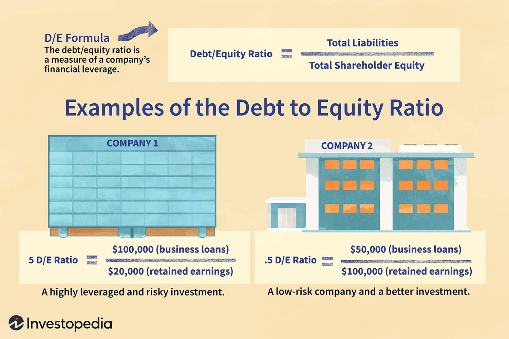

## Table of Contents

## What is the cost of capital and why is it important?

The cost of capital is the rate of return a company must pay to its investors for using their money. It's like the price a business pays for the funds it borrows or the equity it raises. This cost can come from different sources, like loans from a bank, issuing bonds, or selling shares to investors. Each source has its own cost, and when you mix them together, you get the company's overall cost of capital.

Understanding the cost of capital is important because it helps a company make smart decisions about where to invest its money. If a project's expected return is higher than the cost of capital, the project could be a good investment. It also helps in figuring out the value of a business. If a company's profits are higher than its cost of capital, it's creating value for its investors. This makes the cost of capital a key number for both the company's leaders and its investors.

## How do you define debt and equity in financial terms?

Debt is money that a company borrows and has to pay back. It's like a loan. When a company takes on debt, it agrees to pay back the amount it borrowed plus interest over time. Debt can come from banks, through bonds, or other types of loans. The company has to make regular payments, and if it doesn't, it could face serious problems, like going bankrupt. But, using debt can also help a company grow because it gives them extra money to invest in new projects or expand their business.

Equity is different. It's the money that comes from selling part of the company to investors. When people buy equity, they become owners or shareholders of the company. They don't get their money back directly like with debt, but they might get dividends if the company makes a profit. Also, if the company does well, the value of their shares can go up. But, if the company doesn't do well, the value of their shares can go down. Equity is important because it can help a company raise money without having to pay it back, but it means sharing control and profits with the investors.

## What is a debt ratio and how is it calculated?

A debt ratio is a number that shows how much of a company's money comes from loans compared to all its money. It's like a score that tells you if a company is using a lot of borrowed money or not. This is important because if a company has too much debt, it might have trouble paying it back, especially if things don't go well.

To find the debt ratio, you take the total amount of debt the company has and divide it by the total amount of money the company has, which is called total assets. The formula looks like this: Debt Ratio = Total Debt / Total Assets. The answer you get is a number between 0 and 1. A lower number means the company is not using much borrowed money, while a higher number means it's using a lot.

## What is an equity ratio and how does it differ from a debt ratio?

An equity ratio shows how much of a company's money comes from its owners or shareholders, compared to all its money. It's calculated by dividing the total equity by the total assets. The formula is: Equity Ratio = Total Equity / Total Assets. This ratio tells you how much of the company is owned by the shareholders. A higher equity ratio means the company is mostly funded by its owners, which can be a sign of financial strength because it's less reliant on borrowed money.

The equity ratio and the debt ratio are like two sides of the same coin. While the debt ratio tells you how much of the company's money comes from loans, the equity ratio tells you how much comes from the owners. They add up to 100% because together, they represent all the money the company has. If a company has a high debt ratio, it means it's using a lot of borrowed money, so its equity ratio will be lower. On the other hand, a company with a high equity ratio will have a lower debt ratio. Both ratios help investors and managers understand the company's financial health and how it's funded.

## How do debt and equity ratios impact the cost of capital?

Debt and equity ratios play a big role in figuring out a company's cost of capital. The cost of capital is the price a company pays for the money it uses, whether that money comes from loans (debt) or from selling shares (equity). When a company has a high debt ratio, it means it's using a lot of borrowed money. Debt is usually cheaper than equity because the interest payments on loans are tax-deductible. But, if a company has too much debt, it might be seen as risky, and lenders might charge a higher interest rate. This can make the cost of capital go up because the company has to pay more to borrow money.

On the other hand, a high equity ratio means the company is mostly funded by its owners. Equity can be more expensive because shareholders expect a return on their investment, often through dividends or a rise in the value of their shares. If a company relies heavily on equity, it might have a higher cost of capital because it needs to give more to its shareholders to keep them happy. But, a good mix of debt and equity can help a company keep its cost of capital low. By balancing the cheaper but riskier debt with the more expensive but less risky equity, a company can find the right funding mix to grow and create value for its investors.

## What are the formulas used to calculate the weighted average cost of capital (WACC)?

The weighted average cost of capital (WACC) is a way to find out the overall cost of the money a company uses. It's like figuring out the average price a company pays for all its money, whether it's from loans or from selling shares. To calculate WACC, you need to know the cost of debt, the cost of equity, and how much of the company's money comes from each. The formula for WACC is: WACC = (E/V) * Re + (D/V) * Rd * (1 - Tc). Here, E is the market value of the company's equity, D is the market value of the company's debt, V is the total value of the company (E + D), Re is the cost of equity, Rd is the cost of debt, and Tc is the company's tax rate.

The cost of debt (Rd) is the interest rate the company pays on its loans, but because interest payments can be deducted from taxes, you multiply Rd by (1 - Tc) to get the after-tax cost of debt. The cost of equity (Re) is trickier to find because it's what shareholders expect to earn on their investment. A common way to estimate Re is by using the Capital Asset Pricing Model (CAPM), which says Re = Rf + β * (Rm - Rf), where Rf is the risk-free rate, β is the stock's beta, and Rm is the expected market return. By putting all these pieces together, the WACC formula helps companies understand the average cost of their money and make smart decisions about where to invest it.

## How do you determine the cost of debt and the cost of equity?

The cost of debt is the interest rate a company pays on its loans. It's pretty easy to figure out because it's usually written down in the loan agreement. But, since the interest a company pays can be taken off their taxes, we need to look at the after-tax cost of debt. To find this, you take the interest rate and multiply it by one minus the company's tax rate. So, if a company's interest rate is 5% and their tax rate is 30%, their after-tax cost of debt would be 5% times (1 - 0.30), which equals 3.5%. This means the company only really pays 3.5% on their debt after taxes.

The cost of equity is trickier because it's what shareholders expect to earn on their investment. Unlike debt, there's no clear interest rate for equity. One common way to estimate it is by using the Capital Asset Pricing Model, or CAPM for short. CAPM says the cost of equity is equal to the risk-free rate (like what you'd get from a super-safe investment like a government bond) plus a risk premium. The risk premium is found by taking the expected market return (what you'd expect to earn from the stock market) minus the risk-free rate, and then multiplying that by the company's beta (a number that shows how risky the company's stock is compared to the market). So, if the risk-free rate is 2%, the expected market return is 8%, and the company's beta is 1.2, the cost of equity would be 2% + 1.2 * (8% - 2%), which equals 9.2%. This means shareholders expect to earn 9.2% on their investment in the company.

## What role does the capital structure play in calculating the cost of capital?

The capital structure is how a company mixes debt and equity to get the money it needs. It's like deciding how much to borrow and how much to get from selling part of the company. This mix is important because it affects the cost of capital. If a company uses more debt, it might pay less in interest than it would need to pay shareholders, which can lower the cost of capital. But too much debt can make the company risky, so lenders might charge a higher interest rate, which could raise the cost of capital.

On the other hand, if a company uses more equity, it might have to promise shareholders a higher return, which can make the cost of capital higher. But having more equity can also make the company less risky because it doesn't have to pay back as much borrowed money. So, finding the right balance between debt and equity is key. A good capital structure can help a company keep its cost of capital low, making it easier to invest in new projects and grow.

## How can changes in market conditions affect debt and equity ratios?

Changes in market conditions can really shake up a company's debt and equity ratios. If the economy is doing well, it might be easier for a company to borrow money because banks and investors feel more confident. This could mean the company takes on more debt, pushing up its debt ratio. But if the economy takes a downturn, banks might be less willing to lend, and the company might have to rely more on selling shares to get money, which would increase its equity ratio. Also, if interest rates go up, borrowing money becomes more expensive, so a company might choose to use less debt and more equity, which would lower its debt ratio and raise its equity ratio.

Market conditions can also affect how investors see a company. If a company's industry is doing great, its stock price might go up, making its equity value higher and possibly lowering its debt ratio because the total value of the company (assets) goes up. On the flip side, if the industry is struggling, the stock price might drop, making the equity value lower and possibly raising the debt ratio. Plus, if investors start to see the company as riskier because of changes in the market, they might demand a higher return on their investment, which could push the company to adjust its debt and equity mix to keep its cost of capital in check.

## What are the common pitfalls when calculating debt and equity ratios for cost of capital?

When figuring out debt and equity ratios for the cost of capital, one common mistake is using the wrong numbers. Companies sometimes use the book value of their debt and equity instead of the market value. The book value is what's written down on the company's [books](/wiki/algo-trading-books), but the market value is what the market thinks the company's debt and equity are worth. Using the book value can give you a wrong idea of the company's true financial health and make the cost of capital calculation less accurate. It's important to use the market value because that's what really matters to investors and lenders.

Another pitfall is not taking into account changes in the market or the company's situation. The cost of debt can go up if interest rates rise, and the cost of equity can change if investors see the company as more or less risky. If a company doesn't update its calculations to reflect these changes, it might end up with a cost of capital that's too high or too low. This can lead to bad decisions about where to invest the company's money. Keeping an eye on the market and adjusting the ratios regularly can help avoid this problem.

## How do industry standards and benchmarks influence the interpretation of debt and equity ratios?

Industry standards and benchmarks are really important when looking at debt and equity ratios. They help you see if a company is doing better or worse than other companies in the same industry. For example, if a company's debt ratio is higher than the industry average, it might mean the company is taking on more risk than its competitors. But if the industry standard is to use a lot of debt, a high debt ratio might be okay. It's all about comparing the company to what's normal for its industry, so you can tell if it's doing well or if it needs to make changes.

Benchmarks also help set goals for a company. If a company wants to be seen as financially strong, it might aim to have debt and equity ratios that are better than the industry average. This can make investors feel more confident about the company. On the other hand, if a company's ratios are way off from the benchmarks, it might need to rethink its financial strategy. By using industry standards and benchmarks, a company can see where it stands and make smart decisions about how to manage its money.

## What advanced techniques can be used to optimize the cost of capital through debt and equity management?

One advanced technique to optimize the cost of capital is to use dynamic capital structure management. This means a company keeps changing its mix of debt and equity based on what's happening in the market and inside the company. For example, if interest rates are low, the company might borrow more money because it's cheaper. But if the company's stock price goes up, it might sell more shares because investors are willing to pay more for them. By always looking at the market and adjusting the debt and equity mix, a company can find the best way to keep its cost of capital low and make the most of its money.

Another technique is to use financial derivatives like interest rate swaps and options. These tools can help a company manage the risks that come with borrowing money. For example, if a company is worried about interest rates going up, it can use an interest rate swap to turn its variable rate debt into fixed rate debt. This can make the cost of debt more predictable and help the company plan better. Using options can also protect the company from big changes in the stock market, which can help keep the cost of equity steady. By using these advanced tools, a company can manage its debt and equity better and keep its cost of capital as low as possible.

## What are Debt and Equity Ratios and How Can We Understand Them?

The debt ratio and equity ratio are fundamental metrics used to assess a company's financial structure and health. The debt ratio measures the proportion of a company's total assets that are financed by its debt. It is mathematically expressed as:

$$
\text{Debt Ratio} = \frac{\text{Total Liabilities}}{\text{Total Assets}}
$$

A higher debt ratio signifies that a company is more leveraged, which can indicate potential financial instability if the company is unable to meet its debt obligations. However, acceptable debt ratio levels can vary significantly across different industries due to varying capital requirements and risks. For instance, capital-intensive industries like utilities and telecommunications may naturally operate with higher debt ratios compared to technology firms.

Conversely, the equity ratio indicates the proportion of assets financed by shareholders' equity. This can be calculated as:

$$
\text{Equity Ratio} = \frac{\text{Shareholders' Equity}}{\text{Total Assets}}
$$

A high equity ratio suggests a company is less dependent on external debt for financing its operations, which can denote financial stability and a lower risk profile. Both the debt and equity ratios provide crucial insights into a company's leverage, which is the extent to which a company utilizes borrowed funds.

These ratios also inform an entity’s risk profile and its capacity to meet long-term obligations. A balanced financial structure typically involves an optimal mix of debt and equity, ensuring that a company can sustain its operations and weather economic fluctuations. Analysts and investors closely monitor these ratios to evaluate a company's financial health and its strategies for managing leverage.

Understanding the dynamics of these ratios enables stakeholders to make informed investment decisions by assessing the risk and financial stability associated with the company. Thus, they are critical tools for analyzing a firm's capital structure, helping to ascertain whether the firm is using debt prudently or relying excessively on equity.

## What is the Cost of Capital: How to Balance Debt and Equity?

The cost of capital represents the minimum rate of return a company must earn on its investment projects to preserve its market value and continue to attract investment. It serves as a crucial benchmark in corporate finance, dictating how a firm finances its operations through debt, equity, and other financial instruments. A properly calculated cost of capital ensures that a company optimally allocates its resources, thereby maximizing shareholder value.

The cost of capital is generally expressed as the weighted average cost of capital (WACC), which provides an aggregate measure of the cost of all sources of capital, weighted based on their proportion in the company's capital structure. WACC can be calculated using the formula:

$$
WACC = \left(\frac{E}{V} \times Re\right) + \left(\frac{D}{V} \times Rd \times (1 - Tc)\right)
$$

Where:
- $E$ = Market value of equity
- $V$ = Total market value of the company’s financing (equity + debt)
- $Re$ = Cost of equity
- $D$ = Market value of debt
- $Rd$ = Cost of debt
- $Tc$ = Corporate tax rate

The first term represents the proportion of the cost of equity, determined by models such as the Capital Asset Pricing Model (CAPM), which considers the risk-free rate, the equity beta, and the market risk premium. The cost of debt typically reflects the effective [interest rate](/wiki/interest-rate-trading-strategies) a company pays on its borrowed funds, and it is adjusted for tax savings due to interest being tax-deductible (hence the term $(1 - Tc)$).

WACC serves as a vital tool for financial managers when evaluating investment opportunities and making financing decisions. Projects or acquisitions that offer a Return on Investment (ROI) exceeding the WACC are typically pursued, as they potentially increase the firm's value. Conversely, projects yielding returns below the WACC might lead to a decrease in market value.

In summary, understanding and calculating the WACC allows a company to evaluate its cost of financing while strategically balancing between debt and equity. An optimized capital structure can enhance a firm's financial stability and profitability, fostering long-term growth and shareholder wealth.

## References & Further Reading

[1]: Damodaran, A. (2012). ["Investment Valuation: Tools and Techniques for Determining the Value of Any Asset"](https://books.google.com/books/about/Investment_Valuation.html?id=5SRHAAAAQBAJ). Wiley.

[2]: Fabozzi, F. J., & Drake, P. P. (2009). ["The Basics of Finance: An Introduction to Financial Markets, Business Finance, and Portfolio Management"](https://books.google.com/books/about/Finance.html?id=mUBsAwAAQBAJ). Wiley.

[3]: ["Principles of Corporate Finance"](https://www.fincart.com/blog/corporate-finance-importance-types-principles/) by Richard A. Brealey, Stewart C. Myers, and Franklin Allen

[4]: ["Financial Theory and Corporate Policy"](https://www.afajof.org/wp-content/uploads/files/historical-texts/Financial_Theory_and_Corpora.pdf) by Thomas E. Copeland, J. Fred Weston, and Kuldeep Shastri

[5]: Bodie, Z., Kane, A., & Marcus, A. J. (2014). ["Investments"](https://books.google.com/books/about/EBOOK_Investments_Global_edition.html?id=BMsvEAAAQBAJ). McGraw-Hill Education.

[6]: ["Algorithmic Trading: Winning Strategies and Their Rationale"](https://www.amazon.com/Algorithmic-Trading-Winning-Strategies-Rationale-ebook/dp/B00CY5HC0U) by Ernie Chan

[7]: ["The Handbook of Fixed Income Securities"](https://www.amazon.com/Handbook-Fixed-Income-Securities-Ninth/dp/1260473899) by Frank J. Fabozzi

[8]: Sharpe, W. F., Alexander, G. J., & Bailey, J. V. (1999). ["Investments"](https://archive.org/details/investments0000shar). Prentice Hall.