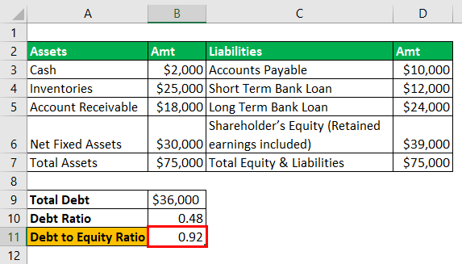

## Table of Contents

## What is the debt-to-equity ratio and why is it important?

The debt-to-equity ratio is a financial measure that shows how much a company is using borrowed money compared to money from its owners. It is calculated by dividing the total debt of a company by its total equity. This ratio helps to understand the financial health of a company. A higher ratio means the company has more debt than equity, which can be risky. A lower ratio means the company relies more on its own money, which is generally seen as safer.

This ratio is important because it tells investors and creditors about the risk of investing in or lending to the company. If a company has a high debt-to-equity ratio, it might struggle to pay back its debts if things go wrong. This makes it riskier for investors and creditors. On the other hand, a company with a low debt-to-equity ratio is seen as more stable and less risky. This can make it easier for the company to get loans and attract investors. By looking at this ratio, people can make better decisions about whether to invest in or lend money to a company.

## What are the components needed to calculate the debt-to-equity ratio?

To calculate the debt-to-equity ratio, you need two main pieces of information: the total debt and the total equity of a company. The total debt includes all the money the company owes, like loans, bonds, and any other liabilities. This can be found on the company's balance sheet under liabilities. The total equity, on the other hand, represents the money that belongs to the owners or shareholders of the company. This is also found on the balance sheet, usually listed as shareholders' equity or owner's equity.

Once you have these two numbers, you can calculate the debt-to-equity ratio by dividing the total debt by the total equity. For example, if a company has $100,000 in debt and $50,000 in equity, the debt-to-equity ratio would be $100,000 divided by $50,000, which equals 2. This means the company has twice as much debt as equity. Understanding these components and how to calculate the ratio helps in assessing the financial stability and risk of a company.

## How do you find the total liabilities in a company's financial statements?

To find the total liabilities in a company's financial statements, you need to look at the balance sheet. The balance sheet is a report that shows what a company owns, what it owes, and the value of the business to its owners. On the balance sheet, liabilities are listed on the right side. They are grouped into two main categories: current liabilities and long-term liabilities. Current liabilities are debts that need to be paid within one year, like bills or short-term loans. Long-term liabilities are debts that will take more than one year to pay off, like mortgages or long-term bonds.

To get the total liabilities, you add up all the current liabilities and all the long-term liabilities. For example, if a company has $50,000 in current liabilities and $100,000 in long-term liabilities, the total liabilities would be $150,000. This total number gives you an idea of how much money the company owes to others. It's an important part of understanding the company's financial health because it shows how much debt the company is carrying.

## How do you find the total shareholders' equity in a company's financial statements?

To find the total shareholders' equity in a company's financial statements, you need to look at the balance sheet. The balance sheet shows what a company owns, what it owes, and the value of the business to its owners. On the balance sheet, shareholders' equity is usually found on the right side, below the liabilities section. It is also called owner's equity or just equity. Shareholders' equity is what is left over after you subtract the company's total liabilities from its total assets.

To calculate the total shareholders' equity, you start with the total assets of the company, which are listed at the top of the balance sheet. Then, you subtract the total liabilities, which are listed below the assets. The difference between the total assets and the total liabilities is the shareholders' equity. For example, if a company has $200,000 in total assets and $150,000 in total liabilities, the shareholders' equity would be $50,000. This number tells you how much of the company's value belongs to the shareholders.

## What is the basic formula for calculating the debt-to-equity ratio?

The basic formula for calculating the debt-to-equity ratio is simple. You take the total debt of a company and divide it by the total equity of the company. This gives you a number that shows how much the company relies on borrowed money compared to money from its owners.

This ratio is important because it helps people understand if a company is risky or safe. A high debt-to-equity ratio means the company has a lot of debt, which can be risky if the company has trouble paying it back. A low ratio means the company relies more on its own money, which is usually seen as safer. By using this simple formula, anyone can get a quick idea of a company's financial health.

## How can you set up an Excel spreadsheet to input the necessary financial data?

To set up an Excel spreadsheet for inputting financial data, start by opening a new Excel workbook. In the first row, label the columns clearly so you know what to enter in each one. For example, label column A as "Item," column B as "Value," and so on. In the "Item" column, list the different financial items you need, like "Total Debt," "Current Liabilities," "Long-term Liabilities," "Total Assets," and "Total Equity." In the "Value" column next to each item, you can enter the numbers you find from the company's financial statements.

Once you have entered all the values, you can use simple formulas to calculate the debt-to-equity ratio. In a new cell, you can write a formula like "=B2/B5" where B2 is the cell with the total debt and B5 is the cell with the total equity. This will give you the debt-to-equity ratio. Make sure to format the cells to display the numbers in a way that is easy to read, like using dollar signs for money values or keeping the ratio to two decimal places. This setup will help you quickly see and understand the company's financial health.

## What are the steps to calculate the debt-to-equity ratio using Excel formulas?

To calculate the debt-to-equity ratio in Excel, you first need to set up your spreadsheet with the right data. Start by opening a new Excel workbook and labeling the columns. In the first row, label column A as "Item" and column B as "Value". In column A, list the financial items you need, like "Total Debt", "Total Equity", and any other relevant figures you want to track. In column B, next to each item, enter the values you find from the company's financial statements. For example, if the total debt is $100,000, you would enter that number in the cell next to "Total Debt".

Once you have entered all the necessary values, you can use a simple formula to calculate the debt-to-equity ratio. In a new cell, type the formula "=B2/B3" where B2 is the cell with the total debt and B3 is the cell with the total equity. This formula will divide the total debt by the total equity, giving you the debt-to-equity ratio. Make sure to format the cell with the result to show the number as a decimal, like 2.00, which means the company has twice as much debt as equity. This setup helps you quickly understand the financial health of the company.

## How can you format the results in Excel for better readability?

To make the debt-to-equity ratio easy to read in Excel, you can format the cells. Start by selecting the cell with the ratio. Right-click and choose "Format Cells". In the "Number" tab, pick "Number" and set the number of decimal places to 2. This will show the ratio as a simple number like 2.00. You can also add a custom format to show a label. For example, type "0.00 "Debt-to-Equity Ratio"" in the custom format box. This will display the ratio with a clear label right in the cell.

You can also make the spreadsheet look nicer by using colors and borders. Click on the cells you want to format and use the "Fill Color" tool to add a light color to the background. This helps important numbers stand out. Add borders around the cells by using the "Borders" tool. This makes the spreadsheet look organized. By formatting the cells this way, you can quickly see and understand the debt-to-equity ratio and other financial data.

## What are common mistakes to avoid when calculating the debt-to-equity ratio in Excel?

One common mistake when calculating the debt-to-equity ratio in Excel is using the wrong numbers. Sometimes people mix up total debt with just current liabilities or they use the wrong value for total equity. It's important to make sure you are using the total debt, which includes both current and long-term liabilities, and the total equity, which is what's left after you subtract total liabilities from total assets. Double-check the numbers you enter from the company's balance sheet to avoid this mistake.

Another mistake is not formatting the cells correctly. If you don't format the cell with the ratio to show a clear number, like 2.00, it can be hard to read and understand. Also, if you don't label the cells well, it can be confusing to know what each number means. Make sure to use the "Format Cells" option to show the ratio as a number with a few decimal places and add a label like "Debt-to-Equity Ratio" to make it clear what the number represents.

## How can you use Excel's data validation to ensure accurate inputs for the calculation?

To make sure the numbers you put into Excel for calculating the debt-to-equity ratio are right, you can use a tool called data validation. This tool helps you set rules for what can be entered into a cell. For example, you can set it so that only numbers can be entered in the cells for total debt and total equity. This stops mistakes like typing letters or symbols by accident. You can also set a rule to only allow numbers that are more than zero, because debt and equity can't be negative.

Using data validation makes your Excel sheet more reliable. It helps catch errors before they mess up your calculations. To set it up, select the cell where you want to enter the data, go to the "Data" tab, and click on "Data Validation". Choose "Whole number" or "Decimal" and set the minimum value to 0. This way, you can be sure that the numbers you use for the debt-to-equity ratio are correct and the calculation will be accurate.

## How can you create a dynamic chart in Excel to visualize changes in the debt-to-equity ratio over time?

To create a dynamic chart in Excel that shows how the debt-to-equity ratio changes over time, you first need to set up your data correctly. In your spreadsheet, list the dates in one column and the corresponding debt-to-equity ratios in another. Make sure you update these values regularly to reflect the most current financial data. Once your data is ready, select the range that includes both the dates and the ratios. Go to the "Insert" tab and choose the type of chart you want, like a line chart or a bar chart. This chart will automatically update as you enter new data, showing you how the debt-to-equity ratio changes over time.

To make the chart more useful, you can add labels and a title. Click on the chart, then go to the "Chart Design" tab to add a chart title like "Debt-to-Equity Ratio Over Time". You can also label the axes to make it clear what the numbers represent. The x-axis should show the dates, and the y-axis should show the debt-to-equity ratio. By setting up the chart this way, you can easily see trends and changes in the company's financial health at a glance. This helps you understand if the company is becoming more or less risky over time.

## How can you use Excel's conditional formatting to highlight when the debt-to-equity ratio exceeds industry benchmarks?

To use Excel's conditional formatting to highlight when the debt-to-equity ratio exceeds industry benchmarks, first, you need to know what the benchmark is. Let's say the industry benchmark for the debt-to-equity ratio is 2.00. In your Excel sheet, you have a column with the debt-to-equity ratios for different periods. Select the cells in this column, then go to the "Home" tab and click on "Conditional Formatting". Choose "Highlight Cells Rules" and then "Greater Than". Enter the benchmark value, 2.00, and pick a color like red to highlight the cells where the ratio is higher than the benchmark. This way, you can quickly see when the company's debt-to-equity ratio is above the industry standard.

Using conditional formatting like this helps you spot potential problems fast. If the debt-to-equity ratio is often above the benchmark, it might mean the company is taking on too much debt compared to other companies in the industry. This can be risky and might need attention from the company's leaders. By setting up the spreadsheet to highlight these high ratios, you can keep an eye on the company's financial health and make better decisions about investments or loans.

## What is the Debt-to-Equity Ratio and how can it be understood?

The debt-to-equity (D/E) ratio is a vital indicator used to assess a company's financial leverage by comparing its total debt to its total shareholder equity. This ratio provides insight into how a company finances its operations and the extent to which it relies on borrowing versus equity capital. A company's debt is comprised of its short-term and long-term financial obligations, while shareholder equity includes the ownership interest held by shareholders, calculated as total assets minus total liabilities.

The formula for calculating the D/E ratio is straightforward:

$$
\text{D/E Ratio} = \frac{\text{Total Debt}}{\text{Total Shareholder Equity}}
$$

A higher D/E ratio may indicate greater financial risk, as it suggests that a company is more heavily reliant on debt, which can increase its vulnerability to economic downturns or [interest rate](/wiki/interest-rate-trading-strategies) hikes. However, a high D/E ratio also has the potential to signify growth opportunities if the company efficiently uses the borrowed funds to generate returns that exceed the cost of debt. 

In evaluating a company's D/E ratio, it is essential to consider industry norms and historical performance. Different industries have varying capital structures and optimal leverage levels. For instance, capital-intensive industries such as utilities or manufacturing may naturally have higher D/E ratios compared to technology firms, which often rely less on debt financing. Additionally, analyzing the trend of a company's D/E ratio over time can help assess whether its reliance on debt is increasing, decreasing, or remaining stable. 

Ultimately, the D/E ratio provides a snapshot of a company's financial leverage, but it should be analyzed in the context of other financial metrics, the industry environment, and the company's strategy to provide a comprehensive understanding of its financial health.

## References & Further Reading

[1]: ["The Intelligent Investor: The Definitive Book on Value Investing. A Book of Practical Counsel"](https://www.amazon.com/Intelligent-Investor-Definitive-Investing-Essentials/dp/0060555661) by Benjamin Graham

[2]: ["Financial Statement Analysis and Security Valuation"](https://www.mheducation.com/highered/product/Financial-Statement-Analysis-and-Security-Valuation-Penman.html) by Stephen H. Penman

[3]: ["Excel Modeling in Corporate Finance"](https://www.pearson.com/en-us/subject-catalog/p/excel-modeling-in-corporate-finance/P200000005922/9780205987252) by Craig W. Holden

[4]: Damodaran, A. (2012). ["Investment Valuation: Tools and Techniques for Determining the Value of Any Asset."](https://books.google.com/books/about/Investment_Valuation.html?id=5SRHAAAAQBAJ) Wiley Finance.

[5]: ["Quantitative Equity Portfolio Management: Modern Techniques and Applications"](https://www.taylorfrancis.com/books/mono/10.1201/9781420010794/quantitative-equity-portfolio-management-edward-qian-eric-sorensen-ronald-hua) by Ludovic Van Thillo, Richard Grinold, Ronald N. Kahn

[6]: Fabozzi, F. J., & Markowitz, H. M. (2002). ["The Theory and Practice of Investment Management: Asset Allocation, Valuation, Portfolio Construction, and Strategies."](https://onlinelibrary.wiley.com/doi/book/10.1002/9781118267028) Wiley.

[7]: ["Algorithmic and High-Frequency Trading"](https://www.amazon.com/Algorithmic-High-Frequency-Trading-Mathematics-Finance/dp/1107091144) by Álvaro Cartea, Sebastian Jaimungal, and José Penalva