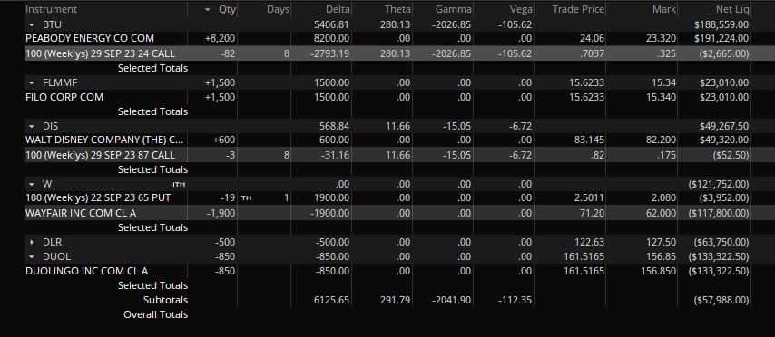

## Table of Contents

## What is the concept of Delta in financial derivatives?

Delta is a term used in financial derivatives, like options, to show how much the price of the derivative changes when the price of the underlying asset changes. Think of it as a measure of sensitivity. If you have an option and the stock it's based on goes up by $1, the Delta tells you how much the option's price will go up or down. For example, if the Delta is 0.5, and the stock price increases by $1, the option price will increase by about $0.50.

In simple terms, Delta helps traders understand and manage the risk of their options. It's a key part of what's called the "Greeks" in options trading, which are different measures used to assess risk. Delta can range from -1 to 1 for options. A Delta of 1 means the option price will move exactly with the stock price, while a Delta of -1 means it will move in the opposite direction. For call options, Delta is usually positive, and for put options, it's usually negative. By knowing the Delta, traders can make better decisions about buying or selling options.

## How does Delta relate to the price sensitivity of an option?

Delta is a number that shows how much an option's price will change when the price of the stock it's based on changes. If you have an option with a Delta of 0.5, and the stock price goes up by $1, the option's price will go up by about $0.50. This makes Delta a key measure of how sensitive the option's price is to changes in the stock price.

For call options, which give you the right to buy a stock, Delta is usually a positive number. This means that if the stock price goes up, the price of the call option also goes up. For put options, which give you the right to sell a stock, Delta is usually negative. This means that if the stock price goes up, the price of the put option goes down. By knowing the Delta, traders can better predict how their options will react to changes in the stock price, helping them manage their investments more effectively.

## What is the notional value of a financial instrument?

The notional value of a financial instrument is the total value of a position, contract, or security. It's the amount used to calculate payments or the value of the instrument, but it's not the amount of money that changes hands when you buy or sell it. Think of it like this: if you have a contract to buy 100 shares of a stock at $50 each, the notional value is $5,000, even if you only paid a small amount to enter the contract.

Notional value is important because it helps you understand the size and risk of a financial instrument. For example, in derivatives like futures or options, the notional value can be much larger than the actual money you put down. This means you could potentially make or lose a lot more money than what you initially invested, depending on how the market moves. So, knowing the notional value helps you gauge how much exposure you have in the market.

## Why is it important to adjust the notional value using Delta?

Adjusting the notional value using Delta is important because it gives a more accurate picture of the risk and exposure in options trading. Delta tells you how much the price of an option will change if the price of the stock it's based on changes. By using Delta, you can figure out the effective notional value, which is how much the option is really worth in terms of the stock. This helps traders understand how much they could gain or lose, making it easier to manage their investments.

For example, if you have an option with a notional value of $10,000 and a Delta of 0.5, the effective notional value would be $5,000. This means that for every $1 move in the stock price, the option's value changes by about $0.50, not $1. By adjusting the notional value with Delta, traders can better assess their risk and make more informed decisions about buying or selling options. This adjustment is crucial for managing a portfolio and understanding the true financial impact of market movements.

## How do you calculate the Delta of an option?

Delta is calculated using a mathematical model called the Black-Scholes model. This model takes into account several factors like the current price of the stock, the strike price of the option, the time until the option expires, the expected [volatility](/wiki/volatility-trading-strategies) of the stock, and the risk-free [interest rate](/wiki/interest-rate-trading-strategies). By plugging these numbers into the Black-Scholes formula, you can find the Delta of an option. For call options, Delta is usually between 0 and 1, and for put options, it's usually between -1 and 0.

The Delta of an option changes as the price of the stock changes. This means you need to keep recalculating it to stay up to date. If the stock price goes up, the Delta of a call option will get closer to 1, and the Delta of a put option will get closer to 0. If the stock price goes down, the Delta of a call option will get closer to 0, and the Delta of a put option will get closer to -1. This dynamic nature of Delta is why traders often use it to adjust their strategies and manage risk in real-time.

## What factors influence the Delta of an option?

The Delta of an option is influenced by several factors, including the price of the underlying stock, the time left until the option expires, the volatility of the stock, and the risk-free interest rate. When the stock price changes, Delta changes too. If the stock price goes up, the Delta of a call option gets closer to 1, and the Delta of a put option gets closer to 0. If the stock price goes down, the Delta of a call option gets closer to 0, and the Delta of a put option gets closer to -1. This means Delta is not a fixed number but changes with the stock price.

The time until the option expires also affects Delta. Options that are close to expiring have Deltas that change more quickly with stock price movements than options with more time left. This is because the option's value becomes more sensitive to the stock price as expiration approaches. Additionally, higher volatility of the stock can impact Delta, making it less stable, and the risk-free interest rate can also play a role, though its effect is generally smaller compared to the other factors.

## Can you explain the formula for calculating Delta Adjusted Notional Value?

The Delta Adjusted Notional Value helps you understand the real risk of an option. It's calculated by multiplying the Delta of the option by its notional value. The notional value is the total value of the option based on the number of shares and the stock price. For example, if you have an option with a notional value of $10,000 and a Delta of 0.5, the Delta Adjusted Notional Value would be $5,000. This means that for every $1 move in the stock price, the option's value changes by about $0.50, not $1.

By using the Delta Adjusted Notional Value, traders can better manage their risk. It gives them a more accurate picture of how much they could gain or lose. This is important because the notional value alone might make the option seem riskier than it really is. Adjusting it with Delta helps traders make smarter decisions about their investments and understand the true financial impact of market movements.

## How does Delta Adjusted Notional Value help in managing risk?

Delta Adjusted Notional Value helps traders manage risk by giving them a clearer picture of how much their options could gain or lose. When you know the Delta Adjusted Notional Value, you can see the real impact of a change in the stock price on your option. For example, if you have an option with a notional value of $10,000 and a Delta of 0.5, the Delta Adjusted Notional Value is $5,000. This means that for every $1 move in the stock price, your option's value changes by about $0.50, not $1. By understanding this, traders can better predict their potential profits or losses and make more informed decisions.

Using Delta Adjusted Notional Value also helps traders adjust their strategies to control risk. If the Delta Adjusted Notional Value is high, it means the option is more sensitive to changes in the stock price, which could mean more risk. Traders can then decide to reduce their exposure by selling some of their options or buying options with a lower Delta. This way, they can balance their portfolio and manage their risk more effectively. Knowing the Delta Adjusted Notional Value helps traders stay on top of their investments and make smarter choices to protect their money.

## What are the practical applications of Delta Adjusted Notional Value in trading?

Delta Adjusted Notional Value is really useful for traders because it helps them understand how much risk they're taking with their options. If a trader knows the Delta Adjusted Notional Value, they can see how much their option's price will change when the stock price moves. For example, if you have an option with a notional value of $10,000 and a Delta of 0.5, the Delta Adjusted Notional Value is $5,000. This means that if the stock price goes up or down by $1, your option's value will change by about $0.50, not $1. By knowing this, traders can make better guesses about how much money they might make or lose, helping them decide if they want to buy or sell more options.

Traders also use Delta Adjusted Notional Value to adjust their trading strategies. If the Delta Adjusted Notional Value is high, it means the option is very sensitive to changes in the stock price, which could be risky. So, traders might decide to sell some of their options or buy options with a lower Delta to reduce their risk. This way, they can keep their portfolio balanced and protect their money. Understanding Delta Adjusted Notional Value helps traders stay in control of their investments and make smarter decisions to manage their risk better.

## How does Delta hedging relate to Delta Adjusted Notional Value?

Delta hedging is a way for traders to reduce the risk of their options by making sure the Delta Adjusted Notional Value stays close to zero. They do this by buying or selling the stock that the option is based on. If you have an option with a Delta of 0.5 and a notional value of $10,000, the Delta Adjusted Notional Value is $5,000. To hedge this, you would sell $5,000 worth of the stock. This way, if the stock price goes up or down, the gain or loss from the stock will help balance out the change in the option's value, keeping your overall position more stable.

By using Delta hedging, traders can manage the risk that comes from changes in the stock price. The Delta Adjusted Notional Value helps them know how much stock to buy or sell to keep their hedge working. If the Delta changes, they need to adjust their hedge by buying or selling more stock. This ongoing process helps traders keep their investments safe and control how much they could lose. Delta hedging is a key tool for anyone trading options who wants to minimize their risk and protect their money.

## What are the limitations and assumptions when using Delta Adjusted Notional Value?

Using Delta Adjusted Notional Value can help traders a lot, but it's not perfect. One big limitation is that Delta changes as the stock price changes, so the Delta Adjusted Notional Value isn't a fixed number. Traders need to keep updating it to make sure their calculations are right. Another problem is that Delta only tells you about the risk from changes in the stock price. It doesn't account for other things that can affect the option's value, like changes in how much the stock price might move around (volatility) or how much time is left until the option expires.

Also, using Delta Adjusted Notional Value assumes that the Black-Scholes model, which is used to calculate Delta, is always right. But this model has some assumptions that might not always fit the real world, like assuming the stock price moves in a certain way or that you can always buy or sell the stock at the current price. These assumptions can make the Delta Adjusted Notional Value less accurate if the market behaves differently than expected. So, while it's a helpful tool for managing risk, traders need to be aware of these limitations and use other ways to check their risk too.

## How can advanced traders use Delta Adjusted Notional Value in complex portfolio strategies?

Advanced traders can use Delta Adjusted Notional Value to fine-tune their complex portfolio strategies by balancing risk across different options and stocks. They look at the Delta Adjusted Notional Value of each option in their portfolio to see how sensitive each one is to changes in the stock price. By doing this, they can decide which options to buy or sell to keep their overall risk at a level they're comfortable with. For example, if one option has a high Delta Adjusted Notional Value, making it very sensitive to stock price changes, they might sell some of that option and buy another with a lower Delta to balance out their exposure. This way, they can manage the risk of their entire portfolio more effectively.

They also use Delta Adjusted Notional Value to create strategies like delta-neutral trading, where they try to make the total Delta of their portfolio close to zero. This means they're not betting on whether the stock price will go up or down, but instead, they're focusing on other factors like changes in volatility or time decay. By adjusting the Delta Adjusted Notional Value of their positions, they can keep their portfolio balanced and take advantage of other market movements. This approach helps advanced traders manage risk and potentially profit from different aspects of the market without being overly exposed to the direction of the stock price.

## What is the Concept of Delta in Finance?

Delta, in the context of financial derivatives, is a crucial metric that measures the rate of change of a derivative's price relative to a change in the price of its underlying asset. It is one of the primary components of the "Greeks," which are used to assess risk and manage options portfolios. Mathematically, Delta (Δ) is represented as:

$$
\Delta = \frac{\partial V}{\partial S}
$$

where $V$ is the price of the derivative and $S$ is the price of the underlying asset.

### Measuring Sensitivity

Delta serves as an indicator of how sensitive a derivative's value is to movements in the market. For example, a Delta of 0.5 implies that for every $1 change in the underlying asset price, the option's price will change by $0.50. This makes Delta an essential tool for traders who need to predict how option positions will respond to market fluctuations.

### Importance in Options Pricing and Risk Management

In options pricing, Delta plays a crucial role in identifying the moneyness of an option, i.e., how likely the option is to be in-the-money (ITM) at expiration. A deep in-the-money option will have a Delta close to 1 for call options (or -1 for put options), while a deep out-of-the-money option will have a Delta approaching zero. As such, Delta contributes not only to pricing but also to risk management strategies.

Traders use Delta to construct Delta-neutral portfolios, where the overall Delta of a set of positions is zero. This allows them to hedge against small price movements in the underlying asset, effectively reducing risk. 

### Trading Decisions Influenced by Delta

Delta's impact on trading decisions is evident in the practice of Delta-neutral trading, where a trader might hold a combination of options and their underlying asset such that the net Delta is zero. This strategy aims to maintain a constant portfolio value regardless of small fluctuations in the price of the underlying asset. 

For example, if a trader holds 100 call options with a Delta of 0.6 each, the total Delta is 60 (100 * 0.6). To achieve a Delta-neutral position, the trader might short 60 shares of the underlying asset.

### Delta Hedging and Its Applications

Delta hedging involves adjusting the quantities of options and their underlying security to maintain a Delta-neutral position. This technique is crucial in managing the direction risk of options portfolios. By frequently rebalancing the portfolio, a trader can theoretically achieve zero price sensitivity to small movements in the underlying asset's price, thus focusing on other risk factors like volatility.

In practice, Delta hedging is not perfect due to market volatility, transactions costs, and changes in Delta itself (Gamma risk). However, it remains a popular risk management strategy among professionals dealing in complex derivatives.

In summary, Delta is a fundamental concept in derivatives trading that informs pricing, risk management, and strategic trading decisions. Understanding and utilizing Delta allows traders to effectively anticipate price changes and adjust their strategies accordingly.

## What is Delta Adjusted Notional: A Deeper Dive?

Delta Adjusted Notional is a critical concept in derivatives trading that provides insight into the effective size of a derivatives position. Unlike the standard notional amount, which represents the total value of a derivatives contract, Delta Adjusted Notional accounts for the derivative's sensitivity to changes in the underlying asset's price, referred to as Delta. This adjustment allows traders and risk managers to assess the potential impact of price movements on their portfolio more accurately.

The standard notional amount of a derivative like an option is the face value that the derivative derives its valuation from. It does not take into account the likelihood of realized gains or losses due to price changes in the underlying asset. In contrast, Delta Adjusted Notional adjusts this notional value by the option's Delta, which ranges between -1 and 1. This adjustment provides a more realistic measure of a position's sensitivity to the underlying market movements.

### Calculation of Delta Adjusted Notional

The Delta Adjusted Notional is calculated using the formula:

$$
\text{Delta Adjusted Notional} = \text{Notional Amount} \times \text{Delta}
$$

Where:
- **Notional Amount** is the nominal value of the derivative contract.
- **Delta** is the first derivative of the derivative's price with respect to the price of the underlying asset.

**Example Calculation:**

Consider an options trader holding a call option with a notional amount of $1,000,000 and a Delta of 0.5. The Delta Adjusted Notional would be calculated as follows:

$$
\text{Delta Adjusted Notional} = 1,000,000 \times 0.5 = 500,000
$$

This tells the trader that, in terms of the underlying asset's exposure, the option behaves like holding a $500,000 position in the asset itself.

### Role in Risk Evaluation

Delta Adjusted Notional plays a crucial role in risk management and portfolio assessment. By reflecting the true risk exposure, traders can better align their risk strategies with market movements. For instance, in a portfolio with several derivatives, summing up the Delta Adjusted Notionals provides a clear picture of the potential overall exposure, allowing for better hedging strategies.

### Importance in Portfolio Management

In managing a portfolio, understanding the effective market exposure is pivotal. Delta Adjusted Notional enables portfolio managers to measure and monitor market exposure effectively, optimize hedging strategies, and rebalance portfolios dynamically in response to changing market conditions. This concept aids in achieving a desired risk profile and ensuring that the portfolio is not inadvertently overexposed to specific market risks.

By adopting the Delta Adjusted Notional method, financial professionals enhance their capability to make informed trading decisions, improve risk evaluations, and maintain a balanced portfolio in complex and volatile markets.

## What is Algorithmic Trading and how are Financial Calculations involved?

Algorithmic trading, the use of automated systems to execute trades at high speeds and volumes, plays a pivotal role in modern financial markets. These algorithms rely on precise calculations and data analysis to capitalize on market opportunities, manage risks, and enhance trading efficiency. The integration of quantitative models, like Delta Adjusted Notional, into these systems, is crucial for optimizing trading strategies and maintaining a competitive edge.

Accurate financial calculations are fundamental to the development and implementation of trading algorithms. These calculations determine trade execution speed, risk management precision, and the ability to respond to market signals. For algorithmic traders, the accuracy of metrics like Delta Adjusted Notional is vital as it provides a more realistic measure of a derivative's market exposure. Delta Adjusted Notional reflects the change in the derivative's notional amount due to fluctuations in the underlying asset. It is given by the formula:

$$
\text{Delta Adjusted Notional} = \Delta \times \text{Notional Amount}
$$

where $\Delta$ is the sensitivity of the derivative's price to changes in the underlying asset's price. Integrating this concept allows traders to evaluate the effective size of their positions and adjust their strategies for better risk management.

In [algorithmic trading](/wiki/algorithmic-trading) scenarios, Delta Adjusted Notional proves crucial. Consider a portfolio comprising various options positions. Accurately calculating the Delta Adjusted Notional enables traders to assess the portfolio's overall market exposure and adjust hedges accordingly. This metric assists in ensuring that the portfolio's net exposure aligns with the trader's risk tolerance and strategic objectives.

For example, an algorithm may automatically rebalance a portfolio to maintain a predefined Delta target by buying or selling underlying assets or derivatives. By using Delta Adjusted Notional, the algorithm identifies the quantity of the underlying needed to neutralize Delta risk. This maintains the portfolio's market exposure within acceptable limits.

Yet, challenges exist in using Delta Adjusted Notional within algorithmic trading. Market volatility can cause rapid shifts in Delta values, requiring continuous recalibration of models. Furthermore, assumptions underlying the Delta calculation may not hold under extreme market conditions, leading to potential misestimations of exposure. Algorithmic systems must thus be designed to adapt to real-time data and incorporate robust risk management protocols.

In summary, incorporating Delta Adjusted Notional into algorithmic trading strategies enhances accuracy in assessing market exposure and managing risk. As financial markets advance, integrating this calculation becomes indispensable for professionals seeking to refine their trading algorithms and safeguard investment portfolios.

## References & Further Reading

[1]: Black, F., & Scholes, M. (1973). ["The Pricing of Options and Corporate Liabilities."](https://www.cs.princeton.edu/courses/archive/fall09/cos323/papers/black_scholes73.pdf) Journal of Political Economy, 81(3), 637-654.

[2]: Hull, J. C. (2017). ["Options, Futures, and Other Derivatives,"](https://www.semanticscholar.org/paper/Options%2C-Futures%2C-and-Other-Derivatives-Hull/89bdee500c8623864fc9eb7a471546aa713acc44) 10th Edition. Pearson.

[3]: Jarrow, R., & Turnbull, S. (1999). ["Derivative Securities,"](https://archive.org/details/derivativesecuri0000jarr) 2nd Edition. South-Western College Publishing.

[4]: Wilmott, P. (2006). ["Paul Wilmott Introduces Quantitative Finance,"](https://www.amazon.com/Paul-Wilmott-Introduces-Quantitative-Finance/dp/0470319585) 2nd Edition. Wiley.

[5]: Wahlen, J., Baginski, S., & Bradshaw, M. (2017). ["Financial Reporting, Financial Statement Analysis and Valuation,"](https://www.amazon.com/Financial-Reporting-Statement-Analysis-Valuation/dp/1337614688) 9th Edition. Cengage Learning.

[6]: Geske, R., & Roll, R. (1984). ["On Valuing American Call Options with the Black-Scholes European Formula."](https://onlinelibrary.wiley.com/doi/10.1111/j.1540-6261.1984.tb02319.x) Journal of Finance, 39(2), 443-455.

[7]: Glasserman, P. (2004). ["Monte Carlo Methods in Financial Engineering."](https://link.springer.com/book/10.1007/978-0-387-21617-1) Springer-Verlag New York.