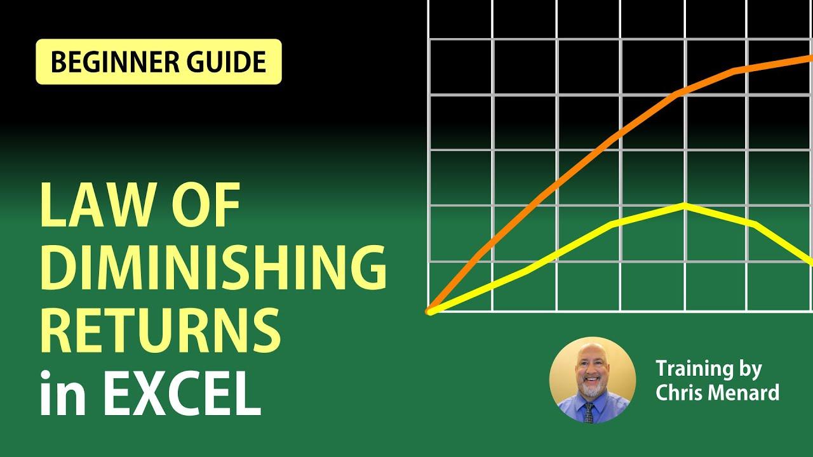

## Table of Contents

## What are diminishing marginal returns?

Diminishing marginal returns is an economic concept that says as you add more of something to a process, the extra benefit you get from each additional unit starts to get smaller. Imagine you're making sandwiches. At first, adding more workers to help can make you make sandwiches faster. But after a while, if you keep adding more workers, they might start getting in each other's way, and each new worker won't help as much as the ones before.

This idea is important for businesses because it helps them figure out the best way to use their resources. If a company knows that adding more workers or machines won't help as much after a certain point, they can decide to stop adding more and use their money in a different way. Understanding diminishing marginal returns can help businesses work more efficiently and save money.

## Why is it important to calculate diminishing marginal returns?

Calculating diminishing marginal returns helps businesses figure out the best way to use their resources. When a company knows exactly when adding more of something, like workers or machines, won't help as much, they can stop wasting money. For example, if a factory sees that adding a sixth machine doesn't speed up production much more than the fifth one did, they can decide not to buy more machines. This way, they can save money and use it for other important things, like improving the quality of their product or marketing.

Understanding diminishing marginal returns also helps businesses plan better. If they know that after a certain point, adding more resources won't help much, they can focus on other ways to grow. Instead of just adding more of the same, they might decide to invest in new technology or train their workers better. This can lead to a more efficient and successful business in the long run.

## How can Excel help in calculating diminishing marginal returns?

Excel can help you figure out diminishing marginal returns by letting you put numbers in and do calculations easily. You can make a table where you list how many workers or machines you have and how much they produce. Then, you can use formulas to find out how much more each new worker or machine adds to the total production. If you see that the extra production from each new worker or machine starts to get smaller, that's a sign of diminishing marginal returns.

For example, you can put the number of workers in one column and the total production in another. In a third column, you can use a formula to calculate the extra production each new worker brings. If the numbers in this third column start to go down as you add more workers, it means you're hitting the point of diminishing marginal returns. Excel's charts and graphs can also help you see this trend more clearly, making it easier to understand and explain to others.

## What data do I need to start calculating diminishing marginal returns in Excel?

To start calculating diminishing marginal returns in Excel, you need two main pieces of data: the number of units of input you're adding, like workers or machines, and the total output or production that results from each level of input. For example, you might have a column for the number of workers and another column for the total number of products made with that many workers.

Once you have this data, you can use Excel to find the extra output from each additional unit of input. This is done by subtracting the total output of the previous level of input from the current level. If you see that this extra output starts to decrease as you add more units, that's when you're seeing diminishing marginal returns.

## How do I set up an Excel spreadsheet to track input and output for diminishing marginal returns?

To set up an Excel spreadsheet for tracking input and output to calculate diminishing marginal returns, start by opening a new Excel workbook. In the first column, label the top cell as "Number of Workers" or whatever input you're using, like machines or hours of labor. In the cells below, enter the numbers starting from 1 and going up to the maximum number of units you want to track. In the second column, label the top cell as "Total Output." Fill in the cells below with the total output or production that corresponds to each number of workers.

Next, in the third column, label the top cell as "Marginal Output." Use a formula to calculate the extra output each new worker adds. For example, if cell B2 represents the total output for 1 worker and B3 represents the total output for 2 workers, the formula in C3 would be `=B3-B2`. This calculates the additional output from adding the second worker. Copy this formula down the column for all the rows. As you add more workers, if the numbers in the "Marginal Output" column start to get smaller, you're seeing diminishing marginal returns. You can also use Excel's chart feature to graph this data and see the trend more clearly.

## What formulas should I use in Excel to calculate marginal returns?

To calculate marginal returns in Excel, first set up your spreadsheet with columns for the number of workers and total output. In the third column, labeled "Marginal Output," you'll use a formula to find out how much more output each new worker adds. For example, if cell B2 shows the total output with 1 worker and B3 shows the total output with 2 workers, you would put `=B3-B2` in cell C3. This formula subtracts the total output of the previous row from the current row to find the extra output from adding one more worker. Copy this formula down the column for all your rows.

As you fill in the "Marginal Output" column, you'll see the numbers change. If these numbers start getting smaller as you add more workers, that's when you're seeing diminishing marginal returns. For example, if adding the second worker increased output by 10 units but adding the third worker only increased it by 8 units, and the fourth worker by 6 units, you can see the marginal returns are diminishing. You can also use Excel's chart tools to make a graph of this data, which can help you see the trend more clearly and explain it to others.

## How do I identify the point of diminishing marginal returns in an Excel graph?

To identify the point of diminishing marginal returns in an Excel graph, you first need to plot your data. Make a line graph where the x-axis shows the number of workers and the y-axis shows the marginal output. The marginal output is the extra amount produced by each new worker, which you calculate by subtracting the total output of the previous number of workers from the current number of workers.

Look at the line on your graph. The point of diminishing marginal returns is where the line starts to go down or flatten out. This means that each new worker is adding less to the total output than the worker before them. For example, if the line goes up steeply at first but then starts to level off or decrease, that's where you see diminishing marginal returns. This point helps you understand when adding more workers isn't as helpful as before.

## Can you explain how to use Excel's Solver tool to optimize input levels?

To use Excel's Solver tool to find the best number of workers for your business, start by setting up your spreadsheet with columns for the number of workers, total output, and marginal output. In the Solver, you need to tell it what you want to achieve, like making the total output as high as possible. You also need to set rules, like saying you can't have a negative number of workers. After setting up your goal and rules, you can run the Solver to find out the best number of workers that gives you the most output without wasting resources.

The Solver will look at your data and try different numbers of workers until it finds the best one. It will show you the number of workers that gives you the highest total output before the marginal output starts to go down. This way, you can see the point where adding more workers won't help as much and you might be better off spending your money on something else. Using Solver makes it easier to figure out the best way to use your resources and avoid the point of diminishing marginal returns.

## What are common mistakes to avoid when calculating diminishing marginal returns in Excel?

When calculating diminishing marginal returns in Excel, a common mistake is not setting up your data correctly. Make sure you have columns for the number of workers, total output, and marginal output. If you don't calculate the marginal output right by subtracting the total output of the previous row from the current row, your numbers will be wrong. Also, if you mix up the order of your data or leave out important information, you won't get the right results.

Another mistake is not understanding what the numbers mean. Just because the numbers go down doesn't always mean you've hit diminishing marginal returns. You need to look at the trend over time and see if the increase in output from each new worker is getting smaller. If you don't pay attention to this, you might think you've reached the point of diminishing returns too early or too late. Using Excel's graphing tools can help you see the trend more clearly and avoid these mistakes.

## How can I use conditional formatting in Excel to highlight the point of diminishing returns?

To use conditional formatting in Excel to show the point where adding more workers doesn't help as much, first make sure you have a column for the extra output each new worker brings. This is your "Marginal Output" column. Click on the top cell of this column, then go to the "Home" tab and find "Conditional Formatting." Choose "Icon Sets" and pick a set with arrows or colors that change based on the numbers. Set it up so that when the numbers start going down, the icons change to show you've reached the point of diminishing returns.

Once you've set up the conditional formatting, you'll see the icons change as you go down the column. When the icons show a decrease or a different color, that's where adding more workers isn't helping as much anymore. This makes it easy to spot the point of diminishing returns without having to look at the numbers closely. You can then use this information to decide when to stop adding more workers and use your resources in a better way.

## How do I perform sensitivity analysis on diminishing marginal returns using Excel?

To do sensitivity analysis on diminishing marginal returns using Excel, you can change different numbers to see how they affect your results. Start by setting up your spreadsheet with columns for the number of workers, total output, and marginal output. Then, you can try changing the number of workers or the output numbers to see what happens. For example, you might want to see what happens if you add more workers or if each worker can produce more. By changing these numbers, you can see how sensitive your results are to these changes and find out the best number of workers to use.

Excel's "What-If Analysis" tool can help you with this. You can use the "Data Table" feature to test different numbers of workers at the same time. Set up a data table where you list different numbers of workers in one column and use formulas to see what the total output and marginal output would be for each number. This way, you can see a range of results and easily find the point where adding more workers doesn't help as much. Sensitivity analysis helps you make better decisions by showing you how changes in one thing can affect your whole business.

## What advanced Excel functions can enhance my analysis of diminishing marginal returns?

Using Excel's advanced functions can make your analysis of diminishing marginal returns a lot better. One useful function is the "IF" function, which helps you check if a condition is true or false. For example, you can use it to see if the marginal output is getting smaller as you add more workers. Another helpful function is "VLOOKUP," which lets you find information in a big table easily. This can be useful if you have a lot of data and need to match numbers of workers with their output quickly.

You can also use the "SUMPRODUCT" function to do more complex calculations. This function can help you figure out the total output for different numbers of workers by multiplying and adding up numbers in a way that's hard to do by hand. Lastly, "Data Tables" in Excel are great for sensitivity analysis. They let you see how changing one thing, like the number of workers, affects your results. By using these advanced functions, you can get a clearer picture of when adding more workers stops being helpful and start making smarter decisions for your business.

## What is the Concept of Marginal Returns?

Marginal returns represent the additional output gained from one more unit of input. This economic concept is integral in evaluating the efficiency and effectiveness of investments, particularly in the context of [algorithmic trading](/wiki/algorithmic-trading). Understanding marginal returns enables traders to decide whether allocating more resources will provide proportional benefits or lead to inefficiencies.

In algorithmic trading, marginal returns assist traders in assessing how increased resources, such as computational power and capital, influence return metrics. For instance, a trader may invest in more sophisticated algorithms or increase trading frequency to enhance returns. However, each added input does not guarantee proportional output benefits due to the possible emergence of diminishing returns.

The calculation of marginal returns in algorithmic trading involves determining the change in output over the change in input. In mathematical terms, it is represented as:

$$
\text{Marginal Return} = \frac{\Delta \text{Output}}{\Delta \text{Input}}
$$

For traders, input might entail factors such as capital and technology investment, while output could involve measurable returns on trades or profitability metrics. Calculating these values using computational tools like Excel or Python can provide insights for adjusting trading strategies.

A practical example in Python could involve simulating the effect of different investment levels on trading returns:

```python
import numpy as np

investment_levels = np.array([1000, 2000, 3000, 4000, 5000])
returns = np.array([100, 220, 330, 430, 520])

marginal_returns = np.diff(returns) / np.diff(investment_levels)
print("Marginal Returns:", marginal_returns)
```

This code snippet calculates the marginal return for each incremental increase in investment up to a certain level. Traders can leverage such analyses to comprehend how their actions affect performance, facilitating decisions on efficient resource allocation without overextending inputs where diminishing returns might occur.

In summary, marginal returns are a critical metric for traders to understand the effectiveness of their investments in algorithmic trading, ensuring that added resources optimize returns rather than contribute to inefficiencies.

## References & Further Reading

For those aiming to deepen their understanding of the intersection of economic analysis and algorithmic trading, numerous resources provide essential insights into concepts like diminishing marginal returns and the practical application of Excel in trading strategies. Here is a curated list of recommended readings and references:

1. **Economic Theories and Diminishing Returns**:
   - "Principles of Economics" by N. Gregory Mankiw provides a comprehensive introduction to economic principles, including the law of diminishing returns, and is ideal for both beginners and those needing a refresher.
   - "Intermediate Microeconomics: A Modern Approach" by Hal R. Varian offers a more detailed examination of economic theories and the implications of diminishing returns across various industries.

2. **Excel Calculations for Trading**:
   - "Excel for Financial Analysis" by Michael Rees is an excellent resource for applying Excel's capabilities specifically in financial contexts, offering step-by-step guidance to model financial outcomes.
   - The official Microsoft Excel documentation and tutorials available on the Microsoft website provide foundational knowledge as well as advanced techniques for leveraging Excel in financial and trading analyses.

3. **Algorithmic Trading Strategies**:
   - "Algorithmic Trading: Winning Strategies and Their Rationale" by Ernie Chan covers a broad spectrum of algorithmic trading strategies, including insights into maximizing returns and minimizing risks.
   - "Advances in Financial Machine Learning" by Marcos López de Prado offers cutting-edge methods for developing trading algorithms that adapt to changing market conditions, incorporating concepts like machine learning to address diminishing returns.

4. **Integrating Economic Theory with Trading Algorithms**:
   - "Quantitative Trading: How to Build Your Own Algorithmic Trading Business" by Ernie Chan bridges the gap between economic theory and practical algorithmic trading, providing practical insights for implementing strategies that consider diminishing returns.

5. **Online Courses and Journals**:
   - Platforms like Coursera and edX offer courses on financial markets, algorithmic trading, and data analysis with Excel, often created in collaboration with top universities.
   - Journals such as "The Journal of Finance" and "The Journal of Portfolio Management" frequently publish research articles that can provide deeper insights into the application of economic theories and quantitative strategies in trading.

These resources should serve as a solid foundation for further exploration into how economic theories can be effectively utilized within algorithmic trading frameworks to optimize performance and manage resources efficiently.

