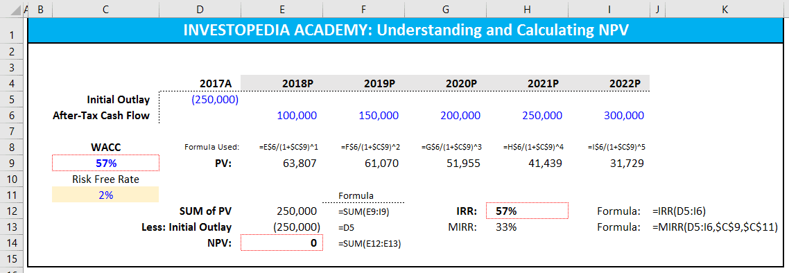

In modern trading, financial calculations are crucial as they underpin decision-making processes and risk management strategies. With the complex and dynamic nature of financial markets, precise calculations are necessary to assess the value of investments, forecast future trends, and develop strategic advantages. These calculations are essential for the evaluation of profitability and risk, ultimately guiding traders and investors in optimizing their portfolios.

A critical component of these financial calculations is the discount rate. The discount rate is used in various financial models to determine the present value of future cash flows. It is pivotal in net present value (NPV) and internal rate of return (IRR) calculations, which are widely used to evaluate the potential return on investment. Understanding the appropriate discount rate to use in different contexts helps investors assess the attractiveness of financial projects and adjust for risk and opportunity cost.



Excel has emerged as an indispensable tool for performing financial calculations, thanks to its versatile functionalities and user-friendly interface. Traders and financial analysts extensively use Excel to construct financial models, perform complex calculations, and automate tasks. Its array of built-in functions, such as NPV and IRR, along with its capacity to accommodate macros and Visual Basic for Applications (VBA), makes Excel a robust platform for financial analysis and modeling. Despite its limitations, when used with precision, Excel can significantly enhance the accuracy and efficiency of financial computations.

Simultaneously, there is a growing trend towards algorithmic trading in financial markets. Algorithmic trading, which utilizes computer algorithms to execute trades at speed and frequency that human traders cannot match, is increasingly prevalent. The precision of financial calculations is paramount in this context as algorithms rely heavily on real-time data and quantitative models to make trading decisions. The ability to integrate financial models, such as those involving discount rates, into algorithmic trading platforms can offer a competitive edge.

The purpose of this article is to examine how financial calculations, particularly discount rate determinations, can be effectively executed using Excel and integrated into algorithmic trading strategies. This exploration aims to highlight how the convergence of these elements can enhance trading strategies and provide insight into future trends in financial markets.

## Table of Contents

## Understanding the Discount Rate

The discount rate is a fundamental concept in financial analysis, representing the [interest rate](/wiki/interest-rate-trading-strategies) used to determine the present value of future cash flows. It reflects the time value of money, acknowledging that a dollar today is worth more than a dollar in the future due to its potential [earning](/wiki/earning-announcement) capacity. This rate is crucial in evaluating investment opportunities, setting the foundation for key financial metrics such as net present value (NPV) and internal rate of return (IRR).

There are several types of discount rates, each serving different purposes in financial modeling:

1. **Interest Rate**: Often used in simpler financial models, it generally refers to the risk-free rate or the rate on government bonds, representing the return expected from a risk-free investment.

2. **Risk-adjusted Discount Rate**: This rate incorporates the risk premium, accounting for the uncertainty associated with future cash flows. It is particularly important in investment decisions where the risk varies across different opportunities.

3. **Weighted Average Cost of Capital (WACC)**: Frequently used in corporate finance, WACC includes the cost of equity and the cost of debt, weighted by their respective proportions in the capital structure. It serves as a standard discount rate for projects of average risk.

The discount rate's importance in NPV and IRR calculations cannot be overstated:

- **Net Present Value (NPV)**: This metric calculates the present value of cash inflows and outflows, with the formula:
$$
  NPV = \sum \frac{C_t}{(1 + r)^t} - C_0

$$

  where $C_t$ represents the cash inflow or outflow at time t, $r$ is the discount rate, and $C_0$ is the initial investment. A positive NPV indicates a potentially profitable investment.

- **Internal Rate of Return (IRR)**: This is the discount rate that makes the NPV of cash flows zero. Mathematically, it involves solving:
$$
  0 = \sum \frac{C_t}{(1 + IRR)^t} - C_0

$$

  The IRR is useful in comparing the profitability of investments.

Selecting an appropriate discount rate involves consideration of several factors:

- **Risk Assessment**: The level of uncertainty associated with cash flows should influence the discount rate choice, with higher risks warranting a higher rate to compensate for potential volatility.

- **Economic Environment**: Prevailing interest rates and economic conditions impact the baseline risk-free rate and any additional risk premiums.

- **Business Sector**: Different industries have varying risk profiles and capital structures, influencing the WACC and the appropriate rate to use.

Real-world applications of discount rate estimation are prevalent in investment analysis. For example, when evaluating capital projects, businesses assess the potential returns using the discount rate to ensure they meet or exceed the firm’s cost of capital. In mergers and acquisitions, the discount rate helps ascertain the fair valuation of target companies, considering both historical performance and future prospects. Furthermore, in portfolio management, discount rate adjustments are critical for asset valuation and risk management, influencing decisions on asset allocation and diversification strategies.

Understanding and correctly applying the discount rate are crucial for sound financial decision-making, ensuring investments are evaluated with a thorough acknowledgment of both time value and risk.

## Leveraging Excel for Financial Calculations

Microsoft Excel is widely recognized as a powerful tool for financial analysis and modeling, enabling users to perform a variety of financial calculations essential for making informed decisions. Its versatility stems from a broad array of built-in financial functions, which makes it an invaluable resource for professionals in finance and other sectors requiring financial analysis.

### Setting Up Excel for Discount Rate Calculation

To calculate discount rates in Excel, users typically start by creating a structured spreadsheet that clearly delineates inputs, outputs, and the calculations themselves. This involves setting up columns to input initial data such as cash flows, interest rates, or any other relevant financial metrics. A recommended approach is to label columns and rows with descriptive names for easy navigation and understanding.

1. **Input Cash Flows:**
   - Organize cash flows chronologically in a column, starting with the initial investment or cash outflow.
   - Subsequent rows will represent future cash inflows or outflows.

2. **Discount Rate Cell:**
   - Assign a cell where the discount rate is inputted. This rate is crucial for calculating the Net Present Value (NPV) or other discount-related metrics.

3. **Calculate Present Values:**
   - Use the formula `=PV(rate, nper, pmt, [fv], [type])` where `rate` is the discount rate, `nper` is the number of periods, `pmt` is the payment made in each period, `fv` is the future value, and `type` indicates when payments are due.

4. **Compute NPV:**
   - Utilize the `=NPV(rate, value1, [value2], ...)` function. This calculates the net present value of a series of cash flows considering the discount rate.

5. **Determine IRR:**
   - Implement the `=IRR(values, [guess])` formula. This computes the internal rate of return given a series of cash flows, helping decide the viability of an investment.

### Useful Excel Functions and Formulas

Excel provides a plethora of functions to facilitate financial calculations, including:

- **NPV (Net Present Value):** `=NPV(rate, value1, [value2], ...)` computes the present value of a range of cash flows.
- **IRR (Internal Rate of Return):** `=IRR(values, [guess])` delivers the rate of return at which an investment breaks even.
- **PMT (Payment):** `=PMT(rate, nper, pv, [fv], [type])` is used for calculating loan payments given a constant interest rate and period count.

### Organizing Data and Automating Calculations with Macros and VBA

For enhanced efficiency, particularly with large datasets, automation through Excel macros and Visual Basic for Applications (VBA) can be employed. 

- **Macros:** Automate repetitive tasks by recording a macro through Excel’s built-in recorder, streamlining data entry and calculations.
- **VBA Programming:** For more robust automation, VBA can be used to write scripts that execute complex logic, manipulate data, and produce reports. For example, automating the recalculation of NPV for different discount rates:

  ```vba
  Sub CalculateNPV()
      Dim rate As Double
      Dim values As Range
      Dim npvResult As Double

      rate = Range("B1").Value ' Assume B1 contains discount rate
      Set values = Range("C2:C10") ' Example cash flow range

      npvResult = Application.NPV(rate, values)

      Range("D1").Value = npvResult ' Output result in D1
  End Sub
  ```

### Limitations and Importance of Accuracy in Financial Modeling

Despite its strengths, Excel has limitations. It is prone to human error, especially in large, complex spreadsheets where manual data entry can cause mistakes. Calculation precision is another concern, as inaccuracies in financial modeling can lead to suboptimal investment decisions. Users should frequently validate models with smaller data sets or cross-reference results with other tools or methods. 

Additionally, Excel may not handle very large datasets or real-time data as efficiently as more sophisticated financial software. Therefore, understanding these limitations and maintaining attention to detail is critical for optimal financial analysis and modeling outcomes using Excel.

 to Algorithmic Trading

Algorithmic trading, often referred to as algo trading, involves using computer programs to execute trades in financial markets based on pre-defined criteria without human intervention. This approach has gained significant traction due to its ability to handle large volumes of trades at speeds and efficiencies not possible with traditional trading methods. Algo trading allows for precise execution of trades by taking advantage of mathematical models and complex algorithms to determine optimal trading strategies.

One of the primary attractions of [algorithmic trading](/wiki/algorithmic-trading) is the minimization of human error and emotion in trading decisions, thereby enabling quick and precise trade executions. This is particularly crucial in volatile markets where reaction times can significantly impact profits or losses. Moreover, algorithmic trading has democratized access to sophisticated trading techniques, allowing individual traders to compete with institutional traders.

Common strategies in algorithmic trading include [arbitrage](/wiki/arbitrage), [market making](/wiki/market-making), [trend following](/wiki/trend-following), and [statistical arbitrage](/wiki/statistical-arbitrage), each relying heavily on financial calculations. For instance, arbitrage strategies exploit price discrepancies between different markets or instruments, demanding rapid and precise calculations to ensure profitability. Market making involves providing [liquidity](/wiki/liquidity-risk-premium) by simultaneously posting buy and sell orders; this requires an understanding of the bid-ask spread dynamics and capitalizing on small price movements. Trend-following strategies, on the other hand, analyze historical price data to predict future price movements, necessitating the use of statistical tools to identify patterns and trends. Statistical arbitrage involves complex statistical and econometric models to identify and exploit short-term mispricings.

High-frequency trading ([HFT](/wiki/high-frequency-trading-strategies)), a subset of algorithmic trading, plays a critical role in modern financial markets. HFT employs sophisticated algorithms and high-speed data networks to conduct a large number of trades at extremely fast speeds. It leverages advanced technology to capitalize on minute market inefficiencies, often holding positions for a fraction of a second to a few minutes, and requires the integration of financial calculations with high-level computational capabilities.

The interplay between discount rate calculations and algorithmic trading is significant, as the discount rate is critical in evaluating the present value of expected future cash flows from investments. Accurate discount rate calculations ensure that trading algorithms correctly assess the profitability of potential trades. For example, in options pricing, models like the Black-Scholes require precise inputs, including interest rates, which directly correlate to discount rates, influencing decisions on exercising options or holding positions.

In conclusion, algorithmic trading forms a vital component of the financial markets, relying extensively on advanced algorithms and precise financial calculations. This method enhances trading strategies and optimizes performance by efficiently processing vast amounts of data, leveraging speed, and maintaining accuracy. The integration of sophisticated computational techniques with key financial metrics continues to shape the evolution of algorithmic trading in today's fast-paced markets.

## Incorporating Discount Rate Calculations in Algo Trading Strategies

Incorporating discount rate calculations into algorithmic trading strategies can significantly enhance the ability to evaluate investment opportunities. The discount rate is integral in determining the present value of future cash flows, thus allowing traders to assess the profitability of potential trades. Here's how it can be applied to algorithmic trading:

### Assessing Investment Opportunities

Algorithmic trading systems rely on quantitative analysis to make trading decisions. Calculating the net present value (NPV) and internal rate of return (IRR) are key techniques wherein the discount rate is pivotal. The NPV is calculated using the formula:

$$
\text{NPV} = \sum_{t=0}^{N} \frac{C_t}{(1 + r)^t}
$$

where $C_t$ represents cash flow at time $t$, $r$ is the discount rate, and $N$ is the number of periods. By employing this formula, trading algorithms can utilize historical data and forecasts to evaluate whether a potential trade meets the desirable thresholds for investment.

### Case Study: Impact on Strategies and Outcomes

Consider a scenario where an algorithmic trading firm adjusts its discount rates in response to changing market conditions or risk profiles. A higher discount rate implies a more conservative approach, potentially filtering out marginally profitable opportunities while reducing risk exposure. In contrast, reducing the discount rate can increase the number of trades deemed profitable, though it may raise the risk exposure. Analyzing such adjustments through [backtesting](/wiki/backtesting) on historical data allows firms to observe shifts in trading outcomes, such as changes in profitability or [volatility](/wiki/volatility-trading-strategies).

### Integration with Excel-based Financial Models

Integrating discount rate calculations with algorithmic trading platforms can be achieved using software tools that link Excel models with trading systems. Excel, equipped with any add-ins like Solver or Power Query, along with VBA macros, can automate complex calculations. For seamless integration, APIs are often used to synchronize these models with real-time market data, facilitating dynamic updates to trading strategies.

### Challenges and Best Practices

Syncing Excel calculations with real-time data feeds presents technical challenges. Data latency, computational speed, and model accuracy are pivotal concerns. To mitigate these, it's crucial to optimize spreadsheet models to minimize computational overhead. Practices such as modularizing the code, utilizing efficient algorithms, and leveraging cloud computing resources can enhance performance. Additionally, ensuring the accuracy of market data feeds to prevent erroneous calculations is vital for maintaining the integrity of trading strategies.

Overall, harnessing discount rate calculations in algo trading requires a synergy of financial modeling, software integration, and precise data handling. By refining these elements, traders can develop robust strategies that withstand market fluctuations and optimize financial outcomes.

## Case Studies and Real-World Examples

In algorithmic trading, the use of financial models and calculations, particularly discount rate estimations, has proven integral to the strategic success of trading firms. A prime example of this is demonstrated by a leading [quantitative trading](/wiki/quantitative-trading) firm, Quantitative Investments Inc., which successfully integrated discount rate calculations into its algorithmic trading strategies. By utilizing detailed financial models, including precise discount rate assessments, the firm crafted highly effective trading algorithms that significantly boosted their returns.

The critical lesson drawn from historical data confirms that the precision of financial models, particularly those involving discount rates, directly correlates with trading success. Many trading firms traditionally failed to incorporate thorough financial modeling, resulting in suboptimal trading outcomes. Analyzing historical performance, Quantitative Investments Inc. identified that incorporating accurate discount rate calculations increased the robustness of their net present value (NPV) and internal rate of return (IRR) assessments, both crucial metrics in evaluating the potential profitability of their trades.

To illustrate the role of discount rates in trading strategies, consider a simple strategy comparison. Strategy A might involve a fixed discount rate, leading to a static view of investment viability, while Strategy B incorporates a dynamic, risk-adjusted discount rate that reflects changes in market conditions. In high-volatility environments, Strategy B would outperform due to its adaptability, offering a more realistic projection of potential returns and preserving capital by avoiding overvalued investments.

Traders can also optimize and backtest their strategies using Excel complemented by algorithmic trading tools. Excel provides a platform to model various discount rate scenarios rapidly. For instance, using Excel's Solver function, traders can optimize parameters to maximize NPV under different market conditions. Integrating these Excel models with algorithmic trading platforms can be achieved through Python scripts or APIs, which facilitate real-time data acquisition and model updates.

Here is a simple Python script that could assist in integrating Excel-based models with algorithmic platforms:

```python
import pandas as pd
import numpy as np

# Load Excel model
excel_data = pd.read_excel('financial_model.xlsx')

# Assumption: the model contains a 'discount_rate' column
base_discount_rate = excel_data['discount_rate'].mean()

# Function to adjust discount rate based on market conditions
def adjust_discount_rate(market_volatility, base_rate):
    return base_rate + market_volatility * 0.1

# Example of applying the adjusted discount rate in a trading algorithm
market_data = { 'volatility': [0.05, 0.1, 0.15, 0.2] }  # Example market data
for volatility in market_data['volatility']:
    adjusted_rate = adjust_discount_rate(volatility, base_discount_rate)
    # Calculate NPV or other financial metrics as needed here
    print(f'Adjusted discount rate for volatility {volatility}: {adjusted_rate}')
```

This script demonstrates how traders can dynamically update their financial models to reflect current market conditions. By leveraging both historical analysis and technological innovations, traders are positioned to make informed decisions that enhance strategy viability and optimize trading outcomes. These methodologies underscore the transformative potential of combining precise financial calculations with advanced algorithmic trading techniques.

## Conclusion and Future Trends

Financial calculations, particularly the discount rate, play a crucial role in enhancing trading strategies by providing a foundation for evaluating investment opportunities and determining the present value of future cash flows. The discount rate is vital in net present value (NPV) and internal rate of return (IRR) calculations, which are essential for making informed trading decisions. Accurately determining the discount rate allows traders to assess the profitability and risk of potential investments, thereby optimizing their trading strategies.

Technological advancements, particularly in Excel and algorithmic trading, have significantly transformed how financial calculations are performed and applied. Excel continues to be a powerful tool, offering diverse functions and features that facilitate complex financial modeling. Its versatility and user-friendly interface make it an essential asset for traders and financial analysts. The integration of macros and Visual Basic for Applications (VBA) further extends Excel's capabilities, enabling automation and enhanced accuracy in financial computations.

Algorithmic trading, which utilizes advanced algorithms to execute trades based on predefined criteria, relies heavily on precise financial calculations, including discount rates. As the financial markets evolve, the role of algorithmic trading is expected to expand, driven by advancements in technology such as [machine learning](/wiki/machine-learning) and [artificial intelligence](/wiki/ai-artificial-intelligence). These technological shifts will likely lead to more sophisticated trading strategies that can process vast data sets and execute trades with unparalleled speed and precision.

Looking ahead, the future of financial calculations in the context of algorithmic trading will likely involve more integration of real-time data analysis and automated decision-making processes. The development of more robust tools that combine financial modeling with algorithmic trading platforms could enhance traders' ability to backtest and optimize their strategies continuously. This evolution will require traders to incessantly update their skills and embrace new tools and technologies to maintain a competitive edge.

In conclusion, the intersection of financial calculations, Excel, and algorithmic trading represents a dynamic and rapidly advancing area. Traders are encouraged to stay informed about the latest developments and continuously refine their skills to leverage these advancements for optimal trading performance. As technology continues to reshape the financial landscape, those who adeptly integrate these elements into their strategies will likely find greater success in the ever-evolving market.

## Additional Resources

### Links to Tutorials on Excel Functions for Financial Calculations

For those looking to enhance their skills in Excel for financial calculations, numerous resources are available online:

1. **Microsoft Excel Function Reference**: The official Microsoft website provides comprehensive documentation on Excel functions, including those used for financial modeling, such as `NPV()`, `IRR()`, and `PMT()`. ([Microsoft Office Support](https://support.microsoft.com/excel))

2. **Khan Academy**: Offers free tutorials covering various Excel functionalities, including a series on financial modeling and calculations. ([Khan Academy](https://www.khanacademy.org/))

3. **Investopedia Excel Guide**: Investopedia provides an Excel guide tailored for financial analysts, explaining commonly used functions and their applications in finance. ([Investopedia](https://www.investopedia.com/investing/how-use-excel-financial-analysis/))

### Reference Books and Courses on Algorithmic Trading

To gain a deeper understanding of algorithmic trading, consider the following [books](/wiki/algo-trading-books) and courses:

1. **"Algorithmic Trading: Winning Strategies and Their Rationale" by Ernie Chan**: This book provides practical insights into algorithmic trading strategies and their implementation.

2. **Coursera's "Machine Learning for Trading"**: Offered by the Georgia Institute of Technology, this course introduces how machine learning can be applied to trading strategies. ([Coursera](https://www.coursera.org/learn/machine-learning-trading))

3. **Udacity's "AI for Trading" Nanodegree**: A comprehensive program focused on applying AI techniques to develop trading strategies. ([Udacity](https://www.udacity.com/course/ai-for-trading--nd880))

### Websites and Tools for Staying Updated on Financial Modeling and Trading Strategies

To keep up with the latest trends and tools in financial modeling and trading:

1. **QuantStart**: A website dedicated to algorithmic trading and quantitative finance. It provides articles, tutorials, and resources for developing financial models. ([QuantStart](https://www.quantstart.com/))

2. **Seeking Alpha**: An investment community where market participants discuss trading strategies and financial models. ([Seeking Alpha](https://seekingalpha.com/))

3. **TradingView**: Offers advanced charting tools, a social trading platform, and community-generated trading ideas. ([TradingView](https://www.tradingview.com/))

### Discussion Forums and Communities for Algo Traders and Financial Analysts

Join forums and communities to engage with fellow traders and analysts:

1. **Elite Trader**: A forum where traders discuss algorithmic trading strategies, software, and market analysis. ([Elite Trader](https://www.elitetrader.com/))

2. **QuantConnect Community**: Part of the QuantConnect platform, this community allows users to share ideas and collaborate on algorithmic trading algorithms. ([QuantConnect](https://www.quantconnect.com/community))

3. **Reddit's /r/algotrading**: A subreddit dedicated to algorithmic trading, sharing insights, resources, and experiences in trading. ([Reddit](https://www.reddit.com/r/algotrading/))

## References & Further Reading

[1]: ["Algorithmic Trading: Winning Strategies and Their Rationale"](https://www.wiley.com/en-us/Algorithmic+Trading%3A+Winning+Strategies+and+Their+Rationale-p-9781118460146) by Ernest P. Chan

[2]: ["Advances in Financial Machine Learning"](https://www.amazon.com/Advances-Financial-Machine-Learning-Marcos/dp/1119482089) by Marcos Lopez de Prado

[3]: ["Machine Learning for Algorithmic Trading"](https://github.com/PacktPublishing/Machine-Learning-for-Algorithmic-Trading-Second-Edition) by Stefan Jansen

[4]: ["Quantitative Trading: How to Build Your Own Algorithmic Trading Business"](https://books.google.com/books/about/Quantitative_Trading.html?id=j70yEAAAQBAJ) by Ernest P. Chan

[5]: ["Evidence-Based Technical Analysis: Applying the Scientific Method and Statistical Inference to Trading Signals"](https://www.amazon.com/Evidence-Based-Technical-Analysis-Scientific-Statistical/dp/0470008741) by David Aronson