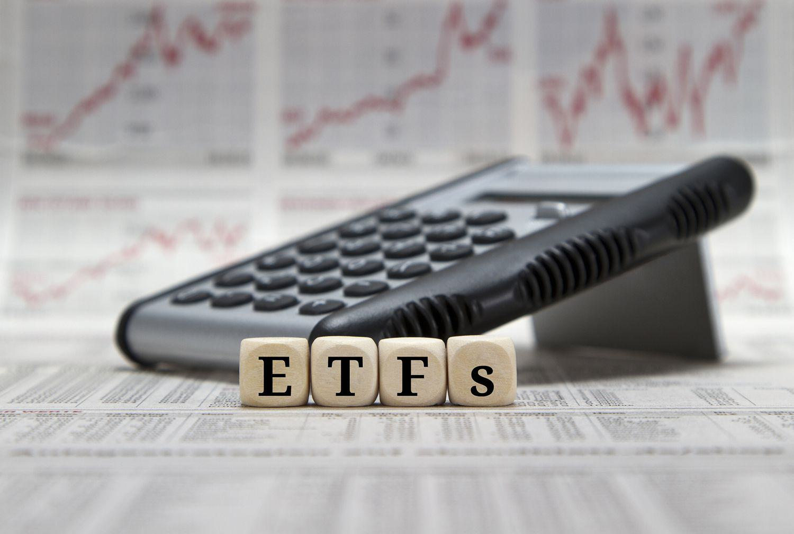

Exchange-Traded Funds (ETFs) are investment vehicles that offer a blend of features commonly associated with individual stocks and mutual funds. Like stocks, ETFs are traded on major exchanges, allowing investors to buy and sell them throughout the trading day. However, similar to mutual funds, they provide exposure to a wide range of assets, including stocks, bonds, and other securities, often tracking an index. These characteristics make ETFs a versatile and increasingly popular choice for both individual and institutional investors. The growing appeal of ETFs is driven by their inexpensive nature, tax efficiency, and ease of diversification, which is why they have become a central component of many investment portfolios.

Valuation is a cornerstone of smart investing, and accurate ETF valuation is crucial for informed decision-making. The value of an ETF is primarily determined by its Net Asset Value (NAV), the value of the underlying assets minus any liabilities, divided by the number of outstanding shares. It's calculated as:



$$
\text{NAV} = \frac{\text{(Assets - Liabilities)}}{\text{Shares Outstanding}}
$$

However, since ETFs trade like stocks, their market price may deviate from the NAV during the trading day due to supply and demand dynamics. Understanding these differences is essential for investors seeking to capitalize on potential arbitrage opportunities or avoid unnecessary risks.

Algorithmic trading has surfaced as a significant player in ETF valuation. Employing complex algorithms and real-time data, it enables rapid trading decisions, impacting liquidity and pricing. Algorithmic trading strategies, including arbitrage and market making, are crucial in maintaining the alignment of an ETF's market price with its NAV. While algorithmic trading presents opportunities for efficiency and profit, it also introduces risks such as increased volatility and potential for market disruptions.

This article will provide a comprehensive look at ETF valuation, discussing how it differs from mutual fund valuation, the calculation of NAV, and the role market prices play in trading decisions. Additionally, it will explore the methods to calculate ETF values, with a focus on algorithmic trading's influence on the ETF market. We will also delve into algorithmic strategies, practical implementation steps, and a look at real-world case studies. Finally, we'll gaze at future trends, examining technological advancements and their probable impacts on ETF valuation and trading strategies.

This material is designed to cater to both novice investors, who can gain foundational knowledge of ETF functions and valuation, and experienced investors, who will benefit from insights into advanced trading strategies and market dynamics. As ETFs continue to shape the financial markets, understanding these elements becomes increasingly valuable for investors seeking to optimize their portfolios in a rapidly changing landscape.

## Table of Contents

## Understanding ETF Valuation

Exchange-Traded Funds (ETFs) and mutual funds are both popular investment vehicles, but they differ significantly in terms of valuation. Understanding these differences is crucial for investors making informed decisions in the financial markets.

### Difference Between Mutual Funds and ETFs in Valuation

Mutual funds are priced at the end of each trading day. Their value is determined by the Net Asset Value (NAV), calculated by dividing the total value of the fund's assets, minus liabilities, by the number of shares outstanding. This simplifies to:

$$
\text{NAV} = \frac{\text{Total Asset Value} - \text{Total Liabilities}}{\text{Shares Outstanding}}
$$

Unlike mutual funds, ETFs trade on stock exchanges throughout the day at market prices. These market prices can fluctuate due to supply and demand dynamics and may not always align with the NAV. This intra-[day trading](/wiki/day-trading-spy) feature enhances [liquidity](/wiki/liquidity-risk-premium) and flexibility for [ETF](/wiki/etf-trading-strategies) investors but also introduces a disparity between market price and NAV.

### Net Asset Value (NAV) and Its Role in ETFs

For ETFs, NAV is an essential benchmark but not directly utilized for trading as ETFs are bought and sold on the secondary market at market prices. The NAV, published at the end of each trading day, provides a reference for the underlying value of the ETF's assets.

ETF managers also calculate an estimated NAV (iNAV), which is updated frequently throughout the trading day. This provides a more current perspective on the fund's value, reflecting intra-day price changes of the underlying assets. Sophisticated investors and algorithmic traders often use iNAV to identify mispricings between the ETF and its intrinsic value.

### Importance of Market Price versus NAV

The divergence between an ETF's market price and its NAV can present both opportunities and risks. When an ETF trades at a price higher than its NAV, it is said to be at a "premium," while trading below NAV is termed a "discount." These conditions are influenced by market supply and demand, liquidity, and market sentiment.

An example scenario is during periods of market stress where increased selling pressure might lead an ETF's market price to significantly deviate from its NAV. Investors equipped to identify these discrepancies can potentially capitalize on [arbitrage](/wiki/arbitrage) opportunities—buying undervalued ETFs (at a discount) or selling overvalued ones (at a premium).

### Implications of Value Differences on Investment Decisions

These price and NAV differences can impact investment strategies. For instance, buying an ETF at a premium might not be advantageous if the market price reverts to the NAV, while purchasing at a discount may offer a beneficial entry point if the market price aligns later with the NAV.

In conclusion, understanding the valuation nuance between mutual funds and ETFs, particularly the role of NAV and market pricing, is vital for investors. This knowledge helps navigate the complexities of ETF trading, enabling more strategic investment decisions.

## Methods to Calculate ETF Value

Exchange-Traded Funds (ETFs) have become increasingly popular among investors due to their transparency, liquidity, and cost-effectiveness. Understanding how to calculate the value of an ETF is crucial for making informed investment decisions. The value of an ETF can be determined using two primary traditional methods: market price and Net Asset Value (NAV).

### Market Price and NAV

**Market Price**: The market price of an ETF is the price at which it is bought and sold on the stock exchange during trading hours. It is determined by supply and demand dynamics and can fluctuate based on investor perceptions, market sentiment, and external economic factors.

**Net Asset Value (NAV)**: NAV represents the per-share value of an ETF's assets, minus its liabilities. It is calculated at the end of each trading day by the fund's administrator. The formula for NAV is: 

$$
\text{NAV} = \frac{\text{Total Assets} - \text{Total Liabilities}}{\text{Number of Outstanding Shares}}
$$

While the NAV provides an intrinsic value of the ETF, investors often rely on the market price to make real-time trading decisions.

### Impact of Real-Time Data and Transparency

Real-time data significantly influences ETF valuations by providing up-to-the-minute information on the underlying assets and the market price of the ETF. This transparency allows investors to make timely adjustments to their portfolios based on current market conditions. For instance, when discrepancies occur between an ETF's market price and its NAV, arbitrage opportunities arise, which can influence the ETF's value and market performance.

### Role of Financial Institutions and Market Makers

Financial institutions and market makers are vital in maintaining the accuracy and stability of ETF valuations. Market makers, in particular, ensure liquidity by providing continuous buy and sell quotes for ETFs, thereby narrowing the spread between the market price and NAV. They facilitate arbitrage by taking advantage of price discrepancies, which helps align the market price with the NAV. 

Market makers achieve this by creating and redeeming ETF shares through various financial transactions, known as the "creation and redemption process." This process helps keep the ETF's market price in equilibrium with its NAV. For example, if the ETF's market price is higher than the NAV, market makers can buy the underlying securities and create new shares, thus increasing supply and reducing the price difference.

In summary, understanding both market price and NAV, alongside the role of real-time data and financial institutions, is essential for accurately assessing the value of ETFs. These traditional methods, supported by transparent information and the efforts of market makers, enable investors to navigate the nuances of ETF trading effectively.

## Role of Algorithmic Trading in ETF Valuation

Algorithmic trading refers to the use of computer programs to execute trading strategies based on predefined criteria without human intervention. Its application in the ETF (Exchange-Traded Fund) market has grown significantly, offering increased efficiency and fostering improved market dynamics. The prominence of [algorithmic trading](/wiki/algorithmic-trading) in ETF markets is a reflection of its ability to enhance liquidity and ensure accurate pricing, which are crucial aspects of ETF valuation.

Algorithmic trading impacts ETF valuation primarily through its effect on liquidity and pricing. Liquidity is critical in ETF markets as it influences the ease with which assets can be bought or sold without causing significant price fluctuations. By enabling high-frequency trading and providing continuous bid-ask prices, algorithms contribute to maintaining robust market liquidity. This ensures that ETF prices remain close to their Net Asset Value (NAV), reducing discrepancies that could arise due to market inefficiencies.

Pricing in ETF markets is also significantly influenced by algorithmic strategies. Algorithms can process vast quantities of market data at speeds that are impossible for human traders. This capability allows them to quickly identify and exploit mispricings between an ETF’s market price and its NAV through strategies such as arbitrage. Arbitrage involves buying undervalued assets and selling overvalued ones, thereby aligning the market price with the underlying asset value. A typical example might be an ETF that trades at a discount or premium compared to its NAV; algorithmic traders can execute arbitrage strategies to capture price differences, bringing ETF prices back in line with their fair value.

Another common algorithmic strategy in ETF trading is [market making](/wiki/market-making). Market makers, often financial institutions or specialized trading firms, provide continuous bid and ask quotes for ETFs, facilitating easier transactions and adding liquidity. Algorithms aid market makers by automatically adjusting quotes in response to market conditions, ensuring that ETFs remain liquid and tradable, even in volatile market environments.

However, the implementation of algorithmic trading in the ETF market comes with its own set of risks and benefits. One notable benefit is the potential for enhanced trading efficiency and reduced transaction costs, as algorithms can execute trades more swiftly and accurately than human traders. Additionally, the continuous presence of algorithm-driven market makers ensures greater market access and reliability.

Conversely, algorithmic trading can pose risks such as increased market [volatility](/wiki/volatility-trading-strategies) and the potential for systemic errors. High-speed algorithmic trading can lead to events such as "flash crashes," where rapid selling triggers abrupt market downturns. Moreover, technical failures and erroneous algorithms can lead to widespread disruptions, as evidenced by past incidents in global markets.

In conclusion, while algorithmic trading offers significant advantages in terms of liquidity and pricing efficiency in ETF markets, it also requires careful management to mitigate risks. Traders and investors must balance the benefits of speed and accuracy with the hazards of increased volatility and systemic vulnerabilities.

## Steps to Implement Algorithmic Trading for ETFs

Algorithmic trading for Exchange-Traded Funds (ETFs) has become increasingly significant, offering the potential to optimize trading strategies based on sophisticated algorithms. Implementing algorithmic trading involves several crucial steps: selecting appropriate algorithms, deploying essential technological tools, and continuously monitoring and adjusting strategies.

Selecting the right algorithm is foundational to successful algorithmic trading. Different algorithms serve distinct trading goals and market conditions. For instance, a mean reversion strategy might benefit in markets where prices return to average values, while a trend-following algorithm could be advantageous in trending markets. The algorithm should be aligned with the trader's objectives, whether minimizing risk, enhancing returns, or maintaining liquidity. Knowing the risk tolerance and market mechanics is essential in this decision-making process.

The technological infrastructure required for algorithmic trading is another critical [factor](/wiki/factor-investing). At the core of this infrastructure are trading platforms capable of executing trades automatically based on predefined rules. Essential components include a robust computing environment, reliable data feeds providing real-time market data, and secure and compliant order management systems. High computational power is necessary for back-testing algorithms, ensuring they perform well based on historical data before live trading. Python, with its extensive libraries like pandas for data manipulation and NumPy for numerical computations, is often preferred for developing these algorithms.

```python
# Example of back-testing a mean-reversion strategy using Python
import pandas as pd
import numpy as np

# Generate signals for a mean-reversion strategy
def generate_signals(data, window=20):
    signals = pd.DataFrame(index=data.index)
    rolling_mean = data['Close'].rolling(window=window).mean()
    rolling_std = data['Close'].rolling(window=window).std()

    signals['signal'] = 0
    signals['signal'][window:] = np.where(data['Close'][window:] > rolling_mean[window:] + rolling_std[window:], -1, 0)
    signals['signal'][window:] = np.where(data['Close'][window:] < rolling_mean[window:] - rolling_std[window:], 1, signals['signal'][window:])

    return signals

# Example: Assume `data` is a DataFrame with a column 'Close'
signals = generate_signals(data)
```

Once the algorithm is operational, continuous monitoring and adjustment are vital. Financial markets are dynamic, subject to shifts in economic conditions, regulatory changes, and market sentiment, necessitating regular reassessment of trading strategies. An algorithm might need recalibration or a shift in its parameters to stay effective. This could involve altering the algorithm's sensitivity to price movements or selecting [alternative data](/wiki/best-alternative-data) inputs to better capture market conditions.

Effective monitoring involves real-time observation of the trading activity and performance metrics, ensuring the algorithm adheres to its risk parameters and identifying potential areas for improvement. Tools like dashboards or trading analytics software assist traders in visualizing data trends and making informed adjustments swiftly.

In conclusion, algorithmic trading for ETFs requires meticulous planning and execution. Selecting the appropriate algorithm, securing the right technological tools, and ongoing monitoring form the backbone of a successful strategy. These steps not only enhance the efficiency of ETF trading but also align trading practices with evolving market landscapes, helping investors achieve their financial goals.

## Case Studies and Examples

Algorithmic trading has substantially shaped ETF valuation, exhibiting both successful implementations and noteworthy failures. This section examines real-world examples underscoring algorithmic trading's impact on ETF valuation, offering valuable insights into what drives success and causes setbacks in this domain.

### Successful Case: Arbitrage Strategy in Currency ETFs

One notable example of successful algorithmic trading is the use of arbitrage strategies within currency ETFs. Arbitrage involves exploiting price discrepancies between different markets. In the case of currency ETFs, traders use algorithms to detect anomalies between the ETF's market price and the Net Asset Value (NAV) of its underlying assets, typically foreign currencies.

A successful instance of this can be illustrated by the increased liquidity and precision achieved in CurrencyShares Euro Trust (FXE). High-frequency trading firms employ algorithms that constantly monitor changes in currency exchange rates and FXE's market price to execute arbitrage trades. This strategy ensures that FXE’s market price remains closely aligned with the NAV, enhancing price efficiency and liquidity.

**Factors for Success:**
- **Data Accuracy:** Access to real-time and accurate foreign exchange rates is crucial for identifying arbitrage opportunities.
- **Speed and Efficiency:** High-frequency trading enhances the ability to act quickly on arbitrage opportunities before they dissolve.
- **Robust Technology:** Advanced computing power and sophisticated algorithms facilitate rapid identification and execution of trades.

### Failed Strategy: Flash Crash of 2010

In contrast, the "Flash Crash" of May 6, 2010, serves as a cautionary tale illustrating potential pitfalls. During the crash, automated trading systems driven by complex algorithms incorrectly interpreted large, sudden sell orders, exacerbating market volatility and leading to significant discrepancies in ETF valuations. ETFs, especially those tracking broad indices like the S&P 500, experienced dramatic price plunges.

**Factors for Failure:**
- **Market Sensitivity:** In volatile conditions, algorithms, specifically those not updated to incorporate circuit breakers or volatility controls, can amplify price distortions.
- **Lack of Human Oversight:** Over-reliance on automated algorithms without human intervention led to compounding errors during market anomalies.
- **Inappropriate Algorithms:** Algorithms lacking sophistication to differentiate between market noise and genuine signals contributed to erroneous trading decisions.

These cases highlight the importance of designing algorithms that are sophisticated, adaptive, and integrated with market regulations to safeguard financial stability and investor interests.

### Conclusion

The examination of these case studies provides critical insights into algorithmic trading’s influence on ETF valuation. They underscore the need for balancing technological advancement with rigorous safeguards and human oversight to optimize market operations and mitigate risk. As algorithmic methods continue to evolve, incorporating lessons from past failures and successes will be vital for advancing ETF trading strategies.

## Future Trends in ETF Valuation and Algo Trading

Emerging trends in ETF valuation and algorithmic trading are significantly reshaping the landscape of global financial markets. The rapid pace of technological advancement offers extensive possibilities for transforming the ways ETFs are valued and traded. Among the most promising developments is the application of [machine learning](/wiki/machine-learning) and [artificial intelligence](/wiki/ai-artificial-intelligence) to enhance predictive analytics and modeling capabilities. These technologies enable more sophisticated analysis of market data, allowing traders to identify patterns and anomalies that could suggest valuation changes or arbitrage opportunities.

In the context of ETF valuation, advancements in technology are facilitating greater transparency and efficiency. Blockchain technology, for instance, presents the potential to revolutionize the settlement process and improve the accuracy and speed of transactions. By ensuring a decentralized and immutable ledger, blockchain could reduce discrepancies between the Net Asset Value (NAV) and market prices of ETFs. This reduction can lead to more accurate pricing and limit opportunities for market manipulation.

The evolution of algorithmic trading continues to be marked by increased sophistication and versatility. High-frequency trading algorithms, operating at microsecond speeds, are gaining traction due to their ability to capitalize on minute price movements. Additionally, smart contracts and decentralized finance (DeFi) platforms are becoming integral in automating and executing trades based on predefined conditions without the need for intermediary intervention.

Data analytics is another pivotal area poised to impact ETF trading. The proliferation of big data and enhanced computational capacities allow for the handling and interpretation of vast datasets. Algorithms can be better trained to absorb and analyze detailed datasets, providing insights that inform trading strategies and ETF portfolio adjustments. Consequently, these analytics-driven strategies could shift investor behaviors, favoring data-backed decisions over traditional methods.

Looking forward, the long-term impact of these advancements on global financial markets is expected to be substantial. The integration of sophisticated algorithms and advanced data analytics in ETF trading could lead to more efficient markets, with improved liquidity and tighter spreads. However, these advancements also pose risks, particularly concerning market stability. The potential for flash crashes, as a result of algorithm errors or unintended interactions, underscores the importance of deploying robust risk management strategies.

Moreover, with the shift towards more technologically-driven ETF markets, investor behavior will likely evolve. Investors may become more accustomed to relying on quantitative analysis and data-driven decision-making processes. This shift emphasizes the necessity for investors and financial institutions to continually adapt and upgrade their technological tools and services to remain competitive and manage risks effectively.

In conclusion, while technological and algorithmic innovations hold the promise of greater efficiency and precision in ETF valuation and trading, they simultaneously demand vigilance to mitigate associated risks. The continued evolution of these technologies will shape the future dynamics of global financial markets, influencing both the infrastructure of trading platforms and the strategies employed by investors.

## Conclusion

In summary, the article has illuminated the intricate processes of ETF valuation and the pivotal role that algorithmic trading plays in this domain. Understanding ETF valuation is essential for any investor, as it affects portfolio decisions and outcomes. By comprehending the differences between market prices and Net Asset Value (NAV), investors can make more informed choices about buying and selling ETFs. 

In today's fast-paced financial markets, staying informed about both traditional and algorithmic valuation methods and trading strategies is crucial. With the emergence of algorithmic trading, investors have at their disposal dynamic tools that can enhance liquidity, improve pricing accuracy, and facilitate informed decision-making. The ability to utilize both approaches allows for a more diversified strategy, whereby traditional evaluation methods can provide stability, while algorithmic trading introduces opportunities for innovation and efficiency.

Looking ahead, the future of ETFs seems poised for further growth and transformation. As technology advances and data analytics become more sophisticated, we can expect more robust platforms and tools that will continue to change how ETFs are traded. Investors are encouraged to remain vigilant and adaptable, embracing both the innovations of algorithmic trading and the foundational principles of traditional ETF valuations. By doing so, they will be better equipped to navigate the complexities of modern financial markets and capitalize on the opportunities presented by ETFs in a continually evolving trading landscape.

## References & Further Reading

[1]: Bergstra, J., Bardenet, R., Bengio, Y., & Kégl, B. (2011). ["Algorithms for Hyper-Parameter Optimization."](https://papers.nips.cc/paper/4443-algorithms-for-hyper-parameter-optimization) Advances in Neural Information Processing Systems 24.

[2]: ["Advances in Financial Machine Learning"](https://www.amazon.com/Advances-Financial-Machine-Learning-Marcos/dp/1119482089) by Marcos Lopez de Prado

[3]: ["Evidence-Based Technical Analysis: Applying the Scientific Method and Statistical Inference to Trading Signals"](https://www.amazon.com/Evidence-Based-Technical-Analysis-Scientific-Statistical/dp/0470008741) by David Aronson

[4]: ["Machine Learning for Algorithmic Trading"](https://github.com/stefan-jansen/machine-learning-for-trading) by Stefan Jansen

[5]: ["Quantitative Trading: How to Build Your Own Algorithmic Trading Business"](https://www.amazon.com/Quantitative-Trading-Build-Algorithmic-Business/dp/1119800064) by Ernest P. Chan