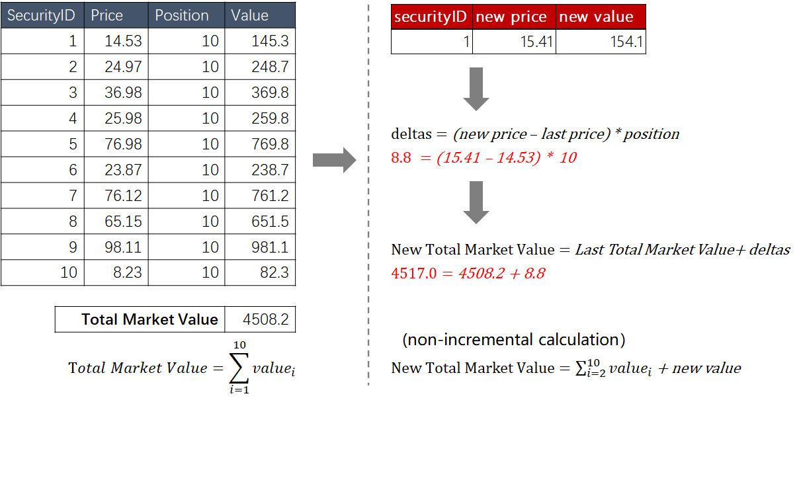

## Table of Contents

## What is an ETF and how does it work?

An ETF, or Exchange-Traded Fund, is a type of investment that works a lot like a mutual fund but trades on a stock exchange like a stock. It's a basket of different investments, like stocks, bonds, or commodities, that you can buy and sell throughout the day. When you buy shares of an ETF, you're buying a small piece of all the investments inside it, which helps spread out your risk.

ETFs are popular because they offer a simple way to invest in a broad range of assets. For example, if you want to invest in the whole stock market, you can buy an ETF that tracks a stock market index like the S&P 500. This means you don't have to pick individual stocks yourself. ETFs also tend to have lower fees than mutual funds, which can save you money over time. Plus, because they trade like stocks, you can easily buy and sell them whenever the market is open.

## What are the key components that determine an ETF's value?

The value of an ETF is mainly determined by the value of the assets it holds. These assets could be stocks, bonds, commodities, or other types of investments. If the value of these assets goes up, the value of the ETF usually goes up too. On the other hand, if the value of the assets goes down, the ETF's value will likely decrease as well. This direct link to the underlying assets is why ETFs are often called "passive" investments—they aim to mirror the performance of a specific index or basket of securities.

Another factor that can influence an ETF's value is the supply and demand for its shares in the market. If more people want to buy the ETF than sell it, the price can go above the value of its underlying assets, creating a premium. If more people want to sell than buy, the price can drop below the value of the assets, creating a discount. However, because of a process called creation and redemption, which involves authorized participants exchanging baskets of securities for ETF shares and vice versa, the price of an ETF usually stays close to the net asset value (NAV) of its holdings.

## How can I find the current market price of an ETF?

You can find the current market price of an ETF by looking it up on a financial website or app. Websites like Yahoo Finance, Google Finance, or the website of the stock exchange where the ETF trades, like the NYSE or NASDAQ, will show you the current price. Just type in the ETF's ticker symbol, which is a short code that represents the ETF, and you'll see the price right away.

The price you see is what people are currently paying to buy or sell the ETF on the stock market. It changes all the time because it's based on what people are willing to pay at that moment. If you want to check the price during trading hours, you'll see it updating in real time. If you look after the market closes, you'll see the last price it traded at for that day.

## What is the difference between an ETF's market price and its net asset value (NAV)?

The market price of an ETF is what you see when you look up its price on a stock exchange. It's the price at which people are currently buying and selling the ETF. This price can go up and down throughout the day based on what people are willing to pay. Sometimes the market price can be a bit higher or lower than what the ETF is actually worth, because it's influenced by supply and demand.

The net asset value (NAV) of an ETF is different. It's the total value of all the investments the ETF holds, divided by the number of ETF shares outstanding. This gives you the "true" value of each share of the ETF. NAV is usually calculated at the end of each trading day and doesn't change during the day like the market price does. The goal is for the market price to stay close to the NAV, but sometimes there can be a small difference, called a premium or discount, depending on how the market is behaving.

## How do you calculate the net asset value of an ETF?

Calculating the net asset value (NAV) of an ETF is pretty straightforward. You start by adding up the value of all the investments the ETF holds, like stocks, bonds, or commodities. This total value is what the ETF is actually worth. Then, you take that total value and divide it by the number of ETF shares that are out there. The result is the NAV per share, which tells you the "true" value of one share of the ETF.

The NAV is usually figured out at the end of each trading day. This is because the values of the investments inside the ETF can change throughout the day, so it's important to use the most up-to-date numbers. When you see the NAV, it's a good way to check if the ETF's market price is a good deal or not. If the market price is higher than the NAV, the ETF is trading at a premium. If it's lower, it's trading at a discount.

## What factors can cause the market price of an ETF to deviate from its NAV?

The market price of an ETF can deviate from its NAV because of how supply and demand works. If more people want to buy the ETF than sell it, the market price can go up and be higher than the NAV. This is called trading at a premium. On the other hand, if more people want to sell the ETF than buy it, the market price can drop and be lower than the NAV, which is called trading at a discount. These changes happen because the market price is what people are willing to pay right now, and it can move around a lot during the day.

Another reason the market price might not match the NAV is because of how quickly information spreads. Sometimes, the market might react to news or events before the NAV is updated at the end of the day. For example, if there's big news that affects the stocks inside the ETF, the market price might change right away, but the NAV won't be recalculated until later. This can cause a temporary difference between the two prices. However, because of a system called creation and redemption, where big investors can trade baskets of securities for ETF shares and vice versa, the market price usually stays pretty close to the NAV over time.

## How does the creation and redemption process affect an ETF's value?

The creation and redemption process helps keep an ETF's market price close to its net asset value (NAV). Big investors, called authorized participants, can create new ETF shares by giving the ETF provider a basket of securities that matches the ETF's holdings. This is called creation. When they do this, the ETF provider gives them new ETF shares in return. On the other hand, if the market price of the ETF is higher than its NAV, these authorized participants can redeem their ETF shares by giving them back to the ETF provider. In exchange, they get the basket of securities back. This is called redemption. By doing this, they can make a profit if the market price is higher than the NAV, which pushes the market price back down towards the NAV.

This process of creation and redemption helps keep the market price of an ETF in line with its true value. If the market price starts to get too high compared to the NAV, authorized participants can create more shares and sell them, which increases the supply and brings the price down. If the market price is too low, they can buy up the ETF shares, redeem them for the underlying securities, and sell those securities at a higher value, which reduces the supply of ETF shares and pushes the price back up. This back-and-forth action helps make sure that the market price stays close to the NAV, keeping the ETF's value stable and fair for all investors.

## What role do dividends and distributions play in calculating an ETF's value?

Dividends and distributions are important when figuring out an ETF's value. When the companies inside the ETF pay dividends, those dividends get collected by the ETF. The ETF can then give those dividends to its shareholders, usually in the form of cash payments or by reinvesting them into more shares of the ETF. This can make the ETF's value go up because the money from dividends adds to the overall value of the ETF.

Distributions can also affect an ETF's value. Sometimes, an ETF will pay out capital gains or other types of income to its shareholders. When this happens, the ETF's net asset value (NAV) might drop a bit because the ETF is giving away some of its assets. But for investors, getting these distributions can be a good thing because it's like getting extra money or shares, even if the ETF's NAV goes down a little bit right after the distribution.

## How can changes in the underlying index or assets affect an ETF's value?

When the stocks, bonds, or other investments inside an ETF go up or down in value, it directly affects the ETF's value too. If the companies in the ETF are doing well and their stock prices go up, the ETF's value will go up because it owns those stocks. On the other hand, if the companies are not doing well and their stock prices go down, the ETF's value will go down because it's holding onto stocks that are worth less.

Changes in the index that the ETF is trying to track can also impact its value. For example, if an ETF is designed to follow the S&P 500 and the S&P 500 goes up, the ETF's value will go up too because it's trying to match the performance of that index. If the S&P 500 goes down, the ETF's value will go down as well. These changes in the underlying index or assets are why it's important to keep an eye on what's happening in the market if you're investing in ETFs.

## What are the tax implications of buying and selling ETFs and how do they impact value calculations?

When you buy and sell ETFs, you need to think about taxes. If you sell an ETF for more money than you paid for it, you'll have to pay capital gains tax on the profit. How much tax you pay depends on how long you held the ETF. If you held it for less than a year, it's called a short-term capital gain, and you'll pay your regular income tax rate. If you held it for more than a year, it's a long-term capital gain, and the tax rate is usually lower. Also, if the ETF you own gives out dividends or capital gains distributions, you might have to pay taxes on those too, even if you don't sell the ETF.

These taxes don't directly change the value of the ETF itself, but they can affect how much money you keep after selling it. For example, if you buy an ETF for $100 and sell it for $120, you made a $20 profit. But if you have to pay $4 in taxes on that profit, you'll only keep $16. So, when you're figuring out the value of your investment, you need to think about how taxes will cut into your returns. It's a good idea to talk to a tax advisor to understand how these rules apply to your specific situation.

## How can investors use advanced metrics like tracking error and expense ratios to evaluate an ETF's value?

Investors can use tracking error to see how well an ETF follows its target index. Tracking error is the difference between the ETF's performance and the performance of the index it's trying to copy. A smaller tracking error means the ETF is doing a good job of matching the index, which can make it more valuable to investors who want to invest in that specific index. If the tracking error is big, it might mean the ETF isn't doing what it's supposed to, which could make it less valuable because it's not giving investors what they expect.

Expense ratios are another important metric. This is the yearly fee that the ETF charges, shown as a percentage of the assets you have invested. A lower expense ratio means you're paying less in fees, which can make the ETF more valuable because you get to keep more of your investment returns. A high expense ratio can eat into your profits over time, making the ETF less attractive. By looking at both tracking error and expense ratios, investors can get a better idea of how much value an ETF really offers.

## What are some advanced strategies for predicting future ETF values based on market trends and economic indicators?

To predict future ETF values based on market trends, investors often look at what's happening in the stock market and the economy. They might watch stock market indexes like the S&P 500 or the Dow Jones Industrial Average to see if the overall market is going up or down. If these indexes are rising, it could mean that ETFs that track these indexes might go up in value too. Investors also pay attention to trends in specific sectors, like technology or healthcare, because if a sector is doing well, ETFs focused on that sector could also do well. By keeping an eye on these trends, investors can make educated guesses about where ETF values might be headed.

Economic indicators are another important tool for predicting ETF values. Things like unemployment rates, inflation, and GDP growth can give clues about how the economy is doing. If the economy is growing and people are working, it might mean that companies will do better, which could push up the value of ETFs that hold stocks in those companies. On the other hand, if inflation is high or the economy is slowing down, it might mean that ETFs could go down in value. By understanding these indicators and how they affect the market, investors can better predict what might happen to their ETFs in the future.

## What is the process for understanding ETF valuation?

Exchange-Traded Funds (ETFs) and mutual funds are both popular investment vehicles, but they differ significantly in terms of valuation. Understanding these differences is crucial for investors making informed decisions in the financial markets.

### Difference Between Mutual Funds and ETFs in Valuation

Mutual funds are priced at the end of each trading day. Their value is determined by the Net Asset Value (NAV), calculated by dividing the total value of the fund's assets, minus liabilities, by the number of shares outstanding. This simplifies to:

$$
\text{NAV} = \frac{\text{Total Asset Value} - \text{Total Liabilities}}{\text{Shares Outstanding}}
$$

Unlike mutual funds, ETFs trade on stock exchanges throughout the day at market prices. These market prices can fluctuate due to supply and demand dynamics and may not always align with the NAV. This intra-[day trading](/wiki/day-trading-spy) feature enhances [liquidity](/wiki/liquidity-risk-premium) and flexibility for [ETF](/wiki/etf-trading-strategies) investors but also introduces a disparity between market price and NAV.

### Net Asset Value (NAV) and Its Role in ETFs

For ETFs, NAV is an essential benchmark but not directly utilized for trading as ETFs are bought and sold on the secondary market at market prices. The NAV, published at the end of each trading day, provides a reference for the underlying value of the ETF's assets.

ETF managers also calculate an estimated NAV (iNAV), which is updated frequently throughout the trading day. This provides a more current perspective on the fund's value, reflecting intra-day price changes of the underlying assets. Sophisticated investors and algorithmic traders often use iNAV to identify mispricings between the ETF and its intrinsic value.

### Importance of Market Price versus NAV

The divergence between an ETF's market price and its NAV can present both opportunities and risks. When an ETF trades at a price higher than its NAV, it is said to be at a "premium," while trading below NAV is termed a "discount." These conditions are influenced by market supply and demand, liquidity, and market sentiment.

An example scenario is during periods of market stress where increased selling pressure might lead an ETF's market price to significantly deviate from its NAV. Investors equipped to identify these discrepancies can potentially capitalize on [arbitrage](/wiki/arbitrage) opportunities—buying undervalued ETFs (at a discount) or selling overvalued ones (at a premium).

### Implications of Value Differences on Investment Decisions

These price and NAV differences can impact investment strategies. For instance, buying an ETF at a premium might not be advantageous if the market price reverts to the NAV, while purchasing at a discount may offer a beneficial entry point if the market price aligns later with the NAV.

In conclusion, understanding the valuation nuance between mutual funds and ETFs, particularly the role of NAV and market pricing, is vital for investors. This knowledge helps navigate the complexities of ETF trading, enabling more strategic investment decisions.

## What are the methods to calculate ETF value?

Exchange-Traded Funds (ETFs) have become increasingly popular among investors due to their transparency, liquidity, and cost-effectiveness. Understanding how to calculate the value of an ETF is crucial for making informed investment decisions. The value of an ETF can be determined using two primary traditional methods: market price and Net Asset Value (NAV).

### Market Price and NAV

**Market Price**: The market price of an ETF is the price at which it is bought and sold on the stock exchange during trading hours. It is determined by supply and demand dynamics and can fluctuate based on investor perceptions, market sentiment, and external economic factors.

**Net Asset Value (NAV)**: NAV represents the per-share value of an ETF's assets, minus its liabilities. It is calculated at the end of each trading day by the fund's administrator. The formula for NAV is: 

$$
\text{NAV} = \frac{\text{Total Assets} - \text{Total Liabilities}}{\text{Number of Outstanding Shares}}
$$

While the NAV provides an intrinsic value of the ETF, investors often rely on the market price to make real-time trading decisions.

### Impact of Real-Time Data and Transparency

Real-time data significantly influences ETF valuations by providing up-to-the-minute information on the underlying assets and the market price of the ETF. This transparency allows investors to make timely adjustments to their portfolios based on current market conditions. For instance, when discrepancies occur between an ETF's market price and its NAV, arbitrage opportunities arise, which can influence the ETF's value and market performance.

### Role of Financial Institutions and Market Makers

Financial institutions and market makers are vital in maintaining the accuracy and stability of ETF valuations. Market makers, in particular, ensure liquidity by providing continuous buy and sell quotes for ETFs, thereby narrowing the spread between the market price and NAV. They facilitate arbitrage by taking advantage of price discrepancies, which helps align the market price with the NAV. 

Market makers achieve this by creating and redeeming ETF shares through various financial transactions, known as the "creation and redemption process." This process helps keep the ETF's market price in equilibrium with its NAV. For example, if the ETF's market price is higher than the NAV, market makers can buy the underlying securities and create new shares, thus increasing supply and reducing the price difference.

In summary, understanding both market price and NAV, alongside the role of real-time data and financial institutions, is essential for accurately assessing the value of ETFs. These traditional methods, supported by transparent information and the efforts of market makers, enable investors to navigate the nuances of ETF trading effectively.

## References & Further Reading

[1]: Bergstra, J., Bardenet, R., Bengio, Y., & Kégl, B. (2011). ["Algorithms for Hyper-Parameter Optimization."](https://papers.nips.cc/paper/4443-algorithms-for-hyper-parameter-optimization) Advances in Neural Information Processing Systems 24.

[2]: ["Advances in Financial Machine Learning"](https://www.amazon.com/Advances-Financial-Machine-Learning-Marcos/dp/1119482089) by Marcos Lopez de Prado

[3]: ["Evidence-Based Technical Analysis: Applying the Scientific Method and Statistical Inference to Trading Signals"](https://www.amazon.com/Evidence-Based-Technical-Analysis-Scientific-Statistical/dp/0470008741) by David Aronson

[4]: ["Machine Learning for Algorithmic Trading"](https://github.com/stefan-jansen/machine-learning-for-trading) by Stefan Jansen

[5]: ["Quantitative Trading: How to Build Your Own Algorithmic Trading Business"](https://www.amazon.com/Quantitative-Trading-Build-Algorithmic-Business/dp/1119800064) by Ernest P. Chan