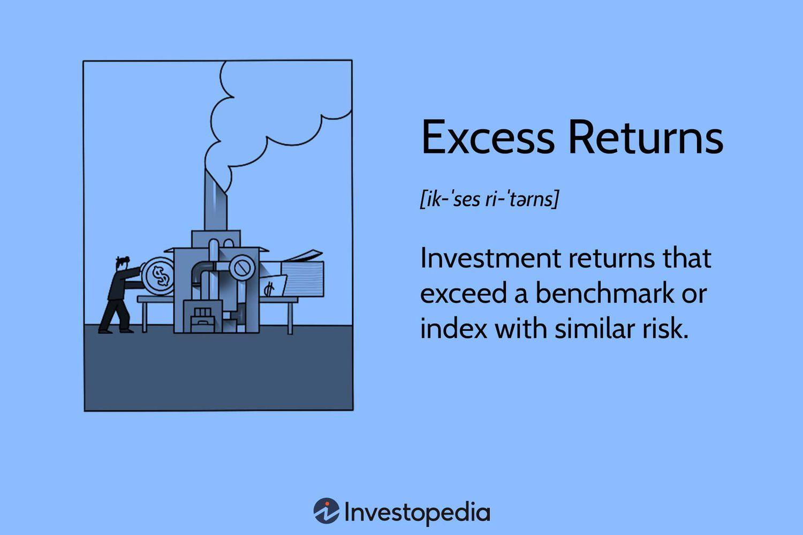

## Table of Contents

## What is an ETF and how does it differ from an indexed mutual fund?

An ETF, or Exchange-Traded Fund, is a type of investment that you can buy and sell on a stock exchange, just like individual stocks. It's designed to track the performance of a specific index, like the S&P 500, by holding a basket of assets that mirror the index. This means that when you invest in an ETF, you're essentially investing in a small piece of all the companies or assets within that index.

The main difference between an ETF and an indexed mutual fund is how they are bought and sold. An indexed mutual fund is also designed to track an index, but you can only buy or sell it at the end of the trading day at the net asset value price. On the other hand, ETFs can be traded throughout the day at market prices, which can fluctuate. This flexibility can be appealing if you want to react quickly to market changes. Additionally, ETFs often have lower expense ratios compared to indexed mutual funds, which means they can be a more cost-effective option for investors.

## What is meant by 'excess return' in the context of investments?

Excess return in investments is the extra money you make from an investment compared to what you would have earned from a benchmark, like a stock market index. For example, if your investment grows by 10% in a year, but the benchmark only grows by 6%, your excess return is 4%. This measure helps investors see if their investment choices are doing better than just following the market.

This concept is important because it shows how well a fund manager or an investment strategy is performing. If a fund consistently has positive excess returns, it means the fund is beating the market. On the other hand, if the excess return is negative, it means the investment is not doing as well as the market. This can help investors decide whether to stick with their current investments or look for better options.

## How do you calculate the total return of an ETF or indexed mutual fund?

To calculate the total return of an ETF or an indexed mutual fund, you need to consider both the change in the price of the fund and any income it generates, like dividends or interest. Let's say you bought an ETF for $100 and it's now worth $110. If the ETF also paid you $2 in dividends, your total return would be the increase in price plus the dividends. So, you'd add the $10 increase in price to the $2 in dividends, giving you a total return of $12, or 12% of your original $100 investment.

This calculation is important because it gives you a complete picture of how well your investment is doing. Just looking at the price change might make you think the ETF only grew by 10%, but when you include the dividends, you see it actually did better. This way, you can compare the total returns of different investments to see which one is performing the best for you.

## What benchmark should be used to calculate the excess return of an ETF or indexed mutual fund?

The benchmark you use to calculate the excess return of an ETF or indexed mutual fund should be the index that the fund is designed to track. For example, if your ETF tracks the S&P 500, then the S&P 500 is the benchmark you should use. This way, you can see if your ETF is doing better or worse than the overall market it's supposed to follow.

To find the excess return, you subtract the return of the benchmark from the total return of your ETF or indexed mutual fund. If your ETF had a total return of 10% and the S&P 500 had a return of 8%, your excess return would be 2%. This tells you that your ETF did 2% better than the market. It's a useful way to see if your investment choices are paying off.

## Can you explain the formula for calculating excess return?

To calculate the excess return of an ETF or indexed mutual fund, you need to know two things: the total return of your investment and the return of the benchmark it tracks. The total return includes any increase in the price of the fund plus any dividends or interest it paid out. The benchmark return is what the index, like the S&P 500, did over the same time period. To find the excess return, you simply subtract the benchmark return from your total return. If your ETF's total return was 10% and the benchmark's return was 8%, your excess return would be 2%.

This calculation helps you see if your investment is doing better than just following the market. If the excess return is positive, it means your ETF or mutual fund did better than the benchmark. If it's negative, it means it did worse. This information is useful for deciding whether to keep your investment or look for something that might perform better.

## What data sources are reliable for obtaining ETF and indexed mutual fund performance data?

For reliable data on ETF and indexed mutual fund performance, you can use websites like Morningstar and Yahoo Finance. These sites give you lots of information like how the funds have done over time, what they're invested in, and how much they cost. They're easy to use and update their information often, so you can trust what you see.

Another good source is the fund company's own website. Companies like Vanguard, BlackRock, and Fidelity have detailed reports on their funds. These reports show you the fund's performance, fees, and other important details. It's a good idea to check these because they come straight from the source, so you know they're accurate.

## How does the time period of investment affect the calculation of excess return?

The time period you choose for calculating excess return can make a big difference. If you look at a short time, like a month or a year, the excess return might be high or low because of short-term changes in the market. For example, if the market goes up a lot in one year, your ETF might look like it's doing really well compared to the benchmark. But if you look over a longer time, like five or ten years, you can see if the ETF is really doing better than the market over time, not just because of a good year.

Looking at different time periods can help you understand if the excess return is something that happens a lot or just by chance. Over a longer time, the ups and downs of the market can even out, so you get a better idea of how well your investment is really doing. This can help you decide if you should keep your money in the ETF or look for something else.

## What are common pitfalls to avoid when calculating excess return?

When calculating excess return, one common mistake is not using the right benchmark. If your ETF or mutual fund is supposed to follow the S&P 500, you need to compare it to the S&P 500, not something else. Using the wrong benchmark can make your investment look better or worse than it really is. Another pitfall is not including all the income from the fund, like dividends or interest. If you only look at the price change, you might miss out on a big part of the total return, which can make your excess return calculation wrong.

Another thing to watch out for is not considering the time period. Short-term results can be very different from long-term results. If you only look at a short time, like a few months, you might think your investment is doing great or terrible, but it could just be a temporary change. It's important to look at different time periods to get a full picture. Also, make sure you're using reliable data sources. Websites like Morningstar or the fund company's own site are good places to get accurate information. Using bad data can lead to wrong calculations and bad decisions about your investments.

## How can risk-adjusted excess return be calculated, and why is it important?

Risk-adjusted excess return helps you see how well your investment is doing when you think about how risky it is. One common way to calculate this is by using the Sharpe Ratio. To find the Sharpe Ratio, you take the excess return of your investment and divide it by the standard deviation of the investment's returns. The standard deviation tells you how much the returns go up and down, which shows how risky the investment is. A higher Sharpe Ratio means the investment is giving you more return for the risk you're taking.

This is important because just looking at excess return doesn't tell you the whole story. Some investments might give you high returns but be very risky. If you can find an investment with a good risk-adjusted excess return, it means you're getting a good return without taking on too much risk. This helps you make smarter choices about where to put your money, so you can feel more confident that you're getting a good balance between reward and risk.

## What role does the expense ratio play in the excess return of ETFs and indexed mutual funds?

The expense ratio is a big deal when you're looking at the excess return of ETFs and indexed mutual funds. It's the fee that the fund charges you every year, and it's taken out of your investment. If the expense ratio is high, it can eat into your returns. For example, if your ETF has a total return of 10% but the expense ratio is 1%, your actual return is only 9%. When you calculate the excess return, you need to use the return after the expense ratio is taken out. So, a high expense ratio can make your excess return look smaller.

This is why it's important to pay attention to the expense ratio when you're choosing an ETF or indexed mutual fund. A lower expense ratio means more of your money stays in your pocket, which can make a big difference over time. If two funds have the same total return but one has a lower expense ratio, the one with the lower fee will give you a higher excess return. So, always check the expense ratio to make sure you're getting the best value for your investment.

## How can one compare the excess returns of different ETFs or indexed mutual funds to make informed investment decisions?

To compare the excess returns of different ETFs or indexed mutual funds, you need to look at how each one does compared to its benchmark over the same time period. For example, if one ETF follows the S&P 500 and another follows the Nasdaq, you need to compare each one to its own benchmark. You calculate the total return for each fund, including any price changes and dividends, then subtract the return of the benchmark to find the excess return. This way, you can see which fund is doing better than its market.

It's also important to think about the expense ratio when comparing excess returns. The expense ratio is the fee the fund charges you every year, and it can make a big difference in your returns. A fund with a lower expense ratio will have a higher excess return because less of your money is taken out for fees. So, when you're looking at different funds, make sure to compare the excess returns after the expense ratio is taken into account. This will give you a clearer picture of which fund is really giving you the best value for your investment.

## What advanced statistical methods can be used to enhance the accuracy of excess return calculations for expert analysis?

To make excess return calculations more accurate for expert analysis, you can use advanced statistical methods like regression analysis. This method helps you understand how different factors affect the return of your investment. For example, you can use regression to see how much of the return comes from the market and how much comes from the specific choices the fund manager made. By doing this, you can get a better idea of the true excess return, which is the part that's not just from following the market.

Another useful method is bootstrapping. This technique involves taking many samples from your data to see how reliable your excess return calculation is. By doing this, you can create a range of possible excess returns and see how likely it is that your investment will beat the market. This helps you understand the uncertainty in your calculations and make more informed decisions. Both regression analysis and bootstrapping can give you a deeper and more accurate look at how well your investment is doing compared to the market.

## What is Exploring Excess Return?

Excess return, often referred to as alpha, is a critical metric in investment analysis, representing the investment returns that exceed those of a specified benchmark. Calculating this metric helps investors determine the value added by fund managers or investment strategies. By isolating the performance that goes beyond the typical market movement, excess return provides insights into the effectiveness of active management and the actual skill of managers in generating profits beyond passive market gains.

For both Exchange-Traded Funds (ETFs) and mutual funds, generating positive excess returns can be challenging. Several factors, including management fees and prevailing market conditions, can erode the potential for returns that surpass the benchmark. As such, even if a fund exhibits strong gross performance, its net returns, after accounting for all expenses, might struggle to outpace the index it aims to beat.

The calculation of excess returns typically involves straightforward financial mathematics. The basic formula is:

$$
\text{Excess Return} = \text{Fund's Total Return} - \text{Benchmark's Return}
$$

This straightforward calculation offers a raw insight into the performance beyond market benchmarks. However, investors often seek a nuanced understanding by employing models such as the Capital Asset Pricing Model (CAPM), which provides risk-adjusted insights. The CAPM formula is:

$$
E(R_i) = R_f + \beta_i (E(R_m) - R_f)
$$

Where:
- $E(R_i)$ is the expected return of investment,
- $R_f$ denotes the risk-free rate,
- $\beta_i$ represents the sensitivity of the investment's returns to the returns of the market,
- $E(R_m)$ is the expected return of the market.

In this context, the alpha is calculated as:

$$
\text{Alpha} = R_i - (R_f + \beta_i (R_m - R_f))
$$

This adjusted form accounts for the risk undertaken compared to the market's movement, allowing investors to better assess whether fund managers are truly adding value or merely riding market trends. Understanding and calculating excess returns is paramount for investors seeking to tailor their portfolios to achieve significant performance over time while effectively managing associated risks.

## What is the Rise of ETFs?

Exchange-traded funds (ETFs) have experienced significant growth and widespread adoption in financial markets, largely due to their inherent advantages of flexibility, [liquidity](/wiki/liquidity-risk-premium), and reduced expense ratios compared to traditional mutual funds. ETFs are structured to allow investors to trade them throughout the business day, just like stocks, offering the capacity to respond swiftly to market fluctuations and optimize investment positions.

One of the primary attractions of ETFs lies in their typically lower cost structure. Unlike mutual funds, which often involve higher management fees, ETFs generally have lower operating costs, thanks in part to their passive management strategy. This cost-effectiveness allows investors to retain more of their returns, enhancing the overall appeal of ETFs for both individual and institutional investors.

Despite the advantages, investors should be aware of performance considerations. While ETFs are designed to track specific indices, their performance may not always exceed their benchmarks. The potential for excess returns, however, remains a key draw. Excess return, often referred to as alpha, represents the returns that exceed those expected based on the risk-adjusted benchmark performance. Even though most ETFs are passive and may not always surpass their indices, their potential to achieve excess returns makes them a compelling choice compared to indexed mutual funds.

To evaluate the performance of ETFs against their benchmarks, investors employ various risk-adjusted performance metrics. One common method is the Capital Asset Pricing Model (CAPM), which assesses expected returns based on the systematic risk (beta) associated with the [ETF](/wiki/etf-trading-strategies). The CAPM formula is given by:

$$

\text{Expected Return} = R_f + \beta \times (R_m - R_f) 
$$

Where $R_f$ is the risk-free rate, $\beta$ is the beta of the ETF, and $R_m$ is the expected market return. By calculating the expected return using this formula, investors can compare it with the actual ETF performance to determine its risk-adjusted excess return.

In addition to CAPM, the weighted average cost of equity (WACE) can be used to measure the equity component’s cost, providing further insight into the fund's efficiency in generating returns relative to its risk profile. 

The multifaceted appeal of ETFs, encompassing trading flexibility, cost efficiency, and the opportunity for excess returns, continues to catapult them to the forefront of investment strategies. By leveraging these advantages, investors can effectively navigate dynamic market conditions and enhance their investment portfolios.

## References & Further Reading

[1]: Malkiel, B.G. (2019). ["A Random Walk Down Wall Street: The Time-Tested Strategy for Successful Investing"](https://www.academia.edu/10850809/A_Random_Walk_Down_Wall_Street_The_Time_Tested_Strategy_for_Successful_Investing). W. W. Norton & Company.

[2]: Bogle, J.C. (2017). ["The Little Book of Common Sense Investing: The Only Way to Guarantee Your Fair Share of Stock Market Returns"](https://www.amazon.com/Little-Book-Common-Sense-Investing/dp/1119404509). John Wiley & Sons.

[3]: Lo, A.W. (2017). ["Adaptive Markets: Financial Evolution at the Speed of Thought"](https://www.jstor.org/stable/j.ctvc7778k). Princeton University Press.

[4]: Sharpe, W.F. (1964). ["Capital Asset Prices: A Theory of Market Equilibrium under Conditions of Risk."](https://onlinelibrary.wiley.com/doi/full/10.1111/j.1540-6261.1964.tb02865.x) Journal of Finance, 19(3), 425-442.

[5]: Poterba, J.M., & Shoven, J.B. (2002). ["Exchange-Traded Funds: A New Investment Option for Taxable Investors."](https://www.nber.org/papers/w8781) American Economic Review, 92(2), 422-427.

[6]: Hasbrouck, J. (2003). ["Intraday Price Formation in U.S. Equity Markets."](https://onlinelibrary.wiley.com/doi/10.1046/j.1540-6261.2003.00609.x) Review of Financial Studies, 16(4), 892-925.