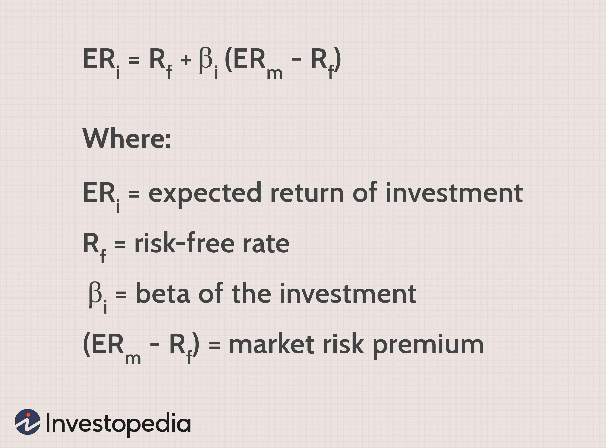

## Table of Contents

## What is a portfolio and why is calculating its expected return important?

A portfolio is a collection of different investments like stocks, bonds, or real estate, that an individual or an institution owns. It's like a basket where you put all your investment eggs. The goal of a portfolio is to grow your money over time while managing risk. By spreading your investments across different types of assets, you can reduce the chance that all your investments will go down at the same time.

Calculating the expected return of a portfolio is important because it helps you understand how much money you might make from your investments. This is crucial for planning your financial future. If you know the expected return, you can decide if your portfolio is meeting your goals or if you need to make changes. It also helps you compare different investment options to see which ones might give you the best results for the level of risk you're willing to take.

## How do you define expected return for a single investment in Excel?

To define the expected return for a single investment in Excel, you need to know the possible outcomes and their probabilities. For example, if you're looking at a stock, you might consider different future prices and how likely each price is to happen. In Excel, you can list these possible outcomes in one column and their probabilities in another. Then, you multiply each outcome by its probability and add up all these products. The formula for this is simple: expected return equals the sum of (each outcome times its probability).

Let's say you have three possible outcomes for a stock: it could go up by 10%, stay the same, or go down by 5%. You think there's a 50% chance it will go up, a 30% chance it will stay the same, and a 20% chance it will go down. In Excel, you would put these outcomes in one column (like A1, A2, A3) and the probabilities in another column (like B1, B2, B3). Then, you would use the formula =SUMPRODUCT(A1:A3, B1:B3) to calculate the expected return. This would give you a number that shows, on average, what you can expect the stock to do.

## What is the formula for calculating the expected return of a portfolio?

The expected return of a portfolio is the total return you can expect from all the investments in your portfolio. To find it, you need to know the expected return of each investment and how much of your money is in each one. You take the expected return of each investment, multiply it by the part of your portfolio that investment makes up, and then add up all these numbers. For example, if you have two investments, one expected to return 5% and making up 60% of your portfolio, and another expected to return 10% and making up 40% of your portfolio, the expected return of your portfolio would be (0.05 * 0.60) + (0.10 * 0.40) = 0.03 + 0.04 = 0.07, or 7%.

This formula is important because it helps you see what your whole portfolio might do, not just one investment. By knowing the expected return of your portfolio, you can decide if it fits with your goals. If you want a higher return, you might need to change your investments or how much you put into each one. It's like looking at the whole picture instead of just one piece, which helps you make better choices about your money.

## How do you input asset weights and expected returns into Excel?

To input asset weights and expected returns into Excel, start by listing the names of your investments in one column, like column A. In the next column, column B, you can put the weights of each investment. The weights show how much of your portfolio each investment makes up. For example, if you have three investments and you put 40% of your money in the first one, 30% in the second, and 30% in the third, you would write 0.40, 0.30, and 0.30 in column B next to each investment's name. Make sure the weights add up to 1, which means 100% of your portfolio.

In the next column, column C, you can list the expected returns for each investment. The expected return is how much you think each investment will grow. For example, if you think the first investment will grow by 5%, the second by 10%, and the third by 8%, you would write 0.05, 0.10, and 0.08 in column C next to each investment's name. Once you have these numbers in Excel, you can use them to calculate the expected return of your whole portfolio by multiplying each investment's expected return by its weight and then adding up all those numbers.

## What is the difference between arithmetic and geometric mean returns, and how do you calculate them in Excel?

The arithmetic mean return is like taking the average of all the returns you get from an investment over time. It's simple to calculate: you add up all the returns and divide by the number of returns. This can be useful for short periods or when you want to see what the average return has been. But, it doesn't account for how returns can change over time. In Excel, you can calculate the arithmetic mean return by listing all the returns in a column, say column A, and then using the formula =AVERAGE(A1:Ax), where 'x' is the last cell with a return.

The geometric mean return, on the other hand, looks at how your investment grows over time, taking into account the effect of compounding. It's more accurate for long-term investments because it shows what your money would actually grow to be. To calculate it, you multiply all the returns together and then take the nth root of that product, where n is the number of returns. In Excel, you can find the geometric mean return by listing the returns in a column, say column A, and then using the formula =GEOMEAN(A1:Ax), where 'x' is the last cell with a return. This gives you a better idea of what your investment might do over time.

## How can you use the SUMPRODUCT function in Excel to calculate portfolio expected return?

To calculate the expected return of a portfolio using the SUMPRODUCT function in Excel, you first need to set up your data. List the expected returns of each investment in one column, say column A, and the weights of each investment in another column, say column B. The weights show how much of your money is in each investment. For example, if you have three investments with expected returns of 5%, 10%, and 8%, and you put 40% of your money in the first one, 30% in the second, and 30% in the third, you would list 0.05, 0.10, and 0.08 in column A, and 0.40, 0.30, and 0.30 in column B.

Once your data is set up, you can use the SUMPRODUCT function to calculate the expected return of your portfolio. In an empty cell, you would type =SUMPRODUCT(A1:A3, B1:B3), assuming your data is in the first three rows of columns A and B. This function will multiply each expected return by its corresponding weight and then add up all these products to give you the expected return of your whole portfolio. For our example, it would be (0.05 * 0.40) + (0.10 * 0.30) + (0.08 * 0.30) = 0.02 + 0.03 + 0.024 = 0.074, or 7.4%. This way, you can easily see what your portfolio might do based on the expected returns and weights of your investments.

## What are the steps to create a dynamic expected return calculator in Excel?

To create a dynamic expected return calculator in Excel, start by setting up your spreadsheet. In one column, list the names of your investments. In the next column, enter the weights of each investment, which show how much of your portfolio each investment makes up. Make sure the weights add up to 1, or 100% of your portfolio. In another column, put the expected returns for each investment. These are the numbers that show how much you think each investment will grow. Use simple numbers like 0.05 for 5% or 0.10 for 10%.

Once your data is set up, you can use the SUMPRODUCT function to calculate the expected return of your whole portfolio. In an empty cell, type =SUMPRODUCT(expected returns range, weights range). For example, if your expected returns are in column C and your weights are in column B, you would use =SUMPRODUCT(C1:Cx, B1:Bx), where 'x' is the last row with data. This function will multiply each expected return by its weight and add up all these products to give you the expected return of your portfolio. Now, whenever you change the expected returns or weights, the calculator will automatically update to show you the new expected return.

## How do you incorporate historical data to estimate future expected returns in Excel?

To use historical data to estimate future expected returns in Excel, start by collecting the past returns of your investments. You can find this data from financial websites or your investment statements. Put the returns in a column in Excel, like column A. For example, if you have data for the last 5 years, you would list the yearly returns for each investment in column A. Then, you can use Excel to calculate the average of these returns, which gives you an idea of what might happen in the future. Use the AVERAGE function, like =AVERAGE(A1:A5), to find the arithmetic mean return. This simple average can be your first guess for the expected return.

However, you might want to use the geometric mean return for a more accurate long-term estimate because it considers how returns compound over time. To calculate the geometric mean return, use the GEOMEAN function, like =GEOMEAN(A1:A5). This will give you a better idea of what your investment might do over the long run. Once you have these numbers, you can put them in your dynamic expected return calculator as the expected returns for each investment. This way, your calculator will use real historical data to help you guess what might happen in the future. Remember, past performance doesn't guarantee future results, but it can give you a good starting point.

## What are the limitations of using historical data for expected return calculations?

Using historical data to guess future expected returns can be tricky because past results don't always tell us what will happen next. The stock market and other investments can change a lot over time. What happened last year or the last five years might not happen again. For example, if a stock went up a lot one year, it doesn't mean it will go up the same amount next year. There are also things like new laws, big world events, or changes in the economy that can make the future different from the past.

Another problem is that historical data can be too simple. It might not show all the ups and downs that can happen with investments. If you just look at the average return, you might miss big drops or jumps that can affect your money. Also, the way you calculate the average can make a difference. The arithmetic mean might be easier to understand, but the geometric mean is better for long-term planning because it shows how returns build up over time. So, while historical data can give you a starting point, you need to be careful and think about other things too when planning for the future.

## How do you adjust for risk in expected return calculations using Excel?

To adjust for risk in expected return calculations using Excel, you need to consider how much an investment might go up or down. One way to do this is by using something called the standard deviation, which shows how much returns can change. In Excel, you can calculate the standard deviation of past returns using the STDEV function. For example, if your past returns are in column A, you can use =STDEV(A1:Ax) to find out how much they vary. Once you know the standard deviation, you can add or subtract it from your expected return to see what might happen in good or bad times. This helps you understand the risk and decide if you're okay with it.

Another way to adjust for risk is by using the Sharpe Ratio, which compares the return of an investment to its risk. In Excel, you can calculate the Sharpe Ratio by taking the difference between the expected return and the risk-free rate (like a government bond), then dividing that by the standard deviation. If your expected return is in cell B1, the risk-free rate is in cell C1, and the standard deviation is in cell D1, you can use the formula =(B1-C1)/D1. A higher Sharpe Ratio means the investment gives you more return for the risk you're taking. By using these tools in Excel, you can get a better idea of how risky your investments are and make smarter choices about your money.

## Can you explain how to use Monte Carlo simulations in Excel to forecast portfolio returns?

To use Monte Carlo simulations in Excel to forecast portfolio returns, start by setting up your spreadsheet with the historical returns of your investments. You can use these historical returns to guess what might happen in the future. Next, use the RAND or RANDBETWEEN functions to create random numbers that represent possible future returns. These random numbers help you see many different ways your portfolio might do. For example, if you have three investments, you can use the RAND function to make random returns for each one, and then use the SUMPRODUCT function to calculate the total return for your portfolio each time.

After you have your random returns and portfolio calculations, you can run the simulation many times to see all the possible outcomes. To do this, copy your random return formulas down many rows in Excel, like 1000 or more. Each row will give you a different possible future for your portfolio. Then, you can use Excel's built-in functions like AVERAGE and STDEV to find out the average return and how much it might vary. This helps you understand not just what might happen on average, but also the best and worst cases. By looking at these many different futures, you can make better choices about your investments, knowing more about the risks and rewards.

## How do you account for correlation between assets when calculating portfolio expected return in Excel?

When you're figuring out the expected return of a portfolio in Excel, it's important to think about how the different investments might move together. This is called correlation. If two investments tend to go up or down at the same time, they are highly correlated. But if one goes up when the other goes down, they have a low or negative correlation. To account for this in Excel, you need to know the correlation between each pair of investments. You can use the CORREL function to find out how two sets of returns are related. For example, if the returns for investment A are in column A and for investment B are in column B, you can use =CORREL(A1:Ax, B1:Bx) to find the correlation between them.

Once you have the correlations, you can use them to get a better idea of your portfolio's expected return and risk. You can use the covariance matrix, which shows how all your investments move together, to help with this. In Excel, you can build this matrix using the COVAR function for each pair of investments. Then, you can use these numbers in a formula that calculates the portfolio's variance, which shows how much your portfolio might go up or down. The formula for portfolio variance takes into account the weights of each investment, their expected returns, and the correlations between them. By using this in Excel, you can see not just the average return but also how much your portfolio might change, giving you a clearer picture of what might happen.

## What is Understanding Expected Return?

Expected return is a fundamental concept in finance that measures the anticipated average return from an investment portfolio over a designated period. This metric is central to making informed investment decisions, enabling investors to evaluate the potential profitability and risk associated with various trading strategies.

To estimate expected return, one typically employs statistical techniques that analyze historical data to project future returns. The calculation of expected return is primarily formulated through the weighted average of possible returns, using probabilities as weights. Mathematically, this can be represented as:

$$
E(R) = \sum (p_i \times r_i)
$$

where $E(R)$ is the expected return, $p_i$ is the probability of each return outcome, and $r_i$ is the return in each state.

In the context of [algorithmic trading](/wiki/algorithmic-trading), accurate calculation of expected returns is vital for developing strategies that are responsive to current market conditions and specific risk profiles. By understanding expected return, traders can tailor their algorithmic strategies to optimize performance, align with risk tolerance, and achieve investment goals.

Expected return calculations are also pivotal for comparing the profitability of different assets or portfolios. They guide traders in determining which assets to include in a portfolio based on their risk-return profile. Additionally, these calculations assist in assessing the efficacy of trading algorithms by aligning them with market dynamics and anticipated return outcomes.

Prior to applying expected return calculations in tools like Excel, comprehending the core principles that underpin these estimations is essential. This involves a clear understanding of probability, statistical distributions, and how various factors like market [volatility](/wiki/volatility-trading-strategies) and economic conditions can impact expected returns.

## How do you calculate expected return in Excel?

To calculate the expected return of a trading portfolio in Excel, start by gathering historical price data for each asset within the portfolio. This data serves as the foundation for the calculations. By using the Excel AVERAGE function, you can determine each asset's average return. This is done by applying the formula:

$$
\text{Average Return} = \text{AVERAGE}(\text{Range of Historical Returns})
$$

Once the average return of each asset is determined, the next step is to calculate the portfolio's expected return. This involves weighting each asset's average return according to its proportion (or weight) in the overall portfolio. The Excel SUMPRODUCT function is particularly useful for this calculation, which can be expressed as:

$$
\text{Expected Portfolio Return} = \text{SUMPRODUCT}(\text{Weights}, \text{Average Returns})
$$

This formula effectively sums the products of each asset's weight and its average return, providing the overall expected return for the portfolio.

To ensure these calculations align with the Efficient Market Hypothesis, it’s important to consider the covariance of asset returns, particularly for diversified portfolios. Covariance measures how two assets move together and can be calculated using the COVARIANCE.P function in Excel. While calculating expected returns, incorporating covariance can help assess and mitigate potential risks.

Excel's robust functionality allows for these calculations to be automated, providing flexibility and efficiency in managing portfolios. Through the use of Excel VBA (Visual Basic for Applications) or built-in formulas, traders can automate the recalculation of expected returns whenever changes in portfolio composition or market data occur. This dynamic updating is crucial for maintaining an accurate assessment of the portfolio's performance in response to real-time market developments.

## What is the conclusion?

Mastering the calculation of expected return in Excel can significantly enhance the efficacy of your algorithmic trading strategies. By leveraging Excel's capabilities, traders can efficiently integrate financial theories with practical tools, resulting in more informed, data-driven decisions. This process involves weighting each asset's average return based on its portfolio proportion. For instance, the expected return $E(R_p)$ of a portfolio can be calculated using:

$$
E(R_p) = \sum_{i=1}^{n} w_i \times E(R_i)
$$

where $w_i$ is the weight of each asset in the portfolio, and $E(R_i)$ is the expected return of each asset.

As technology and market conditions continually evolve, continuous learning and adaptation remain crucial. While Excel provides a solid foundation for expected return calculations, it's beneficial to complement these capabilities with other financial tools and platforms. This could involve integrating more advanced data analytics software or adopting real-time data feeds to further enhance trading precision and efficiency.

For both novice and experienced traders, leveraging Excel for expected return calculations can provide a critical edge in the fast-paced world of financial markets. The ability to automate and swiftly update these calculations ensures that traders remain agile and responsive to changing market dynamics, thereby optimizing their algorithmic trading strategies.

## References & Further Reading

[1]: ["Advances in Financial Machine Learning"](https://www.amazon.com/Advances-Financial-Machine-Learning-Marcos/dp/1119482089) by Marcos Lopez de Prado

[2]: ["Evidence-Based Technical Analysis: Applying the Scientific Method and Statistical Inference to Trading Signals"](https://www.amazon.com/Evidence-Based-Technical-Analysis-Scientific-Statistical/dp/0470008741) by David Aronson

[3]: ["Machine Learning for Algorithmic Trading"](https://github.com/PacktPublishing/Machine-Learning-for-Algorithmic-Trading-Second-Edition) by Stefan Jansen

[4]: ["Quantitative Trading: How to Build Your Own Algorithmic Trading Business"](https://www.amazon.com/Quantitative-Trading-Build-Algorithmic-Business/dp/1119800064) by Ernest P. Chan

[5]: Alexander, C. (2008). ["Market Risk Analysis Volume I: Quantitative Methods in Finance"](https://www.wiley.com/en-us/Market+Risk+Analysis%2C+Volume+I%2C+Quantitative+Methods+in+Finance-p-9780470998007)