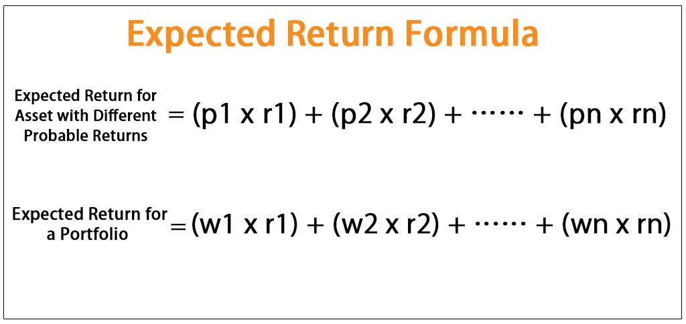

Portfolio returns, investment calculation, financial analysis, and algorithmic trading represent crucial components for modern investors seeking to optimize their financial strategies. Understanding these elements is essential for making informed decisions that can enhance a portfolio's performance while managing associated risks effectively. Analyzing portfolio returns is paramount for strategic financial planning as it provides insights into the efficacy of investment strategies and aids in adjusting allocations to meet financial goals. By examining returns, investors can identify trends, assess risk exposures, and refine their portfolios to better align with their risk tolerance and return expectations.

Several key elements can influence portfolio performance and decision-making. These elements include market conditions, economic factors, asset allocation, diversification, and the use of technology in executing trades. Diversification, in particular, helps to spread risk across various asset classes, potentially smoothing returns and reducing the portfolio's overall volatility.

Algorithmic trading has emerged as a significant tool in optimizing returns and managing risk. By employing algorithms, investors can execute trades with greater precision and speed, benefiting from improved price efficiencies and reduced transaction costs. This technological advancement allows for the automation of complex trading strategies, offering the potential to maximize gains while mitigating losses.

Effectively calculating and interpreting investment returns involves comprehending various metrics and methodologies. Metrics such as the Sharpe ratio, the sortino ratio, and the capital asset pricing model (CAPM) provide insights into the relationship between risk and returns. Utilizing these tools allows investors to gauge the performance of individual assets and entire portfolios, thereby strengthening their investment strategies.

In summary, mastering the concepts of portfolio returns, investment calculation, financial analysis, and algorithmic trading equips investors with the knowledge to make data-driven decisions. This foundation aids in attaining desired financial outcomes through strategic planning and the prudent allocation of resources.

## Table of Contents

## Understanding Portfolio Returns

Portfolio returns represent the gain or loss generated by the investments held in a portfolio over a specific period. These returns are significant as they indicate the effectiveness of investment strategies and the performance of assets relative to benchmarks, thus guiding strategic financial planning and decision-making.

One of the core distinctions in assessing portfolio returns is between expected returns and actual returns. Expected returns are forecasts based on historical data, financial models, or statistical techniques, conveying what investors anticipate [earning](/wiki/earning-announcement) over a given period. In contrast, actual returns are the realized gains or losses experienced by the portfolio. These can diverge due to market fluctuations, unexpected events, or changes in economic conditions.

Historical performance plays a crucial role in shaping expected returns. By analyzing past data, investors can identify trends and patterns that may suggest future outcomes. However, it's important to recognize that past performance is not always a reliable indicator of future results, as market dynamics can shift due to numerous factors.

Several key metrics are essential for calculating portfolio returns. The most common include:

1. **Arithmetic Mean Returns**: This simple average of periodic returns is calculated as:
$$
   \text{Arithmetic Mean} = \frac{1}{N} \sum_{i=1}^{N} R_i

$$

   where $R_i$ represents the return in each period, and $N$ is the number of periods.

2. **Geometric Mean Returns**: This provides a more accurate measure of compounded periodic returns:
$$
   \text{Geometric Mean} = \left( \prod_{i=1}^{N} (1+R_i) \right)^{\frac{1}{N}} - 1

$$

3. **Internal Rate of Return (IRR)**: The IRR estimates the profitability of potential investments, solving for the discount rate that makes the net present value (NPV) of all cash flows from the investment equal to zero.

4. **Volatility (Standard Deviation)**: A measure of the dispersion of returns, indicating the risk associated with the portfolio.

Diversification plays a pivotal role in achieving optimal returns. By spreading investments across various asset classes, sectors, or geographic regions, investors can mitigate specific risks associated with individual securities. Diversification reduces the impact of poor performance by any single asset on the overall portfolio, thus enhancing the potential for stable and higher returns. The concept is rooted in the principle that a well-diversified portfolio will, on average, yield better returns and pose a lower risk than any individual investment within it. 

In summary, understanding and effectively managing portfolio returns require a solid grasp of the differences between expected and actual returns, a reliance on historical performance to forecast future trends, and the implementation of key metrics for evaluation. Furthermore, employing a strategy of diversification is essential for optimizing returns while managing risk effectively.

## Calculating Investment Returns

Calculating investment returns is fundamental for investors seeking to understand the performance of their portfolios. This process involves breaking down various components and utilizing several key formulae and metrics.

### Process for Calculating Expected Returns

To estimate the expected returns of a portfolio, one common approach is to use the weighted average of the expected returns of individual assets. The formula can be expressed as:

$$

E(R_p) = \sum_{i=1}^{n} w_i \times E(R_i) 
$$

Where:
- $E(R_p)$ is the expected return of the portfolio.
- $w_i$ is the weight of each asset in the portfolio.
- $E(R_i)$ is the expected return of each asset.
- $n$ is the total number of assets.

### Key Formulae and Metrics

Several metrics are used to calculate and interpret portfolio returns:

1. **Arithmetic Mean Return**: A simple average of periodic returns.

2. **Geometric Mean Return**: A compound average that accounts for the effects of compounding over time, especially relevant for longer periods:
$$
   G = \left( \prod_{i=1}^{n} (1 + R_i) \right)^{\frac{1}{n}} - 1

$$

3. **Volatility**: Measure of risk, typically represented by the standard deviation of historical returns.

4. **Sharpe Ratio**: Indicates risk-adjusted return:
$$
   \text{Sharpe Ratio} = \frac{E(R_p) - R_f}{\sigma_p}

$$

   Where $R_f$ is the risk-free rate and $\sigma_p$ is the standard deviation of the portfolio returns.

### Step-by-Step Examples

When calculating returns on individual assets, consider a stock purchased at $100 and sold at $150 with an annual dividend of $5. The return can be calculated as:

$$
\text{Total Return} = \frac{(150 - 100) + 5}{100} = 0.55 \, \text{or} \, 55\%
$$

For entire portfolios, if a portfolio consists of 60% stock A (expected return of 10%) and 40% stock B (expected return of 5%), the expected return is:

$$

E(R_p) = (0.60 \times 0.10) + (0.40 \times 0.05) = 0.08 \, \text{or} \, 8\%
$$

### Time-Weighted vs. Money-Weighted Returns

1. **Time-Weighted Return**: This method calculates the compounded rate of growth per unit of capital invested. It's useful for evaluating the performance of investment managers as it neutralizes the impact of cash flows.

2. **Money-Weighted Return**: Also known as the Internal Rate of Return (IRR), it considers the size and timing of cash flows. It is best for understanding the return on the overall investment from the investor's perspective.

### Pitfalls and Limitations

Common pitfalls include neglecting fees and taxes which impact net returns, ignoring the impact of inflation, and over-relying on historical data which might not predict future performance. Additionally, using the arithmetic mean for returns over multiple periods can overestimate effective returns due to not accounting for compounding effects.

Understanding and vigilantly applying these calculations are crucial for making well-informed investment decisions. These methods, while robust, require careful consideration of inputs and assumptions to ensure accuracy and relevance in depicting potential financial outcomes.

## The Role of Financial Analysis in Portfolio Management

Financial analysis serves as a cornerstone in portfolio management, aiming to guide investors in making informed choices that align with their financial goals. The primary scope of financial analysis in managing investments revolves around evaluating the performance of various assets and optimizing the balance between risk and return. By dissecting historical data and future market expectations, financial analysis aids in formulating strategies that cater to both the conservative and aggressive appetites of investors. 

Risk and return trade-offs are integral to investment decisions. Financial analysis assists investors in identifying the relationship between the level of risk they are willing to assume and the potential returns they can achieve. Metrics such as the Sharpe Ratio, which calculates the excess return per unit of risk, are commonly used to assess this trade-off. $\text{Sharpe Ratio} = \frac{E(R_p) - R_f}{\sigma_p}$ where $E(R_p)$ is the expected portfolio return, $R_f$ is the risk-free rate, and $\sigma_p$ is the standard deviation of portfolio returns. By analyzing these figures, investors can benchmark the performance of their portfolio against market standards.

Financial analysis employs a variety of tools and techniques, each providing unique insights. Fundamental analysis examines a company’s financial statements to assess its intrinsic value, while technical analysis scrutinizes statistical trends derived from trading activity. The use of software-based platforms and financial models, such as Monte Carlo simulations, allows investors to predict and visualize potential outcomes based on different scenarios. These analytical tools support decision-making by offering a comprehensive picture of investment dynamics.

Assessing market conditions and economic factors is a critical component of financial analysis. Economic indicators such as interest rates, inflation, and GDP growth can significantly influence asset prices and investor sentiment. Understanding the macroeconomic environment helps investors anticipate market trends and make strategic adjustments to their portfolios. For instance, during periods of economic expansion, equity markets generally perform well, whereas conservative assets like bonds may be more favorable during economic downturns.

Regular performance reviews and strategic adjustments are necessary to maintain the alignment of a portfolio with an investor’s goals. Financial analysis allows investors to conduct thorough performance evaluations to determine whether current strategies are effective. By analyzing performance data, investors can identify assets or sectors that are underperforming and make necessary adjustments, such as rebalancing the portfolio to improve its overall efficiency. Continuous monitoring and reassessment ensure that portfolios remain robust and adaptable to changing market landscapes.

In summary, financial analysis provides a structured framework for understanding and optimizing investment decisions. It evaluates risk and return, applies sophisticated tools and techniques, assesses economic factors, and ensures regular portfolio review, thereby supporting investors in achieving their financial objectives.

## Algorithmic Trading: Enhancing Portfolio Returns

Algorithmic trading refers to the use of computer algorithms to automate trading decisions and execute trades with minimal human intervention. These algorithms process vast amounts of market data at high speed, seeking to capitalize on opportunities for profit based on pre-programmed criteria. Algorithmic trading has significantly impacted modern investment strategies by improving the efficiency, accuracy, and speed of trade execution, thus enhancing portfolio returns.

One of the primary benefits of [algorithmic trading](/wiki/algorithmic-trading) is its ability to optimize trade execution. Algorithms can execute trades at the best possible prices, minimize market impact, and reduce transaction costs by splitting large orders into smaller ones and executing them over time. This precision is particularly valuable in high-frequency trading ([HFT](/wiki/high-frequency-trading-strategies)), where the rapid execution of trades is crucial. Additionally, algorithmic trading reduces the likelihood of human errors and emotions influencing decision-making, thus ensuring a more objective and disciplined approach to trading.

Various strategies are employed in algorithmic trading, each designed to exploit specific market opportunities. These strategies include [trend following](/wiki/trend-following), mean reversion, [arbitrage](/wiki/arbitrage), and [market making](/wiki/market-making). Trend-following algorithms identify patterns in price movements and take positions in the direction of the trend, while mean reversion strategies bet on prices returning to their historical averages. Arbitrage strategies exploit price discrepancies between different markets or instruments, and market-making algorithms provide [liquidity](/wiki/liquidity-risk-premium) by continuously quoting buy and sell prices.

Algorithmic trading also plays a vital role in risk management and return maximization. By analyzing historical data and real-time market information, algorithms can identify and mitigate potential risks more effectively than manual processes. For example, algorithms can implement stop-loss orders and other risk controls automatically, maintaining the desired risk levels in a portfolio. Furthermore, by continuously monitoring market conditions, algorithms can adjust strategies in real-time, optimizing returns and adapting to changing market dynamics.

Several real-world examples demonstrate the success of algorithmic trading applications. For instance, Renaissance Technologies, a [hedge fund](/wiki/hedge-fund-trading-strategies) known for its Medallion Fund, has consistently outperformed traditional investment strategies by employing sophisticated mathematical models and algorithms. Another example is Two Sigma Investments, a quantitative investment firm that leverages data science and technology to achieve superior investment performance.

Algorithmic trading continues to shape the landscape of modern finance, driven by advancements in technology and data analytics. Its ability to enhance portfolio returns through optimized trade execution, sophisticated risk management, and adaptive strategies makes it an invaluable tool for investors seeking competitive advantages in the financial markets.

## Implementing Algorithmic Solutions in Your Investment Strategy

Integrating algorithmic trading into an existing investment strategy requires a thoughtful approach to technology and knowledge acquisition. At the core, algorithmic trading utilizes computer algorithms to automate trading decisions, capitalizing on speed and precision.

### Technological and Knowledge Requirements

**Technological Setup**: Successful algorithmic trading begins with a robust technological infrastructure. Investors need data feeds that provide accurate and real-time market information. A stable and fast internet connection, powerful computing hardware, and access to trading platforms and APIs, such as Interactive Brokers or Alpaca, are essential components. Adopting cloud computing services can also provide scalability and flexibility.

**Programming Skills**: Proficiency in programming languages like Python, C++, or Java is vital because they allow for the creation and testing of trading algorithms. Python, in particular, is favored for its simplicity and extensive libraries, such as Pandas for data manipulation and Backtrader for strategy testing.

**Understanding of Financial Markets**: A thorough understanding of market dynamics and trading mechanisms is crucial. Investors should have a solid grasp of concepts such as market microstructure, order types, and pricing models.

### Challenges and Risks

Algorithmic trading is not without its risks and challenges. 

**Technical Failures**: Technology-related issues such as server downtime, latency, and erroneous data can lead to significant trading losses if not properly managed. 

**Model Risk**: Trading algorithms based on historical data can suffer from model risk if market conditions change unexpectedly. The infamous "quant meltdown" of August 2007 exemplifies how synchronized risk models can fail.

**Regulatory Compliance**: Different jurisdictions have distinct regulations on algorithmic trading. Ensuring compliance is both essential and challenging, requiring a solid understanding of the legal landscape.

### Best Practices

Combining algorithmic tools with human oversight can mitigate some of these risks. 

**Continuous Monitoring**: While algorithms can operate independently, human oversight remains indispensable. Regular monitoring allows for real-time intervention when anomalies occur or when the market conditions exceed the parameters of the algorithm.

**Backtesting and Simulation**: Before deployment, strategies should be rigorously backtested using historical data to validate performance. Additionally, simulated trading in real-time using "paper" accounts can further ensure the strategy's robustness under current market conditions.

**Diverse Strategy Portfolio**: Diversifying strategies can help manage risk and enhance stability across different market environments.

### Resources and Further Reading

For investors seeking to deepen their understanding of algorithmic trading, numerous resources are available:

1. **Books**: "Algorithmic Trading: Winning Strategies and Their Rationale" by Ernest P. Chan provides foundational concepts and practical strategies.
2. **Online Courses**: Platforms like Coursera and Udemy offer courses on algorithmic trading and related programming skills.
3. **Open Source Libraries**: Access to libraries such as QuantConnect and Zipline offers tools for building and backtesting strategies. 

These resources can help investors develop their skills and keep abreast of innovations in the field, ultimately leading to a more nuanced and effective investment strategy.

## Conclusion and Call-to-Action

Calculating portfolio returns and utilizing financial analysis are fundamental components of strategic financial management. Understanding these concepts empowers investors to make informed decisions and optimize their investment portfolios. Key takeaways include the importance of accurately calculating both expected and actual returns, understanding the distinctions between time-weighted and money-weighted returns, and utilizing financial analysis to assess risk and maximize returns.

Incorporating algorithmic trading into investment strategies presents a significant advantage. Algorithmic trading enhances precision and speed in trade execution, aids in managing risks, and exploits market inefficiencies to maximize returns. By leveraging technology and data analysis, investors can optimize their strategies to respond quickly to market changes.

Continuous learning and adaptation are crucial in the ever-evolving investment landscape. Investors should remain committed to expanding their knowledge of financial instruments and staying abreast of technological advancements. This involves not just understanding the basic principles, but also being open to evolving trends and integrating new tools and methodologies into their investment practices.

To apply these insights practically, investors can start by setting clear financial goals and using these concepts to develop a robust investment strategy. This includes regularly reviewing portfolio performance, employing diverse analytical tools, and being willing to recalibrate strategies as market conditions change. Additionally, integrating algorithmic trading gear can involve starting with simple algorithms and gradually advancing to more complex systems as proficiency grows.

For those seeking to deepen their understanding, numerous educational resources and tools are available. Online platforms such as Coursera, edX, or Khan Academy offer courses in financial analysis and algorithmic trading. Additionally, industry-leading tools like Bloomberg Terminal or Thomson Reuters Eikon provide real-time market analysis and data, assisting investors in making data-driven decisions. By leveraging these resources, investors can enhance their skills and optimize their investment strategies for better financial outcomes.

## References & Further Reading

[1]: Bergstra, J., Bardenet, R., Bengio, Y., & Kégl, B. (2011). ["Algorithms for Hyper-Parameter Optimization."](https://dl.acm.org/doi/10.5555/2986459.2986743) Advances in Neural Information Processing Systems 24.

[2]: ["Advances in Financial Machine Learning"](https://www.amazon.com/Advances-Financial-Machine-Learning-Marcos/dp/1119482089) by Marcos Lopez de Prado

[3]: ["Evidence-Based Technical Analysis: Applying the Scientific Method and Statistical Inference to Trading Signals"](https://www.amazon.com/Evidence-Based-Technical-Analysis-Scientific-Statistical/dp/0470008741) by David Aronson

[4]: ["Machine Learning for Algorithmic Trading"](https://github.com/PacktPublishing/Machine-Learning-for-Algorithmic-Trading-Second-Edition) by Stefan Jansen

[5]: ["Quantitative Trading: How to Build Your Own Algorithmic Trading Business"](https://www.amazon.com/Quantitative-Trading-Build-Algorithmic-Business/dp/1119800064) by Ernest P. Chan