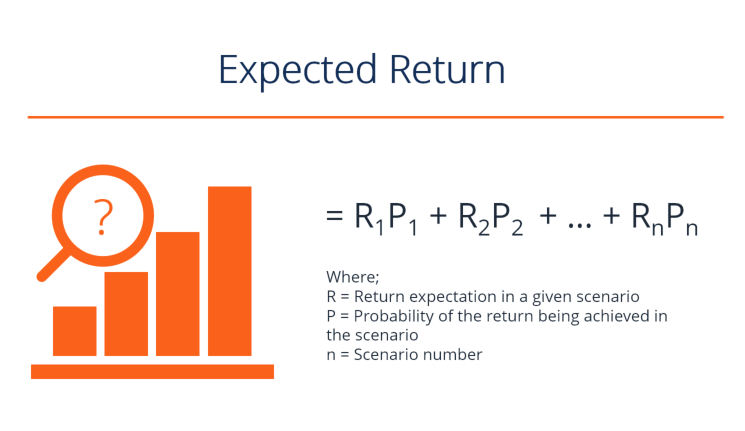

## Table of Contents

## What is a portfolio in the context of investments?

A portfolio in the context of investments is like a collection of different things you own that can grow in value over time. These things can be stocks, bonds, mutual funds, real estate, or even cash. When you invest, you put your money into these different items hoping they will increase in value and help you reach your financial goals, like saving for retirement or buying a house.

Think of a portfolio as a basket where you keep all your investment eggs. It's important to spread your eggs around, or diversify, so that if one type of investment doesn't do well, the others might still grow. This way, you can lower the risk of losing money and have a better chance of making a profit. By carefully choosing what goes into your portfolio, you can work towards building wealth over time.

## Why is calculating expected portfolio returns important?

Calculating expected portfolio returns is important because it helps you understand how much money you might make from your investments. When you know the expected return, you can see if your investments are doing well or if you need to make changes. It's like having a map that shows you where you're going financially. If the expected return is lower than what you need to reach your goals, you might decide to invest in different things or take more risks.

Also, knowing the expected return helps you compare different investment options. You can see which ones might give you more money and which ones are safer. This way, you can make smarter choices about where to put your money. It's like choosing the best path to take on a journey, making sure you get to your destination in the best way possible.

## What are the basic components needed to calculate expected portfolio returns?

To calculate expected portfolio returns, you need to know the expected return of each investment in your portfolio and how much of your money is in each one. The expected return of an investment is a guess about how much money it will make in the future. You can find this out by looking at how the investment has done in the past or by using other people's predictions. The amount of money you have in each investment is called the weight of that investment in your portfolio. If you have $100 in total and $30 of it is in one stock, then the weight of that stock is 30%.

Once you know the expected return and the weight of each investment, you can calculate the expected return of your whole portfolio. You do this by multiplying the expected return of each investment by its weight, and then adding up all those numbers. For example, if one stock has an expected return of 5% and its weight is 30%, you multiply 5% by 30% to get 1.5%. If another stock has an expected return of 10% and its weight is 70%, you multiply 10% by 70% to get 7%. Adding 1.5% and 7% gives you a total expected portfolio return of 8.5%. This tells you what you might expect to earn from your entire portfolio.

## How do you calculate the expected return of a single asset?

To calculate the expected return of a single asset, you need to know the possible future outcomes and how likely each one is to happen. For example, if you own a stock, you might look at different scenarios like the stock price going up, staying the same, or going down. Each scenario has a chance of happening, like a 40% chance of going up, a 30% chance of staying the same, and a 30% chance of going down. You also need to know how much the stock price would change in each scenario, like going up by 10%, staying the same at 0%, or going down by 5%.

Once you have this information, you can figure out the expected return by multiplying the chance of each scenario by the change in the stock price for that scenario, and then adding up all the results. Using our example, you would multiply 40% by 10% to get 4%, then 30% by 0% to get 0%, and finally 30% by -5% to get -1.5%. Adding these together gives you an expected return of 2.5%. This number tells you what you might expect to earn from the stock over time, based on the different scenarios and their chances of happening.

## What is the formula for calculating the expected return of a portfolio?

To figure out the expected return of a portfolio, you need to know two things: the expected return of each investment in the portfolio and how much of your money is in each investment. The expected return of an investment is a guess about how much money it will make in the future. You can find this out by looking at how the investment has done in the past or by using other people's predictions. The amount of money you have in each investment is called the weight of that investment in your portfolio. If you have $100 in total and $30 of it is in one stock, then the weight of that stock is 30%.

Once you know the expected return and the weight of each investment, you can calculate the expected return of your whole portfolio. You do this by multiplying the expected return of each investment by its weight, and then adding up all those numbers. For example, if one stock has an expected return of 5% and its weight is 30%, you multiply 5% by 30% to get 1.5%. If another stock has an expected return of 10% and its weight is 70%, you multiply 10% by 70% to get 7%. Adding 1.5% and 7% gives you a total expected portfolio return of 8.5%. This tells you what you might expect to earn from your entire portfolio.

## How do you determine the weight of each asset in a portfolio?

To determine the weight of each asset in a portfolio, you first need to know the total value of your portfolio. This is the sum of all the money you have invested in different assets like stocks, bonds, or mutual funds. Then, you look at how much money you have invested in each specific asset. The weight of an asset is the amount of money you have in that asset divided by the total value of your portfolio. For example, if your portfolio is worth $100 and you have $30 invested in one stock, the weight of that stock is $30 divided by $100, which is 30%.

Once you have calculated the weight of each asset, you can see how much of your portfolio is made up of each one. This helps you understand how much each asset contributes to your overall investment. If one asset has a high weight, it means a big part of your money is in that asset, so it can have a big impact on your portfolio's performance. By knowing the weights, you can make sure your investments are spread out the way you want, which is important for managing risk and reaching your financial goals.

## What is the difference between arithmetic and geometric mean returns in portfolio calculations?

The arithmetic mean return is like adding up all your yearly returns and then dividing by the number of years. It's simple and gives you an average of what you earned each year. For example, if you made 10% one year and lost 5% the next year, the arithmetic mean return would be (10% + (-5%)) / 2 = 2.5%. This method is good for short periods or when you want to know the average yearly return, but it doesn't show how your money grows over time.

The geometric mean return, on the other hand, looks at how your money grows from one year to the next. It's a bit more complicated because it uses multiplication instead of addition. Using the same example, if you start with $100, after the first year you'd have $110 (10% gain), and after the second year, you'd have $104.50 (5% loss on $110). The geometric mean return would be the rate that, if applied each year, would get you from $100 to $104.50 over two years. It's better for long-term investing because it shows the actual growth of your money over time, taking into account the effect of compounding.

## How can historical data be used to estimate expected returns?

Historical data can be used to estimate expected returns by looking at how an investment has performed in the past. If a stock has usually gone up by about 8% each year over the last 10 years, you might guess it will keep doing that in the future. This is not a perfect way to predict the future because things can change, but it gives you a starting point. You can use numbers from the past to make a guess about what might happen next, which helps you plan your investments.

But, it's important to remember that past performance is not a sure sign of what will happen next. Things like the economy, new laws, or big world events can change how an investment does. So, while historical data can help you make a guess, you should also think about other things that might affect your investments. Using historical data along with other information can give you a better idea of what to expect from your investments.

## What role does diversification play in expected portfolio returns?

Diversification means spreading your money across different types of investments, like stocks, bonds, and real estate. When you diversify, you're not putting all your eggs in one basket. This can help lower the risk of losing a lot of money if one investment doesn't do well. For example, if one stock goes down, another might go up, balancing things out. By having a mix of investments, you might not make as much money as if you had picked the one best investment, but you also won't lose as much if things go badly.

Diversification can also affect your expected portfolio returns by smoothing out the ups and downs. If you only have one type of investment, like all your money in tech stocks, your returns might be very high one year and very low the next. But if you spread your money across different kinds of investments, the highs and lows might even out, making your returns more steady over time. This can help you feel more confident about your investments because you're less likely to see big swings in your money.

## How do you incorporate risk into the calculation of expected portfolio returns?

When you want to figure out how much money you might make from your investments, you also need to think about risk. Risk is the chance that you might lose money instead of making it. To include risk in your expected portfolio returns, you can use something called the risk-adjusted return. This means you look at how much money you might make, but also how likely it is that things could go wrong. One way to do this is by using the Sharpe Ratio, which compares the extra return you get from an investment to how much it moves up and down. A higher Sharpe Ratio means you're getting more return for the risk you're taking.

Another way to think about risk in your portfolio is by looking at how different investments move together. If all your investments go up and down at the same time, that's a lot of risk because if one goes down, they all might go down. But if you have some investments that go up when others go down, that can lower your risk. This is called correlation. By choosing investments that don't all move the same way, you can make your portfolio safer. This helps you balance the chance of losing money with the chance of making money, giving you a better idea of what to expect from your investments.

## What advanced statistical methods can be used to refine expected portfolio return calculations?

To make your expected portfolio return calculations more accurate, you can use something called Monte Carlo simulations. This method uses a computer to run thousands of different scenarios for how your investments might do in the future. It takes into account things like how much the price of each investment might go up or down, and how likely those changes are to happen. By looking at all these different possible futures, Monte Carlo simulations can give you a better idea of what might happen to your portfolio. This helps you see not just one expected return, but a range of possible outcomes, which can make your planning more realistic.

Another advanced method is called regression analysis. This is a way to look at how different things, like interest rates or the economy, affect the returns of your investments. By studying past data, regression analysis can help you figure out which factors are most important for your investments. This can make your expected return calculations more precise because you're not just guessing; you're using real data to understand what might happen. Both Monte Carlo simulations and regression analysis can help you make smarter decisions about your investments by giving you a clearer picture of the risks and rewards.

## How do macroeconomic factors influence expected portfolio returns and how can they be modeled?

Macroeconomic factors, like interest rates, inflation, and economic growth, can have a big impact on how your investments do. When interest rates go up, it can make borrowing money more expensive, which might slow down the economy and affect the stock market. On the other hand, if inflation is high, it can make the value of money go down, which might make people want to invest in things like real estate or commodities to keep up with rising prices. Economic growth can also play a big role because when the economy is doing well, companies usually make more money, which can push up stock prices. By keeping an eye on these factors, you can get a better idea of what might happen to your investments.

To model how these macroeconomic factors might affect your expected portfolio returns, you can use something called regression analysis. This is a way to look at past data and see how things like interest rates or inflation have changed the returns of your investments. For example, if you notice that when interest rates go up, your stock returns usually go down, you can use that information to make a guess about what might happen in the future. Another method is using economic scenario analysis, where you create different possible futures based on what might happen to the economy. By running these scenarios through a computer, you can see how your portfolio might do under different economic conditions. This helps you plan better and understand the risks and rewards of your investments.

## What is Understanding Portfolio Returns?

Portfolio returns represent the gain or loss generated by the investments held in a portfolio over a specific period. These returns are significant as they indicate the effectiveness of investment strategies and the performance of assets relative to benchmarks, thus guiding strategic financial planning and decision-making.

One of the core distinctions in assessing portfolio returns is between expected returns and actual returns. Expected returns are forecasts based on historical data, financial models, or statistical techniques, conveying what investors anticipate [earning](/wiki/earning-announcement) over a given period. In contrast, actual returns are the realized gains or losses experienced by the portfolio. These can diverge due to market fluctuations, unexpected events, or changes in economic conditions.

Historical performance plays a crucial role in shaping expected returns. By analyzing past data, investors can identify trends and patterns that may suggest future outcomes. However, it's important to recognize that past performance is not always a reliable indicator of future results, as market dynamics can shift due to numerous factors.

Several key metrics are essential for calculating portfolio returns. The most common include:

1. **Arithmetic Mean Returns**: This simple average of periodic returns is calculated as:
$$
   \text{Arithmetic Mean} = \frac{1}{N} \sum_{i=1}^{N} R_i

$$

   where $R_i$ represents the return in each period, and $N$ is the number of periods.

2. **Geometric Mean Returns**: This provides a more accurate measure of compounded periodic returns:
$$
   \text{Geometric Mean} = \left( \prod_{i=1}^{N} (1+R_i) \right)^{\frac{1}{N}} - 1

$$

3. **Internal Rate of Return (IRR)**: The IRR estimates the profitability of potential investments, solving for the discount rate that makes the net present value (NPV) of all cash flows from the investment equal to zero.

4. **Volatility (Standard Deviation)**: A measure of the dispersion of returns, indicating the risk associated with the portfolio.

Diversification plays a pivotal role in achieving optimal returns. By spreading investments across various asset classes, sectors, or geographic regions, investors can mitigate specific risks associated with individual securities. Diversification reduces the impact of poor performance by any single asset on the overall portfolio, thus enhancing the potential for stable and higher returns. The concept is rooted in the principle that a well-diversified portfolio will, on average, yield better returns and pose a lower risk than any individual investment within it. 

In summary, understanding and effectively managing portfolio returns require a solid grasp of the differences between expected and actual returns, a reliance on historical performance to forecast future trends, and the implementation of key metrics for evaluation. Furthermore, employing a strategy of diversification is essential for optimizing returns while managing risk effectively.

## How do you calculate investment returns?

Calculating investment returns is fundamental for investors seeking to understand the performance of their portfolios. This process involves breaking down various components and utilizing several key formulae and metrics.

### Process for Calculating Expected Returns

To estimate the expected returns of a portfolio, one common approach is to use the weighted average of the expected returns of individual assets. The formula can be expressed as:

$$

E(R_p) = \sum_{i=1}^{n} w_i \times E(R_i) 
$$

Where:
- $E(R_p)$ is the expected return of the portfolio.
- $w_i$ is the weight of each asset in the portfolio.
- $E(R_i)$ is the expected return of each asset.
- $n$ is the total number of assets.

### Key Formulae and Metrics

Several metrics are used to calculate and interpret portfolio returns:

1. **Arithmetic Mean Return**: A simple average of periodic returns.

2. **Geometric Mean Return**: A compound average that accounts for the effects of compounding over time, especially relevant for longer periods:
$$
   G = \left( \prod_{i=1}^{n} (1 + R_i) \right)^{\frac{1}{n}} - 1

$$

3. **Volatility**: Measure of risk, typically represented by the standard deviation of historical returns.

4. **Sharpe Ratio**: Indicates risk-adjusted return:
$$
   \text{Sharpe Ratio} = \frac{E(R_p) - R_f}{\sigma_p}

$$

   Where $R_f$ is the risk-free rate and $\sigma_p$ is the standard deviation of the portfolio returns.

### Step-by-Step Examples

When calculating returns on individual assets, consider a stock purchased at $100 and sold at $150 with an annual dividend of $5. The return can be calculated as:

$$
\text{Total Return} = \frac{(150 - 100) + 5}{100} = 0.55 \, \text{or} \, 55\%
$$

For entire portfolios, if a portfolio consists of 60% stock A (expected return of 10%) and 40% stock B (expected return of 5%), the expected return is:

$$

E(R_p) = (0.60 \times 0.10) + (0.40 \times 0.05) = 0.08 \, \text{or} \, 8\%
$$

### Time-Weighted vs. Money-Weighted Returns

1. **Time-Weighted Return**: This method calculates the compounded rate of growth per unit of capital invested. It's useful for evaluating the performance of investment managers as it neutralizes the impact of cash flows.

2. **Money-Weighted Return**: Also known as the Internal Rate of Return (IRR), it considers the size and timing of cash flows. It is best for understanding the return on the overall investment from the investor's perspective.

### Pitfalls and Limitations

Common pitfalls include neglecting fees and taxes which impact net returns, ignoring the impact of inflation, and over-relying on historical data which might not predict future performance. Additionally, using the arithmetic mean for returns over multiple periods can overestimate effective returns due to not accounting for compounding effects.

Understanding and vigilantly applying these calculations are crucial for making well-informed investment decisions. These methods, while robust, require careful consideration of inputs and assumptions to ensure accuracy and relevance in depicting potential financial outcomes.

## References & Further Reading

[1]: Bergstra, J., Bardenet, R., Bengio, Y., & Kégl, B. (2011). ["Algorithms for Hyper-Parameter Optimization."](https://dl.acm.org/doi/10.5555/2986459.2986743) Advances in Neural Information Processing Systems 24.

[2]: ["Advances in Financial Machine Learning"](https://www.amazon.com/Advances-Financial-Machine-Learning-Marcos/dp/1119482089) by Marcos Lopez de Prado

[3]: ["Evidence-Based Technical Analysis: Applying the Scientific Method and Statistical Inference to Trading Signals"](https://www.amazon.com/Evidence-Based-Technical-Analysis-Scientific-Statistical/dp/0470008741) by David Aronson

[4]: ["Machine Learning for Algorithmic Trading"](https://github.com/PacktPublishing/Machine-Learning-for-Algorithmic-Trading-Second-Edition) by Stefan Jansen

[5]: ["Quantitative Trading: How to Build Your Own Algorithmic Trading Business"](https://www.amazon.com/Quantitative-Trading-Build-Algorithmic-Business/dp/1119800064) by Ernest P. Chan