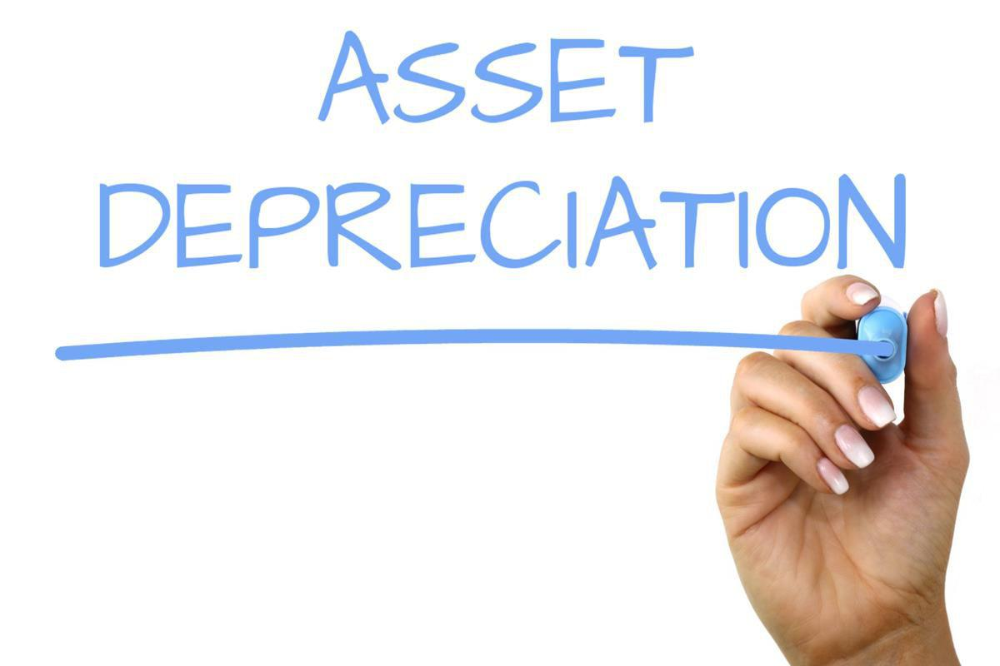

Fixed assets hold a crucial role in the financial architecture of businesses. These long-term tangible properties, such as machinery, buildings, and equipment, are essential for operations and are significant in financial reporting due to their substantial value and impact on investment decisions. The financial reporting of fixed assets reflects a business's capital investments and long-term financial health.

As vital components of financial management, fixed assets necessitate careful tracking through a process known as depreciation. Asset depreciation is the allocation of the cost of an asset over its useful life, providing a systematic approach to account for the asset's diminishing value. This process is not only essential for accurate financial statements but also influences tax obligations and cash flow management. Through various methods—such as straight-line, declining balance, and units of production—organizations can match the expense of the asset against the revenues it helps to generate, thus ensuring that their financial data presents a true picture of economic reality.



Excel serves as a powerful tool for calculating depreciation, offering flexibility and functionality to efficiently handle complex data sets. Excel's capability to utilize built-in functions and customizable formulas enables businesses to create precise depreciation schedules. Its widespread availability and user-friendliness make it a popular choice among financial professionals for managing and analyzing asset-related data.

Algorithmic trading, another cornerstone of modern finance, applies computer algorithms to execute trading orders at speeds and frequencies unimaginable to human traders. It relies heavily on real-time financial data and quantitative analysis to optimize trading decisions. Given the intricate relationship between a company's asset values and market perceptions, asset depreciation data can play a pivotal role in algorithmic trading strategies. By incorporating depreciation calculations into these models, traders can glean insights into the true value and performance potential of assets, thereby refining their trading strategies.

This article aims to explore the intersection of asset depreciation calculations and algorithmic trading strategies using Excel. By understanding this integration, financial professionals can harness synergy between financial reporting and trade execution to achieve a competitive edge in volatile markets.

## Table of Contents

## Understanding Fixed Assets and Asset Depreciation

Fixed assets, often referred to as tangible assets, are long-term resources owned by a business that are used in its operations to generate income and are not intended for sale within the regular course of business. These assets include items such as buildings, machinery, vehicles, and equipment. The classification of an asset as 'fixed' is significant because it reflects the asset's longevity and its role in the ongoing operation of a company.

Accurate tracking of both the lifespan and value of fixed assets is critical for several reasons. Firstly, it ensures that a company can optimally deploy resources and plan for replacements or upgrades. Secondly, accurate valuation is essential for generating realistic and informative financial statements that investors, creditors, and management use for decision-making.

Asset depreciation is an accounting method used to allocate the cost of a tangible asset over its useful life. This systematic allocation helps reflect the reduction in the asset's value on financial statements. Depreciation is particularly important as it aligns the cost of the asset with the revenue it generates, allowing for a more accurate calculation of profit.

Several common methods exist for calculating depreciation, each with distinct approaches and financial implications:

1. **Straight-Line Depreciation**: This method spreads the cost of the asset evenly over its expected useful life. The formula is:
$$
   \text{Depreciation Expense} = \frac{\text{Cost of Asset} - \text{Residual Value}}{\text{Useful Life of Asset}}

$$

   where the residual value represents the asset's estimated value at the end of its useful life.

2. **Declining Balance Method**: This approach allocates a higher depreciation expense in the earlier years of an asset's life, decreasing over time. The declining balance method can be calculated through:
$$
   \text{Depreciation Expense} = \text{Book Value at Beginning of Year} \times \text{Depreciation Rate}

$$

   Often applied as double declining balance, this method uses twice the straight-line rate.

3. **Units of Production**: This method ties depreciation to output or usage rather than time, which can be more reflective of wear and tear for certain assets. The formula is:
$$
   \text{Depreciation Expense} = \left( \frac{\text{Cost of Asset} - \text{Residual Value}}{\text{Total Estimated Production}} \right) \times \text{Actual Production}

$$

Depreciation impacts financial statements by altering both the balance sheet and the income statement. On the balance sheet, an asset's book value decreases over time as it gets depreciated, which thereby reduces the net asset value of the company. On the income statement, depreciation is recorded as an expense, impacting net profit.

Additionally, depreciation has significant tax implications. Tax regulations often dictate permissible depreciation methods and rates, providing businesses with potential tax deductions that influence cash flow and profitability. Proper depreciation strategies can optimize tax liabilities and affect a company's financial strategy. Understanding these methods and their impacts allows businesses to manage fixed assets effectively, ensuring compliance and optimizing financial performance.

## Utilizing Excel for Asset Depreciation

Excel has become an essential tool for managing financial data, particularly in the calculation of asset depreciation. Its robust functionalities allow users to perform complex calculations accurately and efficiently, making it a valuable resource in financial management.

### Using Excel Formulas for Calculating Depreciation

One of the core advantages of Excel in asset management is its ability to automate depreciation calculations through built-in functions. The most commonly used methods are Straight-Line Depreciation, Declining Balance Depreciation, and Units of Production Depreciation, which can be executed in Excel with ease.

1. **Straight-Line Depreciation**: This method spreads the cost of an asset evenly across its useful life. The formula is:
$$
   \text{Depreciation} = \frac{\text{Cost of Asset} - \text{Salvage Value}}{\text{Useful Life}}

$$

   In Excel, it can be calculated using the formula:

   ```excel
   =SLN(Cost, Salvage, Life)
   ```

2. **Declining Balance Depreciation**: This method accelerates the depreciation expense early in the asset's life. Excel implements it through the `DB` function.

   ```excel
   =DB(Cost, Salvage, Life, Period, Month)
   ```

3. **Units of Production Depreciation**: This method is based on an asset's usage, work, or number of units produced.
$$
   \text{Depreciation} = \left(\frac{\text{Cost - Salvage}}{\text{Total Estimated Productions}}\right) \times \text{Units Produced}

$$

### Templates and Examples of Depreciation Schedules

Excel offers the flexibility to create detailed depreciation schedules. Users can set up templates that track annual depreciation, accumulated depreciation, and book value for different assets. This comprehensive view aids in financial reporting and planning.

Here is an example layout for a Straight-Line Depreciation schedule:

| Year | Initial Value | Depreciation | Accumulated Depreciation | Book Value |
|------|---------------|--------------|--------------------------|------------|
| 1    | $10,000       | $1,800       | $1,800                   | $8,200     |
| 2    | $10,000       | $1,800       | $3,600                   | $6,400     |
| ...  | ...           | ...          | ...                      | ...        |

### Benefits of Using Excel Over Manual Calculations

The integration of formulas and functions in Excel streamlines the depreciation process, reducing the likelihood of human error associated with manual calculations. This automation saves significant time and effort, particularly for businesses managing large volumes of assets.

Moreover, Excel’s ability to handle complex datasets allows for real-time adjustments and immediate visual representation through charts and graphs, enriching decision-making processes.

### Tips for Maintaining Accuracy and Consistency

To ensure precision in Excel models, it is essential to:

- Double-check formulas and cell references to prevent errors.
- Utilize Excel's auditing tools, such as the `Trace Precedents` and `Trace Dependents`, to confirm the logical flow of calculations.
- Regularly update asset information and recalculate depreciation when circumstances change, such as revisions in asset lifespan or changes in market value.
- Maintain a version control system to track changes and prevent potential conflicts among users.

Leveraging Excel's capabilities for asset depreciation not only optimizes calculation efficiency but also enhances the reliability of financial data analysis, thus supporting sound financial management strategies.

## Algorithmic Trading and Its Connection to Depreciation Data

Algorithmic trading involves using computer programs to automate financial trading decisions, thereby executing trades at optimal speeds and minimizing human error. The benefits of [algorithmic trading](/wiki/algorithmic-trading) include increased efficiency, reduced transaction costs, and the ability to backtest trading strategies against historical data effectively. These systems can analyze vast datasets and execute trades based on predefined parameters, which is particularly useful in volatile markets. 

Depreciation data can have a significant influence on trading strategies in several ways. Asset depreciation affects financial statements, altering perceived company value and influencing investor decisions. Thus, understanding how depreciation impacts a company's financial health can provide insights for trading algorithms. For instance, if a company frequently updates its fixed assets, reflecting regular depreciation, it could indicate strong growth potential or a need for operational efficiency, impacting future stock valuations.

Integrating asset depreciation schedules into algorithmic trading models necessitates retrieving and incorporating this data into the decision-making framework of the algorithm. This integration can be done by feeding Excel-based depreciation schedules into a trading algorithm, allowing it to adjust for changing asset values. For instance, algorithms could incorporate asset value decline into valuation models or use depreciation rates to forecast future capital expenditure needs.

An example of a trading algorithm that factors in asset depreciation might be one that uses forecasting to identify undervalued stocks. By integrating depreciation schedules, the algorithm can adjust its projections of future asset values, refining its assessment of a company's growth prospects or overall financial health. This integration can result in strategies that, for example, buy stocks undervalued due to overestimated depreciation impacts or sell stocks where depreciation suggests upcoming capital requirements.

There are, however, challenges in leveraging depreciation data in algorithmic trading. A primary challenge is the timely and accurate extraction of depreciation data from financial reports, as this information may not be structured or immediately accessible. Algorithms must also consider the variability in accounting practices across jurisdictions, which can affect depreciation reporting. To overcome these challenges, one strategy is the use of [machine learning](/wiki/machine-learning) algorithms capable of analyzing unstructured financial statement text to extract and normalize depreciation data signals across different companies. 

Programming such models requires advanced data manipulation techniques in languages like Python. For example, using Python's Pandas library to handle and preprocess data from Excel spreadsheets, and employing machine learning libraries like Scikit-learn to develop predictive models that account for depreciation in their analysis. These approaches ensure a nuanced and robust application of depreciation data in trading algorithm development.

## Developing a Depreciation-Based Trading Strategy

Developing a depreciation-based trading strategy requires a comprehensive understanding of how asset depreciation influences financial decision-making. This section outlines the key components of such a strategy, including market identification, integration of depreciation data, tools and software, illustrative case studies, and risk management practices associated with depreciation-informed trades.

### Identifying Market Conditions and Assets

Identifying market conditions where asset depreciation impacts trading decisions begins with recognizing industries where fixed assets play a significant role. Capital-intensive sectors such as manufacturing, transportation, and energy often have substantial investments in fixed assets. The rate of depreciation in these industries can materially affect financial projections and, consequently, trading positions. Assets such as machinery, vehicles, and infrastructure within these industries tend to have predictable depreciation schedules that can be quantified and anticipated for strategic market entry or [exit](/wiki/exit-strategy).

### Integrating Depreciation Schedules into Trading Algorithms

A systematic approach to integrating depreciation schedules into trading algorithms involves several steps. Firstly, it is crucial to establish a reliable depreciation schedule—typically using methods such as straight-line or declining balance—to forecast future asset values accurately. Depreciation schedules are incorporated into trading algorithms through data feeds or API integrations that allow real-time data processing.

In Python, for example, a simple algorithm could utilize pandas for managing data and NumPy for numerical operations, optimizing the efficiency of integrating such schedules:

```python
import pandas as pd
import numpy as np

def calculate_depreciation(initial_value, salvage_value, useful_life, method='straight-line'):
    if method == 'straight-line':
        return (initial_value - salvage_value) / useful_life
    elif method == 'declining-balance':
        rate = 2 / useful_life
        return initial_value * rate

# Example usage
depreciation_value = calculate_depreciation(10000, 1000, 5, method='straight-line')
```

### Tools and Software

Several tools and software solutions facilitate the integration of Excel-based depreciation data with trading platforms. Spreadsheet applications equipped with financial modeling add-ons can automate depreciation calculations and directly feed results into algorithmic trading systems. Platforms such as MetaTrader or Bloomberg Terminal offer API connectivity, allowing seamless data synchronization and execution of trades influenced by depreciation data.

Python libraries such as `xlwings` or `openpyxl` can be employed to read Excel files and manage data flows to trading systems, ensuring that the depreciation insights are current and accurately reflected in trading decisions.

### Case Studies of Successful Trading Strategies

Historically, algorithmic trading strategies such as mean reversion or [momentum](/wiki/momentum) trading have successfully integrated depreciation data. For instance, a case study involving an energy sector [ETF](/wiki/etf-trading-strategies) might reveal how subtle shifts in depreciation rates adjusted financials sufficiently to anticipate an impending reversal, allowing traders to capitalize on the revaluation of the ETF. Another example could involve currency pairs where the economic indicators, heavily influenced by infrastructure spending and asset depreciation, impact foreign exchange positions.

### Risk Management and Performance Evaluation

Risk management in trading strategies influenced by asset depreciation requires adequate evaluation of both market and model risks. Traders must continuously validate their models with real market data and ensure that depreciation assumptions hold under various economic scenarios. Stress testing and [backtesting](/wiki/backtesting) are essential, assessing how historical depreciation data would have impacted trading outcomes.

Performance evaluation must focus on both absolute returns and risk-adjusted metrics. Tools like the Sharpe ratio can provide insights into the effectiveness of integrating asset depreciation into trading strategies. Additionally, it is imperative to accommodate potential regulatory changes or economic shifts that could alter depreciation policies and affect trading models.

By leveraging asset depreciation data within a structured trading strategy, financial professionals can achieve a nuanced understanding of market dynamics and enhance their decision-making processes. Future advancements may further enrich these models, incorporating machine learning techniques to refine predictions and optimize trading performance.

## Conclusion

In this article, we explored the critical intersection between asset depreciation and algorithmic trading, emphasizing their combined impact on financial analysis and decision-making. By examining fixed assets and their depreciation, we acknowledged the importance of accurately estimating asset value over time, which has significant implications for financial statements and tax reporting. This process not only optimizes asset utilization but also provides valuable data for strategic planning.

Combining depreciation analysis with algorithmic trading presents numerous benefits. By integrating asset depreciation schedules into trading algorithms, financial professionals can enhance their ability to predict market movements, optimize portfolio management, and improve overall trading performance. This approach provides a more nuanced understanding of how the declining value of assets affects financial decision-making, potentially leading to more informed and profitable trades.

We encourage financial professionals to explore this integrated strategy, as it represents a fresh avenue for leveraging quantitative data within trading frameworks. The incorporation of depreciation data into trading systems not only refines asset valuation techniques but also enriches algorithmic models, resulting in more robust trading strategies.

Looking ahead, the synergy between depreciation analysis and trading is likely to evolve further with advancements in technology. The increasing sophistication of [artificial intelligence](/wiki/ai-artificial-intelligence), big data analytics, and machine learning offers promising opportunities to refine these strategies. As these technologies progress, they will undoubtedly enhance the capabilities of traders to make more precise and data-driven decisions.

In conclusion, the integration of asset depreciation insights into algorithmic trading represents a significant advancement in financial strategy. By harnessing modern tools and technologies, professionals can bridge the gap between traditional financial management and contemporary analytical techniques. This holistic approach not only improves the accuracy of financial forecasting but also sets the stage for more innovative and effective financial decision-making in the future.

## References & Further Reading

[1]: ["Depreciation: Accounting and Income Tax Issues"](https://www.investopedia.com/ask/answers/031815/what-tax-impact-calculating-depreciation.asp) by Glenn K. Gambill, The Journal of Business Education.

[2]: ["Excel 2019 Power Programming with VBA"](https://onlinelibrary.wiley.com/doi/book/10.1002/9781119583790) by Michael Alexander, Dick Kusleika.

[3]: ["Algorithmic Trading: Winning Strategies and Their Rationale"](https://www.wiley.com/en-us/Algorithmic+Trading%3A+Winning+Strategies+and+Their+Rationale-p-9781118460146) by Ernest P. Chan.

[4]: ["Quantitative Value: A Practitioner's Guide to Automating Intelligent Investment and Eliminating Behavioral Errors"](https://www.amazon.com/Quantitative-Value-Web-Site-Practitioners/dp/1118328078) by Wesley R. Gray and Tobias E. Carlisle.

[5]: ["Fundamentals of Asset Valuation"](https://www.investopedia.com/terms/a/assetvaluation.asp) by C. Mitchell Conover.

[6]: ["Python for Data Analysis: Data Wrangling with Pandas, NumPy, and IPython"](https://wesmckinney.com/book/) by Wes McKinney.