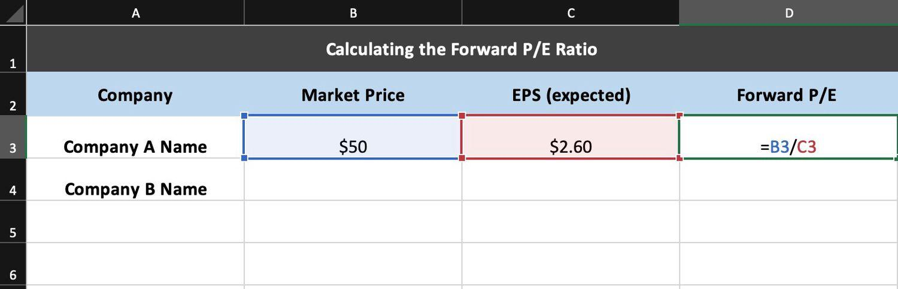

## Table of Contents

## What is the Forward P/E Ratio and why is it important?

The Forward P/E Ratio, or Price-to-Earnings Ratio, is a way to figure out how much investors are willing to pay for a company's future earnings. It's calculated by taking the current stock price and dividing it by the expected earnings per share for the next year. This ratio helps investors see if a stock might be a good deal or if it's too expensive compared to what the company is expected to earn in the future.

This ratio is important because it gives investors a peek into the future value of a company. If the Forward P/E Ratio is low, it might mean the stock is undervalued and could be a good buy. On the other hand, a high Forward P/E Ratio might suggest that the stock is overvalued and could be riskier to invest in. By comparing the Forward P/E Ratios of different companies, investors can make smarter choices about where to put their money, based on what they think the future holds for those companies.

## How do you calculate the Forward P/E Ratio?

To calculate the Forward P/E Ratio, you need to know two things: the current stock price and the expected earnings per share for the next year. First, find out what the stock is selling for right now. This is easy to look up on any financial website. Then, find the company's forecasted earnings per share for the next 12 months. These forecasts are usually provided by financial analysts and can also be found on financial websites or in company reports.

Once you have these two numbers, you divide the current stock price by the expected earnings per share. The result is the Forward P/E Ratio. For example, if a stock is currently priced at $50 and the expected earnings per share for next year is $5, the Forward P/E Ratio would be $50 divided by $5, which equals 10. This number helps investors understand how much they are paying for each dollar of future earnings, giving them a sense of whether the stock might be a good investment.

## What data do you need to calculate the Forward P/E Ratio in Excel?

To calculate the Forward P/E Ratio in Excel, you need two main pieces of data: the current stock price and the expected earnings per share for the next year. The current stock price is the price at which the stock is trading right now. You can find this easily on financial websites or stock market apps. The expected earnings per share is a bit trickier to get. It's a forecast made by financial analysts about how much money the company will make per share in the next 12 months. You can usually find these forecasts on financial news sites, in company reports, or through financial data services.

Once you have these two numbers, you can use Excel to do the calculation. In one cell, enter the current stock price. In another cell, enter the expected earnings per share. Then, in a third cell, you can use a simple formula to divide the stock price by the expected earnings per share. For example, if the stock price is in cell A1 and the expected earnings per share is in cell B1, you would type "=A1/B1" into the third cell to get the Forward P/E Ratio. This simple calculation helps you see how much you're paying for each dollar of the company's future earnings.

## How do you input stock price data into Excel?

To input stock price data into Excel, first, you need to find the current stock price. You can do this by going to a financial website or using a stock market app. Once you have the stock price, open Excel and click on the cell where you want to put the data. Type the stock price into that cell and press enter. That's it! You now have the stock price in your Excel sheet.

If you want to keep track of the stock price over time, you can set up a column in Excel for dates and another for the stock prices. Each time you get a new stock price, add the date to the date column and the price to the price column. This way, you can see how the stock price changes day by day. Remember to always use the most recent stock price when you need it for calculations like the Forward P/E Ratio.

## How do you find and input earnings forecasts into Excel?

To find earnings forecasts, go to a financial website like Yahoo Finance or Bloomberg, or use a stock market app. Look for the company you're interested in and find the section that talks about analyst estimates or earnings forecasts. This section will show you what financial experts think the company will earn per share in the next year. Write down or remember the number for the expected earnings per share.

Once you have the earnings forecast, open Excel and click on the cell where you want to put the data. Type the expected earnings per share into that cell and press enter. Now you have the earnings forecast in your Excel sheet. If you're tracking this over time, you can set up a column for dates and another for the earnings forecasts. Each time you get a new forecast, add the date to the date column and the forecast to the forecast column. This helps you see how the forecasts change and use the latest one for calculations like the Forward P/E Ratio.

## What Excel formulas are used to calculate the Forward P/E Ratio?

To calculate the Forward P/E Ratio in Excel, you need the current stock price and the expected earnings per share for the next year. Let's say you have the stock price in cell A1 and the expected earnings per share in cell B1. You can use a simple formula to find the Forward P/E Ratio. In another cell, type "=A1/B1" and press enter. This formula divides the stock price by the expected earnings per share, giving you the Forward P/E Ratio.

For example, if the stock price in A1 is $50 and the expected earnings per share in B1 is $5, the formula "=A1/B1" will give you a Forward P/E Ratio of 10. This means investors are willing to pay $10 for every $1 of expected earnings next year. By using this formula in Excel, you can quickly see how much you're paying for future earnings and compare it to other stocks or the company's past ratios.

## How can you automate the Forward P/E Ratio calculation in Excel?

To automate the Forward P/E Ratio calculation in Excel, you need to set up a system where the stock price and earnings forecast update automatically. First, you can use Excel's data import features to pull real-time stock prices from financial websites. For example, you can use the "Data" tab, select "Get Data," and then choose a source like a stock market data provider. This way, every time you open your Excel sheet or refresh it, the latest stock price will be there in cell A1. For the earnings forecast, you might need to update it manually because these numbers don't change as often as stock prices. However, you can set a reminder to check for new forecasts and enter them into cell B1.

Once you have these numbers updating, use the formula "=A1/B1" in another cell to calculate the Forward P/E Ratio automatically. Every time the stock price or earnings forecast changes, the Forward P/E Ratio will update without you needing to do anything. This makes it easy to keep track of the ratio over time and see how it changes with new data. By setting up your Excel sheet this way, you can focus more on analyzing the data rather than spending time on manual calculations.

## What are common mistakes to avoid when calculating the Forward P/E Ratio in Excel?

One common mistake when calculating the Forward P/E Ratio in Excel is using the wrong data. It's easy to mix up the current stock price with the wrong date's price or use an old earnings forecast instead of the latest one. Always make sure the stock price in cell A1 is the most recent one and the earnings forecast in cell B1 is the newest prediction from analysts. Another mistake is not double-checking your formula. The formula should be "=A1/B1" to divide the stock price by the expected earnings per share. If you type it wrong, like "=B1/A1", you'll get a completely different and incorrect number.

Another mistake to watch out for is not updating the data regularly. The stock market changes every day, so if you're not pulling in the latest stock price, your Forward P/E Ratio won't be accurate. Also, earnings forecasts can change, so you need to check those periodically too. Keeping your data up to date is key to getting a useful Forward P/E Ratio. By avoiding these common errors, you can make sure your calculations in Excel are correct and helpful for making investment decisions.

## How can you compare the Forward P/E Ratios of different companies using Excel?

To compare the Forward P/E Ratios of different companies using Excel, first, you need to gather the current stock prices and the expected earnings per share for each company. You can set up your Excel sheet with columns for the company names, stock prices, earnings forecasts, and the Forward P/E Ratios. Enter the stock price for each company in one column and the expected earnings per share in another. Then, use the formula "=A2/B2" (assuming stock price is in column A and earnings forecast is in column B) to calculate the Forward P/E Ratio for the first company. Copy this formula down the column to calculate the ratios for all the companies listed.

Once you have the Forward P/E Ratios calculated for each company, you can easily compare them side by side. Look at the numbers to see which companies have higher or lower ratios. A lower Forward P/E Ratio might mean a company is undervalued and could be a good investment, while a higher ratio might suggest a company is overvalued. You can also use Excel's sorting feature to arrange the companies from the lowest to the highest Forward P/E Ratio, making it even easier to see which stocks might be the best deals. By doing this, you can make smarter choices about where to invest your money based on how much you're paying for future earnings.

## How do you interpret the results of the Forward P/E Ratio calculated in Excel?

When you see the Forward P/E Ratio in Excel, it tells you how much investors are willing to pay for each dollar of a company's future earnings. If the Forward P/E Ratio is low, it might mean the stock is a good deal because you're paying less for the company's future earnings. On the other hand, a high Forward P/E Ratio could mean the stock is expensive, and you're paying more for those future earnings. By comparing the Forward P/E Ratios of different companies, you can see which ones might be undervalued or overvalued, helping you decide where to invest your money.

For example, if Company A has a Forward P/E Ratio of 10 and Company B has a Forward P/E Ratio of 20, it means investors are willing to pay twice as much for Company B's future earnings as they are for Company A's. This doesn't automatically mean Company A is a better investment, but it might suggest that Company A could be a better value. You should also look at other things like the company's growth potential, industry trends, and overall market conditions to make a smart investment choice. By understanding and interpreting the Forward P/E Ratio, you can make more informed decisions about which stocks to buy or sell.

## What advanced Excel functions can enhance the analysis of Forward P/E Ratios?

To make your analysis of Forward P/E Ratios better in Excel, you can use some advanced functions. One helpful function is the "VLOOKUP" or "INDEX/MATCH" function. These let you pull data from different parts of your spreadsheet easily. For example, if you have a big list of companies with their stock prices and earnings forecasts in one sheet, you can use these functions to find and bring that data into your main analysis sheet. This makes it easier to update and compare Forward P/E Ratios without having to type in numbers by hand.

Another useful tool is the "Conditional Formatting" feature. This can help you see patterns and trends in your data quickly. You can set up rules to color-code the cells based on the Forward P/E Ratio values. For example, you could make cells with lower ratios turn green to show they might be good deals, and cells with higher ratios turn red to show they might be more expensive. This visual help can make it easier to spot which companies are undervalued or overvalued at a glance. By using these advanced Excel functions, you can make your analysis of Forward P/E Ratios more detailed and easier to understand.

## How can you integrate real-time data feeds into Excel for ongoing Forward P/E Ratio analysis?

To integrate real-time data feeds into Excel for ongoing Forward P/E Ratio analysis, you can use Excel's data connection features. First, go to the "Data" tab in Excel and select "Get Data." From there, you can choose a data source like a stock market data provider that offers real-time stock prices. Once you set up the connection, the latest stock prices will automatically update in your Excel sheet whenever you refresh it. This means you can always have the most current stock price in cell A1 for your Forward P/E Ratio calculation.

For the earnings forecasts, which don't change as often as stock prices, you might need to update them manually. However, you can set reminders to check for new forecasts from financial websites or analyst reports and enter them into cell B1. With both the stock price and earnings forecast updated, your Forward P/E Ratio, calculated using the formula "=A1/B1," will automatically reflect the latest data. This setup allows you to keep track of the Forward P/E Ratio over time and make informed investment decisions based on the most current information available.

## What is Forward Price-to-Earnings (Forward P/E)?

Forward Price-to-Earnings (Forward P/E) is a widely used financial metric that provides investors with a future-oriented perspective on a company's valuation by utilizing projected earnings. This metric differs from the traditional trailing P/E ratio, which is based on historical earnings data over the previous 12 months. By incorporating estimated future earnings per share (EPS), the Forward P/E offers insights into a company's expected profitability and potential market valuation.

The calculation of the Forward P/E ratio involves the formula:

$$
\text{Forward P/E} = \frac{\text{Current Stock Price}}{\text{Estimated Future EPS}}
$$

This metric is significant because it helps investors determine whether a stock might be undervalued or overvalued, based on the company's anticipated earnings growth. If the Forward P/E ratio is lower than the industry or market average, it could suggest that the stock is undervalued, assuming the earnings projections are accurate. Conversely, a higher Forward P/E may indicate overvaluation.

The reliability of the Forward P/E depends on the accuracy of the future EPS estimates, which can originate from company guidance or analyst forecasts. These estimates consider factors such as market trends, planned corporate actions, and macroeconomic conditions. While the Forward P/E is a powerful tool for predicting future performance, it should be used alongside other financial metrics and qualitative assessments for a comprehensive evaluation of an investment opportunity.

## What is the Forward P/E Ratio and how do we understand it?

The Forward Price-to-Earnings (Forward P/E) ratio is a financial metric that provides insights into a stock's valuation by utilizing projected earnings per share (EPS). Unlike the trailing P/E ratio, which calculates valuation based on the previous 12 months of earnings, the forward P/E adopts a forward-looking approach by utilizing future earnings estimates. This makes it particularly useful for investors seeking to forecast a company's potential growth and to make informed investment decisions.

Mathematically, the Forward P/E ratio is calculated using the formula:

$$
\text{Forward P/E Ratio} = \frac{\text{Current Stock Price}}{\text{Estimated Future EPS}}
$$

The estimated future EPS is generally derived from analyst forecasts or company guidance. These estimates consider expected revenues, expenses, and market conditions that a company might encounter in the future. However, the reliability of these projections can vary. Analyst predictions, while often informed by extensive research and expertise, may still be subject to biases and assumptions. Company guidance might also be optimistic, reflecting internal goals rather than achievable results.

External factors like changes in economic policies, market dynamics, or unexpected geopolitical events can also impact the accuracy of future earnings projections, adding a degree of uncertainty to the Forward P/E ratio. It is therefore advised that investors use the Forward P/E in conjunction with other financial metrics to develop a more comprehensive understanding of a company's valuation and potential risks.

In investment strategies, the Forward P/E ratio helps in identifying whether a stock is overvalued or undervalued by comparing the current stock price against the anticipated profitability. A low Forward P/E might suggest that a stock is undervalued, potentially signaling a buying opportunity if future earnings growth is expected. Conversely, a high Forward P/E could indicate that a stock is overvalued relative to its expected earnings, pointing to caution or potential selling unless robust growth is anticipated. These insights can be critical in constructing diversified investment portfolios and making strategic trading decisions.

## What is the difference between Forward P/E and Trailing P/E?

Forward Price-to-Earnings (Forward P/E) and Trailing Price-to-Earnings (Trailing P/E) are essential metrics for evaluating a company's stock value, yet they are derived from distinct data sets. The Forward P/E ratio utilizes projected earnings per share (EPS), which reflects analysts' estimates of a company's earnings over the next 12 months. In contrast, the Trailing P/E ratio is based on actual EPS from the previous 12-month period. By comparing these two metrics, investors are equipped with insights that encapsulate both past performance and anticipated future profitability.

The Forward P/E is given by the formula:

$$
\text{Forward P/E} = \frac{\text{Current Stock Price}}{\text{Estimated Future EPS}}
$$

Meanwhile, the Trailing P/E is calculated as:

$$
\text{Trailing P/E} = \frac{\text{Current Stock Price}}{\text{EPS from the Past 12 Months}}
$$

Examining both ratios together presents a comprehensive picture. For instance, if the Forward P/E is significantly lower than the Trailing P/E, it may suggest expected growth, implying that analysts and the market are predicting a substantial increase in earnings. Conversely, a higher Forward P/E compared to the Trailing P/E might indicate a forecasted earnings decline, cautioning investors about potential market challenges or decreased profitability.

Discrepancies between these ratios often stem from varying market perceptions and expectations about a company's future growth prospects. Such differences may highlight bullish or bearish sentiments, influenced by factors such as changes in industry conditions, anticipated product launches, or shifts in macroeconomic indicators.

Both Forward and Trailing P/E ratios are instrumental in investment analysis, each providing a unique angle on a company's valuation. By interpreting the insights gathered from both, investors can better gauge whether a stock aligns with their financial strategies and risk appetites.

## How do you calculate Forward P/E in Excel?

To calculate the Forward Price-to-Earnings (P/E) ratio in Excel, you need two primary inputs: the current stock price and the projected earnings per share (EPS) for the future period, typically the next 12 months. The formula to calculate the Forward P/E ratio is:

$$
\text{Forward P/E} = \frac{\text{Current Stock Price}}{\text{Projected EPS}}
$$

Here is how you can perform this calculation in Excel:

1. **Organizing the Data**:
   - Create a column for stock symbols.
   - Create a column for the current stock prices.
   - Create a column for the projected EPS.

2. **Performing the Calculation**:
   - In a new column, label it as Forward P/E.
   - Suppose the current stock price is in column B and the projected EPS is in column C, the formula to calculate the Forward P/E in row 2 would be `=B2/C2`.
   - Drag this formula down to apply it to the entire dataset.

3. **Error Handling**:
   - Incorporate error handling to manage cases where the projected EPS might be zero or missing. You can use the `IFERROR` function in Excel.
   - Modify the formula as `=IFERROR(B2/C2, "N/A")` to display "N/A" if there is an error such as division by zero.

4. **Conditional Formatting**:
   - Apply conditional formatting to highlight specific Forward P/E ratios. For instance, you could highlight cells below a certain threshold to flag potentially undervalued stocks.
   - Select the Forward P/E column, go to 'Conditional Formatting' in the 'Home' tab, and set rules based on your criteria for analysis.

These steps ensure that you can efficiently calculate and analyze Forward P/E ratios in Excel, aiding in the evaluation of stock valuations and helping identify potential investment opportunities.

## References & Further Reading

To enhance your understanding of the Forward Price-to-Earnings (P/E) ratio, consider exploring the following authoritative resources:

1. **"Security Analysis" by Benjamin Graham and David Dodd**: This seminal work in investment literature offers in-depth analysis techniques and valuation metrics, including P/E ratios. It is considered a foundational text for learning about financial evaluation methodologies.

2. **"Valuation: Measuring and Managing the Value of Companies" by McKinsey & Company**: This book provides comprehensive guidance on valuation, covering various financial metrics including the Forward P/E ratio, and offers practical insights into its application in determining company value.

3. **Investopedia - Forward P/E Definition and Application**: The Investopedia page on Forward P/E provides a concise definition, examples, and further context on how the ratio is applied and interpreted in financial analysis. [Visit Investopedia](https://www.investopedia.com/).

4. **"Quantitative Equity Portfolio Management" by Richard Grinold and Ronald Kahn**: This book explores various quantitative strategies, including the use of Forward P/E ratios in algorithmic trading. It is a valuable resource for understanding how this metric fits into broader quantitative analysis frameworks.

5. **Journal of Portfolio Management**: Articles from this journal often include empirical research and case studies involving the Forward P/E ratio, offering insights into its practical application in asset and portfolio management.

6. **Python for Finance: Analyze Big Financial Data by Yves Hilpisch**: For those interested in algorithmic trading, this book outlines how Python can be used to manipulate financial data, including calculating and integrating Forward P/E ratios into trading algorithms.

These resources are a blend of theory, practical applications, and software implementation techniques, providing a well-rounded foundation for understanding and utilizing the Forward P/E ratio in both valuation and trading strategies.

