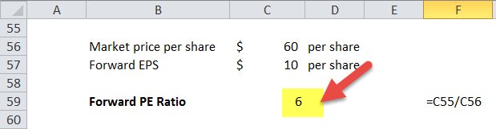

The Forward Price-to-Earnings (P/E) ratio is an essential metric for investors who aim to assess a company's valuation and anticipate future growth potential. Unlike traditional valuation metrics, the Forward P/E ratio provides a forward-looking perspective by incorporating projected earnings rather than relying solely on historical data. This approach enables investors to make more informed predictions about the company's future financial performance, which can be particularly valuable for identifying investment opportunities.

This article aims to provide a comprehensive overview of the Forward P/E ratio, highlighting its importance in financial analysis. We'll discuss how it serves as a tool for evaluating expected company earnings and stock valuations, while also examining its role in enhancing efficiency and accuracy in algorithmic trading. By integrating Forward P/E ratios into quantitative models, algorithmic trading systems can better analyze market trends and make automated decisions.



Further, the article will guide readers through the process of calculating the Forward P/E ratio using Excel, simplifying data organization and computation for investors. Excel's functionalities allow for precise calculations, error handling, and even advanced data visualization, making it a valuable tool for financial analysts.

By the conclusion, you will have gained a nuanced understanding of the Forward P/E ratio, appreciating its various applications and learning how to effectively calculate it to support your investment strategies.

## Table of Contents

## What Is Forward Price-to-Earnings (Forward P/E)?

Forward Price-to-Earnings (Forward P/E) is a widely used financial metric that provides investors with a future-oriented perspective on a company's valuation by utilizing projected earnings. This metric differs from the traditional trailing P/E ratio, which is based on historical earnings data over the previous 12 months. By incorporating estimated future earnings per share (EPS), the Forward P/E offers insights into a company's expected profitability and potential market valuation.

The calculation of the Forward P/E ratio involves the formula:

$$
\text{Forward P/E} = \frac{\text{Current Stock Price}}{\text{Estimated Future EPS}}
$$

This metric is significant because it helps investors determine whether a stock might be undervalued or overvalued, based on the company's anticipated earnings growth. If the Forward P/E ratio is lower than the industry or market average, it could suggest that the stock is undervalued, assuming the earnings projections are accurate. Conversely, a higher Forward P/E may indicate overvaluation.

The reliability of the Forward P/E depends on the accuracy of the future EPS estimates, which can originate from company guidance or analyst forecasts. These estimates consider factors such as market trends, planned corporate actions, and macroeconomic conditions. While the Forward P/E is a powerful tool for predicting future performance, it should be used alongside other financial metrics and qualitative assessments for a comprehensive evaluation of an investment opportunity.

## Understanding the Forward P/E Ratio

The Forward Price-to-Earnings (Forward P/E) ratio is a financial metric that provides insights into a stock's valuation by utilizing projected earnings per share (EPS). Unlike the trailing P/E ratio, which calculates valuation based on the previous 12 months of earnings, the forward P/E adopts a forward-looking approach by utilizing future earnings estimates. This makes it particularly useful for investors seeking to forecast a company's potential growth and to make informed investment decisions.

Mathematically, the Forward P/E ratio is calculated using the formula:

$$
\text{Forward P/E Ratio} = \frac{\text{Current Stock Price}}{\text{Estimated Future EPS}}
$$

The estimated future EPS is generally derived from analyst forecasts or company guidance. These estimates consider expected revenues, expenses, and market conditions that a company might encounter in the future. However, the reliability of these projections can vary. Analyst predictions, while often informed by extensive research and expertise, may still be subject to biases and assumptions. Company guidance might also be optimistic, reflecting internal goals rather than achievable results.

External factors like changes in economic policies, market dynamics, or unexpected geopolitical events can also impact the accuracy of future earnings projections, adding a degree of uncertainty to the Forward P/E ratio. It is therefore advised that investors use the Forward P/E in conjunction with other financial metrics to develop a more comprehensive understanding of a company's valuation and potential risks.

In investment strategies, the Forward P/E ratio helps in identifying whether a stock is overvalued or undervalued by comparing the current stock price against the anticipated profitability. A low Forward P/E might suggest that a stock is undervalued, potentially signaling a buying opportunity if future earnings growth is expected. Conversely, a high Forward P/E could indicate that a stock is overvalued relative to its expected earnings, pointing to caution or potential selling unless robust growth is anticipated. These insights can be critical in constructing diversified investment portfolios and making strategic trading decisions.

## Forward P/E vs. Trailing P/E

Forward Price-to-Earnings (Forward P/E) and Trailing Price-to-Earnings (Trailing P/E) are essential metrics for evaluating a company's stock value, yet they are derived from distinct data sets. The Forward P/E ratio utilizes projected earnings per share (EPS), which reflects analysts' estimates of a company's earnings over the next 12 months. In contrast, the Trailing P/E ratio is based on actual EPS from the previous 12-month period. By comparing these two metrics, investors are equipped with insights that encapsulate both past performance and anticipated future profitability.

The Forward P/E is given by the formula:

$$
\text{Forward P/E} = \frac{\text{Current Stock Price}}{\text{Estimated Future EPS}}
$$

Meanwhile, the Trailing P/E is calculated as:

$$
\text{Trailing P/E} = \frac{\text{Current Stock Price}}{\text{EPS from the Past 12 Months}}
$$

Examining both ratios together presents a comprehensive picture. For instance, if the Forward P/E is significantly lower than the Trailing P/E, it may suggest expected growth, implying that analysts and the market are predicting a substantial increase in earnings. Conversely, a higher Forward P/E compared to the Trailing P/E might indicate a forecasted earnings decline, cautioning investors about potential market challenges or decreased profitability.

Discrepancies between these ratios often stem from varying market perceptions and expectations about a company's future growth prospects. Such differences may highlight bullish or bearish sentiments, influenced by factors such as changes in industry conditions, anticipated product launches, or shifts in macroeconomic indicators.

Both Forward and Trailing P/E ratios are instrumental in investment analysis, each providing a unique angle on a company's valuation. By interpreting the insights gathered from both, investors can better gauge whether a stock aligns with their financial strategies and risk appetites.

## Limitations of Forward P/E

The reliability of the Forward Price-to-Earnings (Forward P/E) ratio is significantly influenced by the accuracy of future earnings projections, which are, by nature, subject to various potential biases and the inherent unpredictability of market conditions. Earnings forecasts are typically derived from analysts' expectations or company guidance. However, these projections can be optimistic or conservative, often shaped by psychological biases, market sentiment, or pressure from stakeholders. Consequently, when these projections deviate significantly from actual future earnings, the Forward P/E ratio becomes less dependable as a valuation tool.

Market [volatility](/wiki/volatility-trading-strategies) further complicates the Forward P/E's reliability. Fluctuations in economic conditions, industry dynamics, or unforeseen global events, such as geopolitical tensions or natural disasters, can dramatically affect a company's operational performance. Such disruptions can lead to revised earnings forecasts, which would alter the Forward P/E ratio and potentially mislead investors regarding a stock's true valuation.

Moreover, the Forward P/E ratio's effectiveness is limited when used in isolation for evaluating a company's future prospects. Diverse economic indicators and financial metrics, including debt levels, cash flow, and historical performance, should be considered alongside the Forward P/E to achieve a comprehensive understanding of a company's valuation. The application of complementary analytical tools, such as discounted cash flow analysis or economic value-added assessments, can enhance an investor's decision-making process.

Ultimately, while the Forward P/E ratio is a valuable metric for estimating future profitability, its limitations necessitate a multifaceted approach to financial evaluation. This ensures a more accurate assessment of investment opportunities, mitigating the risk of relying solely on potentially flawed or overly-optimistic earnings forecasts.

## Algorithmic Trading and Forward P/E

Algorithmic trading leverages Forward Price-to-Earnings (Forward P/E) ratios as a core element in quantitative models, aiming to optimize trading efficiency and precision. By incorporating forward-looking financial metrics, these models can better anticipate market movements and make informed automated trading decisions. The use of Forward P/E ratios allows algorithms to identify potential trends and anomalies in stock valuations, which can be crucial for generating trading signals and executing timely market orders.

A typical strategy might involve using Forward P/E ratios to screen stocks within a certain threshold, identifying those that may be undervalued or overvalued based on future earnings expectations. For instance, a lower Forward P/E ratio compared to the industry average might signal an undervalued stock, thereby triggering a buy order within the system.

Python, a versatile programming language, is commonly employed in constructing these algorithmic models due to its extensive libraries and ease of use. Libraries such as NumPy, Pandas, and SciPy allow for efficient data manipulation and complex calculations necessary in financial modeling. Additionally, packages like TA-Lib provide pre-built tools for technical analysis, which can be combined with Forward P/E data for more comprehensive trading strategies.

An example Python script to calculate the Forward P/E ratio might look like this:

```python
import pandas as pd

# Sample data
data = {
    'Stock': ['AAPL', 'MSFT', 'GOOGL'],
    'Current Price': [150, 250, 2700],
    'Projected EPS': [6, 8, 80]
}

# Convert to DataFrame
df = pd.DataFrame(data)

# Calculate Forward P/E ratio
df['Forward P/E'] = df['Current Price'] / df['Projected EPS']

print(df)
```

This script organizes stock data into a DataFrame, calculates the Forward P/E ratios, and outputs the results, which can then be used to make trading decisions based on thresholds or other criteria.

Moreover, algorithmic traders often integrate [machine learning](/wiki/machine-learning) techniques to further enhance prediction accuracy and adaptability. By feeding Forward P/E data into machine learning models, traders can refine their algorithms to recognize subtle patterns and make more informed predictions about future market behavior.

Incorporating Forward P/E ratios into [algorithmic trading](/wiki/algorithmic-trading) strategies underscores the importance of not only accurate data but also robust quantitative analysis. As market conditions evolve, so too must the algorithms that traders rely upon, making ongoing adaptation and optimization vital components of a successful trading strategy.

## How to Calculate Forward P/E in Excel

To calculate the Forward Price-to-Earnings (P/E) ratio in Excel, you need two primary inputs: the current stock price and the projected earnings per share (EPS) for the future period, typically the next 12 months. The formula to calculate the Forward P/E ratio is:

$$
\text{Forward P/E} = \frac{\text{Current Stock Price}}{\text{Projected EPS}}
$$

Here is how you can perform this calculation in Excel:

1. **Organizing the Data**:
   - Create a column for stock symbols.
   - Create a column for the current stock prices.
   - Create a column for the projected EPS.

2. **Performing the Calculation**:
   - In a new column, label it as Forward P/E.
   - Suppose the current stock price is in column B and the projected EPS is in column C, the formula to calculate the Forward P/E in row 2 would be `=B2/C2`.
   - Drag this formula down to apply it to the entire dataset.

3. **Error Handling**:
   - Incorporate error handling to manage cases where the projected EPS might be zero or missing. You can use the `IFERROR` function in Excel.
   - Modify the formula as `=IFERROR(B2/C2, "N/A")` to display "N/A" if there is an error such as division by zero.

4. **Conditional Formatting**:
   - Apply conditional formatting to highlight specific Forward P/E ratios. For instance, you could highlight cells below a certain threshold to flag potentially undervalued stocks.
   - Select the Forward P/E column, go to 'Conditional Formatting' in the 'Home' tab, and set rules based on your criteria for analysis.

These steps ensure that you can efficiently calculate and analyze Forward P/E ratios in Excel, aiding in the evaluation of stock valuations and helping identify potential investment opportunities.

## Conclusion

The Forward Price-to-Earnings (P/E) ratio is an essential metric for assessing a company's anticipated future earnings and current stock valuation. By focusing on projected earnings, the Forward P/E ratio offers investors a forward-looking view that supports informed decision-making. When integrated with other financial metrics, such as Return on Equity (ROE) and Debt-to-Equity ratio, it paints a comprehensive picture of potential investment opportunities, aiding in evaluating a company's overall financial health and growth prospects.

In algorithmic trading, the importance of accurate data cannot be overstated. Algorithms that incorporate the Forward P/E ratio benefit from enhanced precision by leveraging quantitative analysis to identify market trends and execute trades efficiently. The usage of programming languages like Python for crafting these algorithms underscores the necessity for reliable data and systematic approaches to trading. The careful application of the Forward P/E ratio within such quantitative models enhances both the efficacy and the reliability of trading systems, reflecting its integral role in modern financial analysis.

## References & Further Reading

To enhance your understanding of the Forward Price-to-Earnings (P/E) ratio, consider exploring the following authoritative resources:

1. **"Security Analysis" by Benjamin Graham and David Dodd**: This seminal work in investment literature offers in-depth analysis techniques and valuation metrics, including P/E ratios. It is considered a foundational text for learning about financial evaluation methodologies.

2. **"Valuation: Measuring and Managing the Value of Companies" by McKinsey & Company**: This book provides comprehensive guidance on valuation, covering various financial metrics including the Forward P/E ratio, and offers practical insights into its application in determining company value.

3. **Investopedia - Forward P/E Definition and Application**: The Investopedia page on Forward P/E provides a concise definition, examples, and further context on how the ratio is applied and interpreted in financial analysis. [Visit Investopedia](https://www.investopedia.com/).

4. **"Quantitative Equity Portfolio Management" by Richard Grinold and Ronald Kahn**: This book explores various quantitative strategies, including the use of Forward P/E ratios in algorithmic trading. It is a valuable resource for understanding how this metric fits into broader quantitative analysis frameworks.

5. **Journal of Portfolio Management**: Articles from this journal often include empirical research and case studies involving the Forward P/E ratio, offering insights into its practical application in asset and portfolio management.

6. **Python for Finance: Analyze Big Financial Data by Yves Hilpisch**: For those interested in algorithmic trading, this book outlines how Python can be used to manipulate financial data, including calculating and integrating Forward P/E ratios into trading algorithms.

These resources are a blend of theory, practical applications, and software implementation techniques, providing a well-rounded foundation for understanding and utilizing the Forward P/E ratio in both valuation and trading strategies.