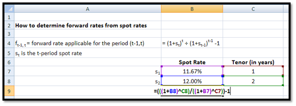

## Table of Contents

## What are forward rates and why are they important?

Forward rates are future interest rates that are agreed upon today for a loan or investment that will happen later. They help people and businesses plan for the future by locking in a rate now, even if they won't use the money until later. For example, if you think interest rates will go up, you might want to set a forward rate now to save money in the future.

These rates are important because they give us clues about what the market thinks will happen with interest rates. If forward rates are higher than current rates, it might mean that people expect rates to go up. This can help investors and companies make better decisions about borrowing and investing. By understanding forward rates, people can better manage their financial plans and reduce risks.

## How can Excel be used to calculate forward rates?

To calculate forward rates using Excel, you can use a simple formula that involves the current interest rates for different time periods. Let's say you want to find the forward rate from year 1 to year 2. You need to know the interest rate for year 1 and the interest rate for year 2. In Excel, you can use the formula: Forward Rate = ((1 + Rate for Year 2)^2 / (1 + Rate for Year 1)^1) - 1. Here, "^" means "to the power of." So, if the rate for year 1 is 2% (or 0.02) and the rate for year 2 is 3% (or 0.03), you would type into Excel: =((1+0.03)^2/(1+0.02)^1)-1. This will give you the forward rate from year 1 to year 2.

Excel makes it easy to change the numbers and see how the forward rate changes. You can put the rates for different years into cells, like A1 for year 1 and B1 for year 2. Then, you can use the formula in another cell, like C1, to calculate the forward rate. If you want to see how the forward rate changes with different rates, just change the numbers in A1 and B1. This way, you can quickly see how sensitive the forward rate is to changes in the current rates. It's a handy tool for planning and understanding future interest rates.

## What are the basic Excel functions needed for forward rate calculations?

To calculate forward rates in Excel, you'll mainly use basic arithmetic functions like addition, exponentiation, and division. You'll need to know the current interest rates for the periods you're looking at. For example, if you want to find the forward rate from year 1 to year 2, you'll need the interest rate for year 1 and the interest rate for year 2. In Excel, you can use a formula like this: Forward Rate = ((1 + Rate for Year 2)^2 / (1 + Rate for Year 1)^1) - 1. Here, "^" means "to the power of." So, if the rate for year 1 is 2% (or 0.02) and the rate for year 2 is 3% (or 0.03), you would type into Excel: =((1+0.03)^2/(1+0.02)^1)-1.

Excel makes it easy to change the numbers and see how the forward rate changes. You can put the rates for different years into cells, like A1 for year 1 and B1 for year 2. Then, you can use the formula in another cell, like C1, to calculate the forward rate. If you want to see how the forward rate changes with different rates, just change the numbers in A1 and B1. This way, you can quickly see how sensitive the forward rate is to changes in the current rates. It's a handy tool for planning and understanding future interest rates.

## How do you input and organize data in Excel for forward rate calculations?

To input and organize data in Excel for forward rate calculations, start by entering the interest rates for the different time periods into separate cells. For example, if you want to calculate the forward rate from year 1 to year 2, you could put the interest rate for year 1 in cell A1 and the interest rate for year 2 in cell B1. Make sure to enter these rates as decimals, like 0.02 for 2% and 0.03 for 3%. This way, you can easily reference these cells in your formula.

Once your data is entered, you can use a formula to calculate the forward rate. In a new cell, like C1, you can type the formula to calculate the forward rate from year 1 to year 2. The formula would look like this: =((1+B1)^2/(1+A1)^1)-1. This formula uses the rates you entered in A1 and B1 to find the forward rate. By organizing your data this way, you can quickly change the rates in A1 and B1 to see how the forward rate changes, making it easier to plan and understand future interest rates.

## What is the formula for calculating a forward rate using spot rates?

To calculate a forward rate using spot rates, you need to know the spot rates for the periods you're looking at. Let's say you want to find the forward rate from year 1 to year 2. You'll need the spot rate for year 1 and the spot rate for year 2. The formula to use is: Forward Rate = ((1 + Spot Rate for Year 2)^2 / (1 + Spot Rate for Year 1)^1) - 1. Here, "^" means "to the power of." So, if the spot rate for year 1 is 2% (or 0.02) and the spot rate for year 2 is 3% (or 0.03), you would calculate the forward rate as: ((1 + 0.03)^2 / (1 + 0.02)^1) - 1.

This formula works because it compares the growth of money over different time periods. The spot rate for year 1 tells you how much money will grow in one year, and the spot rate for year 2 tells you how much it will grow in two years. By dividing the growth over two years by the growth over one year, you find out how much more the money will grow in the second year compared to the first year. This difference is the forward rate, which helps you understand what the market expects interest rates to be in the future.

## How do you use the RATE function in Excel to calculate forward rates?

The RATE function in Excel is not typically used to calculate forward rates directly. Instead, it's used to find the interest rate per period of an annuity. To calculate forward rates, you usually use a formula that compares spot rates for different periods. For example, if you want to find the forward rate from year 1 to year 2, you would use the spot rates for those years in a formula like: Forward Rate = ((1 + Spot Rate for Year 2)^2 / (1 + Spot Rate for Year 1)^1) - 1. This formula helps you see how much more money will grow in the second year compared to the first year.

However, if you want to use the RATE function in a related way, you could use it to find the implied rate of return for a series of cash flows that involve forward rates. For instance, if you know the present value, future value, and the number of periods, you can use RATE to find the average rate over those periods. But for direct forward rate calculations, it's better to stick with the simple formula that uses spot rates. This way, you can easily see how the market expects interest rates to change in the future.

## Can you explain how to use the EFFECT function for forward rate calculations?

The EFFECT function in Excel is not used directly to calculate forward rates. Instead, it's used to find the effective annual interest rate from a nominal interest rate and the number of compounding periods per year. For example, if you have a nominal interest rate of 5% compounded quarterly, you can use the EFFECT function to find out what the effective annual rate would be. The formula would look like this: =EFFECT(5%, 4). This function helps you understand how much money will grow over a year with different compounding periods, but it doesn't help you find forward rates between different time periods.

To calculate forward rates, you need to use spot rates for different time periods. Let's say you want to find the forward rate from year 1 to year 2. You would need the spot rate for year 1 and the spot rate for year 2. The formula to use is: Forward Rate = ((1 + Spot Rate for Year 2)^2 / (1 + Spot Rate for Year 1)^1) - 1. This formula compares how much money grows over different time periods to find out what the market expects interest rates to be in the future. So, while the EFFECT function is useful for understanding effective rates, it's not the right tool for calculating forward rates.

## How do you handle different compounding frequencies when calculating forward rates in Excel?

When calculating forward rates in Excel, you need to be careful with different compounding frequencies because they can change how you do the math. Compounding frequency is how often interest is added to the money you have. For example, if interest is compounded yearly, it's added once a year. If it's compounded monthly, it's added every month. To handle different compounding frequencies, you need to make sure all the rates you use are for the same time period. If you have a yearly rate and a monthly rate, you'll need to change one of them to match the other. For example, you can turn a yearly rate into a monthly rate by dividing it by 12.

Once you have all your rates in the same time period, you can use them to calculate the forward rate. The formula for the forward rate is: Forward Rate = ((1 + Spot Rate for Year 2)^2 / (1 + Spot Rate for Year 1)^1) - 1. If your rates are for different compounding periods, you'll need to adjust this formula. For example, if you're using monthly rates, you'll need to use the number of months instead of years in the formula. So, if you're looking at the forward rate from month 12 to month 24, you'd use: Forward Rate = ((1 + Spot Rate for Month 24)^12 / (1 + Spot Rate for Month 12)^12) - 1. By making sure all your rates are for the same time period, you can get the right forward rate no matter how often the interest is compounded.

## What are some common errors to avoid when calculating forward rates in Excel?

When calculating forward rates in Excel, one common error is mixing up different compounding frequencies. If you use a yearly rate for one period and a monthly rate for another, your calculations will be wrong. To avoid this, make sure all your rates are for the same time period. If you have a yearly rate and need a monthly rate, divide the yearly rate by 12. This way, all your rates will match, and your forward rate will be correct.

Another mistake to watch out for is using the wrong formula. The right formula for forward rates is: Forward Rate = ((1 + Spot Rate for Year 2)^2 / (1 + Spot Rate for Year 1)^1) - 1. If you use a different formula, your results will be off. Also, be careful with the numbers you put in the formula. Make sure you're using the right spot rates for the right years. If you mix them up, your forward rate won't be accurate. By double-checking your formula and your numbers, you can avoid these errors and get the right forward rate.

## How can you automate forward rate calculations using Excel macros?

To automate forward rate calculations using Excel macros, you can write a simple VBA (Visual Basic for Applications) script. Start by opening the VBA editor in Excel by pressing Alt + F11. Then, insert a new module and write a macro that takes the spot rates for different years as inputs. The macro can then use the formula Forward Rate = ((1 + Spot Rate for Year 2)^2 / (1 + Spot Rate for Year 1)^1) - 1 to calculate the forward rate. You can assign the macro to a button on your Excel sheet, so with just one click, it will automatically calculate the forward rate and put the result in a specific cell.

Using macros can save a lot of time, especially if you need to calculate forward rates often. You can also make the macro more flexible by letting it take different time periods as inputs. For example, instead of always calculating from year 1 to year 2, you can change it to calculate from any year to any other year. This way, you can quickly see how forward rates change over different periods without having to type in the formula each time.

## How do you validate the accuracy of forward rate calculations in Excel?

To check if your forward rate calculations in Excel are right, you can use a few simple steps. First, make sure you're using the correct formula. The formula for forward rates is: Forward Rate = ((1 + Spot Rate for Year 2)^2 / (1 + Spot Rate for Year 1)^1) - 1. Double-check that you're putting the right spot rates into the right places in the formula. If you mix them up, your answer will be wrong. Also, make sure all your rates are for the same time period. If one rate is yearly and another is monthly, you need to change one of them so they match.

Another way to check your work is to use different methods to calculate the same thing. For example, you can use a calculator or another software to do the same calculation and see if you get the same answer. If the numbers don't match, you know something is wrong. You can also ask someone else to look at your work. They might spot a mistake you missed. By being careful and using these checks, you can make sure your forward rate calculations in Excel are accurate.

## What advanced techniques can be used in Excel for more complex forward rate scenarios?

For more complex forward rate scenarios in Excel, you can use advanced techniques like data tables and scenario analysis. Data tables let you see how the forward rate changes when you change the spot rates for different years. You can set up a data table to show how the forward rate would look with different combinations of spot rates. This way, you can quickly see how sensitive the forward rate is to changes in the current rates. It's like testing different "what if" situations without having to change the formula each time.

Another advanced technique is using Excel's Solver tool. Solver can help you find the spot rates that would make the forward rate match a certain number. This is useful if you have a target forward rate in mind and want to know what spot rates would make that happen. You can set up Solver to change the spot rates until the forward rate you calculate matches your target. This tool can save a lot of time and help you understand how different rates affect the forward rate in more complex ways.

## How can one understand forward rate calculations?

Forward rates are pivotal in financial markets as they enable market participants to predict future interest rates and prices of financial instruments. Essentially, a forward rate is the [interest rate](/wiki/interest-rate-trading-strategies) agreed upon today for a loan or investment that will occur at a specific future date. One of the primary financial instruments used in the calculation of forward rates is the zero-coupon bond.

### Concept of Forward Rates

A forward rate is derived from the spot rate, which is the current interest rate for immediate transactions. A forward rate serves as a projection of future spot rates. It represents the break-even interest rate that makes an investment in a longer-term bond equivalent to rolling over shorter-term bonds.

### Zero-Coupon Bonds and the Yield Curve

Zero-coupon bonds are debt securities that do not pay periodic interest. Instead, they are issued at a discount to their face value and mature at the par value. The yield on a zero-coupon bond can be used to construct a zero-coupon yield curve, which is essential for calculating forward rates. This curve represents the relationship between the yield on zero-coupon bonds and their maturities.

The yield curve usually demonstrates the term structure of interest rates. From it, we can derive forward rates, which help forecast interest rates and guide investment decisions.

### Calculating Forward Rates

The forward rate between two periods can be derived using spot rates. Suppose $R(t_1)$ and $R(t_2)$ are the spot rates for $t_1$ and $t_2$ years, respectively. The forward rate $F(t_1, t_2)$ is calculated as follows:

$$
F(t_1, t_2) = \left(\frac{(1 + R(t_2))^{t_2}}{(1 + R(t_1))^{t_1}}\right)^{1/(t_2-t_1)} - 1
$$

### Step-by-Step Calculation Example

#### Example:

1. **Determine Spot Rates**: Assume spot rates are $R(1) = 2\%$ for one year, and $R(2) = 3\%$ for two years.

2. **Convert Spot Rates**: Convert these rates into their effective compound interest form:
   - $(1 + R(1)) = 1.02$
   - $(1 + R(2)) = 1.03$

3. **Compute Forward Rate**: Use the formula for forward rates:
$$
   F(1, 2) = \left(\frac{1.03^2}{1.02^1}\right)^{1/(2-1)} - 1

$$

   Simplifying the equation:
$$
   F(1,2) = \left(\frac{1.0609}{1.02}\right) - 1 = 0.04 \text{ or } 4\%

$$

Thus, the forward rate for the period between the end of the first year and the end of the second year is 4%.

### Impact of Forward Rates

Calculating forward rates is crucial as they influence future interest rate predictions. Traders and analysts rely on them for optimizing investment portfolios and managing interest rate risks. Understanding and utilizing forward rates effectively can significantly enhance decision-making processes in finance. By leveraging zero-coupon bonds and the yield curve, forward rates provide valuable insights into future interest rate movements, aiding strategic financial planning.

## How do you calculate forward rates in Excel?

**Calculating Forward Rates in Excel**

Calculating forward rates in Excel requires a comprehensive understanding of financial mathematics and proficiency in using Excel's built-in functions. Forward rates are crucial for analyzing financial markets as they anticipate future interest rates and determine the pricing of various financial instruments. Below, we present a systematic guide to setting up forward rate calculations in Excel, detailing the necessary inputs, formulas, and functions used in this process.

### Basic Excel Functions for Financial Calculations

Excel serves as an effective tool for financial calculations, thanks to its array of built-in functions. For forward rate calculations, the primary functions you will utilize are MULTIPLICATION (`*`) and DIVISION (`/`). These functions are essential for manipulating interest rates and computing the resultant forward rates.

- **Multiplication (`*`)**: Often used to calculate compound interest or to scale up investment amounts over multiple periods.

- **Division (`/`)**: Typically employed to determine ratios, such as finding the proportional change in interest rates over time.

### Setting Up the Spreadsheet

To begin calculating forward rates in Excel, the spreadsheet must be structured logically to accommodate all necessary data inputs:

#### Required Inputs

1. **Initial Investments**: Enter the monetary amount of the initial investment in the designated cell (e.g., cell A2).

2. **Spot Rates**: Provide the spot interest rates for relevant time periods. Each period's rate can occupy a separate row or column (e.g., cells B2 to B5).

3. **Time Periods**: Clearly label the different time periods across which the rates will apply (e.g., columns C1 to C4).

### Walkthrough of Formula Examples

#### Computing Final Values for Investment Periods

To compute the future value of an investment over multiple periods, use the formula for compound interest:

$$
\text{Future Value} = \text{Initial Investment} \times (1 + \text{Rate})^{\text{Number of Periods}}
$$

In Excel, if the initial investment is in cell A2, and the period rate is in B2, the formula would be:

```excel
=A2 * (1 + B2)^C2
```

This formula can be copied across consecutive cells to calculate values for successive periods, given that the rates and periods are outlined.

#### Deriving Forward Rates

The forward rate can be derived from spot rates. For instance, to compute the forward rate between periods $n$ and $m$, the formula is:

$$
f(m,n) = \left( \frac{\left(1 + r_m\right)^m}{\left(1 + r_n\right)^n} \right)^{\frac{1}{m-n}} - 1
$$

Where:
- $r_n$ and $r_m$ are the spot rates for periods $n$ and $m$, respectively.

In Excel, assuming $r_n$ is in cell B2, and $r_m$ in B3, for periods n and m located in cells C2 and C3, the formula will be:

```excel
=( (1 + B3)^C3 / (1 + B2)^C2 )^(1/(C3-C2)) - 1
```

This formula accurately computes the forward rate for periods between $n$ and $m$.

### Visualizing Data in Excel

While it is not a requirement, creating graphs and charts can be beneficial for visualizing the trends in forward rates over different periods. Excel's chart functions allow users to portray these calculations graphically, making it easier to interpret fluctuations in forward rates resulting from changing market conditions.

In conclusion, by setting up a detailed spreadsheet and utilizing Excel's computation functions, users can efficiently calculate forward rates. These calculations are integral for forecasting and decision-making in financial markets. Utilizing the structured approach outlined here will enhance accuracy and reliability in forward rate estimations.

## References & Further Reading

[1]: ["Advanced Modelling in Finance Using Excel and VBA"](https://www.oreilly.com/library/view/advanced-modelling-in/9780471499220/) by Mary Jackson and Mike Staunton

[2]: ["Excel Modeling in Investments"](https://www.pearson.com/en-us/subject-catalog/p/excel-modeling-in-investments/P200000005923/9780205987245) by Craig W. Holden

[3]: ["Financial Modeling"](https://en.wikipedia.org/wiki/Financial_modeling) by Simon Benninga

[4]: ["Principles of Financial Engineering"](https://www.sciencedirect.com/book/9780123735744/principles-of-financial-engineering) by Robert Kosowski and Salih N. Neftci

[5]: ["Mathematics for Finance: An Introduction to Financial Engineering"](https://link.springer.com/book/10.1007/b97511) by Marek Capinski and Tomasz Zastawniak