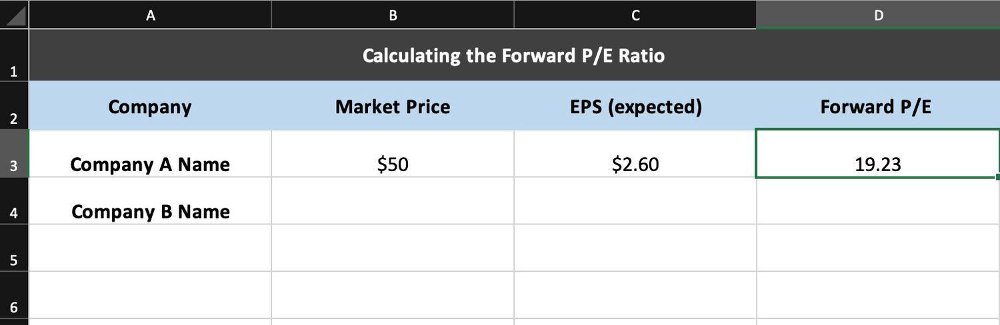

Forward rates play a crucial role in financial markets by providing insights into expected future interest rates. They represent the interest rate agreed upon today for a loan that will commence at a future date. This concept is central to understanding the dynamics of interest rate markets and is especially relevant when dealing with interest rate derivatives and fixed-income securities.

Calculating forward rates involves the use of current market-forward pricing structures and interest rate yield curves. Essentially, forward rates are derived from spot rates, which are the interest rates of financial instruments for different maturities. A common method used in these calculations is through the concept of zero-coupon bonds—a type of bond that does not make periodic interest payments, or "coupon payments," but is instead issued at a discount and redeemed at face value.



The significance of forward rates lies in their predictive value; they are used to estimate market expectations of interest rates over different time horizons. This is critical for investors and financial institutions in managing risk, valuing future cash flows, and constructing hedging strategies.

Algorithmic trading has transformed the way financial calculations, including forward rates, are executed. In algorithmic trading, financial computations are automated, enhancing trading efficiency and speed. Excel provides a robust platform for performing these intricate calculations due to its accessibility and rich array of functions. With its built-in tools, users can compute forward rates by utilizing financial data and embedding mathematical operations directly into spreadsheets.

Excel allows users to adopt a structured approach to financial calculations. For instance, calculating a forward rate between two time periods can be accomplished using the following formula:

$$

\text{Forward Rate} = \left(\frac{(1+\text{Spot Rate for Longer Period})^{\text{Longer Period}}}{(1+\text{Spot Rate for Shorter Period})^{\text{Shorter Period}}}\right)^{\frac{1}{\text{Difference in Periods}}} - 1
$$

where "Spot Rate for Longer/Shorter Period" refers to spot interest rates associated with the respective time frames.

The objective of this article is to equip readers with the knowledge to perform forward rate calculations using Excel and apply these in [algorithmic trading](/wiki/algorithmic-trading) strategies. By mastering the integration of forward rate computations and leveraging Excel's capabilities, traders can enhance their predictive models, optimize investment returns, and make informed decisions with a strategic advantage in the financial markets.

## Table of Contents

## Understanding Forward Rate Calculations

Forward rates are pivotal in financial markets as they enable market participants to predict future interest rates and prices of financial instruments. Essentially, a forward rate is the [interest rate](/wiki/interest-rate-trading-strategies) agreed upon today for a loan or investment that will occur at a specific future date. One of the primary financial instruments used in the calculation of forward rates is the zero-coupon bond.

### Concept of Forward Rates

A forward rate is derived from the spot rate, which is the current interest rate for immediate transactions. A forward rate serves as a projection of future spot rates. It represents the break-even interest rate that makes an investment in a longer-term bond equivalent to rolling over shorter-term bonds.

### Zero-Coupon Bonds and the Yield Curve

Zero-coupon bonds are debt securities that do not pay periodic interest. Instead, they are issued at a discount to their face value and mature at the par value. The yield on a zero-coupon bond can be used to construct a zero-coupon yield curve, which is essential for calculating forward rates. This curve represents the relationship between the yield on zero-coupon bonds and their maturities.

The yield curve usually demonstrates the term structure of interest rates. From it, we can derive forward rates, which help forecast interest rates and guide investment decisions.

### Calculating Forward Rates

The forward rate between two periods can be derived using spot rates. Suppose $R(t_1)$ and $R(t_2)$ are the spot rates for $t_1$ and $t_2$ years, respectively. The forward rate $F(t_1, t_2)$ is calculated as follows:

$$
F(t_1, t_2) = \left(\frac{(1 + R(t_2))^{t_2}}{(1 + R(t_1))^{t_1}}\right)^{1/(t_2-t_1)} - 1
$$

### Step-by-Step Calculation Example

#### Example:

1. **Determine Spot Rates**: Assume spot rates are $R(1) = 2\%$ for one year, and $R(2) = 3\%$ for two years.

2. **Convert Spot Rates**: Convert these rates into their effective compound interest form:
   - $(1 + R(1)) = 1.02$
   - $(1 + R(2)) = 1.03$

3. **Compute Forward Rate**: Use the formula for forward rates:
$$
   F(1, 2) = \left(\frac{1.03^2}{1.02^1}\right)^{1/(2-1)} - 1

$$

   Simplifying the equation:
$$
   F(1,2) = \left(\frac{1.0609}{1.02}\right) - 1 = 0.04 \text{ or } 4\%

$$

Thus, the forward rate for the period between the end of the first year and the end of the second year is 4%.

### Impact of Forward Rates

Calculating forward rates is crucial as they influence future interest rate predictions. Traders and analysts rely on them for optimizing investment portfolios and managing interest rate risks. Understanding and utilizing forward rates effectively can significantly enhance decision-making processes in finance. By leveraging zero-coupon bonds and the yield curve, forward rates provide valuable insights into future interest rate movements, aiding strategic financial planning.

## Calculating Forward Rates in Excel

**Calculating Forward Rates in Excel**

Calculating forward rates in Excel requires a comprehensive understanding of financial mathematics and proficiency in using Excel's built-in functions. Forward rates are crucial for analyzing financial markets as they anticipate future interest rates and determine the pricing of various financial instruments. Below, we present a systematic guide to setting up forward rate calculations in Excel, detailing the necessary inputs, formulas, and functions used in this process.

### Basic Excel Functions for Financial Calculations

Excel serves as an effective tool for financial calculations, thanks to its array of built-in functions. For forward rate calculations, the primary functions you will utilize are MULTIPLICATION (`*`) and DIVISION (`/`). These functions are essential for manipulating interest rates and computing the resultant forward rates.

- **Multiplication (`*`)**: Often used to calculate compound interest or to scale up investment amounts over multiple periods.

- **Division (`/`)**: Typically employed to determine ratios, such as finding the proportional change in interest rates over time.

### Setting Up the Spreadsheet

To begin calculating forward rates in Excel, the spreadsheet must be structured logically to accommodate all necessary data inputs:

#### Required Inputs

1. **Initial Investments**: Enter the monetary amount of the initial investment in the designated cell (e.g., cell A2).

2. **Spot Rates**: Provide the spot interest rates for relevant time periods. Each period's rate can occupy a separate row or column (e.g., cells B2 to B5).

3. **Time Periods**: Clearly label the different time periods across which the rates will apply (e.g., columns C1 to C4).

### Walkthrough of Formula Examples

#### Computing Final Values for Investment Periods

To compute the future value of an investment over multiple periods, use the formula for compound interest:

$$
\text{Future Value} = \text{Initial Investment} \times (1 + \text{Rate})^{\text{Number of Periods}}
$$

In Excel, if the initial investment is in cell A2, and the period rate is in B2, the formula would be:

```excel
=A2 * (1 + B2)^C2
```

This formula can be copied across consecutive cells to calculate values for successive periods, given that the rates and periods are outlined.

#### Deriving Forward Rates

The forward rate can be derived from spot rates. For instance, to compute the forward rate between periods $n$ and $m$, the formula is:

$$
f(m,n) = \left( \frac{\left(1 + r_m\right)^m}{\left(1 + r_n\right)^n} \right)^{\frac{1}{m-n}} - 1
$$

Where:
- $r_n$ and $r_m$ are the spot rates for periods $n$ and $m$, respectively.

In Excel, assuming $r_n$ is in cell B2, and $r_m$ in B3, for periods n and m located in cells C2 and C3, the formula will be:

```excel
=( (1 + B3)^C3 / (1 + B2)^C2 )^(1/(C3-C2)) - 1
```

This formula accurately computes the forward rate for periods between $n$ and $m$.

### Visualizing Data in Excel

While it is not a requirement, creating graphs and charts can be beneficial for visualizing the trends in forward rates over different periods. Excel's chart functions allow users to portray these calculations graphically, making it easier to interpret fluctuations in forward rates resulting from changing market conditions.

In conclusion, by setting up a detailed spreadsheet and utilizing Excel's computation functions, users can efficiently calculate forward rates. These calculations are integral for forecasting and decision-making in financial markets. Utilizing the structured approach outlined here will enhance accuracy and reliability in forward rate estimations.

## Integrating Forward Rates into Algorithmic Trading

Forward rate calculations play a crucial role in algorithmic trading strategies by providing insights into future interest rates. This information helps traders forecast better investment decisions, directly influencing the dynamic environment of financial markets. The incorporation of forward rates into trading strategies can significantly enhance their effectiveness by offering a more reliable basis for future financial predictions.

To utilize forward rates in algorithmic trading, it is essential to develop strategies that integrate these rates into decision-making processes. For example, a strategy may use forward rates to assess the yield curve, which indicates expected changes in interest rates over different time horizons. Traders can leverage this information to adjust their positions in fixed-income securities or derivatives accordingly.

### Example Strategy: Yield Curve Analysis

A typical algorithmic strategy might involve analyzing shifts in the yield curve obtained from forward rates data. Assume we have forward rates for various maturities obtained through Excel calculations. The strategy aims to capitalize on anticipated movements by taking positions in interest rate derivatives, such as futures or options on Treasury bonds.

1. **Data Collection**: First, compile historical forward rates using Excel. These can be derived from the spot rates of zero-coupon bonds or interest rate swaps.

2. **Signal Generation**: Analyze the forward rates to detect trends or changes in the curve. A steepening yield curve may indicate rising future rates, prompting a short position in long-duration assets. Conversely, a flattening curve might suggest falling future rates, advising a long position.

3. **Position Adjustment**: Use the forward rate trends to adjust positions in corresponding futures or options. This involves buying or selling contracts based on the previously generated signals.

4. **Simulation and Execution**: Excel can be utilized to simulate these strategies. By incorporating forward rates as inputs, traders can test various scenarios and optimize their portfolios. Python code can further automate the execution phase, interfacing directly with trading platforms to buy or sell the predicted number of contracts.

```python
import pandas as pd

# Assuming `forward_rates_df` is a DataFrame containing forward rates
def yield_curve_strategy(forward_rates_df):
    signals = []
    for index, rates in forward_rates_df.iterrows():
        if rates['Long-term Rate'] > rates['Short-term Rate']:
            signals.append('short_long_duration')
        else:
            signals.append('long_short_duration')
    return signals

# Generate signals based on forward rate data
signals = yield_curve_strategy(forward_rates_df)

# Outputs are signals which tell what positions to take in the market
```

### Benefits of Using Forward Rates

The integration of forward rates into trading algorithms offers several advantages. These include:

- **Enhanced Predictive Models**: By incorporating expectations of future interest rate changes, traders can refine their predictive models, leading to more informed decisions.

- **Optimization of Investment Returns**: Forward rates provide critical insights into the cost of future borrowing or returns, enabling traders to optimize their portfolios for anticipated market conditions.

- **Risk Management**: Strategies incorporating forward rates allow for better risk assessment, given their ability to forecast changes in economic conditions and interest rate policies.

Ultimately, incorporating forward rate calculations into algorithmic trading improves the robustness and accuracy of decision-making processes, offering traders a more substantial foundation on which to base their investment strategies. This intersection of financial analytics and algorithmic execution empowers traders to navigate the complexities of financial markets with greater precision.

## Using Excel for Algorithmic Trading

Excel has emerged as a valuable tool in the development and implementation of algorithmic trading strategies, offering a user-friendly interface for both novice and experienced traders. This section provides an overview of how Excel can be utilized to backtest trading strategies, its integration with real-time data sources for live trading signals, and essential functions that facilitate algorithmic decision-making.

### Backtesting Trading Strategies with Excel

Backtesting is a critical step in algorithmic trading, allowing traders to evaluate how a strategy would have performed using historical data. Excel's versatility makes it an excellent platform for this purpose, as it offers built-in data manipulation tools that can help simulate trading scenarios. The key advantage of using Excel for [backtesting](/wiki/backtesting) is its accessibility—many traders are already familiar with its interface, allowing them to readily input historical data and test hypotheses without needing advanced programming knowledge.

However, Excel also has limitations. Its performance may decline with very large datasets, and complex strategies could require extensive manual setup. For strategies requiring intricate calculations or handling extensive historical data, more specialized software or programming languages such as Python might be preferable.

### Real-Time Data Integration

In live trading environments, accessing up-to-date market information is imperative. Excel can be integrated with data sources like Yahoo! Finance to import real-time market data. This is typically achieved using external data connections:

1. **Web Queries**: Excel allows users to pull data directly from the web. By creating a query connected to a Yahoo! Finance URL, traders can import updated stock prices and other financial metrics into their workbooks.

2. **APIs and Add-Ins**: Several third-party tools and APIs facilitate real-time data linkage between Excel and trading platforms. These APIs can execute in real-time, refreshing data as it changes, thus enabling timely trading decisions.

### Excel Functions for Algorithmic Trading

Excel is equipped with numerous functions that streamline the process of creating algorithmic trading strategies. Some core functions include:

- **Logical Functions**:
  - **IF(condition, value_if_true, value_if_false)**: This function is pivotal for strategy development, allowing for conditional decision-making based on specific criteria.
  - **AND & OR**: These functions enable compound logical conditions, essential for creating complex rule-based strategies. For example, =IF(AND(A1 > 0, B1 < 1), "Buy", "Sell") can encapsulate conditions for a trade signal.

- **Mathematical Functions**:
  - **SUM, AVERAGE, STDDEV**: Useful for calculating moving averages or volatility, these functions can form the basis of many technical indicators used in trading.
  - **VLOOKUP and INDEX/MATCH**: Facilitate data retrieval from structured datasets or simulate trading scenarios by matching stock names or tickers with their respective data points.

### Conclusion

Excel remains a strong contender in the algorithmic trading toolkit due to its simplicity and comprehensive suite of functions. While its utility is somewhat limited by the scale and complexity of the data, it remains a valuable starting point for traders developing and testing strategies. For those seeking to integrate real-time data and basic trading logic, Excel offers a solid foundation, setting the stage for more advanced utilizations, such as custom algorithms or larger-scale computations in other programming environments.

## Advanced Excel Techniques for Traders

Advanced Excel techniques significantly enhance the capabilities of algorithmic trading by enabling traders to create more precise and efficient models. One fundamental aspect of Excel that traders utilize is the concept of relative and absolute cell referencing, which plays a critical role in coding trading strategies.

Relative cell referencing adjusts automatically when a formula is copied to another cell, making it ideal for replicating the same computation across multiple datasets efficiently. Conversely, absolute cell referencing remains constant, regardless of where the formula is moved or copied, providing stability for values that must remain unchanged across calculations. For instance, if an algorithm requires a fixed interest rate across multiple rows, absolute referencing ensures this value persists, which is crucial for maintaining the integrity of financial models.

The power of Excel in trading strategy coding extends considerably when multiple functions are combined to handle complex decision-making scenarios. Functions such as VLOOKUP, INDEX, and MATCH allow traders to efficiently search and retrieve data from large datasets, a typical requirement in financial analysis. When combined with logical functions like IF, AND, and OR, they provide powerful decision-making capabilities. For example, a trader might use a combination of VLOOKUP with IF statements to automatically decide whether to buy or sell based on threshold analysis of historic price patterns.

Advanced Excel techniques have been successfully employed in real-world cases of algorithmic trading. Consider a case where traders used Excel to automate stock selection based on short-term moving averages intersecting with long-term moving averages. By using Excel's OFFSET function in conjunction with the AVERAGE function, traders calculate moving averages dynamically over specified periods. Here's a simplified example of how this might be implemented using pseudo-code:

```plaintext
=IF((AVERAGE(OFFSET(B2,0,0,5,1)) > AVERAGE(OFFSET(B2,0,0,20,1))), "BUY", "SELL")
```

This formula checks if the 5-day moving average exceeds the 20-day moving average, suggesting a 'BUY' signal if true, or 'SELL' otherwise, thus automating a key decision-making step.

One significant case study involves using Excel's Solver tool for optimizing asset allocation. By setting constraints and objectives in the Solver, traders could find the most efficient portfolio composition that maximizes returns while minimizing risk according to certain risk tolerance levels. This technique showcases how leveraging Excel's advanced capabilities can lead to better-informed and quicker investment decisions.

In summary, advanced Excel techniques empower traders to develop robust algorithmic trading strategies. By mastering relative and absolute cell referencing, effectively combining multiple functions for complex scenarios, and applying these skills in real-world contexts, traders can harness Excel’s full potential to optimize trading performance.

## Conclusion

Mastering forward rate calculations in Excel is a crucial skill for professionals in the financial markets. This proficiency enables more accurate predictions of future interest rates, impacting investment strategies and financial instruments such as bonds and interest rate derivatives. By effectively leveraging forward rates, traders and analysts can optimize their investment strategies, improving the potential for better returns.

Excel's powerful computational capabilities make it an indispensable tool in algorithmic trading. It facilitates detailed financial calculations, such as forward rates, which are pivotal for making informed trading decisions. Its user-friendly interface and wide array of functions allow traders to perform complex analyses without needing extensive programming knowledge. Excel aids in constructing predictive models that can analyze trends and patterns in financial data, thereby enhancing decision-making processes.

For those interested in furthering their knowledge, a wealth of resources is available. Online courses, financial blogs, and [books](/wiki/algo-trading-books) on financial modeling offer in-depth insights into using Excel for market analysis. Additionally, experimenting with Excel-based models provides practical experience in real-world financial scenarios, solidifying one's understanding of market dynamics and enhancing analytical skills. By continually refining these skills, professionals can stay ahead in the ever-evolving landscape of financial markets.

## References & Further Reading

[1]: ["Advanced Modelling in Finance Using Excel and VBA"](https://www.oreilly.com/library/view/advanced-modelling-in/9780471499220/) by Mary Jackson and Mike Staunton

[2]: ["Excel Modeling in Investments"](https://www.pearson.com/en-us/subject-catalog/p/excel-modeling-in-investments/P200000005923/9780205987245) by Craig W. Holden

[3]: ["Financial Modeling"](https://en.wikipedia.org/wiki/Financial_modeling) by Simon Benninga

[4]: ["Principles of Financial Engineering"](https://www.sciencedirect.com/book/9780123735744/principles-of-financial-engineering) by Robert Kosowski and Salih N. Neftci

[5]: ["Mathematics for Finance: An Introduction to Financial Engineering"](https://link.springer.com/book/10.1007/b97511) by Marek Capinski and Tomasz Zastawniak