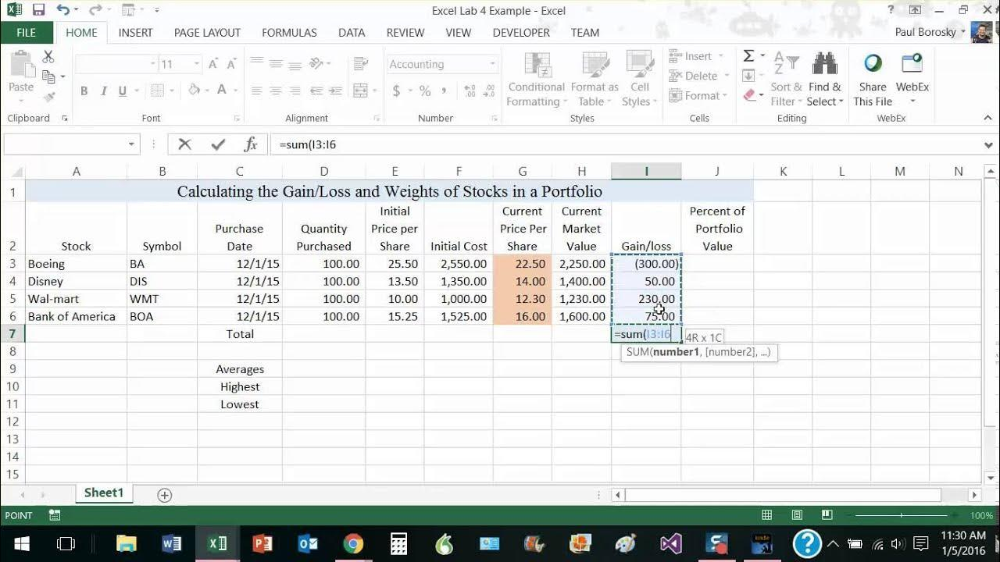

## Table of Contents

## What is the basic concept of gain and loss on stocks?

When you buy stocks, you hope their price will go up so you can sell them for more money than you paid. The difference between the price you sell the stock for and the price you bought it for is called the gain. If the stock price goes up, you make a gain. For example, if you buy a stock for $10 and sell it for $15, your gain is $5 per share.

On the other hand, if the stock price goes down after you buy it, and you sell it for less than you paid, you experience a loss. The loss is the difference between the price you paid and the lower price you sold it for. For instance, if you buy a stock for $10 and sell it for $8, your loss is $2 per share. Understanding gains and losses is important for managing your investments and knowing when to buy or sell stocks.

## How do you calculate the gain or loss on a single stock transaction?

To calculate the gain or loss on a single stock transaction, you need to know two things: the price you bought the stock for and the price you sold it for. If you sold the stock for more than you bought it, you have a gain. To find out how much, subtract the buying price from the selling price. For example, if you bought a stock for $50 and sold it for $60, your gain would be $60 - $50 = $10 per share.

If you sold the stock for less than you bought it, you have a loss. To figure out the loss, subtract the selling price from the buying price. For instance, if you bought a stock for $50 and sold it for $40, your loss would be $50 - $40 = $10 per share. This simple calculation helps you understand how much money you made or lost on each stock you trade.

## What is the difference between realized and unrealized gains or losses?

Realized gains or losses are the money you actually make or lose when you sell a stock. If you buy a stock for $10 and sell it for $15, you have a realized gain of $5. If you sell it for $8 instead, you have a realized loss of $2. These gains or losses are "real" because they happen when you complete the transaction and the money changes hands.

Unrealized gains or losses, on the other hand, are the money you would make or lose if you sold a stock right now, but you haven't sold it yet. If you buy a stock for $10 and it goes up to $15, but you don't sell it, you have an unrealized gain of $5. If the stock goes down to $8 and you still don't sell it, you have an unrealized loss of $2. These are called "unrealized" because they are potential gains or losses that only become real if you decide to sell the stock.

## How can you calculate the percentage gain or loss on a stock?

To calculate the percentage gain or loss on a stock, you need to know the price you bought the stock for and the price you sold it for, or the current price if you haven't sold yet. First, find out the gain or loss by subtracting the buying price from the selling price or current price. Then, divide that number by the buying price. Finally, multiply the result by 100 to turn it into a percentage. For example, if you bought a stock for $50 and sold it for $60, the gain is $60 - $50 = $10. Then, $10 divided by $50 is 0.2, and 0.2 times 100 is 20. So, you had a 20% gain.

If you want to calculate an unrealized percentage gain or loss, the process is the same, but you use the current price of the stock instead of the selling price. For instance, if you bought a stock for $50 and it's now worth $40, the unrealized loss is $40 - $50 = -$10. Then, -$10 divided by $50 is -0.2, and -0.2 times 100 is -20. So, you have an unrealized loss of 20%. Knowing how to calculate these percentages helps you understand how well your investments are doing.

## What are capital gains and how are they taxed?

Capital gains are the profits you make when you sell something for more than you paid for it. This can happen when you sell stocks, real estate, or other investments. When you sell an asset for more than its purchase price, the difference is your capital gain. For example, if you bought a stock for $100 and sold it for $150, your capital gain is $50. Capital gains can be short-term if you owned the asset for a year or less, or long-term if you owned it for more than a year.

The tax on capital gains depends on how long you held the asset and your income level. Short-term capital gains are taxed as regular income, which means they are added to your other income and taxed at your normal income tax rate. Long-term capital gains, on the other hand, have their own tax rates, which are usually lower than regular income tax rates. For most people, long-term capital gains are taxed at 0%, 15%, or 20%, depending on their total taxable income. Knowing the difference between short-term and long-term capital gains can help you plan when to sell your investments to minimize your taxes.

## How do short-term and long-term capital gains differ in terms of taxation?

Short-term capital gains are profits you make from selling things like stocks or property that you owned for a year or less. When you have short-term gains, you add them to your other income, like your salary, and then you pay taxes on all of that at your regular income tax rate. This rate can be higher, depending on how much money you make in total. So, if you sell an investment quickly and make a profit, you might have to pay more in taxes than if you waited longer.

Long-term capital gains are profits from selling things you owned for more than a year. These gains are taxed differently and usually at a lower rate than short-term gains. Most people pay 0%, 15%, or 20% on long-term capital gains, depending on their income. This means if you hold onto your investments for over a year before selling, you could pay less in taxes on the money you make. Knowing this can help you decide when to sell your investments to save on taxes.

## What is the cost basis of a stock and how does it affect gain and loss calculations?

The cost basis of a stock is the price you paid to buy it, plus any fees or commissions you paid to make the purchase. It's important because it's what you use to figure out if you made money or lost money when you sell the stock. For example, if you bought a stock for $10 and paid a $1 fee, your cost basis would be $11. When you sell the stock, you compare the selling price to this cost basis to see your gain or loss.

If you sell the stock for more than your cost basis, you have a gain. Let's say you sell the stock for $15. You subtract your cost basis of $11 from the $15 selling price, which gives you a gain of $4. If you sell the stock for less than your cost basis, you have a loss. For instance, if you sell it for $9, you subtract $9 from your $11 cost basis, which gives you a loss of $2. Knowing your cost basis helps you understand exactly how much money you made or lost on your investment.

## How do stock splits and dividends impact the calculation of gains and losses?

When a company does a stock split, it makes the stock cheaper by giving you more shares for the same total value. For example, in a 2-for-1 split, if you had 100 shares at $50 each, you would now have 200 shares at $25 each. Your total investment value stays the same, but the price per share changes. This means you need to adjust your cost basis. If your original cost basis was $50 per share, after a 2-for-1 split, your new cost basis would be $25 per share. When you sell the stock, you use this new cost basis to figure out your gain or loss. So, stock splits don't change your total gain or loss, but they change how you calculate it based on the new number of shares and the new price per share.

Dividends are payments companies give to shareholders, usually in cash or more shares. If you get cash dividends, you don't need to change your cost basis. But if you get dividends in the form of more shares, called stock dividends, you do need to adjust your cost basis. For example, if you get a 5% stock dividend, you get 5 more shares for every 100 shares you own. You need to spread your original cost basis over the new total number of shares. This means your cost basis per share goes down a little bit. When you sell your shares, you use this adjusted cost basis to calculate your gain or loss. So, like stock splits, stock dividends change how you figure out your gain or loss, but they don't change the total amount of gain or loss you have.

## What are wash sales and how do they affect the calculation of losses?

A wash sale happens when you sell a stock at a loss and then buy the same or a very similar stock within 30 days before or after the sale. When this happens, the IRS says you can't use that loss to lower your taxes right away. Instead, you have to add the loss to the cost basis of the new stock you bought. This means you'll use a higher cost basis when you sell the new stock later, which could make your gain smaller or your loss bigger when you finally sell it.

For example, if you bought a stock for $100 and sold it for $80, you would have a $20 loss. But if you buy the same stock again within 30 days, that $20 loss doesn't count right away. You add it to the price of the new stock. So, if you buy the stock again for $90, your new cost basis becomes $110 ($90 + $20). When you sell this new stock, you'll use $110 as your cost basis to figure out your gain or loss. This rule is meant to stop people from selling stocks just to get tax benefits and then quickly buying them back.

## How can you use portfolio accounting to track gains and losses across multiple stocks?

Portfolio accounting is a way to keep track of all your stocks and investments in one place. It helps you see how much money you're making or losing from all your stocks together. You start by writing down the price you paid for each stock and how many shares you bought. Every time you buy or sell a stock, you update your records. This way, you can see the total value of your investments and figure out your gains or losses by comparing what you paid to what your stocks are worth now.

Using portfolio accounting, you can also keep track of things like dividends and stock splits. When you get dividends or your stocks go through a split, you adjust your records to reflect these changes. This helps you know your new cost basis for each stock. By keeping everything up to date, you can easily calculate your overall gains and losses across all your stocks. This makes it simpler to understand how well your whole investment portfolio is doing.

## What advanced strategies can be used to minimize tax liabilities on stock gains?

One way to lower your taxes on stock gains is to hold onto your investments for more than a year. If you do this, your profits are considered long-term capital gains, which are usually taxed at a lower rate than short-term gains. Instead of paying your regular income tax rate, you might pay 0%, 15%, or 20% on your gains, depending on how much money you make. This can save you a lot of money in taxes. Another strategy is to use tax-loss harvesting. This means selling stocks that have gone down in value to get a tax break on those losses. You can use these losses to reduce the taxes you owe on your gains. It's like using one part of your investments to help another part.

Another helpful strategy is to invest in tax-advantaged accounts like IRAs or 401(k)s. When you put money into these accounts, you don't pay taxes on the gains until you take the money out, which could be years later. This can help your investments grow more because you're not losing money to taxes every year. Also, consider gifting stocks to family members or charities. If you give stocks to a family member in a lower tax bracket, they might pay less in taxes when they sell the stocks. And if you give stocks to a charity, you can get a tax deduction for the value of the stocks, which can lower your overall tax bill.

## How do you account for gains and losses in a multi-currency investment portfolio?

When you have investments in different currencies, you need to keep track of the value of each currency to figure out your gains and losses. Let's say you bought stocks in dollars and euros. You start by writing down how much you paid for each stock in its own currency. Then, you need to convert those amounts to a single currency, like your home currency, to see the total value of your portfolio. Every time the exchange rates change, you update the values. This way, you can see if your investments are going up or down in value when you look at everything in one currency.

For example, if you bought a stock for 100 euros and the exchange rate was 1 euro = 1.1 dollars, your cost basis in dollars would be 110 dollars. If the stock goes up to 120 euros and the exchange rate changes to 1 euro = 1.2 dollars, the stock's value in dollars would be 144 dollars. To find your gain, you subtract your cost basis of 110 dollars from the new value of 144 dollars, which gives you a gain of 34 dollars. By keeping track of these changes, you can understand how currency fluctuations affect your overall gains and losses across your multi-currency investment portfolio.

## What are Investment Calculation Techniques?

Investment calculation is fundamental in evaluating the potential risk-return trade-off of any financial decision. It equips investors with the tools to measure and anticipate the viability and profitability of their investments. Key metrics and methods like Return on Investment (ROI), Compound Annual Growth Rate (CAGR), Net Present Value (NPV), and Internal Rate of Return (IRR) are commonly employed to analyze and interpret investment performance.

Return on Investment (ROI) is a straightforward metric calculated as the ratio of net profit to the initial investment cost. It provides a direct measure of the profitability of an investment. The formula for ROI is:

$$
\text{ROI} = \left( \frac{\text{Gain from Investment} - \text{Cost of Investment}}{\text{Cost of Investment}} \right) \times 100
$$

For example, if an investor buys shares worth $1,000 and sells them for $1,200, the ROI would be $\left( \frac{200}{1000} \right) \times 100 = 20\%$.

The Compound Annual Growth Rate (CAGR) is used to calculate the mean annual growth rate of an investment over a specified time period longer than one year. It is represented by the formula:

$$
\text{CAGR} = \left( \frac{\text{Ending Value}}{\text{Beginning Value}} \right)^{\frac{1}{n}} - 1
$$

where $n$ is the number of years. For example, if an investment grows from $10,000 to $15,000 over three years, the CAGR would be $\left( \frac{15000}{10000} \right)^{\frac{1}{3}} - 1 = 0.1447$ or 14.47%.

Net Present Value (NPV) assesses the profitability of an investment by considering the present value of incoming and outgoing cash flows, using a specified discount rate. The formula for NPV is:

$$
\text{NPV} = \sum_{t=0}^{n} \frac{R_t}{(1+i)^t}
$$

where $R_t$ is the net cash inflow-outflows during a single period $t$, $i$ is the discount rate, and $n$ is the number of periods. A positive NPV indicates that projected earnings (in present dollars) exceed the anticipated costs, thus a favorable investment opportunity.

The Internal Rate of Return (IRR) is the discount rate at which the NPV of all cash flows (both positive and negative) from an investment equal zero. IRR is used to evaluate the attractiveness of a project or investment. While solving for IRR computationally involves iterative trial and error, in Python, the `numpy` package offers a convenient method, `numpy.irr()`, to find IRR.

Example Python code to calculate IRR can be written as follows:

```python
import numpy as np

cash_flows = [-1000, 200, 300, 400, 550]  # Initial investment and subsequent cash flows
irr = np.irr(cash_flows)
print(f"The IRR is {irr:.2%}")
```

These metrics support investors in making informed decisions by providing insights into profitability, growth potential, and the overall value proposition of investment projects. Understanding and effectively applying these techniques allows investors to confidently navigate complex financial landscapes, optimizing their investment outcomes.

 to Algorithmic Trading

Algorithmic trading, commonly known as algo trading, utilizes sophisticated mathematical models and algorithms to make high-frequency trading decisions. This approach significantly reduces the need for human intervention, making trading activities faster and more efficient. The primary advantage of [algorithmic trading](/wiki/algorithmic-trading) is its ability to execute orders at speeds and frequencies that are impossible for human traders, allowing for timely exploitation of market opportunities.

**Types of Algorithms Used in Algo Trading:**

1. **Market Making**: In market-making algorithms, the system simultaneously offers buy and sell orders to capture the bid-ask spread. This approach ensures liquidity and capitalizes on price discrepancies.

2. **Statistical Arbitrage**: Statistical arbitrage involves the use of complex statistical models to identify and exploit price inefficiencies between correlated securities. By leveraging statistical patterns, traders can execute numerous small trades with potentially profitable outcomes.

3. **High-Frequency Trading (HFT)**: HFT algorithms focus on rapid execution of numerous orders within milliseconds. These systems aim to capitalize on minute-by-minute changes in stock prices, thus requiring highly sophisticated computational resources.

**Advantages of Algorithmic Trading:**

- **Reduced Trading Costs**: By automating trading processes, algo trading decreases the costs associated with manual trading, such as commissions and fees due to the increased volume of transactions handled without the need for a human broker.

- **Enhanced Accuracy**: Algorithms can analyze vast datasets and identify trading signals with heightened precision. This reduces the margin of error compared to human decision-making, which could be influenced by emotion or fatigue.

In summary, algorithmic trading revolutionizes the financial markets by automating the trading process, allowing for quick reaction times to market changes and enabling the execution of strategies that would be unfeasible for human traders to perform manually. Through the use of diverse types of algorithms, algo trading not only optimizes trading efficiency but also enhances decision-making accuracy, offering significant advantages in the highly competitive trading environment.

## References & Further Reading

[1]: Bergstra, J., Bardenet, R., Bengio, Y., & Kégl, B. (2011). ["Algorithms for Hyper-Parameter Optimization."](https://papers.nips.cc/paper/4443-algorithms-for-hyper-parameter-optimization) Advances in Neural Information Processing Systems 24.

[2]: ["Advances in Financial Machine Learning"](https://www.amazon.com/Advances-Financial-Machine-Learning-Marcos/dp/1119482089) by Marcos Lopez de Prado

[3]: ["Evidence-Based Technical Analysis: Applying the Scientific Method and Statistical Inference to Trading Signals"](https://www.amazon.com/Evidence-Based-Technical-Analysis-Scientific-Statistical/dp/0470008741) by David Aronson

[4]: ["Machine Learning for Algorithmic Trading"](https://github.com/stefan-jansen/machine-learning-for-trading) by Stefan Jansen

[5]: ["Quantitative Trading: How to Build Your Own Algorithmic Trading Business"](https://www.amazon.com/Quantitative-Trading-Build-Algorithmic-Business/dp/1119800064) by Ernest P. Chan